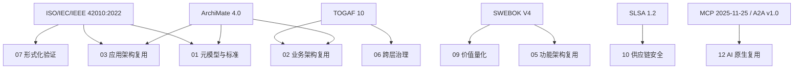
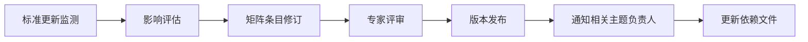

# 核心标准对齐矩阵

> **版本**: 2026-07-08
> **定位**: 将本知识体系的 13 个主题与权威国际标准对齐

---

## 1. 标准族谱

```text
ISO/IEC/IEEE 42010:2022 (架构描述)
        │
        ├── ISO/IEC/IEEE 42020:2019 (架构过程)
        ├── ISO/IEC/IEEE 42030:2019 (架构评估)
        ├── ISO/IEC 25010:2023 (产品质量模型)
        ├── ISO/IEC 26550:2015 (产品线工程)
        └── ISO/IEC/IEEE 15289:2019 (信息项)

TOGAF 10 (企业架构) ──→ ArchiMate 3.2/4.0 (架构建模语言)

SLSA 1.2 (供应链安全)
        │
        ├── SPDX ISO/IEC 5962
        ├── CycloneDX OWASP
        ├── SWID ISO/IEC 19770-2
        └── in-toto

IEC 63278 (AAS) 系列
        │
        ├── IEC 63278-1:2023 (AAS 结构)
        ├── IEC 63278-2 (信息元模型，DIS ballot / 开发中；预计 2026 下半年 PRVC，2026 末–2027 初正式发布)
        ├── IEC 63278-3 (安全，开发中)
        ├── IEC 63278-4 (用例，开发中)
        ├── IEC 63278-5 (接口，规划中)
        └── OPC UA FX (Parts 80-84)

MCP 2025-11-25 / A2A v1.0 (AI 原生协议)
        │
        ├── Linux Foundation Agentic AI Foundation
        ├── OAuth 2.1 (RFC 9728, RFC 8707)
        └── OWASP LLM/MCP/Agentic AI Top 10
```

---

## 2. 主题-标准对齐矩阵

| 主题 | 核心标准 | 辅助标准 | 状态 |
|------|---------|---------|------|
| 01 元模型与标准 | ISO 42010:2022, ISO 25010:2023, ISO 26550 | TOGAF 10, ArchiMate, SWEBOK V4 | ✅ 已对齐 |
| 02 业务架构 | TOGAF 10, ArchiMate BPMN, DMN, FEA | ISO 42010, BRM | ✅ 已对齐 |
| 03 应用架构 | TOGAF 10, ArchiMate ISO 25010 | OpenAPI, AsyncAPI | ✅ 已对齐 |
| 04 组件架构 | ISO 26550, UML | GoF, SemVer, SBOM | ✅ 已对齐 |
| 05 功能架构 | ISO 25010, SWEBOK | BPMN, DMN | ✅ 已对齐 |
| 06 跨层治理 | COBIT, ITIL, ISO 330xx | FinOps, CMMI | ✅ 已对齐 |
| 07 形式化验证 | TLA+, Alloy, Coq, Isabelle | SPARK Ada, B Method, RustBelt | ✅ 已对齐 |
| 08 认知架构 | ACT-R, BDI, Cognitive Load Theory | AI 认知增强 | ✅ 已对齐 |
| 09 价值量化 | COCOMO II, ROI/NPV | FinOps, Strategic Value | ✅ 已对齐 |
| 10 供应链安全 | SLSA 1.2, NIST SSDF 1.2, EU CRA | SPDX, CycloneDX, SWID, in-toto | ✅ 已对齐 |
| 11 工业 IoT | IEC 63278, OPC UA FX, ISA-95 | IEC 61508, ISO 26262, IEC/IEEE 60802 | ✅ 已对齐 |
| 12 AI 原生复用 | MCP 2025-11-25, A2A v1.0 | OWASP LLM/MCP/Agentic AI | ✅ 已对齐 |
| 13 新兴趋势 | Platform Engineering, WebAssembly | RegTech AI, Rust Ecosystem | ✅ 已对齐 |

### 2.1 ISO 42020 条款映射示例

| ISO/IEC/IEEE 42020:2019 条款 | 过程名称 | 本框架对应过程/制品 |
|---|---|---|
| Clause 6 | Architecture Governance（架构治理） | `06-cross-layer-governance` 的治理策略与原则目录 |
| Clause 7 | Architecture Management（架构管理） | 本主题 `alignment-matrix.md` 的版本维护与状态跟踪 |
| Clause 8 | Architecture Conceptualization（概念化） | `02-business-architecture-reuse` 业务能力地图定义 |
| Clause 9 | Architecture Evaluation（评估） | `07-formal-verification` 质量门控与评估检查清单 |
| Clause 10 | Architecture Elaboration（细化） | `03-application-architecture-reuse` ABB→SBB 细化 |
| Clause 11 | Architecture Enablement（使能） | `04-component-architecture-reuse` 资产库与接口契约 |

### 2.2 ISO/IEC/IEEE 42010:2022 核心条款映射

| 条款 | 核心内容 | 架构描述元素 | 复用映射 |
|---|---|---|---|
| Clause 5.2 | 架构描述概念模型 | EoI、Stakeholder、Concern、Perspective、Aspect、Viewpoint、View、Model Kind、View Component、Correspondence、Decision/Rationale | 元模型资产复用的术语基础 |
| Clause 6.1–6.10 | AD 规约要求 | 识别 EoI、利益相关者、视角、关注点、视点、视图、视图组件、对应关系、决策与依据 | 组织级 AD 模板与检查清单 |
| Clause 7.1–7.2 | ADF / ADL 规约 | Architecture Description Framework、Architecture Description Language 的 conformance 要求 | TOGAF/ArchiMate/SysML 对齐基准 |
| Clause 8.1–8.3 | Viewpoint、Model Kind、View Method 规约 | 视点的关注点覆盖、模型种类的约定、视图方法 | 可复用视点库与模型种类目录 |

---

## 3. ISO 42010:2022 术语更新

> 2022 版关键术语变更：

| 2011 版 | 2022 版 | 说明 |
|---------|---------|------|
| System of Interest | **Entity of Interest (EoI)** | 扩展至非系统架构 |
| Architecture Framework | **Architecture Description Framework (ADF)** | 与评估框架区分 |
| Architecture Model | **Architecture View Component** | 更准确反映实践 |
| - | **Architecture Aspect** | 新增：架构方面 |
| - | **Stakeholder Perspective** | 新增：利益相关者视角 |
| - | **Architecture Description Element** | 新增：AD 元素 |

---

## 4. ISO 25010:2023 质量特性

| 特性 | 旧版名称 | 状态 |
|------|---------|------|
| Functional Suitability | 保持不变 | ✅ |
| Performance Efficiency | 保持不变 | ✅ |
| Compatibility | 保持不变 | ✅ |
| **Interaction Capability** | 替代 Usability | 🆕 |
| Reliability | 保持不变 | ✅ |
| Security | 保持不变 | ✅ |
| Maintainability | 保持不变 | ✅ |
| **Flexibility** | 替代 Portability | 🆕 |
| **Safety** | 新增 | 🆕 |

---

## 5. SLSA 1.2 轨道模型

| 轨道 | 等级 | 关键要求 |
|------|------|---------|
| Build Track | L1-L4 | Provenance → Hosted Build → Hardened → Reproducible |
| Source Track | L1-L3 | Version Control → Authenticated History → Two-Person Review |
| Attested Build Environments | L1+ | 构建环境认证 |

---

## 6. MCP 2025-11-25 vs A2A v1.0

| 维度 | MCP 2025-11-25 | A2A v1.0 |
|------|---------------|---------|
| 范围 | Agent ↔ Tool | Agent ↔ Agent |
| 关系 | Client-Server (Stateful) | Peer-to-Peer |
| 发现 | Server lists capabilities | Agent Card (/.well-known/agent.json) |
| 核心对象 | Tools, Resources, Prompts | Agent Card, Tasks, Messages, Artifacts |
| 流式 | Streamable HTTP / SSE | SSE |
| 认证 | OAuth 2.1 (RFC 9728/8707) | OAuth 2.1 + PKCE |
| 治理 | Linux Foundation AAIF | Linux Foundation |

---

> 最后更新: 2026-07-09
> 注意: 本矩阵将随标准更新持续维护；ISO 42010:2022 条款映射详见第 2.2 节。


---

> 本节以上内容为矩阵主干；以下两个补充块分别对矩阵本身进行元模型级补全（定义、属性、关系、正例、反例、形式化矩阵、权威来源与交叉引用）以及使用方法与维护流程说明。

## 补充：核心标准对齐矩阵的元模型说明与示例

> 本节对齐矩阵本身进行元模型级补全，包括定义、属性、关系、正例、反例、形式化矩阵、权威来源与交叉引用。
> 相关 Wikipedia 概念结构：
> [ISO/IEC/ISO/IEC/IEEE 42010:2022](https://en.wikipedia.org/wiki/ISO/IEC/IEEE_42010)、
> [TOGAF](https://en.wikipedia.org/wiki/The_Open_Group_Architecture_Framework)、
> [ArchiMate](https://en.wikipedia.org/wiki/ArchiMate)、
> [SWEBOK](https://en.wikipedia.org/wiki/Software_Engineering_Body_of_Knowledge)、
> [Ontology](https://en.wikipedia.org/wiki/Ontology_(information_science))。

### 1. 概念定义

**定义**：核心标准对齐矩阵是将本知识体系 13 个一级主题与权威国际标准、行业框架及最佳实践进行二维映射的结构化制品。它既是术语翻译器，也是复用资产的元模型锚点，确保跨组织、跨工具链、跨审计场景下的一致性。

### 2. 属性

| 属性 | 说明 | 可观察性 |
|------|------|----------|
| 主题维度完整性 | 行覆盖全部 13 个一级主题 | 高 |
| 标准维度完整性 | 列覆盖国际标准族、行业框架与协议 | 高 |
| 映射关系明确性 | 主对应 / 次对应 / 扩展关系标注清晰 | 高 |
| 版本追踪性 | 记录标准版本、更新日期与勘误 | 中 |
| 可验证性 | 每个条目均可追溯到标准条款或官方文档 | 中 |
| 可演进性 | 支持新增主题与标准版本的增量更新 | 中 |

### 3. 关系说明

- **上位概念**：元模型与标准对齐（本主题）是矩阵的宿主；国际标准族（ISO/IEC/IEEE 42010:2022 族）提供概念基础。
- **下位概念**：每一行映射条目可进一步展开为详细映射文档（如 TOGAF 详细映射、ArchiMate 映射）。
- **等价/映射概念**：矩阵中的“核心标准”列与“辅助标准”列形成主/次映射；例如 ISO/IEC/IEEE 42010:2022 与 TOGAF Content Framework 在架构描述元模型层面等价。
- **依赖概念**：矩阵依赖 [`iso-42010-2022.md`](./iso-42010-2022.md) 的术语定义、[`../02-togaf-10-alignment/detailed-mapping.md`](../02-togaf-10-alignment/detailed-mapping.md) 的方法论映射，以及 [`../04-archimate-4/archimate-iso-mapping.md`](../04-archimate-4/archimate-iso-mapping.md) 的语言映射。

### 4. 形式化/结构化分析

下图为标准族到主题的高阶映射关系：



### 示例

**正向示例**：某金融企业在建立企业架构资产库时，以本矩阵为索引：

- 主题 10“供应链安全”的主标准定位为 SLSA 1.2 与 NIST SSDF 1.2，辅助标准为 SPDX、CycloneDX、SWID、in-toto。
- 在引入开源组件时，团队直接依据矩阵要求生成 SBOM 并验证 SLSA Build Track 等级，使外部审计能够在 2 小时内确认合规性。
- 主题 02“业务架构复用”映射到 TOGAF ADM Phase B 与 ArchiMate 业务层，确保业务架构师与解决方案架构师使用同一套术语。

### 反例

**反模式**：某团队为“简化沟通”，自创“业务域 / 技术域 / 数据域”三分法，但未在矩阵中映射到 TOGAF/ArchiMate/FEA 的正式术语：

- 与外部审计交流时，“业务域”被误解为 TOGAF 的 Business Domain 或 FEA 的 Business Reference Model，产生语义偏差。
- 供应商提交的方案因术语不一致被多次退回，项目延期 6 周。
- 由于没有对应 ISO/IEC/IEEE 42010:2022 Viewpoint，架构视图无法被自动工具解析。

**避免建议**：任何自定义分类必须在矩阵中显式映射到至少一个国际标准或行业框架的等价概念，并记录差异。

### 7. 权威来源

> **权威来源**：
>
> - [ISO/IEC/IEEE 42010:2022 — Architecture description](https://www.iso.org/standard/74296.html) — ISO（核查日期：2026-07-09）
> - [ISO/IEC/IEEE 42010:2022 OBP 在线浏览](https://www.iso.org/obp/ui/#iso:std:iso-iec-ieee:42010:ed-2:v1:en) — ISO（核查日期：2026-07-09）
> - [ISO/IEC/IEEE 42020:2019 — Architecture processes](https://www.iso.org/standard/68982.html) — ISO（核查日期：2026-07-09）
> - [ISO/IEC/IEEE 42030:2019 — Architecture evaluation](https://www.iso.org/standard/73436.html) — ISO（核查日期：2026-07-09）
> - [ISO/IEC 26550:2015 — Product line engineering](https://www.iso.org/standard/69529.html) — ISO（核查日期：2026-07-09）
> - [TOGAF® Standard, 10th Edition](https://www.opengroup.org/togaf) — The Open Group（核查日期：2026-07-09）
> - [TOGAF Architecture Content](https://publications.opengroup.org/togaf-library) — The Open Group（核查日期：2026-07-09）
> - [ArchiMate® 4 Specification](https://www.opengroup.org/archimate-licensed-downloads) — The Open Group（2026-04-27 正式发布，Document C260，白皮书 W262）（核查日期：2026-07-09）
> - [ArchiMate 4.0 Changes White Paper W262](https://publications.opengroup.org/w262) — The Open Group（核查日期：2026-07-09）
> - [SWEBOK Guide V4.0](https://www.computer.org/education/bodies-of-knowledge/software-engineering) — IEEE Computer Society（核查日期：2026-07-09）
> - [SLSA 1.2 Specification](https://slsa.dev/spec/v1.2/) — OpenSSF（核查日期：2026-07-09）
> - [MCP Specification](https://modelcontextprotocol.io/) — Anthropic / Linux Foundation（核查日期：2026-07-09）
>
> **核查日期**：2026-07-09

### 8. 交叉引用

- ISO/IEC/IEEE 42010:2022 核心概念详见 [`iso-42010-2022.md`](./iso-42010-2022.md)
- TOGAF 企业连续体与构建块复用详见 [`../02-togaf-10-alignment/togaf-enterprise-continuum-reuse.md`](../02-togaf-10-alignment/togaf-enterprise-continuum-reuse.md)
- ArchiMate 与 ISO/IEC/IEEE 42010:2022 映射详见 [`../04-archimate-4/archimate-iso-mapping.md`](../04-archimate-4/archimate-iso-mapping.md)
- SWEBOK V4 对齐详见 [`../05-swebok-v4/swebok-alignment.md`](../05-swebok-v4/swebok-alignment.md)
- 四层复用本体详见 [`../06-formal-axioms/four-layer-ontology.md`](../06-formal-axioms/four-layer-ontology.md)


---

## 补充：核心标准对齐矩阵的使用方法与维护流程

> 本节进一步说明如何在日常架构治理中使用对齐矩阵，并给出维护流程、角色职责与典型失败模式，以强化矩阵的可操作性。

### 1. 使用场景

对齐矩阵不仅是静态参考表，更是架构评审、资产入库、供应商评估与审计合规的入口：

- **架构评审**：在架构委员会（Architecture Board）评审新项目时，要求项目方说明其关键设计决策对应矩阵中的哪些标准条款。
- **资产入库**：任何进入组织资产库的可复用资产必须标注其主标准与辅助标准，例如一个微服务模板应关联 TOGAF ABB/SBB、ArchiMate 应用层与 OMG RAS。
- **供应商评估**：要求供应商提交的方案明确引用矩阵中的国际标准，避免使用自定义术语造成验收争议。
- **审计合规**：外部审计可通过矩阵快速验证企业架构实践是否覆盖 ISO/IEC/IEEE 42010:2022、TOGAF、SLSA 等权威来源。

### 2. 维护流程



- **标准更新监测**：每季度扫描 ISO、The Open Group、IEEE/ACM、OpenSSF 等官方发布渠道。
- **影响评估**：判断新标准或新版本是否影响现有主题映射，例如 ArchiMate 4.0 引入 Common Domain 后，需更新 01、02、03 主题的映射。
- **矩阵条目修订**：在 Git 分支上修改矩阵，记录变更理由。
- **专家评审**：由 Track A 负责人与相关主题架构师共同评审。
- **版本发布**：合并后更新版本号与核查日期。
- **通知与同步**：通知受影响的详细映射文件作者同步更新。

### 3. 角色职责

| 角色 | 职责 |
|------|------|
| 标准联络人 | 监测权威标准动态，提交更新建议 |
| 主题架构师 | 验证本主题映射的准确性与完整性 |
| 质量门禁管理员 | 运行 `scripts/quality-gate.py`，确保文件持续合规 |
| 仓库维护者 | 合并修订、管理版本与交叉引用 |

### 4. 正例

**正例**：某制造业企业在 2025 年将 SLSA 从 1.0 升级到 1.2 后，标准联络人触发矩阵更新流程：

- 在主题 10“供应链安全”中新增 Source Track 与 Attested Build Environments 两行映射。
- 同步更新 [`ras-alignment.md`](../07-omg-ras/ras-alignment.md) 中的 SLSA 字段扩展表。
- 通知 10 个正在使用该矩阵的项目组，在两周内完成 SBOM 与 provenance 字段补全。

结果：外部审计在 1 天内确认企业已对齐最新供应链安全标准。

### 5. 反例

**反例**：某企业 2024 年获得 ISO 42010:2011 认证后，未在 2022 版发布后更新矩阵：

- 继续使用已废弃的术语（System of Interest），与 2022 版的 Entity of Interest（EoI）不一致。
- 新建项目在海外审计时被指出术语过时，需额外解释与补救。
- 相关详细映射文件（如 ArchiMate 映射）因依赖旧术语而出现概念偏差。

**避免建议**：将矩阵维护纳入季度治理会议议程，并为每个国际标准指定唯一的标准联络人。

### 6. 交叉引用

- 矩阵中涉及的所有核心概念详见 [`iso-42010-2022.md`](./iso-42010-2022.md)
- TOGAF 企业连续体与构建块复用详见 [`../02-togaf-10-alignment/togaf-enterprise-continuum-reuse.md`](../02-togaf-10-alignment/togaf-enterprise-continuum-reuse.md)
- ArchiMate 与 ISO/IEC/IEEE 42010:2022 映射详见 [`../04-archimate-4/archimate-iso-mapping.md`](../04-archimate-4/archimate-iso-mapping.md)
- RAS 可复用资产规范对齐详见 [`../07-omg-ras/ras-alignment.md`](../07-omg-ras/ras-alignment.md)
- FAIR4RS 与软件复用对照详见 [`../08-fair4rs/fair4rs-alignment.md`](../08-fair4rs/fair4rs-alignment.md)