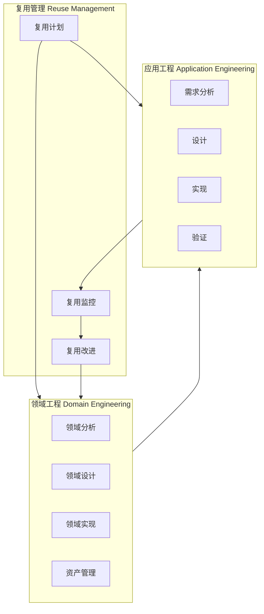
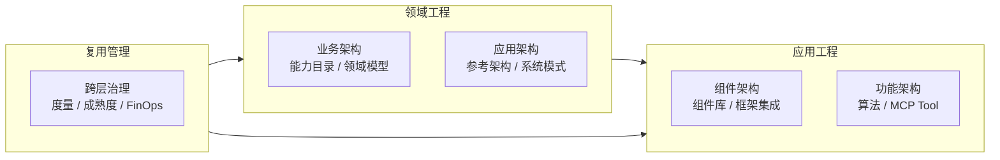

# IEEE 1517-2010 软件生命周期复用过程

> **版本**: 2026-06-08
> **定位**: P4-T6 交付物 — ISO/IEC/IEEE 1517:2010 复用过程标准与 ISO/IEC/IEEE 12207:2017（当前版 :2026，历史映射基于 :2017）、ISO/IEC 26550:2015 及本体系四层复用架构对齐
> **对齐来源**: ISO/IEC/IEEE 1517:2010; ISO/IEC/IEEE 12207:2026（现行） / 12207:2017（历史对照）; ISO/IEC 26550:2015; TOGAF Standard 10
> **状态**: Phase 2（2026-Q4）
> **权威链接**:
>
> - <https://standards.ieee.org/ieee/1517/4603/>
> - <https://www.iso.org/standard/90219.html> (ISO/IEC/IEEE 12207:2026，现行版)
> - <https://www.iso.org/standard/63712.html> (ISO/IEC/IEEE 12207:2017，历史对照版)
> - <https://www.iso.org/standard/69529.html> (ISO/IEC 26550:2015)

---

## 1. IEEE 1517-2010 概述

**ISO/IEC/IEEE 1517:2010** — *Information Technology — System and Software Life Cycle Processes — Reuse Processes* 是 IEEE 专门针对系统与软件生命周期中复用活动的标准规范。它并非孤立存在，而是在 IEEE 标准体系中与多个核心标准形成互补关系：

- **与 ISO/IEC/IEEE 12207:2017 / ISO/IEC/IEEE 12207:2026 的互补**：12207 定义了通用的系统与软件生命周期过程（技术过程、管理过程、支持过程、组织过程），将复用视为跨过程的横切关注点；而 ISO/IEC/IEEE 1517:2010 则提供了独立的、专门化的复用过程视图，使组织能够以系统化方式实施复用，而不仅将其作为通用过程的附加注记。本节映射以 **ISO/IEC/IEEE 12207:2026** 为现行基准；历史对照版（2017）的过程名称和关系保持一致。
- **与 ISO/IEC/IEEE 42020:2019 的互补**：42020 定义了架构过程框架，1517 的复用活动可映射到 42020 的架构规划、开发、评估与维护活动中（详见 [01/02-togaf-10-alignment/detailed-mapping.md](../02-togaf-10-alignment/detailed-mapping.md)）。

为什么需要专门的复用过程标准？通用生命周期过程（如 12207）假设每个项目从零开始定义需求、设计、实现；而复用驱动的方法论要求**双向过程**：一方面通过领域工程主动生产可复用资产，另一方面通过应用工程按需消费和适配资产。这种"供-需"双轨结构需要超越单一项目边界的治理机制，这正是 ISO/IEC/IEEE 1517:2010 存在的核心价值。

---

## 2. IEEE 1517 核心过程

IEEE 1517 定义了三大复用过程组，形成"领域工程产资产 → 应用工程用资产 → 复用管理控全局"的闭环：

### 2.1 领域工程（Domain Engineering）

领域工程负责识别、构建和维护特定领域的可复用资产，是复用体系的"供给侧"。

| 活动 | 核心任务 | 对应本体系 |
|------|---------|-----------|
| **领域分析** | 识别领域边界、分析共性（commonality）与可变性（variability）、建立领域模型 | `02-business-architecture-reuse` |
| **领域设计** | 定义参考架构、可变性机制（binding time、参数化、继承、组合）、组件接口契约 | `03-application-architecture-reuse` / `04-component-architecture-reuse` |
| **领域实现** | 编码、测试、打包可复用资产；建立资产文档和使用示例 | `04-component-architecture-reuse` / `05-functional-architecture-reuse` |
| **资产管理** | 存储、分类、版本控制、检索优化、退役管理 | `01-meta-model-standards/07-omg-ras` / `13-emerging-trends/01-platform-engineering` |

### 2.2 应用工程（Application Engineering）

应用工程负责从需求到交付的完整生命周期，核心是识别复用机会并将可复用资产集成到目标系统中，是复用体系的"需求侧"。

| 活动 | 核心任务 | 对应本体系 |
|------|---------|-----------|
| **需求分析** | 在利益相关者需求中识别可通过复用满足的部分；分析适配约束 | `02-business-architecture-reuse` |
| **设计** | 选择候选资产；设计集成方案；处理可变性绑定（variability binding） | `03-application-architecture-reuse` / `04-component-architecture-reuse` |
| **实现** | 适配、定制、组装可复用资产；编写胶水代码和集成测试 | `04-component-architecture-reuse` / `05-functional-architecture-reuse` |
| **验证** | 验证集成后系统的功能正确性、非功能属性（性能、安全）及合规性 | `07-formal-verification` / `10-supply-chain-security` |

### 2.3 复用管理（Reuse Management）

复用管理是横跨领域工程与应用工程的治理层，确保复用活动在战略、度量和持续改进维度受控。

| 活动 | 核心任务 | 对应本体系 |
|------|---------|-----------|
| **复用计划** | 制定复用策略、目标、范围、资源预算、工具链选型 | `09-value-quantification` |
| **复用监控** | 定义并跟踪复用指标（复用率、适配成本、ROI、资产质量分） | `06-cross-layer-governance/05-metrics-kpi` |
| **复用改进** | 基于度量和反馈持续优化复用流程、资产组合和治理机制 | `06-cross-layer-governance` |

---

## 3. 与 ISO/IEC/IEEE 12207 的对照映射

> **版本说明**: 下表以 **ISO/IEC/IEEE 12207:2026** 为现行基准编写。ISO/IEC/IEEE 12207:2026 已于 2026-04-29 发布，核心过程映射关系与 2017 版保持一致，但 2026 版在敏捷方法、MBSSE 和风险/配置管理方面有更新。历史对照版（2017）的过程名称和关系仍具参考价值。

ISO/IEC/IEEE 12207:2026 将复用 concern 整合为跨生命周期的活动，而 ISO/IEC/IEEE 1517:2010 则将其提升为独立过程组。下表给出核心过程的对照：

| IEEE 1517 过程 | ISO/IEC/IEEE 12207:2026 对应过程 | 差异说明 |
|---------------|------------------------|----------|
| 领域分析 | 系统/软件需求分析（Stakeholder/Software Requirements） | 1517 强调**领域范围**而非单一系统；关注跨系统的共性和可变性分析 |
| 领域设计 | 架构设计（Architectural Design） | 1517 强调**可变性设计**（variability modeling）和参考架构，而非单系统架构 |
| 资产管理 | 配置管理（Configuration Management） | 1517 在版本控制基础上增加**分类体系、检索机制和分发策略** |
| 复用计划 | 项目管理（Project Management） | 1517 将项目管理**专门化到复用维度**，增加资产组合管理和复用 ROI 评估 |
| 应用工程 — 需求分析 | 系统/软件需求分析 | 1517 要求主动查询资产库，将"可复用性"作为需求决策维度 |
| 应用工程 — 验证 | 系统/软件确认与验证 | 1517 增加对**资产集成边界**和**可变性绑定正确性**的验证要求 |

> **关键版本差异**：12207:2008 曾设有独立的 "Software Reuse Processes" 过程组；12207:2017 / 2026 将其拆解为横切活动，更强调复用是生命周期各过程的内在属性。ISO/IEC/IEEE 1517:2010 保留了独立过程视图，为需要系统化复用治理的组织提供了可操作的框架。

---

## 4. 与 ISO/IEC 26550:2015 产品线工程的对照

ISO/IEC 26550:2015（Software and Systems Engineering — Reference Model for Product Line Engineering and Management）与 ISO/IEC/IEEE 1517:2010 在结构上高度同源，但聚焦点不同：

| IEEE 1517 过程组 | ISO/IEC 26550 对应过程 | 映射说明 |
|-----------------|----------------------|----------|
| 领域工程 | 领域工程（Domain Engineering） | 双向映射；26550 增加了产品线特有的**可变点管理**和**核心资产基线**概念 |
| 应用工程 | 应用工程（Application Engineering） | 双向映射；26550 强调**产品派生**（product derivation）过程，即通过绑定可变点自动生成产品实例 |
| 复用管理 | 管理流程（Management Processes） | 双向映射；26550 的管理流程更聚焦于**产品线范围演化**和**多产品组合管理** |

**核心差异**：

- **通用性 vs 聚焦性**：ISO/IEC/IEEE 1517:2010 是通用复用过程标准，适用于任何希望引入复用实践的组织；ISO/IEC 26550:2015 更聚焦于**软件/系统产品线**（Software Product Line, SPL）场景，假设存在一组具有显著共性的相关产品家族。
- **可变性管理**：26550 对可变性建模、绑定和派生提供了更详细的过程定义；1517 的"可变性设计"在 26550 中扩展为完整的产品线可变性管理框架。
- **组织维度**：26550 明确区分了"领域工程组织"与"应用工程组织"的结构关系；1517 则保持组织中立，允许按实际情况灵活配置。

---

## 5. 与四层复用架构的映射

本体系采用四层复用架构（业务架构 → 应用架构 → 组件架构 → 功能架构），ISO/IEC/IEEE 1517:2010 的三过程组与各层的映射关系如下：

| IEEE 1517 过程组 | 四层复用架构映射 | 说明 |
|-----------------|-----------------|------|
| **领域工程** | 业务架构 + 应用架构 | 领域分析识别可复用的**业务能力**和**业务实体**；领域设计产出可复用的**系统模式**和**参考架构** |
| **应用工程** | 组件架构 + 功能架构 | 在组件层集成具体可复用组件（框架、库、服务）；在功能层适配和定制具体功能单元（算法、MCP Tool、函数） |
| **复用管理** | 跨层治理 | 贯穿四层的**度量体系**、**成熟度评估**（RCMM/RiSE）、**FinOps 成本分摊**和**供应链安全治理** |

---

## 6. 实施检查清单

以下检查清单按 ISO/IEC/IEEE 1517:2010 三大过程组组织，每组 10 项，共 30 项。每项标注了与 NASA RRL（Reuse Readiness Levels）、RCMM、RiSE-RM 的成熟度等级映射（详见 [06/03-maturity-models/reuse-maturity-models-rcmm-rise.md](../../06-cross-layer-governance/03-maturity-models/reuse-maturity-models-rcmm-rise.md)）。

### 6.1 领域工程检查清单（10 项）

| # | 检查项 | RRL | RCMM | RiSE-RM |
|---|--------|-----|------|---------|
| DE-01 | 已识别领域边界并建立领域范围文档 | RRL 3-4 | L3 已定义 | L3 计划复用 |
| DE-02 | 已完成共性/可变性分析（commonality/variability analysis） | RRL 4 | L3 已定义 | L3 计划复用 |
| DE-03 | 已建立领域模型（领域术语、实体关系、业务规则） | RRL 4-5 | L3 已定义 | L3 计划复用 |
| DE-04 | 已定义参考架构，包含可变性机制和绑定时间策略 | RRL 5 | L3 已定义 | L4 管理复用 |
| DE-05 | 已设计组件接口契约，符合组织接口标准 | RRL 5-6 | L3 已定义 | L4 管理复用 |
| DE-06 | 可复用资产已实现、单元测试通过、文档完整 | RRL 6 | L3 已定义 | L4 管理复用 |
| DE-07 | 资产已按分类体系（领域/质量/成熟度）编目 | RRL 6-7 | L4 已管理 | L4 管理复用 |
| DE-08 | 资产仓库支持版本控制、依赖追踪和 SBOM 生成 | RRL 7 | L4 已管理 | L5 产品线复用 |
| DE-09 | 资产检索系统支持多维度查询（标签、语义、相似度） | RRL 7-8 | L4 已管理 | L5 产品线复用 |
| DE-10 | 已建立资产退役和替换策略，避免技术债累积 | RRL 8-9 | L5 优化 | L6 度量复用 |

### 6.2 应用工程检查清单（10 项）

| # | 检查项 | RRL | RCMM | RiSE-RM |
|---|--------|-----|------|---------|
| AE-01 | 需求分析阶段主动查询资产库，识别复用机会 | RRL 3-4 | L2 可重复 | L2 基本复用 |
| AE-02 | 已评估候选资产的适配成本（AAF < AAF_ECONOMIC_FLOOR（0.7，canonical [0.0, 1.0]） 为绿灯） | RRL 4-5 | L3 已定义 | L3 计划复用 |
| AE-03 | 已分析资产依赖链长度（要求 < 5 层） | RRL 5 | L3 已定义 | L4 管理复用 |
| AE-04 | 已确认资产许可证兼容性和合规性（SPDX） | RRL 5-6 | L3 已定义 | L4 管理复用 |
| AE-05 | 已设计可变性绑定方案（参数/配置/继承/组合） | RRL 5-6 | L3 已定义 | L4 管理复用 |
| AE-06 | 已实现资产适配和集成，胶水代码有单元测试覆盖 | RRL 6 | L3 已定义 | L4 管理复用 |
| AE-07 | 集成后的系统已通过功能验证，边界场景覆盖 | RRL 6-7 | L4 已管理 | L5 产品线复用 |
| AE-08 | 非功能属性（性能、安全、可用性）验证通过 | RRL 7 | L4 已管理 | L5 产品线复用 |
| AE-09 | 缺陷根因分析区分"资产问题"与"集成问题" | RRL 7-8 | L4 已管理 | L6 度量复用 |
| AE-10 | 使用反馈已记录并回流至领域工程团队 | RRL 8 | L5 优化 | L6 度量复用 |

### 6.3 复用管理检查清单（10 项）

| # | 检查项 | RRL | RCMM | RiSE-RM |
|---|--------|-----|------|---------|
| RM-01 | 已制定组织级复用战略，明确目标范围和 KPI | RRL 2-3 | L3 已定义 | L3 计划复用 |
| RM-02 | 已建立复用治理委员会，定义角色和职责 | RRL 3-4 | L3 已定义 | L3 计划复用 |
| RM-03 | 复用预算已纳入项目预算管理体系 | RRL 4 | L3 已定义 | L3 计划复用 |
| RM-04 | 已定义核心复用度量指标（复用率、成本规避、TTM 缩短） | RRL 4-5 | L4 已管理 | L4 管理复用 |
| RM-05 | 度量数据自动采集（CI/CD、IDP、SCA 工具集成） | RRL 5-6 | L4 已管理 | L5 产品线复用 |
| RM-06 | 复用 ROI 模型已建立并定期评审（参考 COCOMO II） | RRL 6 | L4 已管理 | L6 度量复用 |
| RM-07 | 资产质量门（Quality Gate）定义并执行 | RRL 6-7 | L4 已管理 | L5 产品线复用 |
| RM-08 | 定期执行复用成熟度自评估（RCMM / RiSE-RM） | RRL 7-8 | L4-5 已管理/优化 | L6 度量复用 |
| RM-09 | 已建立复用激励机制（开发者积分、Golden Path 采用率） | RRL 7-8 | L5 优化 | L6 度量复用 |
| RM-10 | 复用过程持续改进，形成 PDCA 闭环 | RRL 9 | L5 优化 | L7 主动复用 |

---

## 7. 批判性评估与 2026 年应用建议

### 7.1 优势

- **过程完整**：覆盖领域工程、应用工程、复用管理的全生命周期闭环
- **与主流标准兼容**：与 12207、26550、42020、TOGAF 均有清晰映射
- **实践导向**：提供了可落地的活动、任务和决策检查清单

### 7.2 局限

- **发布较早**：2010 年标准，未原生涉及 AI、云原生、容器、MCP 等现代复用形态
- **缺少具体技术格式**：不规定资产包装格式（需结合 OMG RAS、SBOM 等补充）
- **度量不够量化**：复用 ROI、成本的精确计算需结合 COCOMO II 等模型

### 7.3 2026 年应用建议

1. **将 1517 作为过程框架**：用其三大过程组组织本体系的治理内容，映射到 DevOps 工具链和平台工程实践。
2. **结合现代资产仓库**：用 Backstage IDP、Artifact Registry、MCP Tool Registry 替代传统静态资产库。
3. **结合 AI 复用**：在 Domain Engineering 中增加 LLM/Agent 能力域；在 Asset Management 中增加 Prompt 模板、Agent 工作流等新型资产类别。
4. **持续跟踪标准演进**：关注 ISO/IEC/IEEE 1517:2010 后续修订及 ISO 对应复用标准的发布动态。

---

## 8. 公理映射

> **公理 1517.1** (Reuse Process Closure): 有效的复用必须形成闭环：领域工程产生资产 → 应用工程消费资产 → 复用管理监控改进 → 反馈驱动领域工程演进。任一环节断裂，复用体系将退化为偶然复用。

> **公理 1517.2** (Asset-Process Coherence): 复用资产的质量上限由复用过程成熟度决定；再优秀的资产，在没有资产管理过程的组织中也无法被有效复用。

> **公理 1517.3** (Dual-Track Governance): 领域工程与应用工程必须遵循统一的复用策略，否则"供给侧"与"需求侧"的错配将导致资产积压与重复建设并存。

---

## 9. 权威来源

1. IEEE. *ISO/IEC/IEEE 1517:2010 — Standard for Information Technology — System and Software Life Cycle Processes — Reuse Processes*. 2010. <https://standards.ieee.org/ieee/1517/4603/>
2. ISO/IEC/IEEE. *ISO/IEC/IEEE 12207:2026 — Systems and software engineering — Software life cycle processes*. 2026. <https://www.iso.org/standard/90219.html>
   ISO/IEC/IEEE. *ISO/IEC/IEEE 12207:2017 — Systems and software engineering — Software life cycle processes*. 2017. <https://www.iso.org/standard/63712.html>（历史对照版）
3. ISO/IEC. *ISO/IEC 26550:2015 — Software and systems engineering — Reference model for product line engineering and management*. 2015. <https://www.iso.org/standard/43089.html>
4. ISO/IEC/IEEE. *ISO/IEC/IEEE 42020:2019 — Software, systems and enterprise — Architecture processes*. 2019.
5. Frakes, W. B. & Kang, K. *Software Reuse Research: Status and Future*. IEEE Transactions on Software Engineering, 2005.
6. Clements, P. & Northrop, L. *Software Product Lines: Practices and Patterns*. Addison-Wesley, 2001.

---

> **交叉引用**: [01/02-togaf-10-alignment/detailed-mapping.md](../02-togaf-10-alignment/detailed-mapping.md) · [06/03-maturity-models/reuse-maturity-models-rcmm-rise.md](../../06-cross-layer-governance/03-maturity-models/reuse-maturity-models-rcmm-rise.md)
> **最后更新**: 2026-06-08
> **维护者**: Track A — 01 元模型与标准对齐
> **状态**: Phase 2 交付物（P4-T6 完成）

---

## 补充说明：IEEE 1517-2010 软件生命周期复用过程

## 概念定义

**定义**：ISO/IEC/IEEE 1517:2010-2010 定义了软件生命周期中复用过程的结构，包括组织管理、领域工程、资产提供、资产消费与资产维护等过程。

## 示例

**示例**：某组织按 1517 建立领域工程团队，负责识别共性需求、开发可复用资产并向应用工程团队提供资产与培训。

## 权威来源

> **权威来源**:
>
> - [ISO/IEC/IEEE 1517:2010-2010](https://standards.ieee.org/ieee/1517/4603/)
> - [IEEE Standards](https://standards.ieee.org)
> - 核查日期：2026-07-07
