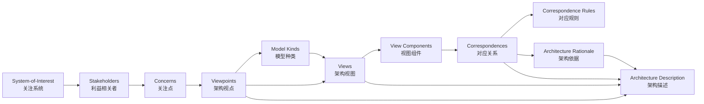
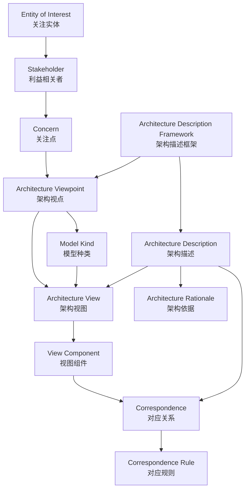

# ISO/IEC/IEEE 42010:2022 与架构复用

> **版本**: 2026-06-06
> **定位**: 深入解析 ISO/IEC/IEEE 42010:2022 标准及其对架构复用的指导意义

---

## 1. ISO 42010:2022 核心概念

ISO/IEC/IEEE 42010:2022 是系统与软件工程领域的核心架构标准，它定义了**架构描述 (Architecture Description, AD)** 的元模型。

### 核心元素

```text
System-of-Interest (SoI)
    │
    ├── Stakeholders（利益相关者）
    │       └── Concerns（关注点）
    │
    ├── Architecture Description
    │       ├── Architecture Viewpoints（架构视点）
    │       │       └── Frame concerns + conventions
    │       ├── Architecture Views（架构视图）
    │       │       └── Address concerns via viewpoints
    │       ├── Model Kinds（模型种类）
    │       ├── Correspondences（对应关系）
    │       └── Correspondence Rules（对应规则）
    │
    └── Architecture Rationale（架构依据）
```

### 关键术语

| 术语 | 定义 | 复用意义 |
|------|------|---------|
| **Concern** | 利益相关者对系统的兴趣点 | 复用决策必须首先识别谁的关注点被满足 |
| **Viewpoint** | 描述一类关注点的约定 | 可复用的视点定义降低架构描述成本 |
| **View** | 视点的实例化 | 基于视点生成的视图具有结构一致性 |
| **Correspondence** | 视图或模型之间的关系 | 跨层复用需要显式定义层间对应关系 |
| **Rationale** | 架构决策的依据 | 记录决策上下文，支持未来复用或重构 |

---

## 2. ISO/IEC/IEEE 42010:2022 条款映射（Clause 5–7）

| 条款 | 核心要求 | 架构描述元素 | 复用映射 |
|---|---|---|---|
| Clause 5.1 | 通用基础 | 架构描述在生命周期中的定位 | 建立 AD 作为可复用工件的边界 |
| Clause 5.2 | 架构描述概念模型 | EoI、Stakeholder、Concern、Stakeholder Perspective、Aspect、Viewpoint、View、Model Kind、View Component、Correspondence、Architecture Decision、Rationale | 元模型词汇表与资产分类基础 |
| Clause 5.3 | 架构描述在生命周期中的位置 | AD 与实体生命周期的关系 | 定义 AD 在需求、设计、实现、运维各阶段的复用时机 |
| Clause 6.1 | AD 识别与概述 | AD 的标识、版本、范围 | 资产库目录与版本管理 |
| Clause 6.2 | 利益相关者识别 | Stakeholder 列表 | 确定复用资产的消费者与治理主体 |
| Clause 6.3 | 视角识别 | Stakeholder Perspective | 视点模板的用户群体定义 |
| Clause 6.4 | 关注点识别 | Concern | 复用决策必须回应的关注点清单 |
| Clause 6.5 | 方面识别 | Aspect | 按结构、行为、信息等方面组织复用资产 |
| Clause 6.6 | 包含视点 | Architecture Viewpoint | 可复用视点库条目 |
| Clause 6.7 | 包含视图 | Architecture View | 基于视点生成的具体视图实例 |
| Clause 6.8 | 包含视图组件 | View Component | ABB/SBB 等可复用架构描述单元 |
| Clause 6.9 | 记录对应关系 | Correspondence / Correspondence Rule | 跨层/跨视图一致性规则 |
| Clause 6.10 | 记录决策与依据 | Architecture Decision / Rationale | ADR、复用/定制决策记录 |
| Clause 7.1 | ADF 规约 | Architecture Description Framework | TOGAF、DoDAF、NAF、RM-ODP 等框架的 conformance 声明 |
| Clause 7.2 | ADL 规约 | Architecture Description Language | ArchiMate、UML、SysML、AADL 等语言的对齐基准 |

**论证**：Clause 5–7 构成了 ISO/IEC/IEEE 42010:2022 从概念、规约到框架/语言的三层结构。复用资产的定义、分类、视点和对应规则均可直接追溯到这些条款，因此本知识体系将 42010 视为元模型层标准。

---

## 3. 42010 对复用的启示

### 启示 1: 视点是复用的基本单元（Clause 5.2.7 / 6.6 / 8.1）

视点（Viewpoint）是可复用的。例如：

- **功能视点 (Functional Viewpoint)**: 描述系统功能分解
- **部署视点 (Deployment Viewpoint)**: 描述运行时部署
- **安全视点 (Security Viewpoint)**: 描述安全控制

一旦定义了标准的视点集，所有项目都可以基于这些视点生成视图，降低架构描述成本。

### 启示 2: 关注点驱动复用（Clause 5.2.3 / 5.2.4 / 6.4）

> **定理 M.T1** (Viewpoint Composition): 若视点 VP₁ 和 VP₂ 分别处理关注点集 C₁ 和 C₂，且 C₁ ∩ C₂ ≠ ∅，则存在一个组合视点 VP₁₊₂ = VP₁ ∪ VP₂，处理 C₁ ∪ C₂。

### 启示 3: 对应关系保证一致性（Clause 5.2.11 / 6.9）

跨视图/跨层的复用需要显式定义对应关系。例如：

```text
业务服务 "订单处理"  ↔  应用服务 "OrderService"
    │                        │
    └─对应规则: 1:1 映射，业务服务变更触发应用服务评估
```

---

## 3. 与其他标准的集成

```text
ISO 42010 (架构描述元模型)
        │
        ├── ISO 25010 (质量模型) → 定义质量关注点
        ├── ISO 12207 (生命周期) → 定义架构活动时机
        ├── ISO 15288 (系统工程) → 定义系统生命周期
        ├── TOGAF ADM → 提供架构开发方法论
        └── ArchiMate → 提供架构描述语言
```

---

## 4. 复用视角下的 42010 实施 checklist（对照 Clause 6）

- [ ] 定义标准视点集（至少覆盖业务、应用、数据、技术、安全）
- [ ] 为每个视点定义模型种类和符号约定
- [ ] 建立视点间的对应规则
- [ ] 记录架构决策依据（ADR）
- [ ] 定期审查视点的适用性并更新
- [ ] 将视点模板纳入组织级架构资产库

---

## 5. Wikipedia 结构梳理与标准映射补强

### 5.1 ISO 42010 Wikipedia 结构梳理

根据 Wikipedia，ISO/IEC/IEEE 42010:2022 的前身是 IEEE 1471:2000（2000 年发布），2011 年升级为 ISO/IEC/IEEE 42010:2011，最新版为 2022 版。该标准旨在为系统和软件架构描述（Architecture Description, AD）提供统一概念框架，使不同方法、语言和工具能够一致地表达架构。[[ISO/IEC/IEEE 42010:2022](https://en.wikipedia.org/wiki/ISO/IEC/IEEE_42010)]

Wikipedia 对该标准的结构化梳理可映射为以下知识块：

| Wikipedia 主题 | 标准对应条款 | 核心内容 |
|:---|:---|:---|
| **History** | IEEE 1471 → 42010:2011 → 42010:2022 | 从系统架构描述到企业架构描述的演进 |
| **Concepts** | Clause 3 / Clause 5 | System-of-Interest、Stakeholder、Concern、Viewpoint、View、Model Kind |
| **Architecture Description** | Clause 5.2 / Clause 6 | AD 是表达架构的工件集合，受 viewpoint 与 model kind 约束 |
| **Architecture Frameworks** | Clause 4 / Annex F | TOGAF、ArchiMate、RM-ODP 等作为符合 42010 的框架示例 |
| **Applications** | 工业实践 | 软件密集系统、企业架构、复杂系统工程 |

### 5.2 ISO 42010 核心概念关系图



概念关系说明：

- **System-of-Interest** 是架构描述的对象；所有关注点均围绕其产生。
- **Stakeholder** 提出 **Concern**，**Viewpoint** 将关注点框架化。
- **Model Kind** 规定某类视图的建模约定；**View** 是 Viewpoint 的实例化。
- **View Component** 是视图中的可分离部分，可对应 TOGAF 的 ABB/SBB。
- **Correspondence** 与 **Correspondence Rule** 保证视图间一致性，是跨层复用的关键。
- **Architecture Rationale** 记录决策依据，支持未来复用、演进与审计。

### 5.3 与 TOGAF/ArchiMate 的映射

| ISO 42010:2022 | TOGAF 10 | ArchiMate 4.0 | 复用说明 |
|:---|:---|:---|:---|
| System-of-Interest | Enterprise / Architecture Project | ArchiMate Model Scope | 架构工作的对象边界 |
| Stakeholder | Stakeholder Map | Stakeholder（动机域） | 识别谁将消费复用资产 |
| Concern | Drivers / Requirements / Vision | Driver / Goal / Requirement | 复用决策必须回应的关注点 |
| Viewpoint | Content Framework View / Catalog | ArchiMate Viewpoint | 可复用的观察角度模板 |
| View | Architecture Artifact / Deliverable | ArchiMate Diagram / View | 基于视点生成的具体视图 |
| Model Kind | Artifact Type / Model Type | Aspect × Layer 矩阵 | 定义某类模型的约定 |
| View Component | ABB / SBB | ArchiMate Element in View | 可复用的架构描述单元 |
| Correspondence Rule | Architecture Contract / Compliance Review | Realization / Assignment 关系 | 跨层/跨抽象层一致性 |
| Architecture Decision | ADR / Work Package | Work Package + Deliverable | 记录复用或定制的决策 |

### 5.4 正例与反例

**正例**：某银行采用 ISO/IEC/IEEE 42010:2022 视点框架定义业务、应用、数据、安全、部署五类标准视点，所有项目基于统一视点生成视图。通过对应规则，业务服务“开户”与应用组件“AccountService”建立 1:1 追溯，需求变更时可快速定位受影响复用资产。

**反例**：某项目为了赶进度只交付一张“总体架构图”，未区分业务、开发、运维、安全等利益相关者的关注点，也未定义视点与对应规则。结果安全团队质疑缺少访问控制视图，运维团队无法获得部署视图，业务方与开发方对“订单服务”范围理解不一致，导致重复造轮子和返工。

### 5.5 权威来源与交叉引用

| 来源 | URL |
|:---|:---|
| Wikipedia - ISO/IEC/IEEE 42010 | <https://en.wikipedia.org/wiki/ISO/IEC/IEEE_42010> |
| ISO 42010:2022 官方页面 | <https://www.iso.org/standard/74393.html> |
| IEEE 1471-2000 | <https://standards.ieee.org/standard/1471-2000.html> |
| The Open Group - TOGAF | <https://www.opengroup.org/togaf> |
| The Open Group - ArchiMate 4 Specification | <https://www.opengroup.org/archimate-licensed-downloads> |

**交叉引用**：

- ISO/IEC/IEEE 42010:2022 更新跟踪详见 [`iso-42010-2022-update.md`](./iso-42010-2022-update.md)
- 标准对齐矩阵详见 [`alignment-matrix.md`](./alignment-matrix.md)
- TOGAF 详细映射详见 [`../02-togaf-10-alignment/detailed-mapping.md`](../02-togaf-10-alignment/detailed-mapping.md)
- ArchiMate 映射详见 [`../04-archimate-4/archimate-iso-mapping.md`](../04-archimate-4/archimate-iso-mapping.md)

---

> 最后更新: 2026-07-09


---

## 补充：ISO/IEC/IEEE 42010:2022 核心概念完整定义与结构化分析

> 本节按本知识体系的内容要素检查清单，对 ISO/IEC/IEEE 42010:2022 的六大核心概念——EoI、ADF、Viewpoint、View、Model Kind、Correspondence——进行定义、属性、关系、正例与反例的系统化补全。
> Wikipedia 概念结构参见 [ISO/IEC/IEEE 42010:2022](https://en.wikipedia.org/wiki/ISO/IEC/IEEE_42010)。

### 1. 概念定义

**定义**：ISO/IEC/IEEE 42010:2022 将架构描述（Architecture Description, AD）视为一个由关注实体、利益相关者、关注点、架构描述框架、架构视点、架构视图、模型种类、对应关系与架构依据组成的系统化制品集合。其核心目的在于确保对任意 **Entity of Interest（EoI，关注实体）** 的架构能够以一致、可验证、可复用的方式进行表达与沟通。

下图展示了六大核心概念之间的结构化关系：



### 2. 核心概念属性

#### 2.1 Entity of Interest（EoI，关注实体）

| 属性 | 说明 | 可观察性 |
|------|------|----------|
| 边界清晰性 | EoI 的范围、生命周期与外部接口被显式定义 | 高 |
| 利益相关者关联性 | 存在明确的 Stakeholder 列表并与其关注点挂钩 | 高 |
| 关注点可枚举性 | 其关键 Concern 可被列出并排序 | 中 |
| 演进可追溯性 | 版本、变更与决策记录完整 | 中 |
| 层次可定位性 | 可明确归属于系统、子系统、企业或生态系统 | 高 |

#### 2.2 Architecture Description Framework（ADF，架构描述框架）

| 属性 | 说明 | 可观察性 |
|------|------|----------|
| 视点集合 | 定义一组标准化的 Viewpoint | 高 |
| 模型种类约定 | 规定 Model Kind 的语法、语义与符号 | 高 |
| 对应规则框架 | 规定跨视图一致性的规则模板 | 中 |
| 利益相关者视角 | 明确每种 Viewpoint 服务的目标受众 | 中 |
| 方法论集成 | 与架构过程标准（如 ISO 42020）及开发方法（如 TOGAF ADM）的衔接程度 | 中 |

#### 2.3 Architecture Viewpoint（架构视点）

| 属性 | 说明 | 可观察性 |
|------|------|----------|
| 关注点覆盖 | 能够回应的 Concern 集合被显式声明 | 高 |
| 模型种类绑定 | 指定适用的 Model Kind | 高 |
| 符号约定 | 图形/文本记号规范完整 | 高 |
| 利益相关者视角 | 目标受众明确 | 中 |
| 复用稳定性 | 视点模板在多个项目间保持稳定 | 中 |

#### 2.4 Architecture View（架构视图）

| 属性 | 说明 | 可观察性 |
|------|------|----------|
| 视点符合性 | 符合某个 Viewpoint 的约定 | 高 |
| 关注点回应 | 明确回应至少一个 Concern | 高 |
| 模型实例化 | 包含符合 Model Kind 的模型 | 高 |
| 版本与基线 | 属于特定 Architecture Description 版本 | 中 |
| 可追溯性 | 可追溯到 EoI、Stakeholder 与 Decision | 中 |

#### 2.5 Model Kind（模型种类）

| 属性 | 说明 | 可观察性 |
|------|------|----------|
| 语言/记号 | 使用的建模语言或符号被定义 | 高 |
| 语法规则 | 合法模型的结构约束完整 | 高 |
| 语义解释 | 符号到真实语义的映射明确 | 中 |
| 工具可验证性 | 可生成/验证模型的工具链可用 | 中 |
| 复用范围 | 可在多个 Viewpoint 中复用 | 中 |

#### 2.6 Correspondence / Correspondence Rule（对应关系 / 对应规则）

| 属性 | 说明 | 可观察性 |
|------|------|----------|
| 源/目标 | 涉及的两个或多个 AD 元素被显式声明 | 高 |
| 关系类型 | 实现/跟踪/依赖/映射等语义明确 | 高 |
| 规则引用 | 遵循的 Correspondence Rule 可被引用 | 中 |
| 可验证性 | 可通过工具或评审确认 | 中 |
| 变更传播影响 | 能评估源或目标变更后的影响范围 | 中 |

### 3. 关系说明

- **EoI ↔ Stakeholder/Concern**：EoI 是架构描述的对象；Stakeholder 提出 Concern，Concern 驱动 Viewpoint 的选择。
- **ADF → Viewpoint/Model Kind**：ADF 是元框架，决定使用哪些视点与模型种类；Viewpoint 与 Model Kind 可跨项目复用。
- **Viewpoint → View**：Viewpoint 是模板，View 是其在特定上下文中的实例。
- **Model Kind → View**：一个 Viewpoint 可绑定一个或多个 Model Kind，View 中包含符合这些 Model Kind 的模型。
- **Correspondence ↔ View Component**：视图组件之间的对应关系必须显式声明，并通过 Correspondence Rule 约束。
- **Rationale → AD/Viewpoint/View**：架构依据解释为何选择特定视点、视图与对应规则，支持未来复用与审计。

### 4. 形式化表达

一个架构描述可形式化为一个多元组：

```text
AD = (EoI, Stakeholders, Concerns, {Viewpoint_i}, {ModelKind_j}, {View_k}, {Correspondence_l}, Rationale)
```

其中每个 View 必须满足：

```text
∀ View_k, ∃ Viewpoint_i, ModelKind_j : View_k conforms_to Viewpoint_i ∧ View_k instance_of ModelKind_j
```

视点组合规则（Viewpoint Composition）：

```text
若 Viewpoint_1 处理 Concern 集合 C_1，Viewpoint_2 处理 C_2，且 C_1 ∩ C_2 ≠ ∅，
则存在组合视点 Viewpoint_1+2，其处理 C_1 ∪ C_2。
```

### 5. 正例

**正例**：以“在线支付系统”为 EoI，架构团队定义了以下 42010 结构：

- **EoI**：在线支付系统，边界为“接收支付请求 → 风控校验 → 渠道路由 → 结果通知”。
- **ADF**：企业级支付架构描述框架，包含业务、应用、数据、安全、部署五类视点。
- **Viewpoint**：安全视点规定必须展示威胁模型、访问控制列表与加密传输要求。
- **View**：基于安全视点生成的“支付安全视图”，包含 STRIDE 威胁模型与 TLS 1.3 配置。
- **Model Kind**：威胁模型采用 STRIDE，部署模型采用 C4 Container 图。
- **Correspondence**：业务服务“发起支付” ↔ 应用服务 `PaymentInitiationService`，对应规则为“1:1 实现，业务变更时应用服务必须重新评估”。

该结构使支付能力在多个业务线（B2C、B2B、跨境）复用时，能够快速识别受影响组件并保持一致性。

### 6. 反例

**反例**：某敏捷团队以“快速上线”为由，在架构描述中仅交付一张“总体架构图”：

- EoI 边界未定义，导致后续微服务拆分范围反复变更。
- 未定义 ADF，安全、运维、业务方各自使用不同绘图风格。
- 视点缺失，没有安全视点，致使生产环境缺少访问控制视图。
- View 不符合任何 Model Kind，图中混合了业务流程图、网络拓扑图与类图，无法自动验证。
- 对应关系未记录，业务术语“账户”在数据库表、API 字段与 UI 标签中含义不一致。

结果：项目上线三个月后，因无法追溯业务需求到技术实现，被迫进行大规模重构，复用资产大量废弃。

### 7. 权威来源

> **权威来源**：
>
> - [ISO/IEC/IEEE 42010:2022 — Architecture description](https://www.iso.org/standard/74393.html) — ISO 官方页面（核查日期：2026-07-09）
> - [ISO/IEC/IEEE 42010:2022 OBP 在线浏览](https://www.iso.org/obp/ui/#iso:std:iso-iec-ieee:42010:ed-2:v1:en) — ISO（核查日期：2026-07-09）
> - [ISO/IEC/IEEE 42020:2019 — Architecture processes](https://www.iso.org/standard/68982.html) — ISO（核查日期：2026-07-09）
> - [ISO/IEC/IEEE 42030:2019 — Architecture evaluation](https://www.iso.org/standard/73436.html) — ISO（核查日期：2026-07-09）
> - [ISO/IEC/IEEE 42010:2022 - Wikipedia](https://en.wikipedia.org/wiki/ISO/IEC/IEEE_42010)（核查日期：2026-07-09）
> - [IEEE 1471-2000](https://standards.ieee.org/standard/1471-2000.html)（核查日期：2026-07-09）
> - [The Open Group - TOGAF Standard, 10th Edition](https://www.opengroup.org/togaf)（核查日期：2026-07-09）
> - [The Open Group - TOGAF Architecture Content](https://publications.opengroup.org/togaf-library)（核查日期：2026-07-09）
> - [The Open Group - ArchiMate 4.0 Specification (C260 / W262)](https://www.opengroup.org/archimate-licensed-downloads)（核查日期：2026-07-09）
> - [The Open Group - ArchiMate 4.0 Changes White Paper W262](https://publications.opengroup.org/w262)（核查日期：2026-07-09）
>
> **核查日期**：2026-07-09

### 8. 交叉引用

- 标准对齐矩阵详见 [`alignment-matrix.md`](./alignment-matrix.md)
- TOGAF 详细映射详见 [`../02-togaf-10-alignment/detailed-mapping.md`](../02-togaf-10-alignment/detailed-mapping.md)
- TOGAF 企业连续体与构建块复用详见 [`../02-togaf-10-alignment/togaf-enterprise-continuum-reuse.md`](../02-togaf-10-alignment/togaf-enterprise-continuum-reuse.md)
- ArchiMate 与 ISO/IEC/IEEE 42010:2022 映射详见 [`../04-archimate-4/archimate-iso-mapping.md`](../04-archimate-4/archimate-iso-mapping.md)
- 四层复用本体详见 [`../06-formal-axioms/four-layer-ontology.md`](../06-formal-axioms/four-layer-ontology.md)