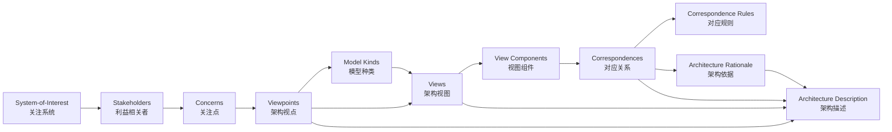

# ISO/IEC/IEEE 42010:2022 与架构复用

> **版本**: 2026-06-06
> **定位**: 深入解析 ISO 42010:2022 标准及其对架构复用的指导意义

---

## 1. ISO 42010:2022 核心概念

ISO/IEC/IEEE 42010:2022 是系统与软件工程领域的核心架构标准，它定义了**架构描述 (Architecture Description, AD)** 的元模型。

### 核心元素

```text
System-of-Interest (SoI)
    │
    ├── Stakeholders（利益相关者）
    │       └── Concerns（关注点）
    │
    ├── Architecture Description
    │       ├── Architecture Viewpoints（架构视点）
    │       │       └── Frame concerns + conventions
    │       ├── Architecture Views（架构视图）
    │       │       └── Address concerns via viewpoints
    │       ├── Model Kinds（模型种类）
    │       ├── Correspondences（对应关系）
    │       └── Correspondence Rules（对应规则）
    │
    └── Architecture Rationale（架构依据）
```

### 关键术语

| 术语 | 定义 | 复用意义 |
|------|------|---------|
| **Concern** | 利益相关者对系统的兴趣点 | 复用决策必须首先识别谁的关注点被满足 |
| **Viewpoint** | 描述一类关注点的约定 | 可复用的视点定义降低架构描述成本 |
| **View** | 视点的实例化 | 基于视点生成的视图具有结构一致性 |
| **Correspondence** | 视图或模型之间的关系 | 跨层复用需要显式定义层间对应关系 |
| **Rationale** | 架构决策的依据 | 记录决策上下文，支持未来复用或重构 |

---

## 2. 42010 对复用的启示

### 启示 1: 视点是复用的基本单元

视点（Viewpoint）是可复用的。例如：

- **功能视点 (Functional Viewpoint)**: 描述系统功能分解
- **部署视点 (Deployment Viewpoint)**: 描述运行时部署
- **安全视点 (Security Viewpoint)**: 描述安全控制

一旦定义了标准的视点集，所有项目都可以基于这些视点生成视图，降低架构描述成本。

### 启示 2: 关注点驱动复用

> **定理 M.T1** (Viewpoint Composition): 若视点 VP₁ 和 VP₂ 分别处理关注点集 C₁ 和 C₂，且 C₁ ∩ C₂ ≠ ∅，则存在一个组合视点 VP₁₊₂ = VP₁ ∪ VP₂，处理 C₁ ∪ C₂。

### 启示 3: 对应关系保证一致性

跨视图/跨层的复用需要显式定义对应关系。例如：

```text
业务服务 "订单处理"  ↔  应用服务 "OrderService"
    │                        │
    └─对应规则: 1:1 映射，业务服务变更触发应用服务评估
```

---

## 3. 与其他标准的集成

```text
ISO 42010 (架构描述元模型)
        │
        ├── ISO 25010 (质量模型) → 定义质量关注点
        ├── ISO 12207 (生命周期) → 定义架构活动时机
        ├── ISO 15288 (系统工程) → 定义系统生命周期
        ├── TOGAF ADM → 提供架构开发方法论
        └── ArchiMate → 提供架构描述语言
```

---

## 4. 复用视角下的 42010 实施 checklist

- [ ] 定义标准视点集（至少覆盖业务、应用、数据、技术、安全）
- [ ] 为每个视点定义模型种类和符号约定
- [ ] 建立视点间的对应规则
- [ ] 记录架构决策依据（ADR）
- [ ] 定期审查视点的适用性并更新
- [ ] 将视点模板纳入组织级架构资产库

---

## 5. Wikipedia 结构梳理与标准映射补强

### 5.1 ISO 42010 Wikipedia 结构梳理

根据 Wikipedia，ISO/IEC/IEEE 42010 的前身是 IEEE 1471-2000（2000 年发布），2011 年升级为 ISO/IEC/IEEE 42010:2011，最新版为 2022 版。该标准旨在为系统和软件架构描述（Architecture Description, AD）提供统一概念框架，使不同方法、语言和工具能够一致地表达架构。[[ISO/IEC/IEEE 42010](https://en.wikipedia.org/wiki/ISO/IEC/IEEE_42010)]

Wikipedia 对该标准的结构化梳理可映射为以下知识块：

| Wikipedia 主题 | 标准对应条款 | 核心内容 |
|:---|:---|:---|
| **History** | IEEE 1471 → 42010:2011 → 42010:2022 | 从系统架构描述到企业架构描述的演进 |
| **Concepts** | Clause 3 / Clause 5 | System-of-Interest、Stakeholder、Concern、Viewpoint、View、Model Kind |
| **Architecture Description** | Clause 5.2 / Clause 6 | AD 是表达架构的工件集合，受 viewpoint 与 model kind 约束 |
| **Architecture Frameworks** | Clause 4 / Annex F | TOGAF、ArchiMate、RM-ODP 等作为符合 42010 的框架示例 |
| **Applications** | 工业实践 | 软件密集系统、企业架构、复杂系统工程 |

### 5.2 ISO 42010 核心概念关系图



概念关系说明：

- **System-of-Interest** 是架构描述的对象；所有关注点均围绕其产生。
- **Stakeholder** 提出 **Concern**，**Viewpoint** 将关注点框架化。
- **Model Kind** 规定某类视图的建模约定；**View** 是 Viewpoint 的实例化。
- **View Component** 是视图中的可分离部分，可对应 TOGAF 的 ABB/SBB。
- **Correspondence** 与 **Correspondence Rule** 保证视图间一致性，是跨层复用的关键。
- **Architecture Rationale** 记录决策依据，支持未来复用、演进与审计。

### 5.3 与 TOGAF/ArchiMate 的映射

| ISO 42010:2022 | TOGAF 10 | ArchiMate 4.0 | 复用说明 |
|:---|:---|:---|:---|
| System-of-Interest | Enterprise / Architecture Project | ArchiMate Model Scope | 架构工作的对象边界 |
| Stakeholder | Stakeholder Map | Stakeholder（动机域） | 识别谁将消费复用资产 |
| Concern | Drivers / Requirements / Vision | Driver / Goal / Requirement | 复用决策必须回应的关注点 |
| Viewpoint | Content Framework View / Catalog | ArchiMate Viewpoint | 可复用的观察角度模板 |
| View | Architecture Artifact / Deliverable | ArchiMate Diagram / View | 基于视点生成的具体视图 |
| Model Kind | Artifact Type / Model Type | Aspect × Layer 矩阵 | 定义某类模型的约定 |
| View Component | ABB / SBB | ArchiMate Element in View | 可复用的架构描述单元 |
| Correspondence Rule | Architecture Contract / Compliance Review | Realization / Assignment 关系 | 跨层/跨抽象层一致性 |
| Architecture Decision | ADR / Work Package | Work Package + Deliverable | 记录复用或定制的决策 |

### 5.4 正例与反例

**正例**：某银行采用 ISO 42010 视点框架定义业务、应用、数据、安全、部署五类标准视点，所有项目基于统一视点生成视图。通过对应规则，业务服务“开户”与应用组件“AccountService”建立 1:1 追溯，需求变更时可快速定位受影响复用资产。

**反例**：某项目为了赶进度只交付一张“总体架构图”，未区分业务、开发、运维、安全等利益相关者的关注点，也未定义视点与对应规则。结果安全团队质疑缺少访问控制视图，运维团队无法获得部署视图，业务方与开发方对“订单服务”范围理解不一致，导致重复造轮子和返工。

### 5.5 权威来源与交叉引用

| 来源 | URL |
|:---|:---|
| Wikipedia - ISO/IEC/IEEE 42010 | <https://en.wikipedia.org/wiki/ISO/IEC/IEEE_42010> |
| ISO 42010:2022 官方页面 | <https://www.iso.org/standard/74296.html> |
| IEEE 1471-2000 | <https://standards.ieee.org/standard/1471-2000.html> |
| The Open Group - TOGAF | <https://www.opengroup.org/togaf> |
| The Open Group - ArchiMate | <https://www.opengroup.org/archimate> |

**交叉引用**：

- ISO 42010 更新跟踪详见 [`iso-42010-2022-update.md`](./iso-42010-2022-update.md)
- 标准对齐矩阵详见 [`alignment-matrix.md`](./alignment-matrix.md)
- TOGAF 详细映射详见 [`../02-togaf-10-alignment/detailed-mapping.md`](../02-togaf-10-alignment/detailed-mapping.md)
- ArchiMate 映射详见 [`../04-archimate-4/archimate-iso-mapping.md`](../04-archimate-4/archimate-iso-mapping.md)

---

> 最后更新: 2026-06-06


---

## 补充说明：ISO/IEC/IEEE 42010:2022 与架构复用

## 反例

**反例**：项目仅交付一张“总体架构图”，未区分利益相关者视角，导致安全团队、运维团队与业务方在同一视图上争论不休。

## 权威来源

> **权威来源**:
>
> - [ISO/IEC/IEEE 42010:2022](https://www.iso.org/standard/74296.html)
> - [IEEE Standards](https://standards.ieee.org)
> - 核查日期：2026-07-07
