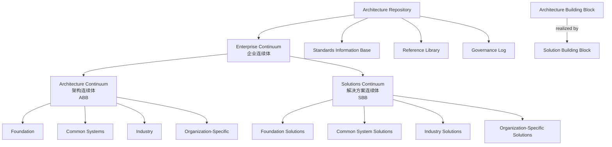

# TOGAF 10 企业连续体与构建块复用
>
> 版本: 2026-06-06
> 对齐来源: The Open Group TOGAF Standard 10 (2022/2025 Update), Visual Paradigm 2025, Sparx Systems, Barnes & Noble 2025 出版物

## 1. TOGAF 10 核心文档集

| 文档 | 内容 | 2025 更新 |
|-----|------|----------|
| **ADM** | 架构开发方法 — 迭代式企业架构开发 | 持续迭代优化 |
| **ADM Techniques** | 技术集合 — 应用于 TOGAF ADM | 新增敏捷/数字孪生适配 |
| **Applying the ADM** | ADM 适配指南 — 特定架构风格 | 扩展 AI/数据架构场景 |

## 2. 企业连续体（Enterprise Continuum）

### 2.1 虚拟仓库概念

> "The Enterprise Continuum is a 'virtual repository' of all the architecture assets that exist both within the enterprise and in the IT industry at large."

企业连续体包含两类资产：

- **企业内部资产**：以往架构工作的可交付物
- **IT 行业资产**：通用参考模型、架构模式、行业标准

### 2.2 架构连续体（Architecture Continuum）

架构连续体是**架构构建块（ABBs）**的结构化分类库：

| 层级 | 通用性 | 示例 |
|-----|--------|------|
| **基础架构（Foundation）** | 最通用 | TOGAF TRM、网络七层模型 |
| **通用系统架构（Common Systems）** | 跨行业 | Web 服务架构、安全管理框架 |
| **行业架构（Industry）** | 垂直领域 | eTOM（电信）、ARTS（零售）、POSC（石油）|
| **组织特定架构（Organization-Specific）** | 企业专属 | 某银行的客户数据管理原则 |

### 2.3 解决方案连续体（Solutions Continuum）

解决方案连续体是**解决方案构建块（SBBs）**的库，是 ABBs 的具体实现：

| 层级 | 对应 ABB 层级 | 示例 |
|-----|-------------|------|
| **基础解决方案** | 基础架构 | 操作系统、编程语言运行时 |
| **通用系统解决方案** | 通用系统架构 | CRM 套件、IAM 平台 |
| **行业解决方案** | 行业架构 | 电信计费系统、零售 POS |
| **组织特定解决方案** | 组织特定架构 | 定制开发的忠诚度计划系统 |

## 3. ABB 与 SBB 的复用关系

### 3.1 定义

| 维度 | Architecture Building Block (ABB) | Solution Building Block (SBB) |
|-----|-----------------------------------|-------------------------------|
| **抽象层级** | 逻辑/概念 | 物理/实现 |
| **内容** | 功能、接口、数据、行为定义 | 具体产品、软件、服务、硬件 |
| **复用方式** | 架构描述中引用，指导设计 | 直接集成、配置、定制 |
| **关系** | "需要什么能力" | "用什么实现该能力" |

### 3.2 映射示例

```
ABB: Customer Identity Management
├── 能力：注册、认证、授权、画像管理
├── 接口：REST API / SCIM / SAML / OIDC
└── 数据：身份图谱、同意记录

    ↓ 实现为

SBB: Keycloak + 定制扩展
├── 产品：Keycloak 22.x
├── 配置：Realm、Client、Flow 定义
├── 定制：同意管理插件、品牌主题
└── 集成：LDAP、CRM、营销自动化
```

## 4. 架构仓库（Architecture Repository）

### 4.1 分区结构

| 分区 | 内容 | 复用价值 |
|-----|------|---------|
| **架构元模型** | 企业使用的建模语言、记号、关系 | 保证全企业架构描述一致性 |
| **架构能力** | 当前架构组织的角色、技能、流程 | 评估与规划架构资源 |
| **架构景观** | 当前各层级架构的快照 | 影响分析、差距分析 |
| **标准信息库（SIB）** | 技术标准、产品标准、指南 | 采购决策、合规检查 |
| **参考库** | 外部参考模型、模式、框架 | 新项目启动加速器 |
| **治理日志** | 决策记录、合规评估、例外审批 | 审计、学习、争议解决 |

### 4.2 与 ArchiMate 模型库的集成

- TOGAF 架构仓库提供**物理存储和管理**
- ArchiMate 模型库提供**逻辑组织和导航**
- 两者结合实现跨工具、跨团队的架构资产复用

## 5. 架构交付物与制品（Deliverables & Artifacts）

### 5.1 核心交付物

| 交付物 | ADM 阶段 | 复用场景 |
|-------|---------|---------|
| **Architecture Vision** | Phase A | 多项目共享的战略上下文 |
| **Business Architecture** | Phase B | 业务能力地图、组织解构 |
| **Data Architecture** | Phase C | 数据实体、逻辑模型、治理规则 |
| **Application Architecture** | Phase C | 应用组合、接口目录、集成模式 |
| **Technology Architecture** | Phase D | 技术标准、平台蓝图、迁移路径 |
| **Architecture Roadmap** | Phase E/F | 跨项目的过渡架构规划 |
| **Architecture Contract** | Phase G | 实施团队与架构团队的契约模板 |

### 5.2 制品类型

- **模型（Models）**：业务流程模型、数据模型、技术模型
- **图表（Diagrams）**：数据流图、网络图、组件图
- **矩阵（Matrices）**：组件间关系与依赖矩阵
- **业务场景（Business Scenarios）**：架构如何支持特定业务目标的故事
- **用例（Use Cases）**：用户与系统交互表示

## 6. TOGAF 与 ISO 42010:2022 的映射

| ISO 42010:2022 | TOGAF 10 | 说明 |
|---------------|---------|------|
| Entity of Interest (EoI) | Enterprise / Architecture Project | 架构描述的对象 |
| Architecture Description (AD) | Architecture Deliverables | 架构工作产物 |
| Architecture Description Framework (ADF) | TOGAF Content Framework + ADM | 方法论框架 |
| Stakeholder | Stakeholder Map | 利益相关者识别 |
| Concern | Architecture Vision / Drivers | 关注点与驱动力 |
| Viewpoint | View / Catalog / Matrix | 视点定义 |
| View | Architecture Artifact | 视图实例 |
| Model | Architecture Model | 模型 |
| Correspondence Rule | Architecture Contract / Compliance Review | 对应规则与合规评估 |

## 7. 参考索引

- The Open Group: *TOGAF Standard 10* (2022)
- The Open Group: *TOGAF Standard — Architecture Development Method — 2025 Update* (2025-06)
- Visual Paradigm: "Comprehensive Guide to the Enterprise Continuum in TOGAF" (2025-02)
- Paradigma Digital: "The 5 Key Components of TOGAF" (2025-03)
- Sparx Systems: Enterprise Architect User Guide — TOGAF Enterprise Continuum


---

## 补充说明：TOGAF 10 企业连续体与构建块复用

## 示例

**示例**：企业将 CRM 能力抽象为 ABB，并基于 Salesforce、自研或混合方案实现为 SBB，在不同业务单元中按需复用。

## 反例

**反例**：团队混淆 ABB 与 SBB，将具体技术实现直接作为能力标准，导致业务架构被技术绑定。

## 权威来源

> **权威来源**:
>
> - [The Open Group TOGAF](https://www.opengroup.org/togaf)
> - [ArchiMate 4.0 Specification](https://www.opengroup.org/archimate-licensed-downloads)
> - 核查日期：2026-07-07

## 分析

**分析**：TOGAF 的企业 continuum 提供了从基础架构到组织特定架构的复用梯度，是业务-技术对齐的重要工具。


---

## 补充：TOGAF 10 企业连续体、架构仓库与构建块完整定义

> 本节对企业连续体（Enterprise Continuum）、架构仓库（Architecture Repository）、架构构建块（ABB）与解决方案构建块（SBB）进行定义、属性、关系、正例、反例与权威来源补全。
> 相关 Wikipedia 概念结构：
> [TOGAF](https://en.wikipedia.org/wiki/The_Open_Group_Architecture_Framework)、
> [Enterprise architecture](https://en.wikipedia.org/wiki/Enterprise_architecture)、
> [Software component](https://en.wikipedia.org/wiki/Software_component)。

### 1. 概念定义

**定义**：TOGAF Standard 10 企业连续体是一个覆盖企业内外全部架构资产的“虚拟仓库”，通过架构连续体（Architecture Continuum）与解决方案连续体（Solutions Continuum）两条轴线，将抽象的架构构建块（ABB）逐步精化为可落地的解决方案构建块（SBB）。架构仓库（Architecture Repository）则是这些资产的物理/逻辑存储与治理载体。

### 2. 核心概念属性

#### 2.1 Enterprise Continuum（企业连续体）

| 属性 | 说明 | 可观察性 |
|------|------|----------|
| 虚拟仓库特性 | 不强制单一物理存储，强调逻辑统一视图 | 高 |
| 双轴结构 | 包含 Architecture Continuum 与 Solutions Continuum | 高 |
| 四层粒度 | Foundation → Common Systems → Industry → Organization-Specific | 高 |
| 资产覆盖范围 | 同时覆盖企业内部资产与外部行业资产 | 中 |
| 治理关联 | 与 Architecture Repository、 governance log 联动 | 中 |

#### 2.2 Architecture Continuum（架构连续体）

| 属性 | 说明 | 可观察性 |
|------|------|----------|
| 抽象层级 | 逻辑/概念层 | 高 |
| 核心单元 | Architecture Building Block（ABB） | 高 |
| 通用性梯度 | 从 Foundation 到 Organization-Specific 递减 | 高 |
| 稳定性 | 越靠近 Foundation 越稳定 | 中 |
| 复用方式 | 作为设计约束与参考模式被引用 | 中 |

#### 2.3 Solutions Continuum（解决方案连续体）

| 属性 | 说明 | 可观察性 |
|------|------|----------|
| 抽象层级 | 物理/实现层 | 高 |
| 核心单元 | Solution Building Block（SBB） | 高 |
| 对应关系 | 每个 SBB 实现一个或多个 ABB | 高 |
| 可替换性 | 同一 ABB 可由多个 SBB 实现 | 中 |
| 采购/集成导向 | 直接支撑产品选型、配置与定制 | 中 |

#### 2.4 Architecture Repository（架构仓库）

| 属性 | 说明 | 可观察性 |
|------|------|----------|
| 分区结构 | 包含元模型、能力、景观、SIB、参考库、治理日志 | 高 |
| 治理支撑 | 记录决策、合规评估与例外审批 | 高 |
| 版本控制 | 支持架构景观基线、目标与过渡状态 | 中 |
| 工具集成 | 与 ArchiMate 模型库、CI/CD、SBOM 仓库联动 | 中 |
| 可审计性 | 所有变更可追溯至决策与责任人 | 高 |

#### 2.5 Architecture Building Block（ABB）

| 属性 | 说明 | 可观察性 |
|------|------|----------|
| 抽象层级 | 逻辑/概念 | 高 |
| 职责定义 | 明确的功能、接口、数据与行为 | 高 |
| 技术无关性 | 不绑定具体产品或技术 | 高 |
| 复用方式 | 被架构描述引用，指导设计 | 中 |
| 可变性管理 | 可包含 Variability Point 以支持定制 | 中 |

#### 2.6 Solution Building Block（SBB）

| 属性 | 说明 | 可观察性 |
|------|------|----------|
| 抽象层级 | 物理/实现 | 高 |
| 产品绑定 | 对应具体产品、软件、服务或硬件 | 高 |
| 配置信息 | 包含版本、参数、部署拓扑 | 高 |
| 复用方式 | 直接集成、配置或定制 | 中 |
| 来源可追溯 | 可追溯到对应 ABB 与采购/构建记录 | 中 |

### 3. 关系说明

- **Enterprise Continuum ⊇ Architecture Continuum ∪ Solutions Continuum**：企业连续体是总集，两条连续体是其核心子结构。
- **Architecture Continuum → Solutions Continuum**：架构连续体中的 ABB 通过“实现为”关系映射到解决方案连续体中的 SBB，关系可 1:1 或 1:N。
- **Architecture Repository ↔ Continuum**：仓库是连续体的物理/逻辑载体；连续体定义仓库中资产的分类与演进路径。
- **ABB ↔ SBB**：ABB 回答“需要什么能力”，SBB 回答“用什么实现该能力”。
- **TOGAF ADM → Continuum/Repository**：ADM 各阶段产生、消费并治理连续体中的资产。
- **ISO/IEC/IEEE 42010:2022 ADF ↔ Enterprise Continuum**：ISO/IEC/IEEE 42010:2022 的 ADF 定义架构描述的元模型，TOGAF 企业连续体则提供资产分类与复用梯度。

### 4. 形式化/结构化分析



### 5. 正例

**正例**：某跨国零售企业建立客户身份管理能力：

- **ABB**：Customer Identity Management，定义注册、认证、授权、画像管理、同意记录等功能与接口契约。
- **SBB 选项**：
  - 方案 A：Keycloak 22.x + 定制同意管理插件；
  - 方案 B：Okta Workforce Identity + 现有 CRM 集成；
  - 方案 C：自研 IAM 微服务套件。
- **Architecture Repository**：存储 ABB 定义、三种 SBB 评估报告、架构决策记录（ADR）、SIB 中的 IAM 技术标准与治理日志。
- **复用效果**：欧洲区选择方案 A，亚太区选择方案 B，但两者共享同一 ABB，使得跨区审计、接口契约与能力地图保持一致。

### 6. 反例

**反例**：某团队将“使用 Redis 缓存”直接写进业务架构作为 ABB：

- 业务架构层出现 SBB 级技术决策，导致业务方被迫接受特定技术选型。
- 当性能要求变化需要替换为 Memcached 时，业务架构文档必须同步修改，破坏了上层稳定性。
- 架构仓库中 ABB 与 SBB 混放，无法区分“能力需求”与“实现产品”。

**避免建议**：ABB 必须保持技术无关；SBB 必须在独立分区中记录；任何 SBB 变更应先评估其对 ABB 的影响，而非反向修改业务架构。

### 7. 权威来源

> **权威来源**：
>
> - [TOGAF® Standard, 10th Edition](https://www.opengroup.org/togaf) — The Open Group
> - [ArchiMate® 4 Specification](https://www.opengroup.org/archimate-licensed-downloads) — The Open Group（2026-04-27 正式发布，Document C260）
> - [ISO/IEC/IEEE 42010:2022](https://www.iso.org/standard/74393.html) — ISO
> - [TOGAF - Wikipedia](https://en.wikipedia.org/wiki/The_Open_Group_Architecture_Framework)
>
> **核查日期**：2026-07-07

### 8. 交叉引用

- TOGAF 与 ISO/IEC/IEEE 42010:2022 详细映射见本文档第 6 节
- TOGAF 详细映射文档详见 [`detailed-mapping.md`](./detailed-mapping.md)
- ArchiMate 与 ISO/IEC/IEEE 42010:2022 映射详见 [`../04-archimate-4/archimate-iso-mapping.md`](../04-archimate-4/archimate-iso-mapping.md)
- 四层复用本体详见 [`../06-formal-axioms/four-layer-ontology.md`](../06-formal-axioms/four-layer-ontology.md)
- ISO/IEC/IEEE 42010:2022 核心概念详见 [`../01-iso-420xx-family/iso-42010-2022.md`](../01-iso-420xx-family/iso-42010-2022.md)
