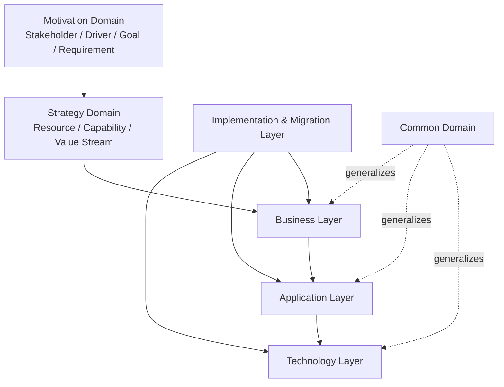

# ArchiMate 3.2/4.0 元素与 ISO 42010:2022 的对照表（ArchiMate 4 已正式发布）

> **版本**: 2026-06-12
> **对齐来源**: The Open Group ArchiMate 3.2 Specification (2023); **ArchiMate 4 Specification（已正式发布，2026-04-27，Document C260）**; ISO/IEC/IEEE 42010:2022; ArchiMate Forum, The Open Group
> **适用范围**: 软件工程架构复用知识体系 Track A — 01 元模型与标准对齐
> 📝 **勘误说明（2026-06-12）**
>
> 经 The Open Group 官方新闻稿确认，**ArchiMate 4 Specification 已于 2026-04-27 正式发布**（Document C260, April 2026），与 ArchiMate 3.2 向后兼容。
> 此前本文档（2026-06-08）因官网信息滞后，将 ArchiMate 4.0 标注为“厂商预览/未获官方确认”，该表述已纠正。
> 本文档 ArchiMate 4.0 映射部分已按正式发布状态更新，关键新增特性包括通用域（Common Domain）、多重性（Multiplicity）、行为元素合并等。

---

## 1. 背景与范围

ArchiMate 是 The Open Group 推出的企业架构建模语言。**当前官方版本为 ArchiMate 4 Specification（2026-04-27 发布），ArchiMate 3.2（2022-10）仍有效并向后兼容**。ArchiMate 4.0 在 3.2 基础上进行了概念简化和扩展，核心变化包括引入**通用域（Common Domain）**、统一跨层行为元素、增强多重性（Multiplicity）表达等。
ISO/IEC/IEEE 42010:2022 则规定了架构描述（Architecture Description）的通用元模型，包括视点（Viewpoint）、视图（View）、视图组件（View Component）、模型种类（Model Kind）等核心概念。

本文档建立 ArchiMate 3.2/4.0 核心元素与 ISO 42010:2022 概念之间的双向映射。
ArchiMate 4.0 映射部分已按 The Open Group 正式发布内容更新。
ISO/IEC/IEEE 42010:2022 则规定了架构描述（Architecture Description）的通用元模型，包括视点（Viewpoint）、视图（View）、视图组件（View Component）、模型种类（Model Kind）等核心概念。

本文档建立 ArchiMate 3.2/4.0 核心元素与 ISO 42010:2022 概念之间的双向映射，覆盖以下四层：

- **业务层（Business Layer）**
- **应用层（Application Layer）**
- **技术层（Technology Layer）**
- **实现与迁移层（Implementation & Migration Layer）**

> **注**: ArchiMate 4 引入了**通用域（Common Domain）**、**策略域（Strategy Domain）**和**动机域（Motivation Domain）**的重大重构。
> 本文档在映射时标注 3.2 与 4.0 的差异，并以 4.0 为基准进行 ISO 42010 对齐。

---

## 1.5 ArchiMate 4.0 关键变更与复用影响

ArchiMate 4 Specification（2026-04-27 发布）相对 3.2 的核心变化如下，这些变化直接影响架构复用资产的建模与消费：

| 变更主题 | ArchiMate 3.2 状态 | ArchiMate 4.0 状态 | 对复用的影响 |
|:---|:---|:---|:---|
| **通用域（Common Domain）** | 行为/结构元素按层重复定义（Business Process、Application Process、Technology Process 等） | 抽取跨层通用元素：Actor、Role、Collaboration、Process、Function、Interaction、Event、Service、Interface 等，通过层标注（layer tag）区分业务/应用/技术 | 可复用模式不再受层绑定限制；同一“服务”或“流程”抽象可在多层级复用 |
| **行为元素合并** | Business/Application/Technology Process/Function/Interaction/Event/Service 独立 | 合并为 Common Domain 的通用行为元素 | 减少元模型冗余，降低资产库分类复杂度 |
| **多重性（Multiplicity）** | 仅部分关系支持数量表达 | 在元素和关系上显式支持 Multiplicity（0..1、1..*、* 等） | 支持规模化复用场景（如 N 个微服务实例、负载均衡组件） |
| **策略与动机域整合** | Strategy 和 Motivation 为独立扩展域 | 进一步强化与核心层的集成，Outcome、Capability、Resource 等概念更紧密关联 | 业务目标到可复用能力的追溯更直接 |
| **服务定义统一** | 各层服务定义略有差异 | Service 作为通用元素，强调“对外暴露价值”而无层边界 | 促进跨层服务复用与 API 化表达 |
| **向后兼容** | — | 3.2 模型可在 4.0 工具中打开，旧层特定元素可通过标注映射到通用域 | 现有复用资产无需重写即可迁移 |

### 复用视角下的关键收益

1. **元模型资产复用**：通用域使“流程”“功能”“服务”等抽象不再被业务/应用/技术三层割裂，可在企业架构资产库中建立跨层参考模式。
2. **视点模板复用**：基于 Common Domain 的视点（如 Service Realization、Process Cooperation）可在不同层级复用同一套模型种类（Model Kind）。
3. **规模化表达**：Multiplicity 支持在架构描述中直接表达组件实例数量，对云原生、微服务、容器化复用场景尤为重要。
4. **迁移成本低**：向后兼容保证现有 ArchiMate 3.2 资产可逐步演进到 4.0，无需一次性重构。

---

## 2. 元模型级映射：ArchiMate 语言结构 vs ISO 42010

| ISO 42010:2022 概念 | ArchiMate 3.2/4.0 对应 | 映射说明 |
|---------------------|------------------------|----------|
| **Architecture Description (AD)** | ArchiMate Model / Repository | ArchiMate 模型库是 AD 的载体 |
| **Architecture Description Framework (ADF)** | ArchiMate Full Framework | ArchiMate 本身是一个符合 ISO 42010 的 ADF |
| **Architecture Description Language (ADL)** | ArchiMate Modeling Language | ArchiMate 是一种标准化的 ADL |
| **Viewpoint** | ArchiMate Viewpoint | ArchiMate 定义了 23+ 个标准视点 |
| **View** | ArchiMate Diagram / View | 从视点生成的具体图表或视图 |
| **View Component** | ArchiMate Element (in a View) | 视图中的元素实例 |
| **Model Kind** | Aspect × Layer 分类矩阵 | ArchiMate 的 Aspect（主动结构/行为/被动结构）与 Layer 的组合定义了 Model Kind |
| **Stakeholder** | Stakeholder (Motivation Domain) | ArchiMate 动机域中的利益相关者元素 |
| **Concern** | Driver, Assessment, Goal, Requirement | 动机域元素对应关注点 |
| **Correspondence** | Relationship (structural, dependency, dynamic) | ArchiMate 关系类型表达对应规则 |
| **Architecture Decision** | Plateau, Gap, Work Package (I&M Layer) | 实现与迁移元素记录架构决策与状态变化 |

---

## 3. 业务层（Business Layer）映射

### 3.1 业务层核心元素

ArchiMate 业务层描述企业的业务结构、行为和信息，与 TOGAF Phase B（Business Architecture）直接对应。

| ArchiMate 3.2 元素 | ArchiMate 4.0 元素 | 元素类别 | ISO 42010:2022 映射 | 说明 |
|---------------------|---------------------|----------|---------------------|------|
| Business Actor | Actor (Common Domain, 可标注为业务) | 主动结构 | Stakeholder / Active Structure View Component | 业务参与者 |
| Business Role | Role (Common Domain, 可标注为业务) | 主动结构 | Active Structure View Component | 业务角色 |
| Business Collaboration | Collaboration (Common Domain) | 主动结构 | Active Structure View Component | 跨主体协作 |
| Business Process | Process (Common Domain, 可标注为业务) | 行为 | Behavior View Component | 业务流程 |
| Business Function | Function (Common Domain, 可标注为业务) | 行为 | Behavior View Component | 业务功能 |
| Business Interaction | Process / Function (Common Domain) | 行为 | Behavior View Component | 4.0 中合并为通用行为 |
| Business Event | Event (Common Domain, 可标注为业务) | 行为 | Behavior View Component | 业务事件 |
| Business Service | Service (Common Domain, 可标注为业务) | 行为 | Behavior View Component | 对外业务服务 |
| Business Object | Business Object | 被动结构 | Passive Structure View Component | 业务对象/信息实体 |
| Product | Product | 被动结构 | Passive Structure View Component | 产品/服务组合 |
| Contract | Business Object (加契约语义标注) | 被动结构 | Passive Structure View Component | 4.0 移除 Contract，建议用标注实现 |
| Representation | Data Object / Artifact / Material | 被动结构 | Passive Structure View Component | 4.0 移除 Representation，映射到被动结构 |
| Meaning | Meaning | 动机 | Concern / Rationale | 业务含义 |
| Value | Value | 动机 | Concern / Rationale | 业务价值 |

### 3.2 业务层 → ISO 42010 Viewpoint 映射

| ArchiMate 业务层视点（示例） | ISO 42010:2022 Viewpoint | 包含的 Model Kind | 对应的 Concern |
|------------------------------|--------------------------|-------------------|----------------|
| Organization Viewpoint | Stakeholder Perspective Viewpoint | Organization Model | 组织责任、汇报线 |
| Business Process Viewpoint | Behavioral Viewpoint | Process Model (BPMN-like) | 流程效率、瓶颈 |
| Product Viewpoint | Structural Viewpoint | Product Composition Model | 产品构成、价值交付 |
| Service Realization Viewpoint | Realization Viewpoint | Service-Process Realization Model | 服务实现、能力映射 |

### 3.3 ABB/SBB 在业务层的体现

| 层级 | ArchiMate 表示 | 示例 |
|------|----------------|------|
| **ABB（逻辑）** | Business Process "Order-to-Cash" | 抽象业务流程定义 |
| **SBB（物理）** | SAP SD Module Workflow + Custom Extensions | SAP 销售分销模块工作流及定制 |

---

## 4. 应用层（Application Layer）映射

### 4.1 应用层核心元素

ArchiMate 应用层描述支持业务的信息系统与应用软件架构。

| ArchiMate 3.2 元素 | ArchiMate 4.0 元素 | 元素类别 | ISO 42010:2022 映射 | 说明 |
|---------------------|---------------------|----------|---------------------|------|
| Application Component | Application Component | 主动结构 | Active Structure View Component | 应用组件 |
| Application Collaboration | Collaboration (Common Domain) | 主动结构 | Active Structure View Component | 应用协作 |
| Application Interface | Interface (Common Domain, 可标注为应用) | 主动结构 | Active Structure View Component | 应用接口 |
| Application Process | Process (Common Domain, 可标注为应用) | 行为 | Behavior View Component | 4.0 合并为通用 Process |
| Application Function | Function (Common Domain, 可标注为应用) | 行为 | Behavior View Component | 4.0 合并为通用 Function |
| Application Interaction | Process / Function (Common Domain) | 行为 | Behavior View Component | 4.0 合并 |
| Application Event | Event (Common Domain, 可标注为应用) | 行为 | Behavior View Component | 应用事件 |
| Application Service | Service (Common Domain, 可标注为应用) | 行为 | Behavior View Component | 应用服务 |
| Data Object | Data Object | 被动结构 | Passive Structure View Component | 数据对象 |

### 4.2 应用层 → ISO 42010 Viewpoint 映射

| ArchiMate 应用层视点（示例） | ISO 42010:2022 Viewpoint | 包含的 Model Kind | 对应的 Concern |
|------------------------------|--------------------------|-------------------|----------------|
| Application Structure Viewpoint | Structural Viewpoint | Component Model | 应用组合、模块化 |
| Application Behavior Viewpoint | Behavioral Viewpoint | Process/Function Model | 应用行为、处理逻辑 |
| Application Usage Viewpoint | Usage Viewpoint | Usage Model | 业务-应用依赖关系 |
| Data Structure Viewpoint | Information Viewpoint | Data/Class Model | 数据一致性、实体关系 |

### 4.3 ABB/SBB 在应用层的体现

| 层级 | ArchiMate 表示 | 示例 |
|------|----------------|------|
| **ABB（逻辑）** | Application Component "Customer Service" + Application Interface "REST API" | 逻辑组件与接口定义 |
| **SBB（物理）** | Spring Boot Microservice (v3.2) + OpenAPI 3.0 Spec + Docker Image | 具体微服务、API 契约、容器镜像 |

---

## 5. 技术层（Technology Layer）映射

### 5.1 技术层核心元素

ArchiMate 技术层描述技术基础设施，包括 IT 和物理技术（ArchiMate 4 将 Physical Layer 并入 Technology Domain）。

| ArchiMate 3.2/3.1 元素 | ArchiMate 4.0 元素 | 元素类别 | ISO 42010:2022 映射 | 说明 |
|------------------------|---------------------|----------|---------------------|------|
| Node | Node | 主动结构 | Active Structure View Component | 计算节点 |
| Device | Device | 主动结构 | Active Structure View Component | 物理设备 |
| System Software | System Software | 主动结构 | Active Structure View Component | 系统软件 |
| Technology Collaboration | Collaboration (Common Domain) | 主动结构 | Active Structure View Component | 技术协作 |
| Technology Interface | Interface (Common Domain, 可标注为技术) | 主动结构 | Active Structure View Component | 技术接口 |
| Technology Process | Process (Common Domain, 可标注为技术) | 行为 | Behavior View Component | 4.0 合并为通用 Process |
| Technology Function | Function (Common Domain, 可标注为技术) | 行为 | Behavior View Component | 4.0 合并为通用 Function |
| Technology Service | Service (Common Domain, 可标注为技术) | 行为 | Behavior View Component | 技术服务 |
| Technology Event | Event (Common Domain, 可标注为技术) | 行为 | Behavior View Component | 技术事件 |
| Artifact | Artifact | 被动结构 | Passive Structure View Component | 可部署制品 |
| Communication Network | Communication Network | 主动结构 | Active Structure View Component | 通信网络 |
| Path (3.2 无，4.0 新增) | Path (Common Domain) | 主动/行为 | Active/Behavior View Component | 逻辑路径（数据/能量/物质） |
| Equipment (Physical) | Equipment (Technology Domain) | 主动结构 | Active Structure View Component | 物理设备/装备 |
| Facility (Physical) | Facility (Technology Domain) | 主动结构 | Active Structure View Component | 物理设施 |
| Distribution Network (Physical) | Distribution Network (Technology Domain) | 主动结构 | Active Structure View Component | 分配/传输网络 |
| Material (Physical) | Material (Technology Domain) | 被动结构 | Passive Structure View Component | 物质/材料 |

### 5.2 技术层 → ISO 42010 Viewpoint 映射

| ArchiMate 技术层视点（示例） | ISO 42010:2022 Viewpoint | 包含的 Model Kind | 对应的 Concern |
|------------------------------|--------------------------|-------------------|----------------|
| Infrastructure Viewpoint | Deployment Viewpoint | Deployment Model | 基础设施布局、容量 |
| Technology Usage Viewpoint | Dependency Viewpoint | Dependency Model | 应用-技术依赖关系 |
| Equipment Viewpoint (Physical) | Physical Viewpoint | Physical Layout Model | 物理设备布局、OT 安全 |
| Network Viewpoint | Connectivity Viewpoint | Network Topology Model | 网络拓扑、分段策略 |

### 5.3 ABB/SBB 在技术层的体现

| 层级 | ArchiMate 表示 | 示例 |
|------|----------------|------|
| **ABB（逻辑）** | Technology Service "Container Orchestration" + Node "Compute Cluster" | 逻辑技术服务与节点定义 |
| **SBB（物理）** | AWS EKS v1.29 + EC2 m6i.xlarge Instances + VPC CNI | 具体云服务、实例类型、网络插件 |

### 5.4 ArchiMate 4 的重要变化：Path 与 Realization

ArchiMate 4 引入了 **Path** 概念（位于 Common Domain），用于表达跨层的逻辑路径（数据路径、能源路径、物料路径）。
Path 由下层技术元素 **realized by** 具体实现。这与 ISO 42010:2022 的 **Correspondence** 概念高度一致：Path 定义了逻辑对应规则，其实现元素定义了物理对应实例。

```text
Path "Secure API Gateway Path" (Common Domain)
    └── realized by → Node "Kong Gateway" (Technology Domain)
        └── realized by → Device "AWS ALB" + System Software "Kong 3.5"
```

---

## 6. 实现与迁移层（Implementation & Migration Layer）映射

### 6.1 实现与迁移层核心元素

该层支持 TOGAF ADM Phase E/F/G 的实现规划与迁移管理。

| ArchiMate 3.2/3.1 元素 | ArchiMate 4.0 元素 | 元素类别 | ISO 42010:2022 映射 | 说明 |
|------------------------|---------------------|----------|---------------------|------|
| Work Package | Work Package | 实现元素 | Process/Activity View Component | 工作包 |
| Deliverable | Deliverable | 实现元素 | View Component / Information Part | 交付物 |
| Plateau | Plateau | 实现元素 | Baseline / State View Component | 架构基线/ plateau |
| Gap | Assessment 或 Deliverable (4.0 移除 Gap) | 实现元素 | Assessment View Component | 4.0 建议用 Assessment 或 Deliverable 替代 |
| Implementation Event | Event (Common Domain, 加标注) | 实现元素 | Event View Component | 4.0 合并为通用 Event |

### 6.2 实现与迁移层 → ISO 42010 Viewpoint 映射

| ArchiMate I&M 视点（示例） | ISO 42010:2022 Viewpoint | 包含的 Model Kind | 对应的 Concern |
|----------------------------|--------------------------|-------------------|----------------|
| Implementation and Migration Viewpoint | Transition Viewpoint | Migration/Transition Model | 迁移顺序、依赖、风险 |
| Project Viewpoint | Project Management Viewpoint | Work Breakdown Model | 工作包分解、资源分配 |
| Plateau & Gap Viewpoint (3.2) | Baseline Comparison Viewpoint | Diff/Baseline Model | 基线差异、差距分析 |

### 6.3 与 ISO 42010 架构决策的映射

ISO 42010:2022 要求 Architecture Description 必须包含 **Architecture Decision** 和 **Architecture Rationale**（Clause 6.10）。
ArchiMate 的实现与迁移元素提供了决策的载体：

| ISO 42010:2022 | ArchiMate 4.0 映射 | 说明 |
|----------------|--------------------|------|
| Architecture Decision | Work Package + Deliverable | 工作包定义了"做什么决策"，交付物定义了"决策结果" |
| Architecture Rationale | Assessment + Goal + Outcome | 动机域的 Assessment 与 Goal 提供决策依据 |
| Decision Timeline | Plateau → Plateau Transition | Plateau 序列表达决策的时间线 |

---

## 7. 动机域（Motivation Domain）与策略域（Strategy Domain）映射

虽然动机域和策略域不属于传统四层，但它们是架构描述中"为什么"和"做什么"的关键部分，与 ISO 42010 的 Stakeholder/Concern/Decision 直接相关。

### 7.1 动机域元素映射

| ArchiMate 4.0 元素 | ISO 42010:2022 映射 | 说明 |
|--------------------|--------------------|------|
| Stakeholder | Stakeholder | 直接对应 |
| Driver | Concern (environmental influence) | 驱动因素是外部环境影响 |
| Assessment | Concern / Rationale input | 评估结果是决策输入 |
| Goal | Concern (objective) | 目标是具体的关注点 |
| Outcome | Concern (expected result) | 成果是期望状态 |
| Principle | Rationale / Decision constraint | 原则是决策约束 |
| Requirement | Concern / Specification | 需求是规格化的关注点 |
| Constraint | Requirement (stereotyped) | 4.0 中 Constraint 移除，建议用 Requirement 加标注 |
| Meaning | Concern (semantic) | 语义关注点 |
| Value | Concern (business value) | 价值关注点 |

### 7.2 策略域元素映射

| ArchiMate 4.0 元素 | ISO 42010:2022 映射 | 说明 |
|--------------------|--------------------|------|
| Resource | Active Structure View Component | 战略资源 |
| Capability | Behavior View Component | 业务能力 |
| Value Stream | Behavior View Component (sequence) | 价值流 |
| Course of Action | Decision / Process View Component | 行动路线 |

---

## 8. 综合对照矩阵：四层核心元素 vs ISO 42010

| 层面 | 主动结构 (Active Structure) | 行为 (Behavior) | 被动结构 (Passive Structure) | ISO 42010 Model Kind |
|------|----------------------------|-----------------|------------------------------|---------------------|
| **业务层** | Actor, Role, Collaboration | Process, Function, Service, Event | Business Object, Product | Business Model Kind |
| **应用层** | Application Component, Interface | Process, Function, Service, Event | Data Object | Application Model Kind |
| **技术层** | Node, Device, System Software, Network | Process, Function, Service, Event | Artifact, Material | Technology Model Kind |
| **实现层** | (通过分配关系关联) | Work Package, Event | Deliverable, Plateau | Implementation Model Kind |

---

## 9. ArchiMate 3.2 → 4.0 迁移对 ISO 42010 映射的影响

ArchiMate 4.0 的重大概念简化影响了 ISO 42010 映射方式：

| 变化项 | ArchiMate 3.2 | ArchiMate 4.0 | ISO 42010 映射影响 |
|--------|---------------|---------------|-------------------|
| 层特定行为元素 | Business Process, Application Process, Technology Process | 通用 Process (Common Domain) + 层标注 | Model Kind 的区分从元素类型转向标注/Profile，更符合 ISO 42010 的"Model Kind 是约定类别"的定义 |
| 层特定角色/协作 | Business Role, Business Collaboration, etc. | 通用 Role, Collaboration + 层标注 | 同上 |
| Constraint / Contract / Gap / Representation | 独立元素类型 | 移除或合并到通用元素 + 标注 | View Component 的粒度统一，Correspondence 通过关系而非元素类型表达 |
| Path | 无 | 新增 Common Domain 元素 | 直接支持 ISO 42010 的 Correspondence 概念，逻辑路径与物理实现的分离更清晰 |
| Implementation Event | 独立元素 | 通用 Event + 上下文标注 | 事件模型统一，通过 Viewpoint 区分生命周期阶段 |

---

## 10. 对齐验证

### 10.1 与 ArchiMate 官方规范的对齐

- **The Open Group: ArchiMate 3.2 Specification (2023)** — 定义了业务/应用/技术/物理/实现五层核心语言及动机扩展。[[来源](https://pubs.opengroup.org/architecture/archimate32-doc/)]
- **The Open Group: ArchiMate 4 Specification (2026-04-27)** — 引入 Common Domain、Strategy Domain、Path 概念，合并层特定行为/结构元素为通用元素。向后兼容 ArchiMate 3.2。[官方下载](https://www.opengroup.org/archimate-licensed-downloads) / [官方公告](https://www.opengroup.org/The-Open-Group-Announces-ArchiMate%C2%AE-4-Specification)
- **ArchiMate Forum, The Open Group (2025-2026)** — ArchiMate 4 的 Motivation White Paper 解释了 Path、Realization 模式与跨层治理的设计意图。

### 10.2 与 ISO 42010:2022 的对齐

- **ISO/IEC/IEEE 42010:2022, Clause 3** — 定义了 View Component 作为"separable portion of one or more architecture views"，ArchiMate 的 Element 在 View 中的实例即符合此定义。
- **ISO/IEC/IEEE 42010:2022, Clause 5.2.5** — 定义了 Model Kind 作为"category of model distinguished by its key characteristics and modelling conventions"。ArchiMate 的 Layer × Aspect 矩阵是 Model Kind 的典型实现。
- **ISO/IEC/IEEE 42010:2022, Clause 6.10** — 要求记录 Architecture Decision 和 Rationale。ArchiMate 4 的动机域（Goal, Principle, Assessment, Outcome）与实现域（Work Package, Deliverable, Plateau）共同支撑此要求。
- **ISO/IEC/IEEE 42010:2022, Annex F** — ArchiMate 被列为符合 ISO 42010 的 Architecture Description Language (ADL) 示例。

### 10.3 验证结论

1. **ArchiMate 的 Layer-Aspect 结构天然对应 ISO 42010 的 Model Kind-View Component 层次**。每层（业务/应用/技术/实现）结合每方面（主动结构/行为/被动结构）定义了一种独特的模型种类。
2. **ArchiMate 4 的通用化趋势与 ISO 42010:2022 的抽象层级理念一致**。通过将层特定元素合并为通用元素（Common Domain）并依赖标注/Profile 区分，ArchiMate 4 更接近 ISO 42010 "Viewpoint 决定观察角度" 的哲学。
3. **Path 与 Realization 机制的引入填补了 ArchiMate 在逻辑-物理分离方面的空白**，与 ISO 42010 的 Correspondence 概念形成精确映射。
4. **动机域和策略域完整覆盖了 ISO 42010 的 Stakeholder-Concern-Decision-Rationale 链条**，使 ArchiMate 成为少有的能完整表达 ISO 42010 全部概念的商业 ADL。

---

## 11. 参考索引

1. The Open Group. *ArchiMate 3.2 Specification*. 2023. <https://pubs.opengroup.org/architecture/archimate32-doc/>
2. The Open Group. *ArchiMate 4 Specification*（正式发布，2026-04-27，Document C260，白皮书 W262）. <https://www.opengroup.org/archimate-licensed-downloads>
3. ISO/IEC/IEEE. *ISO/IEC/IEEE 42010:2022 — Software, systems and enterprise — Architecture description*. 2022. <https://www.iso.org/standard/74296.html>
4. 4m4.it. "ArchiMate 4 and the Cartography of Complexity". 2026. <https://4m4.it/longforms/archimate_4_and_the_cartography_of_complexity/>
5. LeanIX. "What is ArchiMate? Key Components & Comparisons". <https://www.leanix.net/en/wiki/ea/what-is-archimate>
6. Visual Paradigm. "ArchiMate Diagram Tutorial". <https://online.visual-paradigm.com/diagrams/tutorials/archimate-tutorial/>

---

> **最后更新**: 2026-06-06
> **维护者**: Track A — 01 元模型与标准对齐
> **状态**: Phase 2 交付物（T06 完成）


---

## 补充：ArchiMate 4.0 六层/核心元素与 ISO 42010 的映射

> 本节按内容要素检查清单，对 ArchiMate 4.0 的六层/域（业务、应用、技术、动机、策略、实现与迁移）及通用域（Common Domain）核心元素与 ISO/IEC/IEEE 42010:2022 的映射进行系统化补全。
> 相关 Wikipedia 概念结构：
> [ArchiMate](https://en.wikipedia.org/wiki/ArchiMate)、
> [TOGAF](https://en.wikipedia.org/wiki/The_Open_Group_Architecture_Framework)、
> [ISO/IEC/IEEE 42010](https://en.wikipedia.org/wiki/ISO/IEC/IEEE_42010)、
> [Ontology](https://en.wikipedia.org/wiki/Ontology_(information_science))。

### 1. 概念定义

**定义**：ArchiMate 4.0 是 The Open Group 发布的企业架构建模语言规范，通过业务层（Business Layer）、应用层（Application Layer）、技术层（Technology Layer）、动机域（Motivation Domain）、策略域（Strategy Domain）、实现与迁移层（Implementation & Migration Layer）以及跨层通用域（Common Domain）构成完整的架构描述语言（ADL）。在 ISO/IEC/IEEE 42010:2022 的语境下，ArchiMate 本身即是一个符合标准的 Architecture Description Framework（ADF），其层/域对应 Viewpoint，方面（Aspect）对应 Model Kind，元素实例对应 View Component。

### 2. ArchiMate 4.0 六层/域属性

| 属性 | 说明 | 可观察性 |
|------|------|----------|
| 分层清晰性 | 每个元素明确归属于某一层或域 | 高 |
| 方面一致性 | 每个元素属于主动结构、行为或被动结构之一 | 高 |
| 通用域复用 | 跨层通用元素可通过层标注（layer tag）区分上下文 | 中 |
| 关系可表达性 | 支持 serving、realization、assignment、aggregation、composition、flow 等 | 高 |
| ISO 42010 一致性 | Viewpoint/View/Model Kind/View Component 可被直接映射 | 中 |
| 向后兼容性 | ArchiMate 3.2 模型可在 4.0 工具中打开并迁移 | 高 |

### 3. 六层/域与 ISO 42010 映射

| ArchiMate 4.0 层/域 | ISO 42010:2022 概念 | 核心元素（示例） | 复用说明 |
|---------------------|---------------------|------------------|----------|
| **业务层 Business Layer** | Viewpoint / Model Kind / View | Actor、Role、Process、Function、Service、Event、Business Object、Product | 业务能力目录与价值流模板在该层复用 |
| **应用层 Application Layer** | Viewpoint / Model Kind / View | Application Component、Interface、Application Service、Data Object | 微服务模板、API 契约、数据模型在该层复用 |
| **技术层 Technology Layer** | Viewpoint / Model Kind / View | Node、Device、System Software、Technology Service、Artifact、Communication Network | 容器镜像、基础设施即代码、网络拓扑在该层复用 |
| **动机域 Motivation Domain** | Stakeholder / Concern / Rationale | Stakeholder、Driver、Assessment、Goal、Outcome、Principle、Requirement | 将“为什么复用”与“复用目标”显性化 |
| **策略域 Strategy Domain** | Concern / Aspect | Resource、Capability、Value Stream、Course of Action | 支撑业务战略到可复用能力的映射 |
| **实现与迁移层 Implementation & Migration Layer** | Architecture Decision / Rationale / View | Work Package、Deliverable、Plateau | 记录复用资产的引入、迁移与退役决策 |
| **通用域 Common Domain** | Model Kind / View Component | Actor、Role、Collaboration、Process、Function、Interaction、Event、Service、Interface、Path | 跨层抽象，支持模式库在多层复用 |

### 4. 关系说明

- **层间 realization 链**：业务服务 → 应用服务 → 技术服务，形成“业务能力到技术实现”的纵向追溯链。
- **Common Domain 泛化关系**：通用域元素通过 layer tag 实例化为业务/应用/技术层元素，实现元模型资产复用。
- **Motivation/Strategy → Core Layers**：动机域的 Goal/Requirement 驱动业务层设计；策略域的 Capability 映射到应用/技术层实现。
- **Implementation & Migration ↔ Core Layers**：Work Package/Deliverable/Plateau 记录核心层元素的变更状态与决策。
- **ISO 42010 Correspondence ↔ ArchiMate Relationship**：ArchiMate 的 realization、serving、assignment 等关系可直接作为跨层/跨视图对应关系的具体化。

### 5. 形式化/结构化分析



### 示例

**正向示例**：某物流企业使用 ArchiMate 4.0 建模“订单履约”复用资产：

- **业务层**：Business Service “订单履约服务” realized by Business Process “订单处理流程”。
- **应用层**：Application Service “Order Fulfillment API” realizes 业务服务；Application Component “OrderService” 实现该应用服务。
- **技术层**：Technology Service “Container Orchestration” realizes 应用组件；Node “K8s Cluster” 提供运行环境。
- **通用域**：通用 Service 元素通过 layer tag 同时用于业务、应用、技术层，避免重复定义。
- **动机域**：Goal “缩短履约周期”驱动 Requirement “订单状态实时同步”，并追溯至应用服务设计。
- **实现与迁移层**：Work Package “订单服务容器化” 记录从单体到微服务的迁移决策。

结果：该模型可作为标准化视点模板，在新业务线（冷链、跨境）复用，影响分析时间从数周缩短至数天。

### 反例

**反模式**：某团队在 ArchiMate 建模中将“数据库”画为业务层 Business Object：

- 混淆了技术实现与业务语义，导致业务方误以为“数据库”是业务实体。
- 在生成应用架构视图时，无法通过 realization 关系正确追溯到技术层 Artifact。
- 复用该模型时，下游团队错误地将业务对象规则套用到数据表设计，造成数据模型冗余。

**另一个反例**：滥用 Aggregation 关系表达所有复用：

- 将“客户组件聚合订单组件”同时表达组合、依赖与复用，掩盖了真正的 serving 与 realization 语义。
- 自动一致性检查无法识别跨层不一致，模型沦为装饰性图表。

**避免建议**：严格区分层边界；使用正确的关系类型；对通用域元素显式标注 layer tag；定期开展模型合规评审。

### 8. 权威来源

> **权威来源**：
>
> - [The Open Group - ArchiMate 4 Specification (Document C260, April 2026)](https://www.opengroup.org/archimate-licensed-downloads) — The Open Group（白皮书 W262 同步发布）（核查日期：2026-07-08）
> - [The Open Group - ArchiMate 4 发布公告](https://www.opengroup.org/The-Open-Group-Announces-ArchiMate%C2%AE-4-Specification) — The Open Group（核查日期：2026-07-08）
> - [The Open Group - ArchiMate 3.2 Specification](https://pubs.opengroup.org/architecture/archimate32-doc/)（核查日期：2026-07-08）
> - [ISO/IEC/IEEE 42010:2022 — Architecture description](https://www.iso.org/standard/74296.html) — ISO（核查日期：2026-07-08）
> - [ISO/IEC/IEEE 42020:2019 — Architecture processes](https://www.iso.org/standard/68982.html) — ISO（核查日期：2026-07-08）
> - [ISO/IEC/IEEE 42030:2019 — Architecture evaluation](https://www.iso.org/standard/73436.html) — ISO（核查日期：2026-07-08）
> - [TOGAF® Standard, 10th Edition](https://www.opengroup.org/togaf) — The Open Group（核查日期：2026-07-08）
> - [ArchiMate - Wikipedia](https://en.wikipedia.org/wiki/ArchiMate)（核查日期：2026-07-08）
>
> **核查日期**：2026-07-08

### 9. 交叉引用

- ISO 42010 核心概念详见 [`../01-iso-420xx-family/iso-42010-2022.md`](../01-iso-420xx-family/iso-42010-2022.md)
- 标准对齐矩阵详见 [`../01-iso-420xx-family/alignment-matrix.md`](../01-iso-420xx-family/alignment-matrix.md)
- TOGAF 企业连续体与构建块复用详见 [`../02-togaf-10-alignment/togaf-enterprise-continuum-reuse.md`](../02-togaf-10-alignment/togaf-enterprise-continuum-reuse.md)
- 四层复用本体详见 [`../06-formal-axioms/four-layer-ontology.md`](../06-formal-axioms/four-layer-ontology.md)
- SWEBOK V4 对齐详见 [`../05-swebok-v4/swebok-alignment.md`](../05-swebok-v4/swebok-alignment.md)
