# 形式化公理体系

> **版本**: 2026-06-06 (Phase 3 完整版)
> **定位**: 建立"软件工程架构复用视角"的元层公理系统，为全体系提供逻辑基础
> **依据**: Bunge-Wand-Weber (BWW) 本体论、DOLCE 顶层本体论 (ISO/IEC 21838-3:2023)、ISO/IEC 21838 Top-Level Ontologies、Assume-Guarantee 推理、组件组合理论

---

## 概念定义

**定义**：形式化公理体系是通过公理、定理与推导规则对“复用”概念进行严格数学刻画的知识基础，旨在消除自然语言歧义，为跨层复用提供逻辑一致性保证。

## 符号约定

| 符号 | 含义 |
|------|------|
| $\mathcal{A}$ | 架构 (Architecture) 的论域 |
| $\mathcal{C}$ | 组件 (Component) 的论域 |
| $\mathcal{R}$ | 复用资产 (Reusable Asset) 的论域 |
| $\mathcal{Ctx}$ | 上下文 (Context) 的论域 |
| $\mathcal{V}$ | 约束/价值 (Constraint/Value) 的论域 |
| $\Rightarrow$ | 逻辑蕴含 |
| $\Leftrightarrow$ | 逻辑等价 |
| $\forall$ | 全称量词 |
| $\exists$ | 存在量词 |
| $\in$ | 属于 |
| $\subseteq$ | 子集 |
| $\prec$ | 严格先于 / 层次低于 |
| $\circ$ | 组合操作符 |
| $\models$ | 满足 / 语义蕴含 |
| $\mathrm{Obs}$ | 可观察行为函数 |
| $\mathrm{Trust}$ | 信任边界函数 |
| $\mathrm{Reuse}$ | 复用谓词 |

---

## 1. 元公理 (Meta-Axioms)

元公理声明"复用"本身的本质属性，不依赖于具体技术实现。它们构成整个公理体系的最底层逻辑基础。

---

### M.1 Architecture-Reuse Duality (架构-复用二元性) {#m1-architecture-reuse-duality}

**自然语言表述**

> 架构的本质是**约束的集合**；复用的本质是**约束的传递**。不存在不传递约束的复用，也不存在不基于约束的架构。

**形式化表述**

设 $A \in \mathcal{A}$ 为一个架构，$A = \langle C, R, V \rangle$，其中：

- $C$: 组件集合
- $R \subseteq C \times C$: 组件间关系集合
- $V$: 作用于 $C$ 和 $R$ 的约束集合

则复用 $\mathrm{Reuse}(A, \mathit{Ctx})$ 等价于：

$$
\mathrm{Reuse}(A, \mathit{Ctx}) \Leftrightarrow \exists V' \subseteq V: V' \models \mathit{Ctx}
$$

其中 $V' \models \mathit{Ctx}$ 表示约束子集 $V'$ 在上下文 $\mathit{Ctx}$ 中语义有效。

**直观解释**
当复用一个架构时，真正传递的不是组件本身，而是约束。组件可以替换，但约束必须保持。这对应于 BWW 本体论中的"law"（定律）概念——系统行为受其内在规律的约束。

**可证伪条件**
若存在一种复用场景，其中被复用资产的约束集 $V$ 为空集（即没有任何约束被传递），且该场景仍被业界公认为"复用"而非"复制"，则 M.1 失效。

---

### M.2 Variability Axiom (可变性公理) {#m2-variability-axiom}

**自然语言表述**

> 复用的本质是管理**共性 (Commonality)** 与**变性 (Variability)** 的分离与绑定。没有变性管理的复用是克隆，不是工程。

**形式化表述**

设 $S \in \mathcal{R}$ 为软件资产族，$S = \langle B, V, \Gamma \rangle$，其中：

- $B$: 不变的核心（Base）
- $V = \{v_1, v_2, \ldots, v_n\}$: 可变的点集（Variation Points）
- $\Gamma: V \times \mathcal{Ctx} \to B'$: 绑定规则，将变体映射到具体实例

则：

$$
\mathrm{Reuse}(S) \Leftrightarrow B \neq \emptyset \land V \neq \emptyset \land \forall \mathit{ctx} \in \mathcal{Ctx}: \Gamma(V, \mathit{ctx}) \text{ 是良定义的}
$$

**直观解释**
可复用资产必须明确区分"什么是不变的"和"什么是可以变的"。这对应于 DOLCE 本体论中对"endurant"（ enduring entity）与"perdurant"（ occurring entity）的区分——共性是持久的，变性是发生在时间中的绑定过程。

**可证伪条件**
若存在一类被广泛认可为"复用"的软件资产，其变性点集 $V = \emptyset$（即无任何可配置性），且该资产的复用次数 $N > 1000$ 仍不需要任何变体管理，则 M.2 需限定范围。

---

### M.3 Hierarchy Non-Reduction (层次不可约性) {#m3-hierarchy-non-reduction}

**自然语言表述**

> 复用具有层次性（业务→应用→组件→功能），层次间**不可约化**。某一层的复用失败不能通过另一层的优化完全弥补。

**形式化表述**

设层次集合 $L = \{L_{\text{business}}, L_{\text{application}}, L_{\text{component}}, L_{\text{function}}\}$，偏序关系 $\prec$ 表示"层次低于"。

$$
\forall L_i, L_j \in L, i \neq j: \neg\exists f: \mathcal{R}_{L_i} \to \mathcal{R}_{L_j} \text{ s.t. } \mathrm{Reuse}(L_i) = f(\mathrm{Reuse}(L_j))
$$

即：不存在从一层复用资产到另一层复用资产的函数映射，使得一层的复用可完全被另一层的复用替代。

**直观解释**
业务层的价值流复用不能替代组件层的接口设计；组件层的完美复用也不能弥补业务层的价值定义错误。这与 ISO/IEC 21838 中顶层本体论 (TLO) 与领域本体论不可相互还原的思想一致。

**可证伪条件**
若有人能构造一个形式化证明，证明任意两层 $L_i, L_j$ 之间存在保持复用语义的双射 $f$，且该证明通过同行评审，则 M.3 失效。

---

### M.4 Identity Preservation (同一性保持) {#m4-identity-preservation}

**自然语言表述**

> 复用必须保持被复用资产的**本体同一性 (Ontological Identity)**。若资产 $A$ 被复用到上下文 $Ctx_1$ 和 $Ctx_2$，则 $A$ 在两种上下文中的核心本体标识不变，仅其**角色 (Role)** 和**实现形态**可变。

**形式化表述**

设 $\mathrm{Id}: \mathcal{R} \to \mathcal{I}$ 为同一性函数，将资产映射到其本体标识空间 $\mathcal{I}$；$\mathrm{Role}: \mathcal{R} \times \mathcal{Ctx} \to \mathcal{P}(\mathcal{R})$ 为角色函数。

$$
\forall r \in \mathcal{R}, \forall \mathit{ctx}_1, \mathit{ctx}_2 \in \mathcal{Ctx}:
\mathrm{Id}(\mathrm{Reuse}(r, \mathit{ctx}_1)) = \mathrm{Id}(\mathrm{Reuse}(r, \mathit{ctx}_2)) = \mathrm{Id}(r)
$$

**直观解释**
这对应于 DOLCE 的"物理对象-角色"区分：一个组件（如认证服务）在不同系统中扮演的角色可能不同，但其本体同一性（"提供身份验证功能的服务"）保持不变。

**可证伪条件**
若存在复用场景，其中资产在复用后其核心语义发生根本性改变（例如"日志服务"被复用后变成"支付网关"），且该场景仍被称为"复用"而非"误用"，则 M.4 失效。

---

## 2. 存在性公理 (Existence Axioms)

存在性公理规定复用资产在论域中存在的必要条件。不满足这些条件的软件实体不构成可复用资产。

---

### E.1 Reuse Asset Existence (复用资产存在性)

**自然语言表述**

> 并非所有软件资产都适合复用。可复用资产必须同时满足三个必要条件：**稳定性**、**通用性**和**封装性**。

**形式化表述**

设 $a \in \mathcal{R}$，则：

$$
a \in \mathcal{R} \Leftrightarrow \mathrm{Stable}(a) \land \mathrm{General}(a) \land \mathrm{Encapsulated}(a)
$$

其中：

- $\mathrm{Stable}(a) \Leftrightarrow \lambda_{\text{change}}(a) < \lambda_{\text{use}}(a)$，即变更频率低于使用频率
- $\mathrm{General}(a) \Leftrightarrow |\{\mathit{ctx} \in \mathcal{Ctx} : a \models \mathit{ctx}\}| \geq 2$，即适用于至少两个不同上下文
- $\mathrm{Encapsulated}(a) \Leftrightarrow \exists \mathrm{Interface}(a): \mathrm{Internal}(a) \cap \mathrm{Visible}(a) = \emptyset$，即内部实现对使用者不可见

**直观解释**
依据 BWW 本体论，一个"thing"（事物）要成为可复用的系统成分，必须具备稳定的属性（property）、可分类到多个 kind（通用性）、以及明确的边界（封装性）。

**可证伪条件**
若发现某软件资产不满足上述任一条件（如每日变更、仅适用于单一上下文、无封装），却仍被大规模复用（如 copy-paste 的代码片段），则 E.1 需要扩展为"弱可复用资产"与"强可复用资产"的区分。

---

### E.2 Cost-Benefit Threshold (成本-收益阈值)

**自然语言表述**

> 复用的净收益存在阈值。只有当复用成本严格小于自研成本与复用长期价值之和时，复用在经济上才是合理的。

**形式化表述**

设：

- $C_{\text{reuse}}$: 复用成本（学习、适配、集成、治理）
- $C_{\text{build}}$: 自研成本
- $V_{\text{reuse}}$: 复用带来的长期价值（维护、一致性、速度）

$$
\mathrm{EconomicallyViable}(a) \Leftrightarrow C_{\text{reuse}}(a) < C_{\text{build}}(a) + V_{\text{reuse}}(a)
$$

进一步，存在阈值 $\theta$ 使得：

$$
\mathrm{Reuse}(a) \text{ 是理性选择} \Leftrightarrow \frac{C_{\text{reuse}}(a)}{C_{\text{build}}(a)} < \theta
$$

其中 $\theta$ 通常取 $0.7$（对应 COCOMO II 的改编调整因子 AAF）。

**直观解释**
这对应于经济学中的"机会成本"原理。依据 NASA RRL (Reusable Reuse Library) 的实证研究，当改编成本超过自研成本的 70% 时，复用的直接经济价值消失。

**可证伪条件**
若存在大规模实证研究显示：即使 $C_{\text{reuse}} > C_{\text{build}} + V_{\text{reuse}}$，组织仍持续复用且获得正向净收益，则 E.2 失效。

---

### E.3 Contextual Fitness (上下文适配性)

**自然语言表述**

> 可复用资产的存在不仅依赖于其自身属性，还依赖于目标上下文的**适配度 (Fitness)**。适配度是资产特征与上下文需求之间的相似性度量。

**形式化表述**

设 $\mathrm{Fit}: \mathcal{R} \times \mathcal{Ctx} \to [0, 1]$ 为适配度函数，$\tau \in [0, 1]$ 为适配阈值。

$$
\mathrm{Reuse}(a, \mathit{ctx}) \Rightarrow \mathrm{Fit}(a, \mathit{ctx}) \geq \tau
$$

其中适配度可分解为：

$$
\mathrm{Fit}(a, \mathit{ctx}) = w_1 \cdot \mathrm{SemSim}(a, \mathit{ctx}) + w_2 \cdot \mathrm{TechComp}(a, \mathit{ctx}) + w_3 \cdot \mathrm{OrgAlign}(a, \mathit{ctx})
$$

$\mathrm{SemSim}$ 为语义相似度，$\mathrm{TechComp}$ 为技术兼容性，$\mathrm{OrgAlign}$ 为组织对齐度，$w_1 + w_2 + w_3 = 1$。

**直观解释**
依据 DOLCE 的"Description and Situation"框架，资产是"描述"(description)，上下文是"情境"(situation)，只有当描述与情境匹配时，资产才能在该情境中被激活。

**可证伪条件**
若存在复用案例，其中 $\mathrm{Fit}(a, \mathit{ctx}) < 0.2$（极低适配度），且该复用仍成功交付并长期运行，则 E.3 失效。

---

## 3. 结构性公理 (Structural Axioms)

结构性公理描述复用资产在静态组织上的规律，涉及组合、替换、依赖等结构关系。

---

### S.1 Interface Substitution (接口可替换性)

**自然语言表述**

> 两个组件可互相替换，当且仅当它们的**外部可观察行为**在给定约束下等价。此即 Liskov 替换原则在架构复用中的推广。

**形式化表述**

设 $C_1, C_2 \in \mathcal{C}$，$\simeq$ 为可替换关系：

$$
C_1 \simeq C_2 \Leftrightarrow \forall \mathit{input} \in \mathrm{Inputs}, \forall \mathit{ctx} \in \mathcal{Ctx}:
\mathrm{Obs}(C_1(\mathit{input}, \mathit{ctx})) = \mathrm{Obs}(C_2(\mathit{input}, \mathit{ctx}))
$$

其中 $\mathrm{Obs}$ 为可观察行为函数，输出为外部可见的状态变化与消息序列。

**直观解释**
替换性不关心内部实现，只关心外部可观察行为。这与 BWW 的"thing"概念一致：事物的本质由其属性和行为定义，而非内部结构。

**可证伪条件**
若发现两个组件在所有输入和上下文中外部行为完全一致，但替换后系统出现非功能性失败（如性能下降 1000 倍），且业界认为它们"不可替换"，则 S.1 需补充非功能性约束。

---

### S.2 Compositionality (组合性)

**自然语言表述**
> 若组件 $C_1$ 和 $C_2$ 分别满足规约 $S_1$ 和 $S_2$，且它们通过兼容接口 $I$ 组合，则组合体 $C_1 \circ_I C_2$ 满足 $S_1 \circ S_2$ 的弱化形式（受交互语义约束）。

**形式化表述**

设 $\models$ 为满足关系，$\circ_I$ 为通过接口 $I$ 的组合操作：

$$
C_1 \models S_1 \land C_2 \models S_2 \land \mathrm{Compatible}(I(C_1), I(C_2))
\Rightarrow C_1 \circ_I C_2 \models S_1 \circ S_2 \downarrow_{\phi}
$$

其中 $S_1 \circ S_2 \downarrow_{\phi}$ 表示规约的组合在交互约束 $\phi$ 下的弱化，依据 Assume-Guarantee 推理框架。

**直观解释**
组件组合的正确性可以通过局部正确性推导得出。这是组件化软件工程 (CBSE) 的数学基础，也是 ISO/IEC/IEEE 42010:2022 中架构视点组合的理论支撑。

**可证伪条件**
若存在两个分别满足规约的组件，其组合后产生的 emergent property（涌现属性）违反了两规约的逻辑合取，且该涌现属性不可被任何交互约束 $\phi$ 所捕获，则 S.2 需限定于"无涌现行为"的系统子类。

---

### S.3 Dependency Transitivity of Trust (信任传递性)

**自然语言表述**
> 若 $A$ 依赖 $B$，且 $B$ 依赖 $C$，则 $A$ 的信任边界必须扩展至 $C$。信任在依赖链上是传递的。

**形式化表述**

设 $\mathrm{Trust}: \mathcal{C} \to \mathcal{P}(\mathcal{C})$ 为信任边界函数，$\to$ 为依赖关系：

$$
A \to B \land B \to C \Rightarrow \mathrm{Trust}(A) \supseteq \mathrm{Trust}(B) \cup \mathrm{Trust}(C)
$$

等价地：

$$
\mathrm{Trust}(A) = \{x \in \mathcal{C} : A \to^* x\}
$$

其中 $\to^*$ 为依赖关系的自反传递闭包。

**直观解释**
这是软件供应链安全 (Supply Chain Security) 的形式化基础。依据 SLSA 框架和 OpenSSF 的供应链安全研究，任何间接依赖都必须纳入信任评估范围。

**可证伪条件**
若存在技术手段（如形式化验证的隔离层）使得 $A$ 可以依赖 $B$ 而不继承 $B$ 对 $C$ 的信任需求，且该技术被广泛部署，则 S.3 需增加"隔离例外"条款。

---

### S.4 Abstraction Layering (抽象分层) [工程启发式原则]

**自然语言表述**
> 复用资产的组织必须遵循严格的抽象层次。每一层只依赖其直接下层的接口，禁止跨层直接依赖。违反此公理将导致架构腐化和复用退化。

**形式化表述**

设抽象层次为全序集 $\mathcal{L} = \{L_1, L_2, \ldots, L_n\}$，$\prec$ 为"层次低于"关系。设 $\mathrm{Dep}(a)$ 为资产 $a$ 的依赖集。

$$
\forall a \in L_i: \forall b \in \mathrm{Dep}(a): b \in L_{i-1} \lor b \in L_i
$$

即：任何资产只能依赖同层或其直接下层资产。

**直观解释**
这与 ISO/IEC/IEEE 42010:2022 的架构视点层次、TOGAF 的架构层次（业务/数据/应用/技术）以及 BWW 的"系统层次"(system levels) 概念一致。

**可证伪条件**
若存在被广泛认可为"优秀架构"的系统，其某层资产直接依赖非相邻下层（如业务层直接调用数据库驱动），且该系统长期保持健康演化，则 S.4 需从"公理"降级为"启发式"。

---

## 4. 过程性公理 (Process Axioms)

过程性公理描述复用活动的动态规律，涉及时间、演化、反馈和学习。

---

### P.1 Evolution Independence (演化独立性) [工程启发式原则]

**自然语言表述**
> 可复用资产的生命周期独立于任何单一使用它的系统。资产的演化由资产自身的治理主体决定，而非由任一消费者的紧急需求驱动。

**形式化表述**

设 $\mathrm{Lifecycle}(a)$ 为资产 $a$ 的生命周期状态机，$\mathrm{Consumers}(a) = \{s_1, s_2, \ldots, s_n\}$ 为使用 $a$ 的系统集合。

$$
\forall a \in \mathcal{R}: \forall s_i \in \mathrm{Consumers}(a):
\mathrm{Lifecycle}(a) \not\subseteq \mathrm{Lifecycle}(s_i)
$$

且：

$$
\frac{d}{dt}\mathrm{Lifecycle}(a) = f(\mathrm{Governance}(a), \mathrm{Feedback}(a)) \neq g(\mathrm{Demand}(s_i))
$$

**直观解释**
这对应于产品线工程 (PLE, ISO/IEC 26550:2015) 中的"领域工程"与"应用工程"分离原则。核心资产的演化必须受控，不能被单个应用的短期需求所绑架。

**可证伪条件**
若存在行业最佳实践，其中核心复用资产完全由单一消费者（如某大型产品）的需求驱动演化，且该资产仍保持多上下文复用能力，则 P.1 失效。

---

### P.2 Feedback Convergence (反馈收敛性) [工程启发式原则]

**自然语言表述**
> 复用资产的改进必须来源于使用者的反馈。没有反馈循环的复用资产将僵化；但反馈必须经过治理过滤才能转化为演化。

**形式化表述**

设 $\mathrm{Feedback}(a, t)$ 为时刻 $t$ 资产 $a$ 收到的反馈集合，$\mathrm{Improve}(a)$ 为资产的改进谓词。

$$
\mathrm{Improve}(a) \Rightarrow \exists t_0: \mathrm{Feedback}(a, t_0) \neq \emptyset
$$

且反馈到改进的映射不是直接的：

$$
\nexists h: \mathrm{Feedback}(a, t) \xrightarrow{h} \mathrm{Change}(a, t+\delta)
$$

而是必须经过治理函数 $\mathcal{G}$：

$$
\mathrm{Change}(a, t+\delta) = \mathcal{G}(\mathrm{Feedback}(a, t), \mathrm{Strategy}(a))
$$

**直观解释**
依据控制论 (Cybernetics) 和认知架构中的反馈循环理论，复用体系是一个自适应系统。反馈是演化的必要条件，但非充分条件——治理是反馈到改进的转换器。

**可证伪条件**
若存在复用资产在零反馈（$\forall t: \mathrm{Feedback}(a, t) = \emptyset$）的情况下持续自我改进（如通过 AI 自动生成优化），且该改进有效提升复用价值，则 P.2 需限定为"非 AI 驱动资产"。

---

### P.3 Governance Complexity Law (治理复杂度定律) [工程启发式原则]

**自然语言表述**
> 复用规模 $N$ 与治理复杂度 $G$ 的关系满足 $G(N) = k \cdot N \cdot \log(N)$。当 $G(N)$ 超过组织能力 $G_{\text{org}}$ 时，复用体系将崩溃或退化为非受控克隆。

**形式化表述**

设 $N$ 为复用资产数量，$G_{\text{org}}$ 为组织治理能力上限：

$$
G(N) = k \cdot N \cdot \log(N), \quad k > 0
$$

$$
\mathrm{Sustainable}(\mathcal{R}) \Leftrightarrow G(|\mathcal{R}|) \leq G_{\text{org}}
$$

崩溃条件：

$$
G(|\mathcal{R}|) > G_{\text{org}} \Rightarrow \exists a \in \mathcal{R}: \mathrm{Reuse}(a) \text{ 退化为 } \mathrm{Clone}(a)
$$

**直观解释**
$N \cdot \log(N)$ 的增长率反映了"每新增一个资产，需要与对数级数量的现有资产协调"的治理结构。这与信息论中编码复杂度和网络理论中的小规模世界现象一致。

**可证伪条件**
若存在组织在 $N > 10^4$ 的复用资产规模下，仍维持线性治理复杂度 $G(N) = O(N)$，且复用体系未崩溃，则 P.3 中的 $\log(N)$ 因子需修正。

---

### P.4 Learning Curve Monotonicity (学习曲线单调性) [工程启发式原则]

**自然语言表述**
> 复用资产的认知门槛（学习成本）随复用次数单调不增。即：第 $n+1$ 次复用的学习成本不大于第 $n$ 次。

**形式化表述**

设 $\mathrm{Learn}(a, n)$ 为第 $n$ 次复用资产 $a$ 的学习成本：

$$
\forall a \in \mathcal{R}, \forall n \in \mathbb{N}^+: \mathrm{Learn}(a, n+1) \leq \mathrm{Learn}(a, n)
$$

且存在极限：

$$
\lim_{n \to \infty} \mathrm{Learn}(a, n) = L_{\infty} \geq 0
$$

$L_{\infty}$ 为资产的**本质认知成本** (Essential Cognitive Cost)，对应于 Sweller (1988) 认知负荷理论中的内在负荷 (Intrinsic Cognitive Load)。

**直观解释**
这对应于认知架构中的"图式获取"(Schema Acquisition) 过程。随着复用经验的积累，开发者的认知图式不断丰富，外在负荷 (Extraneous Load) 递减，但内在负荷不会降为零。

**可证伪条件**
若存在资产 $a$，其第 $n+1$ 次复用的学习成本显著高于第 $n$ 次（如因资产接口发生不兼容变更），且该情况不是偶发异常而是规律，则 P.4 需增加"接口稳定性"前提。

---

## 5. 公理体系统计与映射

| 类别 | 数量 | 状态 |
|------|------|------|
| 元公理 (M) | 4 | ✅ 已确立 |
| 存在性公理 (E) | 3 | ✅ 已确立 |
| 结构性公理 (S) | 3 | ✅ 已确立 |
| 过程性启发式 (P) | 4 | ⚠️ 已降级为工程启发式 |
| 结构性启发式 (S.4) | 1 | ⚠️ 已降级为工程启发式 |
| **严格公理总计** | **10** | |
| **命题总计** | **15** | **Phase 3 完成** |

### 公理到主题的映射

| 公理 | 主要相关主题 | 关键概念 |
|------|------------|---------|
| M.1 | 01, 04, 06 | 约束传递、架构二元性 |
| M.2 | 02, 04, 12 | 共性/变性、产品线工程 |
| M.3 | 01, 02, 03, 04, 05, 06 | 层次不可约、TLO |
| M.4 | 01, 08, 12 | 本体同一性、角色 |
| E.1 | 09 (价值量化), 04 | 资产识别、NASA RRL |
| E.2 | 09 (价值量化) | COCOMO II、ROI |
| E.3 | 02, 03, 12 | 上下文适配、DOLCE DnS |
| S.1 | 04 (组件架构), 07 (形式化验证) | LSP、可替换性 |
| S.2 | 04, 05, 07 | Assume-Guarantee、组合 |
| S.3 | 10 (供应链安全) | 信任传递、SLSA |
| S.4 (工程启发式) | 01, 03, 04 | 抽象层次、ISO 42010 |
| P.1 (工程启发式) | 06 (跨层治理), 03 | 演化独立、PLE |
| P.2 (工程启发式) | 06, 08 | 反馈循环、控制论 |
| P.3 (工程启发式) | 06, 09 | 治理复杂度、组织理论 |
| P.4 (工程启发式) | 08 (认知架构) | 学习曲线、认知负荷 |

### 5.1 标准条款映射

| 公理/定理 | 对应国际标准条款 | 条款核心内容 | 说明 |
|---|---|---|---|
| M.1 Architecture-Reuse Duality | ISO/IEC/IEEE 42010:2022, Clause 5.2.7 | Architecture Viewpoint 规约关注点与约定 | 架构描述的 Viewpoint 本质是约束集合，复用即约束传递 |
| M.2 Variability Axiom | ISO/IEC 26550:2015, Clause 4.2 / 6.4.2 | 产品线工程参考模型与显式可变性管理 | 产品线工程要求显式 Variability Model 与 Variation Point 管理 |
| M.3 Hierarchy Non-Reduction | ISO/IEC 21838-3:2023 (DOLCE) | 顶层本体论与领域本体论的结构 | 顶层本体论与领域本体论不可相互还原，支持层次不可约性 |
| M.4 Identity Preservation | ISO/IEC 21838-3:2023 (DOLCE) | Endurant / Perdurant 与角色区分 | 复用保持资产本体同一性，仅角色与实现形态可变 |
| E.1 Reuse Asset Existence | ISO/IEC/IEEE 42010:2022, Clause 6.8 / NASA RRL | View Component 的可分离性与可识别性 | 可复用资产必须具备稳定、通用、封装三属性 |
| E.2 Cost-Benefit Threshold | COCOMO II / NASA RRL | 软件成本估算与复用经济模型 | 复用改编成本阈值约 0.7 倍自研成本 |
| E.3 Contextual Fitness | ISO/IEC 21838-3:2023 (DOLCE DnS) | Description and Situation 框架 | 资产（描述）与上下文（情境）的匹配决定复用可行性 |
| S.1 Interface Substitution | Liskov Substitution Principle / ISO/IEC/IEEE 42010:2022, Clause 6.8 | View Component 的可替换性 | View Component 的可替换性基于外部可观察行为等价 |
| S.2 Compositionality | ISO/IEC/IEEE 42010:2022, Clause 5.2.11 / Assume-Guarantee | Correspondence 与组合一致性 | 组件组合的正确性可通过局部正确性推导 |
| S.3 Dependency Transitivity of Trust | SLSA 1.2 / OpenSSF | 供应链安全与信任传递 | 信任边界沿依赖链传递 |
| P.1 Evolution Independence | ISO/IEC/IEEE 42020:2019, Clause 8/10/11 | Conceptualization / Elaboration / Enablement | 领域工程与应用工程分离对应架构过程 |
| P.2 Feedback Convergence | Cybernetics / 控制论 | 反馈循环与治理过滤 | 反馈必须经过治理函数才能转化为变更 |
| P.3 Governance Complexity Law | 组织理论 / 信息论 | 规模与复杂度增长规律 | 复用规模与治理复杂度满足 $N \cdot \log(N)$ |
| P.4 Learning Curve Monotonicity | Sweller (1988) 认知负荷理论 | 内在负荷与图式获取 | 学习成本随复用次数单调不增 |

### 示例

**正向示例 1：汽车电子 ECU 平台复用**

基于 M.2 可变性公理，某汽车电子企业将 ECU 平台抽象为 Feature Model + Variation Point，通过 ISO/IEC 26550:2015 的双轨生命周期实现 78% 复用率，新车型软件适配周期从 9 个月缩短至 3 个月。

**正向示例 2：开源组件接口替换**

基于 S.1 接口可替换性公理，某电商平台将消息队列从 RabbitMQ 切换为 Kafka，因两者符合同一 AMQP/JMS 抽象接口契约且外部可观察行为等价，切换过程仅修改配置适配层，核心业务代码零变更。

### 反例

**反模式 1：复制粘贴式“复用”**

某团队将“复用”等同于“复制代码”，未定义任何约束与接口契约，也未记录 Architecture Rationale；三个月后同一平台出现 6 个分支，回归测试成本超过新建项目，复用名存实亡。

**反模式 2：忽视信任传递导致供应链漏洞**

某 AI 平台直接依赖第三方模型库 A，A 又依赖训练框架 B，B 依赖数值计算库 C。团队仅审计了 A 的源代码，未按 S.3 信任传递性将 B 和 C 纳入信任边界。结果 C 的某个版本存在后门，被利用后导致模型推理数据泄露。

---

## 7. 公理补全：证明草图、反模型与体系关联

> 本节为 M.1–M.4、E.1–E.3 以及 S.1 等核心公理补充：证明/推导思路、反模型示例、与本知识体系中其他主题的关联，以及边界条件。所有形式化陈述均延续前文符号约定，不引入新的未定公理。

### 7.1 M.1 Architecture-Reuse Duality

**公理重述**：$\mathrm{Reuse}(A, \mathit{Ctx}) \Leftrightarrow \exists V' \subseteq V(A): V' \models \mathit{Ctx}$。

**证明草图**：设上下文 $\mathit{Ctx}$ 可表示为若干约束的合取 $c_1 \land c_2 \land \dots \land c_n$。若复用发生，则存在 $V'$ 使得 $V' \models \mathit{Ctx}$；反之，若存在这样的 $V'$，则按“约束传递”定义即构成复用。该等价关系建立了“复用”与“约束可满足性”之间的同态，使得复用判定问题可约化为约束满足问题（Constraint Satisfaction Problem, CSP）。

**反模型示例**：考虑一个架构 $A$ 仅包含组件集合而无任何接口契约、版本约束或质量属性，即 $V = \emptyset$。此时对任何非空上下文 $\mathit{Ctx}$，$V' \models \mathit{Ctx}$ 均不成立，因此 $A$ 的“复用”退化为文件拷贝（Clone）。这正是 M.1 的证伪条件：空约束集不构成复用。

**体系关联**：与本体系中 `04-component-architecture-reuse` 的接口契约、`06-cross-layer-governance` 的治理约束、`09-value-quantification` 的价值约束直接相关。

**边界条件**：若上下文 $\mathit{Ctx}$ 包含相互矛盾的约束，则 $V'$ 不存在，复用不可行。

### 7.2 M.2 Variability Axiom

**公理重述**：$\mathrm{Reuse}(S) \Leftrightarrow B \neq \emptyset \land V \neq \emptyset \land \forall \mathit{ctx}: \Gamma(V, \mathit{ctx})$ 良定义。

**证明草图**：由产品线工程（PLE）的形式化模型，资产族 $S$ 的实例空间为 $\Gamma$ 在 $\mathcal{Ctx}$ 上的像。$B \neq \emptyset$ 保证共性存在，$V \neq \emptyset$ 保证可变性存在，$\Gamma$ 良定义保证每个上下文产生唯一实例。三者合取恰为“可配置复用”的充要条件。

**反模型示例**：一个日志库没有任何配置项（$V=\emptyset$），被 1000 个项目以完全相同方式引入。按 M.2 这不构成工程复用，而是克隆；只有当其支持日志级别、输出格式、Appender 等变体点时，才进入复用范畴。

**体系关联**：对应 `02-business-architecture-reuse` 的业务变体管理、`04-component-architecture-reuse` 的特性开关与插件化、`12` 的产品线工程。

### 7.3 M.3 Hierarchy Non-Reduction

**公理重述**：不存在保持复用语义的双射 $f: \mathcal{R}_{L_i} \to \mathcal{R}_{L_j}$。

**证明草图**：采用反证法。假设存在这样的双射，则层次 $L_i$ 的所有复用决策都可由 $L_j$ 的复用决策等价替代。但不同层次的复用资产具有不同的本体类别：业务层资产回答“做什么有价值”，组件层资产回答“如何实现接口”。这两类资产的属性集合不同，无法建立保持语义的双射（由 BWW 本体论的“thing-kind”不可还原性支持）。

**反模型示例**：若某团队声称“微服务框架的组件复用可以完全替代业务价值流设计”，则当业务目标变化时，组件优化无法补偿价值定义错误。这对应 `09-value-quantification` 中“技术债无法转化为业务价值”的失效模式。

**体系关联**：与 `01-meta-model-standards/06-formal-axioms` 的层次公理、`03-application-architecture-reuse` 的层次视图、`11-industrial-iot-otit` 的 ISA-95 层次直接对应。

### 7.4 M.4 Identity Preservation

**公理重述**：$\mathrm{Id}(\mathrm{Reuse}(r, \mathit{ctx})) = \mathrm{Id}(r)$。

**证明草图**：同一性函数 $\mathrm{Id}$ 抽取资产的本质属性（如功能、责任、契约）。复用仅改变角色 $\mathrm{Role}(r, \mathit{ctx})$ 和实现形态，不改变本质属性。形式化上，若 $\mathrm{Reuse}$ 被视为一个函子，则 $\mathrm{Id}$ 是该函子的不变量（invariant）。

**反模型示例**：把“日志服务”复用后通过配置改造成“支付网关”，却仍称为同一资产。此时 $\mathrm{Id}$ 已改变，属于误用（Misuse）而非复用。

**体系关联**：对应 `08-cognitive-architecture` 的概念稳定性、`12` 的资产目录与版本管理、`10-supply-chain-security` 的 SBOM 同一性追踪。

### 7.5 E.1 Reuse Asset Existence

**公理重述**：$a \in \mathcal{R} \Leftrightarrow \mathrm{Stable}(a) \land \mathrm{General}(a) \land \mathrm{Encapsulated}(a)$。

**证明草图**：稳定性保证资产在被使用前不会频繁失效；通用性保证至少存在两个上下文使其价值可被摊销；封装性保证内部变更不影响使用者。三者缺一不可：无稳定性则维护成本不可控；无通用性则无法跨上下文摊销；无封装则变更传播不可控。

**反模型示例**：每日变更的促销计算逻辑被封装为组件。虽然被封装，但因 $\neg\mathrm{Stable}$，三个月产生 47 个版本，下游升级成本超过自研——E.1 预言其不可持续复用。

**体系关联**：与 `09-value-quantification` 的 NASA RRL 成本模型、`04-component-architecture-reuse` 的 API 稳定性管理、`06-cross-layer-governance` 的资产准入策略相关。

### 7.6 E.2 Cost-Benefit Threshold

**公理重述**：$\mathrm{EconomicallyViable}(a) \Leftrightarrow C_{\text{reuse}}(a) < C_{\text{build}}(a) + V_{\text{reuse}}(a)$。

**证明草图**：将复用视为投资决策。净收益 $N = (C_{\text{build}} + V_{\text{reuse}}) - C_{\text{reuse}}$。$N>0$ 即经济可行。阈值 $\theta = \text{AAF_ECONOMIC_FLOOR} = 0.7$ 来自 COCOMO II 的改编调整因子 AAF 经验数据（canonical [0.0, 1.0]）。

**反模型示例**：某团队为复用开源 ERP 投入 $C_{\text{reuse}} = 600$ 万人天，自研仅需 $C_{\text{build}} = 400$ 万人天，且长期价值 $V_{\text{reuse}} = 100$ 万人天。此时 $600 \not< 500$，E.2 判定不可行。若管理层因政治原因强制复用，则项目净收益为负。

**体系关联**：与 `09-value-quantification` 的 ROI 模型、`06-cross-layer-governance` 的投资评审、`10-supply-chain-security` 的开源治理成本相关。

### 7.7 E.3 Contextual Fitness

**公理重述**：$\mathrm{Reuse}(a, \mathit{ctx}) \Rightarrow \mathrm{Fit}(a, \mathit{ctx}) \geq \tau$。

**证明草图**：将适配度 $\mathrm{Fit}$ 分解为语义、技术、组织三个加权维度，是经典技术采纳模型（TTF/Task-Technology Fit）在复用领域的特例。若 $\mathrm{Fit} < \tau$，则复用将引入过高的适配、集成与治理成本，破坏 E.2 的经济可行性。

**反模型示例**：物流系统复用电商订单模块，语义相似度 0.8，技术兼容性 0.6，组织对齐度 0.9，权重 $(0.5,0.3,0.2)$，得 $\mathrm{Fit}=0.79$。若 $\tau=0.85$，则即使模块功能相似，E.3 仍禁止直接复用。

**体系关联**：与 `02-business-architecture-reuse` 的上下文适配、`03-application-architecture-reuse` 的技术选型、`12` 的领域上下文映射相关。

### 7.8 S.1 Interface Substitution 边界说明

**公理重述**：$C_1 \simeq C_2 \Leftrightarrow \forall \mathit{input}, \mathit{ctx}: \mathrm{Obs}(C_1) = \mathrm{Obs}(C_2)$。

**边界条件**：S.1 仅保证可观察行为等价，不保证非功能属性（性能、延迟、能耗、安全侧信道）等价。因此在高性能或高安全场景中，需扩展 $\mathrm{Obs}$ 为带 QoS 标注的观察函数 $\mathrm{Obs}_{\text{QoS}}$，否则可能产生“行为等价但替换后系统失效”的反例。

---

## 8. 公理→定理推理链（Mermaid）

```mermaid
graph TD
    M1["M.1 Architecture-Reuse Duality"] --> Th1["Th.1 约束保持定理"]
    M2["M.2 Variability Axiom"] --> Th2["Th.2 变体闭包定理"]
    M3["M.3 Hierarchy Non-Reduction"] --> Th3["Th.3 层次失败独立性"]
    M4["M.4 Identity Preservation"] --> Th4["Th.4 同一性追溯定理"]
    E1["E.1 Reuse Asset Existence"] --> Th5["Th.5 资产存在必要性"]
    E2["E.2 Cost-Benefit Threshold"] --> Th6["Th.6 复用经济可行性定理"]
    E3["E.3 Contextual Fitness"] --> Th7["Th.7 适配边界定理"]
    S1["S.1 Interface Substitution"] --> Th8["Th.8 可替换性传递性"]
    S2["S.2 Compositionality"] --> Th9["Th.9 组合结合律"]
    S3["S.3 Dependency Transitivity of Trust"] --> Th10["Th.10 信任边界扩展定理"]
    P3["P.3 Governance Complexity Law"] --> Th14["Th.14 治理崩溃阈值"]
    P4["P.4 Learning Curve Monotonicity"] --> Th15["Th.15 专家悖论定理"]
    S2 --> Th16["Th.16 组合风险叠加定理"]
    S3 --> Th16
    P3 --> Th17["Th.17 认知-治理双重约束"]
    P4 --> Th17
```

该图展示了从 10 条严格公理到 `theorem-derivations.md` 中 17 条定理的主要推导路径。间接推导可进一步通过 Assume-Guarantee 与组合逻辑展开。

---

## 9. 权威来源与延伸阅读

- [Formal methods - Wikipedia](https://en.wikipedia.org/wiki/Formal_methods)
- [TLA+ - Wikipedia](https://en.wikipedia.org/wiki/TLA%2B)
- [Alloy (specification language) - Wikipedia](https://en.wikipedia.org/wiki/Alloy_(specification_language))
- [SPARK (programming language) - Wikipedia](https://en.wikipedia.org/wiki/SPARK_(programming_language))
- [Liskov substitution principle - Wikipedia](https://en.wikipedia.org/wiki/Liskov_substitution_principle)
- [DOLCE - Wikipedia](https://en.wikipedia.org/wiki/DOLCE)
- [Ontology (information science) - Wikipedia](https://en.wikipedia.org/wiki/Ontology_(information_science))
- Bunge, M. (1977). *Treatise on Basic Philosophy: Ontology I*. <https://www.springer.com/gp/book/9789027707188>
- ISO/IEC 21838-3:2023. DOLCE. <https://www.iso.org/standard/74307.html>
- Lamport, L. *Specifying Systems*. <https://lamport.azurewebsites.net/tla/book.html>

> **权威来源核查**：
>
> - [ISO/IEC 21838-3:2023 — DOLCE top-level ontology](https://www.iso.org/standard/74307.html) — ISO（核查日期：2026-07-09）
> - [ISO/IEC/IEEE 42010:2022 — Architecture description](https://www.iso.org/standard/74296.html) — ISO（核查日期：2026-07-09）
> - [ISO/IEC/IEEE 42010:2022 OBP 在线浏览](https://www.iso.org/obp/ui/#iso:std:iso-iec-ieee:42010:ed-2:v1:en) — ISO（核查日期：2026-07-09）
> - [ISO/IEC/IEEE 42020:2019 — Architecture processes](https://www.iso.org/standard/68982.html) — ISO（核查日期：2026-07-09）
> - [ISO/IEC/IEEE 42030:2019 — Architecture evaluation](https://www.iso.org/standard/73436.html) — ISO（核查日期：2026-07-09）
> - [ISO/IEC 26550:2015 — Product line engineering](https://www.iso.org/standard/69529.html) — ISO（核查日期：2026-07-09）
> - [NASA Software Reuse Library (RRL) cost model](https://ntrs.nasa.gov/) — NASA（核查日期：2026-07-09）
> - [Liskov substitution principle - Wikipedia](https://en.wikipedia.org/wiki/Liskov_substitution_principle) — Wikimedia（核查日期：2026-07-09）
>
> **核查日期**：2026-07-09

---

## 10. 参考文献

1. Bunge, M. (1977). *Treatise on Basic Philosophy: Ontology I: The Furniture of the World*. D. Reidel Publishing.
2. Wand, Y., & Weber, R. (1993). On the ontological expressiveness of information systems analysis and design grammars. *Information Systems Journal*, 3(4), 217-237.
3. Wand, Y., & Weber, R. (1995). On the deep structure of information systems. *Information Systems Journal*, 5(3), 203-223.
4. Masolo, C., Borgo, S., Gangemi, A., Guarino, N., & Oltramari, A. (2003). *WonderWeb Deliverable D18: Ontology Library (final)*. ISTC-CNR.
5. ISO/IEC 21838-3:2023. *Information technology — Top-level ontologies (TLO) — Part 3: Descriptive ontology for linguistic and cognitive engineering (DOLCE)*.
6. ISO/IEC 21838-2:2021. *Information technology — Top-level ontologies (TLO) — Part 2: Basic Formal Ontology (BFO)*.
7. ISO/IEC 21838-1:2021. *Information technology — Top-level ontologies (TLO) — Part 1: Requirements*.
8. Pnueli, A. (1985). In transition from global to modular temporal reasoning about programs. *Logics and Models of Concurrent Systems*, 123-144.
9. Abadi, M., & Lamport, L. (1993). Composing specifications. *ACM Transactions on Programming Languages and Systems*, 15(1), 73-132.
10. Meyer, B. (1988). Object-Oriented Software Construction. Prentice Hall. (Design by Contract)
11. Liskov, B. (1987). Data abstraction and hierarchy. *OOPSLA 1987*.
12. Sweller, J. (1988). Cognitive load during problem solving: Effects on learning. *Cognitive Science*, 12(2), 257-285.
13. Boehm, B., et al. (2000). *Software Cost Estimation with COCOMO II*. Prentice Hall.
14. ISO/IEC 26550:2015. *Software and systems engineering — Reference model for product line engineering and management*.
15. ISO/IEC/IEEE 42010:2022. *Software, systems and enterprise — Architecture description*.

---

> 最后更新: 2026-07-09 (Phase 3)