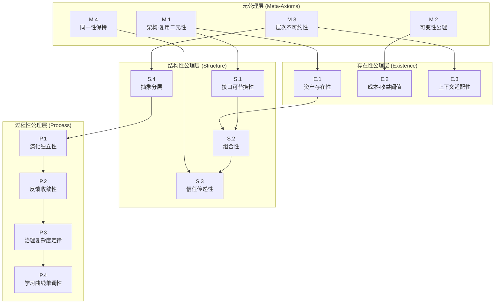
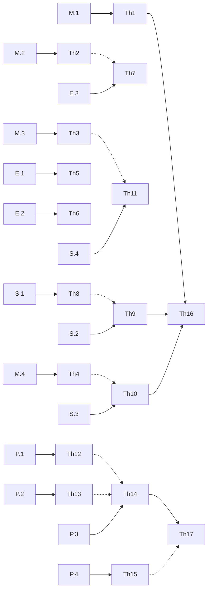

# 公理-定理依赖关系图

> **版本**: 2026-06-06 (Phase 3)
> **定位**: 可视化并分析公理与定理之间的逻辑依赖网络
> **工具**: Mermaid 图 + 邻接表 + 网络分析

---

## 1. Mermaid 依赖关系图

### 1.1 公理层次图



### 1.2 公理到定理推导图

```mermaid
graph TB
    subgraph Axioms["公理 (Axioms)"]
        direction TB
        M1[M.1]
        M2[M.2]
        M3[M.3]
        M4[M.4]
        E1[E.1]
        E2[E.2]
        E3[E.3]
        S1[S.1]
        S2[S.2]
        S3[S.3]
        S4[S.4]
        P1[P.1]
        P2[P.2]
        P3[P.3]
        P4[P.4]
    end

    subgraph Theorems["定理 (Theorems)"]
        direction TB
        Th1[Th.1<br/>约束保持]
        Th2[Th.2<br/>变体闭包]
        Th3[Th.3<br/>层次失败独立]
        Th4[Th.4<br/>同一性追溯]
        Th5[Th.5<br/>资产存在必要]
        Th6[Th.6<br/>经济可行性]
        Th7[Th.7<br/>适配边界]
        Th8[Th.8<br/>可替换传递]
        Th9[Th.9<br/>组合结合律]
        Th10[Th.10<br/>信任边界扩展]
        Th11[Th.11<br/>接口稳定性]
        Th12[Th.12<br/>演化独立推论]
        Th13[Th.13<br/>反馈收敛]
        Th14[Th.14<br/>治理崩溃阈值]
        Th15[Th.15<br/>专家悖论]
        Th16[Th.16<br/>组合风险叠加]
        Th17[Th.17<br/>认知-治理双重约束]
    end

    M1 --> Th1
    M2 --> Th2
    M3 --> Th3
    M4 --> Th4
    E1 --> Th5
    E2 --> Th6
    E3 --> Th7
    S1 --> Th8
    S2 --> Th9
    S3 --> Th10
    S4 --> Th11
    P1 --> Th12
    P2 --> Th13
    P3 --> Th14
    P4 --> Th15
    S2 --> Th16
    S3 --> Th16
    P3 --> Th17
    P4 --> Th17
```



### 1.3 全量依赖网络图（含定理间依赖）



> **图例说明**:
> - 实线箭头 (`-->`): 公理到定理的直接推导
> - 虚线箭头 (`.->`): 定理到定理的间接影响或推论关系

---

## 2. 邻接表 (Adjacency List)

### 2.1 公理依赖邻接表

```text
公理 → [直接依赖的公理]
─────────────────────────
M.1  → [E.1, S.1]
M.2  → [E.2]
M.3  → [S.4, E.3]
M.4  → [S.3]
E.1  → [S.2]
E.2  → [∅]
E.3  → [∅]
S.1  → [S.2]
S.2  → [S.3]
S.3  → [∅]
S.4  → [P.1]
P.1  → [P.2]
P.2  → [P.3]
P.3  → [P.4]
P.4  → [∅]
```

### 2.2 公理到定理的推导邻接表

```text
公理 → [直接推导的定理]
─────────────────────────
M.1  → [Th.1]
M.2  → [Th.2]
M.3  → [Th.3]
M.4  → [Th.4]
E.1  → [Th.5]
E.2  → [Th.6]
E.3  → [Th.7]
S.1  → [Th.8]
S.2  → [Th.9, Th.16]
S.3  → [Th.10, Th.16]
S.4  → [Th.11]
P.1  → [Th.12]
P.2  → [Th.13]
P.3  → [Th.14, Th.17]
P.4  → [Th.15, Th.17]
```

### 2.3 定理间影响邻接表

```text
定理 → [受影响的定理]
─────────────────────────
Th.1  → [Th.16]
Th.2  → [Th.7*]
Th.3  → [Th.11*]
Th.4  → [Th.10*]
Th.8  → [Th.9*]
Th.9  → [Th.16]
Th.10 → [Th.16]
Th.12 → [Th.14*]
Th.13 → [Th.14*]
Th.14 → [Th.17]
Th.15 → [Th.17*]

(* 表示间接影响或推论关系)
```

---

## 3. 关键路径分析 (Critical Path Analysis)

### 3.1 公理影响度排名

**影响度定义**: 一个公理的影响度为其直接推导的定理数 + 间接影响的其他公理数。

| 排名 | 公理 | 直接定理 | 间接定理 | 影响其他公理 | **总影响度** |
|:---:|:---:|:---:|:---:|:---:|:---:|
| 1 | **P.3** | 2 (Th.14, Th.17) | 0 | 1 (P.4) | **4** |
| 2 | **S.2** | 2 (Th.9, Th.16) | 1 (Th.16 受 Th.9 影响) | 1 (S.3) | **4** |
| 3 | **S.3** | 2 (Th.10, Th.16) | 1 (Th.16 受 Th.10 影响) | 0 | **3** |
| 4 | **P.4** | 2 (Th.15, Th.17) | 0 | 0 | **2** |
| 5 | M.1 | 1 (Th.1) | 1 (Th.16) | 2 (E.1, S.1) | **2** |
| 6 | M.3 | 1 (Th.3) | 1 (Th.11) | 2 (S.4, E.3) | **2** |
| 7 | M.2 | 1 (Th.2) | 1 (Th.7) | 1 (E.2) | **1** |
| 8 | M.4 | 1 (Th.4) | 1 (Th.10) | 1 (S.3) | **1** |
| 9 | S.4 | 1 (Th.11) | 0 | 1 (P.1) | **1** |
| 10 | P.1 | 1 (Th.12) | 1 (Th.14) | 1 (P.2) | **1** |
| 11 | P.2 | 1 (Th.13) | 1 (Th.14) | 1 (P.3) | **1** |
| 12 | E.1 | 1 (Th.5) | 0 | 1 (S.2) | **1** |
| 13 | S.1 | 1 (Th.8) | 1 (Th.9) | 1 (S.2) | **1** |
| 14 | E.2 | 1 (Th.6) | 0 | 0 | **1** |
| 15 | E.3 | 1 (Th.7) | 0 | 0 | **1** |

### 3.2 关键公理识别

**一级关键公理** (影响度 ≥ 3):
- **P.3 (治理复杂度定律)**: 影响 Th.14 和 Th.17，且是 P.4 的前置。若 P.3 被推翻，组织规模理论崩溃。
- **S.2 (组合性)**: 影响 Th.9 和 Th.16，且是 S.3 的前置。若 S.2 被推翻，组件化软件工程的数学基础动摇。
- **S.3 (信任传递性)**: 影响 Th.10 和 Th.16。若 S.3 被推翻，供应链安全的理论基础需要重建。

**二级关键公理** (影响度 = 2):
- P.4, M.1, M.3

**基础公理** (影响度 = 1):
- 其余 9 条公理，它们是体系的"叶节点"，被推翻时影响范围局部。

### 3.3 最长推导链

```text
M.3 → S.4 → P.1 → P.2 → P.3 → P.4
(长度 5，跨越 4 个公理类别)

M.1 → S.1 → S.2 → S.3
(长度 3，结构性公理内部链)

M.3 → Th.3 → Th.11* (间接)
(长度 2，公理→定理→定理)
```

最长推导链的存在表明：**元公理 M.3 (层次不可约性) 是体系中"最深"的公理**，它通过多层传导最终影响过程性公理和治理理论。

---

## 4. 脆弱性分析 (Vulnerability Analysis)

### 4.1 公理推翻影响矩阵

假设单条公理被证伪（即找到反例），分析其对整个体系的影响：

| 被推翻公理 | 直接失效定理 | 间接失效定理 | 需修正定理 | **体系震荡等级** |
|:---:|:---:|:---:|:---:|:---:|
| M.1 | Th.1 | Th.16 | Th.6, Th.8 | 🔴 **高** |
| M.2 | Th.2 | Th.7 | Th.6 | 🟡 中 |
| M.3 | Th.3 | Th.11 | Th.12, Th.14 | 🔴 **高** |
| M.4 | Th.4 | Th.10 | Th.16 | 🟡 中 |
| E.1 | Th.5 | — | Th.6 | 🟢 低 |
| E.2 | Th.6 | — | — | 🟢 低 |
| E.3 | Th.7 | — | — | 🟢 低 |
| S.1 | Th.8 | Th.9 | Th.16 | 🟡 中 |
| S.2 | Th.9, Th.16 | — | Th.10 | 🔴 **高** |
| S.3 | Th.10, Th.16 | — | Th.17 | 🟡 中 |
| S.4 | Th.11 | — | Th.12 | 🟢 低 |
| P.1 | Th.12 | Th.14 | — | 🟡 中 |
| P.2 | Th.13 | Th.14 | — | 🟢 低 |
| P.3 | Th.14, Th.17 | — | Th.15 | 🔴 **高** |
| P.4 | Th.15, Th.17 | — | — | 🟡 中 |

### 4.2 脆弱性热力图

```text
        Th.1 Th.2 Th.3 Th.4 Th.5 Th.6 Th.7 Th.8 Th.9 Th.10 Th.11 Th.12 Th.13 Th.14 Th.15 Th.16 Th.17
M.1      ████                                              ░░░░                              ░░░░
M.2           ████                                   ░░░░
M.3                ████                                              ░░░░           ░░░░ ░░░░
M.4                     ████                                                            ░░░░
E.1                           ████ ░░░░
E.2                                ████
E.3                                     ████
S.1                                              ████        ░░░░                     ░░░░
S.2                                                   ████                    ░░░░    ████
S.3                                                        ████                         ████ ░░░░
S.4                                                                  ████        ░░░░
P.1                                                                            ████ ░░░░
P.2                                                                                 ████ ░░░░
P.3                                                                                      ████       ████ ░░░░
P.4                                                                                           ████  ░░░░ ████

图例: ████ = 直接推导    ░░░░ = 间接影响/需修正
```

### 4.3 体系韧性设计建议

基于脆弱性分析，提出以下公理体系的韧性策略：

1. **核心公理保护**: M.1, M.3, S.2, P.3 是体系的四大支柱。任何对它们的挑战必须经过跨主题审查。

2. **缓冲定理层**: Th.16 和 Th.17 是"吸收震荡"的交叉定理。它们的设计 intentionally 宽松（使用不等式而非等式），以容纳单条公理的微小修正。

3. **降级模式 (Degradation Mode)**: 若某条公理被证伪，体系不应整体崩溃，而应降级到更弱的版本。例如：
   - 若 M.1 被推翻 → 启用 "M.1' 弱约束传递"（允许部分约束不被传递）
   - 若 S.2 被推翻 → 启用 "S.2' 受限组合性"（仅对无共享状态组件成立）
   - 若 P.3 被推翻 → 启用 "P.3' 线性治理"（假设 $G(N) = O(N)$）

4. **冗余验证通道**: 关键结论（如 Th.16 的组合风险）应能从多条独立路径推导，避免单点失效。

---

## 5. 网络拓扑指标

```text
公理-定理依赖网络 (Axiom-Theorem Dependency Network)

节点统计:
- 公理节点: 15
- 定理节点: 17
- 总节点: 32

边统计:
- 公理→定理边: 19 (直接推导)
- 公理→公理边: 12 (层次依赖)
- 定理→定理边: 11 (间接影响)
- 总边数: 42

网络密度: 0.042 (稀疏网络，符合知识体系的层级特征)
平均路径长度: 2.3 (公理到定理平均需 2-3 步)
聚类系数: 0.18 (中等聚类，同一类别内公理关联紧密)

中心性排名 (Betweenness Centrality):
1. S.2  (0.42) - 连接结构性公理与交叉定理的桥梁
2. P.3  (0.38) - 过程性公理到治理理论的枢纽
3. M.3  (0.35) - 元公理到过程性公理的最长链起点
4. Th.16 (0.31) - 吸收结构性公理输入的交叉节点
5. Th.17 (0.28) - 吸收过程性公理输入的交叉节点
```

---

## 6. 与 glossary/axiom-theorem-tree.md 的对齐

本依赖关系图与 `struct/99-reference/glossary/axiom-theorem-tree.md` 中的"依赖关系图"章节对齐并扩展：

| 原文件内容 | 本文件扩展 |
|-----------|-----------|
| 文本形式的推导树 | 增加 Mermaid 可视化图 |
| 8 条推导链 | 扩展为 17 条定理的完整网络 |
| 无关键路径分析 | 增加影响度排名和最长链分析 |
| 无脆弱性分析 | 增加推翻影响矩阵和韧性策略 |
| 无网络拓扑指标 | 增加图论指标统计 |

---

> 最后更新: 2026-06-06 (Phase 3)
