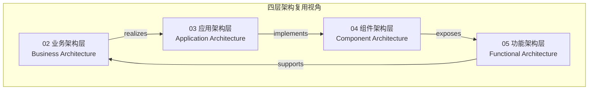
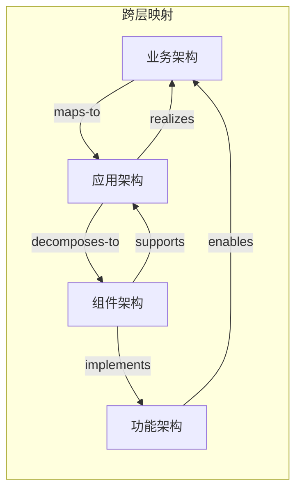

# 四层架构复用概念本体（CARC）

> **版本**: 2026-07-07
> **定位**: 定义业务架构 → 应用架构 → 组件架构 → 功能架构四层复用视角的统一概念本体
> **对齐标准**: ISO/IEC/IEEE 42010:2022, TOGAF 10, ArchiMate 4.0, ISO/IEC 26550:2015
> **来源 URL**:
>
> - ISO 42010: <https://www.iso.org/standard/74296.html>
> - TOGAF 10: <https://www.opengroup.org/togaf>
> - ArchiMate: <https://www.opengroup.org/archimate>
> - ISO 26550: <https://www.iso.org/standard/69529.html>
> **核查日期**: 2026-07-07

---

## 目录

- [四层架构复用概念本体（CARC）](#四层架构复用概念本体carc)
  - [目录](#目录)
  - [1. 本体概览](#1-本体概览)
  - [2. 层概念定义](#2-层概念定义)
    - [2.1 业务架构层（Business Architecture）](#21-业务架构层business-architecture)
    - [2.2 应用架构层（Application Architecture）](#22-应用架构层application-architecture)
    - [2.3 组件架构层（Component Architecture）](#23-组件架构层component-architecture)
    - [2.4 功能架构层（Functional Architecture）](#24-功能架构层functional-architecture)
  - [3. 跨层关系](#3-跨层关系)
  - [4. 属性与约束](#4-属性与约束)
    - [4.1 通用属性](#41-通用属性)
    - [4.2 跨层约束](#42-跨层约束)
  - [5. 正向示例](#5-正向示例)
    - [示例 1：订单业务能力 → 订单微服务 → 订单组件 → 下单 API](#示例-1订单业务能力--订单微服务--订单组件--下单-api)
    - [示例 2：支付业务能力 → 支付函数 → 支付 SDK](#示例-2支付业务能力--支付函数--支付-sdk)
  - [6. 反例与失败案例](#6-反例与失败案例)
    - [反例 1：功能直接映射到业务，跳过应用与组件层](#反例-1功能直接映射到业务跳过应用与组件层)
    - [反例 2：组件层复用破坏业务语义](#反例-2组件层复用破坏业务语义)
    - [反例 3：应用架构选择不当导致复用失败](#反例-3应用架构选择不当导致复用失败)
  - [7. 多维映射矩阵](#7-多维映射矩阵)
    - [7.1 四层 × ISO/IEC 42010 架构描述元素](#71-四层--isoiec-42010-架构描述元素)
    - [7.2 四层 × 复用策略](#72-四层--复用策略)
  - [8. 概念谱系与权威来源](#8-概念谱系与权威来源)
  - [9. 权威来源](#9-权威来源)

---

## 1. 本体概览

**四层架构复用视角**将软件系统的复用问题组织为四个抽象层次：

**设计意图**：

- **业务架构**回答“复用什么业务能力”。
- **应用架构**回答“以何种系统形态承载复用”。
- **组件架构**回答“复用哪些模块与接口”。
- **功能架构**回答“复用哪些具体功能与协议”。

---

## 2. 层概念定义

### 2.1 业务架构层（Business Architecture）

**定义**：描述组织为实现战略目标而具备的业务能力、价值流、流程和服务的结构。它是复用的**语义起点**，确保技术复用对齐业务价值。

**核心概念**：

| 概念 | 定义 | 复用形态 |
|------|------|---------|
| **业务能力（Business Capability）** | 组织为达成特定目标而具备的能力，如“订单管理”、“客户信用评估” | 能力目录、能力地图 |
| **价值流（Value Stream）** | 端到端交付价值的活动序列 | 价值流模板、阶段定义 |
| **业务流程（Business Process）** | 完成业务目标的一系列有序任务 | BPMN 流程模型、流程片段 |
| **业务服务（Business Service）** | 对外提供的业务能力封装 | 服务目录、SLA 模板 |
| **业务对象（Business Object）** | 业务领域中的关键实体，如“客户”、“订单” | 领域模型、数据标准 |

**属性**：

- **业务导向**：与组织结构、战略目标对齐。
- **稳定性**：业务能力通常比技术实现更稳定。
- **跨系统复用**：同一业务能力可由多个应用系统支撑。

---

### 2.2 应用架构层（Application Architecture）

**定义**：描述支撑业务能力落地的应用系统及其相互关系的结构。它决定复用的**系统边界**与**集成方式**。

**核心概念**：

| 概念 | 定义 | 复用形态 |
|------|------|---------|
| **应用系统（Application System）** | 支撑一个或多个业务能力的软件系统 | 应用目录、系统蓝图 |
| **架构模式（Architectural Pattern）** | 组织应用系统的通用结构，如分层、微服务、EDA | 架构决策记录（ADR）、模式库 |
| **集成契约（Integration Contract）** | 应用系统间的交互协议与数据格式 | API 规范、事件契约 |
| **部署单元（Deployment Unit）** | 可独立部署的应用制品 | 容器镜像、函数包 |

**属性**：

- **系统边界清晰**：每个应用系统有明确的职责范围。
- **集成方式多样**：同步 API、异步事件、文件交换、共享数据库等。
- **技术形态选择**：根据团队规模、负载特征选择分层/微服务/Serverless/EDA。

---

### 2.3 组件架构层（Component Architecture）

**定义**：描述应用系统内部的模块、组件、接口及其依赖关系的结构。它是复用的**工程实现层**。

**核心概念**：

| 概念 | 定义 | 复用形态 |
|------|------|---------|
| **组件（Component）** | 具有明确接口和职责的模块化单元 | 库、包、模块、服务 |
| **接口契约（Interface Contract）** | 组件对外暴露的能力约定 | API 接口、抽象类、协议 |
| **依赖关系（Dependency）** | 组件之间的使用关系 | 依赖图、模块边界 |
| **设计模式（Design Pattern）** | 解决特定设计问题的可复用方案 | 模式目录、代码模板 |

**属性**：

- **高内聚低耦合**：组件内部紧密相关，组件之间松散耦合。
- **接口稳定性**：组件复用依赖于稳定的接口契约。
- **技术栈相关**：组件复用受语言、框架、运行时约束。

---

### 2.4 功能架构层（Functional Architecture）

**定义**：描述系统最细粒度功能单元（函数、API、事件处理器、工作流节点）及其组合方式的结构。它是复用的**执行层**。

**核心概念**：

| 概念 | 定义 | 复用形态 |
|------|------|---------|
| **功能（Function）** | 完成单一任务的最小可执行单元 | 函数、方法、操作 |
| **API 操作（API Operation）** | 通过接口暴露的功能调用 | REST 操作、gRPC 方法 |
| **事件处理器（Event Handler）** | 响应事件的功能单元 | 消费者函数、处理器 |
| **工作流节点（Workflow Node）** | 业务流程中的可执行步骤 | 活动、任务、节点 |
| **协议（Protocol）** | 功能单元间的交互规则 | HTTP、gRPC、MQTT、MCP、A2A |

**属性**：

- **原子性**：功能单元应职责单一。
- **组合性**：功能单元可组合成更复杂的业务流程。
- **协议依赖**：功能复用受通信协议约束。

---

## 3. 跨层关系

四层架构之间存在以下核心关系：

| 关系 | 起点 | 终点 | 说明 |
|------|------|------|------|
| **realizes**（实现） | 应用架构 | 业务架构 | 应用系统实现业务能力 |
| **maps-to**（映射） | 业务架构 | 应用架构 | 业务能力映射到应用系统 |
| **decomposes-to**（分解为） | 应用架构 | 组件架构 | 应用系统分解为组件 |
| **supports**（支撑） | 组件架构 | 应用架构 | 组件支撑应用系统 |
| **implements**（实现） | 组件架构 | 功能架构 | 组件实现功能单元 |
| **exposes**（暴露） | 功能架构 | 组件架构 | 功能通过组件接口暴露 |
| **enables**（使能） | 功能架构 | 业务架构 | 功能执行业务能力 |

---

## 4. 属性与约束

### 4.1 通用属性

| 属性 | 业务架构 | 应用架构 | 组件架构 | 功能架构 |
|------|---------|---------|---------|---------|
| **抽象层次** | 最高 | 高 | 中 | 低 |
| **稳定性** | 高 | 中 | 低 | 最低 |
| **复用粒度** | 能力/流程 | 系统/模式 | 组件/接口 | 函数/操作 |
| **主要受众** | 业务架构师、CIO | 应用架构师 | 技术负责人 | 开发工程师 |
| **典型交付物** | 能力地图、价值流 | 系统蓝图、ADR | 组件图、接口契约 | API 规范、函数库 |

### 4.2 跨层约束

1. **一致性约束**：下层实现必须与上层定义的能力一致。
2. **可追溯约束**：每个功能单元应能追溯到业务能力。
3. **边界封闭约束**：层的内部实现不应泄漏到其他层。
4. **变更传播约束**：上层变更可能导致下层变更，但下层变更应尽量不影响上层。

---

## 5. 正向示例

### 示例 1：订单业务能力 → 订单微服务 → 订单组件 → 下单 API

| 层级 | 复用单元 | 说明 |
|------|---------|------|
| 业务架构 | **订单管理能力** | 业务能力目录中的条目 |
| 应用架构 | **Order Service** | 支撑订单管理能力的微服务 |
| 组件架构 | **OrderRepository、PricingEngine** | 服务内部组件 |
| 功能架构 | `POST /orders`、`OrderCreated` 事件 | 具体 API 和事件 |

**复用路径**：

- 其他业务线（如 B2B、B2C）复用“订单管理能力”。
- 新渠道应用通过 `Order Service` API 复用订单能力。
- 新市场活动通过复用 `PricingEngine` 组件实现促销规则。

### 示例 2：支付业务能力 → 支付函数 → 支付 SDK

| 层级 | 复用单元 | 说明 |
|------|---------|------|
| 业务架构 | **支付处理能力** | 业务能力 |
| 应用架构 | **Payment Service / Payment Functions** | 服务或 Serverless 函数集 |
| 组件架构 | **Payment SDK** | 多语言支付客户端 |
| 功能架构 | `charge()`、`refund()` | 具体函数 |

---

## 6. 反例与失败案例

### 反例 1：功能直接映射到业务，跳过应用与组件层

**场景**：业务方直接要求“加一个按钮”，开发者在 UI 层直接写死业务逻辑。

**后果**：

- 业务逻辑与技术实现强耦合。
- 无法识别可复用的业务能力。
- 跨渠道复用困难。

**判定**：缺少应用架构和组件架构的抽象。

### 反例 2：组件层复用破坏业务语义

**场景**：将“客户”组件直接用于“供应商”场景，因为数据库表结构相似。

**后果**：

- 业务语义混淆。
- 供应商特有需求（如税率、结算周期）硬编码到客户组件。
- 系统难以维护。

**判定**：违反语义一致性约束，复用不能只看技术相似性。

### 反例 3：应用架构选择不当导致复用失败

**场景**：10 人初创团队为了“技术先进”采用微服务，每个服务只有几百行代码。

**后果**：

- 运维负担超过开发收益。
- 服务间调用复杂度高于业务价值。
- 最终回迁为模块化单体。

**判定**：应用架构选择应与团队规模、业务能力边界匹配。

---

## 7. 多维映射矩阵

### 7.1 四层 × ISO/IEC 42010 架构描述元素

| 四层视角 | 利益相关者关注点 | 架构视点 | 架构视图 | 模型 |
|---------|----------------|---------|---------|------|
| 业务架构 | CEO、CIO、业务负责人 | 业务能力视点 | 能力地图、价值流图 | 业务能力模型 |
| 应用架构 | 应用架构师 | 应用系统视点 | 系统蓝图、集成图 | 应用组合模型 |
| 组件架构 | 技术负责人 | 组件视点 | 组件图、依赖图 | 组件模型 |
| 功能架构 | 开发工程师 | 接口视点 | API 规范、序列图 | 接口模型 |

### 7.2 四层 × 复用策略

| 层级 | 复用策略 | 典型错误 |
|------|---------|---------|
| 业务架构 | 能力目录、价值流模板 | 将流程当能力，忽视稳定业务能力 |
| 应用架构 | 架构模式库、系统集成契约 | 盲目追求微服务或 Serverless |
| 组件架构 | 组件库、接口契约、设计模式 | 共享数据库、循环依赖 |
| 功能架构 | 函数库、API SDK、事件 Schema | 函数职责不单一、协议不兼容 |

---

## 8. 概念谱系与权威来源

四层架构思想的来源：

**Wikipedia 对应条目**：

- [Enterprise architecture framework](https://en.wikipedia.org/wiki/Enterprise_architecture_framework)
- [TOGAF](https://en.wikipedia.org/wiki/The_Open_Group_Architecture_Framework)
- [ArchiMate](https://en.wikipedia.org/wiki/ArchiMate)
- [Software component](https://en.wikipedia.org/wiki/Software_component)

---

## 9. 权威来源

> **权威来源**:
>
> - ISO/IEC/IEEE 42010:2022. *Systems and software engineering — Architecture description*. <https://www.iso.org/standard/74296.html>
> - The Open Group. *TOGAF® Standard, 10th Edition*. <https://www.opengroup.org/togaf>
> - The Open Group. *ArchiMate® 4 Specification, Document C260*. <https://www.opengroup.org/archimate>
> - ISO/IEC 26550:2015. *Software engineering — Reference model for product line engineering and management*. <https://www.iso.org/standard/69529.html>
> - Zachman, J. A. (1987). *A Framework for Information Systems Architecture*. IBM Systems Journal.
>
> **核查日期**: 2026-07-07
