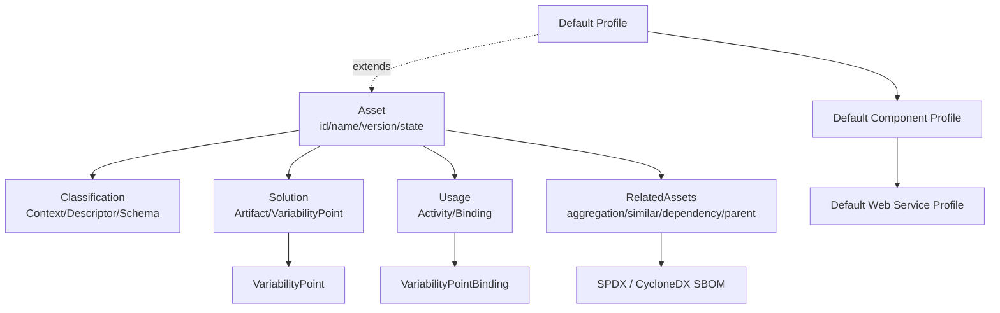

# OMG RAS v2.2 与四层复用架构对齐

> **版本**: 2026-06-08
> **定位**: 将 OMG 可复用资产规范（RAS）纳入本体系的标准对齐框架，作为资产结构化描述的元模型参考
> **对齐来源**: OMG RAS v2.2 formal/05-11-02, ISO/IEC/IEEE 42010:2022, TOGAF Standard 10, SWEBOK V4, SLSA 1.2
> **状态**: ✅ 已完成
> **交叉引用**: [`01-iso-420xx-family/alignment-matrix.md`](../01-iso-420xx-family/alignment-matrix.md)

---

## 1. OMG RAS v2.2 核心概念

OMG **Reusable Asset Specification (RAS)** v2.2 是供应商中立的软件资产包装与交换标准，目标是**“通过一致、标准的包装降低复用交易中的摩擦”**。它将每个可复用资产划分为四个核心部分，直接对应复用生命周期中的关键问题：

```text
┌─────────────────────────────────────────┐
│              Asset（资产）               │
│  name | id | version | date | state     │
├─────────────────────────────────────────┤
│  Classification — 这是什么？            │
│  Solution       — 里面有什么？          │
│  Usage          — 怎么使用/定制？       │
│  RelatedAssets  — 与其他资产的关系？    │
└─────────────────────────────────────────┘
```

### 1.1 Classification（分类）

回答“**这是什么资产？**”。包含 `Context`（上下文）、`DescriptorGroup`（描述符分组）、`NodeDescriptor`（分类节点）、`FreeFormDescriptor`（自由键值描述）和 `ClassificationSchema`（可复用分类词汇表）。分类信息覆盖领域、用途、技术栈、成熟度、合规要求等维度，是资产被发现和检索的首要依据。

### 1.2 Solution（解决方案）

回答“**资产包含什么制品？**”。包含 `Artifact`（工作产品）、`ArtifactContext`（制品与上下文的关联）、`ArtifactDependency`（制品间依赖）、`ArtifactType`（制品类型）和 `VariabilityPoint`（可变性点）。Solution 是资产的实际内容载体，可以是代码、模型、文档或配置。

### 1.3 Usage（使用）

回答“**如何安装、定制和使用？**”。包含 `Activity`（使用指令）、`ArtifactActivity`（绑定到特定制品的活动）、`AssetActivity`（绑定到整个资产的活动）、`VariabilityPointBinding`（可变性点绑定规则）和 `ActivityParameter`（活动参数）。Usage 定义了资产从获取到投入生产所需的完整操作路径。

### 1.4 RelatedAssets（相关资产）

回答“**与其他资产的关系？**”。RAS 预定义四种关系类型：

| 关系类型 | 语义 | 示例 |
|----------|------|------|
| `aggregation` | 聚合/包含 | 资产包内含子模块 |
| `similar` | 相似/替代 | 功能等价的备选方案 |
| `dependency` | 依赖 | 编译期或运行期必需 |
| `parent` | 父级/版本链 | 演进 lineage |

### 1.5 RAS Profile：领域定制机制

RAS 通过 **Profile（配置文件）** 实现领域扩展，约束单调递增：子 Profile 不能删除父 Profile 的约束，只能增加或收紧。

| Profile | 扩展自 | 用途 |
|---------|--------|------|
| Default Profile 2.2 | Core RAS | 通用资产（业务流程、文档） |
| Default Component Profile 2.2 | Default Profile | 二进制/设计时组件（J2EE、.NET 程序集） |
| Default Web Service Profile 2.2 | Default Component Profile | Web Service 客户端包装 |

现代格式（容器镜像、Helm Chart、OpenAPI、Protobuf）虽未在 RAS v2.2 中原生定义，但可作为 `Artifact` 中的不透明制品被包装，并借助自定义 Profile 约束其 `Classification` 与 `Usage` 结构。

---

## 2. 与四层复用架构的对齐映射

本知识体系采用业务架构 → 应用架构 → 组件架构 → 功能架构的四层复用模型。RAS 的四维结构在各层中的映射如下：

| RAS 概念 | 业务架构层 | 应用架构层 | 组件架构层 | 功能架构层 |
|----------|-----------|-----------|-----------|-----------|
| **Classification** | 业务能力分类（领域、价值流、组织单元） | 架构模式分类（微服务、事件驱动、分层） | 包/模块分类（语言生态、运行时、许可证） | 函数/算法分类（复杂度、确定性、并行性） |
| **Solution** | 业务流程模型（BPMN、价值流图、领域模型） | 微服务模板（部署拓扑、数据流、API 契约） | 库/框架代码（源码、二进制、设计模式实例） | 可复用函数（算法实现、MCP Tool、A2A Agent Card） |
| **Usage** | 价值流使用指南（角色职责、KPI 映射、变革管理） | 部署配置（Helm values、Terraform 模块参数） | API 文档（OpenAPI/AsyncAPI、调用契约、兼容性矩阵） | 调用示例（输入/输出样例、边界条件、性能基线） |
| **RelatedAssets** | 上下游能力（前置/后置业务能力、组织依赖） | 依赖服务（同步/异步调用方、数据提供者） | 传递依赖（第三方库、运行时、操作系统） | 版本兼容性（接口变更、语义化版本约束、弃用计划） |

**映射原则**：每一层的 RAS Asset 都是该层的“最小可复用单元”。业务层的 Asset 可能是完整的领域模型包，而功能层的 Asset 可能仅是一个算法函数及其测试用例。

---

## 3. 与项目其他标准的映射

RAS 作为元模型，与体系内引用的多个权威标准存在概念对应关系：

| RAS 概念 | 对应标准/概念 | 映射说明 |
|----------|--------------|----------|
| **Classification** | ISO 42010 Viewpoint / Concern | RAS `ClassificationSchema` 可视为对 ISO 42010 中 Viewpoint 分类体系的具体化；`Context` 对应 Concern 的上下文边界 |
| **Solution** | TOGAF ABB / SBB | RAS `Solution` 的抽象制品对应 Architecture Building Block（ABB），具体实现制品对应 Solution Building Block（SBB）；`VariabilityPoint` 对应 ABB/SBB 间的可变性管理 |
| **Usage** | SWEBOK "Construction with Reuse" | RAS `Usage` 中的 `Activity` 与 `VariabilityPointBinding` 直接映射 SWEBOK V4 软件构造知识领域中“基于复用的构造”过程：检索、评估、适配、集成 |
| **RelatedAssets** | SPDX / SBOM 依赖关系 | RAS `RelatedAssets` 的 `dependency` 关系与 SPDX `DESCRIBES`/`DEPENDS_ON`、CycloneDX `dependencies` 语义等价；建议在现代实践中用 SPDX/CycloneDX 替代 RAS 原生的 `ArtifactDependency`，保留 RAS 作为元模型外壳 |

> 详见 [`01-iso-420xx-family/alignment-matrix.md`](../01-iso-420xx-family/alignment-matrix.md) 中的标准族谱与主题-标准对齐矩阵。

---

## 4. RAS 在软件供应链安全中的作用

### 4.1 RAS + SBOM：资产包装与供应链透明的结合

RAS `Solution` 中的 `Artifact` 和 `ArtifactDependency` 提供了制品级依赖描述，但缺乏密码学强度和格式标准化。现代实践中，建议：

- 将 **SPDX** 或 **CycloneDX** SBOM 作为 RAS `Artifact` 嵌入 `Solution`
- 使用 **PURL** 标识 `Artifact`，替代 RAS 原生的自由文本标识
- 在 RAS `Classification` 中增加 `sbom:present` 和 `sbom:format` 描述符，声明 SBOM 存在性与格式

### 4.2 RAS + SLSA：资产来源与构建级别的映射

SLSA 1.2 的 Build Track（L1-L4）为资产构建过程提供可信度等级。RAS 的 `Asset` 元数据可直接扩展 SLSA 字段：

| SLSA 轨道 | RAS 扩展字段 | 作用 |
|-----------|-------------|------|
| Build Track L1 | `provenance:attested` | 声明构建来源存在 |
| Build Track L2 | `provenance:hosted` | 声明构建在托管环境中完成 |
| Build Track L3 | `provenance:hardened` | 声明构建环境已加固 |
| Source Track L3 | `source:two_person_reviewed` | 声明代码变更经过双人评审 |

### 4.3 资产可信度评分模型

基于 RAS 元模型与 SLSA/SBOM 的融合，定义资产可信度评分：

```text
TrustScore(A) = α × Completeness(Classification(A))
              + β × Verifiability(Solution(A), SBOM)
              + γ × Clarity(Usage(A))
              + δ × SLSALevel(RelatedAssets(A))
              − ε × DependencyRisk(RelatedAssets(A))
```

其中 `α + β + γ + δ = 1`，`DependencyRisk` 为传递依赖中的已知漏洞密度（由 SBOM 漏洞扫描结果加权）。该评分可作为资产入库的门控条件。

---

## 5. 实施检查清单

### 5.1 创建 RAS 描述前的 10 项检查

| 序号 | 检查项 | 通过标准 |
|------|--------|----------|
| 1 | 分类完整性 | `Classification` 至少包含领域、用途、技术栈、成熟度四项描述 |
| 2 | 制品可验证 | `Solution` 中每个 `Artifact` 均有校验和或签名 |
| 3 | SBOM 嵌入 | 存在 SPDX/CycloneDX 格式的 SBOM 制品 |
| 4 | 依赖明确 | `RelatedAssets` 中 `dependency` 关系无循环依赖 |
| 5 | 使用可执行 | `Usage` 中的 `Activity` 可被非原作者复现 |
| 6 | 可变性点文档化 | 所有 `VariabilityPoint` 均有绑定示例 |
| 7 | 许可证声明 | `Classification` 中包含 SPDX 许可证标识符 |
| 8 | 版本语义化 | `version` 符合 SemVer 2.0.0 规范 |
| 9 | 安全基线 | 无 HIGH/CRITICAL 级别已知漏洞（由 SBOM 扫描确认） |
| 10 | 元数据可机读 | 整个 RAS 描述可导出为 JSON/YAML，供 CI/CD 流水线解析 |

### 5.2 资产入库流程

```text
1. 资产识别 → 2. 元数据草拟 → 3. 十项检查 → 4. 安全扫描(SBOM+SLSA)
      ↓
5. 可信度评分 → 6. 治理评审 → 7. 版本冻结 → 8. 仓库发布
      ↓
9. 注册索引 → 10. 持续监控（漏洞、依赖漂移、版本过期）
```

- **步骤 1-2**：由资产作者完成，输出初步 RAS 描述
- **步骤 3-5**：由 CI/CD 流水线自动执行，评分低于阈值自动驳回
- **步骤 6-8**：由跨层治理委员会（参考 `06-cross-layer-governance`）人工评审
- **步骤 9-10**：由资产仓库运营团队执行，纳入长期监控

---

## 参考链接

- [OMG RAS Portal](https://www.omg.org/spec/RAS/)
- [OMG RAS v2.2 Normative PDF](https://www.omg.org/spec/RAS/2.2/PDF)
- [OMG RAS Default Profile XSD](https://www.omg.org/spec/RAS/20060101/DefaultprofileXML.xsd)
- [OMG RAS Default Component Profile XSD](https://www.omg.org/spec/RAS/20060101/DefaultcomponentprofileXML.xsd)


---

## 补充说明：OMG RAS v2.2 与四层复用架构对齐

## 示例

**示例**：企业资产库为每个微服务模板建立 RAS 描述：分类标签标明技术栈与领域，解决方案提供代码与配置文件，使用文档说明集成步骤，相关资产链接到配套测试与监控模板。

## 反例

**反例**：资产库中只有压缩包文件名，缺乏分类、使用说明与依赖关系，使用者难以判断适用性。

## 权威来源

> **权威来源**:
>
> - [OMG RAS](https://www.omg.org/spec/RAS)
> - [OMG BPMN](https://www.omg.org/spec/BPMN)
> - 核查日期：2026-07-07

## 分析

**分析**：RAS 提供了一套标准化资产描述契约，是资产目录可检索、可比较、可治理的基础。


---

## 补充：OMG RAS v2.2 可复用资产元模型完整定义

> 本节对 OMG RAS（Reusable Asset Specification）v2.2 的核心概念——Asset、Classification、Solution、Usage、RelatedAssets 及 Profile 扩展机制——进行定义、属性、关系、正例、反例、形式化视图、权威来源与交叉引用的补全。
> 相关 Wikipedia 概念结构：
> [Code reuse](https://en.wikipedia.org/wiki/Code_reuse)、
> [Component-based software engineering](https://en.wikipedia.org/wiki/Component-based_software_engineering)、
> [Software component](https://en.wikipedia.org/wiki/Software_component)。

### 1. 概念定义

**定义**：OMG RAS v2.2 是一个供应商中立的软件可复用资产包装与交换规范。它将每个可复用资产抽象为一个包含元数据（Asset）、分类（Classification）、解决方案（Solution）、使用说明（Usage）与相关资产（RelatedAssets）五大部分的标准化制品，从而降低复用交易中的搜索、评估、适配与集成摩擦。

### 2. 核心概念属性

#### 2.1 Asset（资产）

| 属性 | 说明 | 可观察性 |
|------|------|----------|
| id | 全局唯一标识符 | 高 |
| name | 人类可读名称 | 高 |
| version | 语义化版本（建议 SemVer） | 高 |
| date | 发布或更新日期 | 高 |
| state | 生命周期状态（如 draft / candidate / approved / deprecated） | 高 |
| owner | 资产责任人或组织单元 | 中 |

#### 2.2 Classification（分类）

| 属性 | 说明 | 可观察性 |
|------|------|----------|
| Context | 资产适用上下文 | 高 |
| DescriptorGroup | 描述符分组 | 高 |
| NodeDescriptor | 分类树节点 | 中 |
| FreeFormDescriptor | 自由键值描述 | 中 |
| ClassificationSchema | 可复用分类词汇表 | 中 |
| license | 许可证标识（建议 SPDX） | 高 |

#### 2.3 Solution（解决方案）

| 属性 | 说明 | 可观察性 |
|------|------|----------|
| Artifact | 实际工作产品 | 高 |
| ArtifactContext | 制品与上下文的关联 | 中 |
| ArtifactDependency | 制品间依赖 | 高 |
| ArtifactType | 制品类型 | 高 |
| VariabilityPoint | 可变性点 | 中 |
| checksum / signature | 制品完整性校验 | 高 |

#### 2.4 Usage（使用）

| 属性 | 说明 | 可观察性 |
|------|------|----------|
| Activity | 使用指令 | 高 |
| ArtifactActivity | 绑定到特定制品的活动 | 中 |
| AssetActivity | 绑定到整个资产的活动 | 中 |
| VariabilityPointBinding | 可变性点绑定规则 | 中 |
| ActivityParameter | 活动参数 | 中 |
| reproducibility | 使用过程是否可被第三方复现 | 高 |

#### 2.5 RelatedAssets（相关资产）

| 属性 | 说明 | 可观察性 |
|------|------|----------|
| aggregation | 聚合/包含关系 | 高 |
| similar | 相似/替代关系 | 中 |
| dependency | 编译期或运行期依赖 | 高 |
| parent | 父级/版本链关系 | 中 |
| SBOM linkage | 与 SPDX/CycloneDX SBOM 的关联 | 高 |

### 3. 关系说明

- **Asset 组合关系**：Asset 由 Classification、Solution、Usage、RelatedAssets 四部分组成，缺一不可。
- **Profile 扩展关系**：Default Profile → Default Component Profile → Default Web Service Profile，约束单调递增。
- **RAS ↔ TOGAF ABB/SBB**：Classification 对应 ABB 的能力分类；Solution 的抽象制品对应 ABB，具体实现制品对应 SBB；VariabilityPoint 对应 ABB/SBB 可变性管理。
- **RAS ↔ ISO/IEC/IEEE 42010:2022**：ClassificationSchema 可视作 Viewpoint 分类体系的具体化；Solution 中的 Artifact 对应 View Component；RelatedAssets 的 dependency 对应 Correspondence。
- **RAS ↔ SWEBOK V4**：Usage 中的 Activity 与 VariabilityPointBinding 映射到“基于复用的构造”过程（检索、评估、适配、集成）。
- **RAS ↔ SBOM/SPDX**：现代实践中，ArtifactDependency 建议由 SPDX/CycloneDX 替代，RAS 作为元模型外壳保留。

### 4. 形式化/结构化分析



### 5. 正例

**正例**：某云原生团队将“订单微服务模板”包装为 RAS Asset：

- **Asset**：`id=order-service-template; version=2.3.1; state=approved`。
- **Classification**：领域=电商订单；技术栈=Spring Boot 3 + PostgreSQL；成熟度=生产级；许可证=Apache-2.0；合规=SOX-L2。
- **Solution**：包含 Helm Chart、Dockerfile、OpenAPI 3.0 规格、Terraform 模块、Jenkins 流水线；定义 VariabilityPoint `DB_HOST`、`REPLICA_COUNT`。
- **Usage**：提供 `helm install` 指令、参数绑定示例、本地调试步骤、升级路径。
- **RelatedAssets**：聚合监控模板 `order-service-observability`；依赖 Redis 缓存模板；父版本 `order-service-template 2.2.x`。

结果：新团队在 30 分钟内完成环境部署，配置错误率降低 80%。

### 6. 反例

**反例**：某团队将“用户认证模块”以压缩包形式上传到共享网盘：

- 没有 `Asset` 元数据，文件名 `auth-v3-final.zip` 无法区分版本与状态。
- 没有 `Classification`，其他团队无法通过领域、技术栈或许可证筛选。
- 没有 `Usage`，使用者不得不阅读源码猜测配置方式。
- 没有 `RelatedAssets`，依赖的加密库版本、许可证冲突在集成后才暴露。

结果：三个业务单元各自下载了不同版本，导致安全漏洞修复无法同步，合规审计失败。

**避免建议**：任何进入组织资产库的制品必须至少包含 Asset 元数据、Classification 标签、Usage 指南与 RelatedAssets 依赖声明。

### 7. 权威来源

> **权威来源**：
>
> - [OMG RAS Portal](https://www.omg.org/spec/RAS/) — OMG
> - [OMG RAS v2.2 Normative PDF](https://www.omg.org/spec/RAS/2.2/PDF) — OMG
> - [Code reuse - Wikipedia](https://en.wikipedia.org/wiki/Code_reuse)
> - [Component-based software engineering - Wikipedia](https://en.wikipedia.org/wiki/Component-based_software_engineering)
> - [ISO/IEC/IEEE 42010:2022](https://www.iso.org/standard/74296.html) — ISO
>
> **核查日期**：2026-07-07

### 8. 交叉引用

- FAIR4RS 与软件复用对照详见 [`../08-fair4rs/fair4rs-alignment.md`](../08-fair4rs/fair4rs-alignment.md)
- ISO/IEC/IEEE 42010:2022 核心概念详见 [`../01-iso-420xx-family/iso-42010-2022.md`](../01-iso-420xx-family/iso-42010-2022.md)
- TOGAF 企业连续体与构建块复用详见 [`../02-togaf-10-alignment/togaf-enterprise-continuum-reuse.md`](../02-togaf-10-alignment/togaf-enterprise-continuum-reuse.md)
- 四层复用本体详见 [`../06-formal-axioms/four-layer-ontology.md`](../06-formal-axioms/four-layer-ontology.md)
- 标准对齐矩阵详见 [`../01-iso-420xx-family/alignment-matrix.md`](../01-iso-420xx-family/alignment-matrix.md)