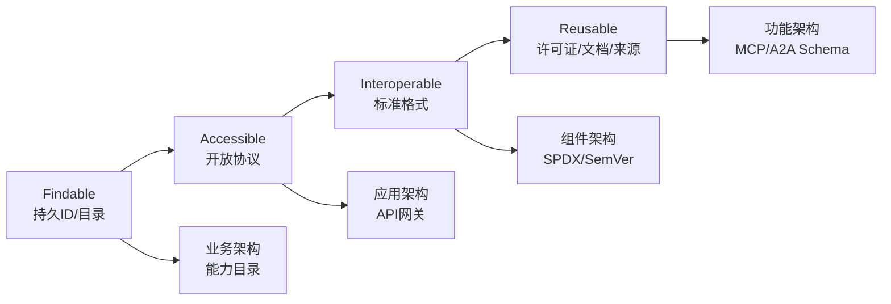

# FAIR4RS 原则与软件复用对照

> **版本**: 2026-06-08
> **定位**: 将 FAIR4RS 原则纳入四层软件架构复用框架，建立可量化的实施检查清单与成熟度评分模型
> **对齐来源**: FAIR4RS Principles v1.0 (RDA, 2022), Chue Hong et al. (2022), ISO/IEC 25010:2023, OMG RAS v2.2, ISO/IEC/IEEE 1517:2010-2010
> **状态**: ✅ 已完成
> **交叉引用**: [`../07-omg-ras/ras-alignment.md`](../07-omg-ras/ras-alignment.md), [`../01-iso-420xx-family/ieee-1517-reuse-processes.md`](../01-iso-420xx-family/ieee-1517-reuse-processes.md)

---

## 1. FAIR4RS 核心原则

FAIR4RS（FAIR Principles for Research Software）由 RDA、FORCE11 与 ReSA 于 2022 年联合发布，将 FAIR 数据原则适配至研究软件领域。与数据不同，软件具有**可执行性**与**组合性**，因此原则强调机器可操作与多粒度标识。

| 原则 | 核心要求 | 软件复用含义 |
|------|---------|-------------|
| **Findable** | 软件资产可被唯一标识和检索 | 全局持久 ID + 可搜索元数据索引 |
| **Accessible** | 协议标准化、元数据可获取 | 开放协议检索，认证授权不阻碍访问 |
| **Interoperable** | 使用标准格式和词汇表 | API/数据格式标准化，限定引用 |
| **Reusable** | 清晰的许可证、完善的文档、可验证的依赖 | 许可证合规 + 来源可审计 + 环境可复现 |

---

## 2. 与四层复用架构的对照映射

| FAIR4RS 原则 | 业务架构 | 应用架构 | 组件架构 | 功能架构 |
|-------------|---------|---------|---------|---------|
| **Findable** | 能力目录 (FEA BRM) | 服务注册表 (OpenAPI/UDDI) | 包管理索引 (npm/PyPI/Cargo) | 函数注册表 (MCP Tool Registry) |
| **Accessible** | BPMN/DMN 开放规范 | API 网关 + OpenAPI 文档 | 包仓库 (npm registry/Maven) | Protocol 端点 (stdio/SSE/HTTP) |
| **Interoperable** | ArchiMate 标准交换格式 | CNCF 标准 (gRPC/CloudEvents) | SPDX / SemVer 语义版本 | A2A / MCP 标准协议 |
| **Reusable** | 业务规则库 (DMN 决策表) | 微服务模板 (Helm/Dockerfile) | 开源许可证 (SPDX 标识符) | 概率契约 (Pact/MCP Schema) |

**映射说明**：

- **Findable** 在各层均要求可检索的目录机制：业务能力通过 FEA BRM 分类目录发现；应用服务通过 API 注册表发现；组件通过包管理器索引发现；AI 功能通过 MCP Tool Registry 发现。
- **Accessible** 要求分层协议透明：业务流程模型以开放标准（BPMN/DMN）发布；应用服务通过 API 网关暴露；组件通过包仓库分发；功能通过标准化端点调用。
- **Interoperable** 要求跨层格式统一：业务层使用 ArchiMate 交换；应用层使用 CNCF 接口标准；组件层使用 SPDX 描述和 SemVer 版本约束；功能层使用 A2A 或 MCP 协议实现互操作。
- **Reusable** 要求各层提供可验证的复用契约：业务规则库需配套决策逻辑说明；微服务模板需配套部署配置；组件需明确许可证和 SBOM；功能需声明输入输出 Schema 和概率契约。

---

## 3. 与供应链安全的结合

### 3.1 FAIR4RS + SBOM

| FAIR4RS 原则 | SBOM 映射 | 实践含义 |
|-------------|----------|---------|
| Findable | SBOM 存在性 | 每个发布版本附带 SPDX/CycloneDX SBOM，使组件可被机器发现 |
| Reusable | 许可证合规 | SBOM 中的 `licenseConcluded` 字段确保许可证清晰，支撑法律复用 |

### 3.2 FAIR4RS + SLSA

| FAIR4RS 原则 | SLSA 映射 | 实践含义 |
|-------------|----------|---------|
| Accessible | 构建来源可验证 | SLSA Level ≥ 2 要求构建过程使用托管构建平台，生成可验证的 provenance attestations，确保软件及其元数据的访问路径可信 |

### 3.3 FAIR4RS + MCP Tool 注册表

| FAIR4RS 原则 | MCP 映射 | 实践含义 |
|-------------|----------|---------|
| Findable | Tool Registry 索引 | 每个 MCP Server 在注册表中登记 `name`, `version`, `description` |
| Accessible | stdio / HTTP(S) with SSE | 标准传输层确保 AI 功能的访问不受厂商绑定 |

---

## 4. 实施检查清单

评分模型：**0 = 未实施, 1 = 部分实施, 2 = 基本实施, 3 = 完全实施**。总分 120 分。

| 编号 | Findable (F) 检查项 | 分值 |
|------|---------------------|------|
| F-01 | 软件资产分配全局唯一持久标识符 (DOI/SWHID/PURL) | 0–3 |
| F-02 | 不同粒度 (系统/模块/函数) 均有独立标识 | 0–3 |
| F-03 | 每个发布版本有独立持久标识 (SemVer + Git Tag) | 0–3 |
| F-04 | 元数据包含软件标识符且机器可读 | 0–3 |
| F-05 | 注册到至少一个可搜索公共目录或注册表 | 0–3 |
| F-06 | 提供 CodeMeta 或 CITATION.cff 元数据文件 | 0–3 |
| F-07 | 元数据本身可被搜索引擎索引 (sitemap/robots.txt) | 0–3 |
| F-08 | 使用标准化词汇描述软件领域与功能 | 0–3 |
| F-09 | 文档网站提供清晰的导航与检索功能 | 0–3 |
| F-10 | 架构决策记录 (ADR) 可被独立检索 | 0–3 |

| 编号 | Accessible (A) 检查项 | 分值 |
|------|----------------------|------|
| A-01 | 通过开放、免费、通用协议分发 (HTTPS/Git) | 0–3 |
| A-02 | 协议支持必要的认证与授权 (OIDC/OAuth2) | 0–3 |
| A-03 | 元数据在软件不可用时仍可访问 (Zenodo / SWH) | 0–3 |
| A-04 | 提供稳定的长期支持 (LTS) 版本下载路径 | 0–3 |
| A-05 | 源码与二进制制品均有可访问的归档 | 0–3 |
| A-06 | API 文档通过标准化接口暴露 (OpenAPI/GraphQL) | 0–3 |
| A-07 | 依赖包可通过公共仓库无阻碍获取 | 0–3 |
| A-08 | 容器镜像通过 OCI 标准注册表分发 | 0–3 |
| A-09 | 构建脚本与 CI/CD 配置公开可审计 | 0–3 |
| A-10 | 许可证全文随制品一同分发 | 0–3 |

| 编号 | Interoperable (I) 检查项 | 分值 |
|------|-------------------------|------|
| I-01 | 数据交换采用领域社区标准格式 (JSON/XML/Protobuf) | 0–3 |
| I-02 | API 使用限定引用指向外部资源 (PURL/CPE) | 0–3 |
| I-03 | 组件接口遵循开放标准 (OpenAPI/gRPC/MQTT) | 0–3 |
| I-04 | 使用语义版本 (SemVer) 管理兼容性 | 0–3 |
| I-05 | 数据模型使用共享词汇表或本体 (Schema.org/ECLASS) | 0–3 |
| I-06 | 事件格式遵循 CloudEvents 或 CNCF 标准 | 0–3 |
| I-07 | 配置管理使用声明式标准 (YAML/TOML/JSON Schema) | 0–3 |
| I-08 | 跨语言绑定使用 IDL (Protobuf/Avro/Cap'n Proto) | 0–3 |
| I-09 | 错误码与日志格式遵循可解析标准 | 0–3 |
| I-10 | 协议端点支持内容协商 (Content Negotiation) | 0–3 |

| 编号 | Reusable (R) 检查项 | 分值 |
|------|---------------------|------|
| R-01 | 使用 SPDX 标识符明确声明许可证 | 0–3 |
| R-02 | 提供完整来源 provenance (作者/资助/项目) | 0–3 |
| R-03 | 包含 SBOM (SPDX/CycloneDX) 声明依赖 | 0–3 |
| R-04 | 提供 SLSA provenance 或 Sigstore 签名 | 0–3 |
| R-05 | README 包含安装、使用、贡献指南 | 0–3 |
| R-06 | 代码覆盖率达到可接受阈值 (≥ 60%) | 0–3 |
| R-07 | 架构决策记录 (ADR) 完整且可访问 | 0–3 |
| R-08 | 依赖更新策略清晰 (Renovate/Dependabot) | 0–3 |
| R-09 | 发布制品包含变更日志 (CHANGELOG) | 0–3 |
| R-10 | 提供可复现的构建环境 (Dockerfile/devcontainer) | 0–3 |

**等级划分**：

- **90–120 分**：优秀 (Excellent) — 资产完全 FAIR4RS 合规，可跨组织安全复用
- **60–89 分**：良好 (Good) — 核心原则已实施，存在局部改进空间
- **30–59 分**：及格 (Acceptable) — 基本可发现，但可访问性与可复现性不足
- **< 30 分**：需改进 (Needs Improvement) — 不满足可持续复用最低门槛

---

## 5. 与软件工程标准的映射

### 5.1 FAIR4RS ↔ ISO/IEC 25010:2023 Reusability

ISO/IEC 25010:2023 将 **Reusability** 定义为"软件资产可被用于构建其他软件资产的程度"。映射关系：

| ISO 25010:2023 子特性 | FAIR4RS 对应原则 | 对齐说明 |
|----------------------|-----------------|---------|
| Modularity | Interoperable | 模块化接口标准促进互操作 |
| Reusability (资产包装) | Findable + Accessible | RAS/SPDX 包装使资产可发现与获取 |
| Compatibility | Interoperable | 数据格式与 API 标准兼容性 |
| Maintainability | Reusable | 文档与来源 provenance 支撑长期维护 |

### 5.2 FAIR4RS ↔ OMG RAS v2.2 Classification/Usage

| RAS v2.2 核心部分 | FAIR4RS 原则 | 对齐说明 |
|------------------|-------------|---------|
| Classification | Findable | 分类信息回答"这是什么"，是发现的首要依据 |
| Solution | Accessible + Interoperable | 解决方案包含实际制品与可变性点 |
| Usage | Reusable | 使用指南回答"如何安装、定制、运行" |
| RelatedAssets | Interoperable | 相关资产引用实现限定依赖声明 |

### 5.3 FAIR4RS ↔ IEEE 1517 Reuse Process

IEEE 1517-2010 定义软件生命周期中的复用过程，包括领域工程与应用工程双轨。映射：

| IEEE 1517 过程域 | FAIR4RS 原则 | 对齐说明 |
|-----------------|-------------|---------|
| 领域工程 (Domain Engineering) | Findable + Interoperable | 构建可复用资产库，要求标准分类与接口 |
| 应用工程 (Application Engineering) | Accessible + Reusable | 从资产库检索、适配、集成到目标系统 |
| 复用管理 (Reuse Management) | Reusable | 资产成熟度评估、版本控制、许可证审计 |

---

## 6. 权威来源

- FAIR4RS Principles v1.0. Research Data Alliance, FORCE11, ReSA, 2022. <https://ardc.edu.au/resource/fair-principles-for-research-software-fair4rs/>
- Chue Hong, N.P., et al. (2022). "FAIR Principles for Research Software". *Nature Scientific Data*. <https://doi.org/10.1038/s41597-022-01710-x>
- Barker, M., et al. (2022). "Introducing the FAIR Principles for Research Software". *RDA*.
- ISO/IEC 25010:2023. *Systems and software engineering — Systems and software Quality Requirements and Evaluation (SQuaRE) — Quality model*.
- OMG RAS v2.2. *Reusable Asset Specification*. formal/05-11-02. <https://www.omg.org/spec/RAS/>
- ISO/IEC/IEEE 1517:2010-2010. *IEEE Standard for Information Technology — System and Software Life Cycle Processes — Reuse Processes*.
- ReSA Actionable FAIR4RS Task Force (2024–2025). <https://www.researchsoft.org/tf-actionable-fair4rs/>

---

## 补充说明：FAIR4RS 原则与软件复用对照

## 概念定义

**定义**：FAIR4RS（FAIR Principles for Research Software）将 FAIR 原则应用于研究软件，要求软件可发现（Findable）、可访问（Accessible）、可互操作（Interoperable）、可重用（Reusable）。

## 示例

**示例**：某科研团队将分析工具注册到 Zenodo 并分配 DOI，附带语义化元数据、开源许可证与容器镜像，使其他研究团队可发现、引用与复用。

## 反例

**反例**：研究代码仅存储在个人网盘，缺乏版本、文档与许可证，他人无法引用或复现。

## 权威来源

> **权威来源**:
>
> - [FAIR4RS Principles](https://ardc.edu.au/resource/fair-principles-for-research-software-fair4rs)
> - [FAIR4RS RDA](https://www.rd-alliance.org/group/fair-4-research-software-fair4rs-wg)
> - 核查日期：2026-07-07

---

## 补充：FAIR4RS 原则与软件复用的完整映射

> 本节对 FAIR4RS（FAIR Principles for Research Software）的四大原则进行定义、属性、关系、正例、反例、形式化视图、权威来源与交叉引用的补全。
> 相关 Wikipedia 概念结构：
> [FAIR data](https://en.wikipedia.org/wiki/FAIR_data)、
> [Open science](https://en.wikipedia.org/wiki/Open_science)、
> [Reproducibility](https://en.wikipedia.org/wiki/Reproducibility)、
> [Code reuse](https://en.wikipedia.org/wiki/Code_reuse)。

### 1. 概念定义

**定义**：FAIR4RS 是 RDA、FORCE11 与 ReSA 于 2022 年联合发布的研究软件 FAIR 原则，要求研究软件具备可发现（Findable）、可访问（Accessible）、可互操作（Interoperable）与可重用（Reusable）四项能力。软件具有可执行性与组合性，因此 FAIR4RS 特别强调机器可操作的元数据、多粒度标识、标准化协议与可验证来源。

### 2. 原则属性

| 原则 | 核心属性 | 可观察指标 | 重要性 |
|------|----------|------------|--------|
| **Findable** | 持久标识、机器可读元数据、注册目录 | DOI / PURL / SWHID / Git Tag、CodeMeta / CITATION.cff、搜索引擎索引 | 高 |
| **Accessible** | 开放协议、元数据长期可获取、权限可管理 | HTTPS / Git、Zenodo / Software Heritage、OAuth / OIDC | 高 |
| **Interoperable** | 标准格式、限定引用、共享词汇 | JSON / XML / Protobuf、PURL / CPE、Schema.org / ECLASS | 高 |
| **Reusable** | 许可证清晰、来源完整、文档与测试 | SPDX 标识符、SBOM / SLSA provenance、README / CHANGELOG / 测试覆盖率 | 高 |

### 3. 关系说明

- **原则间顺序关系**：Findable → Accessible → Interoperable → Reusable，前一原则是后一原则的前提。
- **FAIR4RS ↔ OMG RAS**：Findable 对应 RAS Classification；Accessible + Interoperable 对应 RAS Solution；Reusable 对应 RAS Usage；RelatedAssets 对应限定依赖声明。
- **FAIR4RS ↔ ISO/IEC 25010:2023**：Reusable 映射到 ISO/IEC 25010:2023 的 Reusability 子特性；Interoperable 映射到 Compatibility；Findable/Accessible 映射到 Portability/Flexibility 的信息可获取性。
- **FAIR4RS ↔ ISO/IEC/IEEE 1517:2010**：领域工程阶段关注 Findable + Interoperable；应用工程阶段关注 Accessible + Reusable；复用管理阶段关注 Reusable。
- **FAIR4RS ↔ 四层复用架构**：
  - Findable → 业务架构能力目录 / 应用架构服务注册表 / 组件架构包索引 / 功能架构函数注册表
  - Accessible → BPMN/DMN / API 网关 / 包仓库 / MCP/A2A 端点
  - Interoperable → ArchiMate 交换格式 / CNCF 标准 / SPDX+SemVer / MCP/A2A 协议
  - Reusable → DMN 规则库 / 微服务模板 / 开源许可证 / 概率契约与 Schema

### 4. 形式化/结构化分析

### 5. 正例

**正例**：某高校研究团队发布了一款用于气候数据分析的 Python 库：

- **Findable**：在 Zenodo 注册 DOI，代码仓库附带 `CITATION.cff` 与 `codemeta.json`，并在 PyPI 发布。
- **Accessible**：源码与二进制通过 GitHub Releases 和 PyPI 以 HTTPS 分发；元数据在 Zenodo 长期保存。
- **Interoperable**：输入输出采用 NetCDF 与 CSV 标准格式；API 使用 REST + OpenAPI 3.0；依赖使用 SemVer 约束。
- **Reusable**：采用 MIT 许可证并附带 SPDX 标识符；提供 SBOM；CI/CD 生成 SLSA provenance；README 包含安装、使用、贡献指南；测试覆盖率 78%。

结果：该库被 12 个国际研究团队复用，论文引用量显著提升，漏洞修复可在 24 小时内通过依赖更新传播。

### 6. 反例

**反例**：某研究生将分析脚本存储在个人网盘并分享给合作者：

- **Findable**：没有持久标识，链接易失效，无法被搜索引擎索引。
- **Accessible**：网盘需要特定账号与地区访问权限，外部合作者经常无法下载。
- **Interoperable**：脚本依赖本地硬编码路径与未声明的 Python 2 库，无法在新的环境中运行。
- **Reusable**：没有许可证，他人不敢使用；没有 README，使用者无法理解参数含义；没有版本控制，结果无法复现。

结果：论文审稿人无法复现实验，稿件被退回；合作团队不得不重写分析流程。

**避免建议**：将 FAIR4RS 检查清单嵌入软件发布流水线，未通过 Findable/Accessible/Interoperable/Reusable 门控的软件不得作为可复用资产入库。

### 7. 权威来源

> **权威来源**：
>
> - [FAIR4RS Principles v1.0](https://ardc.edu.au/resource/fair-principles-for-research-software-fair4rs/) — ARDC / RDA / FORCE11 / ReSA
> - [FAIR4RS RDA Working Group](https://www.rd-alliance.org/group/fair-4-research-software-fair4rs-wg) — RDA
> - [Chue Hong et al. (2022), Nature Scientific Data](https://doi.org/10.1038/s41597-022-01710-x)
> - [FAIR data - Wikipedia](https://en.wikipedia.org/wiki/FAIR_data)
> - [Open science - Wikipedia](https://en.wikipedia.org/wiki/Open_science)
> - [ISO/IEC 25010:2023](https://www.iso.org/standard/78178.html) — ISO
>
> **核查日期**：2026-07-07

### 8. 交叉引用

- OMG RAS 对齐详见 [`../07-omg-ras/ras-alignment.md`](../07-omg-ras/ras-alignment.md)
- ISO/IEC/IEEE 1517:2010 复用过程详见 [`../01-iso-420xx-family/ieee-1517-reuse-processes.md`](../01-iso-420xx-family/ieee-1517-reuse-processes.md)
- ISO/IEC/IEEE 42010:2022 核心概念详见 [`../01-iso-420xx-family/iso-42010-2022.md`](../01-iso-420xx-family/iso-42010-2022.md)
- 四层复用本体详见 [`../06-formal-axioms/four-layer-ontology.md`](../06-formal-axioms/four-layer-ontology.md)
- SWEBOK V4 对齐详见 [`../05-swebok-v4/swebok-alignment.md`](../05-swebok-v4/swebok-alignment.md)