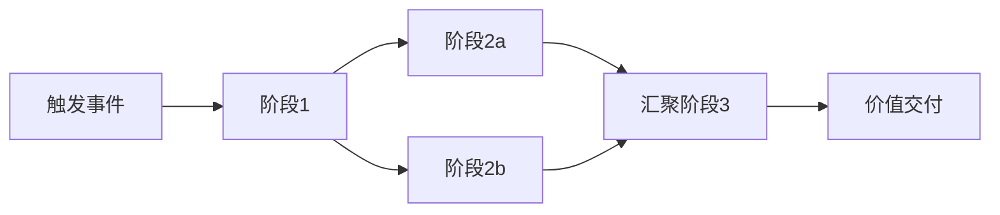

# 价值流复用的形式化组合

> **版本**: 2026-07-08
> **对齐标准**: TOGAF Value Stream, ArchiMate 4.2 Value Stream, SAFe, BPMN 2.0
> **定位**: 将价值流复用形式化为业务能力的有序组合

---

## 核心概念定义

价值流复用是指将端到端价值交付路径抽象为业务能力的有序组合，并在不同上下文（行业、产品线、区域）中通过适配接口契约与变性点实现复用的实践。价值流由能力阶段、阶段间接口契约与价值度量三元组构成。

## 正向复用案例

订单到现金（Order-to-Cash）是价值流复用的经典场景：零售、B2B 与订阅业务可共享“接收订单 → 信用检查 → 库存分配 → 发货 → 开票 → 收款”主干价值流，仅通过替换个别阶段或适配接口契约即可满足差异化需求。

## 1. 价值流的基本形式化

**定义 VS.1** (价值流): 价值流 V 是一个有序三元组 ⟨C, I, K⟩，其中：

- `C = {C₁, C₂, ..., Cₙ}`: 业务能力的有限集合
- `I = {I₁₂, I₂₃, ..., Iₙ₋₁ₙ}`: 阶段间接口契约集合
- `K = {K₁, K₂, ..., Kₙ}`: 每个阶段创造的价值度量集合

**定义 VS.2** (价值流复用): 价值流 V₁ 可复用于上下文 Ctx，当且仅当：

1. C(V₁) ∩ C(Ctx) ≠ ∅（能力交集非空）
2. I(V₁) 与 I(Ctx) 可适配
3. K(V₁) 满足 K(Ctx) 的最低价值要求

---

## 2. 价值流组合定理

> **定理 2.1** (Value Stream Composition): 若价值流 V 由阶段 {S₁, S₂, ..., Sₙ} 组成，且每个 Sᵢ 对应业务能力 Cᵢ，则 V 的复用等价于 {Cᵢ} 的**有序组合**加上**阶段间契约** {Iᵢ,ᵢ₊₁} 的复用。

形式化：

```text
Reuse(V) = Reuse({C₁, C₂, ..., Cₙ}) ∪ Reuse({I₁₂, I₂₃, ..., Iₙ₋₁ₙ})

其中:
- Reuse({Cᵢ}) 表示业务能力的有序调用
- Reuse({Iᵢ,ᵢ₊₁}) 表示阶段间数据/控制流的适配
```

**证明概要**：

- 价值流的本质是业务能力按时间顺序的执行序列
- 若各业务能力独立可复用，则其有序组合亦可复用
- 阶段间契约保证组合的语义正确性
- 缺少阶段间契约的组合是能力的简单堆砌，不是价值流

---

## 3. 经典价值流示例：订单到现金（Order-to-Cash）

```text
价值流: 订单到现金
├── S1: 接收订单
│   ├── 能力: 订单捕获 (Order Capture)
│   ├── 价值: 客户需求被记录
│   └── 接口 I₁₂: 订单数据（客户、产品、数量、价格）
│
├── S2: 信用检查
│   ├── 能力: 信用评估 (Credit Assessment)
│   ├── 价值: 交易风险被量化
│   └── 接口 I₂₃: 信用状态（通过/拒绝/待审）
│
├── S3: 库存分配
│   ├── 能力: 库存管理 (Inventory Management)
│   ├── 价值: 物理商品被预留
│   └── 接口 I₃₄: 库存预留确认
│
├── S4: 发货
│   ├── 能力: 物流配送 (Logistics Fulfillment)
│   ├── 价值: 商品在途
│   └── 接口 I₄₅: 发货通知 + 追踪号
│
├── S5: 开票
│   ├── 能力: 账单管理 (Billing Management)
│   ├── 价值: 应收账款建立
│   └── 接口 I₅₆: 发票数据
│
└── S6: 收款
    ├── 能力: 收款处理 (Payment Processing)
    └── 价值: 现金回笼
```

**复用分析**：

- 所有 6 个能力在零售、B2B、订阅业务中均可复用
- 阶段间契约（订单数据格式、信用状态枚举）需要标准化
- 订阅业务中 S3（库存分配）可能替换为 S3'（服务席位分配），但接口契约仍需兼容

---

## 4. 价值流复用的变性管理

| 变性类型 | 说明 | 复用策略 |
|----------|------|----------|
| **阶段数量调整** | 某些行业需要额外阶段 | 插入可选阶段，保持主干价值流不变 |
| **并行/串行切换** | 某些阶段可并行执行 | 定义阶段间的依赖关系图（而非简单线性） |
| **交付物格式差异** | 不同行业的输出格式不同 | 使用标准化数据契约 + 格式适配器 |
| **参与者角色映射** | 同一阶段由不同角色执行 | 角色抽象为泳道参数 |
| **SLA 差异** | 不同场景对时效要求不同 | SLA 作为阶段的非功能属性参数化 |

---

## 5. 价值流复用的判定树

```text
价值流复用判定
│
├── 1. 能力覆盖判定
│   ├── V 的业务能力集合 C(V) ⊇ Ctx 的需求能力集合 C(Ctx) ?
│   │   ├── 否 → 部分复用 / 能力缺口分析
│   │   └── 是 → 继续
│   └── 能力级别匹配: L(Cᵢ) ≥ L(Ctxᵢ) ?
│       ├── 否 → 能力升级 / 降级使用
│       └── 是 → 继续
│
├── 2. 接口契约判定
│   ├── V 的阶段间契约 I(V) 与 Ctx 的接口需求可适配?
│   │   ├── 否 → 设计适配层 / 重构接口
│   │   └── 是 → 继续
│   └── 数据格式、协议、SLA 是否兼容?
│       ├── 否 → 数据转换 / 协议桥接
│       └── 是 → 继续
│
├── 3. 价值守恒判定
│   ├── ∀Sᵢ ∈ V: V(S'ᵢ) ≥ V(Sᵢ) ?
│   │   ├── 否 → 替换将导致价值流退化，需重新设计
│   │   └── 是 → 继续
│   └── 端到端价值交付时间是否满足 Ctx 要求?
│       ├── 否 → 优化关键路径 / 并行化
│       └── 是 → 授权复用
│
└── 输出: 复用决策 + 适配设计 + 风险登记
```

---

## 6. 关键公理

> **公理 2.2** (Value Stream Conservation): 价值流中的价值总量守恒。若阶段 Sᵢ 被替换为 S'ᵢ，则必须保证 V(S'ᵢ) ≥ V(Sᵢ)，否则价值流整体退化。

> **定理 2.2** (Process-Service Duality): 业务流程是**时序化**的业务服务编排；业务服务是**接口化**的业务流程封装。二者在复用视角下构成对偶关系：Process = ∫Service dt; Service = dProcess/dt。

> **定理 2.3** (Business-Application Bridging): 业务服务是业务架构与应用架构的**桥接点**。当业务服务的技术实现契约稳定时，业务层与应用层解耦；当业务服务频繁变更时，两层耦合度指数上升。

---

## 7. 价值流组合模式

### 7.1 模式 1：线性顺序组合

最基本的组合模式，阶段按严格顺序执行。


### 7.2 模式 2：并行-汇聚组合

多个阶段可同时执行，全部完成后汇聚到下一阶段。



### 7.3 模式 3：条件分支组合

根据阶段输出或外部条件选择不同路径。

### 7.4 模式 4：可插拔阶段组合

主干价值流保持不变，某些阶段根据场景插入或跳过。

### 7.5 模式 5：循环反馈组合

价值流的最后一个阶段将反馈信息传递回早期阶段，形成持续改进闭环。


### 7.6 模式 6：事件驱动组合

价值流的推进不由预设顺序决定，而由业务事件触发。

---

## 8. 价值流与业务能力/业务流程/业务服务的映射

| 概念 | 核心关注点 | 在价值流中的角色 | 复用形式 |
|---|---|---|---|
| 价值主张 | 为何做（Why） | 价值流的起点与终点 | 价值主张画布、商业模式 |
| 业务能力 | 做什么（What） | 价值流每个阶段的执行主体 | 能力目录、能力服务 |
| 业务流程 | 怎么做（How） | 能力在特定场景下的具体执行步骤 | BPMN 流程模板 |
| 业务服务 | 如何调用（Interface） | 阶段之间的接口契约 | OpenAPI / gRPC 契约 |
| 业务对象 | 操作什么（Data） | 阶段间传递的数据语义 | 数据模型、Schema |
| 价值度量 | 价值多大（KPI） | 阶段与端到端价值评估 | KPI 仪表盘、SLA |

> **映射规则**：价值流阶段 → 业务能力 → 业务流程 → 业务服务 → 业务对象。阶段之间的接口契约必须保持稳定，否则价值流复用将退化为系统集成的点对点适配。

---

## 9. 与权威框架/标准的条款映射

| 框架/标准 | 对应概念 | 条款/章节 | 映射说明 |
|---|---|---|---|
| TOGAF 10 | Value Stream | Phase B, Business Architecture | TOGAF 价值流描述端到端价值交付，由业务能力阶段组成 |
| ArchiMate 4.2 | Value Stream | §7.3 Value Stream | ArchiMate Value Stream 与本概念等价，可关联 Capability、Business Process |
| BPMN 2.0 | Process / Collaboration | §8 Process, §10 Collaboration | 价值流的可执行编排由 BPMN Process 承载，跨组织协作由 Collaboration 承载 |
| DMN 1.5 | Decision Service | §6 Decision Requirements, §8 Decision Table | 价值流中的条件分支与决策规则由 DMN 决策服务承载 |
| SAFe | Operational Value Stream | SAFe 6.0 Value Streams | 运营价值流（Operational Value Stream）定义端到端交付活动序列 |

---

## 10. 正例与反例

### 10.1 正例：保险公司的理赔价值流复用

**背景**：某保险公司在财产险、健康险、车险三条产品线分别建设了理赔系统，流程差异大但核心价值创造路径相似。

**复用实践**：

1. 定义统一理赔价值流：报案 → 查勘 → 定损 → 核赔 → 赔付。
2. 将每条产品线特定的阶段抽象为"可插拔变体"：
   - 车险：查勘阶段包含现场查勘和远程视频查勘
   - 健康险：查勘阶段包含医疗费用审核
   - 财产险：定损阶段包含第三方评估
3. 统一接口契约（报案号、理赔状态、赔付金额）。
4. 建立价值流模板库，新产品线只需选择变体。

**效果**：

- 新产品理赔流程设计时间从 3 个月缩短至 3 周
- 理赔处理成本降低 22%
- 客户满意度提升 18%

### 10.2 正例：制造业订单到交付价值流复用

**背景**：某制造业集团在亚太、欧洲、北美拥有多个工厂，各工厂独立设计"订单到交付（Order-to-Delivery, OTD）"流程。

**复用实践**：

1. 定义集团级 OTD 价值流：订单确认 → 生产排程 → 物料准备 → 生产制造 → 质量检验 → 物流配送 → 交付签收。
2. 将每个阶段映射到标准化业务能力：订单管理、生产计划、物料管理、质量管理、物流配送。
3. 各工厂保留本地变体：如欧洲工厂增加 GDPR 合规检查，亚太工厂支持多语言发票。
4. 通过统一事件总线和接口契约（订单状态、物流追踪号）实现跨区域协同。

**效果**：

- 新产品 OTD 流程设计时间从 8 周缩短至 2 周。
- 跨区域订单交付准时率提升 15%。
- 库存周转率提升 12%，缺货率下降 8%。

## 反例

### 10.3 反例：价值流与系统边界错位

**场景**：某电商公司将"订单到收款"价值流按现有系统边界切分为：前端系统负责"下单"、OMS 负责"订单处理"、WMS 负责"发货"、财务系统负责"开票收款"。

**问题**：

- 价值流在系统边界处断裂，每个系统只关注自己的"完成"。
- 客户退货时，需要在四个系统中分别操作，状态不一致。
- 端到端价值（客户满意、现金回笼）无人负责。

**后果**：

- 退货处理周期长达 7-10 天
- 客户投诉中 40% 与"状态不透明"相关
- 财务对账困难，应收账款账龄延长

**避免建议**：

- 价值流设计应**以价值交付为中心**，而非以系统边界为中心。
- 建立端到端价值流 Owner，跨越系统边界协调。
- 使用统一事件总线保持跨系统状态一致性。

### 10.4 反例：价值流过度泛化

**场景**：某企业在构建价值流目录时，将"员工入职""IT 服务请求""供应商付款"等差异巨大的流程都纳入同一个"端到端服务价值流"。

**问题**：

- 价值流边界模糊，阶段定义过于抽象，无法指导具体实施。
- 不同场景的业务能力、接口契约差异大，强行复用导致大量例外处理。
- 价值流 Owner 无法对如此宽泛的流程负责。

**后果**：

- 价值流目录失去实际指导意义，项目团队仍然按系统边界设计流程。
- 价值流阶段接口契约频繁变更，下游系统集成成本居高不下。

**避免建议**：

- 价值流应聚焦单一、可度量的价值主张，避免"万能价值流"。
- 当多个场景差异较大时，应拆分为多个价值流，并通过共享阶段实现复用。
- 价值流设计应经过业务 Owner 和技术 Owner 共同评审，确保端到端边界清晰。

---

## 11. 权威来源与交叉引用

> **权威来源**:
>
> - [The Open Group TOGAF Series Guide: Value Streams](https://www.opengroup.org/togaf) — TOGAF 价值流指南；核查日期：2026-07-08
> - [ArchiMate 4.2 Specification](https://pubs.opengroup.org/architecture/archimate4-doc/) — ArchiMate Value Stream 元模型；核查日期：2026-07-08
> - [OMG BPMN 2.0.2 Specification](https://www.omg.org/spec/BPMN/2.0.2/) — 价值流可执行编排标准；核查日期：2026-07-08
> - [OMG DMN 1.5 Specification](https://www.omg.org/spec/DMN/1.5/) — 决策服务与价值流条件分支；核查日期：2026-07-08
> - [SAFe Value Streams](https://scaledagileframework.com/value-streams/) — SAFe 价值流框架；核查日期：2026-07-08
>
> **核查日期**: 2026-07-08

**交叉引用**：

- [业务能力复用](../02-business-capability/capability-reuse.md) — 价值流组合的能力单元
- [BPMN 2.0 / DMN 业务过程与决策的复用编排](../06-bpmn-dmn/bpmn-dmn-reuse-orchestration.md) — 价值流的可执行编排
- [Zachman Framework 与软件架构复用映射](../08-zachman-reuse-mapping/zachman-reusability-matrix.md) — 价值流在 Zachman Why/What/How 维度的映射
- [BIAN 金融服务域复用案例](../case-studies/bian-banking-reuse-case.md) — 金融服务价值流复用
