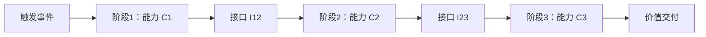
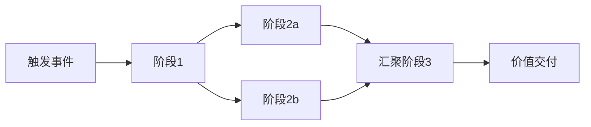

# 价值流复用的形式化组合

> **版本**: 2026-06-06
> **对齐标准**: TOGAF Value Stream, ArchiMate Value Stream, SAFe
> **定位**: 将价值流复用形式化为业务能力的有序组合

---

## 1. 价值流的基本形式化

**定义 VS.1** (价值流): 价值流 V 是一个有序三元组 ⟨C, I, K⟩，其中：

- `C = {C₁, C₂, ..., Cₙ}`: 业务能力的有限集合
- `I = {I₁₂, I₂₃, ..., Iₙ₋₁ₙ}`: 阶段间接口契约集合
- `K = {K₁, K₂, ..., Kₙ}`: 每个阶段创造的价值度量集合

**定义 VS.2** (价值流复用): 价值流 V₁ 可复用于上下文 Ctx，当且仅当：

1. C(V₁) ∩ C(Ctx) ≠ ∅（能力交集非空）
2. I(V₁) 与 I(Ctx) 可适配
3. K(V₁) 满足 K(Ctx) 的最低价值要求

---

## 2. 价值流组合定理

> **定理 2.1** (Value Stream Composition): 若价值流 V 由阶段 {S₁, S₂, ..., Sₙ} 组成，且每个 Sᵢ 对应业务能力 Cᵢ，则 V 的复用等价于 {Cᵢ} 的**有序组合**加上**阶段间契约** {Iᵢ,ᵢ₊₁} 的复用。

形式化：

```text
Reuse(V) = Reuse({C₁, C₂, ..., Cₙ}) ∪ Reuse({I₁₂, I₂₃, ..., Iₙ₋₁ₙ})

其中:
- Reuse({Cᵢ}) 表示业务能力的有序调用
- Reuse({Iᵢ,ᵢ₊₁}) 表示阶段间数据/控制流的适配
```

**证明概要**:

- 价值流的本质是业务能力按时间顺序的执行序列
- 若各业务能力独立可复用，则其有序组合亦可复用
- 阶段间契约保证组合的语义正确性
- 缺少阶段间契约的组合是能力的简单堆砌，不是价值流

---

## 3. 经典价值流示例

### "订单到现金" (Order-to-Cash)

```text
价值流: 订单到现金
├── S1: 接收订单
│   ├── 能力: 订单捕获 (Order Capture)
│   ├── 价值: 客户需求被记录
│   └── 接口 I₁₂: 订单数据（客户、产品、数量、价格）
│
├── S2: 信用检查
│   ├── 能力: 信用评估 (Credit Assessment)
│   ├── 价值: 交易风险被量化
│   └── 接口 I₂₃: 信用状态（通过/拒绝/待审）
│
├── S3: 库存分配
│   ├── 能力: 库存管理 (Inventory Management)
│   ├── 价值: 物理商品被预留
│   └── 接口 I₃₄: 库存预留确认
│
├── S4: 发货
│   ├── 能力: 物流配送 (Logistics Fulfillment)
│   ├── 价值: 商品在途
│   └── 接口 I₄₅: 发货通知 + 追踪号
│
├── S5: 开票
│   ├── 能力: 账单管理 (Billing Management)
│   ├── 价值: 应收账款建立
│   └── 接口 I₅₆: 发票数据
│
└── S6: 收款
    ├── 能力: 收款处理 (Payment Processing)
    └── 价值: 现金回笼
```

**复用分析**:

- 所有 6 个能力在零售、B2B、订阅业务中均可复用
- 阶段间契约（订单数据格式、信用状态枚举）需要标准化
- 订阅业务中 S3（库存分配）可能替换为 S3'（服务席位分配），但接口契约仍需兼容

---

## 4. 价值流复用的变性管理

| 变性类型 | 说明 | 复用策略 |
|----------|------|----------|
| **阶段数量调整** | 某些行业需要额外阶段 | 插入可选阶段，保持主干价值流不变 |
| **并行/串行切换** | 某些阶段可并行执行 | 定义阶段间的依赖关系图（而非简单线性） |
| **交付物格式差异** | 不同行业的输出格式不同 | 使用标准化数据契约 + 格式适配器 |
| **参与者角色映射** | 同一阶段由不同角色执行 | 角色抽象为泳道参数 |
| **SLA 差异** | 不同场景对时效要求不同 | SLA 作为阶段的非功能属性参数化 |

---

## 5. 价值流复用的判定树

```text
价值流复用判定
│
├── 1. 能力覆盖判定
│   ├── V 的业务能力集合 C(V) ⊇ Ctx 的需求能力集合 C(Ctx) ?
│   │   ├── 否 → 部分复用 / 能力缺口分析
│   │   └── 是 → 继续
│   └── 能力级别匹配: L(Cᵢ) ≥ L(Ctxᵢ) ?
│       ├── 否 → 能力升级 / 降级使用
│       └── 是 → 继续
│
├── 2. 接口契约判定
│   ├── V 的阶段间契约 I(V) 与 Ctx 的接口需求可适配?
│   │   ├── 否 → 设计适配层 / 重构接口
│   │   └── 是 → 继续
│   └── 数据格式、协议、SLA 是否兼容?
│       ├── 否 → 数据转换 / 协议桥接
│       └── 是 → 继续
│
├── 3. 价值守恒判定
│   ├── ∀Sᵢ ∈ V: V(S'ᵢ) ≥ V(Sᵢ) ?
│   │   ├── 否 → 替换将导致价值流退化，需重新设计
│   │   └── 是 → 继续
│   └── 端到端价值交付时间是否满足 Ctx 要求?
│       ├── 否 → 优化关键路径 / 并行化
│       └── 是 → 授权复用
│
└── 输出: 复用决策 + 适配设计 + 风险登记
```

---

## 6. 关键公理

> **公理 2.2** (Value Stream Conservation): 价值流中的价值总量守恒。若阶段 Sᵢ 被替换为 S'ᵢ，则必须保证 V(S'ᵢ) ≥ V(Sᵢ)，否则价值流整体退化。
> **定理 2.2** (Process-Service Duality): 业务流程是**时序化**的业务服务编排；业务服务是**接口化**的业务流程封装。二者在复用视角下构成对偶关系：Process = ∫Service dt; Service = dProcess/dt。
> **定理 2.3** (Business-Application Bridging): 业务服务是业务架构与应用架构的**桥接点**。当业务服务的技术实现契约稳定时，业务层与应用层解耦；当业务服务频繁变更时，两层耦合度指数上升。

---

> 最后更新: 2026-06-06


---

## 7. 价值流组合模式与映射关系

### 7.1 概念定义

**定义**：价值流组合（Value Stream Composition）是指根据端到端价值交付目标，将一组业务能力按照特定的顺序、接口契约和变异规则进行编排，形成可在不同业务场景、产品线或组织中复用的价值交付模式。

形式化：

```text
ValueStreamComposition := ⟨VS, C, I, R, M⟩

VS: 目标价值流
C = {C₁, ..., Cₙ}: 组成价值流的业务能力集合
I = {I₁₂, ..., Iₙ₋₁ₙ}: 阶段间接口契约集合
R: 组合规则（顺序、并行、条件、循环）
M: 变性管理规则（适配、替换、扩展）
```

### 7.2 价值流复用核心属性

| 属性 | 说明 | 可观察指标 | 重要性 |
|---|---|---|---|
| 端到端完整性 | 价值流覆盖从触发到价值交付的全过程 | 首尾阶段是否对应价值主张 | 高 |
| 能力可替换性 | 单个阶段能力可被等效能力替换 | 接口契约稳定性 | 高 |
| 阶段可组合性 | 多个价值流可共享相同阶段 | 阶段复用次数 | 高 |
| 变性可控性 | 能适应不同场景的差异而不破坏主干 | 变体数量与管理成本比 | 中 |
| 价值可度量性 | 每个阶段和端到端价值可被度量 | KPI 定义覆盖率 | 高 |
| 可视化程度 | 价值流可被业务和技术人员共同理解 | 建模工具覆盖率 | 中 |

### 7.3 价值流组合模式

#### 模式 1：线性顺序组合

最基本的组合模式，阶段按严格顺序执行。



#### 模式 2：并行-汇聚组合

多个阶段可同时执行，全部完成后汇聚到下一阶段。



#### 模式 3：条件分支组合

根据阶段输出或外部条件选择不同路径。

#### 模式 4：可插拔阶段组合

主干价值流保持不变，某些阶段根据场景插入或跳过。

### 7.4 价值流与业务能力/业务流程的映射

| 概念 | 关注点 | 与价值流的关系 |
|---|---|---|
| 业务能力 | "能做什么" | 价值流的阶段由业务能力实现 |
| 业务流程 | "怎么做" | 业务流程是价值流中各阶段的执行细节 |
| 业务服务 | "如何调用" | 业务服务是能力与流程的接口化封装 |
| 价值主张 | "为何做" | 价值流的起点和终点由价值主张定义 |

**映射规则**：

1. 每个价值流阶段对应一个或多个业务能力。
2. 阶段间的接口契约由业务服务定义。
3. 业务流程负责将能力实例化为具体步骤。
4. 价值度量 KPI 贯穿价值流全过程。

### 7.5 正例：保险公司的理赔价值流复用

**背景**：某保险公司在财产险、健康险、车险三条产品线分别建设了理赔系统，流程差异大但核心价值创造路径相似。

**复用实践**：

1. 定义统一理赔价值流：报案 → 查勘 → 定损 → 核赔 → 赔付。
2. 将每条产品线特定的阶段抽象为"可插拔变体"：
   - 车险：查勘阶段包含现场查勘和远程视频查勘
   - 健康险：查勘阶段包含医疗费用审核
   - 财产险：定损阶段包含第三方评估
3. 统一接口契约（报案号、理赔状态、赔付金额）。
4. 建立价值流模板库，新产品线只需选择变体。

**效果**：

- 新产品理赔流程设计时间从 3 个月缩短至 3 周
- 理赔处理成本降低 22%
- 客户满意度提升 18%

### 7.6 反例：价值流与系统边界错位

**场景**：某电商公司将"订单到收款"价值流按现有系统边界切分为：前端系统负责"下单"、OMS 负责"订单处理"、WMS 负责"发货"、财务系统负责"开票收款"。

**问题**：

- 价值流在系统边界处断裂，每个系统只关注自己的"完成"。
- 客户退货时，需要在四个系统中分别操作，状态不一致。
- 端到端价值（客户满意、现金回笼）无人负责。

**后果**：

- 退货处理周期长达 7-10 天
- 客户投诉中 40% 与"状态不透明"相关
- 财务对账困难，应收账款账龄延长

**避免建议**：

- 价值流设计应**以价值交付为中心**，而非以系统边界为中心。
- 建立端到端价值流 Owner，跨越系统边界协调。
- 使用统一事件总线保持跨系统状态一致性。

### 7.7 与其他概念的关系

- **与业务能力的关系**：价值流是业务能力的有序组合，能力是价值流的"砖块"。
- **与 [BPMN](https://en.wikipedia.org/wiki/Business_process_modeling) 的关系**：BPMN 是价值流可执行编排的主要语言。
- **与 [DMN](https://en.wikipedia.org/wiki/Decision_Model_and_Notation) 的关系**：DMN 定义价值流中条件分支和决策规则的逻辑。
- **与服务网格/编排的关系**：技术层面的服务编排实现价值流中的阶段调用。

### 7.8 权威来源与交叉引用

> **权威来源**:
>
> - [Value-stream mapping - Wikipedia](https://en.wikipedia.org/wiki/Value-stream_mapping) — 价值流图与精益思想
> - [Business process modeling - Wikipedia](https://en.wikipedia.org/wiki/Business_process_modeling) — 业务流程建模
> - [The Open Group TOGAF Series Guide: Value Streams](https://www.opengroup.org/togaf) — TOGAF 价值流指南
> - [SAFe Value Streams](https://scaledagileframework.com/value-streams/) — SAFe 价值流框架
>
> **核查日期**: 2026-07-07

**交叉引用**：

- [业务能力复用](../02-business-capability/capability-reuse.md) — 价值流组合的能力单元
- [BPMN 2.0 / DMN 业务过程与决策的复用编排](../06-bpmn-dmn/bpmn-dmn-reuse-orchestration.md) — 价值流的可执行编排
- [Zachman Framework 与软件架构复用映射](../08-zachman-reuse-mapping/zachman-reusability-matrix.md) — 价值流在 Zachman Why/What/How 维度的映射
- [BIAN 金融服务域复用案例](../case-studies/bian-banking-reuse-case.md) — 金融服务价值流复用


## 补充说明：价值流复用的形式化组合

## 概念定义

**定义**：价值流（Value Stream）是端到端描述利益相关者价值创造活动的序列，价值流复用则是在不同场景下重用成熟的价值交付模式。

## 示例

**示例**：某保险公司将“理赔端到端价值流”标准化为可复用模板，在新产品线上线时只需调整规则与接口，缩短上市时间 40%。

## 反例

**反例**：价值流在部门边界处断裂，导致“订单到收款”流程在财务、物流、客服之间反复切换系统，客户体验受损。

## 权威来源

> **权威来源**:
>
> - [The Open Group TOGAF](https://www.opengroup.org/togaf)
> - [OMG BPMN](https://www.omg.org/spec/BPMN)
> - 核查日期：2026-07-07
