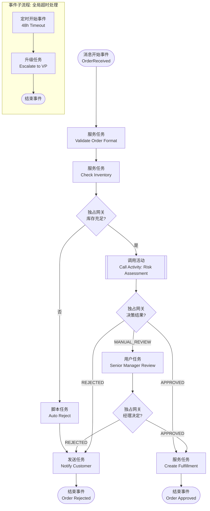
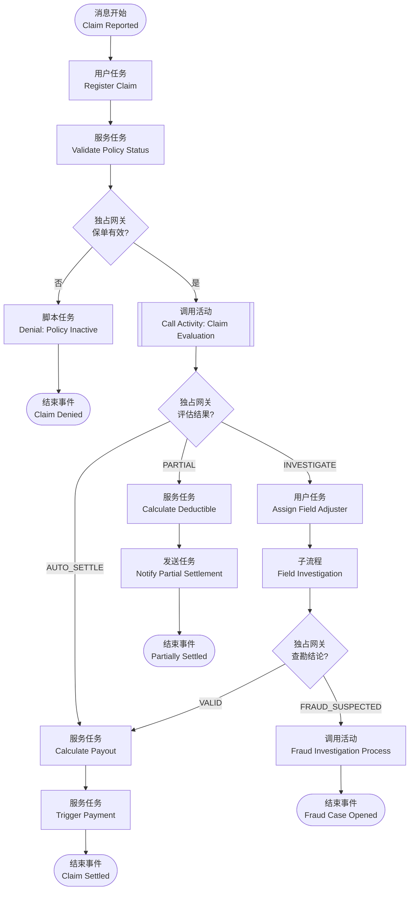
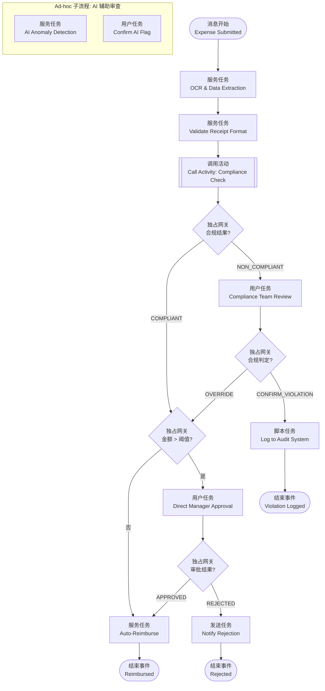

# BPMN 2.0 / DMN 1.5 可执行语义案例集

> **版本**: 2026-06-06
> **对齐来源**: OMG BPMN 2.0.2, OMG DMN 1.5 (2024), ISO/IEC 19510:2013, Camunda 2024, Freund & Rücker — *Practical Process Automation* (O'Reilly)

---

## 引言

BPMN 2.0 与 DMN 1.5 的核心价值在于"同一模型、双重语义"：一张流程图或决策表，既是业务人员可读的沟通媒介，也是流程引擎可直接执行的 XML 规范。本文通过三个生产级案例，展示如何将 BPMN 的**调用活动（Call Activity）**、**事件子流程（Event Subprocess）**与 DMN 的**决策服务（Decision Service）**转化为可复用的业务资产。

---

## 案例 1：订单审批流程（Order Approval Workflow）

### 1.1 业务背景

B2B 电商平台接收客户订单后，需根据订单金额、客户信用等级、库存可用性三个维度，决定订单的流转路径：自动通过、人工复核或拒绝。

### 1.2 BPMN 流程图（Mermaid）



### 1.3 DMN 决策表：订单风险评估

**决策名称**: `OrderRiskAssessment`
**命中策略**: `Unique`（唯一命中）

| 规则编号 | 订单金额 (Amount) | 客户信用等级 (Credit) | 库存状态 (Stock) | 输出: 决策结果 (Decision) | 输出: 原因 (Reason) |
|---------|------------------|---------------------|-----------------|------------------------|------------------|
| R1 | < 10,000 | AAA / AA | 充足 | AUTO_APPROVE | 低风险，自动通过 |
| R2 | < 50,000 | A / BBB | 充足 | MANUAL_REVIEW | 中等风险，需人工复核 |
| R3 | ≥ 50,000 | 任意 | 充足 | MANUAL_REVIEW | 高额订单，强制复核 |
| R4 | 任意 | BB 及以下 | 充足 | MANUAL_REVIEW | 信用等级低，需复核 |
| R5 | 任意 | 任意 | 不足 | AUTO_REJECT | 库存不足，自动拒绝 |

**FEEL 表达式片段**（用于输入校验）：

```feel
if order.amount < 0 then null
else if order.customer.creditScore in ["AAA","AA","A","BBB","BB","B","CCC"] then order.customer.creditScore
else null
```

### 1.4 复用点分析

| 复用元素 | BPMN/DMN 构造 | 复用方式 | 复用价值 |
|---------|--------------|---------|---------|
| **调用活动** | `Call Activity` 调用独立流程 `Risk Assessment` | 多个主流程（B2B 订单、B2C 大额订单、分销订单）共享同一风险评估子流程 | 规则变更时仅需修改一处，避免流程克隆 |
| **决策服务** | DMN `Decision Service` 封装 `OrderRiskAssessment` | 通过 REST API 暴露给 CRM、客服系统、移动端 | 信用评估逻辑跨渠道复用，版本独立演进 |
| **事件子流程** | 附加于主流程的 `Event Subprocess`（Timer Boundary） | 同一超时处理模式复用于所有审批类流程 | 横切关注点（SLA 监控、升级）统一治理 |
| **全局任务** | `Global User Task` — "Senior Manager Review" | 在多个审批流程中引用同一人工任务定义 | 表单模板、权限矩阵、提醒规则集中维护 |

> **公理 2.1 延伸**: 当决策逻辑（DMN）与流程控制流（BPMN）解耦后，两者的变更频率差异被隔离。决策规则可每周迭代，而流程结构可季度稳定。

---

## 案例 2：保险理赔决策（Insurance Claims Decisioning）

### 2.1 业务背景

财产险理赔流程中，需在受理报案后，依据保单类型、出险原因、历史理赔次数、是否在免赔额范围内，自动计算赔付比例并决定是否需要现场查勘。

### 2.2 BPMN 流程图（Mermaid）



### 2.3 DMN 决策需求图（DRD）与决策表

**DRD 结构**:

```
ClaimEvaluation [决策]
├── Input Data: ClaimInfo
│   ├── incidentType: {"Collision", "Theft", "Fire", "Natural Disaster"}
│   ├── claimAmount: number
│   └── incidentDate: date
├── Input Data: PolicyInfo
│   ├── policyType: {"Comprehensive", "ThirdParty", "TheftOnly"}
│   └── deductible: number
├── Input Data: CustomerHistory
│   └── claimsLast3Years: number
├── Business Knowledge Model: CoverageMatrix
└── Decision: PayoutCalculation
    └── Business Knowledge Model: DepreciationTable
```

**主决策表 `ClaimEvaluation`**（命中策略: `First`）

| 规则 | 保单类型 | 出险类型 | 金额 vs 免赔额 | 近3年理赔次数 | 输出: action | 输出: payoutRate |
|-----|---------|---------|--------------|------------|-----------|---------------|
| R1 | Comprehensive | Collision | amount > deductible | ≤ 2 | AUTO_SETTLE | 0.95 |
| R2 | Comprehensive | Theft | amount > deductible | ≤ 2 | AUTO_SETTLE | 0.90 |
| R3 | ThirdParty | Collision | amount > deductible | ≤ 1 | AUTO_SETTLE | 0.80 |
| R4 | 任意 | Natural Disaster | amount > 10000 | 任意 | INVESTIGATE | null |
| R5 | 任意 | 任意 | amount ≤ deductible | 任意 | PARTIAL | 0.00 |
| R6 | 任意 | 任意 | 任意 | ≥ 3 | INVESTIGATE | null |
| R7 | 任意 | 任意 | 任意 | 任意 | INVESTIGATE | null |

**FEEL 表达式 — 折旧计算**:

```feel
if claim.incidentType = "Collision" and claim.vehicleAge > 5 then
    max(0.5, 1 - (claim.vehicleAge - 5) * 0.05)
else 1.0
```

### 2.4 复用点分析

| 复用元素 | BPMN/DMN 构造 | 复用方式 | 复用价值 |
|---------|--------------|---------|---------|
| **业务知识模型** | DMN `Business Knowledge Model` (BKM) `CoverageMatrix` | 被 `ClaimEvaluation` 及其他险种（健康险、责任险）决策引用 | 保险覆盖规则作为行业知识资产沉淀，跨产品线复用 |
| **调用活动** | `Call Activity: Fraud Investigation Process` | 理赔、续保核保、退保审核均调用同一反欺诈子流程 | 反欺诈规则集中，避免欺诈分子利用流程差异绕过检测 |
| **决策服务版本** | DMN Decision Service v1.2 | 旧保单使用 v1.1，新保单使用 v1.2，通过 API 路由控制 | 合规变更不影响历史案件回溯 |
| **嵌套子流程** | `Field Investigation` Embedded Subprocess | 作为模板复用于车险、财产险、企业险的查勘环节 | 查勘步骤标准化，数据采集字段统一 |

---

## 案例 3：费用报销与合规校验（Expense Reimbursement & Compliance）

### 3.1 业务背景

跨国企业员工提交差旅费用报销后，系统需根据费用类型、金额阈值、目的地国家合规政策、员工职级，自动判定报销是否合规、是否需要附加审批或进入合规审查队列。

### 3.2 BPMN 流程图（Mermaid）



### 3.3 DMN 决策表：费用合规检查

**决策名称**: `ExpenseComplianceCheck`
**命中策略**: `Collect` + `List`（收集所有命中规则）

| 规则 | 费用类型 | 金额 (USD) | 目的地国家 | 员工职级 | 输出: complianceFlag | 输出: requiredAttachment |
|-----|---------|-----------|----------|---------|-------------------|-----------------------|
| R1 | 餐饮 | > 200 | 任意 | 任意 | "THRESHOLD_EXCEEDED" | {"receipt", "attendee_list"} |
| R2 | 机票 | 任意 | 任意 | 任意 | "COMPLIANT" | {"itinerary", "boarding_pass"} |
| R3 | 酒店 | > 500 / 晚 | 任意 | Junior | "POLICY_VIOLATION" | {"justification"} |
| R4 | 礼品 | > 50 | CN, US, DE | 任意 | "ANTI_BRIBERY_CHECK" | {"recipient_info", "business_purpose"} |
| R5 | 交通 | ≤ 100 | 任意 | 任意 | "COMPLIANT" | {"receipt"} |

**FEEL 上下文表达式 — 阈值动态计算**:

```feel
{
    threshold: if employee.level in ["VP","SVP","C-Level"] then 1000 else 500,
    dailyAllowance: lookup table by country code,
    violationSeverity: if count(complianceFlag) > 2 then "HIGH" else "MEDIUM"
}
```

### 3.4 复用点分析

| 复用元素 | BPMN/DMN 构造 | 复用方式 | 复用价值 |
|---------|--------------|---------|---------|
| **调用活动** | `Call Activity: Compliance Check` | 费用报销、采购申请、供应商付款均调用同一合规决策服务 | 合规政策（如反贿赂、税务规则）全局统一，一键更新 |
| **Ad-hoc 子流程** | `Ad-hoc Subprocess`（AI 辅助审查） | 用于非结构化审查场景：AI 标记异常后由人确认 | 为 AI Agent 提供确定性治理框架，符合本知识体系对 AI 编排的论述 |
| **DMN 决策表** | `ExpenseComplianceCheck` 按国家维度切片 | 不同国家子公司引用同一决策模型，通过输入数据 `countryCode` 区分规则 | 全球化企业的本地化合规与集中治理平衡 |
| **边界事件** | 附加于 `ManagerApproval` 的 `Timer Boundary Event`（72h） | 同一超时模式复用于所有人工审批任务 | SLA 可配置、可监控、可审计 |

---

## 4. 跨案例总结：BPMN/DMN 可复用元素速查表

| 元素类别 | 元素名称 | 可复用级别 | 复用模式 | 版本治理 |
|---------|---------|----------|---------|---------|
| **活动** | Call Activity | 流程级 | 跨流程调用全局流程定义 | 被调用流程独立版本 |
| **活动** | Global Task | 企业级 | 多流程引用同一任务定义 | 任务模板版本化 |
| **子流程** | Event Subprocess | 模板级 | 作为异常处理模板附加于任意流程 | 模板库管理 |
| **子流程** | Ad-hoc Subprocess | 场景级 | AI/知识工作者驱动的非结构化步骤 | 与主流程同版本 |
| **决策** | Decision Service | 服务级 | REST API / gRPC 暴露，跨系统调用 | Semantic Versioning |
| **决策** | Business Knowledge Model | 知识级 | 被多个 Decision 引用 | 知识库版本控制 |
| **数据** | Input Data / Item Definition | 元模型级 | 全局数据类型定义（如 `Customer`, `Policy`） | 与企业数据标准同步 |

---

## 5. 实施建议

1. **流程引擎选型**: 优先选择支持 BPMN `Common Executable` 子集与 DMN 1.5 Conformance Level 3 的引擎（如 Camunda 8, jBPM, Drools）。
2. **版本策略**: DMN 决策服务采用 Semantic Versioning（如 `OrderRiskAssessment/v2.1.0`），BPMN 流程采用流程引擎自带的版本管理机制。
3. **测试策略**: 对 DMN 决策表执行全规则覆盖测试（Hit Policy Verification），对 BPMN 调用活动执行集成契约测试。
4. **监控策略**: 在 Call Activity 入口/出口、Decision Service 调用点植入标准化追踪标识（Trace ID），实现端到端审计。

---

## 参考索引

- OMG: *Business Process Model and Notation (BPMN) Version 2.0.2* (2014) — [https://www.omg.org/spec/BPMN](https://www.omg.org/spec/BPMN)
- OMG: *Decision Model and Notation (DMN) Version 1.5* (2024) — [https://www.omg.org/spec/DMN](https://www.omg.org/spec/DMN)
- ISO/IEC 19510:2013 — *Information technology — Object Management Group Business Process Model and Notation*
- Bock, C.: *BPMN 2.0 Handbook* (2nd Edition, 2012) — 关于 Call Activity 与 Event Subprocess 的权威解释
- Freund, J. & Rücker, B.: *Practical Process Automation* (O'Reilly, 2021) — BPMN/DMN 集成实践
- ISD 2025 Research Paper: *DMN basis and applications* (2025) — DMN 1.5 语义与 FEEL 表达式应用综述
- Camunda GmbH: *BPMN: The open standard for process and agentic orchestration* (2024)

---

> 最后更新: 2026-06-06
