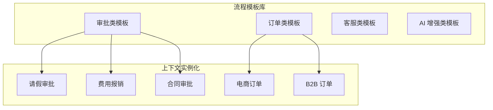
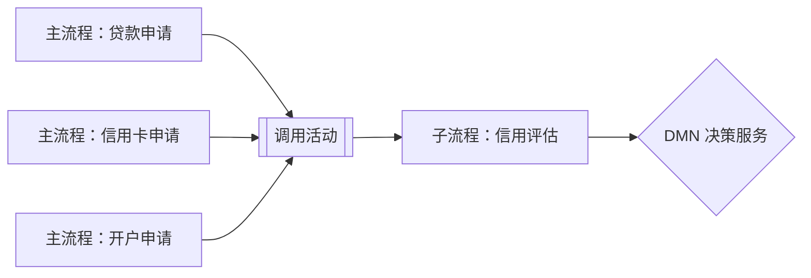
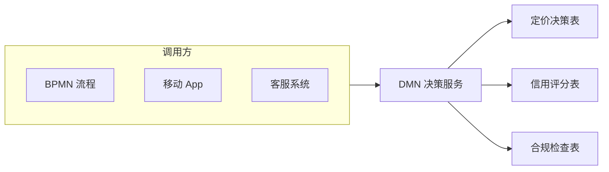
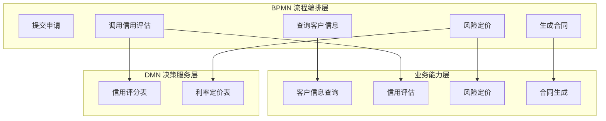
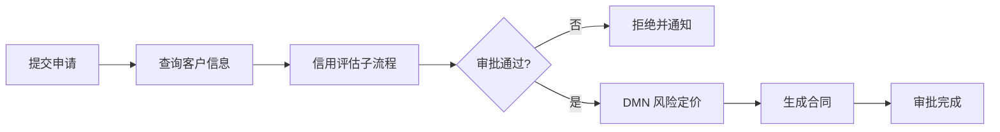

# BPMN 2.0 / DMN 业务过程与决策的复用编排
>
> 版本: 2026-06-06
> 对齐来源: OMG BPMN 2.0.2 / DMN 1.5, ISO/IEC 19510:2013, Camunda 2024, Signavio/SAP, 澳大利亚 NSW 交通标准

## 1. 标准体系

| 标准 | 版本状态 | 标准化机构 | 关键特征 |
|-----|---------|-----------|---------|
| **BPMN** | 2.0.2 (2014) | OMG / ISO/IEC 19510:2013 | 人读 + 机执行的双重语义 |
| **DMN** | 1.5 (2024) | OMG | 决策需求图 + 决策表 + FEEL 表达式 |
| **CMMN** | 1.1 | OMG | 案例管理（非结构化流程）|

## 2. BPMN 作为复用载体的独特价值

### 2.1 双重语义

> "A BPMN diagram is simultaneously a visual that any stakeholder can read and an XML specification that an orchestration engine can run."

- **人读**：业务流程图让所有利益相关者理解流程
- **机执行**：BPMN 2.0 XML 可被流程引擎直接执行
- **结果**：业务批准的流程与生产运行的流程完全一致

### 2.2 与 AI 智能体时代的契合

BPMN 在 AI 时代的价值不降反升：

- **确定性骨架**：为非确定性 AI 智能体提供编排、升级、审批、审计的确定性框架
- **Agent 治理**：BPMN 将智能体视为普通参与者（服务、人员、系统），由流程决定何时调用、结果如何处理
- **可审计性**：每一步（无论由代码、智能体或人执行）进入同一审计轨迹

### 2.3 与专有方案的对比

| 维度 | BPMN (开放标准) | 专有低代码 | 纯代码编排器 |
|-----|---------------|-----------|------------|
| 开放标准 | ISO/IEC 19510, OMG 维护 | 厂商私有 | 无，仅代码构造 |
| 业务可读性 | 原生设计 | 受限于厂商 UI | 无，逻辑在代码中 |
| 工具/人才可移植性 | 100+ 工具支持 | 锁定厂商 | 锁定引擎 SDK |
| 人工任务支持 | User Task 为一等公民 | 套件内支持 | 需从零构建 |
| 智能体治理 | 外部+内部（ad-hoc subprocess）| 仅外部 | 仅外部 |
| 审计轨迹 | 自动记录，无需额外插桩 | 套件内；跨系统脆弱 | 仅日志，无端到端视图 |

## 3. BPMN 核心元素族

| 元素族 | 代表元素 | 复用场景 |
|-------|---------|---------|
| **事件（Events）** | Start, End, Timer, Message, Error, Boundary | 流程触发器、超时处理、异常恢复 |
| **任务（Tasks）** | User Task, Service Task, Business Rule Task, Script Task | 人工审批、API 调用、DMN 决策、脚本执行 |
| **网关（Gateways）** | Exclusive, Parallel, Inclusive, Event-based | 条件分支、并行处理、事件等待 |
| **子流程（Subprocesses）** | Embedded, Call Activity, Ad-hoc | 流程模块化、跨流程复用、非结构化 AI Agent 步骤 |
| **边界事件（Boundary Events）** | Timer, Error, Escalation | 步骤级超时、错误捕获、升级处理 |
| **消息流（Message Flows）** | Pool-to-Pool 虚线箭头 | 跨组织/跨系统/跨智能体通信 |

## 4. DMN 决策复用

### 4.1 三层结构

```text
Decision Requirements Diagram (DRD)
├── Decisions（决策节点）
├── Input Data（输入数据）
├── Business Knowledge Models（业务知识模型）
└── Knowledge Sources（知识来源）

Decision Table（决策表）
├── Inputs（条件列）
├── Outputs（结果列）
└── Rules（规则行）

FEEL Expressions（Friendly Enough Expression Language）
└── 上下文中的表达式计算
```

### 4.2 决策即服务（Decision-as-a-Service）

- DMN 决策表可独立于 BPMN 流程部署为可复用服务
- 多个流程共享同一决策逻辑（如信用评分、定价策略、合规检查）
- 决策变更无需修改调用流程，只需更新决策服务版本

### 4.3 与 BPMN 的集成

```text
BPMN Process
├── Business Rule Task
│   └── 调用 DMN Decision Service
└── 根据决策结果路由流程分支
```

## 5. 业务过程分层复用模型

参考澳大利亚 NSW 交通标准实践：

| 层级 | 内容 | 表示法 | 复用粒度 |
|-----|------|--------|---------|
| **Layer 1–3** | 企业地图与价值链 | 上下文/概念/逻辑功能 | 能力域 |
| **Layer 4** | 可执行工作流模型 | BPMN | 流程模板 |
| **Layer 5** | 可执行决策模型 | DMN | 决策服务 |

## 6. 过程资产复用模式

### 6.1 流程模板库

```text
Process Template Library
├── 审批类
│   ├── 请假审批（User Task → Manager Approval → HR Record）
│   ├── 费用报销（OCR → 规则校验 → 多级审批 → 支付）
│   └── 合同审批（Legal Review → Finance Review → Signature）
├── 订单类
│   ├── 电商订单（Create → Payment → Fulfillment → Delivery）
│   └── B2B 订单（Credit Check → Inventory Reserve → Shipping）
├── 客服类
│   ├── 投诉处理（Intake → Categorize → Resolve → Close）
│   └── 退换货（Return Request → Inspection → Refund/Exchange）
└── AI 增强类
    ├── RAG 查询流程（Retrieve → Generate → Human Review → Publish）
    └── 智能体协作（Orchestrator → Agent A → Agent B → Consolidate）
```

### 6.2 Call Activity 跨流程复用

- **定义**：在一个流程中调用另一个独立部署的流程
- **优势**：被调用流程更新不影响调用方定义；多个调用方共享同一子流程
- **典型用例**：通用审批子流程、支付子流程、通知子流程

### 6.3 事件子流程（Event Subprocess）复用

- 定义全局异常处理模式（如超时、升级、补偿）
- 附加于任何流程或子流程，实现横切关注点复用

## 7. 与 CMMN 的互补

| 场景 | BPMN | CMMN |
|-----|------|------|
| 结构化流程 | ✅ 完美适配 | ❌ 过度约束 |
| 知识工作者驱动 | ❌ 难以建模 | ✅ 案例文件 + 自由启动计划项 |
| 规则/事件复杂交织 | 流程图臃肿 | 案例模型清晰 |
| AI Agent 自主决策 | Ad-hoc Subprocess 有限 | 案例目标驱动更适合 |

## 8. 参考索引

- OMG BPMN 2.0.2 Specification
- OMG DMN 1.5 Specification
- ISO/IEC 19510:2013 — BPMN 标准
- Camunda: "BPMN: The open standard for process and agentic orchestration"
- SAP Signavio: BPMN 2.0 for Efficient Process Design
- Australia NSW Transport Standards: BPMN / DMN Layered Approach
- Freund & Rücker: "Practical Process Automation" (O'Reilly)


---

## 9. BPMN/DMN 复用编排模式

### 9.1 概念定义

**定义**：BPMN/DMN 复用编排（BPMN/DMN Reuse Orchestration）是指利用 BPMN 2.0 的流程可执行语义与 DMN 1.5 的决策服务语义，将稳定的过程结构、可变的决策规则与可复用的服务任务解耦，使流程模板、流程片段与决策服务能够在多个业务上下文、多个系统中重复组合与执行。

形式化：

```text
ReuseOrchestration := ⟨P, D, S, I, V⟩

P: 可复用流程模板集合（Process Templates）
D: 可复用决策服务集合（Decision Services）
S: 可复用服务任务集合（Service Tasks）
I: 流程-决策-服务之间的接口契约集合
V: 版本与兼容性规则集合
```

### 9.2 核心属性

| 属性 | 说明 | 重要性 |
|---|---|---|
| 结构稳定性 | 流程控制流（顺序、分支、并行）变更频率低 | 高 |
| 规则可变性 | 决策规则可独立于流程结构演进 | 高 |
| 服务可替换性 | 服务任务实现可替换，不影响流程定义 | 高 |
| 接口契约化 | 流程、决策、服务之间通过显式契约交互 | 高 |
| 版本兼容性 | 支持多版本流程/决策服务共存 | 中 |
| 执行可观测性 | 流程实例与决策执行可被追踪和审计 | 中 |

### 9.3 复用编排模式

#### 模式 1：流程模板库（Process Template Library）

将同类业务场景抽象为标准 [BPMN](https://en.wikipedia.org/wiki/Business_process_modeling) 模板，通过参数化适配不同上下文。



#### 模式 2：调用活动跨流程复用（Call Activity Reuse）

独立部署的子流程被多个主流程调用，实现流程片段级复用。



#### 模式 3：决策服务复用（Decision-as-a-Service）

[DMN](https://en.wikipedia.org/wiki/Decision_Model_and_Notation) 决策表封装为独立 REST/gRPC 服务，供多个流程和系统共享。



#### 模式 4：事件子流程横切关注点复用

将超时、异常、升级等横切关注点抽象为事件子流程，附加于任意主流程。

### 9.4 流程片段复用

流程片段（Process Fragment）是 BPMN 中可独立识别、命名和版本化的子结构，包括：

- **子流程（Subprocess）**：嵌入式或可调用的流程模块
- **调用活动（Call Activity）**：调用独立流程定义的复用机制
- **全局任务（Global Task）**：跨流程共享的人工任务定义

**流程片段复用的最佳实践**：

1. 识别高频出现的流程结构（如"审批"、"通知"、"支付"）
2. 将高频结构提取为独立子流程或调用活动
3. 定义清晰的输入/输出契约和数据对象
4. 通过语义化版本控制管理变更

### 9.5 决策服务复用

**决策服务复用的层次**：

| 层次 | 复用内容 | 典型示例 |
|---|---|---|
| 决策表结构 | 输入/输出变量、命中策略、规则骨架 | 信用评分表结构 |
| 业务知识模型 | 可跨决策复用的计算逻辑 | 客户终身价值计算 |
| 完整决策服务 | 已部署的 DMN 服务 | 利率定价服务 |

**决策服务复用的反模式警示**：

- 将业务流程条件直接硬编码在 DMN 中，导致决策服务知道过多流程上下文。
- 将 DMN 决策表作为通用规则引擎，执行非决策类逻辑（如数据转换）。

### 9.6 版本管理反例

**反例：无版本隔离的决策服务复用**

**场景**：某金融机构将"信用评分"DMN 决策服务部署为单一版本，供贷款审批、信用卡审批、保险核保三个业务线共享。当贷款业务要求调整评分规则时，直接修改了共享决策服务。

**问题**：

- 三个业务线共享同一决策服务版本，未建立多版本并存机制。
- 修改未进行影响分析，信用卡审批和保险核保的规则被意外改变。

**后果**：

- 信用卡审批通过率异常下降 12%，客户投诉增加。
- 保险核保出现风险漏判，导致后续赔付率上升。
- 回滚困难，因为无法区分三个业务线各自的规则历史版本。

**避免建议**：

- 对共享决策服务实施**语义化版本控制**（Semantic Versioning）。
- 采用**蓝绿部署**或**金丝雀发布**进行决策服务版本切换。
- 在 BPMN 流程中通过版本参数显式指定调用的 DMN 版本。
- 建立决策服务消费者影响分析（Consumer Impact Analysis）流程。

### 9.7 与其他概念的关系

- **与业务复用层的关系**：BPMN 流程模板是业务复用资产中"How"维度的主要载体。
- **与应用复用层的关系**：BPMN 服务任务调用应用层服务契约（OpenAPI/gRPC）。
- **与组件复用层的关系**：DMN 引擎、BPMN 引擎本身是技术组件复用对象。
- **与价值流的关系**：价值流定义"端到端价值创造"，BPMN 定义"价值流的可执行编排"。

### 9.8 权威来源与交叉引用

> **权威来源**:
>
> - [Business process modeling - Wikipedia](https://en.wikipedia.org/wiki/Business_process_modeling) — BPMN 在业务过程建模中的定位
> - [Decision Model and Notation - Wikipedia](https://en.wikipedia.org/wiki/Decision_Model_and_Notation) — DMN 概述
> - [OMG BPMN 2.0.2 Specification](https://www.omg.org/spec/BPMN) — OMG 官方 BPMN 规范
> - [OMG DMN 1.5 Specification](https://www.omg.org/spec/DMN) — OMG 官方 DMN 规范
> - [ISO/IEC 19510:2013](https://www.iso.org/standard/62652.html) — BPMN 国际标准
>
> **核查日期**: 2026-07-07

**交叉引用**：

- [BPMN 2.0 / DMN 1.5 可执行语义案例集](./bpmn-dmn-executable-cases.md) — 具体可执行案例
- [BIAN 金融服务域复用案例](../case-studies/bian-banking-reuse-case.md) — BPMN/DMN 在金融场景的结合
- [业务能力复用](../02-business-capability/capability-reuse.md) — 业务复用层定义
- [价值流复用的形式化组合](../03-value-stream/value-stream-composition.md) — 端到端价值流与 BPMN 编排的关系


## 10. BPMN/DMN 复用编排补充：可执行案例与业务能力映射

### 10.1 与业务能力的映射关系

[BPMN](https://en.wikipedia.org/wiki/Business_process_modeling) 与 [DMN](https://en.wikipedia.org/wiki/Decision_Model_and_Notation) 制品不仅是流程与决策的可视化符号，更是业务能力复用的可执行载体。下表给出 BPMN/DMN 关键制品与业务能力（Business Capability）之间的映射关系。

| BPMN/DMN 制品 | 业务能力维度 | 映射说明 |
|---|---|---|
| BPMN 流程模板 | How | 一个或多个业务能力按时间顺序编排，形成端到端价值流 |
| BPMN 调用活动（Call Activity） | How | 将可复用的子能力封装为独立子流程，被多个主流程共享 |
| BPMN 服务任务（Service Task） | How | 通过服务契约调用业务能力的 IT 实现 |
| BPMN 消息流（Message Flow） | Who / Where | 描述跨能力、跨组织、跨系统的协作与边界 |
| DMN 决策服务 | Why / How | 封装业务规则与决策逻辑，支撑能力执行中的判断分支 |
| DMN 业务知识模型（BKM） | Why | 提供跨决策复用的计算逻辑，如客户终身价值、风险权重 |

> **关键结论**：业务能力回答“做什么”，BPMN 回答“怎么做（流程编排）”，DMN 回答“怎么决定（规则）”。三者的解耦使能力复用可以在不修改流程结构的情况下，通过替换服务实现或调整决策表来适应不同上下文。

### 10.2 可执行案例：在线信贷审批

以下展示一个可执行的在线信贷审批场景，说明 BPMN 流程、DMN 决策表与业务能力如何协同复用。

**业务能力映射**：

- `C-001 客户信息查询` → BPMN 服务任务：调用客户信息服务
- `C-002 信用评估` → BPMN 调用活动 + DMN 信用评分决策服务
- `C-003 风险定价` → DMN 利率定价决策表
- `C-004 合同生成` → BPMN 服务任务：调用合同管理服务

**BPMN 流程片段（简化 XML）**：

```xml
<process id="loanApproval" name="在线信贷审批">
  <startEvent id="start" name="提交申请"/>
  <sequenceFlow sourceRef="start" targetRef="taskQueryCustomer"/>

  <serviceTask id="taskQueryCustomer" name="查询客户信息"
               camunda:delegateExpression="${customerInfoDelegate}"/>
  <sequenceFlow sourceRef="taskQueryCustomer" targetRef="callCreditAssessment"/>

  <callActivity id="callCreditAssessment" name="信用评估子流程"
                calledElement="creditAssessmentSubProcess"/>
  <sequenceFlow sourceRef="callCreditAssessment" targetRef="gwApprove"/>

  <exclusiveGateway id="gwApprove" name="审批决策"/>
  <sequenceFlow sourceRef="gwApprove" targetRef="taskPricing" name="通过"
                conditionExpression="${approved}"/>
  <sequenceFlow sourceRef="gwApprove" targetRef="endReject" name="拒绝"/>

  <businessRuleTask id="taskPricing" name="风险定价"
                    camunda:decisionRef="pricingDecision"/>
  <sequenceFlow sourceRef="taskPricing" targetRef="taskContract"/>

  <serviceTask id="taskContract" name="生成合同"
               camunda:delegateExpression="${contractDelegate}"/>
  <sequenceFlow sourceRef="taskContract" targetRef="endApprove"/>

  <endEvent id="endApprove" name="审批通过"/>
  <endEvent id="endReject" name="审批拒绝"/>
</process>
```

**DMN 信用评分决策表（简化）**：

| 规则 | 年收入（万元） | 信用历史 | 负债比率 | 输出：风险等级 |
|---|---|---|---|---|
| R1 | > 50 | 良好 | < 0.3 | 低 |
| R2 | 20 - 50 | 良好 | < 0.5 | 中 |
| R3 | < 20 | 一般 | > 0.5 | 高 |
| R4 | - | 差 | - | 高 |

**复用价值**：

- 信用评估子流程可被消费贷、车贷、小微企业贷等多种产品复用。
- 利率定价决策表可由业务人员直接调整，无需重新部署 BPMN 流程。
- 当新的风控数据源接入时，只需扩展 DMN 输入数据，不影响流程控制结构。

### 10.3 BPMN-DMN-业务能力分层映射图



### 10.4 可执行信贷审批流程图



### 10.5 反例补充：BPMN 网关硬编码业务规则

**场景**：某团队在信贷审批 BPMN 流程的排他网关条件中直接写入规则，如 `${annualIncome > 500000 && creditScore > 700}`。

**问题**：

- 规则变更需要修改 BPMN XML 并重新部署流程，业务人员无法参与。
- 同一规则在多个网关中重复硬编码，导致规则不一致。
- 规则逻辑与流程结构紧耦合，难以复用。

**后果**：

- 市场部门要求调整信贷政策时，IT 部门需要 2-3 周才能完成流程重部署。
- 某次规则修改遗漏了一个网关，造成高风险客户被自动通过。

**避免建议**：

- 将所有业务判断逻辑下沉到 DMN 决策服务，BPMN 网关仅调用决策结果。
- 对决策服务实施版本管理，支持规则热更新与 A/B 测试。
- 建立 BPMN-DMN 契约测试，确保网关条件与决策输出语义一致。

### 10.6 权威来源与交叉引用补充

> **权威来源**:
>
> - [Business process modeling - Wikipedia](https://en.wikipedia.org/wiki/Business_process_modeling) — BPMN 在业务过程建模中的定位
> - [Decision Model and Notation - Wikipedia](https://en.wikipedia.org/wiki/Decision_Model_and_Notation) — DMN 概述
> - [Camunda BPMN Documentation](https://docs.camunda.org/manual/latest/reference/bpmn20/) — BPMN 可执行语义参考
> - [Camunda DMN Documentation](https://docs.camunda.org/manual/latest/reference/dmn11/) — DMN 决策表执行参考
>
> **核查日期**: 2026-07-07

**交叉引用**：

- [BPMN 2.0 / DMN 1.5 可执行语义案例集](./bpmn-dmn-executable-cases.md) — 更多可执行示例
- [业务能力复用](../02-business-capability/capability-reuse.md) — 业务能力复用的定义与属性
- [价值流复用的形式化组合](../03-value-stream/value-stream-composition.md) — BPMN 流程与价值流的关系

## 补充说明：BPMN 2.0 / DMN 业务过程与决策的复用编排

## 示例

**示例**：信贷审批流程使用 BPMN 定义审批步骤，使用 DMN 决策表管理利率、额度规则，业务人员可直接调整规则而无需修改流程代码。

## 反例

**反例**：将业务规则硬编码在 BPMN 网关条件中，导致规则变更需要重新部署流程，业务人员无法参与。

## 权威来源

> **权威来源**:
>
> - [OMG BPMN](https://www.omg.org/spec/BPMN)
> - [OMG DMN](https://www.omg.org/spec/DMN)
> - 核查日期：2026-07-07

## 分析

**分析**：BPMN/DMN 的分离使流程结构稳定、规则灵活，是业务-IT 对齐的关键实践。
