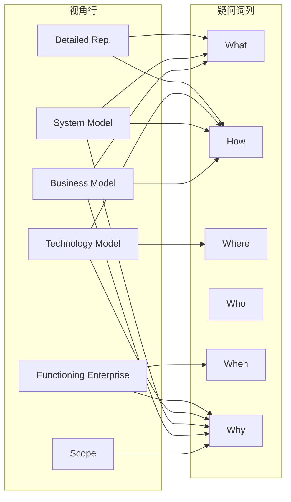
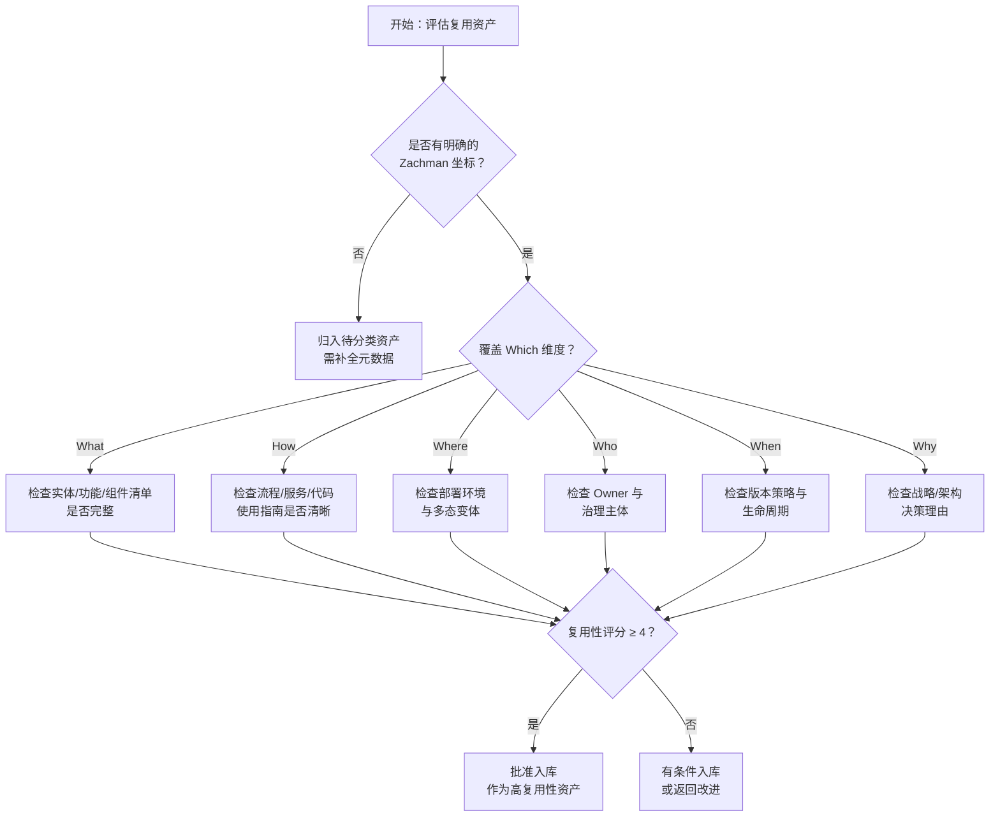
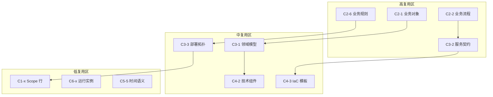

# Zachman Framework 与软件架构复用映射文档

**版本**: 2026-06-10
**定位**: 四层复用模型（业务→应用→组件→功能）的顶层本体论映射与治理框架
**对齐标准**: Zachman Framework (1987, 2020 扩展版) / GERAM (ISO 15704:2019 企业参考架构方法论) / ISO/IEC/IEEE 42010:2022
**状态**: ✅ 已完成
**维护团队**: 架构复用标准委员会

---

## 目录

- [Zachman Framework 与软件架构复用映射文档](#zachman-framework-与软件架构复用映射文档)
  - [目录](#目录)
  - [1. Zachman Framework 核心概念](#1-zachman-framework-核心概念)
    - [1.1 框架起源与本体论定位](#11-框架起源与本体论定位)
    - [1.2 六疑问词（列维度）： interrogative abstractions](#12-六疑问词列维度-interrogative-abstractions)
    - [1.3 六视角（行维度）： stakeholder perspectives](#13-六视角行维度-stakeholder-perspectives)
    - [1.4 36 Cell 矩阵详解](#14-36-cell-矩阵详解)
      - [第1行：Scope / Planner（规划者视角）](#第1行scope--planner规划者视角)
      - [第2行：Business Model / Owner（业务所有者视角）](#第2行business-model--owner业务所有者视角)
      - [第3行：System Model / Designer（系统设计师视角）](#第3行system-model--designer系统设计师视角)
      - [第4行：Technology Model / Builder（技术构建者视角）](#第4行technology-model--builder技术构建者视角)
      - [第5行：Detailed Representation / Subcontractor（分包商/实施者视角）](#第5行detailed-representation--subcontractor分包商实施者视角)
      - [第6行：Functioning Enterprise / User（用户/运行视角）](#第6行functioning-enterprise--user用户运行视角)
    - [1.5 Zachman 矩阵的关键原则与复用启示](#15-zachman-矩阵的关键原则与复用启示)
    - [1.6 六视角/六抽象层次定义与复用性评估矩阵总览](#16-六视角六抽象层次定义与复用性评估矩阵总览)
    - [六视角与四层复用映射](#六视角与四层复用映射)
    - [六抽象层次的复用含义](#六抽象层次的复用含义)
    - [复用性评估矩阵总览](#复用性评估矩阵总览)
    - [Zachman 复用坐标映射图](#zachman-复用坐标映射图)
  - [2. 复用视角的 Zachman 映射](#2-复用视角的-zachman-映射)
    - [2.1 映射总览](#21-映射总览)
    - [2.2 业务复用 → Why / What（Scope / Business Model 行）](#22-业务复用--why--whatscope--business-model-行)
    - [2.3 应用复用 → How（System Model 行）](#23-应用复用--howsystem-model-行)
    - [2.4 组件复用 → How / Where（Technology Model 行）](#24-组件复用--how--wheretechnology-model-行)
    - [2.5 功能复用 → How（Builder / Subcontractor 行）](#25-功能复用--howbuilder--subcontractor-行)
    - [2.6 四层复用映射的纵向一致性](#26-四层复用映射的纵向一致性)
  - [3. 六维疑问词 × 四层复用 交叉矩阵](#3-六维疑问词--四层复用-交叉矩阵)
    - [3.1 矩阵定义](#31-矩阵定义)
    - [3.2 交叉矩阵全表](#32-交叉矩阵全表)
    - [3.3 交叉矩阵的决策支持应用](#33-交叉矩阵的决策支持应用)
      - [3.3.1 What 列：复用资产发现与目录编制](#331-what-列复用资产发现与目录编制)
      - [3.3.2 How 列：复用资产组合与编排](#332-how-列复用资产组合与编排)
      - [3.3.3 Where 列：复用资产部署拓扑](#333-where-列复用资产部署拓扑)
      - [3.3.4 Who 列：复用资产的治理主体](#334-who-列复用资产的治理主体)
      - [3.3.5 When 列：复用资产生命周期时序](#335-when-列复用资产生命周期时序)
      - [3.3.6 Why 列：复用决策的动机与约束](#336-why-列复用决策的动机与约束)
  - [4. 与 GERAM / ISO 15704 的关联](#4-与-geram--iso-15704-的关联)
    - [4.1 GERAM 概述](#41-geram-概述)
    - [4.2 GERAM 核心构件与复用映射](#42-geram-核心构件与复用映射)
    - [4.3 ISO 15704:2019 的复用要求](#43-iso-157042019-的复用要求)
      - [要求 1：参考架构必须提供企业全生命周期的覆盖](#要求-1参考架构必须提供企业全生命周期的覆盖)
      - [要求 2：参考架构必须区分不同抽象层次](#要求-2参考架构必须区分不同抽象层次)
      - [要求 3：参考架构必须支持多视角描述](#要求-3参考架构必须支持多视角描述)
      - [要求 4：参考架构必须支持模型集成](#要求-4参考架构必须支持模型集成)
      - [要求 5：参考架构必须提供方法论指导](#要求-5参考架构必须提供方法论指导)
      - [要求 6：参考架构必须具备可扩展性](#要求-6参考架构必须具备可扩展性)
    - [4.4 Zachman-GERAM-四层复用 的三层元模型映射](#44-zachman-geram-四层复用-的三层元模型映射)
    - [4.5 ISO 15704:2019 对复用资产标准化的启示](#45-iso-157042019-对复用资产标准化的启示)
  - [5. Zachman 在复用治理中的应用](#5-zachman-在复用治理中的应用)
    - [5.1 复用盲区识别方法论](#51-复用盲区识别方法论)
      - [5.1.1 盲区识别流程](#511-盲区识别流程)
      - [5.1.2 典型盲区模式](#512-典型盲区模式)
    - [5.2 复用资产准入评审的 Zachman 检查清单](#52-复用资产准入评审的-zachman-检查清单)
      - [准入检查清单模板](#准入检查清单模板)
    - [5.3 复用治理的组织映射](#53-复用治理的组织映射)
    - [5.4 复用成熟度评估的 Zachman 维度](#54-复用成熟度评估的-zachman-维度)
  - [6. 案例：企业级复用资产目录规划](#6-案例企业级复用资产目录规划)
    - [6.1 案例背景：GlobalFin 金融科技集团](#61-案例背景globalfin-金融科技集团)
    - [6.2 复用资产目录的 Zachman 坐标规划](#62-复用资产目录的-zachman-坐标规划)
      - [6.2.1 业务复用层（Business Reuse）规划](#621-业务复用层business-reuse规划)
      - [6.2.2 应用复用层（Application Reuse）规划](#622-应用复用层application-reuse规划)
      - [6.2.3 组件复用层（Component Reuse）规划](#623-组件复用层component-reuse规划)
      - [6.2.4 功能复用层（Functional Reuse）规划](#624-功能复用层functional-reuse规划)
    - [6.3 复用盲区识别结果](#63-复用盲区识别结果)
    - [6.4 实施路线图](#64-实施路线图)
      - [第一阶段（0-6 个月）：基础覆盖](#第一阶段0-6-个月基础覆盖)
      - [第二阶段（6-12 个月）：横向扩展](#第二阶段6-12-个月横向扩展)
      - [第三阶段（12-18 个月）：度量优化](#第三阶段12-18-个月度量优化)
    - [6.5 案例启示](#65-案例启示)
  - [8. Zachman 复用性评估矩阵](#8-zachman-复用性评估矩阵)
    - [8.1 评估维度与量化模型](#81-评估维度与量化模型)
    - [8.2 六维度属性表](#82-六维度属性表)
    - [8.3 复用性评估决策树](#83-复用性评估决策树)
    - [8.4 行业案例：三大行业的 Zachman 复用坐标](#84-行业案例三大行业的-zachman-复用坐标)
      - [银行业（基于 BIAN）](#银行业基于-bian)
      - [电信业（基于 TM Forum）](#电信业基于-tm-forum)
      - [制造业](#制造业)
    - [8.5 复用性评估矩阵的行业应用扩展](#85-复用性评估矩阵的行业应用扩展)
      - [医疗健康业](#医疗健康业)
      - [零售与电商业](#零售与电商业)
      - [政府与公共服务业](#政府与公共服务业)
      - [行业复用性热力分区](#行业复用性热力分区)
  - [9. 反例与常见失败模式](#9-反例与常见失败模式)
    - [9.1 反例一：把 Zachman 当成方法论而非分类学](#91-反例一把-zachman-当成方法论而非分类学)
    - [9.2 反例二：跨抽象层次复用导致语义坍塌](#92-反例二跨抽象层次复用导致语义坍塌)
    - [9.3 反例三：为复用而复用——忽视 Why 维度](#93-反例三为复用而复用忽视-why-维度)
    - [9.4 反例四：忽视 Where 维度导致"开发可用、生产不可用"](#94-反例四忽视-where-维度导致开发可用生产不可用)
    - [9.5 反例五：忽视 Who 维度导致治理真空](#95-反例五忽视-who-维度导致治理真空)
  - [10. 与其他概念的关系](#10-与其他概念的关系)
    - [10.1 与四层复用模型的关系](#101-与四层复用模型的关系)
    - [10.2 与 GERAM / ISO 15704 的关系](#102-与-geram--iso-15704-的关系)
    - [10.3 与 TOGAF / ArchiMate 的关系](#103-与-togaf--archimate-的关系)
    - [10.4 与 BPMN / DMN 的关系](#104-与-bpmn--dmn-的关系)
  - [11. 权威来源与交叉引用](#11-权威来源与交叉引用)
    - [11.1 权威来源](#111-权威来源)
    - [11.2 交叉引用](#112-交叉引用)
  - [7. 权威来源与参考文献](#7-权威来源与参考文献)
    - [7.1 核心标准与框架来源](#71-核心标准与框架来源)
    - [7.2 企业架构与复用方法论来源](#72-企业架构与复用方法论来源)
    - [7.3 软件复用与架构来源](#73-软件复用与架构来源)
    - [7.4 领域驱动设计与组件化来源](#74-领域驱动设计与组件化来源)
    - [7.5 本文档引用说明](#75-本文档引用说明)

---

## 1. Zachman Framework 核心概念

### 1.1 框架起源与本体论定位

Zachman Framework 由 John A. Zachman 于 1987 年在 IBM Systems Journal 首次发表，是企业架构（Enterprise Architecture, EA）领域最具影响力和持久力的本体论框架之一。该框架的核心理念在于：**任何复杂系统（尤其是企业系统）的描述都可以通过对六个基本疑问词（What, How, Where, Who, When, Why）与六个利益相关者视角（Planner, Owner, Designer, Builder, Subcontractor, User）进行正交组合，形成 36 个互斥且穷尽的描述单元（cell）**。

与许多过程式或方法论导向的框架不同，Zachman Framework 本质上是一个**分类学（taxonomy）**，而非方法论。它不规定"如何"实施企业架构，而是回答"存在哪些架构描述维度"以及"谁需要看到什么信息"。这一本体论定位使其成为软件架构复用资产分类、目录编制与治理的理想元模型。

### 1.2 六疑问词（列维度）： interrogative abstractions

| 疑问词 | 英文全称 | 核心语义 | 对应架构描述焦点 |
|--------|----------|----------|------------------|
| What | Inventory | 事物清单与本体 | 数据实体、业务对象、系统组件清单 |
| How | Process | 功能与过程转换 | 业务流程、系统功能、技术实现过程 |
| Where | Network | 位置与分布拓扑 | 网络节点、部署位置、地理分布 |
| Who | People / Agent | 角色与组织单元 | 业务角色、系统用户、操作责任人 |
| When | Time | 时序与事件触发 | 业务周期、系统调度、事务时序 |
| Why | Motivation | 动机与约束规则 | 业务目标、合规要求、设计原则 |

每个疑问词列代表一类**不可约减的架构抽象**。在复用语境下，这些列对应着复用资产的六类元数据维度：复用"什么"、复用"如何"实现、复用资产部署"在哪里"、复用资产由"谁"消费/维护、复用"何时"发生、复用"为何"必要。

### 1.3 六视角（行维度）： stakeholder perspectives

| 视角层级 | 英文名称 | 利益相关者 | 抽象粒度 | 核心问题 |
|----------|----------|------------|----------|----------|
| 第1行 | Scope / Planner | 规划者/投资者 | 最粗粒度 | 企业的边界与范围是什么？ |
| 第2行 | Business Model / Owner | 业务所有者 | 业务概念 | 业务如何运作？ |
| 第3行 | System Model / Designer | 系统设计师 | 逻辑模型 | 系统如何支持业务？ |
| 第4行 | Technology Model / Builder | 技术构建者 | 物理设计 | 技术如何构建系统？ |
| 第5行 | Detailed Representation / Subcontractor | 分包商/实施者 | 详细规范 | 组件如何制造与集成？ |
| 第6行 | Functioning Enterprise / User | 最终用户 | 运行实例 | 实际运行中的企业是什么？ |

Zachman 强调每一行都是一种**投影（projection）**：同一企业实体在不同行中被不同利益相关者以不同抽象层次观察，但本质上描述的是同一现实。这一特性使得复用资产可以在不同抽象层之间进行**纵向追溯（vertical traceability）**。

### 1.4 36 Cell 矩阵详解

以下对每个 cell 的语义进行完整解析，并标注其在复用体系中的角色。

#### 第1行：Scope / Planner（规划者视角）

| Cell | 疑问词 | 语义描述 | 典型交付物 | 复用角色 |
|------|--------|----------|------------|----------|
| C1-1 | What | 企业关注的核心事物清单 | 业务术语表、高阶实体清单 | 复用范围定义 |
| C1-2 | How | 企业执行的顶层业务流程 | 价值链图、宏观流程 | 端到端流程模板 |
| C1-3 | Where | 企业的地理/网络边界 | 运营区域图、站点清单 | 部署范围基线 |
| C1-4 | Who | 最高层组织单元与角色 | 组织架构图、汇报线 | 组织复用模板 |
| C1-5 | When | 企业关键业务周期与里程碑 | 战略时间表、财年周期 | 时间框架模板 |
| C1-6 | Why | 企业使命、愿景与战略动机 | 商业模式画布、战略目标 | 战略意图复用基线 |

第1行在复用体系中的核心作用是**定义复用的边界与战略对齐**。所有复用资产必须与第1行的 Why（战略动机）保持可追溯性，否则复用将沦为无目的的技术堆砌。

#### 第2行：Business Model / Owner（业务所有者视角）

| Cell | 疑问词 | 语义描述 | 典型交付物 | 复用角色 |
|------|--------|----------|------------|----------|
| C2-1 | What | 业务实体及其关系 | 概念数据模型、业务对象图 | 业务对象模式 |
| C2-2 | How | 业务过程与工作流 | 业务流程图（BPMN）、用例 | 业务流程模板库 |
| C2-3 | Where | 业务位置与设施分布 | 办公地点图、渠道网络 | 渠道/网络拓扑模板 |
| C2-4 | Who | 业务角色、职责与技能 | RACI 矩阵、岗位说明书 | 角色定义模板 |
| C2-5 | When | 业务事件与状态转换 | 业务周期图、状态机 | 业务规则时序模板 |
| C2-6 | Why | 业务规则、政策与合规要求 | 业务规则目录、合规框架 | 合规规则资产库 |

第2行是**业务复用（Business Reuse）**的主战场。业务复用资产主要对应 C2-1（业务对象模式）、C2-2（业务流程模板）和 C2-6（业务规则/合规框架）。这些资产具有最高的跨项目复用价值，因为它们独立于技术实现，可以在不同技术栈中反复使用。

#### 第3行：System Model / Designer（系统设计师视角）

| Cell | 疑问词 | 语义描述 | 典型交付物 | 复用角色 |
|------|--------|----------|------------|----------|
| C3-1 | What | 逻辑数据模型与信息架构 | 逻辑 ER 图、类图、领域模型 | 领域驱动设计模式 |
| C3-2 | How | 系统功能与逻辑处理 | 系统用例、服务契约、API 规范 | 应用服务/微服务模板 |
| C3-3 | Where | 逻辑部署拓扑与网络分区 | 逻辑网络图、安全区划分 | 部署架构蓝图 |
| C3-4 | Who | 系统用户角色与权限模型 | 用户角色矩阵、权限模型 | 安全与权限模式 |
| C3-5 | When | 系统事件、批处理与调度逻辑 | 事件流图、调度表 | 事件驱动架构模式 |
| C3-6 | Why | 系统级约束、非功能需求 | NFR 规格书、架构决策记录 | 架构决策模板（ADRs） |

第3行是**应用复用（Application Reuse）**的核心层。C3-2（系统功能/服务契约）直接对应应用层可复用资产，如微服务模板、API 网关模式、服务编排规范。C3-1（逻辑数据模型）则支撑领域模型的跨系统复用，是领域驱动设计（DDD）战略层的基础。

#### 第4行：Technology Model / Builder（技术构建者视角）

| Cell | 疑问词 | 语义描述 | 典型交付物 | 复用角色 |
|------|--------|----------|------------|----------|
| C4-1 | What | 物理数据模型与存储结构 | 物理 Schema、数据字典 | 数据库设计模式 |
| C4-2 | How | 技术组件与实现算法 | 组件图、算法规范、代码框架 | 可复用组件/框架 |
| C4-3 | Where | 物理基础设施与部署节点 | 基础设施图、云资源拓扑 | IaC 模板（Terraform/Bicep） |
| C4-4 | Who | 技术角色与运维责任 | DevOps 责任矩阵、值班表 | 运维流程模板 |
| C4-5 | When | 系统作业调度与批处理时间窗 | Cron 规范、批处理窗口 | 调度编排模板 |
| C4-6 | Why | 技术约束、平台标准与选型理由 | 技术雷达、平台规范 | 技术选型决策库 |

第4行是**组件复用（Component Reuse）**的主要映射层。C4-2（技术组件）直接产出可复用软件组件、框架和中间件；C4-3（物理部署）对应基础设施即代码（IaC）模板；C4-1（物理数据模型）则对应数据库迁移脚本和 ORM 映射模式。

#### 第5行：Detailed Representation / Subcontractor（分包商/实施者视角）

| Cell | 疑问词 | 语义描述 | 典型交付物 | 复用角色 |
|------|--------|----------|------------|----------|
| C5-1 | What | 数据结构定义与序列化格式 | XSD、JSON Schema、Protobuf | 数据序列化模式 |
| C5-2 | How | 程序代码、模块与单元实现 | 源代码、函数库、SDK | 可复用函数/库/SDK |
| C5-3 | Where | 机器配置、节点规格与网络参数 | 配置文件、网络策略 | 配置模板与环境基线 |
| C5-4 | Who | 用户账号、证书与访问令牌 | IAM 策略、密钥管理规范 | 安全凭证模板 |
| C5-5 | When | 事务日志、时间戳与审计追踪 | 审计日志格式、TTL 策略 | 日志/审计模板 |
| C5-6 | Why | 代码注释、文档与决策依据 | 代码注释、设计模式文档 | 内联复用指南 |

第5行是**功能复用（Functional Reuse）**的最底层映射。C5-2（程序代码）对应函数库、SDK 和代码片段；C5-1（数据结构定义）对应跨语言共享的数据契约；C5-3（机器配置）对应容器镜像和环境配置模板。

#### 第6行：Functioning Enterprise / User（用户/运行视角）

| Cell | 疑问词 | 语义描述 | 典型交付物 | 复用角色 |
|------|--------|----------|------------|----------|
| C6-1 | What | 运行时的业务数据实例 | 生产数据集、主数据记录 | 测试数据生成模板 |
| C6-2 | How | 实际运行的业务流程实例 | 工作流实例、订单生命周期 | 业务流程监控模板 |
| C6-3 | Where | 实际网络流量与节点状态 | 网络拓扑监控、CDN 日志 | 可观测性配置模板 |
| C6-4 | Who | 实际操作用户与行为数据 | 用户画像、行为日志 | 用户分析模型 |
| C6-5 | When | 实际业务发生的时间序列 | 事件时间线、SLA 达成记录 | SLA 监控基线 |
| C6-6 | Why | 实际决策结果与业务成效 | KPI 仪表盘、ROI 报告 | 复用成效度量模板 |

第6行在复用体系中具有特殊地位：它描述的是**复用资产的实际运行成效**。C6-6（业务成效/ROI）直接对应复用治理中的价值量化维度——通过追踪复用资产在生产环境的表现，评估其对业务目标的实际贡献。

### 1.5 Zachman 矩阵的关键原则与复用启示

1. **完整性原则（Completeness）**：36 个 cell 构成一个完整集合，任何企业架构描述都可以映射到其中至少一个 cell。在复用治理中，这意味着**每个复用资产都应当具有明确的 Zachman 坐标**，从而避免资产归属模糊。

2. **正交性原则（Orthogonality）**：行与列相互独立，改变某一行的描述不应影响其他行的内部一致性。复用启示：同一业务对象模式（C2-1）可以映射到多种技术实现（C4-1/C5-1），实现业务与技术的解耦复用。

3. **非冗余原则（No Redundancy）**：每个 cell 描述的是独特的抽象，不同 cell 之间不应存在语义重复。复用启示：复用资产目录必须消除跨 cell 的重复资产，例如不应同时在 C3-2 和 C4-2 中维护两套独立但语义重叠的服务定义。

4. **递归性原则（Recursion）**：Zachman 框架可以递归应用于企业的任何子系统。复用启示：大型复用资产（如企业级领域模型）可以在子系统级别再次应用 Zachman 进行细分，形成**分形复用目录结构**。

---


### 1.6 六视角/六抽象层次定义与复用性评估矩阵总览

**定义**：[Zachman Framework](https://en.wikipedia.org/wiki/Zachman_Framework) 将企业架构描述抽象为一个由 **6 个利益相关者视角（行）** 与 **6 个基本疑问词（列）** 构成的 6×6 矩阵。每一行代表一种抽象层次（从企业边界到运行实例），每一列代表一种不可约减的描述维度（What、How、Where、Who、When、Why）。在软件架构复用语境下，Zachman 矩阵既是复用资产的分类坐标系，也是评估资产可复用性的结构化框架。

### 六视角与四层复用映射

| 视角（行） | 英文名称 | 抽象层次 | 主要复用层 | 核心复用问题 |
|---|---|---|---|---|
| Scope / Planner | Planner | 企业边界 | 业务复用（战略层） | 复用支持什么战略目标？（Why at Scope） |
| Business Model / Owner | Owner | 业务概念 | 业务复用 | 复用什么业务能力/对象/流程？（What / How at Business） |
| System Model / Designer | Designer | 逻辑模型 | 应用复用 | 系统如何支撑复用资产？（How at System） |
| Technology Model / Builder | Builder | 物理设计 | 组件复用 | 技术在何处、如何实现复用？（How / Where at Technology） |
| Detailed Representation / Subcontractor | Subcontractor | 详细规范 | 功能复用 | 代码与配置如何被复用？（How at Subcontractor） |
| Functioning Enterprise / User | User | 运行实例 | 运行反馈/度量 | 复用产生了哪些可度量的业务成效？（Why at User） |

### 六抽象层次的复用含义

1. **Scope / Planner（规划者视角）**：描述企业的边界、范围和战略意图。该层的复用资产主要是**战略意图模板、商业模式画布、宏观价值链**，为下层复用提供方向约束。
2. **Business Model / Owner（业务所有者视角）**：描述业务概念、业务对象、业务流程和业务规则。该层是**业务复用的主战场**，资产包括业务对象模式、流程模板、规则库。
3. **System Model / Designer（系统设计师视角）**：描述逻辑数据模型、服务契约、逻辑部署和事件驱动模式。该层支撑**应用复用**，核心资产是领域模型、API 规范、架构决策记录。
4. **Technology Model / Builder（技术构建者视角）**：描述物理数据模型、技术组件、基础设施和运维流程。该层支撑**组件复用**，资产包括组件库、IaC 模板、技术栈规范。
5. **Detailed Representation / Subcontractor（分包商/实施者视角）**：描述数据结构、源代码、配置和安全策略。该层支撑**功能复用**，资产包括函数库、Schema、环境配置。
6. **Functioning Enterprise / User（用户/运行视角）**：描述运行时的业务实例、流程实例和成效度量。该层提供**复用价值的反馈闭环**，资产包括 SLA 基线、ROI 报告和可观测性模板。

### 复用性评估矩阵总览

下表给出 36 cell 中典型复用资产的复用性等级（高 / 中 / 低），用于指导复用投资优先级。

| 行 \ 列 | What | How | Where | Who | When | Why |
|---|---|---|---|---|---|---|
| **Scope** | 低 | 低 | 低 | 低 | 低 | 中 |
| **Business Model** | 高 | 高 | 中 | 中 | 中 | 高 |
| **System Model** | 高 | 高 | 中 | 中 | 中 | 中 |
| **Technology Model** | 中 | 中 | 中 | 中 | 中 | 中 |
| **Detailed Rep.** | 中 | 中 | 低 | 低 | 低 | 低 |
| **Functioning Enterprise** | 低 | 低 | 低 | 低 | 低 | 中 |

> **解释**：Business Model 与 System Model 行的 What / How / Why 列抽象程度高、变更频率低，是高复用区；Scope 行过于抽象、Functioning Enterprise 行过于具体，通常直接复用价值低，但可作为度量和反馈来源。

### Zachman 复用坐标映射图



该图表明：不同视角行在复用治理中关注的疑问词列不同，高价值复用资产通常同时覆盖多个列维度，并形成纵向穿透链。

## 2. 复用视角的 Zachman 映射

### 2.1 映射总览

本项目提出的四层复用模型（业务→应用→组件→功能）并非与 Zachman 行一一对应，而是以**跨行的方式**嵌入 Zachman 矩阵。这种嵌入遵循"高层复用映射到高层行、低层复用映射到低层行"的基本原则，同时认识到复用资产往往**纵向穿透**多个行（例如一个业务对象模式从 C2-1 贯穿到 C5-1）。

```
四层复用模型 → Zachman 行映射关系

业务复用 ───────────→ Scope (Row 1) + Business Model (Row 2)
                      主要回答: Why / What

应用复用 ───────────→ System Model (Row 3)
                      主要回答: How

组件复用 ───────────→ Technology Model (Row 4)
                      主要回答: How / Where

功能复用 ───────────→ Builder (Row 4) + Subcontractor (Row 5)
                      主要回答: How
```

### 2.2 业务复用 → Why / What（Scope / Business Model 行）

**映射原理**：业务复用关注的是跨组织、跨系统的业务能力共享，其本质是对企业"做什么"（What）和"为什么做"（Why）的抽象。在 Zachman 矩阵中，这些内容集中在第1行（Scope）和第2行（Business Model）。

| 复用资产类别 | 对应 Zachman Cell | 资产示例 | 复用场景 |
|--------------|-------------------|----------|----------|
| 业务能力模型 | C1-6 (Why, Scope) | 企业战略地图、价值主张画布 | 新业务单元快速对齐战略 |
| 业务对象模式 | C2-1 (What, Business) | 客户、订单、产品概念模型 | 跨系统统一业务语言 |
| 业务流程模板 | C2-2 (How, Business) | 订单履约流程、客户准入流程 | 业务线间流程标准化 |
| 业务网络拓扑 | C2-3 (Where, Business) | 渠道布局模型、供应链网络 | 跨国/跨区域业务复制 |
| 组织角色模板 | C2-4 (Who, Business) | 岗位能力模型、RACI 模板 | 组织变革快速部署 |
| 业务规则库 | C2-6 (Why, Business) | 合规检查规则、风控策略 | 监管变化快速响应 |

**关键映射规则**：

- 业务复用资产应当优先从 C2-6（业务规则/动机）向下追溯到 C2-1（业务对象），确保任何可复用的业务对象都有明确的业务规则支撑。
- C1-6（战略 Why）是所有业务复用资产的"根"，每个业务复用资产必须能够回答"它支持哪项战略目标"。
- 业务复用资产的消费者主要是 Row 2（Business Owner），因此资产描述语言必须是业务术语，避免技术 jargon。

**纵向穿透示例**：一个"客户主数据"业务复用资产，其 Zachman 穿透路径为：

```
C1-1 (客户是关注实体) → C2-1 (客户业务对象定义)
  → C3-1 (客户逻辑数据模型) → C4-1 (客户物理表结构)
  → C5-1 (客户 JSON Schema) → C6-1 (运行时客户实例)
```

### 2.3 应用复用 → How（System Model 行）

**映射原理**：应用复用关注的是系统功能与服务的跨应用共享，其核心问题是"系统如何支持业务"（How at System Level）。这恰好对应 Zachman 第3行（System Model / Designer）的 How 列（C3-2），以及与之紧密相关的 What（C3-1）和 Why（C3-6）。

| 复用资产类别 | 对应 Zachman Cell | 资产示例 | 复用场景 |
|--------------|-------------------|----------|----------|
| 领域模型 | C3-1 (What, System) | 限界上下文图、聚合根定义 | 微服务划分与共享内核 |
| 应用服务契约 | C3-2 (How, System) | OpenAPI 规范、GraphQL Schema | 跨团队 API 复用 |
| 逻辑部署模式 | C3-3 (Where, System) | 安全区划分、逻辑网络拓扑 | 多环境部署标准化 |
| 权限与访问模型 | C3-4 (Who, System) | RBAC/ABAC 模型、IAM 策略 | 统一身份治理 |
| 事件驱动模式 | C3-5 (When, System) | 领域事件定义、事件总线契约 | 异步集成标准化 |
| 架构决策记录 | C3-6 (Why, System) | ADR-001 微服务拆分原则 | 架构一致性治理 |

**关键映射规则**：

- 应用复用资产的中心是 C3-2（系统功能/服务契约），所有其他列（C3-1, C3-3~6）都是对该服务契约的支撑或约束。
- C3-6（架构决策 Why）是应用复用的治理锚点：每个可复用服务必须附带架构决策记录，说明其设计约束和适用上下文，防止不当复用。
- 应用复用资产应当保持与第2行（Business Model）的向上追溯：C3-2 的每个服务契约必须能够映射到 C2-2 的业务流程步骤。

**服务契约复用的 Zachman 完整描述**：
一个可复用的"支付服务"应用资产，其在 Zachman 矩阵中的完整描述需要以下 cell 的协同：

- C2-2：支付在业务流程中的位置（业务 How）
- C3-1：支付相关的领域概念（系统 What）
- C3-2：支付服务接口定义（系统 How）
- C3-3：支付服务的逻辑部署约束（系统 Where）
- C3-4：支付服务的调用方身份模型（系统 Who）
- C3-5：支付服务的事务时序要求（系统 When）
- C3-6：支付服务采用异步设计的决策理由（系统 Why）

### 2.4 组件复用 → How / Where（Technology Model 行）

**映射原理**：组件复用关注的是技术组件（如 UI 组件、算法组件、中间件插件）的跨系统复用。这些资产位于 Zachman 第4行（Technology Model / Builder），同时强烈涉及 Where（部署位置）维度，因为技术组件的可复用性高度依赖于其运行环境约束。

| 复用资产类别 | 对应 Zachman Cell | 资产示例 | 复用场景 |
|--------------|-------------------|----------|----------|
| 技术组件库 | C4-2 (How, Technology) | React 组件库、日志采集 SDK | 前端/后端组件共享 |
| 基础设施模板 | C4-3 (Where, Technology) | Terraform 模块、K8s Helm Chart | 环境一键复制 |
| 数据访问模式 | C4-1 (What, Technology) | 读写分离模式、分库分表策略 | 数据库架构标准化 |
| 运维自动化脚本 | C4-4 (Who, Technology) | CI/CD Pipeline、发布编排 | DevOps 流程标准化 |
| 批处理调度模板 | C4-5 (When, Technology) | Airflow DAG 模板、定时任务框架 | 数据管道复用 |
| 技术栈规范 | C4-6 (Why, Technology) | 技术选型雷达、平台约束清单 | 技术债务预防 |

**关键映射规则**：

- 组件复用资产的"上下文边界"由 C4-3（Where）和 C4-6（Why）共同定义。一个技术组件只能在特定的部署拓扑和技术约束下被复用，因此其复用元数据必须包含完整的 C4-3/C4-6 描述。
- C4-2（技术 How）与 C3-2（系统 How）之间存在严格的抽象层次差异：C3-2 描述的是"系统做什么"（逻辑功能），C4-2 描述的是"技术如何实现"（物理组件）。混淆这两个层次是组件复用失败的常见原因。
- 组件复用资产必须具备 C4-3（部署 Where）的多态性：同一组件应当提供针对不同部署环境（云/边缘/本地）的变体。

**基础设施模板的复用 Zachman 描述**：
一个可复用的"容器化 Web 应用部署模板"：

- C3-3：逻辑部署需求（需要负载均衡、自动扩展）
- C4-2：技术组件清单（K8s Deployment、Service、Ingress）
- C4-3：基础设施拓扑（AKS 集群、VNet、NSG 规则）
- C4-5：调度参数（HPA 阈值、滚动更新策略）
- C4-6：技术约束（必须使用 Azure CNI、禁止特权容器）

### 2.5 功能复用 → How（Builder / Subcontractor 行）

**映射原理**：功能复用是最细粒度的复用形式，包括代码函数、算法实现、配置片段等。这些资产跨越 Zachman 第4行（Builder）和第5行（Subcontractor），以第5行为主，因为第5行代表了最详细的实现规格。

| 复用资产类别 | 对应 Zachman Cell | 资产示例 | 复用场景 |
|--------------|-------------------|----------|----------|
| 算法/函数库 | C5-2 (How, Subcontractor) | 排序算法、加密函数、数学库 | 代码级复用 |
| 数据结构契约 | C5-1 (What, Subcontractor) | DTO 定义、消息格式、API 模型 | 跨语言数据交换 |
| 环境配置模板 | C5-3 (Where, Subcontractor) | env 文件、YAML 配置、Feature Flag | 环境一致性保障 |
| 安全策略配置 | C5-4 (Who, Subcontractor) | OAuth Scope、JWT Claim 模板 | 安全策略复用 |
| 日志/追踪模板 | C5-5 (When, Subcontractor) | 结构化日志格式、Span 属性规范 | 可观测性标准化 |
| 代码注释规范 | C5-6 (Why, Subcontractor) | 设计模式说明、复用指引注释 | 知识传递 |

**关键映射规则**：

- 功能复用资产以 C5-2（代码实现）为核心，但其可复用性严重依赖于 C5-1（数据契约）和 C5-3（环境配置）的兼容性。
- C5-6（Why）在功能复用中往往被忽视，但实际上至关重要：每个可复用函数应当在其文档/注释中说明"为什么这样实现"（设计决策），以便复用者判断是否满足其上下文需求。
- 功能复用资产需要严格的 C5-5（When）约束：时间相关的代码（如超时逻辑、重试策略）在不同业务场景下的适用性差异极大，必须明确标注时间语义。

**代码函数复用的 Zachman 元数据示例**：
一个可复用的"带指数退避的重试函数"：

- C5-2：函数签名、实现代码、单元测试
- C5-1：输入参数结构（最大重试次数、基础延迟、最大延迟）
- C5-3：适用的运行时环境（Node.js 18+、支持 async/await）
- C5-5：时间语义（退避公式、Jitter 策略、超时传播规则）
- C5-6：设计决策（为何选择指数退避而非线性退避、适用场景说明）

### 2.6 四层复用映射的纵向一致性

四层复用模型在 Zachman 矩阵中的纵向一致性可以通过以下"复用穿透链"来验证：

```
业务复用 (Why/What)
  └─ C2-6: 业务规则"订单金额超过 10 万需风控审批"
      └─ C2-2: 业务流程"风控审批流程"
          └─ C3-2: 应用服务"风控检查服务接口"
              └─ C4-2: 技术组件"风控规则引擎组件"
                  └─ C5-2: 功能代码"规则匹配函数 evaluateRisk()"
                      └─ C6-2: 运行时实例"订单 #20250610001 的风控审批记录"
```

这条穿透链展示了复用资产如何在不同抽象层之间保持语义一致性。复用治理的核心任务之一就是维护这种纵向追溯能力，确保当业务规则（C2-6）发生变化时，能够自动识别所有下游受影响的复用资产（C3-2、C4-2、C5-2）。

---

## 3. 六维疑问词 × 四层复用 交叉矩阵

### 3.1 矩阵定义

以下交叉矩阵展示了 Zachman 的六疑问词列如何映射到四层复用模型的不同决策维度。每个 cell 描述的是：在特定复用层，针对特定疑问词，复用治理需要回答的核心问题。

### 3.2 交叉矩阵全表

| 疑问词 | 业务复用 (Business) | 应用复用 (Application) | 组件复用 (Component) | 功能复用 (Functional) |
|--------|---------------------|------------------------|----------------------|-----------------------|
| **What (Inventory)** | 复用哪些业务能力/对象？<br>→ 业务能力地图、业务对象目录 | 复用哪些领域模型/服务？<br>→ 领域模型库、服务目录 | 复用哪些技术组件/模板？<br>→ 组件仓库、IaC 模块库 | 复用哪些函数/数据结构？<br>→ 代码片段库、Schema 注册表 |
| **How (Process)** | 如何在业务层面组合复用资产？<br>→ 业务流程编排模板 | 如何在应用层面调用复用服务？<br>→ API 组合模式、BFF 模板 | 如何在技术层面集成组件？<br>→ 集成模式（适配器、外观） | 如何在代码层面调用函数？<br>→ 调用示例、Wrapper 代码 |
| **Where (Network)** | 业务能力部署在哪些区域？<br>→ 区域化业务部署策略 | 应用服务部署在哪些环境？<br>→ 多环境部署蓝图 | 组件运行在哪些节点？<br>→ 容器编排模板、边缘部署包 | 代码运行在哪些运行时？<br>→ 运行时兼容性矩阵 |
| **Who (People)** | 谁负责业务能力维护？<br>→ 业务能力 owner 制度 | 谁负责应用服务治理？<br>→ 服务 owner、API 治理委员会 | 谁负责组件版本管理？<br>→ 组件维护者、SIG 小组 | 谁负责代码质量？<br>→ 代码审查者、模块维护者 |
| **When (Time)** | 业务能力何时需要更新？<br>→ 业务周期驱动的版本规划 | 应用服务何时发布新版本？<br>→ 语义化版本策略、发布窗口 | 组件何时需要升级？<br>→ 依赖更新策略、安全补丁周期 | 代码何时过期？<br>→ 弃用策略、生命周期管理 |
| **Why (Motivation)** | 为何需要复用该业务能力？<br>→ 战略对齐检查表 | 为何选择该服务设计？<br>→ 架构决策记录 (ADR) | 为何使用该组件？<br>→ 技术选型决策、替代方案分析 | 为何采用该实现？<br>→ 设计模式说明、性能基准 |

### 3.3 交叉矩阵的决策支持应用

#### 3.3.1 What 列：复用资产发现与目录编制

在 What 维度上，四层复用模型形成了一个**从抽象到具体的资产分类体系**：

- **业务复用 What**：关注"业务能力"和"业务对象"等高阶概念。这些资产的发现方法包括业务能力映射（Business Capability Mapping）和领域分析（Domain Analysis）。
- **应用复用 What**：关注"领域模型"和"服务契约"等逻辑资产。发现方法包括 API 目录挖掘、服务依赖图分析。
- **组件复用 What**：关注"技术组件"和"基础设施模块"等物理资产。发现方法包括代码仓库分析、包管理器元数据抓取。
- **功能复用 What**：关注"代码函数"和"数据结构定义"等实现级资产。发现方法包括代码克隆检测（Clone Detection）、抽象语法树（AST）分析。

**治理决策**：在编制复用资产目录时，必须同时为每个资产标注其在四层 What 中的坐标。例如，一个"用户认证"资产：

- 业务 What：身份验证（Identity Verification）业务能力
- 应用 What：AuthService 领域服务
- 组件 What：Spring Security 配置模板 + JWT 解析组件
- 功能 What：`verifyToken()` 函数 + `Claims` DTO

#### 3.3.2 How 列：复用资产组合与编排

How 维度回答的是"如何使用复用资产"。四层 How 之间存在严格的**组合层次关系**：

```
业务 How (流程编排)
  └─ 调用 ─→ 应用 How (服务调用)
      └─ 调用 ─→ 组件 How (组件集成)
          └─ 调用 ─→ 功能 How (函数调用)
```

每一层的 How 都对下一层提出接口契约要求，而下一层的 How 实现必须满足上一层的契约。这种层次组合关系是复用架构治理的核心约束。

**反模式警示**：如果业务 How 直接调用功能 How（即业务流程直接调用底层代码函数），则破坏了复用层次结构，导致：

- 业务层与技术层紧耦合
- 功能变更时业务层无法隔离影响
- 复用资产的可替换性丧失

#### 3.3.3 Where 列：复用资产部署拓扑

Where 维度在复用决策中往往被低估，但实际上是决定复用成败的关键因素。

| 复用层 | Where 决策焦点 | 典型约束 | 复用影响 |
|--------|---------------|----------|----------|
| 业务 | 区域/法律管辖 | GDPR、数据主权、跨境合规 | 同一业务能力在不同区域可能需要不同实现 |
| 应用 | 环境/集群 | 多租户隔离、网络策略 | 服务复用必须考虑部署环境的网络拓扑兼容性 |
| 组件 | 节点/容器 | 资源限制、运行时版本 | 组件必须声明其资源需求和运行时依赖 |
| 功能 | 运行时/进程 | 语言版本、库依赖 | 函数复用受限于目标运行时的兼容性 |

**多态部署原则**：高价值复用资产应当提供多个 Where 变体。例如，同一业务对象模式应当同时提供：

- 公有云部署变体（C4-3：AKS/EKS/GKE）
- 私有云部署变体（C4-3：OpenShift/VMware）
- 边缘部署变体（C4-3：IoT Edge/K3s）

#### 3.3.4 Who 列：复用资产的治理主体

复用资产的可持续性高度依赖于明确的**治理主体（Who）**。四层 Who 模型如下：

```
业务 Owner（业务线负责人）
  └─ 委托 ─→ 应用 Owner（产品/系统负责人）
      └─ 委托 ─→ 组件 Owner（技术领域负责人）
          └─ 委托 ─→ 功能 Owner（模块开发者）
```

每一层 Owner 对其上层承担 SLA 责任，对其下层行使质量标准要求权。

**关键治理机制**：

- **业务能力 Owner**：负责业务复用资产的 ROI 评估和战略对齐审查，周期为季度。
- **应用服务 Owner**：负责应用复用资产的版本规划、兼容性保证和 deprecation 管理，周期为迭代。
- **组件维护者**：负责组件复用资产的技术债务管理、安全更新和文档维护，周期为周。
- **代码模块维护者**：负责功能复用资产的代码质量、测试覆盖率和性能基准维护，周期为日。

#### 3.3.5 When 列：复用资产生命周期时序

When 维度管理复用资产的**时间语义**：创建时间、有效时间、过期时间、更新时间。

| 时间概念 | 业务复用 | 应用复用 | 组件复用 | 功能复用 |
|----------|----------|----------|----------|----------|
| 创建时间 | 业务战略发布周期 | 产品路线图节点 | Sprint 发布日期 | 代码提交时间 |
| 有效时间 | 业务周期/财年起止 | 版本支持窗口 | 依赖兼容性窗口 | 运行时兼容性窗口 |
| 过期时间 | 业务能力退役计划 | API 弃用时间表 | 组件 EOL 公告 | 函数弃用警告 |
| 更新时间 | 战略调整触发 | 需求变更触发 | 安全漏洞触发 | Bug 修复触发 |

**时序一致性约束**：下层资产的 When 必须嵌套在上层资产的 When 之内。例如，如果一个业务复用资产（C2-2）计划在下个财年退役，那么所有依赖它的应用复用资产（C3-2）必须在业务资产退役之前完成迁移。

#### 3.3.6 Why 列：复用决策的动机与约束

Why 维度是复用治理的**决策锚点**。每个复用资产的引入、更新或退役都必须有明确的 Why 记录。

**Why 的层次结构**：

- **战略 Why（C1-6 / C2-6）**：复用该资产如何支持企业战略目标？例如，"统一支付服务复用以支持全球业务扩张战略"。
- **架构 Why（C3-6）**：复用该服务的设计决策理由是什么？例如，"采用事件驱动模式以支持高并发订单处理（ADR-042）"。
- **技术 Why（C4-6）**：选择该技术组件而非其他替代方案的理由是什么？例如，"选用 Redis 而非 Memcached 以支持持久化会话（技术雷达 2026-Q2）"。
- **实现 Why（C5-6）**：采用该实现方式的理由是什么？例如，"使用快速排序而非归并排序因为在目标数据规模下平均性能更优（基准测试报告 #1287）"。

**Why 的治理作用**：在复用资产目录中，Why 字段是防止"为复用而复用"（reuse for reuse's sake）的关键机制。每个资产在入库时必须提供至少一个战略 Why 和一个架构 Why。

---

## 4. 与 GERAM / ISO 15704 的关联

### 4.1 GERAM 概述

GERAM（Generalized Enterprise Reference Architecture and Methodology，通用企业参考架构和方法论）是由 IFIP-IFAC 任务组提出的企业工程元框架，后被 ISO 15704:2019《企业集成——企业参考架构方法论需求》采纳为国际标准。

GERAM 的核心目标是为企业架构方法论提供一个**元级框架（meta-framework）**，使得不同的企业架构框架（如 Zachman、TOGAF、ARIS、DoDAF）可以在统一的元模型下进行比较、映射和集成。

### 4.2 GERAM 核心构件与复用映射

GERAM 定义了以下核心构件，每个都与软件架构复用存在直接关联：

| GERAM 构件 | 定义 | 与四层复用的关联 | Zachman 映射 |
|------------|------|------------------|--------------|
| **GERA** (Generalized Enterprise Reference Architecture) | 通用企业参考架构，定义企业工程的概念 | 四层复用模型的元元模型 | 对应 Zachman 框架本身（元分类学） |
| **GEEM** (Enterprise Engineering Methodologies) | 企业工程方法论，指导如何实施企业架构 | 复用资产的开发、部署和维护方法论 | 对应 Zachman 行 3-5 的方法论层 |
| **GEMC** (Enterprise Modeling Languages) | 企业建模语言，提供描述企业的符号系统 | 复用资产的描述语言和元数据标准 | 对应各 cell 的交付物格式 |
| **GEOnt** (Enterprise Ontology) | 企业本体，定义企业领域的核心概念 | 复用资产的语义基础 | 对应 C1-1 / C2-1（What 列） |
| **EM** (Enterprise Models) | 企业模型，描述特定企业的架构 | 复用资产的实例化产物 | 对应全部 36 cell 的实例 |
| **EET** (Enterprise Engineering Tools) | 企业工程工具，支持建模和分析 | 复用资产的存储、检索和组合工具 | 对应复用平台/门户 |

### 4.3 ISO 15704:2019 的复用要求

ISO 15704:2019 规定了企业参考架构方法论（ERM）必须满足的六项基本要求。以下展示这些要求如何与复用治理对应：

#### 要求 1：参考架构必须提供企业全生命周期的覆盖

> *"The reference architecture shall cover the whole life-cycle of an enterprise from inception to retirement."*

**复用映射**：四层复用模型必须覆盖复用资产的全生命周期：概念（Business）→ 设计（Application）→ 构建（Component）→ 实现（Functional）→ 运行（User）→ 退役（Governance）。Zachman 的六行恰好提供了这一全生命周期视图。

#### 要求 2：参考架构必须区分不同抽象层次

> *"The reference architecture shall distinguish between different levels of abstraction."*

**复用映射**：四层复用模型本身就是一种抽象层次划分，且每一层在 Zachman 矩阵中跨越多个行。GERAM 要求这种层次划分必须显式且不可混淆——这与 Zachman 的正交性原则一致。

#### 要求 3：参考架构必须支持多视角描述

> *"The reference architecture shall support multiple views of the enterprise for different stakeholders."*

**复用映射**：Zachman 的六行就是六种利益相关者视角。在复用治理中，同一复用资产必须提供多视角描述：业务视角（Owner 看得懂）、设计视角（Designer 能使用）、构建视角（Builder 能部署）。

#### 要求 4：参考架构必须支持模型集成

> *"The reference architecture shall support the integration of models across different domains and levels."*

**复用映射**：这是复用的核心挑战——如何将不同抽象层、不同领域的复用资产组合为一致的整体。Zachman 的纵向穿透链（如第 2.6 节所示）提供了一种模型集成路径。GERAM 进一步要求这种集成必须有明确的语义映射规则，而不仅仅是命名约定。

#### 要求 5：参考架构必须提供方法论指导

> *"The reference architecture shall provide guidance for the development and use of enterprise models."*

**复用映射**：四层复用模型需要配套的方法论来说明：如何发现复用机会、如何提取复用资产、如何评估复用价值、如何管理复用版本。这些方法论对应 GERAM 的 GEEM 构件。

#### 要求 6：参考架构必须具备可扩展性

> *"The reference architecture shall be extensible to accommodate specific enterprise needs."*

**复用映射**：复用资产目录必须是可扩展的——能够容纳新的资产类型、新的描述维度和新的组合模式。Zachman 的递归性原则（框架可以递归应用于子系统）为此提供了扩展机制。

### 4.4 Zachman-GERAM-四层复用 的三层元模型映射

以下展示了三个框架之间的元级映射关系：

```
元-元层 (Meta-Meta Level)
├── GERAM GERA: 企业工程的通用概念框架
│   └── 定义了"什么是企业架构"、"架构描述需要哪些维度"
│
元层 (Meta Level)
├── Zachman Framework: 企业架构的分类学
│   └── 将 GERA 的概念实例化为 6×6 矩阵
│   └── 四层复用模型: 将复用概念映射到 Zachman 矩阵
│
实例层 (Instance Level)
├── 具体企业的复用资产目录
│   └── 每个资产在 Zachman 矩阵中有明确坐标
│   └── 每个资产遵循 GERAM 的生命周期和方法论要求
```

在这个三层结构中：

- **GERAM** 回答"为什么需要复用分类"（本体论基础）
- **Zachman** 回答"复用资产如何分类"（分类学框架）
- **四层复用模型** 回答"在软件架构领域具体复用什么"（领域实例化）

### 4.5 ISO 15704:2019 对复用资产标准化的启示

ISO 15704:2019 的附录中强调了**模型互操作性**的重要性。在复用语境下，这意味着：

1. **语义互操作**：不同复用层的资产必须使用统一的语义模型。例如，C2-1 中的"客户"业务对象必须与 C3-1 中的 Customer 领域类、C4-1 中的 customer 表、C5-1 中的 Customer DTO 保持语义一致性。GERAM 的 GEOnt（企业本体）为此提供了语义锚点。

2. **语法互操作**：复用资产的描述格式必须标准化。GERAM 的 GEMC（建模语言）要求定义统一的资产描述语法。在本项目中，这体现为复用资产的元数据规范（参见 `./struct/01-meta-model-standards/`）。

3. **过程互操作**：复用资产的开发、维护和退役过程必须标准化。GERAM 的 GEEM（方法论）要求定义统一的过程模型。在本项目中，这体现为复用资产生命周期管理流程（参见 `./struct/06-cross-layer-governance/`）。

---

## 5. Zachman 在复用治理中的应用

### 5.1 复用盲区识别方法论

Zachman 矩阵的最直接治理应用是**复用盲区识别（Reuse Blind Spot Detection）**。其核心思想是：在 36 cell 矩阵中，标记已经存在复用资产的 cell 和尚未覆盖的 cell，未覆盖的 cell 即为潜在的复用盲区。

#### 5.1.1 盲区识别流程

**步骤 1：资产盘点（Inventory）**
遍历复用资产目录，为每个资产标注其主坐标 cell（Primary Cell）和次要坐标 cell（Secondary Cells）。例如：

- 一个微服务模板：主坐标 C4-2，次要坐标 C3-2（上游逻辑设计）、C5-2（下游代码实现）。
- 一个业务流程模板：主坐标 C2-2，次要坐标 C1-2（上游战略规划）、C3-2（下游系统支撑）。

**步骤 2：热力图绘制（Heatmap）**
将 36 cell 矩阵可视化为热力图，颜色深浅表示该 cell 中复用资产的数量和成熟度。

**步骤 3：盲区分析（Gap Analysis）**
识别以下类型的盲区：

- **空 cell**：完全没有复用资产的 cell。
- **薄弱 cell**：资产数量少、成熟度低、缺乏维护的 cell。
- **孤岛 cell**：有资产但与其他 cell 缺乏纵向/横向追溯的 cell。

**步骤 4：优先级排序（Prioritization）**
根据业务价值和实施难度为盲区排序。高价值低难度的盲区优先填补。

#### 5.1.2 典型盲区模式

基于多个企业级复用项目的经验，以下是常见的复用盲区模式：

| 盲区模式 | 典型位置 | 成因 | 风险 | 治理对策 |
|----------|----------|------|------|----------|
| **战略-执行断层** | C1-6 (Why, Scope) 与 C2-6 (Why, Business) 之间缺乏追溯 | 战略层与业务层由不同团队负责，缺乏协同机制 | 复用资产与战略目标脱节，投资浪费 | 建立从 C1-6 到 C2-6 的战略分解机制 |
| **业务-系统鸿沟** | C2-2 (How, Business) 与 C3-2 (How, System) 映射不完整 | 业务分析师与系统架构师使用不同语言和工具 | 系统实现偏离业务需求，复用资产无法支撑真实业务 | 引入 BizDevOps 协同流程，统一 BPMN-API 映射规范 |
| **部署描述缺失** | C3-3 (Where, System) 和 C4-3 (Where, Technology) 资产匮乏 | 团队重视功能开发，忽视部署架构文档化 | 复用组件在目标环境无法运行，"开发环境可用，生产环境故障" | 将 IaC 模板纳入复用资产强制交付物 |
| **安全维度薄弱** | C3-4 (Who, System) 和 C4-4 (Who, Technology) 安全相关资产不足 | 安全团队与架构团队工作割裂 | 复用资产带来安全漏洞传播 | 建立安全模式库（Security Pattern Library）作为独立资产类别 |
| **时序语义忽略** | C2-5 (When, Business) 和 C3-5 (When, System) 事件/调度资产缺失 | 时序逻辑分散在代码中，未抽象为可复用资产 | 跨系统集成时的时序假设不一致，导致数据竞态和一致性问题 | 建立企业事件目录（Event Catalog）和调度策略模板 |
| **动机文档匮乏** | C3-6 (Why, System) 和 C4-6 (Why, Technology) 的 ADR/决策记录不足 | 团队追求交付速度，忽视决策记录 | 复用者无法理解设计约束，导致错误复用 | 将 ADR 作为应用/组件复用资产的强制附件 |
| **运行时反馈缺失** | C6-6 (Why, User) 复用成效度量资产空白 | 缺乏复用 ROI 度量体系和工具 | 无法证明复用价值，难以获得持续投资 | 建立复用成效仪表盘，将 C6-6 资产纳入治理范围 |

### 5.2 复用资产准入评审的 Zachman 检查清单

任何复用资产在入库前必须通过 Zachman 维度的评审。以下是标准化的检查清单：

#### 准入检查清单模板

```markdown
# 复用资产准入评审清单

## 基本信息
- 资产名称: [填写]
- 资产类型: [业务/应用/组件/功能]
- 提交日期: [填写]
- 提交人: [填写]

## Zachman 坐标核查

### What (Inventory)
- [ ] 该资产描述了什么？（实体/功能/组件/代码清单）
- [ ] 是否有明确的资产标识符和分类标签？
- [ ] 是否已在复用资产目录中查重？

### How (Process)
- [ ] 该资产如何被使用？（是否有使用指南/示例）
- [ ] 该资产如何与上下游资产组合？（是否有组合示例）
- [ ] 该资产的接口契约是否清晰？

### Where (Network)
- [ ] 该资产适用的部署环境是什么？（云/本地/边缘）
- [ ] 该资产是否有环境依赖声明？（配置文件/IaC）
- [ ] 该资产在多区域部署时是否有已知限制？

### Who (People)
- [ ] 该资产的 Owner/Maintainer 是谁？
- [ ] 该资产的目标用户群体是谁？
- [ ] 该资产的 SLA/支持承诺是什么？

### When (Time)
- [ ] 该资产的版本策略是什么？（语义化版本/日期版本）
- [ ] 该资产的支持生命周期起止时间？
- [ ] 该资产的弃用计划（如适用）？

### Why (Motivation)
- [ ] 该资产支持的战略目标是什么？（对应 C1-6/C2-6）
- [ ] 该资产的设计决策理由是什么？（对应 C3-6/C4-6）
- [ ] 该资产相比替代方案的优势是什么？
- [ ] 该资产的预期 ROI 或价值主张是什么？

## 纵向追溯核查
- [ ] 该资产是否能向上追溯到上层复用资产？
- [ ] 该资产是否能向下支撑下层复用资产？
- [ ] 追溯链中是否存在断裂或语义不一致？

## 评审结论
- [ ] 通过（满足所有检查项）
- [ ] 有条件通过（需补充以下项：[列出]）
- [ ] 拒绝（原因：[列出]）
```

### 5.3 复用治理的组织映射

Zachman 的六视角行可以与复用治理的组织结构映射：

| 治理层级 | 对应 Zachman 行 | 治理主体 | 核心职责 |
|----------|----------------|----------|----------|
| 战略治理层 | Row 1 (Planner) | 企业架构委员会 | 批准业务复用投资、制定复用战略 |
| 业务治理层 | Row 2 (Owner) | 业务能力中心 | 管理业务复用资产、定义业务标准 |
| 应用治理层 | Row 3 (Designer) | 应用架构委员会 | 评审应用复用设计、管理服务目录 |
| 技术治理层 | Row 4 (Builder) | 技术架构委员会 / Platform Team | 管理组件复用资产、制定技术规范 |
| 实施治理层 | Row 5 (Subcontractor) | 工程效能团队 / Guilds | 管理功能复用资产、代码质量 |
| 运营治理层 | Row 6 (User) | SRE / 运营团队 | 监控复用资产运行状态、度量 ROI |

这种组织映射确保了每一行视角都有对应的治理主体，避免了"人人有责、无人负责"的治理真空。

### 5.4 复用成熟度评估的 Zachman 维度

企业复用成熟度可以从 Zachman 矩阵的覆盖度来评估：

| 成熟度级别 | Zachman 覆盖特征 | 典型表现 |
|------------|------------------|----------|
| **L1 初始级** | 仅在少数 cell（通常是 C5-2 代码片段）存在非正式复用 | 复用靠个人关系，无统一目录 |
| **L2 已管理级** | C4-2/C5-2 组件/功能复用资产初步规范化 | 存在内部组件库，但缺乏上层追溯 |
| **L3 已定义级** | C2/C3/C4/C5 存在规范化的复用资产和纵向追溯 | 业务-应用-组件-功能四层复用目录完整 |
| **L4 量化管理级** | 全部 36 cell 至少达到"已识别"状态，关键 cell 达到"已度量" | 复用资产有明确的成熟度指标和使用统计 |
| **L5 优化级** | 36 cell 热力图均衡，C6 行（运行反馈）驱动资产持续优化 | 复用成效数据自动回流，驱动资产迭代 |

---

## 6. 案例：企业级复用资产目录规划

### 6.1 案例背景：GlobalFin 金融科技集团

**GlobalFin** 是一家跨国金融科技集团，拥有以下业务板块：零售银行、企业金融、保险科技、支付网络。集团内部存在大量相似但不一致的业务流程和技术实现，导致：

- 同一"客户开户"业务在不同国家子公司由不同系统支撑，无法共享最佳实践。
- 技术团队重复建设相似的微服务（用户服务、支付服务、通知服务），每个子公司的实现质量参差不齐。
- 缺乏统一的复用资产目录，新人无法快速找到可复用的现有资产。

GlobalFin 决定采用四层复用模型 + Zachman 矩阵来规划其企业级复用资产目录。

### 6.2 复用资产目录的 Zachman 坐标规划

#### 6.2.1 业务复用层（Business Reuse）规划

**目标 Cell**：C1-1~C1-6, C2-1~C2-6

| 资产编号 | 资产名称 | 主坐标 | 次要坐标 | 资产描述 | 覆盖子公司 |
|----------|----------|--------|----------|----------|------------|
| BR-001 | 全球客户主数据模型 | C2-1 | C1-1, C3-1 | 统一客户概念模型（个人/企业/机构） | 全部 |
| BR-002 | 客户准入流程模板 | C2-2 | C1-2, C2-6, C3-2 | KYC/KYB 标准流程，含区域合规变体 | 全部 |
| BR-003 | 反洗钱合规规则库 | C2-6 | C1-6, C2-2, C3-6 | AML 检查规则，支持 FATF/各国监管要求 | 全部 |
| BR-004 | 支付清算网络拓扑 | C2-3 | C1-3, C4-3 | 全球支付网络节点模型（SWIFT/本地清算） | 支付板块 |
| BR-005 | 保险理赔生命周期 | C2-2 | C2-5, C3-2 | 从报案到赔付的标准业务事件序列 | 保险板块 |
| BR-006 | 金融产品销售角色模型 | C2-4 | C2-2, C3-4 | 客户经理、风控专员、合规官角色定义 | 零售银行 |

**纵向追溯示例（BR-002 客户准入流程）**：

```
C1-2 (Scope): "集团须为所有客户提供统一的准入体验"
    ↓ 分解
C2-2 (Business): "客户准入流程 = 身份验证 + 风险评估 + 账户开通"
    ↓ 支撑
C3-2 (System): "准入编排服务 / 风险评估服务 / 账户开通服务"
    ↓ 实现
C4-2 (Technology): "工作流引擎组件 + 规则引擎组件 + 核心银行接口"
    ↓ 编码
C5-2 (Subcontractor): "orchestrateOnboarding() / evaluateRisk() / createAccount()"
    ↓ 运行
C6-2 (User): "客户 #GF-2025-089234 的准入实例记录"
```

#### 6.2.2 应用复用层（Application Reuse）规划

**目标 Cell**：C3-1~C3-6

| 资产编号 | 资产名称 | 主坐标 | 次要坐标 | 资产描述 | 消费者 |
|----------|----------|--------|----------|----------|--------|
| AR-001 | 客户领域模型 | C3-1 | C2-1, C4-1 | DDD 限界上下文：客户管理 BC | 全部应用 |
| AR-002 | 支付服务契约 | C3-2 | C2-2, C4-2, C5-1 | OpenAPI 3.0：支付发起/查询/撤销 | 支付/零售应用 |
| AR-003 | 通知服务契约 | C3-2 | C2-2, C4-2 | OpenAPI 3.0：邮件/SMS/推送统一通知 | 全部应用 |
| AR-004 | 多租户安全架构 | C3-3 | C3-4, C4-3 | 逻辑网络分区 + IAM 策略模型 | SaaS 应用 |
| AR-005 | 事件驱动集成模式 | C3-5 | C2-5, C4-5 | 领域事件定义 + 事件总线拓扑 | 全部应用 |
| AR-006 | 微服务拆分决策集 | C3-6 | C2-6, C4-6 | 12 条微服务拆分 ADR + 反模式清单 | 架构团队 |

**应用复用资产的关键特性**：每个 AR 资产必须附带完整的 C3-6（ADR）文档。例如，AR-002 支付服务契约必须包含：

- ADR-PAY-001：为何采用异步支付确认而非同步确认？
- ADR-PAY-002：为何支付金额使用 Decimal 而非 Float？
- ADR-PAY-003：为何支付接口要求幂等性 Key？

#### 6.2.3 组件复用层（Component Reuse）规划

**目标 Cell**：C4-1~C4-6

| 资产编号 | 资产名称 | 主坐标 | 次要坐标 | 资产描述 | 技术栈 |
|----------|----------|--------|----------|----------|--------|
| CR-001 | 分布式事务协调器 | C4-2 | C3-2, C5-2 | Saga 编排器组件，支持补偿事务 | Java/Spring |
| CR-002 | 全局 ID 生成器 | C4-2 | C3-1, C5-2 | 雪花算法实现，支持 4096 节点 | 多语言 |
| CR-003 | AKS 标准部署模块 | C4-3 | C3-3, C5-3 | Terraform 模块：VNet + AKS + Ingress | Terraform |
| CR-004 | 审计日志采集器 | C4-2 | C3-5, C5-2 | 自动拦截并记录关键业务操作 | Java/Go/Node |
| CR-005 | 缓存策略组件 | C4-2 | C3-2, C5-2 | 多级缓存（本地+Redis）抽象 | Java/Go |
| CR-006 | API 网关配置模板 | C4-3 | C3-3, C3-4 | Kong/Azure APIM 标准配置 | Kong/APIM |

**组件复用资产的 Where 多态要求**：
CR-003（AKS 标准部署模块）必须提供以下变体：

- `cr-003-azure`：Azure AKS 部署（主版本）
- `cr-003-aws`：AWS EKS 部署（次版本）
- `cr-003-gcp`：GCP GKE 部署（次版本）
- `cr-003-local`：Kind/Minikube 本地开发版（开发测试用）

每个变体必须在 C4-3 中声明其基础设施约束差异。

#### 6.2.4 功能复用层（Functional Reuse）规划

**目标 Cell**：C5-1~C5-6

| 资产编号 | 资产名称 | 主坐标 | 次要坐标 | 资产描述 | 语言 |
|----------|----------|--------|----------|----------|------|
| FR-001 | JWT 解析与验证库 | C5-2 | C3-4, C4-4, C5-4 | 支持 RS256/ES256，自动密钥轮换 | Java/Go/Node |
| FR-002 | 货币计算工具 | C5-2 | C2-1, C3-1, C5-1 | 基于 BigDecimal，支持 180+ 货币 | Java/Go/Python |
| FR-003 | 标准响应 DTO 模板 | C5-1 | C3-1, C5-2 | API 统一响应格式（含分页/错误/元数据） | 多语言 |
| FR-004 | 敏感数据脱敏函数 | C5-2 | C2-6, C4-4, C5-4 | 身份证号/银行卡号/手机号脱敏 | 多语言 |
| FR-005 | 分布式锁实现 | C5-2 | C4-2, C5-3 | Redis/ETCD 分布式锁，支持看门狗 | Java/Go |
| FR-006 | 健康检查端点模板 | C5-2 | C4-2, C5-3 |  readiness/liveness 探针标准实现 | 多语言 |

**功能复用资产的 Why 文档要求**：
FR-002（货币计算工具）必须包含以下 Why 文档：

```markdown
## Why: 为何需要专用货币计算工具？

### 背景
金融系统中使用浮点数（float/double）进行货币计算会导致精度损失，
这在审计和监管场景下是不可接受的。

### 决策
使用整数分（cents）+ BigDecimal 进行所有货币运算。

### 替代方案分析
- 方案 A：直接使用数据库 DECIMAL 字段 → 排除：应用层仍需计算
- 方案 B：使用第三方库（如 Joda-Money）→ 排除：引入额外依赖，且不支持部分特殊货币
- 方案 C：自研封装（本方案）→ 选择：轻量、可控、可扩展

### 适用约束
- 仅适用于会计精度要求为 2 位小数的场景
- 加密货币（精度 > 8 位）需使用扩展版本 fr-002-crypto
```

### 6.3 复用盲区识别结果

在 GlobalFin 的 Zachman 复用矩阵盘点中，发现了以下关键盲区：

| 盲区 Cell | 盲区类型 | 现状 | 影响 | 治理措施 |
|-----------|----------|------|------|----------|
| C1-6 (Why, Scope) | 空 cell | 无统一的集团级复用战略文档 | 各子公司复用目标不一致，投资重复 | 由企业架构委员会制定《GlobalFin 复用战略 2026》 |
| C2-5 (When, Business) | 薄弱 cell | 业务事件定义分散在多个流程文档中 | 跨系统集成时的时序假设冲突 | 建立企业级业务事件目录（Event Catalog） |
| C3-3 (Where, System) | 薄弱 cell | 逻辑部署图由各个团队自行维护，无统一标准 | 应用复用资产的多环境部署经常失败 | 制定标准逻辑部署图规范，纳入 AR 资产交付物 |
| C3-6 (Why, System) | 薄弱 cell | ADR 采用率 < 30% | 复用者无法理解设计约束，导致架构腐化 | 将 ADR 作为应用复用资产准入的强制条件 |
| C4-4 (Who, Technology) | 空 cell | 无统一的 DevOps 角色定义和运维责任模板 | 组件复用后运维责任不清，故障响应慢 | 建立 DevOps RACI 模板（CR-DEVOPS-001） |
| C6-6 (Why, User) | 空 cell | 无复用资产 ROI 度量体系和运行反馈 | 无法证明复用价值，难以持续获得投资 | 建立复用成效仪表盘，将 C6-6 资产纳入治理 |

### 6.4 实施路线图

基于 Zachman 盲区的优先级排序，GlobalFin 制定了以下三阶段实施路线图：

#### 第一阶段（0-6 个月）：基础覆盖

- 填补 C1-6 空白：制定集团复用战略，明确四层复用目标。
- 强化 C3-6：在所有应用复用资产中强制附加 ADR。
- 建立 C2-1/C3-1/C4-1 的纵向追溯：以客户主数据为试点，打通 What 列。

#### 第二阶段（6-12 个月）：横向扩展

- 填补 C2-5/C3-5 空白：建立企业事件目录，标准化事件驱动集成。
- 强化 C4-3/C5-3：扩展 IaC 模板库，覆盖所有主要云厂商。
- 建立 C4-4：发布 DevOps 角色模板和运维责任矩阵。

#### 第三阶段（12-18 个月）：度量优化

- 填补 C6-6 空白：上线复用成效仪表盘，自动采集复用资产的使用数据和业务价值。
- 建立 C6 行的全面覆盖：将运行反馈（User 视角）纳入资产迭代闭环。
- 达到成熟度 L4（量化管理级）：所有关键 cell 具备度量指标。

### 6.5 案例启示

GlobalFin 案例展示了 Zachman 矩阵在复用资产目录规划中的实际应用价值：

1. **结构化盘点**：36 cell 矩阵提供了一个穷尽且无冗余的检查框架，确保资产盘点不会遗漏关键维度。
2. **盲区可视化**：通过热力图直观展示复用覆盖的薄弱环节，为投资决策提供数据支撑。
3. **纵向一致性验证**：穿透链分析揭示了业务-系统-技术之间的断裂点，指导集成改进。
4. **治理组织映射**：Zachman 行视角与治理组织层级的映射，明确了每个 cell 的责任主体。

---

## 8. Zachman 复用性评估矩阵

### 8.1 评估维度与量化模型

**定义**：Zachman 复用性评估矩阵（Zachman Reusability Assessment Matrix, ZRAM）是基于 [Zachman Framework](https://en.wikipedia.org/wiki/Zachman_Framework) 的 6×6 单元结构，对每个架构描述单元（cell）中的复用资产从**稳定性、通用性、封装性、可组合性、可观测性、可治理性**六个维度进行量化评分的方法。

形式化：

```text
Reusability(cell) = Σ(wᵢ × scoreᵢ),  i ∈ {稳定性, 通用性, 封装性, 可组合性, 可观测性, 可治理性}

其中：
- scoreᵢ ∈ [0, 5]，由复用治理委员会评定
- wᵢ 为维度权重，默认各 1/6
- Reusability(cell) ∈ [0, 5]，≥4 视为"高复用性"，2-4 为"中复用性"，<2 为"低复用性"
```

### 8.2 六维度属性表

| 维度 | 说明 | 评分依据 | 重要性 |
|---|---|---|---|
| 稳定性 | 资产在过去 12-24 个月内的变更频率 | 变更次数越少得分越高 | 高 |
| 通用性 | 资产适用于 ≥2 个业务上下文的能力 | 适用场景越多得分越高 | 高 |
| 封装性 | 内部实现对使用者不可见的程度 | 接口契约清晰度、依赖隔离度 | 高 |
| 可组合性 | 与其他复用资产组合形成更大单元的难易度 | 接口标准化程度、文档完整性 | 高 |
| 可观测性 | 运行时行为与使用数据可被度量的程度 | 日志、指标、追踪覆盖度 | 中 |
| 可治理性 | 资产生命周期、版本、责任主体明确程度 | Owner、SLA、路线图完备度 | 中 |

### 8.3 复用性评估决策树



**36 Cell 复用性分布规律**：

| 区域 | 典型 Cell | 复用性 | 原因 |
|---|---|---|---|
| 高复用区 | C2-1, C2-2, C2-6, C3-1, C3-2 | 4-5 | 业务对象、流程模板、服务契约抽象程度高、变更频率低 |
| 中复用区 | C3-3, C3-4, C3-5, C4-2, C4-3 | 2-4 | 部署拓扑、权限模型、调度策略与具体环境相关，需适配 |
| 低复用区 | C1-1~C1-6, C6-1~C6-6 | 1-2 | Scope 行过于抽象，Actual 行过于具体，通常不能直接复用 |

### 8.4 行业案例：三大行业的 Zachman 复用坐标

#### 银行业（基于 BIAN）

| Zachman Cell | 复用资产示例 | 复用价值 |
|---|---|---|
| C2-1 (What, Business) | Party / Customer / Account 业务对象 | 跨核心银行、CRM、渠道系统统一客户语义 |
| C2-2 (How, Business) | 开户、支付、贷款审批流程模板 | 加速新产品上市，降低合规成本 |
| C3-2 (How, System) | 标准化服务契约（OpenAPI） | 支持核心银行系统替换时的流程不变性 |
| C4-3 (Where, Technology) | 高可用部署拓扑模板 | 满足监管对灾备、RTO/RPO 的要求 |

#### 电信业（基于 TM Forum）

| Zachman Cell | 复用资产示例 | 复用价值 |
|---|---|---|
| C2-1 (What, Business) | Product / Service / Resource 业务实体 | 支撑 BSS/OSS 一体化 |
| C2-2 (How, Business) | 订单编排、服务保障流程 | 跨有线/无线/云业务复用 |
| C3-1 (What, System) | SID 数据模型 | 降低运营商系统集成成本 |
| C4-2 (How, Technology) | NFV MANO 组件模板 | 加速网络功能虚拟化部署 |

#### 制造业

| Zachman Cell | 复用资产示例 | 复用价值 |
|---|---|---|
| C2-1 (What, Business) | 物料清单（BOM）、产品配置器 | 支持按订单装配（ATO） |
| C2-2 (How, Business) | 订单到交付（OTD）流程模板 | 缩短供应链响应时间 |
| C4-2 (How, Technology) | 工业物联网边缘组件 | 跨工厂设备接入标准化 |
| C5-1 (What, Subcontractor) | OPC UA 数据契约 | 跨厂商设备互操作 |

---


### 8.5 复用性评估矩阵的行业应用扩展

除银行、电信、制造业外，[Zachman Framework](https://en.wikipedia.org/wiki/Zachman_Framework) 的复用性评估矩阵在医疗、零售和政府行业同样具有指导意义。以下补充三类行业的典型复用坐标与资产示例。

#### 医疗健康业

| Zachman Cell | 复用资产示例 | 复用价值 |
|---|---|---|
| C2-1 (What, Business) | 患者、诊疗、处方、医保协议等业务对象 | 统一电子病历与区域健康平台语义 |
| C2-2 (How, Business) | 入院-诊断-治疗-出院流程模板 | 支持医联体/医共体流程标准化 |
| C2-6 (Why, Business) | 临床路径、医保控费规则 | 降低重复检查，提升诊疗一致性 |
| C3-2 (How, System) | 患者主索引（EMPI）服务契约 | 跨系统患者身份识别与数据汇聚 |
| C4-2 (How, Technology) | HL7 FHIR 资源组件 | 加速互操作性实现，降低集成成本 |

#### 零售与电商业

| Zachman Cell | 复用资产示例 | 复用价值 |
|---|---|---|
| C2-1 (What, Business) | 商品、库存、订单、会员业务对象 | 支撑全渠道一致的商品与价格体系 |
| C2-2 (How, Business) | 促销、履约、退换货流程模板 | 快速复制到 new market / new brand |
| C3-2 (How, System) | 订单中心、库存中心服务契约 | 中台化能力沉淀，避免烟囱式系统 |
| C4-3 (Where, Technology) | 多云/多区域部署拓扑模板 | 支持大促弹性与全球化部署 |

#### 政府与公共服务业

| Zachman Cell | 复用资产示例 | 复用价值 |
|---|---|---|
| C1-6 (Why, Scope) | 政务服务“一网通办”战略目标 | 统一跨部门复用愿景与投资优先级 |
| C2-1 (What, Business) | 市民、企业、事项、证照业务对象 | 支撑跨委办局数据共享与业务协同 |
| C2-2 (How, Business) | 行政审批、公共服务流程模板 | 推动政务服务标准化与跨省通办 |
| C3-4 (Who, System) | 统一身份认证与授权模型 | 实现“一次登录、全网通办” |

#### 行业复用性热力分区



该图说明：高复用区资产应优先进入企业级复用目录，中复用区资产需附带环境适配说明，低复用区资产通常只作为上下文参考或度量输入。

## 9. 反例与常见失败模式

### 9.1 反例一：把 Zachman 当成方法论而非分类学

**场景**：某大型企业要求所有项目按照 Zachman 的 36 cell 顺序依次交付架构文档，导致在简单微服务改造项目中产生大量无价值的文档。

**问题**：

- Zachman 是**本体论分类框架（taxonomy）**，不是 ADM 式的方法论。
- 强制按 cell 顺序执行会制造流程官僚，而非架构价值。

**后果**：项目进度延迟 30%，开发团队对架构工作产生抵触，复用目录沦为"僵尸文档库"。

**避免建议**：

- 将 Zachman 用作**资产分类和盲区检查**工具，而非项目执行流程。
- 根据项目规模和风险选择性填充相关 cell。

### 9.2 反例二：跨抽象层次复用导致语义坍塌

**场景**：某银行将 C2-1（业务对象"客户"）直接映射为 C5-1（数据库表结构），省略了 C3-1（逻辑数据模型）和 C4-1（物理数据模型）。

**问题**：

- 业务对象的丰富语义（如法律关系、风险偏好、营销偏好）被压缩为几张数据库表。
- 当业务需求变化时，底层表结构被迫大改，影响所有依赖系统。

**后果**：核心系统改造周期从预计 6 个月延长至 18 个月，数据迁移成本超预算 200%。

**避免建议**：

- 坚持**纵向穿透链**完整性：C2-1 → C3-1 → C4-1 → C5-1。
- 每一层只向下层传递必要信息，保留本层的抽象语义。

### 9.3 反例三：为复用而复用——忽视 Why 维度

**场景**：某公司建立企业级组件库，强制所有团队复用通用"工作流引擎组件"，即使某些团队只需要简单的状态机。

**问题**：

- 缺少 C1-6/C2-6 的战略 Why 和业务 Why 论证。
- 组件与具体业务场景的匹配度低，引入不必要的复杂度。

**后果**：部分团队为规避强制复用，私下复制代码并改头换面，形成"影子组件库"，反而增加技术债务。

**避免建议**：

- 每个复用资产入库时必须提供**战略 Why + 架构 Why**。
- 允许团队在证明"替代方案总拥有成本更低"时申请豁免。

### 9.4 反例四：忽视 Where 维度导致"开发可用、生产不可用"

**场景**：某团队复用了 C4-2 的"缓存组件"，但未声明其仅适用于单数据中心部署。该组件被用于多区域部署后，出现跨区缓存一致性问题。

**问题**：

- 组件复用资产的 C4-3（Where）和 C4-6（Why）描述缺失。
- 复用者无法判断组件的运行环境约束。

**后果**：生产环境出现数据不一致，导致交易回滚和客户投诉。

**避免建议**：

- 将**部署拓扑约束**作为组件复用资产的强制元数据。
- 建立多态部署变体（云/本地/边缘）和兼容性矩阵。

---


### 9.5 反例五：忽视 Who 维度导致治理真空

**场景**：某企业在建立复用资产目录时，重点完善了 What（资产清单）、How（使用指南）和 Where（部署环境），但未明确每个资产的 Owner、维护者和消费者责任。资产入库后长期处于“无人认领”状态。

**问题**：

- 缺少 C2-4 / C3-4 / C4-4 的 Who 维度定义，资产变更时找不到决策主体。
- 消费者遇到问题时不知道该向谁反馈，问题长期悬而未决。
- 资产版本升级缺乏影响分析，多个下游系统被意外破坏。

**后果**：

- 复用目录中 40% 以上的资产标注为“维护者待定”，实际使用率不足 15%。
- 一次公共日志组件升级因未通知消费者，导致 6 个系统日志格式不兼容，排查耗时 3 天。
- 团队对复用平台信任度下降，重新倾向于本地复制代码。

**避免建议**：

- 将 **Owner / Maintainer / Consumer Representative** 作为复用资产元数据的强制字段。
- 建立 RACI 矩阵：业务 Owner 负责价值对齐，技术 Owner 负责版本与兼容性，平台团队负责目录治理。
- 在复用平台中为每个资产提供“问题反馈”和“变更通知”通道，形成 Who 维度的闭环。

## 10. 与其他概念的关系

### 10.1 与四层复用模型的关系

Zachman Framework 为四层复用模型（业务→应用→组件→功能）提供**元模型分类坐标**。四层复用模型回答"复用什么"，Zachman 回答"从哪些视角、在哪些抽象层描述复用资产"。

### 10.2 与 GERAM / ISO 15704 的关系

GERAM 是元-元框架，定义企业参考架构需要满足的需求；Zachman 是满足这些需求的一种具体分类学实现；四层复用模型则是在 Zachman 基础上的领域特化。

### 10.3 与 TOGAF / ArchiMate 的关系

TOGAF ADM 提供架构开发方法论，ArchiMate 提供建模语言，Zachman 提供分类框架。三者在复用治理中形成"方法-语言-分类"的互补。

### 10.4 与 BPMN / DMN 的关系

[BPMN](https://en.wikipedia.org/wiki/Business_process_modeling) 主要填充 Zachman 的 C2-2（How, Business）和 C3-2（How, System）；[DMN](https://en.wikipedia.org/wiki/Decision_Model_and_Notation) 填充 C2-6（Why, Business）中可执行业务规则部分。二者共同支撑 How 和 Why 维度的复用。

---

## 11. 权威来源与交叉引用

### 11.1 权威来源

> **权威来源**:
>
> - [Zachman Framework - Wikipedia](https://en.wikipedia.org/wiki/Zachman_Framework) — 概述、历史、六视角六疑问词结构
> - [Zachman International 官方网站](https://www.zachman.com/) — 2020 扩展版与认证
> - [ISO 15704:2019 - GERAM](https://www.iso.org/standard/64207.html) — 企业参考架构方法论需求
> - [ISO/IEC/IEEE 42010:2022](https://www.iso.org/standard/74296.html) — 系统与软件工程架构描述
> - [Business process modeling - Wikipedia](https://en.wikipedia.org/wiki/Business_process_modeling) — 与 BPMN 的关联
>
> **核查日期**: 2026-07-07

### 11.2 交叉引用

- 本主题内：[BIAN 金融服务域复用案例](../case-studies/bian-banking-reuse-case.md) — 银行业的 Zachman 复用坐标实践
- 本主题内：[BPMN 2.0 / DMN 业务过程与决策的复用编排](../06-bpmn-dmn/bpmn-dmn-reuse-orchestration.md) — 填充 Zachman How/Why 维度的可执行标准
- 本主题内：[业务能力复用](../02-business-capability/capability-reuse.md) — 业务复用层核心资产定义
- 上层标准：[FEA BRM 2.0 与 TOGAF Standard 10 Phase B 业务能力图交叉映射](../02-business-capability/fea-brm-togaf-mapping.md) — 业务能力框架映射
- 跨层治理：[复用成熟度模型](../../06-cross-layer-governance/03-maturity-models/reuse-maturity-models-rcmm-rise.md) — Zachman 成熟度评估
- 元模型：[ISO/IEC/IEEE 42010:2022 对齐](../../01-meta-model-standards/01-iso-420xx-family/alignment-matrix.md)


## 7. 权威来源与参考文献

### 7.1 核心标准与框架来源

1. **Zachman, J. A.** (1987). "A Framework for Information Systems Architecture." *IBM Systems Journal*, Vol. 26, No. 3, pp. 276-292.
   - URL: <https://www.zachman.com/about-the-zachman-framework> (官方网站，2020 扩展版说明)
   - 核查日期: 2026-06-10

2. **Zachman International** (2020). "The Zachman Framework Evolution."
   - URL: <https://www.zachman.com/>
   - 核查日期: 2026-06-10

3. **ISO 15704:2019** — *Enterprise integration — Requirements for enterprise-referencing architectures and methodologies* (GERAM 国际标准版)
   - URL: <https://www.iso.org/standard/64207.html>
   - 核查日期: 2026-06-10

4. **ISO/IEC/IEEE 42010:2022** — *Systems and software engineering — Architecture description*
   - URL: <https://www.iso.org/standard/74296.html>
   - 核查日期: 2026-06-10

### 7.2 企业架构与复用方法论来源

1. **IFIP-IFAC Task Force** (2003). "GERAM: Generalised Enterprise Reference Architecture and Methodology." *Version 1.6.3*.
   - URL: <https://www.popbizops.com/uploads/1/9/8/5/19859163/geram.pdf> (通过 PopBizOps 存档)
   - 核查日期: 2026-06-10

2. **The Open Group** (2022). *TOGAF® Standard, Version 9.2* — 包含对 Zachman Framework 和 GERAM 的映射说明。
   - URL: <https://www.opengroup.org/togaf>
   - 核查日期: 2026-06-10

3. **Schekkerman, J.** (2004). *How to Survive in the Jungle of Enterprise Architecture Frameworks*. Trafford Publishing.
   - URL: <https://www.enterprise-architecture.info/> (作者维护的 EA 框架比较资源站)
   - 核查日期: 2026-06-10

### 7.3 软件复用与架构来源

1. **Jacobson, I., Griss, M., & Jonsson, P.** (1997). *Software Reuse: Architecture, Process and Organization for Business Success*. ACM Press/Addison-Wesley.
   - 经典软件复用理论来源，与本项目的四层复用模型有直接理论传承关系。

2. **Microsoft Azure Well-Architected Framework** (2026). "Reuse and architectural patterns."
   - URL: <https://learn.microsoft.com/en-us/azure/well-architected/>
   - 核查日期: 2026-06-10

3. **OASIS** (2023). *Reference Architecture Foundation for Service Oriented Architecture (SOA-RAF)* — 对业务-应用-组件分层的服务复用提供标准化参考。
    - URL: <https://www.oasis-open.org/standard/soa-raf/>
    - 核查日期: 2026-06-10

### 7.4 领域驱动设计与组件化来源

1. **Evans, E.** (2003). *Domain-Driven Design: Tackling Complexity in the Heart of Software*. Addison-Wesley.
    - 为 C3-1（领域模型）和 C2-1（业务对象）的映射提供理论基础。

2. **Vernon, V.** (2016). *Domain-Driven Design Distilled*. Addison-Wesley.
    - 限界上下文与复用策略（共享内核、客户-供应商等）的直接映射。

### 7.5 本文档引用说明

本文档中关于 Zachman Framework 的 36 cell 语义描述基于 John Zachman 原始论文（1987）及 Zachman International 官方网站的 2020 扩展说明。GERAM 相关内容基于 ISO 15704:2019 标准文本及 IFIP-IFAC 任务组发布的 GERAM v1.6.3 技术报告。四层复用模型到 Zachman 矩阵的映射为本项目的原创性工作，建立在上述标准框架的理论基础之上。

---

*本文档由架构复用标准委员会维护。如有更新建议，请提交至 `./struct/02-business-architecture-reuse/08-zachman-reuse-mapping/` 目录下的 Issue 跟踪文件。*