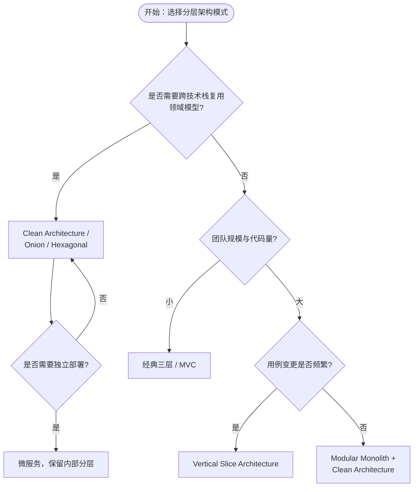
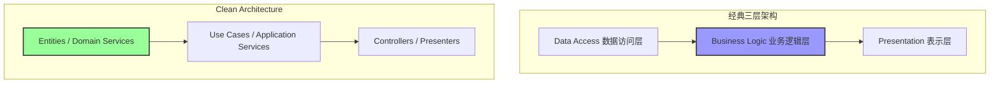

# 分层架构复用模式

> **版本**: 2026-06-10
> **定位**: 应用架构层（Level 2）—— 经典与现代分层架构的复用边界、模式与反模式
> **对齐标准**: ISO/IEC/IEEE 42010:2022, SWEBOK V4, ISO/IEC/IEEE 12207:2026
> **状态**: ✅ 已完成（Phase A 深化 + 内容要素补全）
> **字数**: ~7000字

---

## 目录

- [分层架构复用模式](#分层架构复用模式)
  - [目录](#目录)
  - [0. 概念定义](#0-概念定义)
  - [0.1 属性与特征](#01-属性与特征)
  - [0.2 关系与映射](#02-关系与映射)
  - [0.3 解释：分层架构为什么能促进复用](#03-解释分层架构为什么能促进复用)
    - [核心矛盾：稳定性与灵活性的平衡](#核心矛盾稳定性与灵活性的平衡)
    - [复用价值分布](#复用价值分布)
    - [何时使用分层架构复用](#何时使用分层架构复用)
    - [MVC、三层与 N 层的演变关系](#mvc三层与-n-层的演变关系)
  - [1. 核心概念](#1-核心概念)
    - [1.1 经典分层 vs. 现代演进](#11-经典分层-vs-现代演进)
  - [2. 复用模式](#2-复用模式)
    - [2.1 层内模块复用（Intra-layer Reuse）](#21-层内模块复用intra-layer-reuse)
    - [2.2 层间接口复用（Inter-layer Reuse）](#22-层间接口复用inter-layer-reuse)
    - [2.3 领域核心复用（Domain Core Reuse）](#23-领域核心复用domain-core-reuse)
  - [3. 四种架构的复用决策矩阵](#3-四种架构的复用决策矩阵)
  - [4. 实践约束](#4-实践约束)
  - [5. 现代演进：更多分层模式](#5-现代演进更多分层模式)
    - [5.1 DCI（Data-Context-Interaction）架构](#51-dcidata-context-interaction架构)
    - [5.2 Vertical Slice Architecture（垂直切片架构）](#52-vertical-slice-architecture垂直切片架构)
    - [5.3 Modular Monolith（模块化单体）](#53-modular-monolith模块化单体)
  - [6. 分层与 ISO/IEC/IEEE 42010:2022 视图映射](#6-分层与-iso-420102022-视图映射)
    - [6.1 逻辑视图（Logical View）映射](#61-逻辑视图logical-view映射)
    - [6.2 开发视图（Development View）映射](#62-开发视图development-view映射)
    - [6.3 过程视图与物理视图的边界](#63-过程视图与物理视图的边界)
  - [7. 分层架构的复用反模式](#7-分层架构的复用反模式)
    - [7.0 反例：分层架构复用失败模式总览](#70-反例分层架构复用失败模式总览)
    - [7.1 Blob 层（The Blob Layer）](#71-blob-层the-blob-layer)
    - [7.2 循环依赖层（Layer Cyclic Dependency）](#72-循环依赖层layer-cyclic-dependency)
    - [7.3 Leaking Abstraction（泄漏抽象）](#73-leaking-abstraction泄漏抽象)
    - [7.4 Anemic Domain Model（贫血领域模型）](#74-anemic-domain-model贫血领域模型)
  - [8. 分层架构的演化路径](#8-分层架构的演化路径)
    - [8.1 单体 → 模块化单体](#81-单体--模块化单体)
    - [8.2 模块化单体 → 微服务](#82-模块化单体--微服务)
    - [8.3 演化过程中的不可逆约束](#83-演化过程中的不可逆约束)
  - [9. 代码级复用示例](#9-代码级复用示例)
    - [9.1 领域层契约（最内层，最高复用价值）](#91-领域层契约最内层最高复用价值)
    - [9.2 应用层契约（用例编排层，通常不复用）](#92-应用层契约用例编排层通常不复用)
    - [9.3 基础设施层契约（适配器实现，可复用模式）](#93-基础设施层契约适配器实现可复用模式)
    - [9.4 层间复用的关键点](#94-层间复用的关键点)
  - [10. 测试策略与复用](#10-测试策略与复用)
    - [10.1 领域层测试：单元测试密集型](#101-领域层测试单元测试密集型)
    - [10.2 应用层测试：用例级集成测试](#102-应用层测试用例级集成测试)
    - [10.3 基础设施层测试：适配器契约测试](#103-基础设施层测试适配器契约测试)
    - [10.4 表示层测试：端到端/API 契约测试](#104-表示层测试端到端api-契约测试)
    - [10.5 测试策略与复用的协同矩阵](#105-测试策略与复用的协同矩阵)
  - [11. 分层架构的性能权衡](#11-分层架构的性能权衡)
    - [11.1 层间调用开销分析](#111-层间调用开销分析)
    - [11.2 复用收益与开销的量化模型](#112-复用收益与开销的量化模型)
    - [11.3 性能优化策略（不破坏分层边界）](#113-性能优化策略不破坏分层边界)
  - [12. 案例研究](#12-案例研究)
    - [12.1 成功案例：Spotify 的模块化单体与分层复用](#121-成功案例spotify-的模块化单体与分层复用)
    - [12.2 失败案例：某金融核心系统的分层泄漏](#122-失败案例某金融核心系统的分层泄漏)
    - [12.3 成功案例：某头部电商平台的分层内核复用](#123-成功案例某头部电商平台的分层内核复用)
  - [13. 总结与决策指南](#13-总结与决策指南)
  - [14. 与 ISO/IEC 25010:2023 的质量特征映射](#14-与-isoiec-250102023-的质量特征映射)
  - [15. 交叉引用](#15-交叉引用)
  - [16. 分层架构复用决策与演化 Mermaid 图](#16-分层架构复用决策与演化-mermaid-图)
    - [16.1 模式选型决策树](#161-模式选型决策树)
    - [16.2 经典分层与 Clean Architecture 的复用边界对比](#162-经典分层与-clean-architecture-的复用边界对比)

## 0. 概念定义

**定义**：分层架构（Layered Architecture）是一种按照职责垂直切分软件系统的结构化组织方式：系统被划分为若干相互独立的层（Layer），每层仅通过显式接口与直接相邻层交互，且依赖方向遵循外层依赖内层、内层不依赖外层的规则。在本知识体系中，分层架构的层边界被视为天然复用边界——变更频率低、外部依赖少的内层（如领域层、实体层）具有最高复用价值；而直接面向技术栈与具体用例的外层（如表示层、基础设施适配器）复用价值较低。

> **形式化表达**：设系统为 $S$，层集合为 $L = \\{L_1, L_2, ..., L_n\\}$，其中 $L_1$ 为最内层（领域层），$L_n$ 为最外层（表示/外部适配层）。分层架构的依赖约束可表示为：
> $$\\forall i < j, \\text{AllowDep}(L_j \\rightarrow L_i) = \\text{true}; \\quad \\forall i < j, \\text{AllowDep}(L_i \\rightarrow L_j) = \\text{false}$$
> 即只允许外层依赖内层，禁止反向依赖。

Wikipedia 对应条目：

- [Software architecture](https://en.wikipedia.org/wiki/Software_architecture)
- [Multilayered architecture](https://en.wikipedia.org/wiki/Multilayered_architecture)
- [Model–view–controller](https://en.wikipedia.org/wiki/Model%E2%80%93view%E2%80%93controller)

---

## 0.1 属性与特征

| 属性 | 说明 | 重要性 |
|---|---|---|
| **职责隔离** | 每层只负责一类职责（表示、应用、领域、基础设施），避免混杂 | 高 |
| **依赖方向约束** | 外层 → 内层，禁止反向依赖，确保内层稳定 | 高 |
| **接口契约稳定性** | 层间接口变更频率低于层内实现，契约稳定是复用前提 | 高 |
| **可测试性** | 内层无外部依赖，可用纯单元测试覆盖 | 中 |
| **可替换性** | 符合契约的实现可在不影响上层的情况下替换 | 高 |
| **可演化性** | 层边界为架构演化（单体 → 模块化单体 → 微服务）提供清晰中间状态 | 中 |

---

## 0.2 关系与映射

| 关系类型 | 目标概念 | 说明 |
|---|---|---|
| **上位概念** | [Software architecture](https://en.wikipedia.org/wiki/Software_architecture) | 分层架构是软件架构的一种经典组织风格 |
| **下位概念** | 三层架构 / MVC / MVP / MVVM / N-tier | 经典分层模式的具体实现 |
| **下位概念** | Clean Architecture / Onion Architecture / Hexagonal Architecture | 现代分层演进，强调领域核心 |
| **等价/映射概念** | ISO/IEC/IEEE 42010:2022 Architecture View | 每层可映射为 Architecture View Component；逻辑视图、开发视图、过程视图、物理视图均与层存在对应关系 |
| **映射概念** | TOGAF® ADM | 业务架构 → 信息系统架构（应用/数据） → 技术架构 的层级映射与分层架构同构 |
| **依赖概念** | 模块化单体、微服务、事件驱动 | 分层可存在于单体、模块、服务内部，是更粗粒度架构样式的内部组织方式 |
| **依赖概念** | 依赖倒置原则（DIP）、单一职责原则（SRP）、接口隔离原则（ISP） | 分层是这些设计原则在架构层面的结构化表达 |

---

## 0.3 解释：分层架构为什么能促进复用

分层架构之所以成为软件复用的经典组织方式，根源在于它通过**职责隔离**将系统内部不同变化速率的部分分离到不同层中。根据 David Parnas 的信息隐藏原则（Information Hiding），模块边界应围绕"可能发生变化的设计决策"来划分；分层架构正是这一原则在架构层面的结构化表达。

### 核心矛盾：稳定性与灵活性的平衡

分层架构面临的核心矛盾是：**越靠近业务核心的层越需要稳定，越靠近技术边界的层越需要灵活**。如果将所有代码混在一起，任何技术栈的变更（如数据库替换、UI 框架升级）都可能波及业务规则，导致业务逻辑无法被稳定复用。分层通过将业务规则隔离到内层，使其免受外层技术波动的影响。

### 复用价值分布

| 层级 | 复用价值 | 原因 |
|---|---|---|
| 领域层 / 实体层 | 最高 | 直接承载业务规则，技术无关，变更频率低 |
| 应用层 / 用例层 | 中低 | 与特定业务流程绑定，跨系统复用需抽象 |
| 基础设施层 | 中 | 适配器模式使同一抽象可在不同技术实现间切换 |
| 表示层 | 低 | 与前端框架、用户交互强绑定 |

### 何时使用分层架构复用

- 需要跨项目复用核心业务规则时
- 系统需要长期演化，且技术栈可能更换时
- 团队规模较大，需要明确的代码所有权边界时
- 需要为单体、模块化单体、微服务提供一致的内部结构时

> **定理 L.0** (Layer Reuse Value): 分层架构的复用价值 $V$ 与层的稳定性 $S$ 成正比，与层的技术无关性 $I$ 成正比，即 $V(L_i) \\propto S(L_i) \\times I(L_i)$。

### MVC、三层与 N 层的演变关系

MVC（Model-View-Controller）起源于 1970 年代的 Smalltalk 用户界面框架，其核心是将数据（Model）、表现（View）与控制（Controller）分离。随着企业应用的复杂化，MVC 演化为经典三层架构（Presentation / Business / Data），并在大型系统中进一步扩展为 N 层架构（表示层、应用层、领域层、基础设施层等）。Clean Architecture、Onion Architecture 和 Hexagonal Architecture 可以视为 N 层架构在现代面向对象语言中的精炼：它们将"业务逻辑层"进一步拆分为应用层与领域层，并显式引入端口-适配器边界，以最大化领域核心的复用潜力。

---

## 1. 核心概念

分层架构（Layered Architecture）是应用架构中最经典的组织模式，其核心思想是**将系统按职责垂直划分为若干层，每层仅与直接相邻层交互**。从复用视角看，分层架构的边界定义了复用粒度的自然切割面。

ISO/IEC/IEEE 42010:2022 将架构描述的基本单元定义为 **Architecture View Component**，而分层架构中的每一层（Layer）本质上就是一个可复用的 View Component。SWEBOK V4 在软件设计中进一步强调：层的独立性是复用可行性的前提条件。

### 1.1 经典分层 vs. 现代演进

| 模式 | 核心边界 | 复用单元 | 耦合特征 |
|------|---------|---------|---------|
| 经典三层架构 (Presentation/Business/Data) | 技术职责 | 层内模块 | 上层依赖下层 |
| Clean Architecture (Uncle Bob) | 业务逻辑为中心 | Use Case / Entity | 依赖规则指向内层 |
| Onion Architecture (Palermo) | 领域模型为核心 | Domain Service | 外层依赖内层 |
| Ports & Adapters (Hexagonal) | 端口-适配器边界 | Port / Adapter | 业务核心零外部依赖 |

---

## 2. 复用模式

### 2.1 层内模块复用（Intra-layer Reuse）

同一层内的模块通过**共享库（Shared Library）**或**内部开源（Inner Source）**实现复用。

- **适用场景**: 工具类、基础实体定义、通用校验逻辑
- **边界判定**: 当模块被 ≥3 个同层服务依赖时，应当提取为共享库
- **风险**: 隐式共享状态导致层内耦合上升

### 2.2 层间接口复用（Inter-layer Reuse）

通过**严格定义的层间契约**实现跨层复用。Clean Architecture 中的 **Interface Adapter** 层即为此模式的典型实现。

> **定理 L.1** (Layer Interface Stability): 分层架构的复用稳定性与层间接口的变更频率成反比。若某层接口在 6 个月内变更次数 > 3，则该层不适合作为复用边界。

### 2.3 领域核心复用（Domain Core Reuse）

Onion Architecture 和 Hexagonal Architecture 将**领域模型**置于最内层，该层具备最高的复用价值：

1. **业务规则实体（Entity）**: 跨项目复用，零外部依赖
2. **领域服务（Domain Service）**: 跨应用复用，仅依赖实体和值对象
3. **应用服务（Application Service）**: 通常不复用，因与特定用例绑定

---

## 3. 四种架构的复用决策矩阵

| 复用目标 | 经典三层 | Clean Architecture | Onion Architecture | Ports & Adapters |
|---------|---------|-------------------|-------------------|-----------------|
| 领域模型跨系统复用 | ⚠️ 困难（与数据层耦合） | ✅ 推荐 | ✅ 推荐 | ✅ 推荐 |
| 数据库适配器复用 | ✅ 容易 | ✅ 容易 | ✅ 容易 | ✅ 推荐 |
| UI/接口层复用 | ✅ 容易 | ⚠️ 需通过适配器 | ⚠️ 需通过适配器 | ⚠️ 需通过端口 |
| 跨技术栈迁移 | ❌ 困难 | ✅ 推荐 | ✅ 推荐 | ✅ 推荐 |

---

## 4. 实践约束

- **依赖方向不可违反**: 无论选择哪种分层模式，外层 → 内层的依赖方向是强制约束
- **层厚度控制**: 单层的代码量建议控制在总代码量的 20%-35%，过厚的层暗示职责未充分分离
- **测试金字塔对齐**: 内层应有最高的单元测试密度，外层以集成/E2E测试为主

---

## 5. 现代演进：更多分层模式

随着业务复杂度的提升和领域驱动设计（DDD）思想的普及，分层架构在 2010 年代后出现了多种新的演进形态。这些模式并非对经典分层的否定，而是在特定上下文下的细化与重构。

### 5.1 DCI（Data-Context-Interaction）架构

DCI 由 Trygve Reenskaug 提出，旨在解决传统分层架构中**领域模型贫血化**与**行为分散**的问题。DCI 将系统划分为三个核心概念：

- **Data（数据）**: 即领域对象，仅承载状态，行为被剥离到角色（Role）中
- **Context（上下文）**: 定义用例场景，负责将对象映射为特定角色并编排交互
- **Interaction（交互）**: 角色中的算法与行为，在特定用例下动态注入对象

从复用视角看，DCI 的价值在于：

1. **Data 层复用**: 领域对象作为纯粹的数据结构，可跨项目复用
2. **Role 层复用**: 行为按用例聚类，相似业务场景的角色可共享
3. **Context 层复用**: 用例编排模式可作为模板复用

> **复用约束**: DCI 对语言特性要求较高（如 Ruby 的 Mixin、C# 的扩展方法或动态代理），在静态类型语言中实现成本较大。若团队技术栈不支持动态行为注入，DCI 的复用收益将被实现复杂度抵消。

### 5.2 Vertical Slice Architecture（垂直切片架构）

Vertical Slice Architecture 由 Jimmy Bogard 推广，其核心思想是**按功能特性而非技术职责进行纵向切割**。每个切片（Slice）包含从 UI/API 到数据库访问的完整技术栈，但仅服务于单一业务用例。

```
传统分层（横向切割）          Vertical Slice（纵向切割）
┌─────────────┐              ┌─────┬─────┬─────┐
│  Presentation│              │Slice│Slice│Slice│
├─────────────┤              │  A  │  B  │  C  │
│   Business   │              ├─────┼─────┼─────┤
├─────────────┤              │  UI │  UI │  UI │
│     Data     │              │ App │ App │ App │
└─────────────┘              │ Dom │ Dom │ Dom │
                             │ Inf │ Inf │ Inf │
                             └─────┴─────┴─────┘
```

复用模式在 Vertical Slice 中发生了显著变化：

- **切片内复用**: 每个切片内部的层次依然保持，但层间契约极度简化（通常仅在本切片内使用）
- **跨切片复用**: 通过**共享内核（Shared Kernel）**或**内部 NuGet/NPM 包**提取通用逻辑
- **用例边界**: 每个切片对应一个用例，天然符合复用的业务边界

> **定理 L.2** (Slice Reuse Threshold): 当两个切片共享的代码超过各自代码量的 30% 时，应将共享部分提取为横向层；否则维持纵向切片的独立性更有利。

### 5.3 Modular Monolith（模块化单体）

模块化单体是介于传统单体与微服务之间的架构形态。它在**部署单元上保持单一进程**，但在**代码组织上严格划分模块边界**。每个模块拥有独立的分层结构（Presentation / Application / Domain / Infrastructure）。

模块化单体的复用策略：

1. **模块内分层复用**: 遵循经典分层复用模式（见第 2 节）
2. **模块间契约复用**: 模块间通过**公共 API 层（Public API Layer）**或**事件总线（Event Bus）**交互，公共 API 定义即为复用契约
3. **平台层复用**: 基础设施层（如数据库连接、消息队列客户端、日志框架）作为平台层被所有模块复用

模块化单体的核心优势在于**渐进式拆分**：当某个模块的复用需求跨越部署边界时，可以低摩擦地将其拆分为独立微服务，而模块内部的分层结构无需重构。

| 模式 | 复用粒度 | 部署独立性 | 适用阶段 |
|------|---------|-----------|---------|
| 经典分层 | 层内模块 | 无 | 小型项目 |
| DCI | 角色/上下文 | 无 | 复杂行为建模 |
| Vertical Slice | 切片内核 | 无 | 中型产品 |
| Modular Monolith | 模块/平台层 | 模块级隔离 | 大型系统初期 |
| 微服务 | 服务级 | 完全独立 | 大型系统成熟期 |

---

## 6. 分层与 ISO 42010:2022 视图映射

ISO/IEC/IEEE 42010:2022 定义了架构描述的框架，其中**架构视图（Architecture View）**是关注特定利益相关方关注点的系统表示。分层架构与标准视图之间存在明确的映射关系，这种映射为复用提供了元数据层面的依据。

### 6.1 逻辑视图（Logical View）映射

逻辑视图关注系统的功能需求与静态结构。在分层架构中：

- **领域层（Domain Layer）**对应逻辑视图中的**核心功能元素**，其类图、状态机、领域模型图均属于此视图
- **应用层（Application Layer）**对应逻辑视图中的**用例实现**，活动图、序列图中描述用例编排的部分属于此视图
- **基础设施层（Infrastructure Layer）**在逻辑视图中通常被抽象为**技术服务**，不作为功能核心展示

复用映射：逻辑视图中的领域层元素具有最高的跨系统复用潜力，因为它们与具体技术实现解耦。

### 6.2 开发视图（Development View）映射

开发视图关注软件在开发环境中的静态组织（模块、包、库）。

- **层（Layer）**对应开发视图中的**包（Package）或项目（Project）**
- **层间接口**对应开发视图中的**模块依赖关系（Module Dependency）**
- **层内模块**对应开发视图中的**子包或组件**

复用映射：开发视图定义了编译时和构建时的复用边界。若两个系统在开发视图中共享相同的领域层包结构，则它们可以复用相同的二进制构件（如 JAR、NuGet 包、Wheel）。

### 6.3 过程视图与物理视图的边界

- **过程视图（Process View）**: 描述运行时进程与线程结构。分层架构中的层在运行时可以映射为同一进程内的不同线程池，也可以映射为独立的进程（如微服务）
- **物理视图（Physical View）/部署视图**: 描述硬件映射。分层架构本身不强制物理部署方式，但层的划分会影响部署单元的粒度

> **复用启示**: ISO/IEC/IEEE 42010:2022 要求架构描述中明确视图之间的**一致性规则（Consistency Rules）**。在分层架构中，一致性规则体现为：逻辑视图中的领域层边界必须与开发视图中的包边界对齐，否则复用将因视图不一致而产生摩擦。

---

## 7. 分层架构的复用反模式

### 7.0 反例：分层架构复用失败模式总览

反例（Counter-example）与反模式（Anti-pattern）是理解分层架构复用边界的镜子：它们展示了当层边界、依赖方向或接口契约被错误处理时，复用如何从"资产"退化为"负债"。本节通过四个典型反模式与两个真实案例，说明复用失败的根因、后果与修复路径。

反模式（Anti-pattern）是看似合理实则导致负面后果的解决方案。在分层架构的复用实践中，以下四种反模式尤为常见。

### 7.1 Blob 层（The Blob Layer）

**症状**: 某一层的代码量超过总代码量的 50%，承担了过多的职责。常见表现为：

- 业务逻辑层（BLL）同时处理验证、转换、计算、编排、通知等所有非 UI 职责
- 基础设施层包含了业务规则（如存储过程中的复杂计算）

**对复用的影响**: Blob 层的内部耦合极高，任何小的修改都可能引发连锁反应，导致层作为复用单元的稳定性丧失。

**重构策略**:

1. 识别 Blob 层中不同变化速率的代码（参考康威定律和单一职责原则）
2. 将变化速率差异 > 2 倍的代码拆分为新的子层或模块
3. 引入应用服务层与领域服务层的显式分离

### 7.2 循环依赖层（Layer Cyclic Dependency）

**症状**: 通过依赖注入或事件机制，层 A 间接依赖于层 B，同时层 B 也依赖于层 A，形成循环。典型场景：

- 领域层通过领域事件订阅了应用层的处理逻辑
- 基础设施层回调了业务逻辑层的接口，而该接口又依赖基础设施类型

**对复用的影响**: 循环依赖使得层无法被独立提取为复用单元。提取领域层时，必须连带提取应用层，违背了分层解耦的初衷。

**检测与修复**:

- 使用静态分析工具（如 NDepend、ArchUnit、jQAssistant）检测循环依赖
- 引入**事件总线（Event Bus）**或**消息队列**打破直接依赖
- 将循环依赖点提取为独立的**共享内核（Shared Kernel）**模块

### 7.3 Leaking Abstraction（泄漏抽象）

**症状**: 上层代码依赖于下层实现的细节，而非抽象契约。常见表现：

- 应用层直接传递 ORM 实体（如 Hibernate Entity、EF Core Entity）给表示层
- 领域层抛出了基础设施异常（如 `SQLException`、`HttpTimeoutException`）
- 层间接口的参数类型包含下层特定的库类型（如 `JPA Pageable`、`IQueryable`）

**对复用的影响**: 当需要替换下层实现（如从 Oracle 迁移到 PostgreSQL，或从 REST 迁移到 gRPC）时，上层代码必须同步修改，复用契约失效。

**防御策略**:

- 层间数据传输对象（DTO）必须使用纯语言原生类型（POJO / POCO / Struct）
- 异常必须在边界处转换（如通过 Anti-Corruption Layer）
- 接口定义遵循**最小知识原则（Law of Demeter）**

### 7.4 Anemic Domain Model（贫血领域模型）

**症状**: 领域对象仅有 getter/setter，所有业务逻辑位于应用服务或事务脚本中。这是经典三层架构最常见的反模式。

**对复用的影响**: 领域层失去了行为，退化为数据传输结构。此时所谓的"领域复用"仅仅是数据结构复用，业务规则（最核心的复用资产）被分散在应用层中，无法跨系统复用。

**重构路径**:

1. 将事务脚本中的条件判断与计算逻辑迁移到领域对象的方法中
2. 识别**值对象（Value Object）**，将相关属性封装为不可变对象
3. 引入**领域事件（Domain Event）**表达跨聚合的业务规则
4. 当领域行为涉及多个聚合时，使用**领域服务（Domain Service）**

---

## 8. 分层架构的演化路径

软件系统的架构并非一成不变。分层架构的优势之一在于它为架构演化提供了清晰的中间状态。

### 8.1 单体 → 模块化单体

**触发条件**: 代码量超过 10 万行；团队规模超过 15 人；构建时间超过 10 分钟。

**分层保持策略**:

- 保持单一部署单元，但将代码库拆分为若干**模块（Module）**
- 每个模块拥有独立的内部分层（Controller → Service → Repository）
- 引入**模块注册表（Module Registry）**管理模块间依赖，禁止模块间直接访问 Repository
- 数据库保持共享，但每个模块拥有独立的 Schema 或表前缀

**复用变化**: 从"层内模块复用"演进为"跨模块平台层复用"，数据库访问框架、安全框架、消息总线等作为平台层被所有模块共享。

### 8.2 模块化单体 → 微服务

**触发条件**: 特定模块的变更频率是其他模块的 5 倍以上；不同模块的伸缩需求差异显著（如 QPS 相差 10 倍）；团队需要独立的发布节奏。

**分层保持策略**:

- 将被拆分的模块整体提取为独立进程，保持其内部分层结构不变
- 原系统中与该模块的交互点，替换为**HTTP/gRPC 客户端适配器**或**消息生产者**
- 领域层中的共享内核（如 `UserId`、`Money` 等值对象）提取为独立的**共享库（Shared Library）**
- 禁止微服务间直接访问数据库（每个服务拥有独立数据存储）

**复用变化**:

- 领域模型复用方式从"直接引用类库"变为"通过 API 契约复用"
- 共享内核以库形式复用（语义版本控制）
- 基础设施层完全独立，不再共享

### 8.3 演化过程中的不可逆约束

在演化过程中，以下约束一旦破坏将难以恢复：

1. **数据库所有权**: 从模块化单体向微服务过渡时，必须明确每个表的唯一所有者服务
2. **事务边界**: 模块化单体中的本地事务在微服务化后必须显式重构为 Saga 或 TCC 模式
3. **领域层纯度**: 无论在哪一阶段，领域层不得依赖 HTTP、SQL、ORM 等外部框架

```
演化路径与复用单元变化

单体                模块化单体              微服务
┌─────────────┐     ┌─────────────┐       ┌─────────────┐
│   Layered   │ ──> │  Module A   │ ──>   │  Service A  │
│   Monolith  │     │  Module B   │       │  Service B  │
│             │     │  Platform   │       │ Shared Lib  │
└─────────────┘     └─────────────┘       └─────────────┘

复用单元:            复用单元:              复用单元:
- 层内模块           - 平台层               - 共享内核库
- 工具类             - 共享领域库           - API 契约
                                          - 事件 Schema
```

---

## 9. 代码级复用示例

以下伪代码展示层间接口契约的定义方式，以 Clean Architecture 风格为例，说明如何通过接口契约实现层间复用。

### 9.1 领域层契约（最内层，最高复用价值）

```pseudo
// Domain Layer: 零外部依赖，可跨项目复用
package domain

// 实体：纯业务对象
class Order {
    OrderId id
    CustomerId customerId
    List<OrderLine> lines
    Money totalAmount
    OrderStatus status

    // 领域行为封装在实体中
    method pay(payment: Payment) : Result<OrderPaidEvent> {
        if this.status != PENDING {
            return Failure("Only pending order can be paid")
        }
        this.status = PAID
        return Success(new OrderPaidEvent(this.id, payment.amount))
    }

    method cancel() : Result<OrderCancelledEvent> {
        if this.status == SHIPPED {
            return Failure("Cannot cancel shipped order")
        }
        this.status = CANCELLED
        return Success(new OrderCancelledEvent(this.id))
    }
}

// 值对象：不可变，跨项目复用
class Money {
    BigDecimal amount
    Currency currency

    method add(other: Money) : Money {
        require(this.currency == other.currency)
        return new Money(this.amount + other.amount, this.currency)
    }
}

// 领域服务：跨聚合业务逻辑
interface OrderPricingService {
    method calculateTotal(lines: List<OrderLine>) : Money
}
```

### 9.2 应用层契约（用例编排层，通常不复用）

```pseudo
// Application Layer: 定义用例，依赖领域层
package application

// 输入端口（接口）：表示层必须实现的契约
interface PlaceOrderUseCase {
    method execute(request: PlaceOrderRequest) : Result<OrderDto>
}

// 输出端口（接口）：基础设施必须实现的契约
interface OrderRepository {
    method save(order: Order) : Result<void>
    method findById(id: OrderId) : Result<Order>
    method findPendingByCustomer(customerId: CustomerId) : List<Order>
}

interface PaymentGateway {
    method charge(amount: Money, token: PaymentToken) : Result<TransactionId>
}

// 用例实现：仅在此应用中复用
class PlaceOrderService implements PlaceOrderUseCase {
    // 依赖通过构造函数注入（依赖倒置）
    OrderRepository orderRepo
    PaymentGateway paymentGateway
    OrderPricingService pricingService

    constructor(repo, gateway, pricing) {
        this.orderRepo = repo
        this.paymentGateway = gateway
        this.pricingService = pricing
    }

    method execute(request: PlaceOrderRequest) : Result<OrderDto> {
        // 1. 构建领域对象
        lines = request.items.map(i => new OrderLine(i.productId, i.quantity, i.unitPrice))
        total = pricingService.calculateTotal(lines)
        order = new Order(new OrderId(), request.customerId, lines, total, PENDING)

        // 2. 执行业务逻辑
        paymentResult = paymentGateway.charge(total, request.paymentToken)
        if paymentResult.isFailure() {
            return Failure("Payment failed")
        }

        payResult = order.pay(new Payment(paymentResult.value))
        if payResult.isFailure() {
            // 补偿：退款
            paymentGateway.refund(paymentResult.value)
            return Failure(payResult.error)
        }

        // 3. 持久化
        orderRepo.save(order)
        return Success(OrderDto.from(order))
    }
}
```

### 9.3 基础设施层契约（适配器实现，可复用模式）

```pseudo
// Infrastructure Layer: 实现应用层定义的输出端口
package infrastructure.persistence

class SqlOrderRepository implements OrderRepository {
    DatabaseConnection db
    OrderMapper mapper

    method save(order: Order) : Result<void> {
        // 将领域对象映射为持久化模型（ORM 或手动映射）
        entity = mapper.toEntity(order)
        db.execute("INSERT INTO orders ... ON CONFLICT UPDATE ...", entity)
        return Success()
    }

    method findById(id: OrderId) : Result<Order> {
        row = db.queryOne("SELECT * FROM orders WHERE id = ?", id.value)
        if row == null {
            return Failure("Order not found")
        }
        return Success(mapper.toDomain(row))
    }
}

package infrastructure.gateway

class StripePaymentGateway implements PaymentGateway {
    StripeClient client

    method charge(amount: Money, token: PaymentToken) : Result<TransactionId> {
        try {
            stripeCharge = client.charges.create({
                amount: amount.toCents(),
                currency: amount.currency.toLowerCase(),
                source: token.value
            })
            return Success(new TransactionId(stripeCharge.id))
        } catch (StripeException e) {
            return Failure(e.message)
        }
    }
}
```

### 9.4 层间复用的关键点

| 复用层级 | 复用单元 | 依赖方向 | 契约形式 |
|---------|---------|---------|---------|
| 领域层 | Entity / Value Object / Domain Service | 零依赖 | 纯类库 |
| 应用层 | Use Case Interface (Input/Output Port) | 仅依赖领域层 | 接口定义 |
| 基础设施层 | Adapter 实现 | 依赖应用层接口 | 接口实现 |
| 表示层 | Controller / Presenter | 依赖应用层接口 | 接口调用 |

---

## 10. 测试策略与复用

分层架构的测试策略直接影响复用单元的可信度。每层应拥有独立的测试策略，形成**测试金字塔**与**架构层次**的对齐。

### 10.1 领域层测试：单元测试密集型

领域层是纯业务逻辑，不依赖外部框架，因此应达到**最高测试密度**。

- **测试类型**: 单元测试（Unit Test）
- **覆盖率目标**: 分支覆盖率 ≥ 90%，变异测试（Mutation Testing）分数 ≥ 80%
- **复用关联**: 领域层作为核心复用单元，其单元测试本身就是复用资产的"质量证明书"。当领域库被跨项目复用时，附带的单元测试套件确保接收方对质量有量化信心。
- **测试替身**: 无需 Mock（除领域服务接口外），直接实例化实体与值对象

```pseudo
// 领域层测试示例
test "Order.pay should succeed when order is pending" {
    order = new Order(id, customerId, [line], Money.of(100, USD), PENDING)
    result = order.pay(Payment.of(Money.of(100, USD)))

    assert result.isSuccess()
    assert order.status == PAID
    assert result.value instanceof OrderPaidEvent
}

test "Order.pay should fail when order is already paid" {
    order = new Order(id, customerId, [line], Money.of(100, USD), PAID)
    result = order.pay(Payment.of(Money.of(100, USD)))

    assert result.isFailure()
    assert result.error == "Only pending order can be paid"
}
```

### 10.2 应用层测试：用例级集成测试

应用层编排领域对象与基础设施端口，测试重点是**用例路径的完整性**。

- **测试类型**: 集成测试（Integration Test）或契约测试（Contract Test）
- **覆盖率目标**: 所有用例的 Happy Path + 主要异常路径
- **复用关联**: 应用层的输出端口（Repository、Gateway 接口）契约是基础设施层复用的前提。应用层测试通过**内存实现（In-memory Implementation）**验证接口契约的正确性，这些内存实现本身可作为测试辅助库复用。

```pseudo
// 应用层测试：使用 In-memory Repository
test "PlaceOrderService should create and pay order" {
    repo = new InMemoryOrderRepository()
    gateway = new FakePaymentGateway(alwaysSucceeds: true)
    pricing = new DefaultOrderPricingService()
    service = new PlaceOrderService(repo, gateway, pricing)

    request = PlaceOrderRequest.of(customerId, [item], paymentToken)
    result = service.execute(request)

    assert result.isSuccess()
    assert repo.findById(result.value.id).isSuccess()
}
```

### 10.3 基础设施层测试：适配器契约测试

基础设施层的测试重点是**适配器是否正确实现了应用层定义的契约**。

- **测试类型**: 集成测试（连接真实数据库/外部服务）或**测试容器测试（Testcontainers）**
- **覆盖率目标**: 所有 CRUD 操作、错误转换、连接恢复逻辑
- **复用关联**: 当多个应用复用同一个基础设施适配器（如通用的 `SqlOrderRepository`）时，适配器自带的集成测试确保其在不同上下文中的行为一致性。

### 10.4 表示层测试：端到端/API 契约测试

- **测试类型**: E2E 测试、API 契约测试（Pact）
- **覆盖率目标**: 关键用户旅程（Critical User Journey）
- **复用关联**: API 契约测试定义了表示层与应用层之间的契约，当 UI 被复用（如跨平台的 API 消费者）时，Pact 契约文件作为机器可读的复用规范。

### 10.5 测试策略与复用的协同矩阵

| 架构层 | 测试类型 | 复用单元 | 测试作为复用资产 |
|--------|---------|---------|-----------------|
| 领域层 | 单元测试 | 领域库 | 测试套件随库分发 |
| 应用层 | 集成测试 | 用例模板 | In-memory 实现作为测试工具库 |
| 基础设施层 | 容器化集成测试 | 适配器库 | 适配器测试证明跨项目兼容性 |
| 表示层 | E2E / Pact | API 消费者 | Pact 契约文件作为复用规范 |

---

## 11. 分层架构的性能权衡

分层架构引入了明确的抽象边界，但抽象必然带来运行时开销。理解层间调用开销与复用收益之间的权衡，是架构决策的关键。

### 11.1 层间调用开销分析

| 调用类型 | 典型延迟 | 主要开销来源 | 优化方向 |
|---------|---------|-------------|---------|
| 同进程方法调用 | 1-10 ns | 栈帧切换、参数传递 | JIT 内联、值类型传递 |
| 跨层 DTO 映射 | 0.1-1 ms | 反射/属性拷贝、内存分配 | 编译时代码生成（MapStruct、AutoMapper） |
| 进程间通信（IPC） | 1-10 ms | 序列化、网络栈、上下文切换 | gRPC + Protobuf、共享内存 |
| 网络调用（服务间） | 10-100 ms | TCP 握手、负载均衡、重试 | 连接池、缓存、异步化 |

### 11.2 复用收益与开销的量化模型

假设某层接口被 N 个消费者复用，每个消费者避免了重复实现成本 C_implementation，但需要承担每次调用的性能开销 C_overhead，以及学习成本 C_learning。

**净复用收益** = N × C_implementation - (N × Call_Volume × C_overhead) - (N × C_learning)

**决策规则**:

- 当 N ≥ 3 且 Call_Volume < 10^6 次/天时，层间调用的性能开销通常可被复用收益覆盖
- 当 Call_Volume > 10^8 次/天（如高频交易、实时竞价），即使 N 很大，也应考虑**内联（Inlining）**或**编译时复用**（如 C++ 模板、Rust 泛型）而非运行时分层调用

### 11.3 性能优化策略（不破坏分层边界）

1. **只读模型绕过**: 对于复杂查询，允许应用层直接查询只读投影（Read Model），绕过领域模型的完整 hydration
2. **批量端口**: 在层间接口中增加批量操作（如 `saveAll` 替代多次 `save`），减少跨层调用次数
3. **缓存层（Caching Layer）**: 在基础设施层之上引入透明缓存层，对领域层不可见，但减少数据库访问
4. **异步事件**: 对非强一致性要求的操作，通过领域事件实现异步处理，降低调用链的同步延迟

> **定理 L.3** (Layer Performance Invariant): 任何性能优化不得使领域层产生对外部框架的依赖。缓存、异步、批量的实现细节必须限制在应用层或基础设施层。

---

## 12. 案例研究

### 12.1 成功案例：Spotify 的模块化单体与分层复用

Spotify 在 2010 年代初期经历了从单体到模块化单体的演化，其架构实践是分层复用的典范。

**背景**: Spotify 早期是一个标准的 Java 单体应用（"The Beast"），随着功能增长，构建时间和部署风险急剧上升。

**分层策略**:

1. **模块化**: 将单体拆分为约 100 个模块，每个模块拥有独立的分层结构（API / Service / Domain / Persistence）
2. **共享内核**: 提取 `spotify-common` 库，包含领域值对象（如 `TrackId`、`UserUri`）和基础工具
3. **协议复用**: 模块间通过定义良好的 Protocol Buffer 契约通信，这些契约文件作为独立仓库管理，被服务端和客户端共同复用
4. **分层保持**: 即使在模块化后，每个模块内部依然保持 Clean Architecture 风格的分层，领域层独立且无外部依赖

**复用成果**:

- `spotify-common` 被 100+ 模块复用，避免了每个模块重复定义领域语义类型
- Protocol Buffer 契约的复用确保了服务端与客户端（iOS、Android、桌面、Web）的类型安全
- 当某些模块最终拆分为独立微服务时，其内部分层结构无需重构，实现了**平滑演化**

**关键经验**: 分层架构的复用价值在演化过程中被放大。早期对领域层纯度的投资，在后期微服务化时获得了指数级回报。

### 12.2 失败案例：某金融核心系统的分层泄漏

某大型银行在 2018 年重建核心账务系统时，采用了经典三层架构，但在复用实践中遭遇了严重失败。

**背景**: 系统需要支持存款、贷款、支付、清算四个业务线，计划通过"共享业务逻辑层"实现跨业务线复用。

**失败根因**:

1. **Blob 层**: 业务逻辑层（BLL）膨胀至 40 万行代码，包含了四个业务线的所有规则，内部耦合极高
2. **Leaking Abstraction**: BLL 直接暴露 MyBatis Mapper 对象给表示层，导致前端代码中出现了 SQL 片段和数据库方言
3. **贫血领域模型**: 领域对象仅有 getter/setter，所有业务逻辑位于 BLL 的 `Service` 类中，以数千行的"事务脚本"形式存在
4. **循环依赖**: 存款模块的业务逻辑直接调用了贷款模块的 Service，反之亦然，形成复杂的循环依赖网

**后果**:

- **复用失败**: 当支付业务线需要复用"账户余额校验"逻辑时，发现该逻辑与存款业务的特定流程（如利息计算）耦合在一起，无法独立提取
- **发布瘫痪**: 任何业务线的修改都需要全量回归测试，发布时间从每周一次恶化为每季度一次
- **技术债务**: 三年后，团队不得不启动"核心重构"项目，将 Blob 层拆分为四个独立的限界上下文（Bounded Context），重构成本约为原始开发成本的 1.5 倍

**教训总结**:

- **没有边界的复用不是复用，而是耦合**。四个业务线的业务逻辑在物理上处于同一层，但逻辑上并不属于同一领域
- **贫血领域模型 + 事务脚本 = 伪分层**。虽然代码目录结构看起来是分层，但业务规则的分散使得领域层名存实亡
- **层间接口的稳定性需要主动设计**，而非自然涌现。该系统从未定义过层间 DTO，导致表示层与数据层形成了隐式契约

### 12.3 成功案例：某头部电商平台的分层内核复用

某头部电商平台在支撑 618、双 11 等大促时，将订单、支付、库存等核心域的实体与领域服务提取为独立的**领域内核库（Domain Kernel Library）**，以 Java 多模块形式在多个业务线间复用。

**分层策略**:

1. **领域内核独立发布**: `order-domain`、`payment-domain`、`inventory-domain` 等模块零外部依赖，仅包含实体、值对象、领域事件与领域服务，通过 SemVer 管理版本
2. **应用层隔离变化**: 各业务线（主站、APP、小程序、商家后台）在应用层编写各自的用例编排，通过统一 DTO 与领域内核交互
3. **基础设施层适配异构存储**: 订单读写采用关系型数据库，库存高并发访问采用 Redis + 最终一致投影，均通过适配器实现领域层定义的 Repository 端口
4. **层间契约测试**: 每个领域内核发布前运行 ArchUnit 检查非法依赖，并附带单元测试套件作为复用资产的"质量证明书"

**复用成果**:

- 订单、支付、库存的核心业务规则在 6 个业务线中复用，避免了重复实现导致的语义漂移
- 大促期间仅需对基础设施层进行容量扩容，领域层无需随流量波动修改
- 当某业务线需要从单体迁移为独立微服务时，直接复用领域内核库，仅重写应用层与基础设施适配器

**关键经验**: 将变化最慢、价值最高的领域层以库形式固化，是分层架构复用的最大杠杆点。

---

## 13. 总结与决策指南

分层架构的复用本质上是**通过职责隔离降低变更传播范围**的工程实践。无论选择经典三层、Clean Architecture、Onion、Hexagonal，还是现代演进的 DCI、Vertical Slice 或 Modular Monolith，以下原则始终成立：

1. **领域层纯度优先**: 领域层的零外部依赖是最高优先级的架构约束，它是复用价值的蓄水池
2. **接口即契约**: 层间接口的变更频率决定了复用边界的稳定性，低变更频率的接口才是值得复用的
3. **反模式零容忍**: Blob 层、循环依赖、泄漏抽象、贫血模型是复用的四大杀手，必须通过静态分析工具持续检测
4. **演化为先**: 选择支持渐进式演化的分层模式（如模块化单体），避免在业务未验证时过度拆分
5. **测试即文档**: 每层的测试策略不仅是质量保障，更是复用单元的活文档，接收方通过测试理解契约语义

---

---

## 14. 与 ISO/IEC 25010:2023 的质量特征映射

ISO/IEC 25010:2023 将产品质量模型划分为九大可维护、可度量的特征，其中多项与分层架构复用直接相关：

| ISO/IEC 25010:2023 特征 | 分层架构复用映射 | 本项目模式对应 |
|------------------------|-----------------|---------------|
| **可维护性 (Maintainability)** → 模块化、可复用性、可分析性 | 层边界将变更影响范围限制在单层或单模块 | 2.1 层内模块复用 / 2.3 领域核心复用 |
| **灵活性 (Flexibility)** → 适应性、可扩展性、可替换性 | 外层技术实现可替换而不触及领域层 | 9.3 基础设施层契约 / 端口-适配器模式 |
| **可靠性 (Reliability)** → 容错性、可用性 | 层间接口契约支持单元测试与故障隔离 | 10. 测试策略与复用 |
| **安全性 (Security)** | 认证/授权横切关注点集中在边界层 | 6.2 开发视图映射中的边界包 |
| **性能效率 (Performance Efficiency)** | 层间调用开销需量化权衡 | 11. 分层架构的性能权衡 |

> **映射启示**: ISO/IEC 25010:2023 将 *reusability* 明确列为可维护性的子特征（sub-characteristic），为“分层架构提升复用”提供了国际标准层面的理论支撑。

## 15. 交叉引用

- [02 业务架构复用](../../02-business-architecture-reuse/README.md)：业务能力如何映射为领域层与限界上下文
- [04 Serverless 架构复用模式](../04-serverless/serverless-reuse-patterns.md)：分层思想在 FaaS 函数内部的应用
- [06 事件驱动架构复用模式](../06-event-driven/reuse-patterns.md)：事件驱动与分层架构的互补关系
- [模块化单体复用策略](./reuse-patterns.md)：模块化单体内部的分层复用策略
- [07 云原生模式](../07-cloud-native-patterns/README.md)：服务网格、网关与分层边界的协同
- [02 微服务架构复用模式](../02-microservices/microservices-reuse-patterns.md)：微服务内部仍可保留 Clean / Onion 分层
- [10 TOSCA/DMN 平台](../10-tosca-dmn-platform/tosca-v20-dmn16-alignment.md)：TOSCA v2.0 服务模板与分层部署描述的映射

---

## 16. 分层架构复用决策与演化 Mermaid 图

### 16.1 模式选型决策树



### 16.2 经典分层与 Clean Architecture 的复用边界对比



---

> 最后更新: 2026-07-08
> 权威来源:
>
> - [ISO/IEC/IEEE 42010:2022](https://www.iso.org/standard/74296.html) — ISO (核查日期: 2026-07-08)
> - [ISO/IEC 25010:2023](https://www.iso.org/standard/78176.html) — *Systems and software engineering — SQuaRE — Product quality model* (核查日期: 2026-07-08)
> - [TOGAF® Standard, 10th Edition](https://www.opengroup.org/togaf) — The Open Group (核查日期: 2026-07-08)
> - [Software architecture - Wikipedia](https://en.wikipedia.org/wiki/Software_architecture) (核查日期: 2026-07-08)
> - [Multilayered architecture - Wikipedia](https://en.wikipedia.org/wiki/Multilayered_architecture) (核查日期: 2026-07-08)
> - Clean Architecture: <https://blog.cleancoder.com/uncle-bob/2012/08/13/the-clean-architecture.html> (核查日期: 2026-07-08)
> - Onion Architecture: <https://jeffreypalermo.com/2008/07/the-onion-architecture-part-1/> (核查日期: 2026-07-08)
> - DCI Architecture: <https://fulloo.info/Documents/ArtimaDCI/> (核查日期: 2026-07-08)
> - Vertical Slice Architecture: <https://www.jimmybogard.com/vertical-slice-architecture/> (核查日期: 2026-07-08)
> - Modular Monolith: <https://www.milanjovanovic.tech/blog/what-is-a-modular-monolith> (核查日期: 2026-07-08)
> - Spotify Engineering: <https://engineering.atspotify.com/2014/03/building-products-at-spotify/> (核查日期: 2026-07-08)
> - SWEBOK V4: <https://www.computer.org/education/bodies-of-knowledge/software-engineering> (核查日期: 2026-07-08)
> - ISO/IEC 12207:2026: <https://iso.org/standard/85683.html> (核查日期: 2026-07-08)