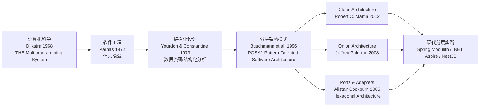
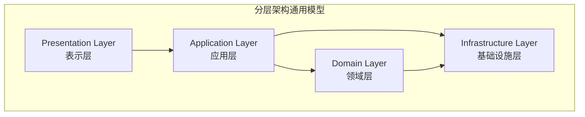
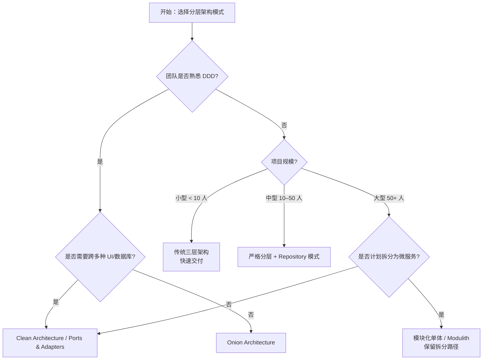
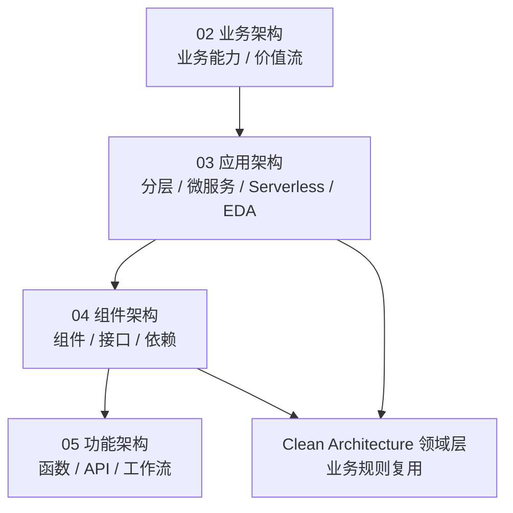

# 分层架构复用模式

> **版本**: 2026-07-07
> **定位**: 03 应用架构复用的基础子主题 —— 分层架构（Layered Architecture）的复用模式、边界与决策
> **对齐标准**: ISO/IEC/IEEE 42010:2022, SWEBOK V4, TOGAF Standard 10
> **来源 URL**:
>
> - ISO 42010: <https://www.iso.org/standard/74296.html>
> - SWEBOK V4: <https://www.computer.org/education/bodies-of-knowledge/software-engineering>
> - TOGAF Standard 10: <https://www.opengroup.org/togaf>
> **核查日期**: 2026-07-07

---

## 目录

- [分层架构复用模式](#分层架构复用模式)
  - [目录](#目录)
  - [1. 概念定义（CARC 本体）](#1-概念定义carc-本体)
    - [1.1 分层架构（Layered Architecture）](#11-分层架构layered-architecture)
    - [1.2 复用单元在分层架构中的形态](#12-复用单元在分层架构中的形态)
  - [2. 概念谱系与学术来源](#2-概念谱系与学术来源)
  - [3. 核心复用模式](#3-核心复用模式)
    - [3.1 严格分层（Strict Layering）](#31-严格分层strict-layering)
    - [3.2 松散分层（Relaxed Layering）](#32-松散分层relaxed-layering)
    - [3.3 Clean Architecture / Onion Architecture](#33-clean-architecture--onion-architecture)
    - [3.4 端口与适配器（Ports \& Adapters / Hexagonal Architecture）](#34-端口与适配器ports--adapters--hexagonal-architecture)
  - [4. 层间依赖规则与复用边界](#4-层间依赖规则与复用边界)
    - [4.1 通用四层参考模型](#41-通用四层参考模型)
    - [4.2 复用边界判定](#42-复用边界判定)
  - [5. 正向示例](#5-正向示例)
    - [示例 1：Repository 模式跨项目复用](#示例-1repository-模式跨项目复用)
    - [示例 2：Clean Architecture 模板作为新项目脚手架](#示例-2clean-architecture-模板作为新项目脚手架)
  - [6. 反例与失败案例](#6-反例与失败案例)
    - [反例 1：表示层直接调用数据访问层](#反例-1表示层直接调用数据访问层)
    - [反例 2：将框架注解污染领域对象](#反例-2将框架注解污染领域对象)
    - [反例 3：名为分层实为“大泥球”](#反例-3名为分层实为大泥球)
  - [7. 多维对比矩阵](#7-多维对比矩阵)
    - [7.1 分层模式 × 复用维度](#71-分层模式--复用维度)
    - [7.2 分层架构 vs 其他应用架构模式](#72-分层架构-vs-其他应用架构模式)
  - [8. 场景决策树](#8-场景决策树)
  - [9. 与四层架构的关系](#9-与四层架构的关系)
  - [10. 权威来源](#10-权威来源)

---

## 1. 概念定义（CARC 本体）

### 1.1 分层架构（Layered Architecture）

**定义**：分层架构是一种将软件系统组织为多个水平层次的架构模式，每一层只依赖于其下方的层，并通过定义良好的接口向上方层暴露服务。其核心思想是**关注点分离（Separation of Concerns）**与**抽象层次递进**。

**属性**：

| 属性 | 说明 |
|------|------|
| **层（Layer）** | 一组职责相关的组件集合，如表示层、业务逻辑层、数据访问层 |
| **单向依赖** | 高层可依赖低层，低层不应依赖高层 |
| **接口契约** | 层与层之间通过抽象接口交互，隐藏实现细节 |
| **可替换性** | 同一层内的实现可在不影响其他层的前提下替换 |

**关系**：

- **uses**（使用）：上层使用下层提供的服务。
- **implements**（实现）：具体实现类实现层接口。
- **maps to**（映射）：分层架构可映射到 ISO/IEC/IEEE 42010:2022 的架构视点（Viewpoint）与模型（Model）。

**约束**：

1. **依赖方向约束**：依赖只能自上而下（Strict Layering）或有限跨层（Relaxed Layering）。
2. **循环依赖禁止**：任意两层之间不得出现循环依赖。
3. **接口稳定性约束**：下层接口一旦发布，应保持稳定或遵循语义化版本控制。

---

### 1.2 复用单元在分层架构中的形态

在分层架构中，可复用单元并非整个应用，而是**层内的模块、接口契约或横切关注点**：

| 复用单元 | 示例 | 复用层级 |
|---------|------|---------|
| **层接口** | Repository 接口、Service 接口 | 组件级 |
| **通用组件** | 日志、配置、校验框架 | 组件级 / 横切 |
| **领域模型** | DTO、Value Object、领域事件 | 模型级 |
| **模板项目** | Clean Architecture 模板、Onion Architecture 模板 | 项目级 |

---

## 2. 概念谱系与学术来源

分层思想并非软件工程独有，其学术谱系可追溯至：

**Wikipedia 对应条目**：

- [Multilayered architecture](https://en.wikipedia.org/wiki/Multilayered_architecture)
- [Hexagonal architecture](https://en.wikipedia.org/wiki/Hexagonal_architecture_(software))
- [Clean architecture](https://en.wikipedia.org/wiki/Clean_architecture)

---

## 3. 核心复用模式

### 3.1 严格分层（Strict Layering）

**定义**：每一层只能直接依赖其紧邻的下一层，禁止跨层调用。

**适用场景**：

- 中小型系统（< 50 人团队）
- 对代码可维护性要求高
- 团队对架构纪律有共识

**复用收益**：

- 层边界清晰，便于独立测试。
- 下层服务可被多个上层复用。

**复用成本**：

- 新增功能可能需要穿越多层，导致样板代码增多。
- 过度严格可能降低开发效率。

### 3.2 松散分层（Relaxed Layering）

**定义**：允许高层跳过相邻层直接调用更底层，但禁止逆向依赖。

**适用场景**：

- 遗留系统现代化过程中
- 性能敏感场景（避免不必要的数据转换）

**复用收益**：

- 减少中间层代理，提升性能。

**复用成本**：

- 层边界模糊，长期可能导致“大泥球”。

### 3.3 Clean Architecture / Onion Architecture

**定义**：将领域逻辑置于架构中心，基础设施、UI、框架等作为外层依赖核心。

**核心规则（依赖规则）**：

> 源代码依赖只能指向内部，不能指向外部。

**复用收益**：

- 领域层完全独立于框架、UI 和数据库，可跨项目复用。
- 便于单元测试，无需启动数据库或 Web 服务器。

### 3.4 端口与适配器（Ports & Adapters / Hexagonal Architecture）

**定义**：通过“端口”定义应用与外部世界的交互契约，通过“适配器”实现具体技术细节。

**复用收益**：

- 同一领域逻辑可适配多种 UI（Web、CLI、批处理）。
- 同一数据库端口可适配 PostgreSQL、MongoDB 或内存存储。

---

## 4. 层间依赖规则与复用边界

### 4.1 通用四层参考模型

### 4.2 复用边界判定

| 判定问题 | 可复用 | 不可复用 |
|---------|--------|---------|
| 是否跨越层边界？ | 否，复用应发生在层内或通过接口 | 是，直接依赖其他层的内部实现 |
| 是否依赖具体框架？ | 否，应依赖抽象 | 是，框架版本锁定导致不可迁移 |
| 是否包含业务规则？ | 领域层规则可复用 | 表示层逻辑通常不可复用 |
| 是否有稳定接口？ | 是 | 否 |

---

## 5. 正向示例

### 示例 1：Repository 模式跨项目复用

**场景**：一个电商系统的 `ProductRepository` 接口定义了商品的增删改查操作。

**复用方式**：

- 接口定义在领域层，不依赖具体 ORM。
- 项目 A 使用 JPA/Hibernate 实现。
- 项目 B 使用 MyBatis 实现。
- 领域服务代码完全相同，实现可替换。

**关键成功因素**：

1. 接口仅暴露领域概念（Product、ProductId）。
2. 返回类型为领域对象，而非数据库实体。
3. 接口契约稳定，遵循语义化版本。

### 示例 2：Clean Architecture 模板作为新项目脚手架

**场景**：团队维护一个基于 Clean Architecture 的 Java 模板项目。

**复用方式**：

- 新项目通过 Cookiecutter / Maven Archetype / Backstage Scaffolder 生成初始结构。
- 所有新项目共享相同的包结构、依赖注入配置、测试基类。

**关键成功因素**：

1. 模板中不包含具体业务逻辑。
2. 文档明确说明每层允许放置的代码类型。
3. CI 流水线自动检查层间依赖方向。

---

## 6. 反例与失败案例

### 反例 1：表示层直接调用数据访问层

**场景**：为了“省事”，Controller 直接注入 `JdbcTemplate` 执行 SQL。

**后果**：

- 业务逻辑泄漏到表示层。
- 数据访问实现变更时，所有 Controller 都需要修改。
- 无法在不启动 Web 容器的情况下测试业务逻辑。

**判定**：违反分层依赖规则，不可复用。

### 反例 2：将框架注解污染领域对象

**场景**：领域对象直接添加 JPA `@Entity`、Jackson `@JsonProperty`、Spring `@Component` 注解。

**后果**：

- 领域层依赖 Spring、Jackson、JPA，无法独立复用。
- 切换技术栈时，领域对象需要重写。

**判定**：违反 Clean Architecture 依赖规则，领域层不应依赖外部框架。

### 反例 3：名为分层实为“大泥球”

**场景**：项目目录结构存在 `controller/`、`service/`、`dao/`，但 Service 之间存在大量横向调用，DAO 之间也存在循环依赖。

**后果**：

- 层形同虚设，系统退化为按技术角色组织的“大泥球”。
- 任何修改都可能引发级联故障。

**判定**：仅有目录分层而无语义分层，复用性极低。

---

## 7. 多维对比矩阵

### 7.1 分层模式 × 复用维度

| 模式 | 代码复用 | 团队复用 | 知识复用 | 测试复用 | 适用团队规模 |
|------|---------|---------|---------|---------|------------|
| **严格分层** | 中 | 高 | 高 | 高 | 10–50 人 |
| **松散分层** | 中 | 中 | 中 | 中 | 5–30 人 |
| **Clean Architecture** | 高 | 高 | 高 | 极高 | 20–100 人 |
| **Onion Architecture** | 高 | 高 | 高 | 极高 | 20–100 人 |
| **Ports & Adapters** | 高 | 中 | 高 | 高 | 10–80 人 |
| **传统三层（Controller/Service/DAO）** | 低 | 低 | 低 | 低 | < 10 人 |

### 7.2 分层架构 vs 其他应用架构模式

| 维度 | 分层架构 | 微服务 | Serverless | 事件驱动 |
|------|---------|--------|-----------|---------|
| **复用粒度** | 层/模块 | 服务 | 函数 | 事件处理器 |
| **部署独立性** | 低 | 高 | 极高 | 高 |
| **技术栈自由度** | 低（通常单一栈） | 高 | 中（受平台约束） | 高 |
| **数据一致性** | ACID / 本地事务 | Saga / 最终一致 | 最终一致 | 最终一致 |
| **运维复杂度** | 低 | 高 | 低 | 中 |
| **典型入口** | 单进程应用 | 分布式服务网格 | 函数即服务 | 消息代理 |

---

## 8. 场景决策树

---

## 9. 与四层架构的关系

分层架构位于 **03 应用架构复用层**，向上支撑 **04 组件架构复用层** 的接口契约与设计模式，向下承接 **02 业务架构复用层** 的业务能力与价值流：

**映射说明**：

- 业务能力（Business Capability）可映射为应用架构中的应用层/领域层服务。
- 分层架构中的“领域层”可作为组件架构中可复用组件的逻辑边界。
- 分层架构的接口契约（如 Repository、Service）属于功能架构复用中的 API 设计范畴。

---

## 10. 权威来源

> **权威来源**:
>
> - Buschmann, F., Meunier, R., Rohnert, H., Sommerlad, P., & Stal, M. (1996). *Pattern-Oriented Software Architecture, Volume 1: A System of Patterns*. Wiley.（Layer 模式原始定义）
> - Martin, R. C. (2012). *The Clean Architecture*. blog.cleancoder.com. <https://blog.cleancoder.com/uncle-bob/2012/08/13/the-clean-architecture.html>
> - Palermo, J. (2008). *The Onion Architecture*. <https://jeffreypalermo.com/2008/07/the-onion-architecture-part-1/>
> - Cockburn, A. (2005). *Hexagonal Architecture*. <https://alistair.cockburn.us/hexagonal-architecture/>
> - ISO/IEC/IEEE 42010:2022. *Systems and software engineering — Architecture description*. <https://www.iso.org/standard/74296.html>
> - SWEBOK V4. *Software Engineering Body of Knowledge*. IEEE Computer Society. <https://www.computer.org/education/bodies-of-knowledge/software-engineering>
>
> **核查日期**: 2026-07-07