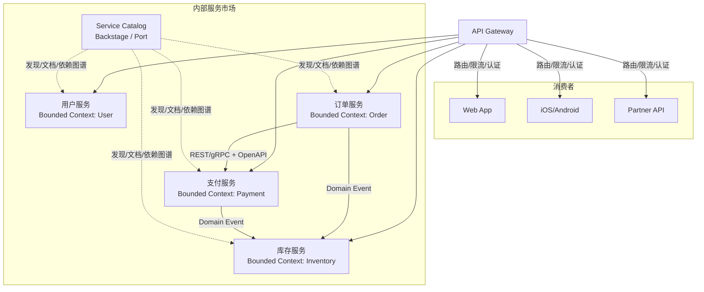
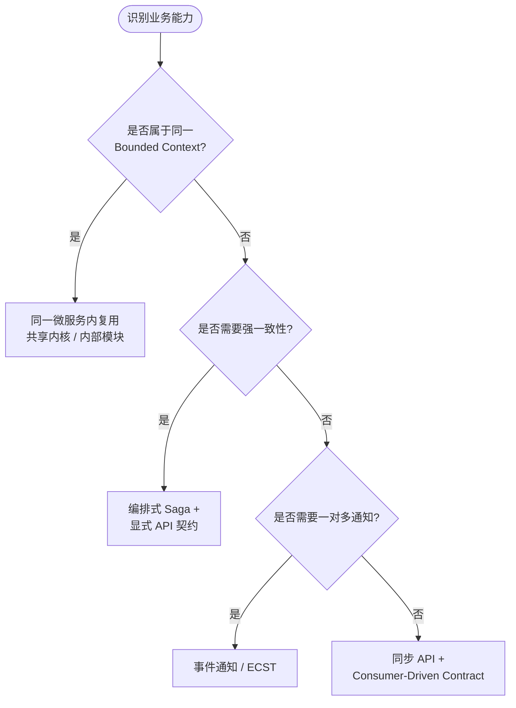

# 微服务架构复用模式

> **版本**: 2026-06-10
> **定位**: 应用架构层（Level 2）—— 微服务粒度边界、复用模式与治理实践
> **对齐标准**: CNCF Cloud Native Trail Map, NIST SP 800-204, ISO/IEC 12207:2026
> **状态**: ✅ 已完成（Phase A 深化）
> **字数**: ~6500字

---

## 目录

- [微服务架构复用模式](#微服务架构复用模式)
  - [目录](#目录)
  - [0. 概念定义](#0-概念定义)
  - [0.1 属性与特征](#01-属性与特征)
  - [0.2 关系与映射](#02-关系与映射)
  - [0.3 解释：微服务复用为什么以契约为核心](#03-解释微服务复用为什么以契约为核心)
    - [核心矛盾：自治与共享的平衡](#核心矛盾自治与共享的平衡)
    - [契约的多层含义](#契约的多层含义)
    - [Bounded Context 与 API 版本策略](#bounded-context-与-api-版本策略)
    - [分布式单体：微服务复用的典型反例](#分布式单体微服务复用的典型反例)
  - [1. 核心概念](#1-核心概念)
    - [1.1 复用粒度边界](#11-复用粒度边界)
  - [2. 核心复用模式](#2-核心复用模式)
    - [2.1 Sidecar 模式](#21-sidecar-模式)
    - [2.2 Ambassador 模式](#22-ambassador-模式)
    - [2.3 Anti-Corruption Layer (ACL)](#23-anti-corruption-layer-acl)
    - [2.4 Strangler Fig 模式](#24-strangler-fig-模式)
  - [3. API 契约复用](#3-api-契约复用)
  - [4. 安全复用约束（NIST SP 800-204 对齐）](#4-安全复用约束nist-sp-800-204-对齐)
  - [5. 更多微服务复用模式](#5-更多微服务复用模式)
    - [5.1 Backend-for-Frontend (BFF) 模式](#51-backend-for-frontend-bff-模式)
    - [5.2 Saga 模式（编排 vs 编舞）](#52-saga-模式编排-vs-编舞)
    - [5.3 CQRS 微服务模式](#53-cqrs-微服务模式)
    - [5.4 API 组合层 (API Composition)](#54-api-组合层-api-composition)
    - [5.5 GraphQL 联邦 (GraphQL Federation)](#55-graphql-联邦-graphql-federation)
  - [6. 微服务拆分与复用决策](#6-微服务拆分与复用决策)
    - [6.1 领域驱动设计 (DDD) 与 Bounded Context](#61-领域驱动设计-ddd-与-bounded-context)
    - [6.2 康威定律与团队结构](#62-康威定律与团队结构)
  - [7. 多语言微服务的复用边界](#7-多语言微服务的复用边界)
    - [7.1 Polyglot Persistence 对复用的影响](#71-polyglot-persistence-对复用的影响)
    - [7.2 Polyglot Programming 对复用的影响](#72-polyglot-programming-对复用的影响)
  - [8. 服务网格 (Service Mesh) 与复用](#8-服务网格-service-mesh-与复用)
    - [8.1 服务网格作为通信模式复用层](#81-服务网格作为通信模式复用层)
    - [8.2 Istio 与 Linkerd 的复用特性对比](#82-istio-与-linkerd-的复用特性对比)
    - [8.3 服务网格中的复用治理](#83-服务网格中的复用治理)
  - [9. 微服务反模式](#9-微服务反模式)
    - [9.1 分布式单体 (Distributed Monolith)](#91-分布式单体-distributed-monolith)
    - [9.2 共享数据库反模式](#92-共享数据库反模式)
    - [9.3 过度拆分 (Nano-services)](#93-过度拆分-nano-services)
    - [9.4 版本地狱 (Version Hell)](#94-版本地狱-version-hell)
  - [10. 事件驱动微服务](#10-事件驱动微服务)
    - [10.1 事件总线作为跨服务复用基础设施](#101-事件总线作为跨服务复用基础设施)
    - [10.2 事件溯源 (Event Sourcing)](#102-事件溯源-event-sourcing)
    - [10.3 事件驱动与请求-驱动的选型](#103-事件驱动与请求-驱动的选型)
  - [11. 微服务治理与复用](#11-微服务治理与复用)
    - [11.1 服务目录 (Service Catalog)](#111-服务目录-service-catalog)
    - [11.2 API 网关治理](#112-api-网关治理)
    - [11.3 消费者驱动契约 (CDC) 实践](#113-消费者驱动契约-cdc-实践)
    - [11.4 标准化运维与 SRE 实践](#114-标准化运维与-sre-实践)
  - [12. 案例研究](#12-案例研究)
    - [12.1 Netflix：从单体到全球微服务平台的复用演进](#121-netflix从单体到全球微服务平台的复用演进)
    - [12.2 Amazon：API 契约驱动的内部服务市场](#122-amazonapi-契约驱动的内部服务市场)
    - [12.3 Uber：从多语言混沌到统一平台的标准化复用](#123-uber从多语言混沌到统一平台的标准化复用)
  - [13. 总结与决策框架](#13-总结与决策框架)
  - [14. 交叉引用](#14-交叉引用)
  - [15. 微服务复用架构与限界上下文 Mermaid 图](#15-微服务复用架构与限界上下文-mermaid-图)
    - [15.1 基于服务目录的微服务复用拓扑](#151-基于服务目录的微服务复用拓扑)
    - [15.2 限界上下文映射与服务复用决策树](#152-限界上下文映射与服务复用决策树)

## 0. 概念定义

**定义**：微服务架构（Microservices Architecture）是一种将单一应用程序构建为**围绕业务能力组织、可独立部署、自治且通过轻量级通信机制协作**的服务集合的架构风格。从复用视角看，微服务的复用单元不再是源代码或类库，而是**服务契约（Service Contract）**：包括 API 定义、事件 Schema、版本约定、SLA 以及运行实例本身。服务的边界应由领域驱动设计（DDD）中的**限界上下文（Bounded Context）**界定，跨边界的复用只能通过显式契约实现，禁止绕过契约直接共享数据库或代码库。

> **形式化表达**：设服务集合为 $M = \\{m_1, m_2, ..., m_k\\}$，每个服务 $m_i$ 拥有独立的数据存储 $D_i$、部署单元 $U_i$ 与公开契约 $C_i$。微服务复用的合法性条件为：
> $$\\text{Reuse}(m_i, m_j) \\Leftrightarrow \\exists C_{ij} \\subseteq C_i \\cap C_j \\land \\nexists D_{ij} \\neq \\emptyset \\land \\nexists U_{ij} \\neq \\emptyset$$
> 即复用仅通过契约交集发生，不允许共享数据存储或部署单元。

Wikipedia 对应条目：

- [Microservices](https://en.wikipedia.org/wiki/Microservices)
- [Service-oriented architecture](https://en.wikipedia.org/wiki/Service-oriented_architecture)
- [Domain-driven design](https://en.wikipedia.org/wiki/Domain-driven_design)

---

## 0.1 属性与特征

| 属性 | 说明 | 重要性 |
|---|---|---|
| **业务能力对齐** | 每个服务对应一个业务能力或限界上下文，边界清晰 | 高 |
| **独立部署** | 服务可独立构建、测试、发布与回滚，变更影响范围可控 | 高 |
| **契约驱动** | 服务间交互必须通过 API 契约或事件契约，契约是复用的唯一合法接口 | 高 |
| **数据自治** | 每个服务拥有独立数据存储，禁止跨服务直接访问数据库 | 高 |
| **版本化兼容** | 契约变更遵循 SemVer 与向后兼容策略，避免版本地狱 | 高 |
| **组织映射** | 服务边界与团队边界对齐，平台团队负责高复用性服务 | 中 |
| **故障隔离** | 单个服务故障不应导致级联崩溃，依赖关系需显式治理 | 中 |

---

## 0.2 关系与映射

| 关系类型 | 目标概念 | 说明 |
|---|---|---|
| **上位概念** | [Service-oriented architecture](https://en.wikipedia.org/wiki/Service-oriented_architecture) | 微服务是 SOA 的轻量级、去 ESB 化演进 |
| **上位概念** | [Distributed computing](https://en.wikipedia.org/wiki/Distributed_computing) | 微服务本质上是遵循特定组织原则的分布式系统 |
| **下位概念** | Bounded Context、Aggregate、Domain Event | 来自 DDD，用于界定服务边界与内部结构 |
| **下位概念** | API Gateway、Service Mesh、Sidecar、BFF | 支撑微服务通信与横切关注点复用的技术模式 |
| **等价/映射概念** | Modular Monolith | 模块化单体是微服务的前置演化形态，二者在内部边界上同构 |
| **依赖概念** | Serverless / FaaS | 微服务可进一步拆分为事件驱动的函数，或反过来由函数组合成服务 |
| **依赖概念** | Event-Driven Architecture | 事件驱动是微服务解耦的核心机制之一 |
| **映射概念** | NIST SP 800-204 | 定义微服务安全策略与服务间通信复用约束 |

---

## 0.3 解释：微服务复用为什么以契约为核心

微服务架构将系统拆分为自治服务后，复用的最大障碍不再是"代码能否共享"，而是"服务能否在保持独立演进的同时被安全复用"。代码级复用（如共享库）在微服务中会引发版本依赖、语言锁定和部署耦合；因此，微服务的复用必须退回到**契约级复用**。

### 核心矛盾：自治与共享的平衡

微服务强调每个服务拥有独立的数据、团队和发布节奏。如果两个服务共享代码库或数据库，它们的边界就被人为打通，自治性随之丧失。复用的正确方式是通过**显式、稳定、可验证的契约**（API、事件 Schema、SLA）实现"松耦合的共享"。

### 契约的多层含义

| 契约层级 | 示例 | 复用含义 |
|---|---|---|
| 协议契约 | REST / gRPC / GraphQL | 决定消费者与服务的技术交互方式 |
| 接口契约 | OpenAPI / Protobuf | 生成类型安全的客户端与服务器 Stub |
| 数据契约 | JSON Schema / Avro | 保证跨服务的数据语义一致 |
| 行为契约 | Pact / CDC | 在 CI 中验证提供者变更不会破坏消费者 |
| 运维契约 | SLA / SLO / 错误预算 | 定义复用服务的可用性与支持责任 |

### Bounded Context 与 API 版本策略

限界上下文是微服务边界的领域语义基础。一个 Bounded Context 内的服务共享同一领域语言，跨 Bounded Context 的复用必须通过"发布语言（Published Language）"——即标准化的 API 或事件 Schema。

API 版本策略应遵循：

1. **向后兼容优先**：新增可选字段，不删除、不修改已有字段语义
2. **SemVer Major 版本**：仅在破坏性变更时提升 Major 版本
3. **弃用窗口**：旧版本至少保留 6-12 个月，并通过监控确认无消费者后下线
4. **消费者驱动契约**：由消费者定义期望，提供者在发布前自动验证兼容性

> **定理 M.0** (Contract Stability): 微服务复用的净收益 $R$ 与契约稳定时间 $T_s$ 成正比，与契约消费者数量 $N$ 成正比，即 $R \\propto T_s \\times N$。

### 分布式单体：微服务复用的典型反例

当多个服务在物理上独立部署，但逻辑上通过共享数据库、同步调用链或共享代码库高度耦合时，就形成了"分布式单体"。这种反例的危害在于：团队承担了微服务的运维复杂度（多服务监控、多流水线、分布式调试），却未获得微服务的自治与复用收益。任何变更仍需协调多个服务同时发布，复用契约形同虚设。避免分布式单体的关键在于：每个服务必须拥有独立的数据存储，服务间交互必须通过 API 或事件契约，禁止绕过契约直接访问对方数据。

---

## 1. 核心概念

微服务架构将应用拆分为**围绕业务能力组织、可独立部署的服务集合**。
与单体架构相比，微服务的复用逻辑发生了本质变化：复用单元从"代码库"转变为"服务契约 + 运行实例"。

NIST SP 800-204 (Security Strategies for Microservices-based Application Systems) 指出：
微服务复用的核心挑战在于**如何在保持服务自治的前提下实现安全、可控的跨团队复用**。

### 1.1 复用粒度边界

| 粒度 | 复用单元 | 适用场景 | 反模式 |
|------|---------|---------|--------|
| 细粒度（函数/类） | 共享 SDK / Sidecar | 横切关注点（日志、监控、认证） | 分布式单体 |
| 中粒度（服务/模块） | 完整微服务 | 用户服务、订单服务、支付服务 | 共享数据库 |
| 粗粒度（服务组/API） | API 网关聚合层 | BFF (Backend for Frontend) | 过度聚合 |

> **定理 M.1** (Service Reuse Granularity): 微服务的复用价值在服务粒度达到"一个业务能力 = 一个服务"时最大。粒度过细导致编排成本超过复用收益；粒度过粗则退化为分布式单体。

---

## 2. 核心复用模式

### 2.1 Sidecar 模式

将横切关注点（如日志、监控、TLS、服务发现）从主服务中剥离，以**独立进程**形式部署在同一 Pod/主机中。

- **复用边界**: Sidecar 二进制镜像
- **典型实现**: Envoy (服务代理), Fluent Bit (日志), OAuth2 Proxy (认证)
- **对齐**: CNCF 推荐的云原生基础模式

### 2.2 Ambassador 模式

Sidecar 的变体，专门用于**代理主服务与外部资源的连接**。例如：主服务通过本地 Ambassador 访问外部数据库，Ambassador 处理连接池、重试、断路等逻辑。

- **复用价值**: 连接逻辑与业务逻辑解耦，同一 Ambassador 可复用于多个服务
- **与 Sidecar 的区别**: Ambassador 代理出向连接，Sidecar 通常代理入向/双向

### 2.3 Anti-Corruption Layer (ACL)

当复用一个遗留系统或外部服务时，在边界处引入**防腐层**，将外部模型转换为内部领域模型。

- **复用价值**: 保护领域模型不被外部变更污染
- **成本**: 需要维护翻译映射，增加一层间接性
- **决策点**: 当外部系统变更频率 > 每季度一次时，ACL 的 ROI 为正

### 2.4 Strangler Fig 模式

逐步用微服务替换遗留系统的功能，通过**拦截层**将流量路由到新服务或旧系统。

- **复用路径**: 旧系统的部分功能被新服务替代后，新服务可被其他业务线复用
- **风险控制**: 回退机制确保替换失败时可切回旧系统

---

## 3. API 契约复用

微服务的真正复用边界是 **API 契约**，而非代码实现。

| 契约层级 | 形式 | 复用方式 |
|---------|------|---------|
| 协议 | REST / gRPC / GraphQL | 技术栈无关复用 |
| 接口定义 | OpenAPI / Protobuf Schema | 生成客户端/服务端 Stub |
| 数据模型 | JSON Schema / DTO | 跨服务共享领域语言 |
| 行为契约 | Pact / Consumer-Driven Contract | 运行时兼容性验证 |

> **定理 M.2** (API Contract Stability): API 契约的复用价值与其稳定性正相关。遵循**语义化版本控制（SemVer）**的 API，其 Major 版本变更应 ≤ 每年 1 次。

---

## 4. 安全复用约束（NIST SP 800-204 对齐）

- **零信任边界**: 即使内部复用，服务间通信也应经过 mTLS + 认证
- **最小权限 Sidecar**: Sidecar 不应拥有超出其代理范围的权限
- **API 网关作为安全复用层**: 统一处理速率限制、审计、威胁检测

---

## 5. 更多微服务复用模式

### 5.1 Backend-for-Frontend (BFF) 模式

BFF 模式由 Sam Newman 和 Phil Calçado 等人推广，其核心思想是为每一种前端体验（Web、iOS、Android、IoT）配置一个专属的后端服务层。该层负责聚合多个下游微服务的调用结果，转换为前端所需的数据模型，并处理前端特有的横切关注点（如缓存策略、数据裁剪、认证适配）。

- **复用边界**: BFF 本身作为复用下游服务的聚合层存在，其复用单元是"面向前端体验的服务编排逻辑"
- **复用收益**: 下游核心服务（用户、订单、库存）无需感知前端差异，实现一次开发、多处复用
- **治理要点**: BFF 不应包含业务逻辑，仅允许数据转换与聚合；禁止在 BFF 中直接访问数据库
- **版本策略**: BFF 与前端应用通常同步发版，采用相同的版本节奏；下游服务变更通过适配层隔离

> **定理 M.3** (BFF Isolation): BFF 的引入将前端变更频率与后端核心服务解耦。当某前端平台（如移动端）迭代周期 < 1 周时，BFF 的 ROI 显著为正。

### 5.2 Saga 模式（编排 vs 编舞）

在微服务架构中，跨服务的业务事务无法依赖传统的 ACID 数据库事务，Saga 模式通过一系列本地事务的协调来实现最终一致性。Saga 的实现方式分为两类：

**编排式 Saga (Orchestration)**

由中央协调器（Orchestrator）统一调度各参与服务执行本地事务，并根据执行结果决定下一步操作或补偿回滚。

- **复用特征**: 协调器脚本（如 Camunda、Netflix Conductor 的流程定义）可在多个业务流程间复用
- **优势**: 流程清晰可见，易于监控与审计；集中式错误处理逻辑统一
- **劣势**: 协调器成为潜在单点瓶颈；新增服务需修改协调器逻辑
- **适用场景**: 流程步骤固定、强监管要求的金融交易、订单履约链路

**编舞式 Saga (Choreography)**

各服务通过事件总线自主响应状态变更，无中央协调器。每个服务完成本地事务后发布领域事件，下游服务监听事件并触发下一步操作。

- **复用特征**: 领域事件（如 `OrderCreated`、`PaymentProcessed`）成为跨服务复用的核心契约
- **优势**: 服务间松耦合，新增服务只需订阅/发布事件即可接入；天然契合事件驱动架构
- **劣势**: 全局事务状态难以追踪；循环依赖与事件风暴风险高；调试复杂度随服务数量指数增长
- **适用场景**: 高吞吐量、低延迟要求的实时系统；服务数量多且演化频繁的平台

| 维度 | 编排式 Saga | 编舞式 Saga |
|------|------------|------------|
| 耦合度 | 协调器与各服务紧耦合 | 服务间通过事件松耦合 |
| 可观测性 | 高（中央状态机） | 低（需分布式链路追踪） |
| 复用单元 | 协调器流程模板 | 领域事件契约 |
| 扩展性 | 受协调器吞吐限制 | 受事件总线吞吐限制 |
| 典型工具 | Camunda, Conductor, Temporal | Kafka, NATS, EventBridge |

> **决策框架**: 当 saga 涉及服务数 ≤ 5 且事务成功率要求 ≥ 99.9% 时，优先选择编排式；当服务数 > 5 且事件契约已标准化时，优先选择编舞式。

### 5.3 CQRS 微服务模式

命令查询职责分离（Command Query Responsibility Segregation, CQRS）将数据写模型与读模型分离，允许为不同访问模式独立优化存储与接口。

- **复用边界**: 读模型（Projection）可被多个前端/BFF 复用，写模型（Aggregate）作为领域核心仅由命令服务维护
- **实现路径**:
  1. 写端接收命令，验证业务规则，持久化事件至事件存储（Event Store）
  2. 事件通过变更数据捕获（CDC）或事件总线同步至读端
  3. 读端根据查询需求构建物化视图（Materialized View），可采用与写端不同的数据库技术
- **复用风险**: 读模型与写模型的最终一致性窗口（通常为毫秒至秒级）需在前端/BFF 层做适配；读模型 schema 变更需与事件 schema 变更联动
- **对齐标准**: ISO/IEC 12207:2026 中关于数据视图分离的架构原则

### 5.4 API 组合层 (API Composition)

API 组合层是 BFF 的泛化形式，不仅面向前端，也面向外部合作伙伴与内部其他系统。其核心职责是将多个细粒度微服务的 API 聚合成一个粗粒度的、符合特定业务场景的复合 API。

- **复用模式**: 组合层作为下游服务的"消费者"，其复用单元是"聚合逻辑 + 缓存策略 + 降级策略"
- **性能考量**: 串行调用下游服务的延迟呈线性累加，需采用并行异步调用（如 Java CompletableFuture、Go goroutines、Python asyncio）或响应式编程（Reactor、RxJava）
- **容错机制**: 组合层必须实现熔断（Circuit Breaker）、舱壁隔离（Bulkhead）与优雅降级（Graceful Degradation），避免单个下游故障导致整体组合层不可用
- **缓存策略**: 对读密集型组合结果实施多级缓存（本地 Caffeine + 分布式 Redis），缓存失效策略需与下游数据变更事件联动

### 5.5 GraphQL 联邦 (GraphQL Federation)

GraphQL Federation 允许将多个独立的 GraphQL 服务（Subgraph）组合成一个统一的 Supergraph，客户端通过单一端点查询跨服务的数据关系。

- **复用边界**: 每个 Subgraph 的 Schema 及其解析器（Resolver）是复用单元；Supergraph 网关作为组合与路由层
- **核心概念**:
  - **@key**: 定义实体在 Subgraph 间共享的主键
  - **@extends / @external**: 允许一个 Subgraph 扩展另一个 Subgraph 的实体类型
  - **Gateway**: Apollo Router 或 Netflix DGS GraphQL Gateway 负责查询规划与分布式执行
- **复用优势**: 前端通过一个 GraphQL 查询即可获取跨服务的关联数据，避免了传统 REST 的 N+1 请求问题；Subgraph 可独立演进，只要满足联邦契约
- **治理挑战**: Schema 冲突检测、查询复杂度限制（Query Cost Analysis）、联邦网关的单点故障风险
- **安全约束**: 网关层需实施查询深度限制、字段级访问控制（Field-Level Authorization）与查询成本配额，防止恶意复杂查询耗尽后端资源

---

## 6. 微服务拆分与复用决策

### 6.1 领域驱动设计 (DDD) 与 Bounded Context

领域驱动设计（Domain-Driven Design）为微服务拆分提供了理论根基。Bounded Context（限界上下文）是 DDD 的核心战略模式，它定义了领域模型的显式边界，在该边界内领域术语、业务规则与数据模型保持一致。

- **复用边界 = Bounded Context 边界**: 一个 Bounded Context 对应一个微服务（或一个服务组），这是复用的天然粒度。跨 Bounded Context 的复用不通过共享数据库或共享代码实现，而只能通过显式的 API 契约或事件契约。
- **上下文映射 (Context Mapping)**: 不同 Bounded Context 之间的集成关系决定了复用模式的选择：
  - **合作关系 (Partnership)**: 双向依赖，双方团队协同演进，适合核心域之间
  - **共享内核 (Shared Kernel)**: 共享部分领域模型代码，适用于紧密关联的子域，但需严格控制变更流程
  - **客户-供应商 (Customer-Supplier)**: 下游作为客户对上游提出需求，上游服务优先保障下游契约稳定
  - **防腐层 (ACL)**: 上游模型与下游模型差异较大时，下游引入 ACL 进行模型翻译
  - **开放主机服务 (Open Host Service)**: 上游通过标准化的 API（如 REST/OpenAPI）对外暴露服务，便于多下游复用
  - **发布语言 (Published Language)**: 与开放主机服务配合，提供稳定、文档化的交换格式（如 Protobuf、JSON Schema）
- **战略复用原则**: 核心域（Core Domain）内的服务复用价值最高，应投入最多治理资源；通用子域（Generic Subdomain）可考虑外购 SaaS 或采用标准化开源方案，避免自建；支撑子域（Supporting Subdomain）应最小化投入，内部复用即可。

> **定理 M.4** (Bounded Context Reuse): 当两个微服务共享同一数据库 schema 或同一领域模型代码库时，它们本质上属于同一个 Bounded Context，复用边界已失效。

### 6.2 康威定律与团队结构

Melvin Conway 于 1967 年提出："设计系统的组织，其产生的设计等同于组织之间的沟通结构。"在微服务架构中，康威定律意味着服务的边界往往会映射为团队的边界。

- **逆康威定律 (Inverse Conway Maneuver)**: 有意识地调整团队结构以塑造期望的架构。若希望某服务被多个业务线复用，则应将该服务的维护团队设为独立平台团队（Platform Team），而非隶属于某一业务线。
- **团队拓扑 (Team Topologies)**:
  - **业务流团队 (Stream-aligned Team)**: 面向特定业务价值流，端到端负责功能交付，复用平台团队提供的服务
  - **平台团队 (Platform Team)**: 提供高复用性的内部服务（如用户中心、支付网关、消息推送），以产品思维运营内部平台
  - **赋能团队 (Enabling Team)**: 帮助业务流团队掌握新技术（如 DDD、SRE、安全），不直接交付业务功能
  - **复杂子系统团队 (Complicated Subsystem Team)**: 负责需要深度专业知识的组件（如推荐算法引擎、视频编解码），以服务的形式对外输出能力
- **复用组织保障**: 跨团队复用需要明确的内部服务级别协议（Internal SLA），包括可用性目标（SLO）、错误预算（Error Budget）、响应时间（SLI）与升级路径（Escalation Path）。没有组织契约保障的复用是不可持续的。
- **康威定律的约束**: 若组织内部存在严重的部门墙与信息孤岛，微服务拆分过细将导致跨团队协调成本急剧上升，最终退化为"分布式单体"——物理上独立部署，逻辑上高度耦合。

---

## 7. 多语言微服务的复用边界

### 7.1 Polyglot Persistence 对复用的影响

Polyglot Persistence 指根据数据访问模式选择最适合的存储技术。微服务架构天然支持这一策略，因为每个服务拥有独立的数据存储。

- **复用单元变化**: 复用不再局限于"共享数据库表"，而是"共享数据契约（事件/API）+ 独立存储实现"
- **典型存储映射**:

  | 数据特征 | 推荐存储 | 适用服务 |
  |---------|---------|---------|
  | 强事务关系型数据 | PostgreSQL, CockroachDB | 订单、支付、账务 |
  | 高吞吐键值访问 | Redis, DynamoDB | 会话、缓存、购物车 |
  | 文档型半结构化数据 | MongoDB, Couchbase | 内容管理、商品目录 |
  | 图关系查询 | Neo4j, Amazon Neptune | 社交网络、推荐关系 |
  | 时序数据 | TimescaleDB, InfluxDB | 监控、IoT 遥测 |
  | 搜索与分析 | Elasticsearch, OpenSearch | 全文检索、日志分析 |

- **复用风险**: 跨服务的数据一致性需通过 Saga 或事件溯源保证；运维复杂度随存储种类增加而上升；团队需掌握多种数据库的运维与调优技能
- **治理策略**: 建立组织级的"技术雷达"，明确允许使用的存储技术清单（Technology Radar Approved List）；平台团队提供标准化的数据库即服务（DBaaS）接口与备份恢复方案，降低业务团队采用新存储的门槛

### 7.2 Polyglot Programming 对复用的影响

Polyglot Programming 指在微服务架构中使用多种编程语言，允许团队根据服务特性选择最适合的语言运行时。

- **复用挑战**: 语言异构导致代码级复用（如共享库、SDK）极为困难。同一认证逻辑在 Java、Go、Python、Node.js 中需分别实现，增加了安全漏洞与行为不一致的风险。
- **复用策略转换**:
  - **从代码复用转向 Sidecar 复用**: 将语言无关的能力（如 mTLS、认证、日志、指标采集）下沉至 Sidecar 代理（Envoy + WASM 扩展），实现跨语言复用
  - **从共享库转向 API 契约复用**: 通过 gRPC/Protobuf 或 OpenAPI 定义跨语言的服务边界，利用代码生成工具生成各语言的客户端 Stub
  - **标准化运行时框架**: 组织层面规定每种语言的标准框架（如 Java → Spring Boot + Micrometer, Go → Gin/gRPC + OpenTelemetry, Python → FastAPI + Pydantic），框架内置横切关注点实现，减少重复造轮子
- **决策原则**: 当某语言生态在组织内维护者 < 3 人时，禁止新增该语言的服务；存量异构语言服务应通过 Sidecar 和标准化 API 接入统一治理体系，而非强制重写。

---

## 8. 服务网格 (Service Mesh) 与复用

### 8.1 服务网格作为通信模式复用层

服务网格（Service Mesh）将服务间通信的横切关注点（如负载均衡、服务发现、熔断、重试、超时、 mTLS、可观测性）从应用代码中完全剥离，下沉至基础设施层（Sidecar 代理或 eBPF 内核扩展）。

- **复用范式变革**: 传统微服务中，每个服务需自行实现或引入客户端库（如 Hystrix、Ribbon、Feign）来处理通信逻辑；服务网格将这些逻辑统一为平台级复用层，应用服务仅需关注业务逻辑。
- **核心控制平面**: Istio（基于 Envoy）、Linkerd（轻量级 Rust 实现）、Consul Connect 提供流量管理、策略执行与遥测收集的统一控制平面。
- **数据平面复用**: 数据平面代理（Sidecar 或 Proxyless gRPC）作为所有服务间通信的媒介，其实现可被全集群服务无差别复用。

### 8.2 Istio 与 Linkerd 的复用特性对比

| 维度 | Istio | Linkerd |
|------|-------|---------|
| 架构复杂度 | 高（多组件：istiod、Ingress Gateway、Egress Gateway） | 低（单控制平面组件） |
| 资源开销 | 较高（Envoy 内存占用 ~50-150MB/实例） | 较低（Rust 原生代理 ~10-30MB/实例） |
| 功能丰富度 | 丰富（Wasm 扩展、多集群、金丝雀发布、A/B 测试） | 适中（聚焦核心连通性、安全性、可靠性） |
| 复用适用场景 | 大规模、多集群、多租户云平台 | 中小规模、资源敏感、快速落地的平台 |
| mTLS 默认开启 | 是（自动证书轮转） | 是（自动证书轮转） |
| 流量策略 | VirtualService / DestinationRule 精细控制 | ServiceProfile 简洁配置 |

### 8.3 服务网格中的复用治理

- **可观测性复用**: 服务网格自动生成统一的 L7 指标（请求率、延迟、错误率、饱和度，即 RED 指标）与分布式追踪上下文注入，无需应用代码修改即可实现全链路可观测性
- **安全策略复用**: 通过 AuthorizationPolicy 定义服务间访问控制（如 "支付服务仅允许订单服务调用"），策略作为可版本化的 YAML 资源在集群间复用
- **流量管理复用**: 金丝雀发布、蓝绿部署、故障注入（Chaos Engineering）的流量规则可在多个服务间复用同一套模板
- **成本考量**: Sidecar 模式带来的资源 overhead（通常为业务容器内存的 20%-50%）需纳入容量规划；对于超高吞吐服务（>10万 RPS），可考虑 Proxyless 模式（gRPC 直连控制平面）或 eBPF 方案（Cilium Service Mesh）以降低延迟。

> **定理 M.5** (Mesh Reuse Threshold): 当微服务数量 > 20 且跨服务调用占比 > 40% 时，引入服务网格的运维收益将超过其部署与运维成本。

---

## 9. 微服务反模式

### 9.1 分布式单体 (Distributed Monolith)

分布式单体是微服务拆分失败的典型结果：服务虽独立部署，但存在高度耦合的代码依赖、数据库共享或同步调用链，导致任何单一服务的变更都可能引发级联修改与协同发布。

- **识别信号**:
  - 修改一个服务需要同时发布 3 个以上其他服务
  - 服务间存在共享代码库（非标准化 SDK）
  - 存在跨服务数据库 join 查询或外键约束
  - 端到端测试覆盖全部服务链路，无法独立服务测试
- **复用危害**: 表面上实现了服务复用，实际上复用的是"耦合的代码与数据"，变更成本与单体相当，但运维复杂度远高于单体
- **治理策略**: 逐步引入 ACL 隔离共享模型；将同步调用转换为异步事件；通过 Strangler Fig 模式解耦紧密耦合的服务组

### 9.2 共享数据库反模式

多个微服务直接访问同一数据库 schema，绕过了服务边界与 API 契约。

- **复用假象**: 团队误以为"共享表 = 复用数据"，实际上丧失了服务的自治性、独立扩展能力与独立技术演进能力
- **风险传导**: 一个服务的慢查询或长事务会拖垮其他服务的可用性；schema 变更需协调所有相关服务同时发布
- **纠正路径**: 为每个服务分配独立的数据库实例或逻辑隔离的 schema；通过 CDC（Debezium、AWS DMS）将数据变更发布为事件，供其他服务订阅

### 9.3 过度拆分 (Nano-services)

将微服务拆分得过于细粒度，单个服务仅包含极少数 API 端点或函数，导致编排与通信成本远超业务价值。

- **识别标准**: 当服务的平均代码量 < 1000 行、API 端点 < 3 个、且 50% 以上请求为跨服务调用时，存在过度拆分
- **成本分析**: 每个独立服务都需要 CI/CD 流水线、监控告警、日志收集、安全配置、版本管理，边际成本随服务数量线性增长
- **复用困境**: 过度细粒度的服务难以被其他团队直接复用，因为组合成本过高；应向上聚合为具有完整业务能力的"业务能力服务"

### 9.4 版本地狱 (Version Hell)

当服务的多个 Major 版本同时在线，且各下游消费者分散在不同版本时，维护成本呈指数级增长。

- **成因**: API 设计初期未遵循向后兼容原则；缺少消费者驱动契约（CDC）验证；缺乏弃用（Deprecation）与迁移计划
- **症状**: 同一服务需维护 v1/v2/v3 三套实现；数据库 schema 需同时兼容多个版本的读写模式；消费者团队拒绝迁移至新版本
- **治理策略**:
  - 所有 API 变更遵循**扩展-弃用-移除**三阶段生命周期（至少保留 2 个 Major 版本）
  - 引入 API 网关进行版本路由，隐藏后端版本差异
  - 强制实施语义化版本（SemVer），并在 CI 中集成向后兼容性检查工具（如 breaking-change-detector、buf breaking）
  - 通过 CDC（Pact、Spring Cloud Contract）确保新版本的发布不会破坏现有消费者

---

## 10. 事件驱动微服务

### 10.1 事件总线作为跨服务复用基础设施

事件总线（Event Bus）是事件驱动微服务架构的核心基础设施，它解耦了服务的生产与消费关系，使事件成为跨服务复用的第一类契约。

- **复用单元**: 领域事件（Domain Event）的 Schema 与语义定义
- **核心能力**:
  - **发布-订阅 (Pub/Sub)**: 一个事件可被多个独立消费者订阅，实现"一次生产、多处复用"
  - **事件持久化**: Kafka、Pulsar 等日志型消息系统提供高吞吐、高可用的持久化事件流，支持事件回溯与重放
  - **Schema 治理**: 通过 Schema Registry（Confluent Schema Registry、AWS Glue Schema Registry）管理 Avro/Protobuf/JSON Schema 的演进，防止生产者与消费者之间的 schema 不兼容
- **事件设计原则**:
  - **事件命名**: 采用过去时态动词 + 领域名词（如 `OrderPlaced`、`InventoryReserved`），明确表达"已发生的业务事实"
  - **事件负载**: 包含事件元数据（eventId、timestamp、correlationId、sourceService）与业务负载；避免在事件中嵌入过多嵌套实体，保持扁平化
  - **不可变性**: 领域事件一旦发布即不可修改，错误修正通过补偿事件实现

### 10.2 事件溯源 (Event Sourcing)

事件溯源将系统状态的变化建模为一系列不可变的事件，系统的当前状态可通过重放所有历史事件推导得出。

- **复用优势**: 事件日志成为系统演化的完整审计轨迹，可被新服务消费以构建自己的物化视图；历史事件重放支持系统状态的任意时间点恢复（Time Travel）
- **架构组件**:
  - **事件存储 (Event Store)**: 专用数据库（EventStoreDB）或 Kafka 主题，保证事件的顺序性与不可变性
  - **聚合根 (Aggregate)**: 通过加载历史事件并应用事件处理器来恢复当前状态
  - **投影器 (Projector)**: 监听事件流并更新读端物化视图
- **复用风险**: 事件 schema 的演进需要极其谨慎，因为历史事件不可修改；schema 变更需同时支持旧事件格式的反序列化与新事件格式的序列化；全局快照（Snapshot）策略需平衡存储与恢复性能

### 10.3 事件驱动与请求-驱动的选型

| 维度 | 请求-驱动 (REST/gRPC) | 事件驱动 (Message Queue/Event Bus) |
|------|----------------------|-----------------------------------|
| 耦合度 | 紧耦合（调用方需知道被调用方地址） | 松耦合（仅依赖事件 schema） |
| 实时性 | 同步响应，低延迟 | 最终一致性，延迟取决于消息传递 |
| 复用模式 | 点对点调用 | 一对多广播 |
| 容错性 | 被调用方故障直接影响调用方 | 消费者可离线，消息持久化后可恢复 |
| 调试难度 | 低（调用链清晰） | 高（需分布式追踪与事件审计日志） |
| 典型场景 | 查询、实时交易验证 | 状态通知、异步处理、数据同步 |

> **混合模式**: 大多数生产级微服务平台采用请求-驱动与事件驱动的混合架构。命令（写操作）通过事件驱动实现最终一致性，查询（读操作）通过 REST/gRPC 实现同步响应。

---

## 11. 微服务治理与复用

### 11.1 服务目录 (Service Catalog)

服务目录是微服务治理的基础设施，它提供全组织范围内所有服务的统一发现、文档与元数据管理能力。

- **核心功能**:
  - **服务注册**: 自动从 Kubernetes、服务网格或 CI/CD 流水线中同步服务清单，包括服务名称、所有者、技术栈、依赖关系、API 端点
  - **API 文档聚合**: 自动收集各服务的 OpenAPI、AsyncAPI、GraphQL Schema，提供统一检索入口
  - **依赖图谱**: 可视化服务间的调用关系与事件订阅关系，识别循环依赖与单点故障
  - **所有权映射**: 明确每个服务的开发团队、值班轮次（On-call Rotation）、SLA 等级
- **开源/商业方案**: Backstage（Spotify 开源，CNCF 孵化项目）、Port、OpsLevel、Cortex
- **复用价值**: 降低服务发现成本，新团队或新项目可通过服务目录快速识别可复用的内部服务；避免重复建设功能等价的服务

### 11.2 API 网关治理

API 网关不仅是流量入口，更是微服务复用的治理枢纽。

- **网关分层策略**:
  - **边缘网关 (Edge Gateway)**: 面向外部客户端，处理 TLS 终止、DDoS 防护、Bot 检测、全局速率限制
  - **内部网关 (Internal Gateway)**: 面向服务间通信，处理认证授权、内部路由、服务级别速率限制
  - **BFF 网关 (Experience Gateway)**: 面向特定前端平台，处理协议适配、数据聚合、缓存策略
- **治理实践**:
  - **统一认证**: 通过网关集成 OAuth2/OIDC，向下游服务传递标准化身份令牌（如 JWT），避免每个服务独立实现认证
  - **速率限制分级**: 按消费者类型（外部合作伙伴、内部业务线、平台服务）设置不同的配额策略
  - **API 生命周期管理**: 在网关层实施版本路由、弃用通知、灰度发布与流量镜像
  - **可观测性**: 网关作为所有请求的必经节点，天然适合收集全量访问日志、延迟分布、错误率趋势
- **技术选型**: Kong、Tyk、Apache APISIX（开源）；AWS API Gateway、Azure API Management、Google Cloud Endpoints（托管）；Envoy Gateway、Istio Ingress Gateway（云原生）

### 11.3 消费者驱动契约 (CDC) 实践

消费者驱动契约（Consumer-Driven Contracts, CDC）是一种验证服务间兼容性的方法论：消费者定义其对提供者 API 的期望契约，契约测试在提供者的 CI 流水线中运行，确保提供者的变更不会破坏任何消费者。

- **核心流程**:
  1. 消费者编写契约文件（Pact 文件），描述其对提供者 API 的请求与期望响应
  2. 契约上传至 Pact Broker（契约仓库），Pact Broker 维护消费者与提供者的版本兼容矩阵
  3. 提供者在 CI 中运行契约验证（Provider Verification），验证其实际实现是否满足所有消费者的契约期望
  4. 部署前通过 Pact Broker 的"Can I Deploy"检查，确认待部署版本与消费者现有版本的兼容性
- **复用保障**: CDC 将兼容性验证左移至 CI 阶段，避免不兼容的 API 变更流入生产环境；消费者可安全地复用提供者的服务，因为契约提供了可自动验证的兼容性保证
- **事件驱动 CDC**: Pact 不仅支持 REST/HTTP 契约，也支持消息契约（Message Pact），用于验证事件生产者与消费者之间的 schema 与语义一致性
- **组织实践**: 建立"契约即代码"文化，契约文件与业务代码同一仓库管理，变更需经过代码评审；平台团队维护 Pact Broker 与契约测试模板，降低业务团队的接入门槛

### 11.4 标准化运维与 SRE 实践

微服务的复用不仅涉及开发阶段，更涉及运维阶段的可靠性保障。

- **标准化可观测性**: 所有服务统一暴露 RED 指标（Rate, Errors, Duration）与 USE 指标（Utilization, Saturation, Errors），使用 OpenTelemetry 采集 traces、logs、metrics，接入统一的可观测性平台（Grafana Stack、Datadog、New Relic）
- **混沌工程**: 通过 Chaos Mesh、Litmus、Gremlin 定期对服务进行故障注入（网络延迟、服务宕机、CPU/内存压力），验证复用链路的容错能力与降级策略
- **容量规划**: 建立基于历史流量趋势与业务增长的容量规划模型，为高频复用的核心服务预留足够的弹性伸缩空间
- **事故响应**: 标准化的事故响应流程（Incident Response Runbook），明确跨团队复用服务发生故障时的升级路径与回滚策略

---

## 12. 案例研究

### 12.1 Netflix：从单体到全球微服务平台的复用演进

Netflix 是微服务架构的先驱之一，其技术演进为大规模微服务复用提供了经典范本。

- **演进路径**: 2008 年因数据库 corruption 导致 DVD 租赁业务中断 3 天，Netflix 启动从单体 Oracle 架构向 AWS 云原生微服务的迁移，至 2016 年完成全面微服务化。
- **复用基础设施**:
  - **Eureka**: 服务注册与发现，支持数千个服务的动态寻址
  - **Hystrix**: 熔断器模式的开源实现，将容错逻辑标准化为可复用的客户端库（后演进为 resilience4j 及自适应并发限制）
  - **Zuul**: API 网关，处理边缘路由、认证、负载削减（Load Shedding）
  - **Conductor**: 微服务编排引擎，支持复杂 Saga 工作流的可视化定义与执行
  - **Spinnaker**: 多云持续交付平台，将部署流水线标准化为可复用的模板
- **关键经验**:
  - 平台团队（Platform Team）模式是内部复用可持续的组织保障；Netflix 的平台团队以服务化方式提供上述基础设施，业务团队按需接入
  - "共享库优于共享服务"在早期加速了复用，但也带来了版本升级困难；Netflix 后来将更多横切关注点下沉至 Sidecar 与服务网格
  - 混沌工程（Chaos Engineering）成为验证跨服务复用链路韧性的标准实践，Simian Army（后演进为 Chaos Monkey、Chaos Kong）定期随机终止实例以检验系统自愈能力

### 12.2 Amazon：API 契约驱动的内部服务市场

Amazon 在 2002 年通过 Jeff Bezos 的"API 宣言"（API Mandate）强制要求所有团队通过服务接口暴露功能，奠定了其微服务与内部复用的文化基础。

- **API 宣言核心原则**:
  - 所有团队必须通过服务接口暴露其数据与功能
  - 团队间禁止通过数据库或其他后端通道直接通信
  - 所有服务接口必须设计成可外部化（即未来可开放给外部开发者）
  - 不遵守以上规则者将被解雇
- **内部服务市场**: Amazon 内部形成了庞大的服务目录，团队可像"购物"一样发现与复用其他团队的服务。AWS 本身即是 Amazon 内部基础设施服务外部化的产物（EC2 源于内部计算平台，S3 源于内部存储平台）。
- **两披萨团队 (Two-Pizza Team)**: 团队规模控制在两张披萨能喂饱的人数（6-10 人），确保团队规模与服务边界匹配，降低跨团队协调成本
- **关键经验**:
  - 强制的 API 契约文化是实现大规模跨团队复用的前提；没有契约，就没有可复用的服务边界
  - 内部服务的"产品化"思维至关重要：每个服务必须有明确的文档、SLA、定价模型（内部转移定价）与技术支持渠道
  - Amazon 的 API Gateway、AWS App Mesh 等云产品直接来源于其内部微服务治理实践的外部化

### 12.3 Uber：从多语言混沌到统一平台的标准化复用

Uber 的早期快速增长导致技术栈极度分散（Python、Node.js、Go、Java 并存），服务间缺乏统一标准，形成了典型的分布式单体困境。

- **问题诊断**:
  - 数百个微服务使用 7+ 种编程语言，共享库无法跨语言复用
  - 服务间通过多种协议（HTTP JSON、gRPC、Thrift）通信，缺乏统一的流量管理、认证与可观测性
  - 添加一个新的横切关注点（如 GDPR 数据删除）需要修改数百个服务的代码，实施周期长达数月
- **治理转型**: Uber 启动"统一平台"（Unified Platform）计划：
  - **语言收敛**: 后端服务统一至 Go（高吞吐）与 Java（复杂业务），禁止新增其他语言的新服务
  - **标准化框架**: 推出适用于 Go 和 Java 的内部框架（如 Go 的 Fx 框架、Java 的 UForward 框架），内置日志、指标、追踪、配置管理、服务发现
  - **通用工作流平台**: 基于 Cadence（后开源为 Temporal）构建统一的 Saga 编排平台，替代各业务线自研的分散工作流实现
  - **统一网关**: 将所有服务接入统一的内部网关层，实现标准化的认证、授权、速率限制与流量管控
- **关键经验**:
  - 多语言异构在初期提供了灵活性，但在规模扩大后成为复用与治理的最大障碍；标准化与收敛是大规模复用的必经之路
  - 平台团队提供的标准化框架比强制规范更有效，因为框架将最佳实践编码为默认行为
  - 存量异构服务的治理应采用渐进式策略（Strangler Fig），而非大爆炸式重写；Uber 通过 Sidecar 代理将存量服务逐步接入统一治理体系

---

## 13. 总结与决策框架

微服务架构中的复用是一项系统性工程，涉及技术边界、组织协同与治理机制的多维平衡。以下决策框架可指导实践：

| 决策场景 | 推荐策略 | 关键考量 |
|---------|---------|---------|
| 横切关注点（认证、日志、监控） | Sidecar / Service Mesh 复用 | 语言无关、运维集中、版本统一 |
| 跨团队业务能力复用（用户、支付） | 标准化 API 契约 + 内部 SLA | 组织保障、平台团队、服务目录 |
| 遗留系统逐步现代化 | Strangler Fig + ACL | 风险控制、回退机制、渐进迁移 |
| 前端体验多样化 | BFF + API 组合层 | 前端-后端解耦、缓存与降级 |
| 复杂跨服务事务 | Saga（编排或编舞） | 一致性要求、可观测性、补偿设计 |
| 数据访问模式差异大 | CQRS + Polyglot Persistence | 读写分离、最终一致性窗口 |
| 多语言服务生态 | 标准化 API + Sidecar + 框架模板 | 语言收敛计划、平台团队支持 |
| 大规模服务治理 | Service Mesh + 服务目录 + CDC | 基础设施成本、组织成熟度 |

> **最终原则**: 微服务的复用不是"共享代码越多越好"，而是"在正确的边界上以正确的契约实现可控的复用"。复用的目标是降低变更成本与交付周期，而非追求形式上的代码共享。

---

---

## 14. 交叉引用

- [01 分层架构复用模式](../01-layered-architecture/layered-architecture-reuse.md)：微服务内部仍可保留 Clean / Onion 分层
- [04 Serverless 架构复用模式](../04-serverless/serverless-reuse-patterns.md)：微服务与 Serverless/FaaS 的混合复用策略
- [06 事件驱动架构复用模式](../06-event-driven/reuse-patterns.md)：事件驱动作为微服务解耦与复用的核心机制
- [08 服务网格通信模式](../08-service-mesh/service-mesh-communication-patterns.md)：服务网格对微服务通信模式的复用
- [09 EDA/CQRS 事件溯源模式](../09-eda-cqrs/eda-cqrs-event-sourcing-patterns.md)：微服务中的 CQRS 与 Event Sourcing 复用
- [11 IDP 实践](../11-idp-practices/backstage-port-cortex.md)：服务目录与内部开发者平台对微服务复用的治理支撑

---

## 15. 微服务复用架构与限界上下文 Mermaid 图

### 15.1 基于服务目录的微服务复用拓扑

### 15.2 限界上下文映射与服务复用决策树

---

> **版本**: 2026-07-07
> **最后更新**: 2026-07-07
> **状态**: ✅ 已完成（Phase A 深化 + 内容要素补全）
> **字数**: ~6500字
>
> 权威来源:
>
> - [Microservices - Wikipedia](https://en.wikipedia.org/wiki/Microservices) (核查日期: 2026-07-07)
> - [Service-oriented architecture - Wikipedia](https://en.wikipedia.org/wiki/Service-oriented_architecture) (核查日期: 2026-07-07)
> - [Domain-driven design - Wikipedia](https://en.wikipedia.org/wiki/Domain-driven_design) (核查日期: 2026-07-07)
> - <https://landscape.cncf.io> (CNCF Cloud Native Trail Map, 核查日期: 2026-07-07)
> - <https://csrc.nist.gov/publications/detail/sp/800-204/final> (NIST SP 800-204 Security Strategies for Microservices-based Application Systems, 核查日期: 2026-07-07)
> - <https://docs.microsoft.com/en-us/azure/architecture/patterns/anti-corruption-layer> (Microsoft Azure Architecture Patterns - Anti-Corruption Layer, 核查日期: 2026-07-07)
> - <https://microservices.io/patterns/> (Microservices.io - Patterns Catalog by Chris Richardson, 核查日期: 2026-07-07)
> - <https://martinfowler.com/bliki/BoundedContext.html> (Martin Fowler - Bounded Context, 核查日期: 2026-07-07)
> - <https://istio.io/latest/docs/> (Istio Documentation, 核查日期: 2026-07-07)
> - <https://linkerd.io/2.14/overview/> (Linkerd Documentation, 核查日期: 2026-07-07)
> - <https://netflixtechblog.com/> (Netflix Tech Blog - Microservices and Platform Engineering, 核查日期: 2026-07-07)
> - <https://www.uber.com/en-US/blog/unified-platform/> (Uber Engineering Blog - Unified Platform, 核查日期: 2026-07-07)
> - <https://docs.pact.io/> (Pact - Consumer Driven Contracts, 核查日期: 2026-07-07)
> - <https://backstage.io/docs/> (Backstage - Service Catalog and Developer Portal, 核查日期: 2026-07-07)
> - <https://docs.confluent.io/platform/current/schema-registry/index.html> (Confluent Schema Registry, 核查日期: 2026-07-07)
> - <https://docs.temporal.io/> (Temporal - Microservices Orchestration Platform, 核查日期: 2026-07-07)
> - <https://www.apollographql.com/docs/federation/> (Apollo GraphQL Federation, 核查日期: 2026-07-07)
> - <https://teamtopologies.com/> (Team Topologies - Organizing Business and Technology Teams, 核查日期: 2026-07-07)
> - <https://www.amazon.com/Building-Microservices-Designing-Fine-Grained-Systems/dp/1492034029> (Sam Newman - Building Microservices, 2nd Edition, O'Reilly Media, 2021)
