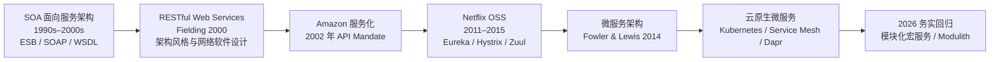
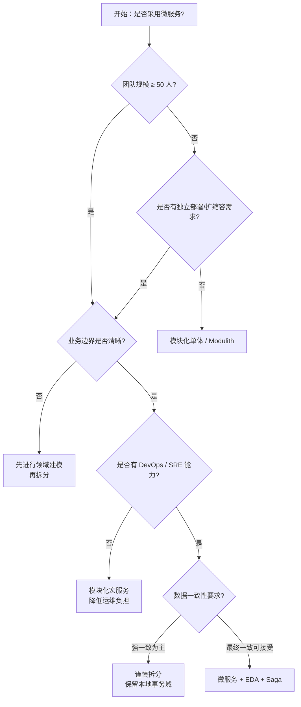
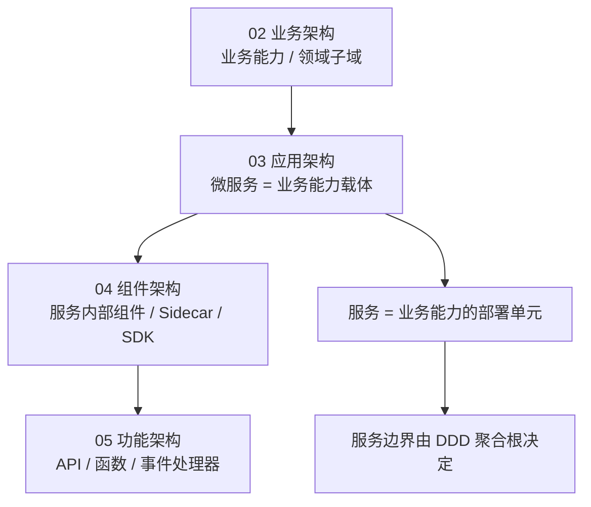

# 微服务架构复用模式

> **版本**: 2026-07-07
> **定位**: 03 应用架构复用的基础子主题 —— 微服务架构（Microservices Architecture）的复用模式、边界与决策
> **对齐标准**: CNCF, NIST SP 800-204, ISO/IEC 25010:2023
> **来源 URL**:
>
> - CNCF: <https://www.cncf.io/>
> - NIST SP 800-204: <https://csrc.nist.gov/publications/detail/sp/800-204/final>
> - ISO 25010: <https://www.iso.org/standard/78175.html>
> **核查日期**: 2026-07-07

---

## 目录

- [微服务架构复用模式](#微服务架构复用模式)
  - [1. 概念定义（CARC 本体）](#1-概念定义carc-本体)
  - [2. 概念谱系与学术来源](#2-概念谱系与学术来源)
  - [3. 核心复用模式](#3-核心复用模式)
  - [4. 服务边界与复用粒度](#4-服务边界与复用粒度)
  - [5. 正向示例](#5-正向示例)
  - [6. 反例与失败案例](#6-反例与失败案例)
  - [7. 多维对比矩阵](#7-多维对比矩阵)
  - [8. 场景决策树](#8-场景决策树)
  - [9. 与四层架构的关系](#9-与四层架构的关系)
  - [10. 权威来源](#10-权威来源)

---

## 1. 概念定义（CARC 本体）

### 1.1 微服务架构（Microservices Architecture）

**定义**：微服务架构是一种将单一应用程序构建为**一组小型服务**的架构风格，每个服务运行在自己的进程中，服务间通过轻量级机制（通常是 HTTP/REST 或消息传递）通信。每个服务围绕**业务能力**构建，可独立部署、扩展和演化。

**属性**：

| 属性 | 说明 |
|------|------|
| **服务（Service）** | 围绕业务能力组织的自治单元 |
| **独立部署** | 每个服务可独立构建、测试、部署 |
| **去中心化数据管理** | 每个服务拥有并管理自己的数据 |
| **轻量级通信** | HTTP/gRPC/消息代理，避免重量级 ESB |
| **容错设计** | 服务故障应隔离，不影响整体可用性 |

**关系**：

- **owns**（拥有）：服务拥有其数据存储。
- **calls**（调用）：服务通过同步或异步方式调用其他服务。
- **shares**（共享）：服务通过事件或 API 共享业务能力。
- **composes**（组合）：多个服务组合成更高层业务能力。

**约束**：

1. **单一职责约束**：每个服务应只负责一个业务能力。
2. **接口契约约束**：服务间通信必须基于稳定的 API 契约。
3. **数据隔离约束**：禁止服务直接访问其他服务的数据库。
4. **失败隔离约束**：单个服务故障不应级联扩散。

---

### 1.2 微服务中的复用单元

| 复用单元 | 示例 | 复用层级 |
|---------|------|---------|
| **服务接口契约** | OpenAPI 规范、gRPC proto | 功能架构级 |
| **服务模板/脚手架** | Spring Cloud 模板、Dapr 服务模板 | 项目级 |
| **Sidecar / Ambassador** | Envoy、Dapr sidecar | 组件级 |
| **微服务设计模式** | Circuit Breaker、Saga、BFF | 模式级 |
| **可观测性配置** | 统一的日志、指标、追踪配置 | 基础设施级 |

---

## 2. 概念谱系与学术来源

微服务并非凭空出现，其思想脉络可追溯至：

**Wikipedia 对应条目**：

- [Microservices](https://en.wikipedia.org/wiki/Microservices)
- [Service-oriented architecture](https://en.wikipedia.org/wiki/Service-oriented_architecture)
- [Representational state transfer](https://en.wikipedia.org/wiki/Representational_state_transfer)

---

## 3. 核心复用模式

### 3.1 API 契约复用

**定义**：将服务的输入/输出、错误码、版本策略以 OpenAPI、gRPC proto 或 GraphQL Schema 形式标准化，供多个消费者复用。

**关键实践**：

- 契约由服务提供方拥有，存入版本控制系统或 API Portal（如 Backstage、SwaggerHub）。
- 使用代码生成工具从契约生成服务端骨架和客户端 SDK。
- 契约变更遵循兼容性规则（向后兼容、弃用策略）。

### 3.2 Sidecar 与 Ambassador 模式

**定义**：将横切关注点（日志、配置、服务发现、熔断、重试）从业务服务中剥离，由 Sidecar 代理统一处理。

**复用收益**：

- 业务代码无需关心服务发现、TLS、熔断逻辑。
- 同一 Sidecar 配置可复用于多个服务。

**典型实现**：Envoy、Istio Sidecar、Dapr Sidecar。

### 3.3 Anti-Corruption Layer（防腐层）

**定义**：在遗留系统与新微服务之间引入一层适配器，隔离不同模型和协议，避免新系统被遗留系统模型污染。

**复用收益**：

- 新服务的领域模型保持纯净。
- 遗留系统替换时，只需修改防腐层实现。

### 3.4 Strangler Fig（绞杀榕）模式

**定义**：逐步用新微服务替换遗留单体功能，通过路由层将流量逐渐从旧系统切换到新服务。

**复用收益**：

- 降低一次性重构风险。
- 新服务可逐步独立演进和复用。

### 3.5 Backends for Frontends（BFF）

**定义**：为不同前端（Web、Mobile、IoT）创建专门的后端服务，聚合多个底层服务。

**复用收益**：

- 底层核心服务保持稳定。
- 前端特定逻辑集中在 BFF，避免污染核心服务。

---

## 4. 服务边界与复用粒度

### 4.1 粒度选择：服务 vs 聚合 vs 实体

| 粒度 | 说明 | 复用性 | 复杂度 |
|------|------|--------|--------|
| **实体级服务** | 每个数据库表一个服务 | 低（过度碎片化） | 极高 |
| **聚合级服务** | 围绕 DDD 聚合根划分 | 高 | 中 |
| **业务能力级服务** | 围绕业务边界（如订单、库存、支付） | 高 | 中 |
| **子域级服务** | 围绕 DDD 子域划分 | 高 | 中-高 |

**推荐粒度**：以**业务能力**或**聚合根**为服务边界，避免过细或过粗。

### 4.2 服务边界判定 checklist

| 判定问题 | 是 = 适合独立服务 | 否 = 留在当前服务 |
|---------|------------------|------------------|
| 是否有独立部署需求？ | 是 | 否 |
| 是否有独立扩缩容需求？ | 是 | 否 |
| 是否围绕单一业务能力？ | 是 | 否 |
| 是否有独立团队负责？ | 是 | 否 |
| 是否存在大量跨服务调用？ | 否 | 是 |

---

## 5. 正向示例

### 示例 1：支付服务作为可复用业务能力

**场景**：电商平台中，订单服务、订阅服务、退款服务都需要“支付”能力。

**复用方式**：

- 抽取独立的 `Payment Service`，暴露 `charge`、`refund`、`capture` 等 API。
- 所有上层服务通过 OpenAPI 客户端调用 Payment Service。
- Payment Service 内部封装 Stripe、PayPal、Alipay 等多种支付渠道。

**关键成功因素**：

1. 接口契约稳定，版本管理清晰。
2. 不暴露内部支付渠道细节。
3. 提供幂等性保证（idempotency key）。

### 示例 2：统一认证服务跨系统复用

**场景**：企业内有 ERP、CRM、OA 等多个系统，都需要用户认证与授权。

**复用方式**：

- 构建独立的 `Identity Service`，基于 OAuth 2.0 / OIDC。
- 所有系统通过 JWT token 验证用户身份。
- 权限策略集中管理，服务间共享 RBAC/ABAC 模型。

**关键成功因素**：

1. 采用标准协议（OAuth 2.0 / OIDC）。
2. 提供多语言 SDK。
3. 支持单点登录（SSO）与会话联邦。

---

## 6. 反例与失败案例

### 反例 1：分布式单体（Distributed Monolith）

**场景**：系统被拆分为多个服务，但所有服务必须同时部署，数据库变更需要同步修改多个服务。

**后果**：

- 失去了微服务的独立部署优势。
- 故障排查困难，依赖关系复杂。
- 变更成本高于未拆分前。

**判定**：服务边界划分错误，服务间耦合过高。

### 反例 2：共享数据库反模式

**场景**：多个微服务直接访问同一个数据库，通过表关联实现查询。

**后果**：

- 服务间产生隐式耦合。
- 任何 schema 变更影响多个服务。
- 无法独立扩展和演化。

**判定**：违反微服务数据隔离约束。

### 反例 3：过度拆分导致“微服务地狱”

**场景**：团队将每个实体都拆分为独立服务，完成一个业务操作需要调用 10+ 个服务。

**后果**：

- 分布式事务复杂，Saga 编排困难。
- 网络延迟和故障概率成倍增加。
- 开发效率反而下降。

**判定**：服务粒度过细，应考虑合并或采用模块化宏服务。

### 案例：Amazon Prime Video 微服务回迁单体（2023）

**背景**：Prime Video 的音频/视频质量监控服务最初采用分布式组件架构。

**结果**：迁移为单进程单体后，基础设施成本降低 90%。

**教训**：微服务并非银弹，对于高吞吐、低延迟、紧耦合的工作负载，单体或模块化单体可能更合适。

---

## 7. 多维对比矩阵

### 7.1 微服务设计模式 × 适用场景

| 模式 | 解决的问题 | 复用对象 | 复杂度 | 典型工具 |
|------|-----------|---------|--------|---------|
| **API 契约** | 接口不一致 | OpenAPI / gRPC / GraphQL Schema | 低 | SwaggerHub, Backstage |
| **Sidecar** | 横切关注点多处重复 | 代理、可观测性、安全配置 | 中 | Envoy, Dapr |
| **Ambassador** | 客户端复杂 | 连接池、重试、认证 | 中 | Envoy, Linkerd |
| **Anti-Corruption Layer** | 遗留系统污染 | 适配器、翻译器 | 中 | 自定义适配层 |
| **Strangler Fig** | 遗留系统替换 | 路由、新服务 | 高 | API Gateway, Feature Flag |
| **BFF** | 前端需求差异 | 聚合服务 | 中 | Node.js, GraphQL Federation |
| **Saga** | 分布式事务 | 事务编排/协同逻辑 | 高 | Temporal, Camunda |

### 7.2 微服务 vs 分层架构 vs 模块化单体

| 维度 | 微服务 | 分层架构 | 模块化单体 |
|------|--------|---------|-----------|
| **复用粒度** | 服务级 | 层/模块级 | 模块级 |
| **部署独立性** | 高 | 低 | 低 |
| **团队自治度** | 高 | 中 | 中 |
| **通信开销** | 高（网络） | 低（进程内） | 低（进程内） |
| **数据一致性** | 最终一致 | ACID | ACID（模块内） |
| **适用规模** | 大型组织 | 中小系统 | 中小到中型 |

---

## 8. 场景决策树

---

## 9. 与四层架构的关系

微服务架构位于 **03 应用架构复用层**，与上下层存在如下映射：

**映射说明**：

- 业务能力（Business Capability）通常映射为一个或多个微服务。
- 微服务内部的 Clean Architecture / 分层架构属于 04 组件架构复用范畴。
- 微服务暴露的 API、事件、函数属于 05 功能架构复用范畴。

---

## 10. 权威来源

> **权威来源**:
>
> - Fowler, M., & Lewis, J. (2014). *Microservices: A definition of this new architectural term*. Martin Fowler. <https://martinfowler.com/articles/microservices.html>
> - Newman, S. (2021). *Building Microservices* (2nd ed.). O'Reilly.
> - Richardson, C. (2018). *Microservices Patterns*. Manning.
> - Fielding, R. T. (2000). *Architectural Styles and the Design of Network-based Software Architectures* (PhD thesis). UC Irvine.（REST 原始定义）
> - NIST SP 800-204. *Security Strategies for Microservices-based Application Systems*. <https://csrc.nist.gov/publications/detail/sp/800-204/final>
> - CNCF. *Cloud Native Definition*. <https://www.cncf.io/about/who-we-are/>
>
> **核查日期**: 2026-07-07