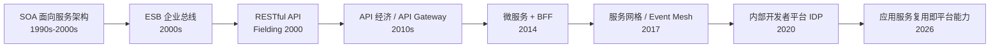
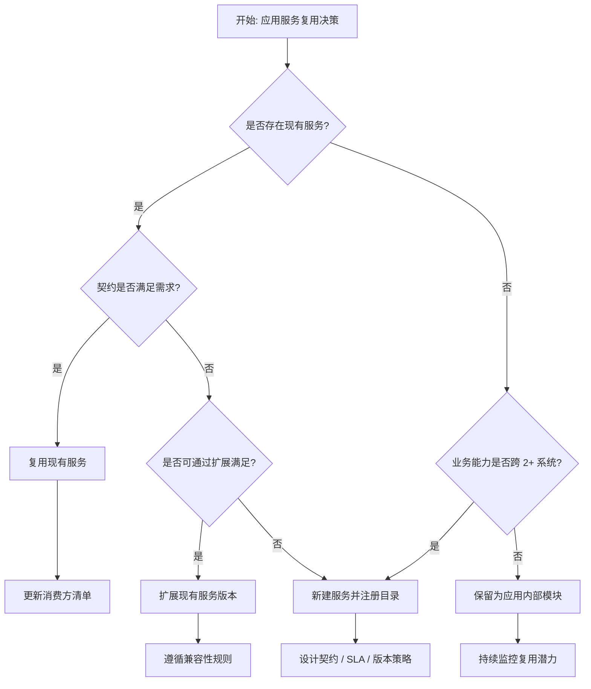
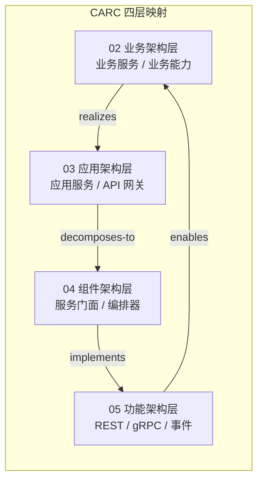

# 应用服务复用模式

> **版本**: 2026-07-07
> **定位**: 03 应用架构复用层核心子主题 —— 应用服务（Application Service）的复用模式、契约治理与边界决策
> **对齐标准**: SOA, OASIS SOA Reference Architecture, ArchiMate 4.0 Application Service, NIST SP 800-204, ISO/IEC/IEEE 42010:2022
> **来源 URL**:
>
> - OASIS SOA Reference Architecture: <https://www.oasis-open.org/committees/tc_home.php?wg_abbrev=soa-ra>
> - ArchiMate 4.0 (官方下载): <https://www.opengroup.org/archimate-licensed-downloads>
> - NIST SP 800-204: <https://csrc.nist.gov/publications/detail/sp/800-204/final>
> - ISO 42010: <https://www.iso.org/standard/74296.html>
> **核查日期**: 2026-07-07

---

## 目录

- [应用服务复用模式](#应用服务复用模式)
  - [目录](#目录)
  - [1. 概念定义（CARC 本体）](#1-概念定义carc-本体)
    - [1.1 应用服务（Application Service）](#11-应用服务application-service)
    - [1.2 服务契约（Service Contract）](#12-服务契约service-contract)
    - [1.3 服务目录（Service Catalog）](#13-服务目录service-catalog)
    - [1.4 API 网关（API Gateway）](#14-api-网关api-gateway)
    - [1.5 服务门面（Service Facade）与组合服务（Composite Service）](#15-服务门面service-facade与组合服务composite-service)
  - [2. 概念谱系与学术来源](#2-概念谱系与学术来源)
  - [3. 核心复用模式](#3-核心复用模式)
    - [3.1 服务目录驱动复用](#31-服务目录驱动复用)
    - [3.2 共享 API 网关](#32-共享-api-网关)
    - [3.3 服务门面（Service Facade）](#33-服务门面service-facade)
    - [3.4 组合服务（Composite Service）](#34-组合服务composite-service)
    - [3.5 服务编排与协同](#35-服务编排与协同)
    - [3.6 防腐层（Anti-Corruption Layer, ACL）](#36-防腐层anti-corruption-layer-acl)
  - [4. 服务契约设计](#4-服务契约设计)
    - [4.1 契约要素](#41-契约要素)
    - [4.2 兼容性规则](#42-兼容性规则)
  - [5. 正向示例](#5-正向示例)
    - [示例 1：用户画像服务跨系统复用](#示例-1用户画像服务跨系统复用)
    - [示例 2：支付网关服务在多渠道复用](#示例-2支付网关服务在多渠道复用)
  - [6. 反例与失败案例](#6-反例与失败案例)
    - [反例 1：共享数据库作为集成方式](#反例-1共享数据库作为集成方式)
    - [反例 2：ESB 成为“智能管道”瓶颈](#反例-2esb-成为智能管道瓶颈)
    - [案例：某企业 SOA 治理过度导致复用停滞](#案例某企业-soa-治理过度导致复用停滞)
  - [7. 多维对比矩阵](#7-多维对比矩阵)
    - [7.1 应用服务复用 vs 微服务复用](#71-应用服务复用-vs-微服务复用)
    - [7.2 应用服务复用模式 × 场景适配](#72-应用服务复用模式--场景适配)
    - [7.3 服务契约成熟度 × 复用就绪度](#73-服务契约成熟度--复用就绪度)
  - [8. 场景决策树与决策分析](#8-场景决策树与决策分析)
    - [8.1 决策分析](#81-决策分析)
  - [9. 与四层架构的关系](#9-与四层架构的关系)
  - [10. 权威来源](#10-权威来源)

---

## 1. 概念定义（CARC 本体）

### 1.1 应用服务（Application Service）

**定义**：应用服务是应用架构层中**面向业务能力**的可复用服务单元，它将业务能力封装为标准化接口，供其他应用系统或组件通过同步/异步方式调用。应用服务介于业务服务（业务语义）与组件/功能（技术实现）之间，强调通过契约实现跨应用集成。

**属性**：

| 属性 | 说明 |
|------|------|
| **业务对齐** | 应用服务通常对应一个业务能力子集，如"支付网关服务"、"用户画像服务" |
| **接口契约** | 通过 OpenAPI、AsyncAPI、WSDL、GraphQL Schema 等定义 |
| **可编排性** | 多个应用服务可按流程组合为更高层业务服务 |
| **可治理性** | 通过服务目录、版本策略、SLA 进行生命周期管理 |

**关系**：

- **realizes（实现）**：应用服务实现业务架构中的业务服务。
- **exposes（暴露）**：应用服务通过 API 网关或消息总线暴露给消费方。
- **composes（组合）**：多个应用服务组合为复合服务或业务流程。
- **governs（治理）**：服务目录和治理策略管理应用服务的复用。

**约束**：

1. **契约稳定约束**：应用服务一旦发布，接口变更必须遵循兼容性规则。
2. **存储隔离约束**：应用服务应通过自身接口暴露数据，禁止消费方直接访问其底层数据库。
3. **单一职责约束**：一个应用服务应围绕一个明确的业务能力边界。

### 1.2 服务契约（Service Contract）

**定义**：服务契约是服务提供方与消费方之间的正式协议，规定接口、数据格式、错误码、质量属性、安全要求和版本策略。

### 1.3 服务目录（Service Catalog）

**定义**：服务目录是组织级应用服务的统一注册与发现机制，记录服务名称、版本、所有者、SLA、依赖关系和消费方清单。

### 1.4 API 网关（API Gateway）

**定义**：API 网关是应用服务的统一入口，提供认证、限流、缓存、协议转换、灰度发布和版本路由等横切能力。

### 1.5 服务门面（Service Facade）与组合服务（Composite Service）

- **服务门面**：为复杂遗留系统提供简化、稳定的对外契约。
- **组合服务**：将多个细粒度服务聚合为粗粒度可复用服务，降低消费方调用复杂度。

---

## 2. 概念谱系与学术来源

**权威条目**：

- [Service-oriented architecture](https://en.wikipedia.org/wiki/Service-oriented_architecture)
- [OASIS SOA Reference Architecture](https://www.oasis-open.org/committees/tc_home.php?wg_abbrev=soa-ra)
- [ArchiMate Application Service](https://pubs.opengroup.org/architecture/archimate3-doc/chap09.html)

---

## 3. 核心复用模式

### 3.1 服务目录驱动复用

建立组织级应用服务目录，包含：

- 服务名称、版本、所有者、SLA。
- 接口规范（OpenAPI/AsyncAPI/WSDL）。
- 依赖关系与消费方清单。
- 合规状态（安全扫描、许可证检查）。

**复用收益**：消费方可在目录中发现已有服务，避免重复建设；平台团队可通过目录分析复用热点和耦合风险。

### 3.2 共享 API 网关

通过 API 网关暴露可复用服务：

- 统一认证、限流、缓存。
- 协议转换（REST/gRPC/SOAP）。
- 灰度发布与版本路由。

**复用收益**：横切关注点从各服务中剥离，作为基础设施复用；消费方只需关心业务契约。

### 3.3 服务门面（Service Facade）

为复杂遗留系统提供简化门面：

- 隐藏内部复杂性。
- 提供稳定契约。
- 支持新旧系统共存。

**复用收益**：新系统无需理解遗留模型，遗留系统替换时只需修改门面实现。

### 3.4 组合服务（Composite Service）

将多个细粒度服务组合为粗粒度可复用服务：

- 降低消费方调用复杂度。
- 聚合跨域数据。
- 通过缓存提升性能。

**典型场景**：订单详情服务组合用户服务、商品服务、库存服务、物流服务。

### 3.5 服务编排与协同

- **编排（Orchestration）**：由中央编排器按顺序调用多个应用服务完成业务流程，如 BPMN、Temporal。
- **协同（Choreography）**：应用服务通过事件总线自主响应，如 Saga、EDA。

**复用收益**：业务流程逻辑以编排定义或事件契约复用，服务本身保持自治。

### 3.6 防腐层（Anti-Corruption Layer, ACL）

在遗留系统与新应用服务之间引入适配层，隔离不同模型和协议。

**复用收益**：新服务的领域模型保持纯净；遗留系统替换时影响范围可控。

---

## 4. 服务契约设计

### 4.1 契约要素

| 要素 | 内容 | 示例 |
|------|------|------|
| **接口操作** | HTTP 方法/路径、gRPC 方法、消息类型 | `POST /api/v1/payments` |
| **请求/响应 Schema** | 字段、类型、必填项、示例 | OpenAPI Schema |
| **错误码** | 标准错误码与业务错误码 | `400 PAYMENT_DECLINED` |
| **质量属性** | 超时、重试、幂等性、限流 | idempotency-key |
| **安全要求** | 认证、授权、审计 | OAuth2 + RBAC |
| **版本策略** | 向后兼容、弃用窗口 | `/v1`, `/v2` |

### 4.2 兼容性规则

- **向后兼容（Backward Compatible）**：旧消费方无需修改即可使用新版本。
- **向前兼容（Forward Compatible）**：新消费方可读取旧版本响应。
- **破坏性变更**：必须升级主版本号，并提供迁移窗口。

---

## 5. 正向示例

### 示例 1：用户画像服务跨系统复用

**场景**：企业内有 CRM、营销自动化、客服、风控四个系统，都需要用户画像数据。

**复用方式**：

- 构建独立的 `User Profile Service`，聚合客户主数据、行为标签、风险评分。
- 暴露 REST API 和 gRPC 两种接口，分别供 Web 和内部微服务使用。
- 通过 API 网关统一认证、限流和缓存。

**关键成功因素**：

1. 用户画像服务不暴露底层 MDM 数据库，所有访问通过服务契约。
2. 采用 CQRS 分离读写：写模型同步更新主数据，读模型通过缓存支持高并发。
3. 版本策略明确，v1 保留 12 个月，v2 逐步迁移。

**复用收益**：

- 四个系统无需各自维护用户数据副本，数据一致性显著提升。
- 新应用接入用户画像服务平均只需 1 天。
- 营销转化率提升 12%，客服响应速度提升 20%。

### 示例 2：支付网关服务在多渠道复用

**场景**：电商平台需要在网站、移动 App、小程序、订阅服务、B2B 采购平台中统一支付能力。

**复用方式**：

- 构建 `Payment Gateway Service`，封装 Stripe、PayPal、Alipay、WeChat Pay 等渠道。
- 暴露统一支付、退款、对账、查询接口。
- 各渠道通过 SDK 或 API 网关调用支付服务。

**关键成功因素**：

1. 接口契约屏蔽渠道差异，新增支付方式不影响消费方。
2. 所有支付操作使用 idempotency-key 保证幂等性。
3. 通过服务目录发布，各团队可自助发现接口和 SLA。

**复用收益**：

- 支付能力在 5 个业务线复用，避免每个渠道重复对接支付提供商。
- 新支付渠道上线时间从 2 个月缩短至 2 周。
- 对账和财务审计集中化，合规成本降低 40%。

---

## 6. 反例与失败案例

### 反例 1：共享数据库作为集成方式

**场景**：多个应用系统直接访问同一个数据库，通过表关联实现查询和数据共享。

**后果**：

- 应用间产生隐式耦合，任何 schema 变更影响多个系统。
- 无法独立扩展和演化，数据所有权模糊。
- 服务契约被 SQL 表结构替代，业务语义泄露。

**判定**：违反应用服务复用的**存储隔离约束**。应通过应用服务接口暴露数据，而非共享数据库。

### 反例 2：ESB 成为“智能管道”瓶颈

**场景**：某大型企业将所有业务逻辑放入 ESB 中进行编排和转换。

**后果**：

- ESB 成为单点故障和性能瓶颈。
- 任何新服务上线都需要 ESB 团队排期配置。
- 业务逻辑分散在 ESB 和服务中，调试困难。

**判定**：ESB 应作为**传输与协议适配层**，而非业务逻辑容器。应用服务复用应通过清晰的契约和轻量级编排实现。

### 案例：某企业 SOA 治理过度导致复用停滞

**背景**：某金融企业建立庞大 SOA 治理委员会，所有服务发布需经过多轮评审。

**失败原因**：

- 服务发布周期长达 3 个月，开发团队选择绕过治理自行实现。
- 治理规则过于僵化，无法适应敏捷迭代。
- 服务目录缺乏自动化，信息严重过时。

**教训**：应用服务复用需要在**治理**与**效率**之间取得平衡。自动化契约校验、自助目录注册、分级治理是更可持续的模式。

## 7. 多维对比矩阵

### 7.1 应用服务复用 vs 微服务复用

| 维度 | 应用服务复用 | 微服务复用 |
|:---|:---|:---|
| **粒度** | 较粗，可对应一个应用或子系统 | 较细，独立部署单元 |
| **部署** | 可内嵌于应用，也可独立部署 | 必须独立部署 |
| **治理重点** | 服务目录、契约、编排、API 网关 | 边界、自治、版本、服务网格 |
| **技术栈约束** | 可跨多种运行时，强调契约 | 通常与容器/Kubernetes 绑定 |
| **数据一致性** | 依赖编排或分布式事务 | 通常采用 Saga / 最终一致 |
| **适用场景** | 企业应用集成、SOA、遗留系统现代化 | 云原生、DevOps、快速迭代 |

### 7.2 应用服务复用模式 × 场景适配

| 场景 | 推荐模式 | 次选模式 | 不推荐 | 关键理由 |
|-----|---------|---------|--------|---------|
| 跨系统共享业务能力 | 服务目录 + API 网关 | 组合服务 | 共享数据库 | 契约驱动，避免存储耦合 |
| 遗留系统对外暴露 | 服务门面 + 防腐层 | API 网关 | 直接暴露原接口 | 稳定契约，隔离 legacy |
| 复杂业务流程 | 服务编排 | 事件协同 | 硬编码调用链 | 流程可管理、可观测 |
| 跨域数据聚合 | 组合服务 + BFF | GraphQL Federation | 单次多服务调用 | 降低消费方复杂度 |
| 高并发读场景 | API 网关 + 缓存 | CQRS 读服务 | 直接查主库 | 提升性能，保护主服务 |

### 7.3 服务契约成熟度 × 复用就绪度

| 契约要素 | Level 1（临时） | Level 2（定义） | Level 3（自动化） | Level 4（治理驱动） |
|---------|---------------|---------------|-----------------|-------------------|
| **接口规范** | 口头约定 | OpenAPI 文档 | 代码生成 + 校验 | 目录自动发现 |
| **版本策略** | 无 | 语义化版本 | 兼容性自动化检测 | 弃用策略自动执行 |
| **质量属性** | 无 | SLA 文档 | 监控告警 | SLO 驱动自动扩缩容 |
| **安全要求** | 硬编码 | 统一认证 | OAuth2/OIDC 标准化 | 策略即代码 |

---

## 8. 场景决策树与决策分析

### 8.1 决策分析

应用服务复用的核心决策是**"新建 vs 复用"**以及**"内嵌 vs 独立"**。决策应基于业务能力范围、消费方数量、变更频率和治理成熟度。

| 决策问题 | 选择复用 | 选择新建 | 选择内嵌 |
|---------|---------|---------|---------|
| 业务能力是否跨系统？ | 是 | 否 | 仅当前系统 |
| 消费方数量是否 ≥ 2？ | 是 | 否 | 否 |
| 变更频率是否稳定？ | 是 | 否（快速试错） | 是 |
| 是否需要独立 SLA？ | 是 | 否 | 否 |
| 治理平台是否成熟？ | 是 | 暂不独立 | 是 |

**关键洞察**：应用服务复用不是越细越好。当服务能力被 3 个以上应用消费、且需要独立演化时，才适合提升为独立应用服务；否则保留为应用内部模块更有利于降低治理成本。

---

## 9. 与四层架构的关系

- **业务架构层**：定义业务能力（如"处理支付"），对应应用服务的服务边界。
- **应用架构层**：应用服务、API 网关、服务目录承载复用。
- **组件架构层**：服务门面、组合服务、编排器、防腐层是复用组件。
- **功能架构层**：REST/gRPC 操作、事件类型、消息格式是具体复用接口。

---

## 10. 权威来源

- OASIS SOA Reference Architecture: <https://www.oasis-open.org/committees/tc_home.php?wg_abbrev=soa-ra>
- OASIS SOA Reference Model: <https://www.oasis-open.org/committees/tc_home.php?wg_abbrev=soa-rm>
- ArchiMate 4.0 — Application Service: <https://pubs.opengroup.org/architecture/archimate3-doc/chap09.html>
- TOGAF Standard 10 — Application Architecture: <https://www.opengroup.org/togaf>
- NIST SP 800-204 — Security Strategies for Microservices-based Application Systems: <https://csrc.nist.gov/publications/detail/sp/800-204/final>
- ISO/IEC/IEEE 42010:2022 — Architecture description: <https://www.iso.org/standard/74296.html>
- OpenAPI Specification: <https://spec.openapis.org/oas/latest.html>
- AsyncAPI Specification: <https://www.asyncapi.com/en/spec-list>

**核查日期**: 2026-07-07