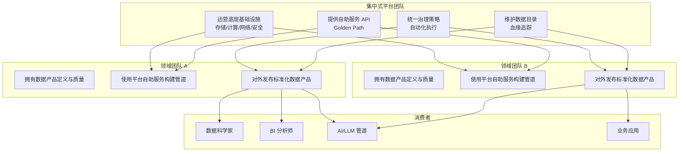
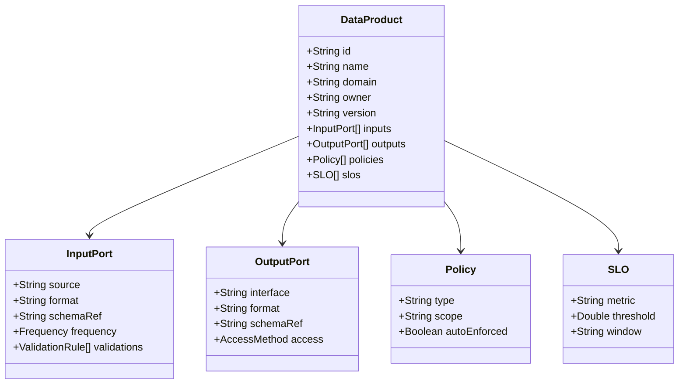
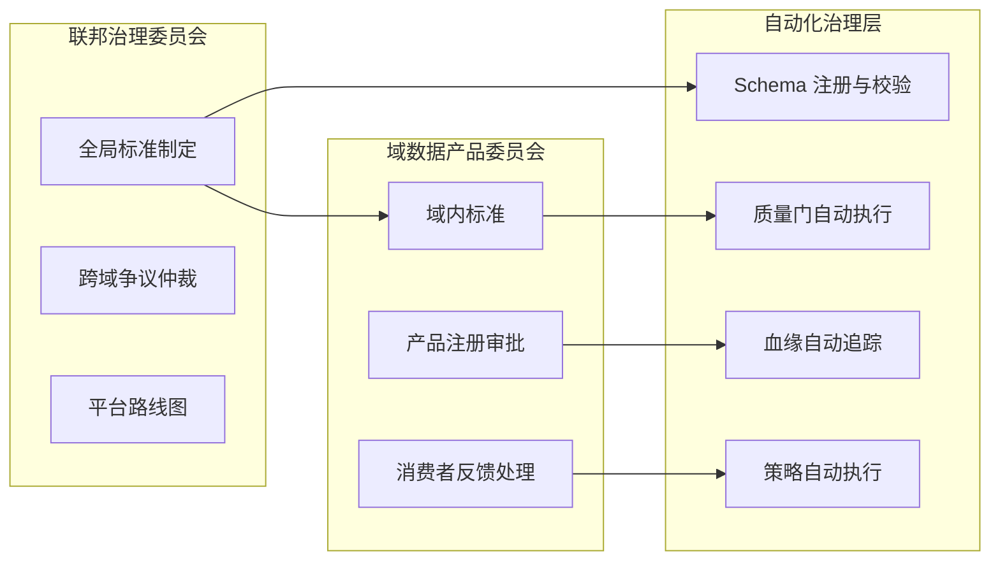
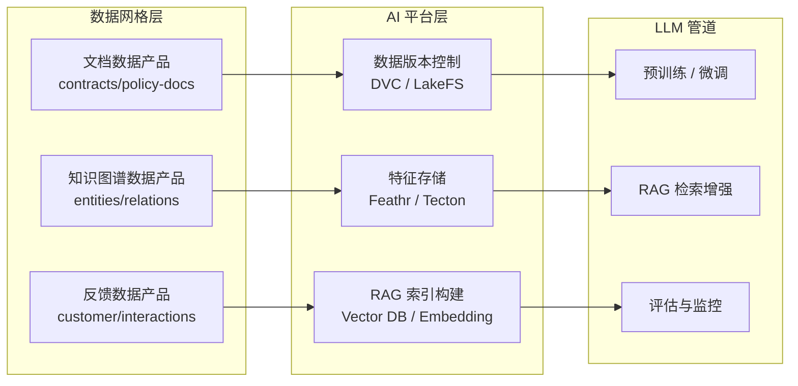

# Data Mesh 与数据产品复用架构
>
> 版本: 2026-06-06
> 对齐来源: Zhamak Dehghani (2019–2022), Socratopia IDP-for-data 分析 (2026), LTTS Databricks 白皮书, Nokia 电信实践, Data Product Canvas 2026, AI/LLM 数据管道趋势

## 1. Data Mesh 四原则

Data Mesh 由 Zhamak Dehghani 于 2019 年提出，是一种**社会技术（socio-technical）**方法，将产品思维和领域驱动设计应用于分析型数据管理：

| 原则 | 定义 | 复用含义 |
|-----|------|---------|
| **领域所有权（Domain Ownership）** | 数据所有权归属于生成数据的领域团队 | 领域团队最了解数据上下文，成为数据产品的天然所有者 |
| **数据即产品（Data as a Product）** | 领域团队以产品思维对待数据输出 | 数据产品拥有用户体验、质量保证、版本管理和生命周期 |
| **自助数据平台（Self-Serve Data Platform）** | 平台团队提供基础设施，领域团队自主交付 | 平台能力（存储、处理、目录、访问控制）作为内部产品复用 |
| **联邦计算治理（Federated Computational Governance）** | 全球标准与领域灵活性的平衡 | 通过自动化策略和计算契约实现跨领域互操作 |

## 2. 从 hype 到实践：2025–2026 演进

### 2.1 四阶段演进

| 阶段 | 时间 | 特征 | 教训 |
|-----|------|------|------|
| **发布期** | 2019–2020 | 四原则提出，去中心化愿景共鸣 | 理论先于实施指导 |
| **去中心化尝试** | 2020–2022 | 中型团队尝试每个领域拥有底层决策 | 目录蔓延、治理缺口、质量退化 |
| **反思期** | 2023–2024 | 对过度去中心化的批判，悄然再集中基础设施 | 原则正确，但"每个领域拥有底层"的实施指导错误 |
| **IDP-for-data 合成** | 2025–2026 | 数据产品 + 内部数据平台 + 联邦治理 | **2026 工作模式**：平台团队运营底层，领域团队拥有上层产品 |

### 2.2 2026 工作模式（Truce）



## 3. 数据产品作为复用单元

### 3.1 数据产品定义

数据产品是将数据、代码、基础设施和元数据封装为**可独立部署、可发现、可消费的单元**：

| 组成部分 | 内容 | 复用接口 |
|---------|------|---------|
| **数据** | 数据集、表、流、API 响应 | SQL、REST、gRPC、Kafka Topic |
| **代码** | 转换逻辑、质量检查、血缘生成 | Git 仓库、共享库 |
| **基础设施** | 计算、存储、调度 | 平台抽象（无需领域团队管理）|
| **元数据** | Schema、文档、SLA、所有者 | 数据目录、OpenLineage |

### 3.2 数据产品分层

| 类型 | 示例 | 消费者 |
|-----|------|--------|
| **原始数据产品** | 应用数据库 CDC 输出 | 数据工程师、分析师 |
| **聚合数据产品** | 按领域清洗后的主题域表 | 数据科学家、BI 团队 |
| **洞察数据产品** | 特征工程、模型输出、预测 | 业务应用、运营系统 |
| **反向数据产品** | 分析洞察写回运营系统 | 微服务、CRM、ERP |

### 3.3 保险行业领域映射示例

| 领域 | 数据产品 | 复用价值 |
|-----|---------|---------|
| 承保与风险选择 | 风险评分模型、定价算法、费率表 | 跨渠道定价一致性 |
| 保单管理 | 保单主数据、批单历史、保障详情 | 客户服务、理赔、财务共享 |
| 理赔管理 | 理赔详情、医疗/维修成本基准、欺诈信号 | 反欺诈、准备金、再保险 |

## 4. 数据产品契约定义：输入端口、输出端口、策略与 SLO

数据产品的可复用性依赖于**标准化契约**。2026 年，Data Product Canvas 方法和计算契约（Computational Contracts）已成为行业最佳实践。

### 4.1 数据产品契约结构



### 4.2 输入端口（Input Port）

输入端口定义数据产品消费上游数据的方式和约束：

| 属性 | 说明 | 示例 |
|-----|------|------|
| **source** | 上游数据源标识 | `domain:underwriting.raw-policy-events` |
| **format** | 数据格式 | Avro / Parquet / Delta / JSON Lines |
| **schemaRef** | Schema 注册表引用 | `confluent-schema-registry:policy-event-v2` |
| **frequency** | 更新频率 | 实时 (Kafka)、小时批 (Airflow)、日批 |
| **validations** | 输入校验规则 | 非空检查、格式校验、 referential integrity |

**输入契约示例（YAML 伪代码）**：

```yaml
input_ports:
  - name: raw-policy-events
    source_domain: underwriting
    source_product: policy-events
    interface: kafka_topic
    topic: underwriting.policy-events.v1
    format: avro
    schema_ref: "urn:dp:schemas:policy-event:2.1.0"
    frequency: realtime
    validations:
      - type: not_null
        fields: [policy_id, event_timestamp]
      - type: referential_integrity
        field: policy_id
        ref: "domain:policy_master.active_policies"
      - type: range
        field: premium_amount
        min: 0
```

### 4.3 输出端口（Output Port）

输出端口定义消费者如何发现和访问数据产品：

| 接口类型 | 适用场景 | 技术示例 |
|---------|---------|---------|
| **SQL / 表** | 分析查询、BI | Snowflake External Table, Databricks Delta Share |
| **REST API** | 实时查询、低延迟 | FastAPI, GraphQL |
| **流 (Kafka/Pulsar)** | 事件消费、流处理 | Confluent, Redpanda |
| **文件 / 对象存储** | 大批量导出、ML 训练 | S3 + Parquet, ADLS |
| **数据共享协议** | 跨组织数据交换 | Delta Sharing, Iceberg REST Catalog |

**输出契约示例**：

```yaml
output_ports:
  - name: risk-scores-api
    interface: rest_api
    base_url: https://data.acme.com/domains/underwriting/risk-scores
    format: json
    schema_ref: "urn:dp:schemas:risk-score:1.0.0"
    access_control:
      authentication: oauth2
      authorization: rbac
      allowed_roles: [data_scientist, actuary, risk_engine]
    rate_limit: 1000req/min

  - name: risk-scores-daily-snapshot
    interface: s3_parquet
    location: s3://acme-data-products/underwriting/risk-scores/daily/
    format: parquet
    partition_keys: [risk_date, region]
    retention: 7years
```

### 4.4 策略（Policy）

策略定义数据产品的治理规则，分为全局强制和领域自定义两层：

| 策略类型 | 全局标准 | 领域灵活性 |
|---------|---------|-----------|
| **数据格式** | Parquet / Delta Lake / Iceberg | 具体 Schema 设计 |
| **标识符** | 全局实体 ID（客户、产品）| 领域特定属性 |
| **隐私** | GDPR/CCPA 分类标签强制执行 | 具体脱敏策略 |
| **质量** | 最小质量分数阈值 | 额外领域特定规则 |
| **SLA** | freshness 承诺模板 | 具体阈值协商 |

**策略即代码示例**：

```yaml
policies:
  - type: data_classification
    scope: global
    classification: PII
    auto_enforced: true
    rules:
      - field_pattern: "*email*"
        action: mask
      - field_pattern: "*ssn*"
        action: tokenize

  - type: retention
    scope: domain
    retention_period: "7y"
    archival_after: "2y"

  - type: lineage_tracking
    scope: global
    auto_enforced: true
    standard: openlineage
```

### 4.5 SLO（Service Level Objective）

SLO 将数据产品质量承诺量化为可监控指标：

| SLO 维度 | 指标 | 典型阈值 | 监控工具 |
|---------|------|---------|---------|
| **新鲜度（Freshness）** | 数据最后更新时间距现在 | ≤ 1h（实时）、≤ 24h（日批）| Monte Carlo, Bigeye |
| **完整性（Completeness）** | 非空字段比例 | ≥ 99.5% | Great Expectations |
| **唯一性（Uniqueness）** | 主键重复率 | = 0% | Soda Core |
| **及时性（Timeliness）** | SLA 承诺内交付比例 | ≥ 99.9% | 自定义 Pipeline 监控 |
| **一致性（Consistency）** | 跨系统数据匹配率 | ≥ 99.99% | dbt tests |
| **可用性（Availability）** | 输出端口可访问时间比例 | ≥ 99.95% | 健康检查 + 合成监控 |

**SLO 契约示例**：

```yaml
slos:
  - metric: freshness
    description: "Risk scores must be updated within 1 hour of policy event"
    threshold: "1h"
    window: "24h"
    target: 0.995

  - metric: completeness
    description: "Premium amount must not be null for active policies"
    threshold: 0.999
    window: "24h"
    target: 0.999

  - metric: availability
    description: "REST API must be available 99.95% of the time"
    threshold: 0.9995
    window: "30d"
    alert_channel: pagerduty://data-platform-oncall
```

## 5. 域间数据产品复用的治理模型

### 5.1 三层治理架构



### 5.2 域间复用模式

| 模式 | 描述 | 适用场景 | 治理要点 |
|-----|------|---------|---------|
| **直接消费** | 领域 B 直接使用领域 A 的输出端口 | 强关联业务域 | 版本兼容性、SLA 依赖链 |
| **派生产品** | 领域 B 将领域 A 的产品作为输入，加工为新数据产品 | 跨域分析、聚合 | 血缘追踪、归属声明 |
| **联合查询** | 多个领域产品在同一查询中联合 | 360° 客户视图 | 全局实体 ID、性能 SLA |
| **反向数据流** | 分析洞察写回运营领域 | 实时推荐、风控 | 写权限控制、数据一致性 |
| **市场交换** | 跨组织数据产品交易 | 生态合作 | 合约法律框架、定价模型 |

### 5.3 复用冲突解决机制

当多个消费者的数据需求冲突时（如 A 需要实时流，B 需要小时批）：

1. **生产者决定原则**：数据产品所有者有权决定输出接口形态
2. **消费者适配原则**：消费者负责将生产者输出转换为自身所需格式
3. **平台中介原则**：平台提供流-批转换、格式转换等中介能力
4. **成本分摊原则**：派生产品的基础设施成本由消费者域承担

## 6. 自助数据平台能力栈

### 6.1 平台能力目录

| 能力 | 自助服务形式 | 标准化程度 |
|-----|------------|-----------|
| **数据摄取** | 连接器库（CDC、API、文件）| 高 |
| **数据转换** | dbt / Spark 模板 / SQL 框架 | 中 |
| **数据质量** | Great Expectations / Soda 规则库 | 高 |
| **数据目录** | DataHub / Collibra / Unity Catalog | 高 |
| **访问控制** | RBAC/ABAC 策略即代码 | 高 |
| **血缘追踪** | OpenLineage 自动集成 | 高 |
| **数据合约** | protobuf / Avro / JSON Schema 注册 | 高 |
| **可观测性** | 数据新鲜度、质量分数、成本仪表盘 | 中 |

### 6.2 与平台工程的融合

Data Mesh 的自助平台与 Platform Engineering 的 IDP 理念趋同：

- **Golden Path for Data**：新数据产品的标准脚手架（目录注册、质量检查、血统追踪）
- **开发者门户**：Backstage 插件展示数据产品目录、SLA 状态、下游消费者

## 7. 与 AI/LLM 数据管道的结合点

2026 年，Data Mesh 与 AI/LLM 管道的融合成为企业数据架构的核心议题。

### 7.1 数据产品 → LLM 训练管道



### 7.2 AI 原生数据产品类型

| 数据产品类型 | 描述 | 消费者 | 质量要求 |
|------------|------|--------|---------|
| **Embedding 向量产品** | 预计算文本/图像/代码的向量表示 | RAG 系统、语义搜索 | 模型版本一致、维度对齐 |
| **Prompt 模板产品** | 领域特定的 LLM Prompt 模板库 | 应用开发团队 | A/B 测试效果追踪 |
| **反馈闭环产品** | 用户反馈、模型输出评级 | 模型训练团队 | 及时性 ≤ 分钟级 |
| **知识图谱产品** | 实体关系三元组 | 推理增强、 hallucination 降低 | 准确性 ≥ 99.9% |
| **合成数据产品** | 差分隐私生成的训练数据 | 受限数据场景下的模型训练 | 分布保真度 |

### 7.3 LLM 数据管道中的联邦治理

- **模型版本血缘**：追踪训练数据产品版本 → 模型版本 → 推理服务版本
- **数据许可对齐**：确保训练数据产品的使用许可覆盖 LLM 训练场景
- **偏见检测自动化**：将公平性指标纳入数据产品 SLO
- **可解释性即服务**：数据产品附带影响模型决策的特征重要性说明

### 7.4 Data Mesh 支持 LLMOps 的关键能力

| LLMOps 需求 | Data Mesh 对应能力 | 实现方式 |
|------------|-------------------|---------|
| 训练数据版本控制 | 数据产品版本 + DVC 集成 | 数据产品 metadata 中记录 git commit + data hash |
| RAG 文档 freshness | 文档数据产品 SLO | freshness ≤ 1h 自动触发索引重建 |
| 多模态数据统一 | 统一输出端口（对象存储 + 元数据）| S3 + JSON metadata Schema |
| Prompt 版本管理 | Prompt 作为代码产品 | Git + 注册表 + A/B 测试指标 |
| 模型评估数据 | 评估数据集作为标准化产品 | 结构化输出 + 质量门 |

## 8. 联邦计算治理机制

### 8.1 治理维度

| 维度 | 全局标准 | 领域灵活性 |
|-----|---------|-----------|
| **数据格式** | Parquet / Delta Lake / Iceberg | 具体 Schema 设计 |
| **标识符** | 全局实体 ID（客户、产品）| 领域特定属性 |
| **隐私** | GDPR/CCPA 分类标签强制执行 | 具体脱敏策略 |
| **质量** | 最小质量分数阈值 | 额外领域特定规则 |
| **SLA** | freshness 承诺模板 | 具体阈值协商 |

### 8.2 计算契约（Computational Contracts）

2026 趋势：将 SLA 编码为可自动验证的契约：

- **Schema 契约**：生产者的输出 Schema 承诺
- **质量契约**：空值率、唯一性、范围检查
- **新鲜度契约**：数据更新延迟上限
- **访问契约**：谁可以访问什么，以何种粒度

## 9. 与架构复用视角的映射

| 复用层次 | Data Mesh 对应 | 标准/框架 |
|---------|---------------|----------|
| 业务架构 | 领域划分 = 限界上下文 | DDD, TOGAF Phase B |
| 应用架构 | 数据产品接口 = 应用服务 | REST/gRPC/GraphQL, OpenAPI |
| 组件架构 | 转换代码库 = 共享库 | dbt packages, Python libs |
| 功能架构 | 数据质量规则 = 函数复用 | Great Expectations suites |
| 治理 | 联邦策略 = 跨层治理 | OPA, Data Contracts |

## 10. 2026 数据与 AI 架构趋势

### 10.1 趋势全景

- **工具整合**：Lakehouse 增加流处理；流平台增加存储；AI 平台统一训练/服务/监控
- **隐私优先架构**：联邦学习主流化、差分隐私内建、合成数据爆发、同态加密可行化
- **AI 治理平台**：自动偏见检测、可解释性即服务、合规自动化、不可变 AI 审计轨迹
- **去中心化数据网格成熟**：自助平台完全自治、跨组织数据发现
- **可持续 AI**：碳感知计算、每瓦特算力 10 倍提升、默认联邦化

### 10.2 技术突破

- **量化无质量损失**：4-bit 量化保持质量，模型缩小 8 倍，<1% 精度损失
- **神经形态计算**：脑启发架构实现超低功耗 AI
- **光子处理**：光基计算实现大规模并行

## 11. 参考索引

- Dehghani, Z.: "How to Move Beyond a Monolithic Data Lake to a Distributed Data Mesh" (2019)
- Dehghani, Z.: *Data Mesh* (O'Reilly, 2022)
- Socratopia: "Data Mesh, Data Products, and Internal Data Platforms — Honestly" (2026)
- LTTS: "Data Mesh Architecture in Databricks" (Whitepaper)
- Nokia: Data Mesh in Telecom (Whitepaper)
- OpenLineage: [openlineage.io](https://openlineage.io)
- Data Product Canvas: Datamesh-Avans / Data Product Manifesto (2025-2026)
- Simor Consulting: "2025 Year-in-Review & 2026 Trends in Data & AI Architecture"
- Databricks: "LLM Data Pipelines with Unity Catalog" (2026)
- DataHub Project: [datahubproject.io](https://datahubproject.io) (AI/ML Metadata 扩展)
