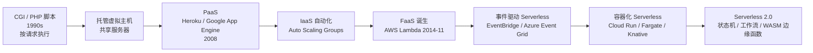
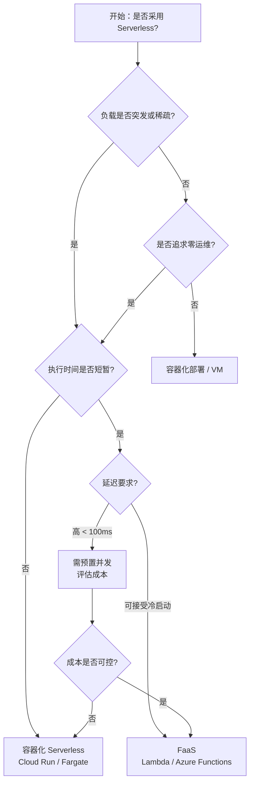
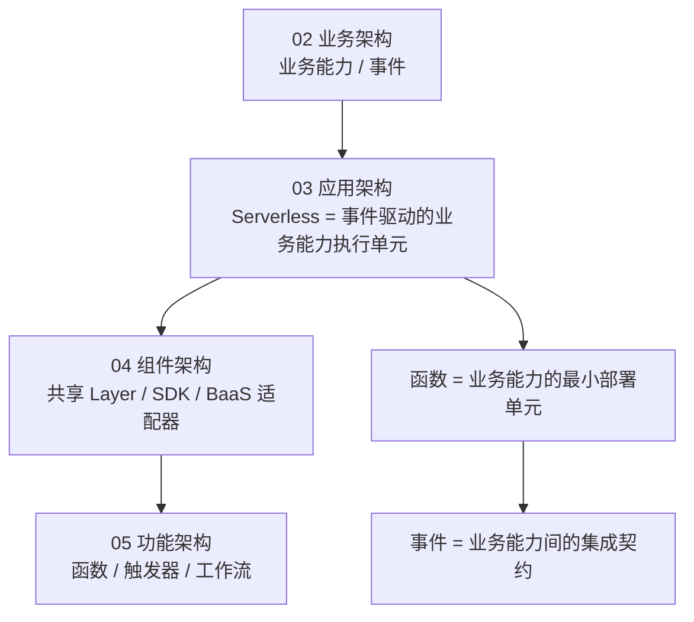

# Serverless 架构复用模式

> **版本**: 2026-07-07
> **定位**: 03 应用架构复用的基础子主题 —— Serverless / FaaS 架构的复用模式、边界与决策
> **对齐标准**: CNCF Serverless Whitepaper v2, AWS/Azure/GCP 官方文档, ISO/IEC 25010:2023
> **来源 URL**:
>
> - CNCF Serverless Whitepaper v2: <https://github.com/cncf/wg-serverless>
> - AWS Lambda: <https://docs.aws.amazon.com/lambda/>
> - Azure Functions: <https://learn.microsoft.com/en-us/azure/azure-functions/>
> **核查日期**: 2026-07-07

---

## 目录

- [Serverless 架构复用模式](#serverless-架构复用模式)
  - [目录](#目录)
  - [1. 概念定义（CARC 本体）](#1-概念定义carc-本体)
    - [1.1 Serverless 架构](#11-serverless-架构)
    - [1.2 Serverless 中的复用单元](#12-serverless-中的复用单元)
  - [2. 概念谱系与学术来源](#2-概念谱系与学术来源)
  - [3. 核心复用模式](#3-核心复用模式)
    - [3.1 Lambda Layer / 函数层复用](#31-lambda-layer--函数层复用)
    - [3.2 事件源复用模式](#32-事件源复用模式)
    - [3.3 Serverless 工作流复用](#33-serverless-工作流复用)
    - [3.4 BaaS 服务复用](#34-baas-服务复用)
    - [3.5 Serverless 到容器化的升级路径](#35-serverless-到容器化的升级路径)
  - [4. 函数边界与复用粒度](#4-函数边界与复用粒度)
    - [4.1 函数粒度选择](#41-函数粒度选择)
    - [4.2 函数边界判定 checklist](#42-函数边界判定-checklist)
  - [5. 正向示例](#5-正向示例)
    - [示例 1：图片处理流水线](#示例-1图片处理流水线)
    - [示例 2：定时数据同步任务](#示例-2定时数据同步任务)
  - [6. 反例与失败案例](#6-反例与失败案例)
    - [反例 1：将单体直接切分为数百个函数](#反例-1将单体直接切分为数百个函数)
    - [反例 2：在函数中保存会话状态](#反例-2在函数中保存会话状态)
    - [反例 3：忽视冷启动成本](#反例-3忽视冷启动成本)
    - [案例：Serverless 成本失控](#案例serverless-成本失控)
  - [7. 多维对比矩阵](#7-多维对比矩阵)
    - [7.1 Serverless 平台能力对比](#71-serverless-平台能力对比)
    - [7.2 Serverless vs 微服务 vs 分层架构](#72-serverless-vs-微服务-vs-分层架构)
  - [8. 场景决策树](#8-场景决策树)
  - [9. 与四层架构的关系](#9-与四层架构的关系)
  - [10. 权威来源](#10-权威来源)

---

## 1. 概念定义（CARC 本体）

### 1.1 Serverless 架构

**定义**：Serverless（无服务器）是一种云计算执行模型，云提供商动态管理计算资源分配，开发者只需关注业务逻辑，无需关心服务器运维、容量规划和扩展。狭义上常指 **FaaS（Function as a Service）**；广义上还包括 BaaS（Backend as a Service）和容器化 Serverless（如 AWS Fargate、Google Cloud Run）。

**属性**：

| 属性 | 说明 |
|------|------|
| **事件驱动** | 函数由事件触发（HTTP、队列、定时、存储变更） |
| **自动扩缩容** | 平台根据请求量自动扩展至零或无限 |
| **按使用付费** | 按调用次数和执行时间计费 |
| **无状态** | 函数实例通常无状态，状态需外置到存储或缓存 |
| **冷启动** | 闲置后首次调用存在延迟惩罚 |

**关系**：

- **triggered by**（被触发）：函数由事件源触发。
- **uses**（使用）：函数使用 BaaS 服务（数据库、消息队列、对象存储）。
- **composes**（组合）：多个函数通过事件或工作流组合成业务流程。
- **deployed on**（部署于）：函数部署在 Serverless 平台上。

**约束**：

1. **执行时间约束**：函数执行通常有最大超时限制（如 AWS Lambda 15 分钟）。
2. **状态外置约束**：函数内部不应保存会话状态。
3. **包大小约束**：部署包大小受平台限制。
4. **启动延迟约束**：冷启动时间影响实时性要求高的场景。

---

### 1.2 Serverless 中的复用单元

| 复用单元 | 示例 | 复用层级 |
|---------|------|---------|
| **函数模板** | Lambda 层（Layer）、函数模板 | 功能架构级 |
| **事件源映射** | S3 → Lambda、EventBridge → Lambda | 集成模式级 |
| **共享库/层** | 日志、监控、认证 SDK 层 | 组件级 |
| **BaaS 服务** | DynamoDB、Firebase、Auth0 | 服务级 |
| **Serverless 框架模板** | Serverless Framework、SAM、Terraform Module | 项目级 |

---

## 2. 概念谱系与学术来源

Serverless 的发展脉络：

**Wikipedia 对应条目**：

- [Serverless computing](https://en.wikipedia.org/wiki/Serverless_computing)
- [Function as a service](https://en.wikipedia.org/wiki/Function_as_a_service)
- [Backend as a service](https://en.wikipedia.org/wiki/Backend_as_a_service)

---

## 3. 核心复用模式

### 3.1 Lambda Layer / 函数层复用

**定义**：将共享依赖（库、运行时、配置）打包为 Layer，供多个函数引用，减少重复部署包大小。

**复用收益**：

- 减少每个函数的部署包体积。
- 统一依赖版本，便于安全更新。
- 多个函数共享同一层，降低维护成本。

**典型实现**：AWS Lambda Layers、Azure Functions Proxies。

### 3.2 事件源复用模式

**定义**：将同一事件源（如 S3 上传、消息队列消息）路由到多个函数或目标。

**常见模式**：

| 事件源 | 触发场景 | 复用方式 |
|--------|---------|---------|
| **HTTP API Gateway** | REST/HTTP 请求 | 多个函数共享同一 API 路由规则 |
| **对象存储事件** | 文件上传 | 同一上传事件触发缩略图、病毒扫描、元数据提取 |
| **消息队列** | 异步任务 | 多个消费者订阅同一主题 |
| **定时触发** | Cron 作业 | 同一调度规则触发多个函数 |
| **数据库变更流** | CDC | 同一变更事件触发缓存更新、搜索索引、通知 |

### 3.3 Serverless 工作流复用

**定义**：将多个函数通过状态机或工作流编排成可复用的业务流程。

**典型实现**：AWS Step Functions、Azure Durable Functions、Google Workflows。

**复用收益**：

- 业务流程可复用、可监控、可回滚。
- 错误处理、重试、并行执行由平台托管。

### 3.4 BaaS 服务复用

**定义**：将认证、数据库、文件存储、推送通知等通用能力交给托管服务，避免自建。

**复用收益**：

- 减少运维负担。
- 快速集成标准能力。

**典型实现**：Firebase Authentication、AWS Cognito、Auth0、Supabase。

### 3.5 Serverless 到容器化的升级路径

**定义**：当函数复杂度增长或冷启动成为瓶颈时，将函数迁移到容器化 Serverless（如 Cloud Run、Fargate）。

**复用收益**：

- 保留 Serverless 的自动扩缩容优势。
- 获得更长的执行时间和更大的资源灵活性。

---

## 4. 函数边界与复用粒度

### 4.1 函数粒度选择

| 粒度 | 说明 | 复用性 | 复杂度 |
|------|------|--------|--------|
| **单操作函数** | 每个 CRUD 操作一个函数 | 中 | 高（函数数量多） |
| **单业务步骤** | 每个业务流程步骤一个函数 | 高 | 中 |
| **聚合功能函数** | 一个函数处理多个相关操作 | 低 | 低 |

**推荐粒度**：以**单一业务步骤**或**单一责任**为函数边界。

### 4.2 函数边界判定 checklist

| 判定问题 | 是 = 适合函数化 | 否 = 留在服务/单体中 |
|---------|----------------|---------------------|
| 执行时间是否短暂？ | 是 | 否 |
| 是否事件驱动？ | 是 | 否 |
| 负载是否突发或稀疏？ | 是 | 否 |
| 是否有状态外置方案？ | 是 | 否 |
| 是否需要长时间运行？ | 否 | 是 |

---

## 5. 正向示例

### 示例 1：图片处理流水线

**场景**：用户上传图片后，需要生成缩略图、提取 EXIF、写入数据库、触发通知。

**复用方式**：

- S3 上传事件触发 `Thumbnail Function`。
- 同一事件通过 EventBridge 路由到 `Metadata Extraction Function` 和 `Notification Function`。
- 共享的图像处理库打包为 Lambda Layer。

**关键成功因素**：

1. 每个函数只负责一个处理步骤。
2. 事件契约统一（S3 Event / CloudEvents）。
3. 失败处理使用死信队列（DLQ）。

### 示例 2：定时数据同步任务

**场景**：每天凌晨将 CRM 数据同步到数据仓库。

**复用方式**：

- 使用 EventBridge Scheduler 定时触发 `Sync Function`。
- 函数读取 CRM API，写入 Snowflake/BigQuery。
- 同一同步模板可复用于 ERP、HR 系统。

**关键成功因素**：

1. 函数幂等性设计（防止重复执行）。
2. 执行时间控制在平台限制内。
3. 错误告警与重试机制。

---

## 6. 反例与失败案例

### 反例 1：将单体直接切分为数百个函数

**场景**：团队将传统 MVC 应用的每个 Service 方法都迁移为独立 Lambda 函数。

**后果**：

- 函数数量爆炸，管理困难。
- 大量函数间调用导致延迟和成本上升。
- 调试和监控复杂化。

**判定**：函数粒度过细，未按业务能力或事件边界划分。

### 反例 2：在函数中保存会话状态

**场景**：为了“简化”，函数将用户会话保存在内存中。

**后果**：

- 函数实例无状态，会话丢失。
- 自动扩缩容时状态不一致。

**判定**：违反 Serverless 无状态约束。

### 反例 3：忽视冷启动成本

**场景**：将高频、低延迟的 API 全部迁移到 Lambda，未考虑冷启动。

**后果**：

- 用户请求响应时间波动大。
- 使用 Provisioned Concurrency 后成本反而高于容器。

**判定**：Serverless 不适合所有工作负载，需评估延迟要求。

### 案例：Serverless 成本失控

**背景**：某初创公司将所有后端 API 迁移到 Lambda，初期按调用付费看似低廉。

**结果**：随着流量增长，API Gateway + Lambda 调用费用超过 ECS/Fargate 方案 3 倍。

**教训**：Serverless 在稀疏流量下成本低，但在高稳定流量下可能不如预留资源经济。

---

## 7. 多维对比矩阵

### 7.1 Serverless 平台能力对比

| 能力 | AWS Lambda | Azure Functions | Google Cloud Functions | Cloud Run / Fargate |
|------|-----------|-----------------|------------------------|---------------------|
| **执行时长** | 15 分钟 | 10 分钟（消费版） | 60 分钟 | 无限制 |
| **运行时选择** | 多 | 多 | 多 | 容器任意 |
| **冷启动** | 中 | 中 | 中 | 低 |
| **VPC 支持** | 有 | 有 | 有 | 有 |
| **按调用计费** | 是 | 是 | 是 | 按实例时间 |
| **容器化** | 否（原生） | 否（原生） | 否（原生） | 是 |

### 7.2 Serverless vs 微服务 vs 分层架构

| 维度 | Serverless | 微服务 | 分层架构 |
|------|-----------|--------|---------|
| **复用粒度** | 函数级 | 服务级 | 层/模块级 |
| **运维负担** | 极低 | 高 | 低 |
| **扩展速度** | 毫秒-秒 | 秒-分钟 | 分钟（单应用） |
| **状态管理** | 外置 | 服务内/外置 | 应用内 |
| **成本模型** | 按调用 | 按资源 | 按资源 |
| **适用负载** | 突发/稀疏 | 稳定高吞吐 | 中小规模 |

---

## 8. 场景决策树

---

## 9. 与四层架构的关系

Serverless 架构位于 **03 应用架构复用层**，其函数边界与功能架构层直接对应：

**映射说明**：

- 业务能力可通过一个或多个 Serverless 函数实现。
- 函数内部可采用 Clean Architecture / 分层架构（属于 04 组件架构）。
- 函数、触发器、事件契约属于 05 功能架构复用范畴。
- Serverless 的成本模型由 06 跨层治理 / 09 价值量化支撑。

---

## 10. 权威来源

> **权威来源**:
>
> - CNCF. *Serverless Whitepaper v2*. <https://github.com/cncf/wg-serverless/tree/master/whitepapers/serverless-overview>
> - AWS. *AWS Lambda Developer Guide*. <https://docs.aws.amazon.com/lambda/latest/dg/welcome.html>
> - Microsoft. *Azure Functions Documentation*. <https://learn.microsoft.com/en-us/azure/azure-functions/functions-overview>
> - Google Cloud. *Cloud Functions Documentation*. <https://cloud.google.com/functions/docs>
> - Roberts, M. (2018). *Serverless Architectures*. Martin Fowler. <https://martinfowler.com/articles/serverless.html>
> - ISO/IEC 25010:2023. *Systems and software engineering — Quality models*. <https://www.iso.org/standard/78175.html>
>
> **核查日期**: 2026-07-07
