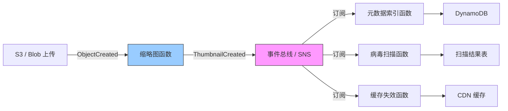
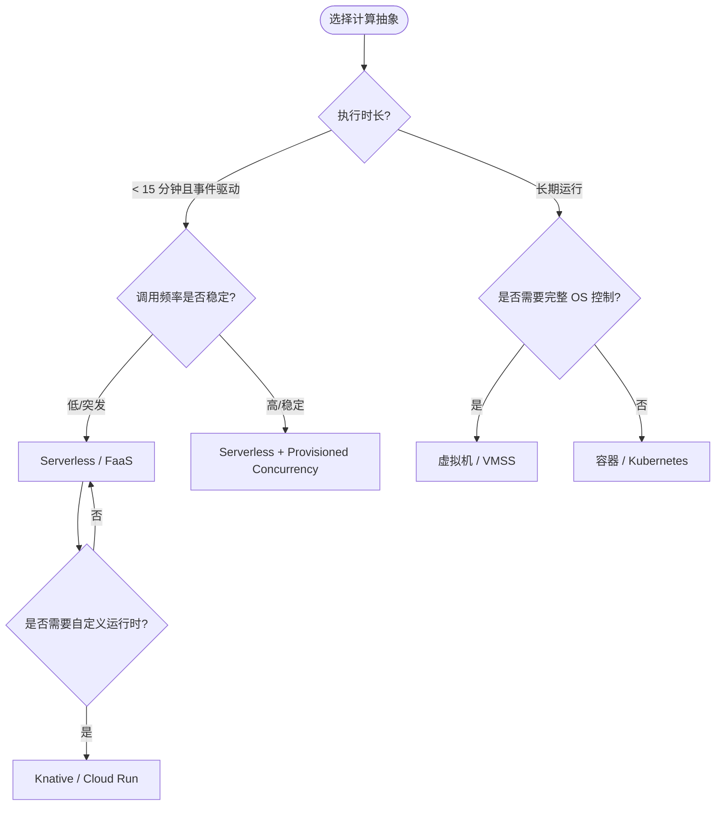

# Serverless 架构复用模式

> **版本**: 2026-06-10
> **定位**: 应用架构层（Level 2）—— Serverless/FaaS 复用边界、模式与成本优化
> **对齐标准**: CNCF Serverless Whitepaper v2, ISO/IEC/IEEE 12207:2026
> **状态**: ✅ 已完成（Phase A 深化 + 内容要素补全）
> **字数**: ~10000字

---

## 目录

- [Serverless 架构复用模式](#serverless-架构复用模式)
  - [目录](#目录)
  - [0. 概念定义](#0-概念定义)
    - [0.1 属性与特征](#01-属性与特征)
    - [0.2 关系与映射](#02-关系与映射)
    - [0.3 解释：Serverless 复用的核心矛盾](#03-解释serverless-复用的核心矛盾)
    - [矛盾一：无状态与有状态需求](#矛盾一无状态与有状态需求)
    - [矛盾二：冷启动与低延迟](#矛盾二冷启动与低延迟)
    - [矛盾三：平台抽象与供应商锁定](#矛盾三平台抽象与供应商锁定)
    - [FaaS 与 Serverless 的再澄清](#faas-与-serverless-的再澄清)
  - [1. 核心概念](#1-核心概念)
    - [1.1 函数复用的层次](#11-函数复用的层次)
  - [2. 核心复用模式](#2-核心复用模式)
    - [2.1 函数即复用单元（Function-as-Reuse-Unit）](#21-函数即复用单元function-as-reuse-unit)
    - [2.2 事件源复用模式](#22-事件源复用模式)
    - [2.3 层（Layer）与镜像复用](#23-层layer与镜像复用)
  - [3. 冷启动与性能权衡](#3-冷启动与性能权衡)
    - [3.1 预置并发（Provisioned Concurrency）的复用经济学](#31-预置并发provisioned-concurrency的复用经济学)
  - [4. 跨平台复用约束](#4-跨平台复用约束)
  - [5. 扩展 Serverless 复用模式](#5-扩展-serverless-复用模式)
    - [5.1 工作流即复用单元：Step Functions 与 Durable Functions](#51-工作流即复用单元step-functions-与-durable-functions)
      - [5.1.1 AWS Step Functions 复用模式](#511-aws-step-functions-复用模式)
      - [5.1.2 Azure Durable Functions 复用模式](#512-azure-durable-functions-复用模式)
      - [5.1.3 工作流复用的设计原则](#513-工作流复用的设计原则)
    - [5.2 Kubernetes 原生 Serverless：Knative 复用模式](#52-kubernetes-原生-serverlessknative-复用模式)
      - [5.2.1 Knative Serving 复用单元](#521-knative-serving-复用单元)
      - [5.2.2 Knative Eventing 复用模式](#522-knative-eventing-复用模式)
      - [5.2.3 Knative 与 FaaS 的对比复用决策](#523-knative-与-faas-的对比复用决策)
    - [5.3 Edge Functions：边缘 Serverless 复用模式](#53-edge-functions边缘-serverless-复用模式)
      - [5.3.1 Cloudflare Workers 复用生态](#531-cloudflare-workers-复用生态)
      - [5.3.2 Vercel Edge Functions 复用模式](#532-vercel-edge-functions-复用模式)
      - [5.3.3 Edge Functions 的复用边界](#533-edge-functions-的复用边界)
  - [6. Serverless 与微服务的混合架构](#6-serverless-与微服务的混合架构)
    - [6.1 决策框架：何时选择 Serverless vs 容器 vs VM](#61-决策框架何时选择-serverless-vs-容器-vs-vm)
      - [6.1.1 决策矩阵](#611-决策矩阵)
      - [6.1.2 混合架构模式](#612-混合架构模式)
    - [6.2 混合架构中的复用治理](#62-混合架构中的复用治理)
  - [7. Serverless 安全边界](#7-serverless-安全边界)
    - [7.1 函数隔离模型](#71-函数隔离模型)
    - [7.2 IAM 最小权限原则](#72-iam-最小权限原则)
      - [7.2.1 函数级最小权限](#721-函数级最小权限)
      - [7.2.2 跨账户复用中的权限委托](#722-跨账户复用中的权限委托)
    - [7.3 密钥与配置安全管理](#73-密钥与配置安全管理)
    - [7.4 网络隔离与私有连接](#74-网络隔离与私有连接)
    - [7.5 事件管道的安全边界](#75-事件管道的安全边界)
  - [8. Serverless 成本模型与复用经济学](#8-serverless-成本模型与复用经济学)
    - [8.1 计费维度拆解](#81-计费维度拆解)
      - [8.1.1 请求计费（Invocation Cost）](#811-请求计费invocation-cost)
      - [8.1.2 执行时间计费（Duration Cost）](#812-执行时间计费duration-cost)
      - [8.1.3 内存/资源配置计费](#813-内存资源配置计费)
    - [8.2 预置并发与预留实例的成本权衡](#82-预置并发与预留实例的成本权衡)
    - [8.3 复用带来的成本乘数效应](#83-复用带来的成本乘数效应)
    - [8.4 成本可观测性](#84-成本可观测性)
  - [9. Serverless 可观测性复用](#9-serverless-可观测性复用)
    - [9.1 分布式跟踪的标准化注入](#91-分布式跟踪的标准化注入)
      - [9.1.1 OpenTelemetry 在 Serverless 中的实践](#911-opentelemetry-在-serverless-中的实践)
      - [9.1.2 跟踪数据的后端复用](#912-跟踪数据的后端复用)
    - [9.2 结构化日志复用模式](#92-结构化日志复用模式)
      - [9.2.1 JSON 结构化日志标准](#921-json-结构化日志标准)
      - [9.2.2 日志聚合与告警](#922-日志聚合与告警)
    - [9.3 指标收集的轻量化模式](#93-指标收集的轻量化模式)
    - [9.4 健康检查与探针](#94-健康检查与探针)
  - [10. Serverless 反模式](#10-serverless-反模式)
    - [10.1 巨型 Lambda（Monolithic Lambda / Lambda-lith）](#101-巨型-lambdamonolithic-lambda--lambda-lith)
    - [10.2 缺乏错误处理与重试风暴](#102-缺乏错误处理与重试风暴)
    - [10.3 硬编码配置与环境漂移](#103-硬编码配置与环境漂移)
    - [10.4 忽视冷启动的架构设计](#104-忽视冷启动的架构设计)
    - [10.5 函数间紧耦合](#105-函数间紧耦合)
    - [10.6 过度拆分函数（Function Nano-services）](#106-过度拆分函数function-nano-services)
    - [10.7 供应商锁定（Vendor Lock-in）](#107-供应商锁定vendor-lock-in)
  - [11. 多云 Serverless 复用策略](#11-多云-serverless-复用策略)
    - [11.1 Serverless Framework：声明式复用](#111-serverless-framework声明式复用)
    - [11.2 Terraform CDK：类型安全的多云编排](#112-terraform-cdk类型安全的多云编排)
    - [11.3 Pulumi：云原生编程模型](#113-pulumi云原生编程模型)
    - [11.4 多云抽象层的设计原则](#114-多云抽象层的设计原则)
  - [12. 案例研究](#12-案例研究)
    - [12.1 AWS Lambda 大规模复用：Netflix 的工程实践](#121-aws-lambda-大规模复用netflix-的工程实践)
      - [12.1.1 背景与规模](#1211-背景与规模)
      - [12.1.2 复用架构](#1212-复用架构)
      - [12.1.3 成本优化实践](#1213-成本优化实践)
      - [12.1.4 关键启示](#1214-关键启示)
    - [12.2 Vercel Edge Functions 生态系统：前端驱动的 Serverless 复用](#122-vercel-edge-functions-生态系统前端驱动的-serverless-复用)
      - [12.2.1 背景与生态定位](#1221-背景与生态定位)
      - [12.2.2 复用模式](#1222-复用模式)
      - [12.2.3 性能与成本权衡](#1223-性能与成本权衡)
      - [12.2.4 关键启示](#1224-关键启示)
  - [13. 与 ISO/IEC 25010:2023 及 CNCF Serverless Whitepaper 的标准/技术映射](#13-与-isoiec-250102023-及-cncf-serverless-whitepaper-的标准技术映射)
  - [14. 结论与行动建议](#14-结论与行动建议)
  - [15. 交叉引用](#15-交叉引用)
  - [16. Serverless 复用架构与决策 Mermaid 图](#16-serverless-复用架构与决策-mermaid-图)
    - [16.1 事件驱动的 Serverless 复用管道](#161-事件驱动的-serverless-复用管道)
    - [16.2 Serverless vs 容器 vs VM 复用决策树](#162-serverless-vs-容器-vs-vm-复用决策树)

## 0. 概念定义

**定义**：Serverless 架构是一种云计算执行模型，开发者将业务逻辑封装为**事件触发、无状态、短时运行**的函数或容器化工作负载，由云供应商完全管理服务器、运行时、自动伸缩与容量调度。从复用视角看，Serverless 的复用单元从传统"服务"进一步细化为**函数（Function）、事件源模式（Event Source Pattern）、层/镜像（Layer/Image）、工作流模板（Workflow Template）以及基础设施即代码模块（IaC Module）**。

**Function-as-a-Service（FaaS）**是 Serverless 计算的最常见形态，但并非全部。FaaS 强调以函数为部署和计费单元；而更广义的 Serverless 还包括托管后端服务（BaaS，如 Serverless 数据库、对象存储、消息队列）、Serverless 容器（如 Google Cloud Run、Knative）以及 Edge Functions。二者的关系可表述为：**FaaS ⊂ Serverless**。

> **形式化表达**：设 Serverless 平台提供的事件源集合为 $E$，函数集合为 $F$，则一个 Serverless 应用可表示为从事件到函数的有向图：
> $$G = (F \\cup E, \\{(e, f) \\mid e \\in E \\text{ 可触发 } f \\in F\\})$$
> 复用边界由事件 Schema、函数输入/输出契约与 IAM 权限策略共同定义。

Wikipedia 对应条目：

- [Serverless computing](https://en.wikipedia.org/wiki/Serverless_computing)
- [Function as a service](https://en.wikipedia.org/wiki/Function_as_a_service)
- [Cloud computing](https://en.wikipedia.org/wiki/Cloud_computing)

---

### 0.1 属性与特征

| 属性 | 说明 | 重要性 |
|---|---|---|
| **事件驱动** | 函数由事件触发执行，事件源是复用的第一类契约 | 高 |
| **无状态** | 函数实例不保留调用间状态，状态需外置到存储/缓存 | 高 |
| **短时运行** | 单次执行有明确上限（如 Lambda 15 分钟），超时设计影响复用粒度 | 高 |
| **自动伸缩** | 平台按请求量自动扩展，复用单元需幂等且可并行 | 高 |
| **按调用计费** | 成本与调用次数和执行时长直接挂钩，复用带来成本乘数效应 | 中 |
| **冷启动敏感** | 实例初始化延迟是性能与成本的核心权衡点 | 高 |
| **平台抽象** | 开发者不管理服务器，但需管理事件契约、IAM、可观测性 | 中 |

---

### 0.2 关系与映射

| 关系类型 | 目标概念 | 说明 |
|---|---|---|
| **上位概念** | [Cloud computing](https://en.wikipedia.org/wiki/Cloud_computing) / [Utility computing](https://en.wikipedia.org/wiki/Cloud_computing#Utility_computing) | Serverless 是云计算按用量计费理念的极致形态 |
| **下位概念** | Function-as-a-Service（FaaS） | Serverless 的最小复用单元，事件触发、无状态函数 |
| **下位概念** | Backend-as-a-Service（BaaS） | 托管数据库、对象存储、消息队列等 Serverless 后端服务 |
| **下位概念** | Serverless Containers / Knative / Cloud Run | 介于 FaaS 与容器之间的 Serverless 形态，支持自定义运行时 |
| **等价/映射概念** | 事件驱动架构（EDA） | Serverless 天然适合事件驱动，函数即事件消费者 |
| **依赖概念** | 微服务架构 | 微服务可拆分为 Serverless 函数，或 Serverless 函数组合为服务 |
| **依赖概念** | API Gateway、Event Bridge、Message Queue | 触发函数的事件源与入口层 |
| **映射概念** | CNCF Serverless Whitepaper v2 | 定义 Serverless 的核心特征与复用边界 |

---

### 0.3 解释：Serverless 复用的核心矛盾

Serverless 的复用逻辑与传统架构存在本质差异：函数实例是短暂的、事件触发的、无状态的。这种"用完即走"的模型带来了极致的弹性与成本效率，但也引入了三个核心矛盾。

### 矛盾一：无状态与有状态需求

函数被设计为无状态，但许多业务场景需要跨调用保持状态（如会话、购物车、工作流状态）。复用有状态逻辑时，必须将状态外置到托管数据库、缓存或 Durable Objects / Durable Entities 中，而不能依赖函数实例的内存或本地磁盘。

### 矛盾二：冷启动与低延迟

冷启动是 Serverless 按用量计费模型的必然产物。对于延迟敏感型业务（如在线支付、实时推荐），冷启动可能不可接受；预置并发（Provisioned Concurrency）可以消除冷启动，但将计费模型从"纯按调用"转变为"按调用 + 按容量预留"，降低了 Serverless 在低频场景下的成本优势。

### 矛盾三：平台抽象与供应商锁定

Serverless 平台提供的高级抽象（事件源、IAM、可观测性）显著提高了开发效率，但也带来供应商锁定风险。复用单元越深入平台专有特性，迁移成本越高。缓解策略是在应用层采用 CloudEvents、OpenTelemetry、JWT 等中立标准，将平台特性限制在基础设施层适配器中。

### FaaS 与 Serverless 的再澄清

| 维度 | FaaS | 广义 Serverless |
|---|---|---|
| 复用单元 | 函数代码 / Layer | 函数、容器、工作流、BaaS 服务 |
| 运行时控制 | 受限 | 较灵活（Serverless Containers） |
| 状态模型 | 无状态为主 | 可包含有状态托管服务 |
| 典型平台 | AWS Lambda、Azure Functions | Lambda + DynamoDB + S3 + API Gateway 等组合 |

> **定理 S.0** (Serverless Reuse Trade-off): Serverless 复用价值 $V$ 与事件契约稳定性 $S$、函数无状态纯度 $P$ 成正比，与平台专有依赖 $D$ 成反比，即 $V \\propto \\frac{S \\times P}{D}$。

---

## 1. 核心概念

Serverless 架构将计算抽象为**事件触发的无状态函数**，开发者无需管理服务器生命周期。从复用视角看，Serverless 的复用单元从"服务"进一步细化为"函数"和"事件处理管道"。

CNCF Serverless Whitepaper v2 定义了 Serverless 的核心特征：**自动伸缩、按调用计费、无服务器管理、事件驱动**。这些特征直接影响复用策略：函数的短暂生命周期要求复用单元必须是**快速初始化、无状态、幂等**的。

### 1.1 函数复用的层次

| 层次 | 复用单元 | 生命周期 | 典型示例 |
|------|---------|---------|---------|
| 函数代码 | 单一处理逻辑 | 毫秒级 | 图片缩略图生成 |
| 函数层/Layer | 共享依赖库 | 部署级 | 认证 SDK、监控 Agent |
| 事件管道 | 触发器→函数→输出 | 流级 | S3 上传 → Lambda → DynamoDB |
| 应用模板 | 完整 Serverless 应用骨架 | 项目级 | SAM / Terraform 模板 |

---

## 2. 核心复用模式

### 2.1 函数即复用单元（Function-as-Reuse-Unit）

单个函数在满足以下条件时可作为跨项目复用单元：

- **纯函数特性**: 输出仅取决于输入事件 + 环境变量，无隐式状态
- **幂等性**: 同一事件多次触发产生相同结果（应对至少一次交付语义）
- **超时可控**: 执行时间 < 平台限制（AWS Lambda: 15 min, Azure Functions: 无默认限制）

> **定理 S.1** (Serverless Reuse Threshold): 一个 Serverless 函数的复用收益为正当且仅当其**冷启动延迟 + 执行时间 < 调用方可容忍的响应时间上限**。

### 2.2 事件源复用模式

Serverless 的复用不仅限于代码，更包括**事件源（Event Source）与事件模式的复用**。

| 事件源类型 | 复用模式 | 典型场景 |
|-----------|---------|---------|
| 对象存储事件 | S3/ Blob 触发器模板 | 文件处理流水线 |
| 消息队列事件 | Kafka / SQS / Event Hubs 触发 | 异步任务消费 |
| HTTP API 事件 | API Gateway → Function 路由 | REST/GraphQL 后端 |
| 定时事件 | Cron 触发器模板 | 批处理、数据同步 |
| 数据库变更事件 | CDC (Change Data Capture) | 数据复制、缓存失效 |

**事件契约复用**: 定义标准的事件 Schema（如 CloudEvents 规范），使同一函数可消费来自不同源的事件。

### 2.3 层（Layer）与镜像复用

- **函数层**: 将公共依赖（如 AWS SDK、数据处理库）打包为层，供多个函数挂载
- **容器镜像**: 对于需要自定义运行时的场景，使用 OCI 镜像作为复用单元（AWS Lambda / Azure Functions / Knative 均支持）

---

## 3. 冷启动与性能权衡

冷启动（Cold Start）是 Serverless 复用决策的核心约束。

| 运行时类型 | 冷启动延迟 | 复用建议 |
|-----------|-----------|---------|
| 原生运行时 (Go, Rust) | 10-100 ms | 高并发场景首选，复用价值最高 |
| JIT 运行时 (Java, .NET) | 1-5 s | 使用 SnapStart / Provisioned Concurrency |
| 解释型 (Node.js, Python) | 100-500 ms | 通用场景，平衡开发效率与性能 |
| 自定义容器 | 2-10 s | 仅当原生运行时无法满足依赖需求时使用 |

### 3.1 预置并发（Provisioned Concurrency）的复用经济学

预置并发通过**保持函数实例常驻**消除冷启动，但将计费模型从"纯按调用"转变为"按调用 + 按容量预留"。

- **决策公式**: 当函数调用频率 > 阈值时，预置并发的单位调用成本低于冷启动的延迟惩罚成本
- **复用启示**: 高频复用的函数应配置预置并发；低频复用的函数接受冷启动

---

## 4. 跨平台复用约束

| 约束维度 | 影响 |
|---------|------|
| 事件格式 | 不同云平台的事件 Schema 差异（需 CloudEvents 抽象层） |
| 执行环境变量 | 密钥管理、配置注入机制各异 |
| 并发限制 | 平台级并发配额影响复用规模 |
| 最大执行时长 | 长任务需拆分为 Step Functions / Durable Functions |

---

## 5. 扩展 Serverless 复用模式

### 5.1 工作流即复用单元：Step Functions 与 Durable Functions

当单一函数的执行时长超过平台限制（如 AWS Lambda 15 分钟）或业务逻辑需要跨多个函数编排时，**工作流引擎**成为更高层次的复用单元。

#### 5.1.1 AWS Step Functions 复用模式

AWS Step Functions 提供状态机编排能力，将多个 Lambda 函数组合为可复用的工作流模板：

- **标准工作流（Standard）**: 适用于长时间运行、需要精确一次执行语义的业务流程，如订单履约、用户注册审批。状态转换持久化，可跨天执行，支持 1 年历史保留。
- **快速工作流（Express）**: 适用于高并发、短时长（<5 分钟）的事件处理，如 IoT 数据清洗、实时日志过滤。按执行次数与持续时间计费，成本较标准工作流降低达 95%。
- **复用策略**: 将通用业务状态机（如"审批流"、"补偿事务 Saga"）抽象为 JSON ASL（Amazon States Language）模板，通过参数化输入输出路径实现跨业务复用。例如，电商领域的库存扣减 Saga 模式可在多个子系统中复用同一状态机定义，仅需替换具体的 Lambda ARN 与重试策略。

> **定理 S.2** (Workflow Reuse Composability): 可复用的工作流状态机必须满足**状态节点幂等性**与**外部服务调用幂等性**的双重约束，否则幂等性将仅停留在函数级别而无法扩展到事务边界。

#### 5.1.2 Azure Durable Functions 复用模式

Azure Durable Functions 基于**事件溯源（Event Sourcing）**与**任务编排（Task Orchestration）**模式，提供代码优先的工作流定义：

- **编排器函数（Orchestrator）**: 以确定性代码编写工作流逻辑，禁止非确定性操作（如 DateTime.Now、随机数、I/O），平台通过重放（Replay）机制保证状态一致性。
- **实体函数（Entity Functions）**: 提供有状态 Actor 模型，适用于需要跨调用保持状态的场景（如计数器、会话状态），是对传统无状态函数模型的有力补充。
- **复用模式**: 将通用的编排模式（如"扇出-扇入"、"人机交互"、"外部事件等待"）封装为 NuGet/npm 包，开发者仅需实现具体的活动函数（Activity Function），无需重复编写状态机管理代码。

#### 5.1.3 工作流复用的设计原则

| 原则 | 说明 |
|------|------|
| 状态机与业务解耦 | 将状态转换逻辑与业务处理逻辑分离，前者作为模板复用，后者作为插件注入 |
| 错误边界标准化 | 定义统一的重试、回退、死信队列（DLQ）策略，避免每个工作流重复配置 |
| 输入输出契约 | 工作流级别的输入输出 Schema 应保持向后兼容，遵循 CloudEvents 规范 |

### 5.2 Kubernetes 原生 Serverless：Knative 复用模式

Knative 作为 Kubernetes 上的 Serverless 扩展，填补了"纯 FaaS"与"容器编排"之间的空白，提供了跨云、跨集群的 Serverless 复用能力。

#### 5.2.1 Knative Serving 复用单元

Knative Serving 将 Serverless 的自动伸缩与流量管理能力带入 Kubernetes 生态：

- **Service 资源**: 作为可复用的部署单元，Service 同时管理 Revision（不可变版本）、Route（流量分配）与 Configuration（配置模板）。一个 Knative Service 模板可在不同命名空间、不同集群间复用，仅需调整环境变量与资源配额。
- **Revision 不可变性**: 每次部署产生新的 Revision，旧版本保持可回滚。这种不可变性天然支持蓝绿部署、金丝雀发布，复用单元从"函数"扩展到"服务版本"。
- **自动缩容至零**: 当无流量时缩容至零 Pod，节省资源；有请求时通过 Activator 组件快速拉起（冷启动时间取决于容器镜像拉取速度，通常在秒级）。

#### 5.2.2 Knative Eventing 复用模式

Knative Eventing 提供与云平台无关的事件基础设施：

- **Broker-Trigger 模型**: Broker 作为事件总线，Trigger 根据 CloudEvents 属性过滤并路由事件到对应的 Knative Service。此模型实现了**事件生产者与消费者的完全解耦**，同一事件源可被多个消费者复用。
- **Source 抽象**: Knative 提供 30+ 种事件源实现（GitHub、Kafka、SQS、Pub/Sub 等），开发者无需为每种云平台编写自定义的事件适配器，直接复用社区维护的 Source 组件。
- **通道复用**: 使用 Kafka 通道或内存通道作为事件传输层，实现跨命名空间的事件共享，适用于多租户场景下的数据管道复用。

#### 5.2.3 Knative 与 FaaS 的对比复用决策

| 维度 | Knative | AWS Lambda / Azure Functions |
|------|---------|------------------------------|
| 复用单元 | 容器镜像 + Helm Chart | 函数代码 + Layer |
| 运行时限制 | 无硬性超时（受 K8s 配置约束） | 15 分钟（Lambda）/ 无默认限制（Functions） |
| 冷启动 | 秒级（受镜像大小影响） | 毫秒级（原生运行时）至秒级（容器镜像） |
| 事件生态 | CloudEvents + 社区 Source | 平台原生事件源 |
| 适用场景 | 需要自定义运行时、复杂依赖、GPU 支持的 Serverless 工作负载 | 事件驱动的轻量级计算、快速原型 |

### 5.3 Edge Functions：边缘 Serverless 复用模式

随着 CDN 向计算平台演进，Edge Functions 成为 Serverless 的新 frontier，将函数执行从区域数据中心下沉到全球边缘节点。

#### 5.3.1 Cloudflare Workers 复用生态

Cloudflare Workers 基于 V8 Isolate 技术，在毫秒级冷启动与极低资源开销（128MB 内存限制）下运行 JavaScript/WebAssembly 函数：

- **隔离模型**: 不同于 Lambda 的容器/微虚拟机隔离，Workers 使用 V8 Isolate 实现进程内轻量级隔离。隔离强度低于容器，但启动速度提升两个数量级（<1ms）。
- **Durable Objects**: 为有状态边缘计算提供单例 Actor 模型，同一 Durable Object 的所有请求由特定边缘节点处理，保证状态一致性。适用于实时协作（如在线文档编辑）、游戏状态同步。
- **复用模式**: Cloudflare 的 Workers 生态以 npm 包形式共享中间件（如 JWT 验证、A/B 测试路由、地理围栏），开发者通过 `wrangler` CLI 一键复用社区模板。由于 Workers 的 API 兼容 Web 标准（Fetch API、WebCrypto），大量浏览器端库可直接复用。

#### 5.3.2 Vercel Edge Functions 复用模式

Vercel Edge Functions 基于 Edge Runtime（基于 V8 的轻量级运行时），深度集成前端框架（Next.js、SvelteKit、Nuxt）：

- **中间件复用**: Edge Functions 作为请求/响应的中间件层，可复用通用的 A/B 测试、身份验证、本地化、机器人检测逻辑。这些中间件以框架无关的方式编写，可在 Next.js、Astro、Remix 之间迁移。
- **边缘缓存与函数协同**: 通过 `Cache-Control` 与 `Vercel-CDN-Cache-Control` 头，Edge Functions 可动态决定缓存策略，实现"计算+缓存"的复用组合。
- **Streaming SSR**: Edge Functions 支持 React 18+ 的流式服务端渲染（Streaming SSR），将组件级复用从浏览器扩展到边缘节点，首字节时间（TTFB）较传统 SSR 降低 50% 以上。

#### 5.3.3 Edge Functions 的复用边界

| 约束 | 影响 |
|------|------|
| 运行时限制 | CPU 时间 < 50ms（Cloudflare Workers 免费层），内存 < 128MB |
| 兼容层 | 不支持 Node.js 原生模块（如 `fs`、`crypto` 的部分 API），需使用 Web 标准替代 |
| 状态持久化 | 无本地文件系统，状态需通过 Durable Objects/KV/D1 等边缘存储持久化 |
| 调试复杂度 | 边缘节点分布全球，本地调试工具（如 `wrangler dev`、`next dev`）与生产环境存在行为差异 |

---

## 6. Serverless 与微服务的混合架构

### 6.1 决策框架：何时选择 Serverless vs 容器 vs VM

在 enterprise 架构中，Serverless 并非银弹。理性的复用策略要求根据工作负载特征选择最合适的计算抽象。

#### 6.1.1 决策矩阵

| 评估维度 | Serverless (FaaS) | 容器 (K8s/Container Apps) | 虚拟机 (VM/VMSS) |
|---------|-------------------|---------------------------|------------------|
| **请求模式** | 稀疏、突发、不可预测 | 中等并发、可预测波动 | 持续高负载、稳定流量 |
| **执行时长** | < 15 分钟的短任务 | 长时间运行的服务 | 常驻后台进程、遗留系统 |
| **启动延迟要求** | 可接受 100ms-1s 冷启动 | 可接受秒级滚动更新 | 分钟级启动可接受 |
| **状态管理** | 无状态为主 | 有状态/无状态均可 | 有状态（本地磁盘、数据库） |
| **运行时控制** | 受限（平台提供运行时） | 完全控制（自定义镜像） | 完全控制（操作系统级） |
| **资源粒度** | 128MB-10GB 内存，细粒度 | GB 级内存，中等粒度 | TB 级内存/GPU，粗粒度 |
| **成本模型** | 按调用 + 执行时间，低利用率高性价比 | 按资源预留，中等利用率高性价比 | 按实例计费，高利用率高性价比 |
| **团队运维能力** | 低（平台托管） | 中（需管理编排与镜像） | 高（需管理 OS、补丁、高可用） |

#### 6.1.2 混合架构模式

**模式 A：API 网关分层**

- 边缘层：Cloudflare Workers / Vercel Edge Functions 处理身份验证、速率限制、Geo 路由
- 应用层：AWS Lambda / Azure Functions 处理业务逻辑（BFF 模式）
- 服务层：Kubernetes 部署核心微服务（用户服务、订单服务），通过 gRPC 内部通信
- 数据层：托管数据库（RDS、Cosmos DB）与缓存（ElastiCache、Redis Enterprise）

此模式的复用价值在于：每一层均可独立演进与替换。当某一层的技术债务累积时，仅需替换该层而不影响上下游。

**模式 B：事件驱动桥接**

- 容器化服务产生业务事件（如订单创建）到 Kafka / EventBridge
- Serverless 函数作为事件消费者，执行异步处理（发送邮件、更新搜索索引、生成报表）
- 当异步处理逻辑需要复用时，将函数代码与事件 Schema 打包为模板，供多个业务域订阅

**模式 C：扩展点模式（Extension Point Pattern）**

- 核心系统以容器/VM 形式部署，提供稳定的 API 与数据模型
- 扩展功能（如自定义工作流、第三方集成、报表生成）以 Serverless 函数形式部署
- 优势：核心系统的变更频率低，扩展点的迭代频率高；Serverless 的独立部署特性使扩展点可快速上线而不影响核心系统稳定性

### 6.2 混合架构中的复用治理

在混合架构中，复用的最大挑战不再是技术，而是**跨抽象边界的治理**：

- **统一可观测性**: 无论工作负载运行在 Lambda、Kubernetes 还是 VM 上，必须复用同一套分布式追踪（OpenTelemetry）、日志聚合（Fluent Bit/Vector）与指标采集（Prometheus）标准。
- **统一身份与授权**: 通过 Service Mesh（Istio/Linkerd）或 API 网关的统一认证层，确保 Serverless 函数与容器服务使用相同的 JWT/OAuth2 验证逻辑。
- **统一配置管理**: 使用外部化配置中心（AWS AppConfig、Azure App Configuration、Kubernetes ConfigMap/Secret），避免 Serverless 函数与容器服务各自维护配置副本。

---

## 7. Serverless 安全边界

Serverless 的安全模型与传统计算模型存在本质差异：攻击面从操作系统层上移至函数运行时层与事件管道层。

### 7.1 函数隔离模型

| 隔离技术 | 实现平台 | 隔离强度 | 启动延迟 |
|---------|---------|---------|---------|
| 硬件虚拟化 (Firecracker) | AWS Lambda | 强（VM 级） | 125ms |
| 轻量虚拟化 (gVisor) | Google Cloud Run | 中强（用户态内核） | 200ms |
| 容器命名空间隔离 | Azure Functions (容器模式) | 中（进程级 + namespace） | 秒级 |
| V8 Isolate | Cloudflare Workers | 中（进程内隔离） | <1ms |

**复用安全启示**: 当多个租户复用同一函数层或镜像时，隔离技术的强度决定了多租户部署的可行性。对于金融、医疗等高合规行业，优先选择 VM 级隔离（Firecracker）；对于面向公众的轻量计算，Isolate 隔离在性能与成本上更具优势。

### 7.2 IAM 最小权限原则

Serverless 函数的权限模型遵循"默认拒绝、显式允许"原则，但实践中常出现过度授权。

#### 7.2.1 函数级最小权限

- **执行角色（Execution Role）**: 每个函数应拥有独立的 IAM Role，权限粒度细化到资源 ARN 与操作列表。例如，图片处理函数仅需 `s3:GetObject` 与 `s3:PutObject` 权限，而非通配符 `s3:*`。
- **权限边界（Permissions Boundary）**: 为开发团队设置权限边界策略，防止单个函数的 IAM Role 被恶意扩展为管理员权限。
- **临时凭证**: 函数应通过平台提供的临时凭证（如 AWS STS、Azure Managed Identity）访问资源，禁止将长期访问密钥硬编码到函数代码或环境变量中。

#### 7.2.2 跨账户复用中的权限委托

当 Serverless 函数需要跨 AWS 账户或跨 Azure 订阅访问资源时：

- **AWS**: 使用 IAM Role 的跨账户 AssumeRole，结合外部 ID 防止混淆代理攻击（Confused Deputy Problem）。
- **Azure**: 使用 Managed Identity 的联邦身份（Federated Identity）或 Service Principal 的 Multi-Tenant 应用注册。
- **GCP**: 使用 Service Account 的跨项目 IAM 绑定与条件性访问（Conditional IAM）。

### 7.3 密钥与配置安全管理

Serverless 函数的短暂生命周期使传统的"配置文件+密钥文件"模式失效。

| 管理方式 | 安全等级 | 适用场景 |
|---------|---------|---------|
| 环境变量明文 | 低 | 仅用于非敏感配置（如日志级别、功能开关） |
| 平台密钥服务（AWS Secrets Manager / Azure Key Vault） | 高 | 数据库密码、API 密钥、OAuth 客户端密钥 |
| 参数存储（AWS Systems Manager Parameter Store） | 中高 | 配置项与低敏感密钥的分层管理 |
| 加密环境变量（KMS/CMEK） | 高 | 合规要求下的端到端加密 |

**密钥复用策略**: 将通用密钥（如监控平台的 API Key、共享数据库的只读凭证）存储在集中式密钥管理服务中，通过 IAM 策略控制哪些函数有权访问。避免在每个函数中重复创建相同的密钥副本。

### 7.4 网络隔离与私有连接

- **VPC 集成**: 当函数需要访问私有子网中的资源（如 RDS、ElastiCache、内部 API）时，通过 VPC 对等连接或 Private Link 建立安全通道。注意 VPC 集成会显著增加冷启动时间（ENI 创建延迟），需评估是否在函数级别预置 ENI（如 AWS Lambda 的 VPC Lattice 集成）。
- **私有端点**: 使用 Azure Private Endpoint、AWS VPC Endpoint、GCP Private Service Connect 将函数对托管服务的访问限制在私有网络内，避免流量经过公网。
- **出站过滤**: 通过安全组（Security Group）与网络 ACL 限制函数的出站连接，仅允许访问已知的目的地端口与 IP 范围，降低数据泄露风险。

### 7.5 事件管道的安全边界

事件源是 Serverless 架构中常被忽视的攻击面：

- **事件注入**: 恶意构造的事件负载可能触发函数的异常行为（如 SQL 注入、命令注入）。所有事件输入必须经过 Schema 验证与 sanitization。
- **重放攻击**: 攻击者截获合法事件并重放。通过事件中的唯一标识符（如 `idempotency-key`）与幂等性设计防御。
- **事件源伪造**: 确保事件源（如 API Gateway、S3）的身份验证不可绕过。使用平台提供的签名验证机制（如 AWS SNS 的签名验证、GitHub Webhook 的 HMAC 签名）。

---

## 8. Serverless 成本模型与复用经济学

### 8.1 计费维度拆解

Serverless 的成本模型由三个核心维度构成，理解每个维度的边际成本是复用决策的基础。

#### 8.1.1 请求计费（Invocation Cost）

- **模型**: 每次函数调用产生固定费用，与执行时长、内存占用无关。
- **平台差异**: AWS Lambda 每月前 100 万次请求免费，超出后 $0.20/百万次；Azure Functions Consumption 计划类似；Google Cloud Functions $0.40/百万次。
- **复用影响**: 将高频调用的通用逻辑（如认证、参数校验）下沉到 API 网关层或边缘函数，可减少后端函数的调用次数，直接降低请求计费成本。

#### 8.1.2 执行时间计费（Duration Cost）

- **模型**: 按 "GB-秒"（内存配置 × 执行秒数）计费。内存配置越高，单位时间成本越高，但 CPU 配额相应增加。
- **优化策略**:
  - **内存调优**: 通过 AWS Lambda Power Tuning 等工具寻找成本最优的内存配置。对于 CPU 密集型任务，增加内存可能缩短执行时间，使总成本反而下降。
  - **异步化**: 将同步阻塞操作（如发送邮件、调用第三方 API）转换为异步事件，释放函数实例，减少计费时长。
  - **连接复用**: 在函数实例生命周期内复用数据库连接、HTTP 连接池，避免每次调用重新建立连接的延迟与计费时间浪费。

#### 8.1.3 内存/资源配置计费

- **模型**: 内存配置决定 CPU、网络带宽与临时磁盘（`/tmp`）的配额。平台按配置的内存上限计费，而非实际使用量。
- **复用启示**: 当多个函数复用同一 Layer 或镜像时，Layer 的体积影响函数的初始化时间，进而影响执行时长计费。将大型依赖（如机器学习模型、原生库）预置到 Layer 中，可减少函数包的体积，缩短冷启动与执行时间。

### 8.2 预置并发与预留实例的成本权衡

| 模式 | 成本构成 | 适用场景 |
|------|---------|---------|
| 按需（On-Demand） | 仅请求 + 执行时间 | 低频、不可预测流量 |
| 预置并发（Provisioned Concurrency） | 请求 + 执行时间 + 容量预留费 | 高频、低延迟要求（如 API 后端） |
| 预留实例（Savings Plans / Reserved Capacity） | 承诺 1-3 年计算量，换取折扣 | 稳定基线负载 |

**决策公式**: 设函数月均调用次数为 N，平均执行时间为 T（秒），内存配置为 M（GB）：

- 按需月度成本 ≈ N × ($0.20/10⁶ + M × T × $0.0000166667)
- 预置并发月度成本 ≈ N × $0.20/10⁶ + M × 预置实例数 × 720h × $0.0000041667

当预置并发的总成本 < 按需成本且延迟 SLA 满足时，选择预置并发。

### 8.3 复用带来的成本乘数效应

Serverless 的复用不仅降低开发成本，更通过以下机制影响运行时成本：

- **Layer 复用降低存储成本**: AWS Lambda Layer 的存储按版本计费。将 10 个函数各自打包 50MB 依赖，总存储 500MB；复用同一 Layer 后，总存储降至 50MB + 少量函数代码。
- **事件管道复用降低调用次数**: 将多个消费者整合为单一事件过滤函数，通过内部路由分发，可减少 Broker 到函数的调用次数。例如，使用 EventBridge 的规则引擎在服务端过滤事件，仅将匹配事件传递给目标函数，避免函数被无关事件唤醒。
- **工作流复用降低编排成本**: Step Functions 的标准工作流按状态转换次数计费。将高频的短工作流模板化为 Express 工作流，或内联到父工作流中，可减少独立工作流的启动开销。

### 8.4 成本可观测性

建立 Serverless 成本基准需要跨维度关联：

- **按函数成本分解**: 使用 AWS Cost Allocation Tags / Azure Cost Management 标签，将成本归因到具体函数、项目或团队。
- **按业务场景成本分解**: 将多个函数与事件源按业务域分组（如"用户注册流程"包含 API Gateway + Lambda + DynamoDB + SNS），计算端到端成本。
- **成本异常检测**: 设置预算告警（AWS Budgets / Azure Budgets），当单日调用量或执行时长偏离基线 ±30% 时触发调查流程，防止循环调用、无限重试等导致的成本失控。

---

## 9. Serverless 可观测性复用

Serverless 的可观测性面临独特挑战：函数实例短暂、执行环境无文件系统、多服务边界模糊。标准化的可观测性复用模式是生产级 Serverless 的必备能力。

### 9.1 分布式跟踪的标准化注入

#### 9.1.1 OpenTelemetry 在 Serverless 中的实践

OpenTelemetry（OTel）已成为跨平台分布式跟踪的事实标准。在 Serverless 环境中，OTel 的复用策略包括：

- **自动探针（Auto-Instrumentation）**: 使用 OTel 的 Lambda Layer（AWS）或 Functions Extension（Azure），在不修改函数代码的情况下自动捕获 HTTP 请求、数据库调用、消息队列操作的 Span。Layer 形式的探针可在数十个函数间复用，保持 SDK 版本一致性。
- **手动 Span 注入**: 对于复杂业务逻辑，在函数代码中显式创建 Span，标记业务里程碑（如"验证用户身份"、"调用支付网关"）。将手动注入的代码封装为可复用的中间件/装饰器模式。
- **上下文传播**: 确保 trace context 跨事件边界传播。当函数 A 通过 SNS/SQS 触发函数 B 时，trace ID 与 parent span ID 必须嵌入消息属性中，避免跟踪链路断裂。

#### 9.1.2 跟踪数据的后端复用

- **统一后端**: 无论函数运行在 AWS、Azure 还是 Knative， traces 均导出到同一后端（Jaeger、Tempo、AWS X-Ray、Azure Monitor Application Insights）。通过 OTel Collector 的管道复用，实现跨云跟踪聚合。
- **采样策略**: 高频函数（如每秒数万次）采用头部一致性采样（Head-based Sampling）或尾部采样（Tail-based Sampling），避免存储成本爆炸。采样规则作为配置模板复用于同类函数。

### 9.2 结构化日志复用模式

#### 9.2.1 JSON 结构化日志标准

Serverless 函数的日志输出应遵循统一结构，便于机器解析与告警：

```json
{
  "timestamp": "2026-06-10T12:34:56.789Z",
  "level": "INFO",
  "service": "payment-service",
  "function": "process-payment",
  "version": "v1.2.3",
  "trace_id": "abc123",
  "span_id": "def456",
  "message": "Payment processed successfully",
  "attributes": {
    "order_id": "ORD-789",
    "amount": 99.99,
    "currency": "USD"
  }
}
```

**复用策略**: 将日志格式化逻辑封装为各语言的标准库（Python decorator、Node.js middleware、Go helper），所有函数复用同一日志 Schema，确保跨服务的日志关联与查询一致性。

#### 9.2.2 日志聚合与告警

- **统一日志管道**: 使用 Fluent Bit（作为 Lambda Extension 或 Sidecar）将函数日志实时投递到集中式日志平台（Loki、Elasticsearch、CloudWatch Logs Insights、Log Analytics）。
- **告警即代码**: 将通用告警规则（如错误率 > 1%、P99 延迟 > 2s、内存使用率 > 90%）定义为 Terraform/Pulumi 模板，随函数部署同步创建。告警规则的复用降低了运维配置的碎片化。

### 9.3 指标收集的轻量化模式

Serverless 函数的短暂生命周期不适合传统的"拉取（Pull）"指标模型，应采用"推送（Push）"或"代理汇聚"模式：

- **StatsD / DogStatsD**: 函数通过 UDP 将指标发送到本地代理（如 Lambda Extension 中的 StatsD agent），代理批量推送到后端（Datadog、Graphite）。UDP 的无状态特性完美契合函数的短暂生命周期。
- **OTel Metrics**: 使用 OpenTelemetry 的指标 API 记录业务指标（如"订单处理数量"、"支付成功率"），通过 OTel Collector 导出到 Prometheus Remote Write 或云托管指标服务。
- **自定义 CloudWatch/Monitor 指标**: 将指标直接写入平台原生服务（AWS Embedded Metric Format、Azure Monitor custom metrics），减少中间依赖，但需警惕 API 调用成本。

### 9.4 健康检查与探针

虽然 Serverless 平台托管了基础设施健康，但函数级别的健康状态仍需关注：

- **深度健康检查**: 函数暴露 `/health` 端点，不仅返回 HTTP 200，还验证下游依赖（数据库连接、缓存可达性、外部 API 状态）。 unhealthy 的函数实例应被平台快速替换。
- **死信队列（DLQ）监控**: 将函数的错误事件路由到 SQS DLQ 或 Service Bus Dead Letter Queue，通过 DLQ 深度指标监控系统的隐性故障。
- **Canary 分析**: 新版本的函数先接收 5% 流量，对比错误率、延迟、成本的基线差异，自动决策是否全量发布或回滚。Canary 分析流水线作为模板复用于所有关键函数。

---

## 10. Serverless 反模式

在 Serverless 复用实践中，以下反模式反复出现，严重削弱复用价值并引入技术债务。

### 10.1 巨型 Lambda（Monolithic Lambda / Lambda-lith）

**症状**: 单个函数处理过多职责（如一个 Lambda 同时处理用户注册、登录、密码重置、权限更新），代码体积超过 50MB，初始化时间长达数秒。

**危害**:

- 违反单一职责原则，代码变更引入回归风险
- 权限膨胀：函数 IAM Role 必须授权所有下游资源的访问，违反最小权限
- 无法独立扩展：登录接口的高并发导致密码重置接口的资源争抢

**修复策略**:

- 按业务边界拆分函数（一个函数一个 API 端点或一个事件处理器）
- 复用共享的认证中间件与数据库连接层（通过 Layer 或库包）
- 使用 API Gateway 的路由功能将请求分发到专用函数

### 10.2 缺乏错误处理与重试风暴

**症状**: 函数未捕获异常直接崩溃，平台自动重试导致级联失败；或函数在部分成功状态下重试，造成数据重复（如重复扣款、重复发送邮件）。

**危害**:

- 重试风暴耗尽并发配额，影响同一账户下的其他函数
- 数据不一致：无幂等性保证的重复执行破坏业务状态
- 成本失控：每次重试均产生请求与执行时间计费

**修复策略**:

- 所有函数必须实现**幂等性**：通过 DynamoDB 条件写入、数据库唯一约束、或 Redis 分布式锁防止重复处理。
- 定义显式死信队列（DLQ）：函数失败 3 次后投递到 DLQ，由人工或独立补偿函数处理，而非无限重试。
- 区分可重试错误（下游服务超时）与不可重试错误（输入验证失败），后者直接拒绝而不触发重试。

### 10.3 硬编码配置与环境漂移

**症状**: 数据库连接字符串、API 端点、功能开关直接写死在代码中；不同环境（dev/staging/prod）通过代码分支区分而非配置注入。

**危害**:

- 同一函数代码无法跨环境复用，每个环境构建独立的部署包
- 密钥泄露风险：硬编码的密钥可能随代码提交到版本控制
- 环境漂移：生产环境的配置与测试环境不一致，导致"在我机器上能跑"的生产故障

**修复策略**:

- 使用环境变量 + 平台配置服务（AWS AppConfig、Azure App Configuration）管理所有可变配置
- 敏感配置通过 Secrets Manager / Key Vault 注入，函数代码仅引用密钥的 ARN/URI
- 部署包（ZIP/容器镜像）在不同环境间完全不变，仅通过配置区分环境

### 10.4 忽视冷启动的架构设计

**症状**: 将需要 <100ms 响应的 API 后端部署到未优化冷启动的 Java Lambda；在并发突增场景下，新实例的冷启动导致大量请求超时。

**危害**:

- 用户体验恶化：API 延迟从预期的 50ms 飙升至 5 秒
- 业务损失：电商结算页面冷启动导致的购物车放弃率上升
- 资源浪费：为缓解冷启动而过度预置并发，产生大量闲置容量成本

**修复策略**:

- **运行时选择**: 对延迟敏感路径使用 Go、Rust 或 Node.js（ warmed 状态下）；对吞吐量敏感路径使用 Java + SnapStart / CRIU 检查点技术。
- **预置并发**: 为关键函数配置 Provisioned Concurrency，但定期评估利用率，避免过度预置。
- **初始化优化**: 将 heavy lifting（SDK 初始化、数据库连接建立、缓存预热）移到函数初始化阶段（handler 外），而非每次调用时重复执行。
- **池化与保持活跃**: 对无法使用预置并发的场景，通过 CloudWatch/EventBridge 定时触发（Keep-alive Ping）保持函数实例温热。注意此方法仅适用于低并发场景，高频函数的成本效益不如预置并发。

### 10.5 函数间紧耦合

**症状**: 函数 A 直接通过 HTTP 调用函数 B 的同步端点，形成深层调用链；或函数间通过共享文件系统/临时存储传递状态。

**危害**:

- 级联故障：函数 B 超时导致函数 A 超时，进而触发 A 的重试，放大故障影响
- 调试困难：同步调用链的分布式跟踪复杂，问题定位耗时
- 复用受阻：函数 A 与 B 形成强绑定，无法独立演进或替换

**修复策略**:

- 优先使用异步事件（SQS、EventBridge、Event Hubs）解耦函数间通信
- 如需同步调用，通过 API Gateway 或内部负载均衡器代理，而非直接调用函数 ARN
- 状态传递通过持久化存储（DynamoDB、Cosmos DB、Redis）而非内存或临时文件

### 10.6 过度拆分函数（Function Nano-services）

**症状**: 将本可内聚的业务流程拆分为大量极小函数，单个函数仅执行一次数据库读取、一次格式转换或一次 HTTP 转发，导致调用链深度超过 5 层，50% 以上的执行时间消耗在函数启动、网络往返与事件序列化上。

**危害**:

- **复用成本高于收益**：虽然每个函数看似"可复用"，但组合这些细粒度函数需要维护复杂的编排逻辑、事件契约与错误处理，净收益为负
- **调试困难**：跨多个函数的分布式追踪链路冗长，问题定位时间随函数数量线性增长
- **成本失控**：每个中间步骤均产生请求计费与执行时间计费，且频繁跨函数调用放大了冷启动开销

**修复策略**:

- 按业务边界聚合函数，一个函数对应一个完整的业务步骤（如"处理订单创建"而非"读取商品"+"校验库存"+"计算价格"三个函数）
- 当某段逻辑被 ≥3 个函数复用时，才考虑提取为独立函数或 Layer
- 使用 Step Functions / Durable Functions 显式编排不可避免的复杂流程，而非通过事件链隐式耦合

### 10.7 供应商锁定（Vendor Lock-in）

**症状**: 函数代码、事件源、IAM 策略、可观测性配置深度绑定某一云平台的专有 API 与数据格式；当需要迁移至另一云平台或采用多云策略时，发现大量逻辑需要重写。

**典型反例场景**:

- 函数直接解析 AWS Lambda 事件对象的结构（如 `event.Records[0].s3.bucket.name`），并将该结构透传到业务逻辑中
- 使用平台专有 SDK（如 `boto3`）完成所有存储访问，未抽象出存储端口
- 工作流定义使用 AWS States Language（ASL），未提供可移植的抽象层
- 可观测性仅依赖 AWS X-Ray 或 Azure Monitor，未采用 OpenTelemetry 等中立标准

**后果**:

- 迁移成本：从一个云平台迁移到另一个平台的成本可能相当于重新开发 30%-50% 的函数与管道
- 议价能力丧失：被锁定后难以利用多云竞价或区域容灾优势
- 合规受限：某些行业要求数据主权或多云部署，平台锁定直接阻碍合规

**避免策略**:

- **事件抽象**: 采用 CloudEvents 规范封装平台原生事件，函数入口层负责将平台事件转换为 CloudEvents
- **端口-适配器模式**: 将外部服务访问抽象为应用层端口，云平台 SDK 仅出现在适配器实现中
- **IaC 抽象**: 使用 Serverless Framework、Terraform CDK 或 Pulumi 的多云构造库，将基础设施描述与具体 provider 解耦
- **可观测性中立**: 统一使用 OpenTelemetry、结构化日志 Schema 与 Prometheus 指标，避免依赖平台原生监控

---

## 11. 多云 Serverless 复用策略

企业采用多云或混合云策略时，Serverless 的复用面临"平台锁定"与"抽象泄漏"的双重挑战。通过基础设施即代码（IaC）与平台抽象层，可在保持复用价值的同时管理多云复杂性。

### 11.1 Serverless Framework：声明式复用

Serverless Framework（v3/v4）作为最早的开源 Serverless 部署工具，提供了跨云提供商的声明式抽象：

- **服务定义复用**: 通过 `serverless.yml` 定义函数、事件源、IAM 策略与资源，同一配置模板可通过插件适配 AWS、Azure、GCP 或 Knative。
- **插件生态**: 社区提供了 500+ 插件，覆盖认证（`serverless-offline-ssm`）、监控（`serverless-plugin-datadog`）、安全（`serverless-iam-roles-per-function`）。团队可将通用插件列表打包为内部脚手架模板，确保新项目复用最佳实践。
- **Compose 模式**: Serverless Framework v4 引入 `compose` 能力，允许将大型 Serverless 应用拆分为多个子服务，独立部署但共享配置与插件。

**局限性**: Serverless Framework 的抽象仍基于各平台的原生资源模型，跨云迁移时需重写事件源与 IAM 配置部分。

### 11.2 Terraform CDK：类型安全的多云编排

Terraform CDK（CDKTF）允许使用 TypeScript、Python、Java 等编程语言生成 Terraform 配置，将 Serverless 基础设施以面向对象的方式复用：

- **构造库（Construct Library）**: 将"Lambda + API Gateway + DynamoDB"的常见组合封装为一个可复用的 CDKTF Construct，暴露简化的配置接口（如 `memorySize`、`routePath`、`enableCors`）。
- **多提供商模块**: 通过 Terraform Provider 的统一接口，同一套 CDKTF 代码可生成 AWS、Azure、GCP 的资源定义。例如，`cdktf_cdktf_provider_aws` 与 `cdktf_cdktf_provider_azurerm` 的模块可并行存在于同一仓库，通过工厂模式选择目标平台。
- **状态管理复用**: Terraform 的状态后端（S3 + DynamoDB、Azure Storage、Terraform Cloud）作为共享基础设施，所有 Serverless 项目复用同一状态锁定与加密策略。

### 11.3 Pulumi：云原生编程模型

Pulumi 以通用编程语言（TypeScript、Python、Go、C#）直接编排云资源，提供了比 Terraform 更细粒度的复用能力：

- **组件资源（Component Resources）**: 将一组相关的 Serverless 资源（函数、角色、触发器、告警）封装为 Pulumi 组件，内部封装实现细节，对外暴露语义化接口。例如，`EventDrivenFunction` 组件自动创建 SQS 队列、Lambda 函数、死信队列与 CloudWatch 告警。
- **策略即代码（CrossGuard）**: 通过 Pulumi Policy Pack 定义组织级的安全与合规规则（如"所有函数必须启用 X-Ray 跟踪"、"函数内存不得超过 3GB"），所有项目的 Serverless 部署自动接受策略校验，将治理规则复用于整个组织。
- **自动化 API**: Pulumi 的 Automation API 允许在应用代码中内嵌基础设施生命周期管理，实现"基础设施与应用代码同仓"的 GitOps 模式。

### 11.4 多云抽象层的设计原则

| 原则 | 实践 |
|------|------|
| 事件抽象 | 统一使用 CloudEvents 规范作为事件 Schema，通过适配器转换平台原生事件格式 |
| 身份抽象 | 在应用层使用 JWT/OAuth2 进行服务间身份验证，将平台 IAM 限制为基础设施权限管理 |
| 配置抽象 | 使用外部化配置中心（如 Consul、etcd、AWS AppConfig）而非平台特定环境变量机制 |
| 可观测性抽象 | 统一使用 OpenTelemetry 作为数据平面，避免依赖平台原生监控工具（X-Ray、Monitor） |
| 部署抽象 | IaC 代码按平台分离为 provider-specific 模块，但应用代码与业务逻辑保持平台无关 |

---

## 12. 案例研究

### 12.1 AWS Lambda 大规模复用：Netflix 的工程实践

Netflix 作为 AWS Lambda 的早期大规模采用者，其 Serverless 复用策略为行业提供了可复制的范本。

#### 12.1.1 背景与规模

- **规模**: Netflix 运行数千个 Lambda 函数，日均调用量数十亿次，覆盖媒体转码、A/B 测试、安全检测、个性化推荐等多个业务域。
- **组织挑战**: 数百名工程师同时开发部署函数，如何避免重复造轮子、确保安全性与成本可控成为核心问题。

#### 12.1.2 复用架构

**内部 Serverless 平台（Spinnaker + Lambda 平台）**

Netflix 构建了一套内部平台，将 Lambda 的部署与治理标准化：

- **黄金路径模板**: 提供预认证的函数模板（Python/Node.js/Java），内置 Netflix 的标准日志库（Spectator）、分布式跟踪（Mantis）、密钥管理（Confidant）与错误处理模式。工程师选择模板后，仅需填充业务逻辑。
- **Layer 中心化**: 将数百个内部库（认证客户端、监控 Agent、配置客户端）打包为标准化 Lambda Layer，由平台团队维护版本与兼容性。函数开发者无需关心依赖安装，仅声明所需的 Layer ARN 与版本号。
- **事件 Schema 注册表**: 建立内部 CloudEvents 注册表，所有生产者发布事件前必须注册 Schema，消费者通过 Schema 生成类型安全的解析代码。此机制使跨团队的事件复用成为可能，避免因 Schema 变更导致的生产故障。

#### 12.1.3 成本优化实践

- **动态预置并发**: 基于历史流量模式与实时队列深度，自动调整预置并发数量。在流量低谷期缩容至零，高峰期提前扩容，避免静态预置带来的资源浪费。
- **Graviton2 迁移**: 将兼容的函数从 x86 架构迁移至 AWS Graviton2（ARM），获得 20-34% 的成本降低与性能提升，而业务代码无需修改（仅需重新部署）。
- **异步批处理**: 对于日志处理、指标聚合等高吞吐场景，使用 SQS 批处理（Batch Size 10000）与 Lambda 的并行化（Parallelization Factor 10），将单位事件的 Lambda 调用成本降低两个数量级。

#### 12.1.4 关键启示

- **平台化是复用的前提**: 没有内部平台的治理，Serverless 的灵活性会迅速演变为碎片化与重复建设。
- **Layer 是跨函数复用的关键杠杆**: 将横切关注点（cross-cutting concerns）下沉到 Layer，使业务函数保持精简。
- **成本优化是持续过程**: 通过自动化工具（如 AWS Lambda Power Tuning）持续寻找内存配置与架构选择的最优解。

### 12.2 Vercel Edge Functions 生态系统：前端驱动的 Serverless 复用

Vercel Edge Functions 代表了前端工程与 Serverless 融合的新范式，其复用模式与传统后端 FaaS 有显著差异。

#### 12.2.1 背景与生态定位

- **定位**: Vercel Edge Functions 不是通用计算平台，而是**前端架构的扩展层**，运行在全球边缘节点，靠近最终用户。
- **技术栈**: 基于 Edge Runtime（V8 Isolate），兼容 Web 标准 API（Fetch、Headers、URL、WebCrypto），原生支持 TypeScript 与 React Server Components。

#### 12.2.2 复用模式

**中间件即服务（Middleware as a Service）**

Vercel 的中间件（`middleware.ts`）是一种特殊的 Edge Function，在请求到达页面或 API 路由之前执行：

- **认证中间件复用**: 社区提供 `next-auth`、`@clerk/nextjs` 等中间件，实现基于 JWT 或会话的认证。开发者通过 npm 安装并复用，无需编写自定义认证逻辑。
- **A/B 测试与灰度发布**: 通过 `@vercel/edge-config` 读取功能开关，在中间件层动态路由用户到不同版本的页面。A/B 测试逻辑作为可复用的模板，在多个项目间拷贝。
- **地理围栏与合规**: 根据用户的 `cf-ipcountry` 头，中间件自动路由到符合当地数据主权要求的 API 端点或展示合规提示。此类逻辑可复用于所有面向多国家用户的应用。

**React Server Components（RSC）的组件级复用**

RSC 允许组件在服务器（包括边缘节点）上执行数据获取与渲染，将传统的"客户端组件库"复用模式扩展到服务端：

- **数据获取抽象**: `async` 组件直接在服务端获取数据，避免客户端的瀑布式请求。通用的数据获取模式（如 SWR 的服务端等效、GraphQL 查询）封装为可复用的 Server Component。
- **流式传输**: 组件级的 Suspense 边界允许边缘节点流式返回 HTML，优先展示关键内容。Suspense 回退 UI 作为组件库的一部分被复用。

#### 12.2.3 性能与成本权衡

- **边缘缓存**: Edge Functions 的响应可通过 `Cache-Control` 缓存在 Vercel 的 CDN 边缘节点。对于读多写少的场景（如商品详情页、博客文章），缓存命中率可达 99% 以上，函数实际执行次数极低，成本趋近于零。
- **降级策略**: 当边缘函数执行超时或出错时，Vercel 自动降级为静态生成（ISR）或客户端渲染，确保可用性。降级逻辑作为平台能力被所有函数复用。

#### 12.2.4 关键启示

- **边缘计算的复用单元是"中间件"与"组件"**: 相较于后端 FaaS 的"函数"复用，边缘计算更强调请求处理管道中的横切逻辑复用。
- **Web 标准是跨平台复用的基石**: Edge Runtime 对 Web 标准的兼容性使浏览器端代码可直接在边缘运行，复用范围从服务端扩展到边缘。
- **框架集成降低复用门槛**: Vercel Edge Functions 深度集成 Next.js 的约定（文件系统路由、中间件位置、RSC 规范），开发者无需学习新的部署模型即可自然复用生态资源。

---

## 13. 与 ISO/IEC 25010:2023 及 CNCF Serverless Whitepaper 的标准/技术映射

| 标准/技术 | 核心要求 | 本项目 Serverless 复用模式映射 |
|----------|---------|------------------------------|
| ISO/IEC 25010:2023 — Maintainability → Reusability | 将复用性作为可维护性子特征，强调模块化与可移植资产 | 2. 核心复用模式（函数/Layer/事件管道/模板） |
| ISO/IEC 25010:2023 — Flexibility → Adaptability / Scalability | 系统应能适应变化并弹性扩展 | 3. 冷启动与性能权衡、6.1 Serverless vs 容器 vs VM 决策矩阵 |
| ISO/IEC 25010:2023 — Security → Confidentiality / Integrity | 保护数据与计算免受未授权访问 | 7. Serverless 安全边界（函数隔离、IAM 最小权限、网络隔离） |
| CNCF Serverless Whitepaper v2 | 定义 Serverless 核心特征：自动伸缩、按调用计费、无服务器管理、事件驱动 | 0. 概念定义与 0.3 核心矛盾 |
| CloudEvents 1.0 | 跨平台事件格式标准 | 2.2 事件源复用模式、5.1 工作流复用设计原则 |
| OpenTelemetry | 可观测性数据平面标准 | 9. Serverless 可观测性复用 |
| AWS/Azure/GCP Serverless Patterns | 平台级 Serverless 参考架构 | 12. 案例研究（Netflix Lambda、Vercel Edge Functions） |

> **映射启示**: 将 Serverless 复用模式与国际标准及平台最佳实践对齐，可降低多云迁移成本并满足合规审计对可移植性、可观测性与安全性的要求。

## 14. 结论与行动建议

Serverless 架构的复用已从早期的"代码片段共享"演进为多层次的系统工程，涵盖函数代码、事件契约、工作流模板、层/镜像、可观测性配置与基础设施即代码模块。有效的 Serverless 复用需要组织在以下层面建立能力：

1. **标准化层**: 建立内部的函数模板、Layer 仓库、事件 Schema 注册表与 IaC 模块库，降低重复建设。
2. **治理层**: 通过策略即代码（Policy as Code）与成本归因机制，确保复用不牺牲安全与成本可控性。
3. **可观测性层**: 统一采用 OpenTelemetry、结构化日志与标准化指标，使跨函数、跨平台的运行时可观测。
4. **决策层**: 建立 Serverless vs 容器 vs VM 的决策框架，避免"为了 Serverless 而 Serverless"的架构偏差。

---

## 15. 交叉引用

- [01 分层架构复用模式](../01-layered-architecture/layered-architecture-reuse.md)：函数内部仍可遵循分层/端口-适配器思想
- [02 微服务架构复用模式](../02-microservices/microservices-reuse-patterns.md)：Serverless 函数与微服务的混合复用策略
- [06 事件驱动架构复用模式](../06-event-driven/reuse-patterns.md)：事件源、事件契约与 Serverless 函数的关系
- [10 TOSCA/DMN 平台](../10-tosca-dmn-platform/tosca-v20-dmn16-alignment.md)：Serverless 工作流与声明式编排标准的映射
- [12/02 A2A 协议](../../12-ai-native-reuse/02-a2a-protocol/a2a-reuse-analysis.md)：Agent-to-Agent 协议中的事件/函数交互

---

## 16. Serverless 复用架构与决策 Mermaid 图

### 16.1 事件驱动的 Serverless 复用管道



### 16.2 Serverless vs 容器 vs VM 复用决策树



---

> 最后更新: 2026-07-08
> 权威来源（核查日期: 2026-07-08）:
>
> - [Serverless computing - Wikipedia](https://en.wikipedia.org/wiki/Serverless_computing) (核查日期: 2026-07-08)
> - [Function as a service - Wikipedia](https://en.wikipedia.org/wiki/Function_as_a_service) (核查日期: 2026-07-08)
> - [Cloud computing - Wikipedia](https://en.wikipedia.org/wiki/Cloud_computing) (核查日期: 2026-07-08)
> - [ISO/IEC 25010:2023](https://www.iso.org/standard/78176.html) — *Systems and software engineering — SQuaRE — Product quality model* (核查日期: 2026-07-08)
> - [ISO/IEC 12207:2026](https://www.iso.org/standard/90219.html) — *Systems and software engineering — Software life cycle processes* (核查日期: 2026-07-08)
> - CNCF Serverless Whitepaper v2: <https://github.com/cncf/wg-serverless/blob/master/whitepapers/serverless-overview.md> (核查日期: 2026-07-08)
> - CNCF Cloud Native Landscape: <https://landscape.cncf.io/> (核查日期: 2026-07-08)
> - CNCF Graduated and Incubating Projects: <https://www.cncf.io/projects/> (核查日期: 2026-07-08)
> - CloudEvents Specification: <https://cloudevents.io/> (核查日期: 2026-07-08)
> - AWS Lambda 运行时与计费文档: <https://docs.aws.amazon.com/lambda/latest/dg/lambda-runtimes.html> (核查日期: 2026-07-08)
> - AWS Lambda Power Tuning: <https://docs.aws.amazon.com/lambda/latest/operatorguide/profile-functions.html> (核查日期: 2026-07-08)
> - AWS Step Functions 开发者指南: <https://docs.aws.amazon.com/step-functions/latest/dg/welcome.html> (核查日期: 2026-07-08)
> - Azure Durable Functions 文档: <https://docs.microsoft.com/en-us/azure/azure-functions/durable/durable-functions-overview> (核查日期: 2026-07-08)
> - Azure Functions 文档: <https://docs.microsoft.com/en-us/azure/azure-functions/functions-overview> (核查日期: 2026-07-08)
> - Google Cloud Functions 文档: <https://cloud.google.com/functions/docs> (核查日期: 2026-07-08)
> - Knative 文档: <https://knative.dev/docs/> (核查日期: 2026-07-08)
> - Cloudflare Workers 文档: <https://developers.cloudflare.com/workers/> (核查日期: 2026-07-08)
> - Vercel Edge Functions 文档: <https://vercel.com/docs/concepts/functions/edge-functions> (核查日期: 2026-07-08)
> - OpenTelemetry Serverless 指南: <https://opentelemetry.io/docs/faas/> (核查日期: 2026-07-08)
> - Pulumi Serverless 最佳实践: <https://www.pulumi.com/docs/guides/crossguard/> (核查日期: 2026-07-08)
> - Terraform CDK 文档: <https://developer.hashicorp.com/terraform/cdktf> (核查日期: 2026-07-08)
> - Netflix Tech Blog - AWS Lambda at Scale: <https://netflixtechblog.com/> (核查日期: 2026-07-08)
