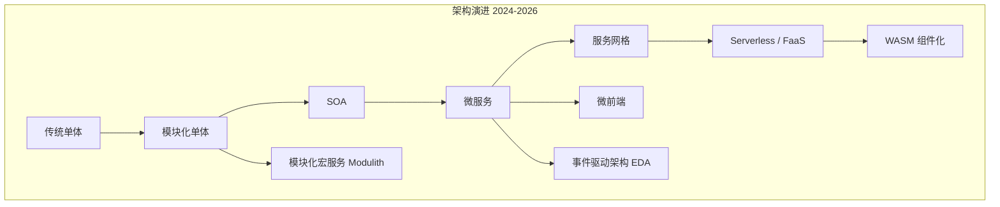

# 云原生架构模式复用性矩阵 2026 版
>
> 版本: 2026-06-06
> 对齐来源: CNCF State of Cloud Native Development Q1 2026, NIST SP 800-204 系列, Spring Modulith 2026, Istio Ambient Mesh GA, WebAssembly Component Model 3.0

## 1. 2026 架构格局概览

2024–2026 年，云原生架构经历了从"微服务默认"到"务实回归"的范式转换。CNCF Q1 2026 报告显示：39% 后端开发者采用微服务，但 42% 的团队正在回归模块化单体（Modular Monolith）；Serverless 持续稳健增长；服务网格进入 Sidecar-less 时代；WebAssembly Component Model 3.0（2025-12 发布）为跨语言组件复用开辟新边界。



## 2. 复用性矩阵：9 种架构模式 × 8 维度

| 架构模式 | 复用粒度 | 部署独立性 | 团队自治度 | 技术栈约束 | 数据一致性策略 | 运维复杂度 | 2026 适用场景 |
|---------|---------|-----------|-----------|-----------|-------------|-----------|-------------|
| **传统单体** | 应用级 | 无 | 低 | 单一栈强约束 | ACID / 本地事务 | 低 | 初创团队 MVP、遗留系统维护 |
| **模块化单体 (Modulith)** | 模块级 | 无（单制品） | 中 | 单一运行时，多技术受限 | 模块内 ACID，模块间最终一致 | 低-中 | 5–100 人团队、千万级用户、成本敏感型 |
| **SOA (ESB)** | 服务级 | 中 | 中 | ESB 平台绑定 | 分布式事务 / 补偿 | 高 | 企业遗留集成、BPM 编排 |
| **微服务** | 服务级 | 高 | 高 | 服务内自由，接口契约约束 | Saga / TCC / 最终一致 | 高 | 百人以上团队、十亿级请求、独立扩缩容需求 |
| **微前端** | 组件级 | 中（独立构建） | 中 | 框架无关，运行时隔离 | 通常无状态 | 中 | 大型 Web 应用、多团队并行交付 |
| **Serverless / FaaS** | 函数级 | 极高（自动） | 高 | 运行时强约束（冷启动限制） | 事件源 / 无状态 | 低（托管） | 突发流量、ETL、Webhook、AI 推理 |
| **服务网格 (Service Mesh)** | 通信模式级 | 基础设施层独立 | 高 | 数据平面透明 | 不处理，透传 | 高（Sidecar）→ 中（Ambient） | 多语言微服务、零信任安全、流量治理 |
| **EDA (事件驱动)** | 事件级 | 高（消费者独立） | 高 | 消息协议约束 | 最终一致 / CQRS | 中-高 | 实时流处理、解耦集成、日志审计 |
| **模块化宏服务 (Modular Macro-services)** | 域级 | 中（域级独立部署） | 中-高 | 域内自由 | 域内 ACID，域间 Saga | 中 | 中大型企业（10-50 人/域）、单体到微服务过渡 |

### 2.1 维度详解

#### 复用粒度

- **应用级**：整个应用作为复用单元（如 SaaS 多租户）
- **模块级**：应用内部模块通过 API 复用（Spring Modulith 模块）
- **服务级**：独立服务通过 API/事件复用
- **函数级**：单个函数通过触发器复用
- **通信模式级**：mTLS、熔断、重试等策略作为可复用配置

#### 部署独立性

- **无**：单体应用整体部署，回滚也是整体
- **中**：部分独立（如微前端可独立构建，但需集成部署）
- **高**：服务级独立 CI/CD
- **极高**：函数级自动扩缩容，按调用计费

#### 团队自治度（康威定律对齐）

| 模式 | 团队结构 | 沟通开销 |
|-----|---------|---------|
| 单体 | 功能团队 | 高（代码冲突） |
| 模块化单体 | 功能/特性混合 | 中（边界内自治） |
| 微服务 | 披萨团队（2-pizza） | 低（接口契约） |
| Serverless | 小型特性团队 | 低（事件契约） |

#### 技术栈约束

- **强约束**：单体/模块化单体内通常统一语言（Java/.NET/Node）
- **接口契约约束**：微服务/EDA 允许多语言，但需遵守 OpenAPI/Avro/Protobuf
- **运行时强约束**：Serverless 受限于平台运行时（如 AWS Lambda 支持的运行时版本）
- **透明无约束**：服务网格对应用代码透明，任意语言均可接入

#### 数据一致性策略

| 策略 | 适用模式 | 2026 工具/框架 |
|-----|---------|---------------|
| ACID | 单体、模块化单体、宏服务域内 | 本地数据库事务 |
| Saga (编排/协同) | 微服务、EDA | Camunda, Temporal, Netflix Conductor |
| TCC (Try-Confirm-Cancel) | 微服务 | Seata, Atomikos |
| 事件源 | EDA、Serverless | Kafka, EventStoreDB, AWS EventBridge |
| CQRS | EDA、微服务 | Axon Framework, Marten |

## 3. 2026 关键趋势解读

### 3.1 模块化单体回归（The Modulith Renaissance）

2026 年最显著的架构趋势是模块化单体的强势回归。Spring Modulith、.NET Aspire、NestJS 模块等框架使模块化单体成为一等公民：

- **Spring Modulith**：提供模块验证（测试时检测非法跨模块依赖）、事件驱动模块通信、自动模块交互文档生成
- **数据库策略**：单实例内 schema-per-module，模块拥有独立 schema，禁止跨 schema 查询
- **提取路径**：当某模块确有独立扩缩容需求时，基于已有接口和 schema 提取为微服务

> **Amazon Prime Video 案例（2023-03）**：将分布式微服务迁移为单进程单体，基础设施成本降低 90%，消除 S3 往返。这一事件成为"微服务并非万能"的标志性验证。[^1]

### 3.2 WebAssembly 组件化（WASM Component Model 3.0）

2025-12 发布的 WebAssembly 3.0 与 Component Model 将 WASM 从浏览器推向云原生核心：

| 指标 | 2026 数据 |
|-----|----------|
| 云原生开发者使用率 | 31% |
| 计划 12 个月内采用 | 37% |
| 视为颠覆性技术 | 70% |
| 主要驱动 | 可移植性 78%、性能提升 ≥10% 占 37% |

**复用边界**：WASM 组件通过 WIT（WASM Interface Types）定义接口，实现跨语言复用（Rust/Go/JavaScript/Java 等）。适用于插件架构、Serverless 运行时、边缘计算。

### 3.3 Sidecar-less 服务网格

| 模式 | 特点 | 2026 状态 |
|-----|------|----------|
| Sidecar | 每 Pod 注入 Envoy | 成熟但成本高，不推荐新集群 |
| Ambient (Istio) | ztunnel (L4) + waypoint (L7) | GA (v1.24, 2024-11)，推荐新集群 |
| eBPF (Cilium) | 内核级 L4，无代理 | Cisco 收购 Isovalent 后加速 |

## 4. 架构模式决策树

```mermaid
flowchart TD
    Start[开始: 选择架构模式] --> Q1{团队规模?}

    Q1 -->|≤ 20 人| Q2{部署频率?}
    Q1 -->|20–100 人| Q3{数据一致性要求?}
    Q1 -->|≥ 100 人| Q4{多语言需求?}

    Q2 -->|每周 ≤ 2 次| A1[模块化单体<br/>Modulith]
    Q2 -->|每日多次| A2[模块化单体 +<br/>独立模块提取路径]

    Q3 -->|强事务一致性| A3[模块化宏服务<br/>Domain 内 ACID]
    Q3 -->|最终一致可接受| Q5{合规要求?}

    Q5 -->|高合规 (金融/医疗)| A4[微服务 + 服务网格<br/>mTLS + 审计]
    Q5 -->|标准合规| A5[EDA + 微服务<br/>事件源 + Saga]

    Q4 -->|单语言主导| Q6{流量模式?}
    Q4 -->|多语言必须| A6[服务网格 + 微服务<br/>Ambient / Cilium]

    Q6 -->|突发/不可预测| A7[Serverless / FaaS<br/>+ WASM 组件]
    Q6 -->|稳定高吞吐| A8[微服务 + EDA<br/>Kafka + 服务网格]

    A1 --> A9[框架: Spring Modulith / .NET Aspire / NestJS]
    A3 --> A10[框架: Spring Boot + Modulith / DDD 分层]
    A4 --> A11[框架: Istio Ambient + OPA / Envoy Gateway]
    A5 --> A12[框架: Kafka + Temporal + Axon]
    A6 --> A13[框架: Cilium Mesh / Istio Ambient]
    A7 --> A14[框架: AWS Lambda + spin / wasmCloud]
    A8 --> A15[框架: Kubernetes + Kafka + Istio]
```

### 4.1 快速选择参考

| 场景 | 推荐模式 | 关键理由 |
|-----|---------|---------|
| 初创公司 MVP，< 10 人 | 模块化单体 | 最大化开发速度，保留未来拆分路径 |
| 中型 SaaS，50 人，月活百万 | 模块化单体 → 宏服务 | 80% 微服务收益，20% 成本 |
| 金融核心系统，强合规 | 微服务 + 服务网格 | mTLS、细粒度授权、审计追踪 |
| 电商平台，大促突发流量 | 微服务 + Serverless + EDA | 独立扩缩容 + 事件解耦 |
| AI 推理服务，多语言模型 | Serverless + WASM | 冷启动优化，跨语言组件复用 |
| 遗留系统集成 | SOA / API 网关 + 宏服务 | ESB 渐进替代，避免大爆炸重构 |
| 大型 Web 应用，多前端团队 | 微前端 + BFF 微服务 | 独立构建部署，运行时集成 |

## 5. 复用性量化评分（1-5 分制）

| 模式 | 代码复用 | 团队复用 | 基础设施复用 | 知识复用 | 平均 |
|-----|---------|---------|------------|---------|------|
| 传统单体 | 2 | 1 | 1 | 2 | 1.5 |
| 模块化单体 | 4 | 3 | 3 | 4 | 3.5 |
| SOA | 3 | 2 | 2 | 2 | 2.25 |
| 微服务 | 3 | 4 | 4 | 3 | 3.5 |
| 微前端 | 4 | 3 | 3 | 3 | 3.25 |
| Serverless | 2 | 3 | 5 | 2 | 3.0 |
| 服务网格 | 5 | 4 | 5 | 3 | 4.25 |
| EDA | 3 | 4 | 4 | 3 | 3.5 |
| 模块化宏服务 | 4 | 4 | 4 | 4 | **4.0** |

> **洞察**：服务网格在"基础设施复用"维度得分最高（通信模式作为平台能力复用）；模块化宏服务在均衡性上表现最佳，是 2026 年务实架构的首选。

## 6. 与 NIST SP 800-204 的对齐

NIST SP 800-204 系列定义的微服务安全策略可直接映射到本矩阵的多个维度：

| NIST 策略 | 对应矩阵维度 | 复用含义 |
|----------|------------|---------|
| MS-SS-1 认证 | 技术栈约束 | 标准化令牌（OAuth 2.0）跨模式复用 |
| MS-SS-4 安全通信 | 服务网格 | mTLS 作为可复用基础设施能力 |
| MS-SS-5~7 弹性 | 运维复杂度 | 熔断、重试、超时模式跨服务复用 |
| MS-SS-9 版本完整性 | 部署独立性 | 金丝雀/蓝绿作为部署模式复用 |

## 7. 参考索引

- CNCF: *State of Cloud Native Development Q1 2026* (2026-03)
- NIST SP 800-204/204A/204B/204C/204D (2025-02 更新)
- Spring Modulith: [spring.io/projects/spring-modulith](https://spring.io/projects/spring-modulith)
- Istio Ambient Mesh: [istio.io](https://istio.io) (v1.24 GA, 2024-11)
- WebAssembly Component Model 3.0: W3C (2025-12)
- Amazon Prime Video: *Scaling up the Prime Video audio/video monitoring service and reducing costs by 90%* (2023-03)
- ByteIota: *Microservices vs Monolith: 42% Return to Modular Monoliths* (2026-03-02)
- Cilium Service Mesh: [cilium.io](https://cilium.io) (Cisco/Isovalent, 2024)

---

[^1]: 需注意该案例针对特定工作负载（视频质量分析），不代表 Amazon 全面放弃微服务。其微服务架构仍主导电商、AWS 等核心业务。
