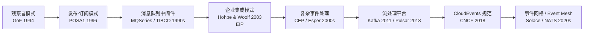
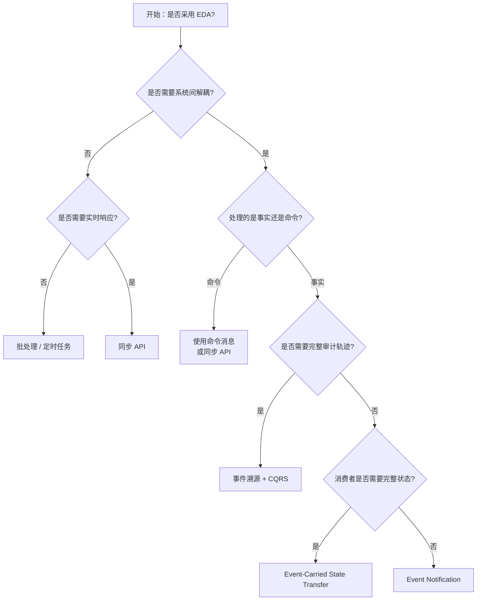
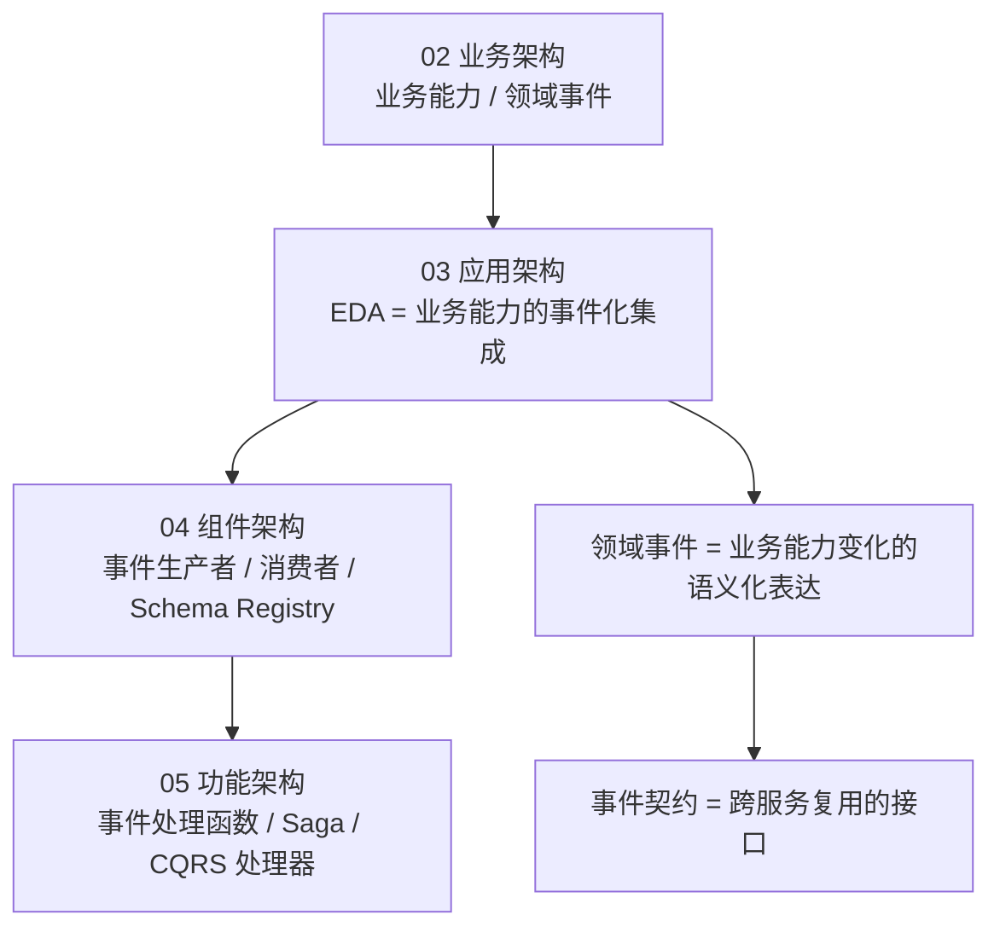
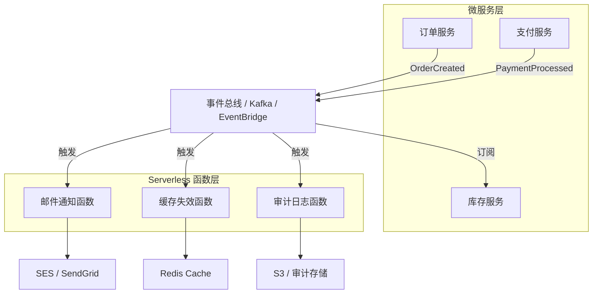

# 事件驱动架构复用模式

> **版本**: 2026-07-07
> **定位**: 03 应用架构复用的基础子主题 —— 事件驱动架构（Event-Driven Architecture, EDA）的复用模式、边界与决策
> **对齐标准**: CNCF, OASIS, ISO/IEC/IEEE 42010:2022
> **来源 URL**:
>
> - CNCF: <https://www.cncf.io/>
> - OASIS: <https://www.oasis-open.org/>
> - CloudEvents: <https://cloudevents.io/>
> **核查日期**: 2026-07-07

---

## 目录

- [事件驱动架构复用模式](#事件驱动架构复用模式)
  - [目录](#目录)
  - [1. 概念定义（CARC 本体）](#1-概念定义carc-本体)
    - [1.1 事件驱动架构（Event-Driven Architecture, EDA）](#11-事件驱动架构event-driven-architecture-eda)
    - [1.2 EDA 中的复用单元](#12-eda-中的复用单元)
    - [1.3 属性与特征](#13-属性与特征)
  - [2. 概念谱系与学术来源](#2-概念谱系与学术来源)
  - [3. 核心复用模式](#3-核心复用模式)
    - [3.1 事件通知（Event Notification）](#31-事件通知event-notification)
    - [3.2 事件携带状态转移（Event-Carried State Transfer, ECST）](#32-事件携带状态转移event-carried-state-transfer-ecst)
    - [3.3 事件溯源（Event Sourcing）](#33-事件溯源event-sourcing)
    - [3.4 命令查询职责分离（CQRS）](#34-命令查询职责分离cqrs)
    - [3.5 Saga 模式](#35-saga-模式)
    - [3.6 事件网格（Event Mesh）](#36-事件网格event-mesh)
  - [4. 事件契约与 Schema 治理](#4-事件契约与-schema-治理)
    - [4.1 事件 Schema 设计原则](#41-事件-schema-设计原则)
    - [4.2 CloudEvents 规范](#42-cloudevents-规范)
  - [5. 正向示例](#5-正向示例)
    - [示例 1：电商订单事件流](#示例-1电商订单事件流)
    - [示例 2：物联网设备遥测处理](#示例-2物联网设备遥测处理)
  - [6. 反例与失败案例](#6-反例与失败案例)
    - [反例 1：将 EDA 当作远程过程调用（RPC）](#反例-1将-eda-当作远程过程调用rpc)
    - [反例 2：缺乏 Schema 治理](#反例-2缺乏-schema-治理)
    - [反例 3：忽视事件顺序和幂等性](#反例-3忽视事件顺序和幂等性)
    - [案例：分布式 Saga 补偿失败](#案例分布式-saga-补偿失败)
    - [6.5 分析：反例根因总结](#65-分析反例根因总结)
  - [7. 多维对比矩阵](#7-多维对比矩阵)
    - [7.1 EDA 模式 × 适用场景](#71-eda-模式--适用场景)
    - [7.2 EDA vs 同步 API vs 批处理](#72-eda-vs-同步-api-vs-批处理)
  - [8. 场景决策树](#8-场景决策树)
  - [9. 关系与映射](#9-关系与映射)
    - [9.1 与四层架构的关系](#91-与四层架构的关系)
    - [9.2 与微服务架构的关系](#92-与微服务架构的关系)
    - [9.3 与 Serverless / FaaS 的关系](#93-与-serverless--faas-的关系)
    - [9.4 与同步 API、批处理的关系](#94-与同步-api批处理的关系)
    - [9.5 概念谱系关系](#95-概念谱系关系)
  - [10. EDA 与微服务/Serverless 协同 Mermaid 图](#10-eda-与微服务serverless-协同-mermaid-图)
  - [11. 交叉引用](#11-交叉引用)
  - [12. 权威来源](#12-权威来源)

---

## 1. 概念定义（CARC 本体）

### 1.1 事件驱动架构（Event-Driven Architecture, EDA）

**定义**：事件驱动架构是一种以**事件（Event）**为核心通信单元的架构风格。系统中的组件通过**生成、检测、消费事件**进行异步解耦协作。事件是对已发生事实的不可变记录，代表系统状态的变化。

**属性**：

| 属性 | 说明 |
|------|------|
| **事件（Event）** | 已发生事实的不可变记录，如 `OrderCreated`、`PaymentReceived` |
| **事件生产者（Producer）** | 生成并发布事件的组件 |
| **事件消费者（Consumer）** | 订阅并处理事件的组件 |
| **事件代理（Broker）** | 路由和暂存事件消息的中间件，如 Kafka、RabbitMQ、EventBridge |
| **事件契约（Schema）** | 事件的数据结构、语义和版本约定 |

**关系**：

- **produces**（生成）：生产者生成事件。
- **consumes**（消费）：消费者消费事件。
- **routes**（路由）：代理将事件路由到感兴趣的消费者。
- **triggers**（触发）：事件触发后续处理动作。

**约束**：

1. **不可变性约束**：事件一旦发布，不应被修改。
2. **最终一致性约束**：消费者看到的系统状态 eventual consistent。
3. **契约稳定约束**：事件 Schema 变更需保持向后兼容。
4. **幂等性约束**：消费者应能安全地重复处理同一事件。

---

### 1.2 EDA 中的复用单元

| 复用单元 | 示例 | 复用层级 |
|---------|------|---------|
| **事件契约** | CloudEvents、Avro Schema、Protobuf | 功能架构级 |
| **事件处理函数** | 消费者函数模板 | 功能架构级 |
| **拓扑模式** | Pub/Sub、Event Bus、Event Mesh | 模式级 |
| **Saga 编排** | 分布式事务工作流 | 业务流程级 |
| **Schema Registry** | Confluent Schema Registry、AWS Glue Schema Registry | 治理级 |

### 1.3 属性与特征

| 属性 | 说明 | 重要性 |
|---|---|---|
| **异步解耦** | 生产者与消费者无需同时在线，降低系统间直接依赖 | 高 |
| **事件不可变** | 事件代表已发生事实，发布后不可修改，支持审计与重放 | 高 |
| **契约驱动** | 事件 Schema 是跨系统复用的核心契约，需版本治理 | 高 |
| **最终一致性** | 消费者看到的系统状态 eventual consistent，需幂等性与顺序控制 | 高 |
| **一对多广播** | 同一事件可被多个独立消费者订阅，实现一次生产、多处复用 | 高 |
| **可观测性要求高** | 异步链路的调试复杂度高于同步调用，需分布式追踪与事件审计 | 中 |

---

## 2. 概念谱系与学术来源

事件驱动思想的演进：



**Wikipedia 对应条目**：

- [Event-driven architecture](https://en.wikipedia.org/wiki/Event-driven_architecture)
- [Publish–subscribe pattern](https://en.wikipedia.org/wiki/Publish%E2%80%93subscribe_pattern)
- [Complex event processing](https://en.wikipedia.org/wiki/Complex_event_processing)

---

## 3. 核心复用模式

### 3.1 事件通知（Event Notification）

**定义**：生产者发布轻量级事件，仅通知消费者“某事发生”，消费者需自行查询详情。

**复用收益**：

- 事件体积小，代理压力低。
- 消费者按需获取数据，避免信息过载。

**代价**：

- 消费者需要额外查询，增加延迟和耦合。

### 3.2 事件携带状态转移（Event-Carried State Transfer, ECST）

**定义**：事件携带完整状态或足够上下文，消费者无需再查询生产者。

**复用收益**：

- 消费者可独立处理，降低对生产者的依赖。
- 适合构建本地物化视图（Materialized View）。

**代价**：

- 事件体积大，网络和存储成本高。
- 数据一致性维护复杂。

### 3.3 事件溯源（Event Sourcing）

**定义**：将系统状态变化记录为一系列不可变事件，而非仅保存当前状态。

**复用收益**：

- 完整审计轨迹。
- 可重建任意时刻状态。
- 事件流可被多个消费者复用。

**代价**：

- 查询复杂，通常需配合 CQRS。
- 事件 Schema 演化困难。

### 3.4 命令查询职责分离（CQRS）

**定义**：将读模型和写模型分离，写模型通过事件同步到读模型。

**复用收益**：

- 读/写可独立优化和扩展。
- 读模型可根据消费者需求定制。

**代价**：

- 最终一致性增加系统复杂度。
- 读/写模型同步逻辑需维护。

### 3.5 Saga 模式

**定义**：将长事务拆分为多个本地事务，通过事件协调各参与方，失败时执行补偿操作。

**两种实现**：

| 类型 | 说明 | 适用场景 |
|------|------|---------|
| **编排式 Saga（Choreography）** | 每个服务完成本地事务后发布事件，触发下一个服务 | 简单流程 |
| **编排式 Saga（Orchestration）** | 中央协调器发送命令给各服务 | 复杂流程 |

### 3.6 事件网格（Event Mesh）

**定义**：跨云、跨地域、跨协议的事件路由层，使事件可在异构环境中流动。

**复用收益**：

- 统一事件入口和出口。
- 跨云、跨部门事件共享。

---

## 4. 事件契约与 Schema 治理

### 4.1 事件 Schema 设计原则

| 原则 | 说明 |
|------|------|
| **自描述** | 事件包含类型、来源、时间、ID 等元数据 |
| **向后兼容** | 新增字段可选，不删除/修改已有字段 |
| **领域语义** | 事件名使用业务语言，避免技术术语 |
| **不可变** | 事件代表已发生事实，不应被修改 |

### 4.2 CloudEvents 规范

**定义**：CNCF 推出的标准化事件封装格式，提供跨平台的事件互操作性。

**核心属性**：

| 属性 | 说明 |
|------|------|
| `specversion` | CloudEvents 版本 |
| `type` | 事件类型，如 `com.example.order.created` |
| `source` | 事件来源 URI |
| `id` | 事件唯一标识 |
| `time` | 事件发生时间 |
| `datacontenttype` | 数据内容类型 |
| `data` | 事件载荷 |

---

## 5. 正向示例

### 示例 1：电商订单事件流

**场景**：用户下单后，库存、支付、物流、通知等服务需要协同处理。

**事件设计**：

```text
OrderCreated ──> InventoryReserved ──> PaymentProcessed ──> OrderShipped
                    │                        │
                    ▼                        ▼
            NotificationSent        InvoiceGenerated
```

**复用方式**：

- `OrderCreated` 事件被库存服务、支付服务、通知服务共同消费。
- 每个服务基于事件构建本地物化视图。
- 事件 Schema 使用 CloudEvents 规范，跨团队共享。

**关键成功因素**：

1. 事件命名使用业务语言。
2. Schema 变更遵循向后兼容原则。
3. 消费者实现幂等性处理。

### 示例 2：物联网设备遥测处理

**场景**：数百万 IoT 设备持续上报遥测数据。

**复用方式**：

- 设备数据以 `DeviceTelemetry` 事件形式进入 Kafka。
- 实时流处理（Flink/Spark）消费事件进行异常检测。
- 时序数据库消费事件写入长期存储。
- 告警服务消费事件触发阈值告警。

**关键成功因素**：

1. 事件分区策略（按 deviceId）保证顺序性。
2. 消费者组实现水平扩展。
3. Schema Registry 管理事件版本。

---

## 6. 反例与失败案例

### 反例 1：将 EDA 当作远程过程调用（RPC）

**场景**：团队用事件传递命令，如 `CreateOrderCommand`，并要求同步等待响应。

**后果**：

- 失去异步解耦优势。
- 增加超时、重试、死信处理复杂度。

**判定**：混淆了事件（已发生事实）与命令（请求动作）。

### 反例 2：缺乏 Schema 治理

**场景**：各团队自由定义事件格式，无 Schema Registry 和版本管理。

**后果**：

- 消费者频繁因字段变更而中断。
- 事件解析逻辑分散，难以维护。

**判定**：事件契约未作为一等公民管理。

### 反例 3：忽视事件顺序和幂等性

**场景**：消费者未考虑事件乱序和重复投递。

**后果**：

- 同一订单被处理多次。
- 状态机因乱序事件进入非法状态。

**判定**：违反 EDA 基本约束。

### 案例：分布式 Saga 补偿失败

**背景**：旅游预订系统使用编排式 Saga 处理机票+酒店+租车组合订单。

**问题**：支付成功后酒店预订失败，补偿机票退订时航空公司 API 不可用。

**教训**：

- Saga 补偿操作也可能失败，需要重试、人工干预和审计机制。
- 需设计“不确定状态”的处理策略。

### 6.5 分析：反例根因总结

上述反例与失败案例的共同根因可归纳为四类：

1. **语义混淆**：将事件（事实）与命令（请求）混用，破坏了 EDA 的异步解耦语义。
2. **契约缺失**：事件 Schema 未作为一等公民治理，导致消费者与生产者之间的隐性依赖。
3. **顺序与幂等性假设错误**：未对乱序、重复投递等分布式消息基本特性做防御性设计。
4. **补偿机制不完善**： Saga 等长事务模式未充分考虑补偿操作自身的失败场景。

避免这些根因的关键在于：将事件契约、Schema 治理、幂等性设计纳入架构评审的必检项，并在 CI 中通过契约测试与兼容性检查持续验证。

---

## 7. 多维对比矩阵

### 7.1 EDA 模式 × 适用场景

| 模式 | 解耦程度 | 一致性 | 复杂度 | 复用对象 | 典型工具 |
|------|---------|--------|--------|---------|---------|
| **Event Notification** | 高 | 最终一致 | 低 | 事件类型定义 | SNS, Webhook |
| **Event-Carried State Transfer** | 高 | 最终一致 | 中 | 事件 Schema | Kafka, Pulsar |
| **Event Sourcing** | 极高 | 最终一致 | 高 | 事件流 | EventStoreDB |
| **CQRS** | 高 | 最终一致 | 高 | 读/写模型 | Axon, Marten |
| **Choreography Saga** | 高 | 最终一致 | 中 | 事件链 | Kafka, NATS |
| **Orchestration Saga** | 中 | 最终一致 | 高 | 工作流定义 | Temporal, Camunda |

### 7.2 EDA vs 同步 API vs 批处理

| 维度 | EDA | 同步 API | 批处理 |
|------|-----|---------|--------|
| **耦合度** | 低 | 高 | 低 |
| **响应性** | 近实时 | 即时 | 延迟 |
| **一致性** | 最终一致 | 强一致 | 最终一致 |
| **故障隔离** | 高 | 低 | 高 |
| **调试难度** | 高 | 低 | 中 |
| **适用场景** | 解耦集成、流处理 | 请求-响应、事务 | 大数据、报表 |

---

## 8. 场景决策树



---

## 9. 关系与映射

### 9.1 与四层架构的关系

事件驱动架构位于 **03 应用架构复用层**，是连接业务能力与功能实现的集成纽带：



**映射说明**：

- 业务能力的状态变化可建模为领域事件（Domain Event）。
- 领域事件是 EDA 中的核心复用单元，可被多个服务消费。
- 事件处理函数、Saga、CQRS 处理器属于 05 功能架构复用范畴。
- Schema Registry 和事件治理属于 06 跨层治理范畴。

### 9.2 与微服务架构的关系

微服务架构将系统拆分为围绕业务能力自治的服务；事件驱动是微服务间实现松耦合复用的首选机制。在微服务上下文中：

- **领域事件**作为跨服务契约，替代了部分同步 REST/gRPC 调用；
- **Saga 模式**利用事件协调分布式长事务；
- **CQRS**通过事件将写模型同步到多个读模型；
- **事件总线 / Kafka**成为服务间共享的基础设施，实现"一次生产、多处复用"。

当两个微服务需要共享数据时，优先选择事件驱动的数据同步（Event-Carried State Transfer）而非共享数据库，以保持服务自治。

### 9.3 与 Serverless / FaaS 的关系

Serverless 函数天然适合事件驱动模型：

- 函数由事件源触发，事件 Schema 即函数输入契约；
- 事件 broker（EventBridge、EventGrid、Kafka）解耦函数生产与消费；
- 函数的无状态、短时运行特性与事件的不可变、异步语义高度契合；
- Serverless 函数可作为 EDA 中的轻量级消费者或处理器，快速扩展事件处理管道的计算能力。

### 9.4 与同步 API、批处理的关系

| 维度 | EDA | 同步 API | 批处理 |
|---|---|---|---|
| 耦合度 | 低 | 高 | 低 |
| 实时性 | 近实时 | 即时 | 延迟 |
| 一致性 | 最终一致 | 强一致 | 最终一致 |
| 故障隔离 | 高 | 低 | 高 |
| 调试难度 | 高 | 低 | 中 |
| 适用场景 | 解耦集成、流处理 | 请求-响应、事务 | 大数据、报表 |

### 9.5 概念谱系关系

| 关系类型 | 目标概念 | 说明 |
|---|---|---|
| 上位概念 | [Event-driven architecture - Wikipedia](https://en.wikipedia.org/wiki/Event-driven_architecture) | EDA 是软件架构风格的一种 |
| 下位概念 | Publish-Subscribe、Message Queue、Event Streaming | EDA 的具体拓扑实现 |
| 下位概念 | Event Sourcing、CQRS、Saga | EDA 在数据一致性与事务领域的深化模式 |
| 等价概念 | Complex Event Processing（CEP） | 从事件流中识别复杂模式的技术 |
| 依赖概念 | Microservices、Serverless、Service Mesh | EDA 为这些架构样式提供解耦与复用机制 |
| 映射概念 | CloudEvents、AsyncAPI、ISO/IEC/IEEE 42010:2022 | 事件契约的标准化描述框架 |

---

## 10. EDA 与微服务/Serverless 协同 Mermaid 图



---

## 11. 交叉引用

- [02 微服务架构复用模式](../02-microservices/microservices-reuse-patterns.md)：微服务间通过事件实现解耦与复用
- [04 Serverless 架构复用模式](../04-serverless/serverless-reuse-patterns.md)：Serverless 函数作为事件消费者的设计
- [09 EDA/CQRS 事件溯源模式](../09-eda-cqrs/eda-cqrs-event-sourcing-patterns.md)：CQRS 与 Event Sourcing 的深度复用模式
- [01 分层架构复用模式](../01-layered-architecture/layered-architecture-reuse.md)：分层架构与事件驱动在边界上的互补
- [05 数据架构复用](../05-data-architecture/data-mesh-data-product-reuse.md)：数据网格中事件作为数据产品的集成界面

---

## 12. 权威来源

> **权威来源**:
>
> - [Event-driven architecture - Wikipedia](https://en.wikipedia.org/wiki/Event-driven_architecture) (核查日期: 2026-07-07)
> - [Publish–subscribe pattern - Wikipedia](https://en.wikipedia.org/wiki/Publish%E2%80%93subscribe_pattern) (核查日期: 2026-07-07)
> - [Complex event processing - Wikipedia](https://en.wikipedia.org/wiki/Complex_event_processing) (核查日期: 2026-07-07)
> - Hohpe, G., & Woolf, B. (2003). *Enterprise Integration Patterns: Designing, Building, and Deploying Messaging Solutions*. Addison-Wesley.
> - Fowler, M. (2005). *Event-Driven Architecture*. Martin Fowler. <https://martinfowler.com/articles/201701-event-driven.html>
> - CNCF. *CloudEvents Specification*. <https://cloudevents.io/>
> - Kleppmann, M. (2017). *Designing Data-Intensive Applications*. O'Reilly.（Chapter 11: Stream Processing）
> - ISO/IEC/IEEE 42010:2022. *Systems and software engineering — Architecture description*. <https://www.iso.org/standard/74393.html>
>
> **核查日期**: 2026-07-07