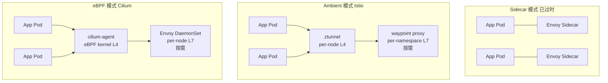

# 服务网格通信模式复用（Istio/Envoy/Cilium）
>
> 版本: 2026-06-06
> 对齐来源: Istio Ambient Mesh GA (v1.24, 2024-11), Envoy Gateway, Cilium Service Mesh v1.17, Gateway API v1.1+, NIST SP 800-204A

## 1. 2026 服务网格格局

服务网格在 2024–2026 年间经历了从 Sidecar 到 Sidecar-less 的范式迁移：

| 模式 | 代表 | 2026 状态 | 适用场景 |
|-----|------|----------|---------|
| **Sidecar** | 传统 Istio, Linkerd 2 | 成熟但成本高，不推荐新集群 | 遗留集群、StatefulSet 工作负载 |
| **Ambient** | Istio Ambient (ztunnel + waypoint) | GA，推荐新集群 | 通用微服务、多语言环境 |
| **eBPF** | Cilium Service Mesh | 成熟，Cisco/Isovalent 加持 | 性能敏感、CNI 统一 |

> **2026 共识**：新集群应选择 Ambient 或 eBPF；Sidecar 时代已结束。[^1]



## 2. 可复用通信模式总览

服务网格将分布式系统的通信模式沉淀为**平台级可复用能力**，应用代码零侵入即可获得：

| 模式 | 类型 | Istio Ambient | Cilium | 复用层级 |
|-----|------|--------------|--------|---------|
| **mTLS** | 安全 | ztunnel HBONE | eBPF + WireGuard / native TLS | 基础设施 |
| **流量镜像 (Traffic Mirroring)** | 流量管理 | waypoint Envoy | Envoy DaemonSet | 配置模板 |
| **熔断 (Circuit Breaker)** | 弹性 | waypoint Envoy | Envoy DaemonSet | 配置模板 |
| **重试 (Retry)** | 弹性 | waypoint Envoy | Envoy DaemonSet | 配置模板 |
| **超时 (Timeout)** | 弹性 | waypoint Envoy | Envoy DaemonSet | 配置模板 |
| **A/B 测试** | 流量管理 | Gateway API HTTPRoute | Gateway API HTTPRoute | 配置模板 |
| **金丝雀发布** | 流量管理 | Gateway API HTTPRoute 权重 | Gateway API HTTPRoute 权重 | 配置模板 |
| **故障注入** | 弹性/测试 | waypoint Envoy | Envoy DaemonSet | 配置模板 |
| **限流 (Rate Limit)** | 安全/弹性 | Envoy + RL 服务 | Envoy + RL 服务 | 配置模板 |
| **负载均衡** | 流量管理 | ztunnel / waypoint | eBPF maglev / Envoy | 基础设施 |

## 3. 通信模式详解与配置模板

### 3.1 mTLS（双向 TLS）

**模式描述**：服务间通信自动加密并双向认证，实现零信任安全模型。

**2026 实现差异**：

| 实现 | L4 处理 | 证书管理 | 性能影响 |
|-----|---------|---------|---------|
| Istio Ambient | ztunnel (Rust, userspace) | istiod 自动轮换 | ~0.3-0.6ms p50 |
| Cilium eBPF | eBPF kernel + WireGuard | cert-manager / SPIFFE | ~0.05-0.15ms p50 |

**Istio Ambient 配置**：

```yaml
# mTLS 在 Ambient 模式下默认启用，无需额外配置
# 仅当需要禁用特定流量时：
apiVersion: security.istio.io/v1beta1
kind: PeerAuthentication
metadata:
  name: default
  namespace: production
spec:
  mtls:
    mode: STRICT  # 强制 mTLS；PERMISSIVE 允许明文
---
# 命名空间级授权：仅允许同一 trust domain 内访问
apiVersion: security.istio.io/v1beta1
kind: AuthorizationPolicy
metadata:
  name: allow-same-namespace
  namespace: production
spec:
  action: ALLOW
  rules:
    - from:
        - source:
            namespaces: ["production"]
```

**Cilium eBPF 配置**：

```yaml
# Cilium mTLS 通过 WireGuard 或 native TLS 实现
# CiliumNetworkPolicy 自动处理加密
apiVersion: cilium.io/v2
kind: CiliumNetworkPolicy
metadata:
  name: encrypt-internal
  namespace: production
spec:
  endpointSelector:
    matchLabels:
      app: payment-service
  ingress:
    - fromEndpoints:
        - matchLabels:
            app: order-service
      toPorts:
        - ports:
            - port: "8080"
              protocol: TCP
          rules:
            http:
              - method: POST
                path: "/api/v1/payments"
  # WireGuard 加密在 Cilium ConfigMap 中全局启用
  # encryption.enabled=true, encryption.type=wireguard
```

### 3.2 流量镜像（Traffic Mirroring）

**模式描述**：将生产流量实时复制到测试/影子环境，用于新版本验证而不影响生产响应。

```yaml
# Istio Ambient: 通过 VirtualService + waypoint 实现
apiVersion: networking.istio.io/v1beta1
kind: VirtualService
metadata:
  name: payment-mirror
  namespace: production
spec:
  hosts:
    - payment-service
  http:
    - match:
        - uri:
            prefix: /api/v1/payments
      route:
        - destination:
            host: payment-service
            subset: stable
          weight: 100
      mirror:
        host: payment-service
        subset: canary   # 影子版本
      mirrorPercentage:
        value: 100.0     # 镜像 100% 流量
---
# Gateway API 风格（GAMMA 兼容）
apiVersion: gateway.networking.k8s.io/v1
kind: HTTPRoute
metadata:
  name: payment-route
  namespace: production
spec:
  parentRefs:
    - name: production-waypoint
      kind: Gateway
  rules:
    - matches:
        - path:
            type: PathPrefix
            value: /api/v1/payments
      backendRefs:
        - name: payment-service-stable
          port: 8080
          weight: 100
        - name: payment-service-shadow
          port: 8080
          weight: 0   # 主路由权重为 0，仅镜像
```

### 3.3 熔断（Circuit Breaker）

**模式描述**：当下游服务错误率/延迟超过阈值时，快速失败以避免级联故障。

```yaml
# Istio: DestinationRule 定义熔断策略
apiVersion: networking.istio.io/v1beta1
kind: DestinationRule
metadata:
  name: inventory-circuit-breaker
  namespace: production
spec:
  host: inventory-service
  trafficPolicy:
    connectionPool:
      tcp:
        maxConnections: 100
      http:
        http1MaxPendingRequests: 50
        http2MaxRequests: 100
        maxRequestsPerConnection: 10
        maxRetries: 3
    outlierDetection:
      consecutive5xxErrors: 5      # 连续 5 个 5xx 触发熔断
      interval: 30s                # 检测窗口
      baseEjectionTime: 30s        # 初始逐出时间
      maxEjectionPercent: 50       # 最大逐出比例
      consecutiveGatewayErrors: 3   # 网关错误阈值
---
# Cilium: 通过 Envoy Config 实现（CiliumEnvoyConfig CRD）
apiVersion: cilium.io/v2alpha1
kind: CiliumEnvoyConfig
metadata:
  name: inventory-circuit-breaker
  namespace: production
spec:
  services:
    - name: inventory-service
      namespace: production
  resources:
    - "@type": type.googleapis.com/envoy.config.cluster.v3.Cluster
      name: inventory-service
      connect_timeout: 5s
      circuit_breakers:
        thresholds:
          - priority: DEFAULT
            max_connections: 100
            max_pending_requests: 50
            max_requests: 100
            max_retries: 3
      outlier_detection:
        consecutive_5xx: 5
        interval: 30s
        base_ejection_time: 30s
        max_ejection_percent: 50
```

### 3.4 重试（Retry）

**模式描述**：对瞬时故障自动重试，配合指数退避避免惊群效应。

```yaml
# Istio Ambient: VirtualService 重试策略
apiVersion: networking.istio.io/v1beta1
kind: VirtualService
metadata:
  name: notification-retry
  namespace: production
spec:
  hosts:
    - notification-service
  http:
    - route:
        - destination:
            host: notification-service
      retries:
        attempts: 3                 # 最多重试 3 次
        perTryTimeout: 2s           # 每次重试超时
        retryOn: gateway-error,connect-failure,refused-stream
        # 可选: 退避策略
        backoff:
          baseInterval: 100ms
          maxInterval: 10s
---
# Gateway API 重试（通过 HTTPRoute 扩展，2026 实验性）
apiVersion: gateway.networking.k8s.io/v1
kind: HTTPRoute
metadata:
  name: notification-route
  annotations:
    experimental.gateway.networking.k8s.io/retry: |
      {
        "attempts": 3,
        "perTryTimeout": "2s",
        "retryOn": ["gateway-error", "connect-failure"]
      }
spec:
  parentRefs:
    - name: production-waypoint
  rules:
    - backendRefs:
        - name: notification-service
          port: 8080
```

### 3.5 超时（Timeout）

**模式描述**：为请求设置最大等待时间，防止长时间阻塞消耗资源。

```yaml
# Istio: VirtualService 超时配置
apiVersion: networking.istio.io/v1beta1
kind: VirtualService
metadata:
  name: report-timeout
  namespace: production
spec:
  hosts:
    - report-service
  http:
    - match:
        - uri:
            prefix: /api/v1/reports
      route:
        - destination:
            host: report-service
      timeout: 5s                  # 总超时 5 秒
      retries:
        attempts: 2
        perTryTimeout: 2s          # 每次尝试 2 秒
---
# 同时配合 DestinationRule 连接超时
apiVersion: networking.istio.io/v1beta1
kind: DestinationRule
metadata:
  name: report-connection-timeout
spec:
  host: report-service
  trafficPolicy:
    connectionPool:
      tcp:
        connectTimeout: 500ms      # TCP 连接建立超时
```

### 3.6 A/B 测试（Header-based Routing）

**模式描述**：根据请求头将流量路由到不同版本，用于用户体验实验。

```yaml
# Gateway API: HTTPRoute 头匹配
apiVersion: gateway.networking.k8s.io/v1
kind: HTTPRoute
metadata:
  name: checkout-ab-test
  namespace: production
spec:
  parentRefs:
    - name: external-gateway
      namespace: gateway-system
  hostnames:
    - checkout.example.com
  rules:
    # A/B 组: 实验版本
    - matches:
        - headers:
            - name: x-experiment-id
              value: checkout-v2
      backendRefs:
        - name: checkout-service-v2
          port: 8080
    # 默认: 稳定版本
    - backendRefs:
        - name: checkout-service-v1
          port: 8080
---
# Istio: 更复杂的权重 + 头组合
apiVersion: networking.istio.io/v1beta1
kind: VirtualService
metadata:
  name: checkout-ab
spec:
  hosts:
    - checkout-service
  http:
    - match:
        - headers:
            x-device-type:
              exact: mobile
      route:
        - destination:
            host: checkout-service
            subset: mobile-optimized
          weight: 90
        - destination:
            host: checkout-service
            subset: mobile-experimental
          weight: 10
    - route:
        - destination:
            host: checkout-service
            subset: stable
          weight: 95
        - destination:
            host: checkout-service
            subset: experimental
          weight: 5
```

### 3.7 金丝雀发布（Canary Deployment）

**模式描述**：逐步将流量从旧版本迁移到新版本，配合指标监控实现安全发布。

```yaml
# Gateway API: HTTPRoute 权重分配（GAMMA 标准）
apiVersion: gateway.networking.k8s.io/v1
kind: HTTPRoute
metadata:
  name: payment-canary
  namespace: production
spec:
  parentRefs:
    - name: production-waypoint
      kind: Gateway
  rules:
    - backendRefs:
        - name: payment-service-stable
          port: 8080
          weight: 90     # 90% 稳定版本
        - name: payment-service-canary
          port: 8080
          weight: 10     # 10% 金丝雀版本
---
# 配合自动渐进（需 Argo Rollouts / Flagger）
# 以下为 Istio 原生渐进示例
apiVersion: networking.istio.io/v1beta1
kind: VirtualService
metadata:
  name: payment-progressive
spec:
  hosts:
    - payment-service
  http:
    - route:
        - destination:
            host: payment-service
            subset: stable
          weight: 80
        - destination:
            host: payment-service
            subset: canary
          weight: 20
```

### 3.8 故障注入（Fault Injection）

**模式描述**：在测试环境主动注入延迟或错误，验证系统弹性。

```yaml
# Istio: VirtualService 故障注入
apiVersion: networking.istio.io/v1beta1
kind: VirtualService
metadata:
  name: chaos-test
  namespace: staging
spec:
  hosts:
    - inventory-service
  http:
    - fault:
        delay:
          percentage:
            value: 10.0           # 10% 请求注入延迟
          fixedDelay: 5s          # 延迟 5 秒
        abort:
          percentage:
            value: 1.0            # 1% 请求直接失败
          httpStatus: 503         # 返回 503
      route:
        - destination:
            host: inventory-service
```

## 4. 模式选择决策矩阵

| 场景 | 首选模式 | 次选模式 | 不推荐 | 关键考量 |
|-----|---------|---------|--------|---------|
| 零信任安全基线 | mTLS (Ambient/eBPF) | — | Sidecar mTLS | 性能、运维复杂度 |
| 新版本阴影验证 | 流量镜像 | 金丝雀 1% | A/B 测试 | 不阻塞生产响应 |
| 下游服务故障保护 | 熔断 + 重试 | 超时 | 无限重试 | 避免级联故障 |
| 用户体验实验 | A/B 测试 (Header) | 金丝雀权重 | 流量镜像 | 用户分组精确性 |
| 低风险渐进发布 | 金丝雀 (5%→50%→100%) | 蓝绿部署 | 直接全量 | 回滚速度 |
| 混沌工程验证 | 故障注入 | 生产流量镜像 | 金丝雀 | 隔离性 |
| 高并发 API 保护 | 限流 + 熔断 | 负载均衡 | 仅重试 | 资源保护 |
| 长事务处理 | 超时 + 重试(幂等) | 熔断 | 无超时 | 资源释放 |

## 5. 2026 平台工程集成

### 5.1 Golden Path 模板

新微服务自动获得服务网格能力：

```yaml
# 平台团队提供的 Golden Path 模板（简化）
apiVersion: v1
kind: Namespace
metadata:
  name: ${SERVICE_NAMESPACE}
  labels:
    istio.io/dataplane-mode: ambient   # 或 cilium-mesh: enabled
---
# 应用团队只需关注业务配置
apiVersion: gateway.networking.k8s.io/v1
kind: HTTPRoute
metadata:
  name: ${SERVICE_NAME}-route
spec:
  parentRefs:
    - name: shared-waypoint
  rules:
    - backendRefs:
        - name: ${SERVICE_NAME}
          port: 8080
```

### 5.2 开发者门户集成

- **Backstage 插件**：展示服务网格拓扑、流量分布、SLO 状态
- **统一策略注册**：OPA/Gatekeeper 验证通信策略合规性
- **可观测性打通**：OpenTelemetry 自动收集网格指标、链路追踪

## 6. 性能参考数据（2026）

基于公开基准测试的多源汇总：[^2]

| 指标 | 无网格 | Istio Sidecar | Istio Ambient | Cilium eBPF | Linkerd |
|-----|--------|--------------|---------------|-------------|---------|
| **p50 延迟** | 1.2ms | 3.8ms | 2.1ms | 1.4ms | 2.0ms |
| **p99 延迟** | 4.5ms | 12.3ms | 6.8ms | 5.1ms | 6.2ms |
| **每 Pod 内存** | 0 | ~70MB | 0 | 0 | ~20MB |
| **每节点内存** | 0 | 0 | ~50MB | ~100MB | 0 |
| **RPS 损耗** | Baseline | -15% | -5% | -2% | -4% |

## 7. 参考索引

- Istio Ambient Mesh: [istio.io](https://istio.io) (v1.24 GA, 2024-11; Multicluster Beta 2026-03)
- Cilium Service Mesh: [cilium.io](https://cilium.io) (v1.17, Cisco/Isovalent 2024)
- Kubernetes Gateway API: [gateway-api.sigs.k8s.io](https://gateway-api.sigs.k8s.io) (v1.1+ GAMMA)
- Envoy Gateway: [gateway.envoyproxy.io](https://gateway.envoyproxy.io)
- NIST SP 800-204A: *Building Secure Microservices-Based Applications Using Service Mesh Architecture*
- CNCF: "Istio Brings Future Ready Service Mesh to the AI Era" (2026-03-25)
- youngju.dev: "Service Mesh in 2026 — Istio Ambient / Linkerd 3 / Cilium Mesh Deep Dive" (2026-05-16)
- lucaberton.com: "Istio vs Cilium vs Linkerd 2026: Service Mesh Comparison" (2026-02-26)

---

[^1]: youngju.dev, "Service Mesh in 2026" (2026-05-16); Open Service Mesh 和 AWS App Mesh 已分别于 2024-01 和 2024-10 停止维护。
[^2]: 数据来源为多源公开基准测试汇总，实际性能受工作负载、实例类型、网络拓扑影响，建议在生产环境进行实际测试验证。
