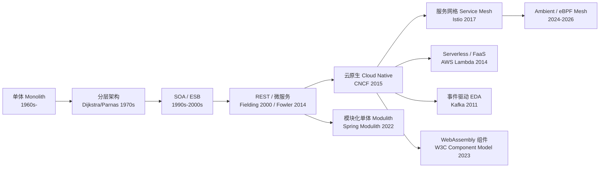
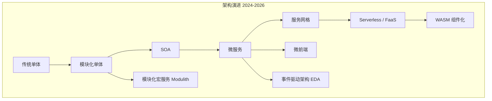
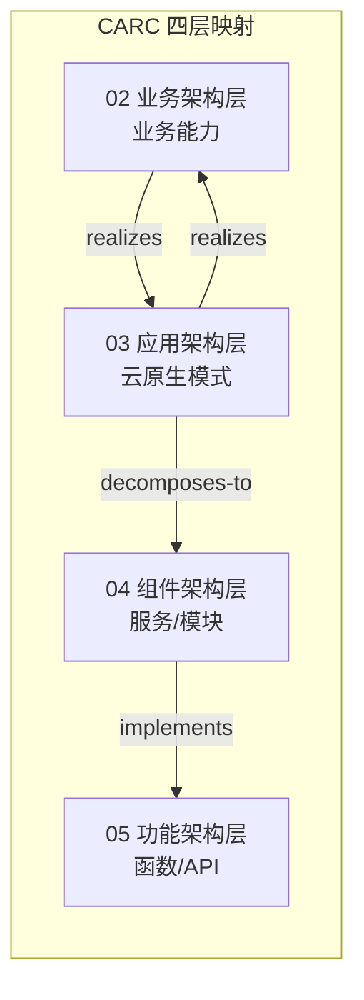

# 云原生架构模式复用性矩阵 2026 版

> **版本**: 2026-07-07
> **定位**: 03 应用架构复用层核心子主题 —— 云原生架构模式（单体、模块化单体、SOA、微服务、微前端、Serverless、服务网格、EDA、模块化宏服务）的复用性矩阵与决策框架
> **对齐标准**: ISO/IEC/IEEE 42010:2022, CNCF Cloud Native Trail Map, NIST SP 800-204 系列
> **来源 URL**:
>
> - ISO 42010: <https://www.iso.org/standard/74393.html>
> - CNCF: <https://www.cncf.io/>
> - CNCF Cloud Native Landscape: <https://landscape.cncf.io/>
> - NIST SP 800-204: <https://csrc.nist.gov/publications/detail/sp/800-204/final>
> - Spring Modulith: <https://spring.io/projects/spring-modulith>
> - Istio: <https://istio.io/latest/docs/ops/deployment/architecture/>
> **核查日期**: 2026-07-07

---

## 目录

- [云原生架构模式复用性矩阵 2026 版](#云原生架构模式复用性矩阵-2026-版)
  - [目录](#目录)
  - [1. 概念定义（CARC 本体）](#1-概念定义carc-本体)
    - [1.1 云原生架构模式（Cloud-Native Architectural Pattern）](#11-云原生架构模式cloud-native-architectural-pattern)
    - [1.2 复用维度（Reusability Dimension）](#12-复用维度reusability-dimension)
  - [2. 概念谱系与学术来源](#2-概念谱系与学术来源)
  - [3. 2026 架构格局概览](#3-2026-架构格局概览)
  - [4. 复用性矩阵：9 种架构模式 × 8 维度](#4-复用性矩阵9-种架构模式--8-维度)
  - [5. 维度详解](#5-维度详解)
    - [5.1 复用粒度](#51-复用粒度)
    - [5.2 部署独立性](#52-部署独立性)
    - [5.3 团队自治度（康威定律对齐）](#53-团队自治度康威定律对齐)
    - [5.4 数据一致性策略](#54-数据一致性策略)
  - [6. 2026 关键趋势解读](#6-2026-关键趋势解读)
    - [6.1 模块化单体回归（The Modulith Renaissance）](#61-模块化单体回归the-modulith-renaissance)
    - [6.2 WebAssembly 组件化（WASM Component Model 3.0）](#62-webassembly-组件化wasm-component-model-30)
    - [6.3 Sidecar-less 服务网格](#63-sidecar-less-服务网格)
    - [6.4 CNCF 项目成熟度与毕业状态（2026-07）](#64-cncf-项目成熟度与毕业状态2026-07)
  - [7. 正向示例](#7-正向示例)
    - [示例 1：SaaS 企业采用 Spring Modulith 构建模块化单体](#示例-1saas-企业采用-spring-modulith-构建模块化单体)
    - [示例 2：电商平台以微服务 + 服务网格支撑大促](#示例-2电商平台以微服务--服务网格支撑大促)
    - [示例 3：AI 推理服务采用 Serverless + WASM 组件](#示例-3ai-推理服务采用-serverless--wasm-组件)
  - [8. 反例与失败案例](#8-反例与失败案例)
    - [反例 1：初创公司盲目采用微服务导致"分布式单体"](#反例-1初创公司盲目采用微服务导致分布式单体)
    - [反例 2：某电商平台过早引入服务网格引发观测盲区](#反例-2某电商平台过早引入服务网格引发观测盲区)
    - [案例：Amazon Prime Video 微服务回迁单体（2023）](#案例amazon-prime-video-微服务回迁单体2023)
  - [9. 多维对比矩阵](#9-多维对比矩阵)
    - [9.1 架构模式 × 复用维度](#91-架构模式--复用维度)
    - [9.2 架构模式 × 团队规模 / 场景适配](#92-架构模式--团队规模--场景适配)
  - [10. 场景决策树](#10-场景决策树)
  - [11. 与 NIST SP 800-204 的对齐](#11-与-nist-sp-800-204-的对齐)
  - [12. 与四层架构的关系](#12-与四层架构的关系)
  - [13. 权威来源](#13-权威来源)

---

## 1. 概念定义（CARC 本体）

### 1.1 云原生架构模式（Cloud-Native Architectural Pattern）

**定义**：云原生架构模式是一组在分布式、可弹性扩展、可观测、可快速演化的运行时环境中组织软件系统的结构范式。它回答应用架构层（CARC 第三层）的**系统形态**问题，即业务能力应以何种部署与集成单元被复用。

**属性**：

| 属性 | 说明 |
|------|------|
| **复用粒度** | 系统、模块、服务、函数、事件或通信模式 |
| **部署独立性** | 单元能否独立构建、发布、回滚 |
| **技术栈约束** | 对语言、框架、运行时的锁定程度 |
| **弹性绑定时机** | 架构决策在编译期、启动期还是运行期生效 |
| **运维复杂度** | 运行期需要投入的治理与 SRE 成本 |

**关系**：

- **realizes（实现）**：云原生模式实现业务架构中的业务能力。
- **decomposes-to（分解为）**：应用系统按模式分解为组件、服务或函数。
- **supports（支撑）**：底层基础设施（Kubernetes、Service Mesh、API 网关）支撑模式运行。

**约束**：

1. **康威定律约束**：架构边界应与团队沟通边界对齐。
2. **可观测性约束**：运行期必须暴露指标、日志、追踪。
3. **可演进约束**：模式选择应保留从粗粒度到细粒度的渐进拆分路径。

### 1.2 复用维度（Reusability Dimension）

在云原生架构模式中，复用不是单一指标，而是**多维度权衡**的结果：

| 维度 | 含义 | 在 CARC 中的映射 |
|------|------|-----------------|
| **复用粒度** | 可被复用的最小单元大小 | 应用系统 → 组件 → 功能 |
| **部署独立性** | 单元独立发布的能力 | 应用架构的部署单元属性 |
| **团队自治度** | 团队对技术选型和发布节奏的控制权 | 业务架构的组织映射 |
| **技术栈约束** | 对语言、框架、中间件的锁定 | 组件架构的技术边界 |
| **数据一致性策略** | 单元间事务边界与一致性模型 | 数据架构与应用架构解耦 |
| **运维复杂度** | 运行期治理、可观测性、安全成本 | 跨层治理能力 |
| **成本模型** | 固定成本还是按用量计费 | 价值量化层 |
| **2026 成熟度** | 技术、生态、人才的可获得性 | 应用架构决策风险 |

---

## 2. 概念谱系与学术来源



**Wikipedia / 权威条目**：

- [Cloud-native computing](https://en.wikipedia.org/wiki/Cloud-native_computing)
- [Microservices](https://en.wikipedia.org/wiki/Microservices)
- [Serverless computing](https://en.wikipedia.org/wiki/Serverless_computing)
- [Service mesh](https://en.wikipedia.org/wiki/Service_mesh)

---

## 3. 2026 架构格局概览

2024–2026 年，云原生架构经历了从"微服务默认"到"务实回归"的范式转换。
CNCF Q1 2026 报告显示：39% 后端开发者采用微服务，但 42% 的团队正在回归模块化单体（Modular Monolith）；
Serverless 持续稳健增长；
服务网格进入 Sidecar-less 时代；
WebAssembly Component Model 3.0（2025-12 发布）为跨语言组件复用开辟新边界。



---

## 4. 复用性矩阵：9 种架构模式 × 8 维度

| 架构模式 | 复用粒度 | 部署独立性 | 团队自治度 | 技术栈约束 | 数据一致性策略 | 运维复杂度 | 2026 适用场景 |
|---------|---------|-----------|-----------|-----------|-------------|-----------|-------------|
| **传统单体** | 应用级 | 无 | 低 | 单一栈强约束 | ACID / 本地事务 | 低 | 初创团队 MVP、遗留系统维护 |
| **模块化单体 (Modulith)** | 模块级 | 无（单制品） | 中 | 单一运行时，多技术受限 | 模块内 ACID，模块间最终一致 | 低-中 | 5–100 人团队、千万级用户、成本敏感型 |
| **SOA (ESB)** | 服务级 | 中 | 中 | ESB 平台绑定 | 分布式事务 / 补偿 | 高 | 企业遗留集成、BPM 编排 |
| **微服务** | 服务级 | 高 | 高 | 服务内自由，接口契约约束 | Saga / TCC / 最终一致 | 高 | 百人以上团队、十亿级请求、独立扩缩容需求 |
| **微前端** | 组件级 | 中（独立构建） | 中 | 框架无关，运行时隔离 | 通常无状态 | 中 | 大型 Web 应用、多团队并行交付 |
| **Serverless / FaaS** | 函数级 | 极高（自动） | 高 | 运行时强约束（冷启动限制） | 事件源 / 无状态 | 低（托管） | 突发流量、ETL、Webhook、AI 推理 |
| **服务网格 (Service Mesh)** | 通信模式级 | 基础设施层独立 | 高 | 数据平面透明 | 不处理，透传 | 高（Sidecar）→ 中（Ambient） | 多语言微服务、零信任安全、流量治理 |
| **EDA (事件驱动)** | 事件级 | 高（消费者独立） | 高 | 消息协议约束 | 最终一致 / CQRS | 中-高 | 实时流处理、解耦集成、日志审计 |
| **模块化宏服务 (Modular Macro-services)** | 域级 | 中（域级独立部署） | 中-高 | 域内自由 | 域内 ACID，域间 Saga | 中 | 中大型企业（10-50 人/域）、单体到微服务过渡 |

---

## 5. 维度详解

### 5.1 复用粒度

- **应用级**：整个应用作为复用单元（如 SaaS 多租户）。
- **模块级**：应用内部模块通过 API 复用（Spring Modulith 模块）。
- **服务级**：独立服务通过 API/事件复用。
- **函数级**：单个函数通过触发器复用。
- **通信模式级**：mTLS、熔断、重试等策略作为可复用配置。

### 5.2 部署独立性

| 等级 | 含义 | 回滚影响范围 |
|------|------|-------------|
| **无** | 单体应用整体部署 | 全系统 |
| **中** | 部分独立（如微前端可独立构建，但需集成部署）| 集成边界 |
| **高** | 服务级独立 CI/CD | 单个服务或域 |
| **极高** | 函数级自动扩缩容，按调用计费 | 单个函数 |

### 5.3 团队自治度（康威定律对齐）

| 模式 | 团队结构 | 沟通开销 |
|-----|---------|---------|
| 单体 | 功能团队 | 高（代码冲突） |
| 模块化单体 | 功能/特性混合 | 中（边界内自治） |
| 微服务 | 披萨团队（2-pizza） | 低（接口契约） |
| Serverless | 小型特性团队 | 低（事件契约） |

### 5.4 数据一致性策略

| 策略 | 适用模式 | 2026 工具/框架 |
|-----|---------|---------------|
| ACID | 单体、模块化单体、宏服务域内 | 本地数据库事务 |
| Saga (编排/协同) | 微服务、EDA | Camunda, Temporal, Netflix Conductor |
| TCC (Try-Confirm-Cancel) | 微服务 | Seata, Atomikos |
| 事件源 | EDA、Serverless | Kafka, EventStoreDB, AWS EventBridge |
| CQRS | EDA、微服务 | Axon Framework, Marten |

---

## 6. 2026 关键趋势解读

### 6.1 模块化单体回归（The Modulith Renaissance）

2026 年最显著的架构趋势是模块化单体的强势回归。Spring Modulith、.NET Aspire、NestJS 模块等框架使模块化单体成为一等公民：

- **Spring Modulith**：提供模块验证（测试时检测非法跨模块依赖）、事件驱动模块通信、自动模块交互文档生成。
- **数据库策略**：单实例内 schema-per-module，模块拥有独立 schema，禁止跨 schema 查询。
- **提取路径**：当某模块确有独立扩缩容需求时，基于已有接口和 schema 提取为微服务。

> **Amazon Prime Video 案例（2023-03）**：将分布式微服务迁移为单进程单体，基础设施成本降低 90%，消除 S3 往返。这一事件成为"微服务并非万能"的标志性验证。[^1]

### 6.2 WebAssembly 组件化（WASM Component Model 3.0）

2025-12 发布的 WebAssembly 3.0 与 Component Model 将 WASM 从浏览器推向云原生核心：

| 指标 | 2026 数据 |
|-----|----------|
| 云原生开发者使用率 | 31% |
| 计划 12 个月内采用 | 37% |
| 视为颠覆性技术 | 70% |
| 主要驱动 | 可移植性 78%、性能提升 ≥10% 占 37% |

**复用边界**：WASM 组件通过 WIT（WASM Interface Types）定义接口，实现跨语言复用（Rust/Go/JavaScript/Java 等）。适用于插件架构、Serverless 运行时、边缘计算。

### 6.3 Sidecar-less 服务网格

| 模式 | 特点 | 2026 状态 |
|-----|------|----------|
| Sidecar | 每 Pod 注入 Envoy | 成熟但成本高，不推荐新集群 |
| Ambient (Istio) | ztunnel (L4) + waypoint (L7) | GA（v1.24, 2024-11），推荐新集群 |
| eBPF (Cilium) | 内核级 L4，无代理 | Cisco 收购 Isovalent 后加速 |

### 6.4 CNCF 项目成熟度与毕业状态（2026-07）

本矩阵涉及的云原生项目及其在 CNCF 中的成熟度如下，成熟度依据 <https://www.cncf.io/projects/> 与 <https://landscape.cncf.io/>：

| 项目/标准 | CNCF 成熟度 | 关键里程碑 | 对复用的意义 |
|----------|------------|-----------|-------------|
| **Kubernetes** | Graduated (2018-03) | 容器编排事实标准 | 所有云原生模式的运行基座 |
| **Prometheus** | Graduated (2018-08) | 监控指标 | 可观测性复用 |
| **Envoy** | Graduated (2021-04) | 服务网格数据平面 | Sidecar / Gateway 底层代理 |
| **Istio** | CNCF Graduated (2023-07) | 服务网格控制平面 | Ambient Mesh、流量治理复用 |
| **Linkerd** | Graduated (2021-07) | 轻量服务网格 | 中小规模服务网格首选 |
| **Cilium** | Graduated (2023-10) | eBPF 网络、CNI、服务网格 | Sidecar-less 服务网格 |
| **Knative** | Graduated (2025-03) | Kubernetes 原生 Serverless | Serverless 容器与事件复用 |
| **Backstage** | Incubating | 内部开发者门户 | 服务目录与 Golden Path 复用 |
| **Crossplane** | Graduated (2025-11) | 基础设施即 Kubernetes API | 云资源复用与多云抽象 |
| **Dapr** | Graduated | Sidecar 分布式能力 | 语言无关的状态、消息、服务调用复用 |
| **KEDA** | Graduated | 事件驱动自动伸缩 | Serverless/EDA 弹性复用 |
| **Argo** | Graduated | GitOps、工作流 | 部署与工作流模板复用 |
| **OpenTelemetry** | Graduated (2024-09) | 可观测性框架 | 跨模式统一 traces/metrics/logs |
| **Gateway API** | Kubernetes SIG Network | v1.5 Standard（2026-02-27） | Kubernetes 统一路由标准 |
| **WebAssembly Component Model** | W3C / Bytecode Alliance | 3.0（2025-12） | 跨语言组件复用 |

> **成熟度启示**: Graduated 项目最适合作为组织级复用基座；Incubating 项目可在非关键路径试点；Sandbox 项目建议仅用于技术雷达跟踪。

---

## 7. 正向示例

### 示例 1：SaaS 企业采用 Spring Modulith 构建模块化单体

**场景**：一家 60 人的 B2B SaaS 公司需要支撑 500 万日活，团队以功能特性组织，但独立部署需求有限。

**复用方式**：

- 采用 Spring Modulith 将系统划分为订单、计费、客户、权限等模块。
- 每个模块拥有独立包、独立 schema、独立事件发布。
- 模块间通过内部事件异步通信，模块内保持 ACID。

**关键成功因素**：

1. 模块边界与团队边界对齐，减少跨模块提交。
2. 模块验证 CI 阶段禁止非法依赖，保持架构纪律。
3. 保留从模块到微服务的提取路径，避免一次性大重构。

**复用收益**：

- 单制品部署降低 CI/CD 复杂度 60%。
- 模块级代码复用率提升（通用工具、权限校验被多个模块消费）。
- 当计费模块需要独立扩缩容时，按已有接口提取为服务，迁移成本低。

### 示例 2：电商平台以微服务 + 服务网格支撑大促

**场景**：头部电商平台在 618、双 11 期间流量波动剧烈，支付、库存、物流必须独立扩缩容。

**复用方式**：

- 业务能力（订单、支付、库存、物流）拆分为微服务。
- Istio Ambient 提供全链路 mTLS、熔断、重试、金丝雀发布。
- Gateway API 统一入口，按域名和权重分发流量。

**关键成功因素**：

1. 服务间通过 OpenAPI/gRPC 契约通信，禁止直接访问对方数据库。
2. 可观测性平台（OpenTelemetry + Prometheus + Jaeger）全覆盖。
3. 大促前通过故障注入和流量镜像进行压测验证。

**复用收益**：

- 通信模式（mTLS、熔断、重试）以服务网格配置复用，业务代码零侵入。
- 库存服务在大促期间独立扩容 10 倍，不影响其他服务。
- 金丝雀发布将新版本故障影响面控制在 5% 以内。

### 示例 3：AI 推理服务采用 Serverless + WASM 组件

**场景**：一家 AI 创业公司需要为不同客户提供多语言模型推理，流量稀疏但突发。

**复用方式**：

- 将预处理（tokenization）、推理（ONNX Runtime）、后处理封装为 WASM 组件。
- 通过 Knative / AWS Lambda 按请求自动扩缩容。
- 组件接口使用 WIT 定义，支持 Rust 编写核心逻辑、JavaScript 编写适配层。

**关键成功因素**：

1. WASM 组件沙箱隔离，不同租户模型运行时互不干扰。
2. 冷启动时间通过提前编译（AOT）控制在百毫秒级。
3. 推理组件可在边缘节点和中心云之间无差异复用。

**复用收益**：

- 同一份 WASM 组件在本地开发、测试、生产、边缘复用。
- 函数级计费避免长期持有 GPU 资源，成本降低 70%。

---

## 8. 反例与失败案例

### 反例 1：初创公司盲目采用微服务导致"分布式单体"

**场景**：一家 15 人的初创公司在产品未验证前，将系统拆分为 12 个微服务，希望"为 future scale 做准备"。

**后果**：

- 完成一次用户注册需要调用 5 个服务，本地开发需要启动 8 个进程。
- 服务间共享数据库，schema 变更需同步修改多个服务。
- 每次发布必须按固定顺序部署多个服务，失去独立部署优势。

**判定**：违反微服务的数据隔离约束和团队自治约束，形成**分布式单体**。应优先采用模块化单体，待团队规模和流量增长后再拆分。

### 反例 2：某电商平台过早引入服务网格引发观测盲区

**场景**：一家年交易额百亿级的电商在团队尚未建立可观测性体系时，全面上线 Istio Sidecar。

**后果**：

- Sidecar 资源消耗占节点内存 25%，成本激增。
- envoy 配置错误导致部分流量被静默丢弃，故障定位耗时 6 小时。
- 开发团队不理解网格行为，将本应由业务层处理的超时逻辑下沉到网格，出现重复重试。

**判定**：服务网格是**运行期基础设施复用**，必须在可观测性、SRE 能力、团队培训到位后引入；否则会将局部问题放大为系统性风险。

### 案例：Amazon Prime Video 微服务回迁单体（2023）

**背景**：Prime Video 的音频/视频质量监控服务最初采用分布式组件架构。

**失败原因**：

- 分布式步骤间的 S3 往返和 Step Functions 调用成本过高。
- 每个步骤独立部署并未带来业务收益，反而增加延迟和费用。

**改进**：团队将服务合并为单进程单体，在内存中处理数据流，基础设施成本降低 90%。

**教训**：架构模式选择应基于**实际工作负载特征**和**成本结构**，而非默认采用最新模式。

---

## 9. 多维对比矩阵

### 9.1 架构模式 × 复用维度

| 模式 | 代码复用 | 团队复用 | 基础设施复用 | 知识复用 | 平均 |
|-----|---------|---------|------------|---------|------|
| 传统单体 | 2 | 1 | 1 | 2 | 1.5 |
| 模块化单体 | 4 | 3 | 3 | 4 | 3.5 |
| SOA | 3 | 2 | 2 | 2 | 2.25 |
| 微服务 | 3 | 4 | 4 | 3 | 3.5 |
| 微前端 | 4 | 3 | 3 | 3 | 3.25 |
| Serverless | 2 | 3 | 5 | 2 | 3.0 |
| 服务网格 | 5 | 4 | 5 | 3 | 4.25 |
| EDA | 3 | 4 | 4 | 3 | 3.5 |
| 模块化宏服务 | 4 | 4 | 4 | 4 | **4.0** |

> **洞察**：服务网格在"基础设施复用"维度得分最高（通信模式作为平台能力复用）；模块化宏服务在均衡性上表现最佳，是 2026 年务实架构的首选。

### 9.2 架构模式 × 团队规模 / 场景适配

| 场景 | 推荐模式 | 关键理由 | 不推荐模式 |
|-----|---------|---------|-----------|
| 初创公司 MVP，< 10 人 | 模块化单体 | 最大化开发速度，保留未来拆分路径 | 微服务、服务网格 |
| 中型 SaaS，50 人，月活百万 | 模块化单体 → 宏服务 | 80% 微服务收益，20% 成本 | 全面微服务 |
| 金融核心系统，强合规 | 微服务 + 服务网格 | mTLS、细粒度授权、审计追踪 | 单体 |
| 电商平台，大促突发流量 | 微服务 + Serverless + EDA | 独立扩缩容 + 事件解耦 | 模块化单体 |
| AI 推理服务，多语言模型 | Serverless + WASM | 冷启动优化，跨语言组件复用 | 传统单体 |
| 遗留系统集成 | SOA / API 网关 + 宏服务 | ESB 渐进替代，避免大爆炸重构 | 直接微服务化 |
| 大型 Web 应用，多前端团队 | 微前端 + BFF 微服务 | 独立构建部署，运行时集成 | 单体前端 |

---

## 10. 场景决策树

```mermaid
flowchart TD
    Start[开始: 选择架构模式] --> Q1{团队规模?}

    Q1 -->|≤ 20 人| Q2{部署频率?}
    Q1 -->|20–100 人| Q3{数据一致性要求?}
    Q1 -->|≥ 100 人| Q4{多语言需求?}

    Q2 -->|每周 ≤ 2 次| A1[模块化单体<br/>Modulith]
    Q2 -->|每日多次| A2[模块化单体 +<br/>独立模块提取路径]

    Q3 -->|强事务一致性| A3[模块化宏服务<br/>Domain 内 ACID]
    Q3 -->|最终一致可接受| Q5{合规要求?}

    Q5 -->|高合规 (金融/医疗)| A4[微服务 + 服务网格<br/>mTLS + 审计]
    Q5 -->|标准合规| A5[EDA + 微服务<br/>事件源 + Saga]

    Q4 -->|单语言主导| Q6{流量模式?}
    Q4 -->|多语言必须| A6[服务网格 + 微服务<br/>Ambient / Cilium]

    Q6 -->|突发/不可预测| A7[Serverless / FaaS<br/>+ WASM 组件]
    Q6 -->|稳定高吞吐| A8[微服务 + EDA<br/>Kafka + 服务网格]

    A1 --> A9[框架: Spring Modulith / .NET Aspire / NestJS]
    A3 --> A10[框架: Spring Boot + Modulith / DDD 分层]
    A4 --> A11[框架: Istio Ambient + OPA / Envoy Gateway]
    A5 --> A12[框架: Kafka + Temporal + Axon]
    A6 --> A13[框架: Cilium Mesh / Istio Ambient]
    A7 --> A14[框架: AWS Lambda + spin / wasmCloud]
    A8 --> A15[框架: Kubernetes + Kafka + Istio]
```

---

## 11. 与 NIST SP 800-204 的对齐

NIST SP 800-204 系列定义的微服务安全策略可直接映射到本矩阵的多个维度：

| NIST 策略 | 对应矩阵维度 | 复用含义 |
|----------|------------|---------|
| MS-SS-1 认证 | 技术栈约束 | 标准化令牌（OAuth 2.0）跨模式复用 |
| MS-SS-4 安全通信 | 服务网格 | mTLS 作为可复用基础设施能力 |
| MS-SS-5~7 弹性 | 运维复杂度 | 熔断、重试、超时模式跨服务复用 |
| MS-SS-9 版本完整性 | 部署独立性 | 金丝雀/蓝绿作为部署模式复用 |

---

## 12. 与四层架构的关系



- **业务架构层**：决定需要复用的业务能力（如订单、支付）。
- **应用架构层**：选择承载能力的云原生模式（单体、微服务、Serverless）。
- **组件架构层**：在选定模式下划分模块、服务、Sidecar、函数。
- **功能架构层**：暴露具体 API、事件、函数供消费方复用。

---

## 13. 权威来源

- ISO/IEC/IEEE 42010:2022 — Systems and software engineering — Architecture description: <https://www.iso.org/standard/74393.html>
- ISO/IEC 25010:2023 — Systems and software engineering — SQuaRE — Product quality model: <https://www.iso.org/standard/78176.html>
- CNCF — Cloud Native Computing Foundation: <https://www.cncf.io/>
- CNCF Cloud Native Landscape: <https://landscape.cncf.io/>
- CNCF Graduated and Incubating Projects: <https://www.cncf.io/projects/>
- NIST SP 800-204 — Security Strategies for Microservices-based Application Systems: <https://csrc.nist.gov/publications/detail/sp/800-204/final>
- NIST SP 800-204A — Building Secure Microservices-Based Applications Using Service Mesh Architecture: <https://csrc.nist.gov/publications/detail/sp/800-204a/final>
- NIST SP 800-204B — Attribute-based Access Control for Microservices-based Applications Using a Service Mesh: <https://csrc.nist.gov/publications/detail/sp/800-204b/final>
- NIST SP 800-204C — Implementation of DevSecOps for a Microservices-based Application with Service Mesh: <https://csrc.nist.gov/publications/detail/sp/800-204c/final>
- NIST SP 800-204D — Strategies for the Integration of Software Supply Chain Security in DevSecOps CI/CD Pipelines: <https://csrc.nist.gov/publications/detail/sp/800-204d/final>
- Spring Modulith: <https://spring.io/projects/spring-modulith>
- Istio — Service Mesh Architecture: <https://istio.io/latest/docs/ops/deployment/architecture/>
- Cilium Service Mesh: <https://cilium.io/use-cases/service-mesh/>
- Kubernetes Gateway API v1.5 Release: <https://kubernetes.io/blog/2026/04/21/gateway-api-v1-5/>
- WebAssembly Component Model: <https://component-model.bytecodealliance.org/>
- Amazon Prime Video — Scaling up the Prime Video audio/video monitoring service and reducing costs by 90% (2023-03): <https://www.primevideotech.com/video-streaming/scaling-up-the-prime-video-audio-video-monitoring-service-and-reducing-costs-by-90>

**核查日期**: 2026-07-08

---

[^1]: 需注意该案例针对特定工作负载（视频质量分析），不代表 Amazon 全面放弃微服务。其微服务架构仍主导电商、AWS 等核心业务。
