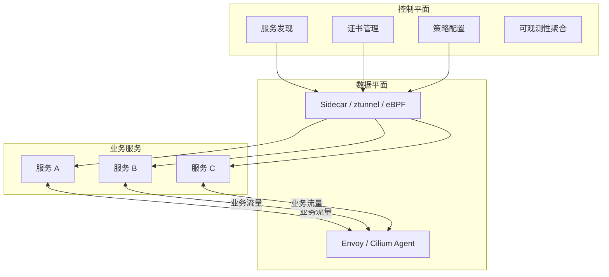
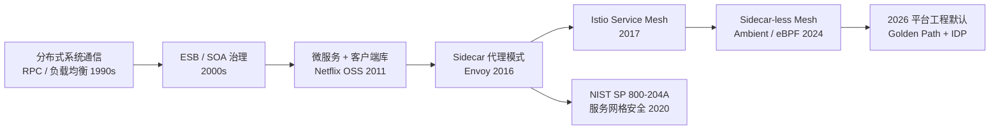
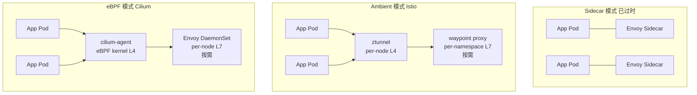
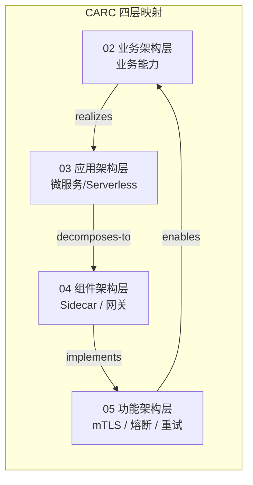

# 服务网格通信模式复用（Istio/Envoy/Cilium）

> **版本**: 2026-07-07
> **定位**: 03 应用架构复用层核心子主题 —— 服务网格将分布式通信模式沉淀为平台级可复用能力
> **对齐标准**: CNCF, NIST SP 800-204A, ISO/IEC/IEEE 42010:2022
> **来源 URL**:
>
> - Istio: <https://istio.io/latest/docs/ops/deployment/architecture/>
> - Cilium Service Mesh: <https://cilium.io/use-cases/service-mesh/>
> - Envoy Gateway: <https://gateway.envoyproxy.io/>
> - Kubernetes Gateway API: <https://gateway-api.sigs.k8s.io/>
> - NIST SP 800-204A: <https://csrc.nist.gov/publications/detail/sp/800-204a/final>
> **核查日期**: 2026-07-07

---

## 目录

- [服务网格通信模式复用（Istio/Envoy/Cilium）](#服务网格通信模式复用istioenvoycilium)
  - [目录](#目录)
  - [1. 概念定义（CARC 本体）](#1-概念定义carc-本体)
    - [1.1 服务网格（Service Mesh）](#11-服务网格service-mesh)
    - [1.2 通信模式（Communication Pattern）](#12-通信模式communication-pattern)
    - [1.3 数据平面与控制平面](#13-数据平面与控制平面)
  - [2. 概念谱系与学术来源](#2-概念谱系与学术来源)
  - [3. 2026 服务网格格局](#3-2026-服务网格格局)
  - [2. 可复用通信模式总览](#2-可复用通信模式总览)
  - [3. 通信模式详解与配置模板](#3-通信模式详解与配置模板)
    - [3.1 mTLS（双向 TLS）](#31-mtls双向-tls)
    - [3.2 流量镜像（Traffic Mirroring）](#32-流量镜像traffic-mirroring)
    - [3.3 熔断（Circuit Breaker）](#33-熔断circuit-breaker)
    - [3.4 重试（Retry）](#34-重试retry)
    - [3.5 超时（Timeout）](#35-超时timeout)
    - [3.6 A/B 测试（Header-based Routing）](#36-ab-测试header-based-routing)
    - [3.7 金丝雀发布（Canary Deployment）](#37-金丝雀发布canary-deployment)
    - [3.8 故障注入（Fault Injection）](#38-故障注入fault-injection)
  - [4. 模式选择决策矩阵](#4-模式选择决策矩阵)
  - [7. 正向示例](#7-正向示例)
    - [示例 1：金融支付平台的全链路 mTLS 与零信任](#示例-1金融支付平台的全链路-mtls-与零信任)
    - [示例 2：电商库存服务的流量镜像与熔断保护](#示例-2电商库存服务的流量镜像与熔断保护)
  - [8. 反例与失败案例](#8-反例与失败案例)
    - [反例 1：未建立可观测性即全面启用复杂网格策略](#反例-1未建立可观测性即全面启用复杂网格策略)
    - [案例：某企业未评估 Sidecar 资源成本导致集群过载](#案例某企业未评估-sidecar-资源成本导致集群过载)
  - [9. 2026 平台工程集成](#9-2026-平台工程集成)
    - [9.1 Golden Path 模板](#91-golden-path-模板)
    - [9.2 开发者门户集成](#92-开发者门户集成)
  - [10. 多维对比矩阵](#10-多维对比矩阵)
    - [10.1 服务网格实现方案性能对比](#101-服务网格实现方案性能对比)
    - [10.2 通信模式 × 运维能力需求](#102-通信模式--运维能力需求)
  - [11. 与四层架构的关系](#11-与四层架构的关系)
  - [13. 服务网格引入决策分析](#13-服务网格引入决策分析)
    - [13.1 收益侧分析](#131-收益侧分析)
    - [13.2 成本侧分析](#132-成本侧分析)
    - [13.3 决策建议](#133-决策建议)
  - [14. 权威来源](#14-权威来源)

---

## 1. 概念定义（CARC 本体）

### 1.1 服务网格（Service Mesh）

**定义**：服务网格是一种专门处理服务间通信的**基础设施层**，通过轻量级网络代理（Sidecar 或 Sidecar-less）将负载均衡、服务发现、加密、认证授权、可观测性、流量治理等横切关注点从应用代码中剥离，使其成为平台级可复用能力。

**属性**：

| 属性 | 说明 |
|------|------|
| **透明性** | 对应用代码无侵入或低侵入 |
| **语言无关** | 数据平面代理与业务服务语言解耦 |
| **策略集中** | 控制平面统一分发证书、路由、安全策略 |
| **可观测性** | 自动生成指标、日志、链路追踪 |

**关系**：

- **intercepts（拦截）**：数据平面代理拦截进出服务的网络流量。
- **enforces（执行）**：控制平面将策略下发到代理执行。
- **observes（观测）**：代理向可观测性后端输出遥测数据。

**约束**：

1. **零信任约束**：服务间默认不信任，必须 mTLS + 身份认证。
2. **策略一致性约束**：同一命名空间/域内的安全策略必须一致下发。
3. **可观测性约束**：未接入可观测性栈前不应在生产环境启用复杂策略。

### 1.2 通信模式（Communication Pattern）

在云原生架构中，通信模式是服务网格的核心**复用单元**：

| 复用单元 | 示例 | 复用层级 |
|---------|------|---------|
| **安全模式** | mTLS、JWT 验证、授权策略 | 基础设施级 |
| **流量管理模式** | 负载均衡、金丝雀、A/B 测试、流量镜像 | 配置模板级 |
| **弹性模式** | 重试、超时、熔断、故障注入 | 配置模板级 |
| **可观测模式** | 指标标注、链路追踪、访问日志 | 基础设施级 |

### 1.3 数据平面与控制平面



---

## 2. 概念谱系与学术来源



**权威条目**：

- [Service mesh](https://en.wikipedia.org/wiki/Service_mesh)
- [Envoy proxy](https://www.envoyproxy.io/)
- [Istio](https://istio.io/)
- [Cilium Service Mesh](https://cilium.io/use-cases/service-mesh/)

---

## 3. 2026 服务网格格局

服务网格在 2024–2026 年间经历了从 Sidecar 到 Sidecar-less 的范式迁移：

| 模式 | 代表 | 2026 状态 | 适用场景 |
|-----|------|----------|---------|
| **Sidecar** | 传统 Istio, Linkerd 2 | 成熟但成本高，不推荐新集群 | 遗留集群、StatefulSet 工作负载 |
| **Ambient** | Istio Ambient (ztunnel + waypoint) | GA，推荐新集群 | 通用微服务、多语言环境 |
| **eBPF** | Cilium Service Mesh | 成熟，Cisco/Isovalent 加持 | 性能敏感、CNI 统一 |

> **2026 共识**：新集群应选择 Ambient 或 eBPF；Sidecar 时代已结束。[^1]



## 2. 可复用通信模式总览

服务网格将分布式系统的通信模式沉淀为**平台级可复用能力**，应用代码零侵入即可获得：

| 模式 | 类型 | Istio Ambient | Cilium | 复用层级 |
|-----|------|--------------|--------|---------|
| **mTLS** | 安全 | ztunnel HBONE | eBPF + WireGuard / native TLS | 基础设施 |
| **流量镜像 (Traffic Mirroring)** | 流量管理 | waypoint Envoy | Envoy DaemonSet | 配置模板 |
| **熔断 (Circuit Breaker)** | 弹性 | waypoint Envoy | Envoy DaemonSet | 配置模板 |
| **重试 (Retry)** | 弹性 | waypoint Envoy | Envoy DaemonSet | 配置模板 |
| **超时 (Timeout)** | 弹性 | waypoint Envoy | Envoy DaemonSet | 配置模板 |
| **A/B 测试** | 流量管理 | Gateway API HTTPRoute | Gateway API HTTPRoute | 配置模板 |
| **金丝雀发布** | 流量管理 | Gateway API HTTPRoute 权重 | Gateway API HTTPRoute 权重 | 配置模板 |
| **故障注入** | 弹性/测试 | waypoint Envoy | Envoy DaemonSet | 配置模板 |
| **限流 (Rate Limit)** | 安全/弹性 | Envoy + RL 服务 | Envoy + RL 服务 | 配置模板 |
| **负载均衡** | 流量管理 | ztunnel / waypoint | eBPF maglev / Envoy | 基础设施 |

## 3. 通信模式详解与配置模板

### 3.1 mTLS（双向 TLS）

**模式描述**：服务间通信自动加密并双向认证，实现零信任安全模型。

**2026 实现差异**：

| 实现 | L4 处理 | 证书管理 | 性能影响 |
|-----|---------|---------|---------|
| Istio Ambient | ztunnel (Rust, userspace) | istiod 自动轮换 | ~0.3-0.6ms p50 |
| Cilium eBPF | eBPF kernel + WireGuard | cert-manager / SPIFFE | ~0.05-0.15ms p50 |

**Istio Ambient 配置**：

```yaml
# mTLS 在 Ambient 模式下默认启用，无需额外配置
# 仅当需要禁用特定流量时：
apiVersion: security.istio.io/v1beta1
kind: PeerAuthentication
metadata:
  name: default
  namespace: production
spec:
  mtls:
    mode: STRICT  # 强制 mTLS；PERMISSIVE 允许明文
---
# 命名空间级授权：仅允许同一 trust domain 内访问
apiVersion: security.istio.io/v1beta1
kind: AuthorizationPolicy
metadata:
  name: allow-same-namespace
  namespace: production
spec:
  action: ALLOW
  rules:
    - from:
        - source:
            namespaces: ["production"]
```

**Cilium eBPF 配置**：

```yaml
# Cilium mTLS 通过 WireGuard 或 native TLS 实现
# CiliumNetworkPolicy 自动处理加密
apiVersion: cilium.io/v2
kind: CiliumNetworkPolicy
metadata:
  name: encrypt-internal
  namespace: production
spec:
  endpointSelector:
    matchLabels:
      app: payment-service
  ingress:
    - fromEndpoints:
        - matchLabels:
            app: order-service
      toPorts:
        - ports:
            - port: "8080"
              protocol: TCP
          rules:
            http:
              - method: POST
                path: "/api/v1/payments"
  # WireGuard 加密在 Cilium ConfigMap 中全局启用
  # encryption.enabled=true, encryption.type=wireguard
```

### 3.2 流量镜像（Traffic Mirroring）

**模式描述**：将生产流量实时复制到测试/影子环境，用于新版本验证而不影响生产响应。

```yaml
# Istio Ambient: 通过 VirtualService + waypoint 实现
apiVersion: networking.istio.io/v1beta1
kind: VirtualService
metadata:
  name: payment-mirror
  namespace: production
spec:
  hosts:
    - payment-service
  http:
    - match:
        - uri:
            prefix: /api/v1/payments
      route:
        - destination:
            host: payment-service
            subset: stable
          weight: 100
      mirror:
        host: payment-service
        subset: canary   # 影子版本
      mirrorPercentage:
        value: 100.0     # 镜像 100% 流量
---
# Gateway API 风格（GAMMA 兼容）
apiVersion: gateway.networking.k8s.io/v1
kind: HTTPRoute
metadata:
  name: payment-route
  namespace: production
spec:
  parentRefs:
    - name: production-waypoint
      kind: Gateway
  rules:
    - matches:
        - path:
            type: PathPrefix
            value: /api/v1/payments
      backendRefs:
        - name: payment-service-stable
          port: 8080
          weight: 100
        - name: payment-service-shadow
          port: 8080
          weight: 0   # 主路由权重为 0，仅镜像
```

### 3.3 熔断（Circuit Breaker）

**模式描述**：当下游服务错误率/延迟超过阈值时，快速失败以避免级联故障。

```yaml
# Istio: DestinationRule 定义熔断策略
apiVersion: networking.istio.io/v1beta1
kind: DestinationRule
metadata:
  name: inventory-circuit-breaker
  namespace: production
spec:
  host: inventory-service
  trafficPolicy:
    connectionPool:
      tcp:
        maxConnections: 100
      http:
        http1MaxPendingRequests: 50
        http2MaxRequests: 100
        maxRequestsPerConnection: 10
        maxRetries: 3
    outlierDetection:
      consecutive5xxErrors: 5      # 连续 5 个 5xx 触发熔断
      interval: 30s                # 检测窗口
      baseEjectionTime: 30s        # 初始逐出时间
      maxEjectionPercent: 50       # 最大逐出比例
      consecutiveGatewayErrors: 3   # 网关错误阈值
---
# Cilium: 通过 Envoy Config 实现（CiliumEnvoyConfig CRD）
apiVersion: cilium.io/v2alpha1
kind: CiliumEnvoyConfig
metadata:
  name: inventory-circuit-breaker
  namespace: production
spec:
  services:
    - name: inventory-service
      namespace: production
  resources:
    - "@type": type.googleapis.com/envoy.config.cluster.v3.Cluster
      name: inventory-service
      connect_timeout: 5s
      circuit_breakers:
        thresholds:
          - priority: DEFAULT
            max_connections: 100
            max_pending_requests: 50
            max_requests: 100
            max_retries: 3
      outlier_detection:
        consecutive_5xx: 5
        interval: 30s
        base_ejection_time: 30s
        max_ejection_percent: 50
```

### 3.4 重试（Retry）

**模式描述**：对瞬时故障自动重试，配合指数退避避免惊群效应。

```yaml
# Istio Ambient: VirtualService 重试策略
apiVersion: networking.istio.io/v1beta1
kind: VirtualService
metadata:
  name: notification-retry
  namespace: production
spec:
  hosts:
    - notification-service
  http:
    - route:
        - destination:
            host: notification-service
      retries:
        attempts: 3                 # 最多重试 3 次
        perTryTimeout: 2s           # 每次重试超时
        retryOn: gateway-error,connect-failure,refused-stream
        # 可选: 退避策略
        backoff:
          baseInterval: 100ms
          maxInterval: 10s
---
# Gateway API 重试（通过 HTTPRoute 扩展，2026 实验性）
apiVersion: gateway.networking.k8s.io/v1
kind: HTTPRoute
metadata:
  name: notification-route
  annotations:
    experimental.gateway.networking.k8s.io/retry: |
      {
        "attempts": 3,
        "perTryTimeout": "2s",
        "retryOn": ["gateway-error", "connect-failure"]
      }
spec:
  parentRefs:
    - name: production-waypoint
  rules:
    - backendRefs:
        - name: notification-service
          port: 8080
```

### 3.5 超时（Timeout）

**模式描述**：为请求设置最大等待时间，防止长时间阻塞消耗资源。

```yaml
# Istio: VirtualService 超时配置
apiVersion: networking.istio.io/v1beta1
kind: VirtualService
metadata:
  name: report-timeout
  namespace: production
spec:
  hosts:
    - report-service
  http:
    - match:
        - uri:
            prefix: /api/v1/reports
      route:
        - destination:
            host: report-service
      timeout: 5s                  # 总超时 5 秒
      retries:
        attempts: 2
        perTryTimeout: 2s          # 每次尝试 2 秒
---
# 同时配合 DestinationRule 连接超时
apiVersion: networking.istio.io/v1beta1
kind: DestinationRule
metadata:
  name: report-connection-timeout
spec:
  host: report-service
  trafficPolicy:
    connectionPool:
      tcp:
        connectTimeout: 500ms      # TCP 连接建立超时
```

### 3.6 A/B 测试（Header-based Routing）

**模式描述**：根据请求头将流量路由到不同版本，用于用户体验实验。

```yaml
# Gateway API: HTTPRoute 头匹配
apiVersion: gateway.networking.k8s.io/v1
kind: HTTPRoute
metadata:
  name: checkout-ab-test
  namespace: production
spec:
  parentRefs:
    - name: external-gateway
      namespace: gateway-system
  hostnames:
    - checkout.example.com
  rules:
    # A/B 组: 实验版本
    - matches:
        - headers:
            - name: x-experiment-id
              value: checkout-v2
      backendRefs:
        - name: checkout-service-v2
          port: 8080
    # 默认: 稳定版本
    - backendRefs:
        - name: checkout-service-v1
          port: 8080
---
# Istio: 更复杂的权重 + 头组合
apiVersion: networking.istio.io/v1beta1
kind: VirtualService
metadata:
  name: checkout-ab
spec:
  hosts:
    - checkout-service
  http:
    - match:
        - headers:
            x-device-type:
              exact: mobile
      route:
        - destination:
            host: checkout-service
            subset: mobile-optimized
          weight: 90
        - destination:
            host: checkout-service
            subset: mobile-experimental
          weight: 10
    - route:
        - destination:
            host: checkout-service
            subset: stable
          weight: 95
        - destination:
            host: checkout-service
            subset: experimental
          weight: 5
```

### 3.7 金丝雀发布（Canary Deployment）

**模式描述**：逐步将流量从旧版本迁移到新版本，配合指标监控实现安全发布。

```yaml
# Gateway API: HTTPRoute 权重分配（GAMMA 标准）
apiVersion: gateway.networking.k8s.io/v1
kind: HTTPRoute
metadata:
  name: payment-canary
  namespace: production
spec:
  parentRefs:
    - name: production-waypoint
      kind: Gateway
  rules:
    - backendRefs:
        - name: payment-service-stable
          port: 8080
          weight: 90     # 90% 稳定版本
        - name: payment-service-canary
          port: 8080
          weight: 10     # 10% 金丝雀版本
---
# 配合自动渐进（需 Argo Rollouts / Flagger）
# 以下为 Istio 原生渐进示例
apiVersion: networking.istio.io/v1beta1
kind: VirtualService
metadata:
  name: payment-progressive
spec:
  hosts:
    - payment-service
  http:
    - route:
        - destination:
            host: payment-service
            subset: stable
          weight: 80
        - destination:
            host: payment-service
            subset: canary
          weight: 20
```

### 3.8 故障注入（Fault Injection）

**模式描述**：在测试环境主动注入延迟或错误，验证系统弹性。

```yaml
# Istio: VirtualService 故障注入
apiVersion: networking.istio.io/v1beta1
kind: VirtualService
metadata:
  name: chaos-test
  namespace: staging
spec:
  hosts:
    - inventory-service
  http:
    - fault:
        delay:
          percentage:
            value: 10.0           # 10% 请求注入延迟
          fixedDelay: 5s          # 延迟 5 秒
        abort:
          percentage:
            value: 1.0            # 1% 请求直接失败
          httpStatus: 503         # 返回 503
      route:
        - destination:
            host: inventory-service
```

## 4. 模式选择决策矩阵

| 场景 | 首选模式 | 次选模式 | 不推荐 | 关键考量 |
|-----|---------|---------|--------|---------|
| 零信任安全基线 | mTLS (Ambient/eBPF) | — | Sidecar mTLS | 性能、运维复杂度 |
| 新版本阴影验证 | 流量镜像 | 金丝雀 1% | A/B 测试 | 不阻塞生产响应 |
| 下游服务故障保护 | 熔断 + 重试 | 超时 | 无限重试 | 避免级联故障 |
| 用户体验实验 | A/B 测试 (Header) | 金丝雀权重 | 流量镜像 | 用户分组精确性 |
| 低风险渐进发布 | 金丝雀 (5%→50%→100%) | 蓝绿部署 | 直接全量 | 回滚速度 |
| 混沌工程验证 | 故障注入 | 生产流量镜像 | 金丝雀 | 隔离性 |
| 高并发 API 保护 | 限流 + 熔断 | 负载均衡 | 仅重试 | 资源保护 |
| 长事务处理 | 超时 + 重试(幂等) | 熔断 | 无超时 | 资源释放 |

## 7. 正向示例

### 示例 1：金融支付平台的全链路 mTLS 与零信任

**场景**：一家跨国支付公司需要满足 PCI-DSS 与多国金融监管要求，服务间通信必须加密、认证、可审计。

**复用方式**：

- 采用 Istio Ambient 模式，默认启用 STRICT mTLS。
- 通过 AuthorizationPolicy 限制每个服务只能访问其依赖的白名单服务。
- 所有网格流量通过 OpenTelemetry 自动输出链路追踪到 Jaeger，审计日志保存 7 年。

**关键成功因素**：

1. 服务账号与 Kubernetes ServiceAccount 一一对应，实现身份即代码。
2. 策略以 GitOps 管理，变更需代码审查并自动下发。
3. 可观测性在启用网格前已建设完成，避免"黑盒运行"。

**复用收益**：

- 安全模式（mTLS + 授权）以服务网格配置复用，业务服务无需修改。
- 新服务加入网格即自动继承零信任基线，上市时间从 2 周缩短至 1 天。
- 审计需求通过集中式遥测满足，避免每个服务重复实现日志埋点。

### 示例 2：电商库存服务的流量镜像与熔断保护

**场景**：电商大促前需要验证新版库存算法，同时防止下游价格服务故障拖垮订单链路。

**复用方式**：

- 使用 Istio VirtualService 将 100% 生产流量镜像到新版库存服务影子集群。
- 对价格服务配置 DestinationRule 熔断：连续 5 个 5xx 触发 30 秒逐出。
- 对库存查询设置 200ms 超时 + 最多 2 次重试。

**关键成功因素**：

1. 影子集群与生产集群数据隔离，避免镜像流量污染生产状态。
2. 熔断阈值经过生产基线压测校准，避免过于敏感。
3. 重试仅针对幂等查询，非幂等写操作不启用自动重试。

**复用收益**：

- 通信模式（镜像、熔断、超时）以配置模板复用，其他服务直接套用。
- 大促期间价格服务故障被熔断隔离，订单链路可用性保持在 99.95%。
- 新版库存算法通过影子流量验证，缺陷在上线前被发现，避免生产事故。

---

## 8. 反例与失败案例

### 反例 1：未建立可观测性即全面启用复杂网格策略

**场景**：一家物流公司在生产集群直接启用 Istio Sidecar、AuthorizationPolicy、速率限制，但未接入 Prometheus/Grafana 链路追踪。

**后果**：

- 某次 AuthorizationPolicy 配置误将健康检查流量拒绝，导致滚动发布失败。
- 由于缺乏网格级指标，团队花费 4 小时才定位到策略冲突。
- Sidecar 内存占用使节点资源利用率飙升，触发扩缩容震荡。

**判定**：服务网格是**运行期基础设施复用**，必须在可观测性、SRE 流程、团队培训就绪后引入；否则策略错误会被基础设施放大为全局故障。

### 案例：某企业未评估 Sidecar 资源成本导致集群过载

**背景**：一家大型零售企业在数千 Pod 上启用 Istio Sidecar，期望获得零信任和流量治理。

**失败原因**：

- 未在上线前评估每个 Pod 约 70MB Sidecar 内存开销。
- 节点规格未调整，导致集群内存耗尽、调度失败。
- 开发团队不理解 Envoy 配置，出现重复重试 + 业务重试叠加，引发级联超时。

**改进**：迁移到 Istio Ambient 模式后，每节点固定开销取代每 Pod 开销，内存压力缓解 60%。

**教训**：网格模式选择必须基于**实际工作负载密度**和**团队成熟度**，不能仅因技术潮流引入。

---

## 9. 2026 平台工程集成

### 9.1 Golden Path 模板

新微服务自动获得服务网格能力：

```yaml
# 平台团队提供的 Golden Path 模板（简化）
apiVersion: v1
kind: Namespace
metadata:
  name: ${SERVICE_NAMESPACE}
  labels:
    istio.io/dataplane-mode: ambient   # 或 cilium-mesh: enabled
---
# 应用团队只需关注业务配置
apiVersion: gateway.networking.k8s.io/v1
kind: HTTPRoute
metadata:
  name: ${SERVICE_NAME}-route
spec:
  parentRefs:
    - name: shared-waypoint
  rules:
    - backendRefs:
        - name: ${SERVICE_NAME}
          port: 8080
```

### 9.2 开发者门户集成

- **Backstage 插件**：展示服务网格拓扑、流量分布、SLO 状态
- **统一策略注册**：OPA/Gatekeeper 验证通信策略合规性
- **可观测性打通**：OpenTelemetry 自动收集网格指标、链路追踪

---

## 10. 多维对比矩阵

### 10.1 服务网格实现方案性能对比

| 指标 | 无网格 | Istio Sidecar | Istio Ambient | Cilium eBPF | Linkerd |
|-----|--------|--------------|---------------|-------------|---------|
| **p50 延迟** | 1.2ms | 3.8ms | 2.1ms | 1.4ms | 2.0ms |
| **p99 延迟** | 4.5ms | 12.3ms | 6.8ms | 5.1ms | 6.2ms |
| **每 Pod 内存** | 0 | ~70MB | 0 | 0 | ~20MB |
| **每节点内存** | 0 | 0 | ~50MB | ~100MB | 0 |
| **RPS 损耗** | Baseline | -15% | -5% | -2% | -4% |

> 数据来源为多源公开基准测试汇总，实际性能受工作负载、实例类型、网络拓扑影响，建议在生产环境进行实际测试验证。

### 10.2 通信模式 × 运维能力需求

| 通信模式 | 安全需求 | 可观测性需求 | 运维熟练度 | 推荐网格模式 |
|---------|---------|-------------|-----------|-------------|
| mTLS | 高 | 中 | 中 | Ambient / eBPF |
| 流量镜像 | 中 | 高 | 高 | Ambient + waypoint |
| 熔断 | 低 | 高 | 高 | 任意 L7 代理 |
| A/B 测试 | 中 | 中 | 中 | Gateway API |
| 限流 | 中 | 高 | 高 | Envoy + RL 服务 |

---

## 11. 与四层架构的关系



- **业务架构层**：定义需要保护的业务能力（如支付、风控）。
- **应用架构层**：选择微服务、Serverless 等形态承载业务。
- **组件架构层**：服务网格代理、API 网关作为复用组件插入服务间通信。
- **功能架构层**：mTLS、熔断、重试等具体功能以配置形式复用。

---

## 13. 服务网格引入决策分析

引入服务网格是**成本-收益权衡**的决策，不能简单以"技术先进"作为唯一判据。

### 13.1 收益侧分析

| 收益 | 量化指标 | 适用场景 |
|------|---------|---------|
| 安全基线统一 | 减少 80% 以上的服务级 TLS 实现 | 多租户、金融、医疗 |
| 通信模式复用 | 新服务 0 代码侵入获得熔断/重试 | 微服务数量 > 20 |
| 流量治理 | 金丝雀发布影响面可控制在 5% 以内 | 高频发布、高可用要求 |
| 可观测性补齐 | 自动注入 tracing，减少 50% 埋点成本 | 缺乏统一观测体系 |

### 13.2 成本侧分析

| 成本 | 表现形式 | 缓解措施 |
|------|---------|---------|
| 性能损耗 | Sidecar 增加 1-3ms 延迟 | 采用 Ambient / eBPF |
| 资源开销 | 每 Pod 或每节点固定内存 | 合理规划节点规格 |
| 认知负荷 | 开发团队需理解 Envoy、Gateway API | 平台工程 + Golden Path |
| 故障放大 | 配置错误可影响全集群 | GitOps + 策略审计 + 灰度 |

### 13.3 决策建议

- **暂不引入**：服务数量 < 10、团队无专职 SRE、无统一可观测性。
- **试点引入**：服务数量 10-30、多语言环境、有合规需求，选择 Ambient 模式试点。
- **全面引入**：服务数量 > 30、高频发布、强合规，配套 IDP 和 Golden Path。

---

## 14. 权威来源

- NIST SP 800-204 — Security Strategies for Microservices-based Application Systems: <https://csrc.nist.gov/publications/detail/sp/800-204/final>
- NIST SP 800-204A — Building Secure Microservices-Based Applications Using Service Mesh Architecture: <https://csrc.nist.gov/publications/detail/sp/800-204a/final>
- Istio — Service Mesh Architecture: <https://istio.io/latest/docs/ops/deployment/architecture/>
- Cilium Service Mesh: <https://cilium.io/use-cases/service-mesh/>
- Envoy Proxy: <https://www.envoyproxy.io/>
- Envoy Gateway: <https://gateway.envoyproxy.io/>
- Kubernetes Gateway API: <https://gateway-api.sigs.k8s.io/>
- CNCF — Cloud Native Computing Foundation: <https://www.cncf.io/>
- Linkerd: <https://linkerd.io/>
- OpenTelemetry: <https://opentelemetry.io/>

**核查日期**: 2026-07-07

---

[^1]: youngju.dev, "Service Mesh in 2026" (2026-05-16); Open Service Mesh 和 AWS App Mesh 已分别于 2024-01 和 2024-10 停止维护。
