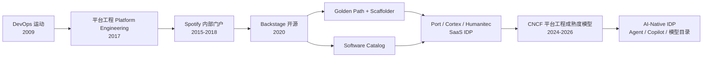
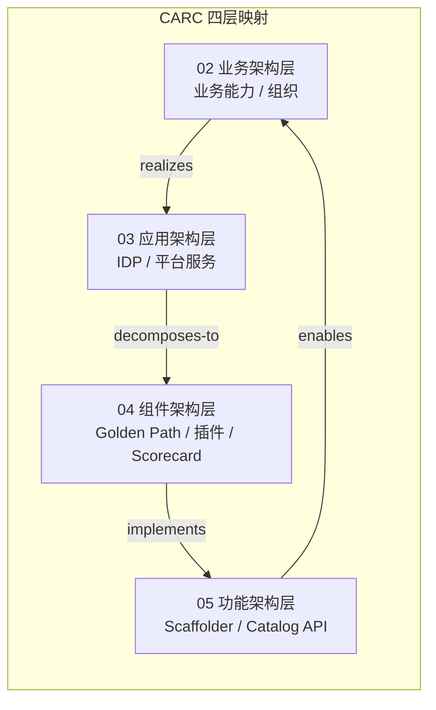

# Backstage / Port / Cortex IDP 复用实践

> **版本**: 2026-07-07
> **定位**: 03 应用架构复用层核心子主题 —— 内部开发者平台（IDP）作为平台工程与架构复用的核心载体
> **对齐标准**: CNCF Platform Engineering Maturity Model, ISO/IEC/IEEE 42010:2022, NASA RRL / RCMM
> **来源 URL**:
>
> - Backstage Documentation: <https://backstage.io/docs>
> - Backstage Plugins: <https://backstage.io/plugins>
> - Port Documentation: <https://docs.getport.io/>
> - Cortex Documentation: <https://docs.cortex.io/>
> - CNCF Platform Engineering Maturity Model: <https://tag-app-delivery.cncf.io/whitepapers/platform-eng-maturity/>
> - NASA RRL: <https://www.nasa.gov/reference/reuse-readiness-levels/>
> **核查日期**: 2026-07-07

---

## 目录

- [Backstage / Port / Cortex IDP 复用实践](#backstage--port--cortex-idp-复用实践)
  - [目录](#目录)
  - [1. 概念定义（CARC 本体）](#1-概念定义carc-本体)
    - [1.1 内部开发者平台（IDP, Internal Developer Platform）](#11-内部开发者平台idp-internal-developer-platform)
    - [1.2 Golden Path（黄金路径）](#12-golden-path黄金路径)
    - [1.3 Software Catalog（软件目录）](#13-software-catalog软件目录)
    - [1.4 Scorecard（评分卡）](#14-scorecard评分卡)
  - [2. 概念谱系与学术来源](#2-概念谱系与学术来源)
  - [3. IDP 市场格局（2026）](#3-idp-市场格局2026)
    - [3.1 核心玩家概览](#31-核心玩家概览)
    - [3.2 选型对比矩阵](#32-选型对比矩阵)
    - [3.3 选型决策建议](#33-选型决策建议)
  - [4. Golden Path 作为复用载体](#4-golden-path-作为复用载体)
    - [4.1 Scaffolder 模板复用](#41-scaffolder-模板复用)
    - [4.2 Golden Path 生命周期](#42-golden-path-生命周期)
  - [5. Software Catalog 作为资产目录](#5-software-catalog-作为资产目录)
  - [6. TechDocs 作为知识复用](#6-techdocs-作为知识复用)
  - [7. 平台工程成熟度](#7-平台工程成熟度)
    - [7.1 CNCF 五维度模型](#71-cncf-五维度模型)
    - [7.2 2026 刷新中的 AI 集成内容](#72-2026-刷新中的-ai-集成内容)
  - [8. 复用度量指标](#8-复用度量指标)
    - [8.1 IDP 原生度量](#81-idp-原生度量)
    - [8.2 与 NASA RRL / RCMM 的映射](#82-与-nasa-rrl--rcmm-的映射)
  - [9. 正向示例](#9-正向示例)
    - [示例 1：Spotify Backstage 支撑千级工程师复用](#示例-1spotify-backstage-支撑千级工程师复用)
    - [示例 2：金融科技公司采用 Port 快速落地 IDP](#示例-2金融科技公司采用-port-快速落地-idp)
  - [10. 反例与失败案例](#10-反例与失败案例)
    - [反例 1：平台团队自研门户脱离开发者需求](#反例-1平台团队自研门户脱离开发者需求)
    - [反例 2：过度强制 Golden Path 抑制创新](#反例-2过度强制-golden-path-抑制创新)
    - [案例：某企业 IDP 数据模型混乱导致目录失效](#案例某企业-idp-数据模型混乱导致目录失效)
  - [11. 多维对比与决策分析](#11-多维对比与决策分析)
    - [11.1 IDP 平台选型矩阵](#111-idp-平台选型矩阵)
    - [11.2 平台能力 × 复用成熟度](#112-平台能力--复用成熟度)
    - [11.3 选型决策分析](#113-选型决策分析)
  - [12. 实施路线图建议](#12-实施路线图建议)
  - [13. 与四层架构的关系](#13-与四层架构的关系)
  - [14. 权威来源](#14-权威来源)

---

## 1. 概念定义（CARC 本体）

### 1.1 内部开发者平台（IDP, Internal Developer Platform）

**定义**：IDP 是由平台工程团队构建的**自服务层**，将基础设施、工具链、最佳实践和治理策略封装为可复用的产品化能力，使应用开发者能够以最小认知负荷获取、组合和交付软件系统。

**属性**：

| 属性 | 说明 |
|------|------|
| **自服务性** | 开发者通过门户或 API 自助获取资源，无需工单 |
| **产品化** | 平台能力以产品形式运营，关注用户体验和反馈 |
| **可复用性** | Golden Path、模板、组件库、策略可在多个团队复用 |
| **治理性** | 通过 Scorecards、策略即代码保证合规 |

**关系**：

- **provides（提供）**：IDP 向应用团队提供计算、存储、网络、安全、可观测性能力。
- **encapsulates（封装）**：IDP 将基础设施复杂度封装为抽象接口。
- **measures（度量）**：IDP 收集复用率、成熟度、DORA 等指标。

**约束**：

1. **以开发者为中心**：平台设计必须基于开发者真实工作流，而非基础设施团队便利。
2. **可选而非强制**：Golden Path 是推荐路径，但必须允许合理偏离。
3. **持续演进**：平台能力必须随技术栈和组织需求迭代。

### 1.2 Golden Path（黄金路径）

**定义**：Golden Path 是将组织内最佳实践编码为**一键生成的项目模板**，覆盖代码骨架、CI/CD、安全扫描、可观测性、文档等全生命周期。

### 1.3 Software Catalog（软件目录）

**定义**：Software Catalog 是组织级软件资产的统一目录，描述系统、服务、API、资源、团队及其关系，是架构复用的**发现层**。

### 1.4 Scorecard（评分卡）

**定义**：Scorecard 是对服务成熟度、合规状态、复用就绪度进行量化评分的机制，常用于驱动架构治理。

---

## 2. 概念谱系与学术来源



**权威条目**：

- [Backstage](https://backstage.io/)
- [CNCF Platform Engineering](https://tag-app-delivery.cncf.io/)
- [Platform Engineering Maturity Model](https://tag-app-delivery.cncf.io/whitepapers/platform-eng-maturity/)

---

## 3. IDP 市场格局（2026）

### 3.1 核心玩家概览

| 平台 | 模式 | 目标规模 | 核心定位 |
|------|------|---------|---------|
| **Backstage** | 开源（Apache 2.0） | 1000+ 工程师 | 可定制开发者门户，生态最丰富 |
| **Port** | SaaS / 私有化 | 200-2000 工程师 | 低代码 IDP，快速上线 |
| **Cortex** | SaaS / 私有化 | 全规模 | Scorecards + 服务成熟度追踪 |

### 3.2 选型对比矩阵

| 维度 | Backstage | Port | Cortex |
|------|-----------|------|--------|
| **成本结构** | 自托管基础设施 + 维护人力 | SaaS 订阅（按开发者计费） | SaaS 订阅 + 专业服务 |
| **上线时间** | 3-6 个月（需团队投入） | 2-4 周（开箱即用） | 4-8 周（侧重成熟度） |
| **定制性** | ★★★★★（代码级定制） | ★★★☆☆（配置 + 低代码） | ★★★☆☆（模板 + API） |
| **插件/集成生态** | 200+ 社区插件 | 100+ 原生集成 | 80+ 集成（聚焦 DevOps 工具链） |
| **Software Catalog** | 核心能力（YAML 定义） | 核心能力（UI + API） | 辅助能力（自动发现为主） |
| **Scaffolder** | 内置（模板引擎） | 内置（工作流编排） | 较弱（依赖外部 CI） |
| **TechDocs** | 内置（MKDocs 集成） | 基础文档支持 | 较弱 |
| **Scorecards** | 需插件（如 Soundcheck） | 内置 | **核心能力** |

### 3.3 选型决策建议

- **选择 Backstage**：组织已有前端/Node.js 团队、需要深度定制、工程师规模大于 500 人、愿意长期投入平台工程人力。
- **选择 Port**：需要快速验证 IDP 价值、工程师规模在 200 到 1000 人之间、偏好 SaaS 免运维模式。
- **选择 Cortex**：已有成熟 CI/CD 但缺乏服务治理、需要强制的成熟度评分和合规追踪能力。

**混合策略**：部分大型组织采用 **Backstage 作为主门户 + Cortex 作为成熟度数据源** 的架构，通过 Backstage 插件集成 Cortex Scorecards，兼顾定制性和治理深度。这种混合架构允许平台团队在保留 Backstage 强大扩展性的同时，复用 Cortex 成熟的评分引擎和合规报告能力。

---

## 4. Golden Path 作为复用载体

### 4.1 Scaffolder 模板复用

Golden Path 是 IDP 的核心复用机制——它将"最佳实践"编码为可一键生成的项目模板。Golden Path 的本质是**将隐性知识显性化、将最佳实践标准化、将标准执行自动化**。

**Backstage Scaffolder 模板结构**：

```yaml
apiVersion: scaffolder.backstage.io/v1beta3
kind: Template
metadata:
  name: microservice-golden-path
  title: "标准微服务 Golden Path"
  description: "包含 CI/CD、可观测性、安全扫描的标准模板"
spec:
  owner: platform-team
  type: service
  parameters:
    - title: 基础配置
      required: [serviceName, language]
      properties:
        serviceName:
          type: string
          description: 服务名称
        language:
          type: string
          enum: [go, rust, python, java]
  steps:
    - id: fetch-base
      name: 获取基础代码骨架
      action: fetch:template
      input:
        url: ./skeleton
        values:
          name: ${{ parameters.serviceName }}
          language: ${{ parameters.language }}
    - id: ci-cd
      name: 生成 CI/CD 流水线
      action: fetch:template
      input:
        url: ./templates/cicd
    - id: register
      name: 注册到 Software Catalog
      action: catalog:register
      input:
        repoContentsUrl: ${{ steps.fetch-base.output.repoContentsUrl }}
```

**复用价值**：

- 新服务创建时间从 2 周缩短至 10 分钟。
- 强制包含安全扫描（SAST/DAST）、可观测性（OpenTelemetry）、文档（TechDocs）。
- 模板版本化管理，升级时批量推送至基于该模板创建的服务。
- 降低认知负荷：开发者无需了解底层基础设施细节，专注于业务逻辑。

### 4.2 Golden Path 生命周期


---

## 5. Software Catalog 作为资产目录

Software Catalog 是组织级软件资产的统一目录，其复用价值体现在跨团队的知识共享和依赖关系透明化：

| 层级 | 实体类型 | 复用场景 |
|------|---------|---------|
| **系统层** | System | 业务域边界定义，复用系统架构认知 |
| **服务层** | Component/Service | API 契约发现、依赖关系可视化 |
| **资源层** | Resource | 数据库、消息队列等基础设施的共享状态 |
| **API 层** | API | OpenAPI 规范集中托管，跨团队契约复用 |
| **用户层** | User/Group | 组织关系映射，所有权自动分配 |

**关键实践**：将 Catalog 中的 API 实体与 NASA RRL（Reuse Readiness Level）评级关联，标记每个 API 的复用成熟度。高 RRL 等级的 API 应在 Catalog 中标注为"推荐复用"，并在开发者门户首页优先展示。

---

## 6. TechDocs 作为知识复用

Backstage 的 TechDocs 将文档与代码仓库绑定，实现"文档即代码"（Docs as Code）：

- **mkdocs.yml** 定义文档结构，与代码同版本管理。
- **文档内嵌组件**自动读取 Software Catalog 元数据（所有者、SLA、依赖）。
- **搜索聚合**跨所有服务文档提供统一检索入口。
- **文档健康度评分**自动检查必填章节（架构概述、API 参考、运行手册、故障排查）的完整性。

**复用度量**：文档健康度 =（必填章节完成数 / 总必填章节数）× 100%。纳入服务成熟度评分。

---

## 7. 平台工程成熟度

### 7.1 CNCF 五维度模型

CNCF Platform Engineering Maturity Model（2026 年刷新中）定义了五个评估维度：

| 维度 | Level 1（临时） | Level 2（可复现） | Level 3（可扩展） | Level 4（优化） |
|------|---------------|-----------------|-----------------|---------------|
| **Investment（投入）** | 自愿贡献 | 专用平台团队 | 平台即产品 | 平台生态共建 |
| **Adoption（采用）** | 口头推广 | 文档化路径 | 强制 Golden Path | 自服务度量驱动 |
| **Interfaces（接口）** | 工单驱动 | 脚本/CLI | 开发者门户（IDP） | API + 生态集成 |
| **Operations（运维）** | 手工运维 | IaC 自动化 | 平台 SRE + 可观测性 | 自愈 + 混沌工程 |
| **Measurement（度量）** | 无度量 | 基础指标 | 平台 ROI + DORA | 预测性分析 |

### 7.2 2026 刷新中的 AI 集成内容

2026 年 CNCF 刷新版本新增了 **AI-Native Platform** 维度，核心关注点包括：

- **Agent 托管**：IDP 是否提供 Agent 注册、发现、治理能力。
- **AI 辅助开发**：Copilot 集成、代码生成模板、智能文档补全。
- **模型服务目录**：将 ML 模型纳入 Software Catalog 统一管理。
- **AI 成本可见性**：GPU/Token 消耗在开发者门户中的实时展示。

**建议**：组织在评估当前成熟度时，应将 AI 维度作为**增量评估项**，而非独立维度，避免与现有五维体系割裂。建议从 Level 2 可复现阶段开始同步建设 AI 能力，避免平台工程与 AI 工程形成组织孤岛。

---

## 8. 复用度量指标

### 8.1 IDP 原生度量

| 指标 | 定义 | 目标值 | 采集方式 |
|------|------|--------|---------|
| **模板使用率** | 新服务通过 Golden Path 创建的比例 | 大于 80% | Scaffolder 日志统计 |
| **目录覆盖率** | 生产服务在 Software Catalog 中的注册率 | 100% | Catalog API 定期扫描 |
| **文档健康度** | 服务文档必填章节完成率 | 大于 90% | TechDocs 构建结果分析 |
| **自助服务率** | 开发者无需平台团队介入完成的操作比例 | 大于 70% | IDP 审计日志分析 |
| **路径偏离率** | 服务偏离 Golden Path 的告警比例 | 小于 10% | Scorecard 规则引擎 |
| **复用请求数** | 月度通过 Catalog 发现并复用的 API/组件数 | 逐月增长 | API 网关调用链分析 |

### 8.2 与 NASA RRL / RCMM 的映射

NASA 的复用成熟度模型可与 IDP 度量体系建立对照：

| NASA RRL 等级 | RCMM 阶段 | IDP 映射 | 判定标准 |
|--------------|----------|---------|---------|
| RRL 1-2（概念/开发中） | 初始 | Catalog 中标记为 experimental | 无 Golden Path，仅原型 |
| RRL 3-4（验证/集成中） | 可重复 | Catalog 中标记为 beta | 有对应 Golden Path 模板 |
| RRL 5-6（已验证/已发布） | 已定义 | Catalog 中标记为 production | 模板使用率大于 50%，文档健康度大于 80% |
| RRL 7-8（已采用/已维护） | 已管理 | Scorecard 评分大于 80 | 自助服务率大于 70%，路径偏离率小于 10% |
| RRL 9（已优化） | 优化 | 跨组织外部共享 | 组件被外部团队或开源社区复用 |

**自动化映射**：在 Backstage 中通过自定义 Processor 自动将 Catalog 实体的元数据（生命周期、Scorecard 评分、使用统计）映射为 RRL 等级，展示在实体卡片中。这消除了人工评估的主观性，使复用成熟度成为客观可度量的指标。


## 9. 正向示例

### 示例 1：Spotify Backstage 支撑千级工程师复用

**场景**：Spotify 拥有数千名工程师和数百个服务，需要统一服务发现、文档、模板和所有权。

**复用方式**：

- 开源 Backstage，将 Software Catalog 作为唯一事实来源。
- 每个服务必须注册到 Catalog，包含 owner、docs、API、依赖。
- 通过 Scaffolder 提供标准服务模板，覆盖 CI/CD、监控、安全扫描。

**关键成功因素**：

1. Catalog 与代码仓库绑定，确保信息实时同步。
2. 模板由平台团队与领域专家共同维护，保证最佳实践持续更新。
3. 插件生态允许各团队按需求扩展，避免平台过度集中。

**复用收益**：

- 服务发现时间从数小时缩短至分钟级。
- 新服务上线标准流程化，安全与可观测性不再依赖个人经验。
- 跨团队复用 API 和组件的可见性显著提升。

### 示例 2：金融科技公司采用 Port 快速落地 IDP

**场景**：一家拥有 400 名工程师的金融科技公司需要在 1 个月内验证 IDP 价值，但缺少专职平台前端团队。

**复用方式**：

- 选择 Port SaaS IDP，快速导入 GitHub、Kubernetes、Jenkins 等数据源。
- 定义 Scorecards 强制要求生产服务必须具备 SLO、文档、安全扫描。
- 通过低代码界面构建开发者自助工作流（申请数据库、创建服务、开通权限）。

**关键成功因素**：

1. 从最小可行场景切入（服务目录 + 创建服务），避免一次性堆砌功能。
2. 平台团队与开发者共同定义 Scorecards 规则，确保规则可执行。
3. 将 IDP 集成到现有 Slack/Opsgenie 工作流，降低切换成本。

**复用收益**：

- 服务创建自助率达到 85%，平台团队工单减少 60%。
- 生产服务合规率从 45% 提升至 92%。
- 新工程师 onboarding 时间从 2 周缩短至 3 天。

---

## 10. 反例与失败案例

### 反例 1：平台团队自研门户脱离开发者需求

**场景**：某大型银行投入 2 年自研开发者门户，集成大量内部工具，但开发者使用率不足 20%。

**后果**：

- 门户界面以基础设施视角组织，开发者难以找到常用功能。
- 创建服务仍需线下审批，自助流程名存实亡。
- 平台团队以"上线功能数"考核，忽视开发者满意度。

**判定**：IDP 是**面向开发者的产品**，必须以用户研究、反馈闭环和产品运营为核心；否则将沦为**shelveshelfware（搁置软件）**。

### 反例 2：过度强制 Golden Path 抑制创新

**场景**：某互联网公司要求所有新服务必须使用唯一 Golden Path，禁止任何偏离。

**后果**：

- 实验性项目被迫使用重型模板，启动成本过高。
- 技术栈无法随业务需求演进，部分服务为规避限制而绕过 IDP。
- 平台团队成为瓶颈，开发者满意度下降。

**判定**：Golden Path 是**推荐路径而非强制路径**。应允许合理偏离，并通过 Scorecards 识别和治理高风险偏离。

### 案例：某企业 IDP 数据模型混乱导致目录失效

**背景**：一家制造企业快速导入数千个仓库到 Software Catalog，但未统一实体模型和所有权规则。

**失败原因**：

- 同一服务在 Catalog 中出现多个重复条目，依赖关系混乱。
- 所有权字段随意填写，无法找到实际负责人。
- 缺乏自动化校验，Catalog 数据迅速过时。

**教训**：Software Catalog 的价值取决于**数据质量**。必须建立所有权规范、自动化导入校验和定期治理机制。

---

## 11. 多维对比与决策分析

### 11.1 IDP 平台选型矩阵

| 维度 | Backstage | Port | Cortex | 混合方案 |
|------|-----------|------|--------|---------|
| **上线速度** | 慢 | 快 | 中 | 中 |
| **定制深度** | 极高 | 中 | 中 | 高 |
| **治理强度** | 中（需插件） | 中 | 高 | 高 |
| **运维成本** | 高 | 低 | 低 | 中 |
| **适用规模** | > 500 人 | 200-2000 人 | 全规模 | > 1000 人 |
| **最佳组合** | Catalog + Scaffolder | 快速门户 | Scorecards | Backstage + Cortex |

### 11.2 平台能力 × 复用成熟度

| 平台能力 | Level 1 | Level 2 | Level 3 | Level 4 |
|---------|---------|---------|---------|---------|
| **Golden Path** | 无 | 少量脚本模板 | 多语言模板库 | 模板推荐 + 自动升级 |
| **Software Catalog** | 手工表格 | 自动导入 | 与 CI/CD 联动 | 驱动架构治理 |
| **Scorecards** | 无 | 手动评分 | 自动规则评分 | 预测性治理建议 |
| **TechDocs** | 无文档 | 分散文档 | 统一搜索 | AI 辅助补全 |
| **自助服务** | 工单 | CLI/脚本 | 门户工作流 | 智能 Agent |

### 11.3 选型决策分析

- **如果组织需要快速验证且人力有限**：选择 Port 或 Cortex SaaS，3-4 周内上线首批 Scorecards 或服务目录。
- **如果组织有大型工程团队和定制需求**：选择 Backstage，配合专职平台产品团队和前端工程师。
- **如果治理合规是首要目标**：选择 Cortex 作为评分引擎，必要时通过 Backstage 插件展示 Scorecards。
- **如果追求长期生态**：以 Backstage 为主门户，Port/Cortex 作为数据源或补充能力，形成**可扩展的 IDP 生态**。

---

## 12. 实施路线图建议

| 阶段 | 时间 | 目标 | 关键动作 |
|------|------|------|---------|
| **奠基期** | 0-2 月 | 搭建 Catalog，导入现有服务 | 批量导入 YAML、定义所有权模型、建立实体关系 |
| **模板期** | 2-4 月 | 上线 3-5 条 Golden Path | 覆盖主流服务类型（API、前端、Job、ML 推理） |
| **治理期** | 4-6 月 | 引入 Scorecards，建立度量 | 定义成熟度规则、集成 CI/CD 数据源、设置告警 |
| **扩展期** | 6-12 月 | 生态集成、AI 能力接入 | 插件开发、Copilot 集成、模型目录、Agent 注册 |

---

## 13. 与四层架构的关系



- **业务架构层**：业务能力和组织结构决定平台需要支撑的开发者角色和交付路径。
- **应用架构层**：IDP 作为应用系统（平台），承载自服务、目录、治理等应用服务。
- **组件架构层**：Golden Path 模板、Software Catalog 插件、Scorecard 引擎是可复用组件。
- **功能架构层**：Scaffolder 工作流、Catalog API、TechDocs 构建是具体功能接口。

---

## 14. 权威来源

- Backstage Documentation: <https://backstage.io/docs>
- Backstage Plugins Marketplace: <https://backstage.io/plugins>
- Backstage GitHub Repository: <https://github.com/backstage/backstage>
- Port Documentation: <https://docs.getport.io/>
- Cortex Documentation: <https://docs.cortex.io/>
- CNCF — Cloud Native Computing Foundation: <https://www.cncf.io/>
- CNCF Platform Engineering Maturity Model: <https://tag-app-delivery.cncf.io/whitepapers/platform-eng-maturity/>
- CNCF Platform Engineering White Paper: <https://tag-app-delivery.cncf.io/whitepapers/platform-engineering/>
- NASA Reuse Readiness Levels (RRL): <https://www.nasa.gov/reference/reuse-readiness-levels/>
- NASA Reuse Capability Maturity Model (RCMM): <https://www.nasa.gov/reference/reuse-capability-maturity-model/>
- DORA — DevOps Research and Assessment: <https://dora.dev/>

**核查日期**: 2026-07-07
