# 03 应用架构复用

## 定位

系统级复用层次。覆盖从单体到 Serverless 的完整云原生架构模式，以及数据架构复用。

## 核心内容

- **Level 1**: 应用系统复用（COTS/GOTS/SaaS/多租户）
- **Level 2**: 应用组件复用（内部开源、组件库、共享服务）
- **Level 3**: 应用服务复用（API 网关、服务网格、事件总线）
- **Level 4**: 数据架构复用（MDM、数据网格、数据产品）
- **四层架构概念本体（CARC）**: [`01-meta-model-standards/06-formal-axioms/four-layer-ontology.md`](../01-meta-model-standards/06-formal-axioms/four-layer-ontology.md)
- 云原生架构模式复用性矩阵（2026 版）
  - 单体 / 模块化单体 / SOA / 微服务 / 微前端 / Serverless / 服务网格 / EDA / 模块化宏服务
- 服务网格 (Istio/Envoy/Cilium) 的通信模式复用
- 事件驱动架构 (EDA) 的四种复用模式
- 数据网格 (Data Mesh) 的域导向复用

## 主题图谱

## 权威对齐

| 标准/框架 | 作用 | 权威 URL | 核查日期 |
|-----------|------|----------|----------|
| ISO/IEC 25010:2023 | 软件产品质量模型（含可维护性、可复用性子特征） | <https://www.iso.org/standard/78176.html> | 2026-07-09 |
| NIST SP 800-204 系列 | 微服务安全策略、服务网格与 DevSecOps 指引 | <https://csrc.nist.gov/publications/detail/sp/800-204/final> | 2026-07-09 |
| NIST SP 800-204A | 基于服务网格架构构建安全微服务应用 | <https://csrc.nist.gov/pubs/sp/800/204/a/final> | 2026-07-09 |
| CNCF Cloud Native Landscape | 云原生项目成熟度与毕业状态 | <https://landscape.cncf.io/> 与 <https://www.cncf.io/projects/> | 2026-07-09 |
| CNCF Serverless Whitepaper v2 | Serverless/FaaS 架构参考 | <https://github.com/cncf/wg-serverless/tree/main/whitepapers/serverless-overview> | 2026-07-09 |
| CloudEvents 1.0.2 | CNCF 跨平台事件数据格式标准 | <https://github.com/cloudevents/spec/blob/v1.0.2/cloudevents/spec.md> | 2026-07-09 |
| Spring Modulith | 模块化单体参考实现 | <https://spring.io/projects/spring-modulith> | 2026-07-09 |
| Istio Architecture | 服务网格通信与流量管理 | <https://istio.io/latest/docs/ops/deployment/architecture/> | 2026-07-09 |
| Kubernetes Gateway API v1.5 | Kubernetes 统一路由标准（ListenerSet / TLSRoute 进入 Standard 通道） | <https://kubernetes.io/blog/2026/04/21/gateway-api-v1-5/> | 2026-07-09 |
| Gateway API 官方文档 | ListenerSet、TLSRoute、GAMMA 规范 | <https://gateway-api.sigs.k8s.io> | 2026-07-09 |
| OWASP API Security Top 10 2023 | API 安全威胁清单 | <https://owasp.org/www-project-api-security/> | 2026-07-09 |
| 12-Factor App | 云原生应用方法论 | <https://12factor.net/> | 2026-07-09 |
| Backstage (CNCF Incubating) | 内部开发者门户框架 | <https://www.cncf.io/projects/backstage/> | 2026-07-09 |
| Data Mesh by Zhamak Dehghani | 数据架构复用思想 | <https://martinfowler.com/articles/data-mesh-intro.html> | 2026-07-09 |

## 标准/框架映射

| 复用场景 | 适用标准/框架 | 关键映射点 |
|---------|--------------|-----------|
| 微服务安全复用 | NIST SP 800-204/204A/204B | 认证(MS-SS-1)、安全通信(MS-SS-4)、ABAC 授权(MS-SS-2) |
| API 网关与路由复用 | Kubernetes Gateway API v1.5 | ListenerSet 多租户边界、TLSRoute SNI 路由、ReferenceGrant 跨命名空间授权 |
| 事件驱动复用 | CNCF CloudEvents 1.0.2 | 事件元数据标准化、跨传输层可移植 |
| Serverless/FaaS 复用 | CNCF Serverless Whitepaper v2 + 12-Factor App | 无状态进程、配置外置、按使用付费 |
| API 安全治理 | OWASP API Security Top 10 2023 | BOLA/API1、BFLA/API5、不安全 API 消费/API10 |
| 内部平台工程 | Backstage + CNCF Platform Engineering Maturity Model | Software Catalog、Golden Path、Scorecards |

## 关键定理
>
> **定理 3.2** (Data-Application Coupling): 数据架构与应用架构的复用独立当且仅当数据访问通过**抽象数据服务**而非**直接存储耦合**实现。

## 当前状态

- [x] 架构模式对比矩阵
- [x] 场景应用树
- [x] 2026 云原生架构模式复用性矩阵 (`07-cloud-native-patterns/reusability-matrix-2026.md`)
- [x] 服务网格通信模式复用 (`08-service-mesh/service-mesh-communication-patterns.md`)
- [x] Data Mesh 域导向复用深化 (`05-data-architecture/data-mesh-data-product-reuse.md`)
- [x] 分层架构复用框架 (`01-layered-architecture/`)
- [x] 微服务架构复用框架 (`02-microservices/`)
- [x] 应用服务复用框架 (`03-app-service/`)
- [x] Serverless 架构复用框架 (`04-serverless/`)
- [x] 事件驱动架构复用框架 (`06-event-driven/`)
- [x] 具体平台（Backstage、Port、Cortex）的 IDP 复用实践 (`11-idp-practices/backstage-port-cortex.md`)

## 子目录导航

| 子目录 | 主题 | 核心文档 | 状态 |
|:---|:---|:---|:---:|
| `01-layered-architecture/` | 分层架构复用模式 | [`reuse-patterns.md`](01-layered-architecture/reuse-patterns.md) | ✅ 已填充 |
| `02-microservices/` | 微服务架构复用模式 | [`reuse-patterns.md`](02-microservices/reuse-patterns.md) | ✅ 已填充 |
| `03-app-service/` | 应用服务复用 | — | ✅ 核心文档 |
| `04-serverless/` | Serverless/FaaS 复用模式 | [`reuse-patterns.md`](04-serverless/reuse-patterns.md) | ✅ 已填充 |
| `05-data-architecture/` | 数据架构复用（Data Mesh） | — | ✅ 核心文档 |
| `06-event-driven/` | 事件驱动架构复用模式 | [`reuse-patterns.md`](06-event-driven/reuse-patterns.md) | ✅ 已填充 |
| `07-cloud-native-patterns/` | 云原生架构模式复用性矩阵 | [`reusability-matrix-2026.md`](07-cloud-native-patterns/reusability-matrix-2026.md) | ✅ |
| `08-service-mesh/` | 服务网格通信复用 | — | ✅ |
| `09-eda-cqrs/` | EDA/CQRS 深度内容 | — | ✅ |
| `10-tosca-dmn-platform/` | TOSCA v2.0 / DMN 1.6 平台对齐 | — | ✅ |
| `11-idp-practices/` | IDP（Backstage/Port/Cortex）复用实践 | [`backstage-port-cortex.md`](11-idp-practices/backstage-port-cortex.md) | ✅ 已填充 |

## 关联主题

- `01-meta-model-standards/06-formal-axioms/four-layer-ontology.md`（四层架构概念本体）
- `04-component-architecture-reuse`（应用组件降维到组件层）
- `05-functional-architecture-reuse`（Serverless/FaaS 功能级复用）

---

## 概念定义

**定义**：应用架构复用是在系统层面复用应用、服务、模式与基础设施配置，包括分层架构、微服务、Serverless、事件驱动、服务网格等形态。

## 示例

**示例**：应用架构复用的正向实践。

**示例 1：Spotify 的模块化单体与分层复用**

Spotify 早期将 Java 单体拆分为约 100 个内部模块，每个模块保持 API / Service / Domain / Persistence 的清晰分层，并提取 `spotify-common` 共享内核与 Protocol Buffer 契约。该实践使 100+ 模块复用同一领域语义类型，服务端与多客户端（iOS、Android、桌面、Web）通过同一契约保持类型安全；当部分模块需要独立演进时，可沿既有分层边界低摩擦地拆分为微服务。

**示例 2：某 SaaS 企业的内部平台团队**

某 SaaS 企业建立内部平台团队，提供可复用的 CI/CD 流水线、可观测性套件与多租户数据隔离模板，新产品团队可在数天内搭建生产级服务。

## 反例

**反例**：应用架构复用的典型失败模式。

**反例 1：过度拆分导致的微服务复用成本高于收益**

某 15 人初创公司在产品未验证前将系统拆分为 12 个微服务，完成一次用户注册需调用 5 个服务，本地开发需启动 8 个进程，且服务间共享数据库、schema 变更需同步修改多个服务。结果团队承担了微服务的运维复杂度，却未获得独立部署与自治收益，形成典型的**分布式单体**。

**反例 2：各产品团队独立选型技术栈**

各产品团队独立选型技术栈与部署模式，导致安全补丁、监控与容量管理无法统一治理，重复建设同类中间件，跨团队复用无从谈起。
