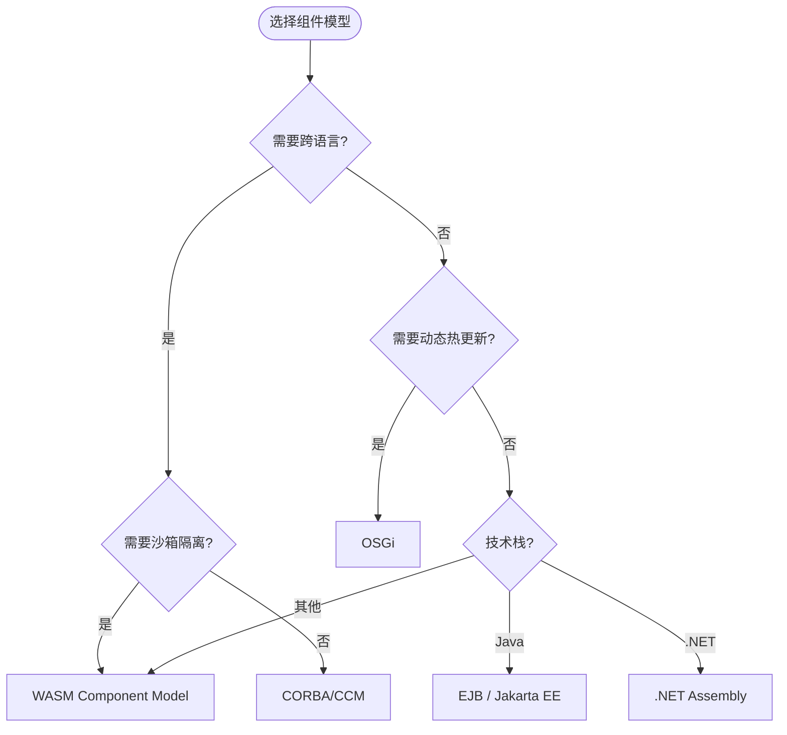
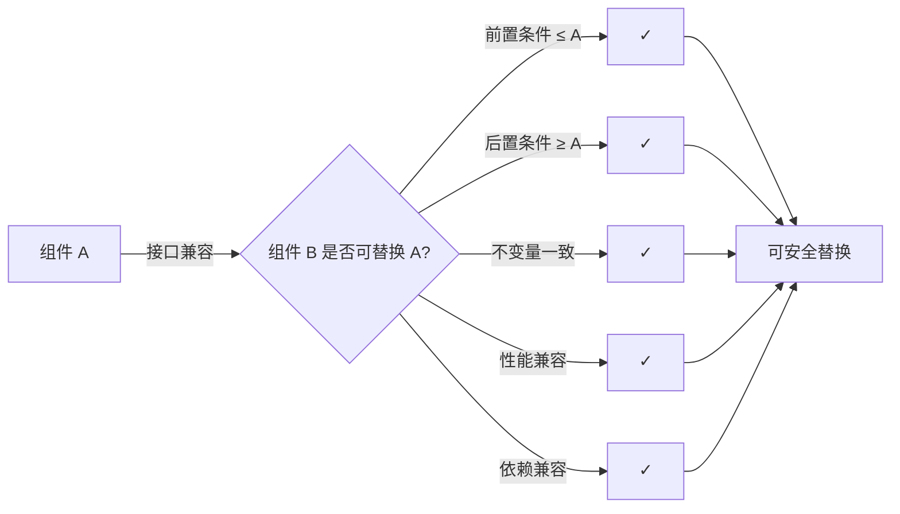

# 组件模型与架构复用

> **版本**: 2026-07-08
> **定位**: 组件架构层 —— 组件模型的演进与跨语言组件复用的现代实践
> **对齐标准**: UML 2.5.1 Components, WASM Component Model, OSGi, JPMS, .NET Assembly, OMG CORBA/CCM
> **状态**: ✅ 已完成

---

## 目录

- [组件模型与架构复用](#组件模型与架构复用)
  - [目录](#目录)
  - [1. 组件模型演进](#1-组件模型演进)
    - [1.1 历史脉络](#11-历史脉络)
    - [1.2 组件模型的核心概念](#12-组件模型的核心概念)
  - [2. 现代组件模型对比](#2-现代组件模型对比)
    - [2.1 语言级组件模型](#21-语言级组件模型)
    - [2.2 跨语言组件模型：WASM Component Model](#22-跨语言组件模型wasm-component-model)
    - [2.3 企业级组件模型对比：CORBA / EJB / OSGi / WASM Component Model](#23-企业级组件模型对比corba--ejb--osgi--wasm-component-model)
      - [选型决策矩阵](#选型决策矩阵)
  - [3. 组件模型的复用语义](#3-组件模型的复用语义)
    - [3.1 兼容性判定](#31-兼容性判定)
    - [3.2 组件组合与替换条件](#32-组件组合与替换条件)
  - [4. WASM Component Model：跨语言复用的未来](#4-wasm-component-model跨语言复用的未来)
    - [4.1 当前状态（2026-06）](#41-当前状态2026-06)
    - [4.2 复用场景](#42-复用场景)
  - [5. 权威来源](#5-权威来源)
  - [6. 组件模型复用：深层分析与选型权衡](#6-组件模型复用深层分析与选型权衡)
    - [概念定义](#概念定义)
    - [核心属性](#核心属性)
    - [与其他概念的关系](#与其他概念的关系)
    - [解释：为什么组件模型决定复用边界](#解释为什么组件模型决定复用边界)
    - [组件模型选型权衡矩阵](#组件模型选型权衡矩阵)
    - [正例：跨框架 UI 组件库](#正例跨框架-ui-组件库)
    - [反例：框架特性硬编码的“伪组件”](#反例框架特性硬编码的伪组件)
    - [反例 2：忽视组件生命周期管理](#反例-2忽视组件生命周期管理)
    - [正例 2：OSGi 动态插件系统](#正例-2osgi-动态插件系统)
    - [形式化分析：组件替换条件](#形式化分析组件替换条件)
  - [7. 标准条款映射](#7-标准条款映射)
  - [8. 权威来源与交叉引用](#8-权威来源与交叉引用)

---

## 1. 组件模型演进

### 1.1 历史脉络

| 时代 | 技术 | 复用粒度 | 关键特征 |
|:---|:---|:---|:---|
| 1960s | 子程序/函数库 | 代码片段 | 静态链接 |
| 1980s | 对象/类库 | 对象 | 继承、多态 |
| 1990s | COM/DCOM, EJB, CORBA | 二进制组件 | 接口契约、远程调用 |
| 2000s | OSGi, .NET Assembly, SOA | 模块化组件 | 动态加载、服务发现 |
| 2010s | npm, Maven, Docker Image | 包/容器 | 依赖管理、版本控制 |
| **2020s** | **WASM Component Model** | **跨语言纳米服务** | **WIT 接口、沙箱安全** |

### 1.2 组件模型的核心概念

```text
组件模型核心要素
├── 接口（Interface）
│   ├── 操作签名（函数名、参数、返回值）
│   ├── 前置/后置条件
│   └── 不变量
├── 实现（Implementation）
│   ├── 隐藏内部状态
│   └── 实现接口承诺的行为
├── 部署单元（Deployment Unit）
│   ├── 独立分发和安装
│   └── 版本标识
├── 生命周期（Lifecycle）
│   ├── 安装、启动、停止、卸载
│   └── 依赖解析和激活
└── 元数据（Metadata）
    ├── 依赖声明
    ├── 配置参数
    └── 能力声明
```

---

## 2. 现代组件模型对比

### 2.1 语言级组件模型

| 语言/平台 | 组件单元 | 接口定义 | 依赖管理 | 运行时特性 |
|:---|:---|:---|:---|:---|
| **Java** | JPMS Module / OSGi Bundle | `module-info.java` / OSGi manifest | Maven/Gradle | 动态加载、服务注册 |
| **.NET** | Assembly | `public` 接口 + XML 文档 | NuGet | 强命名、版本策略 |
| **Rust** | Crate | `pub` 接口 + Trait | Cargo | 零成本抽象、编译时检查 |
| **Python** | Package / Namespace Package | `__init__.py` + 类型注解 | pip/uv/poetry | 动态导入、猴子补丁 |
| **JavaScript** | ES Module / npm Package | `export` + JSDoc/TypeScript | npm/pnpm | 动态加载、Tree Shaking |
| **Go** | Package / Module | `interface` + `go doc` | Go Modules | 静态链接、编译速度 |

### 2.2 跨语言组件模型：WASM Component Model

**核心创新**: 允许用不同语言编写的组件通过标准化的 WIT（WASM Interface Types）接口互操作。

```text
WASM Component Model 架构
├── WIT（WASM Interface Types）
│   ├── 语言无关的接口定义语言
│   ├── 支持 records、variants、resources、futures、streams
│   └── 编译为目标语言的绑定（Rust、Python、JavaScript 等）
├── Component
│   ├── 封装一个或多个 WASM Core Modules
│   ├── 通过 WIT 接口暴露功能
│   └── 可组合（Composition）形成更大组件
└── Runtime
    ├── Wasmtime（Bytecode Alliance）
    ├── WasmEdge
    └── 浏览器 WASM 引擎
```

**复用优势**:

- 语言无关：Rust 实现、Python 消费，无需 FFI
- 沙箱安全：WASM 的沙箱隔离比传统进程更安全
- 可组合性：组件可像乐高积木一样组合
- 可移植性：一次编译，到处运行（服务器、边缘、浏览器）

### 2.3 企业级组件模型对比：CORBA / EJB / OSGi / WASM Component Model

| 模型 | 代表技术 | 接口定义 | 运行时 | 生命周期 | 动态性 | 主要适用场景 |
|---|---|---|---|---|---|---|
| **CORBA/CCM** | OMG CORBA, IDL | OMG IDL | ORB（对象请求代理） | 安装→注册→激活→销毁 | 弱 | 1990s 企业分布式对象 |
| **EJB** | Java EE / Jakarta EE | Java 接口/注解 | EJB 容器 | 容器管理生命周期 | 中等 | 2000s 大型企业 Java 应用 |
| **OSGi** | Eclipse Equinox, Apache Felix | Java 接口 + Bundle Manifest | OSGi Framework | 安装→解析→启动→停止→更新→卸载 | **强** | 动态模块化系统、IDE 插件 |
| **.NET Assembly** | .NET Framework / Core | `public` 接口 + 元数据 | CLR / CoreCLR | 加载→执行→卸载（AssemblyLoadContext） | 中等 | 企业 .NET 应用、插件系统 |
| **WASM Component Model** | WIT + Component | `.wit` | Wasmtime / WasmEdge / 浏览器 | 实例化→链接→调用→释放 | 中等 | 跨语言纳米服务、边缘、插件 |

#### 选型决策矩阵

| 选型维度 | CORBA | EJB | OSGi | .NET Assembly | WASM Component Model |
|---|---|---|---|---|---|
| 跨语言互操作 | 强（多语言 IDL） | 弱（仅 Java） | 弱（仅 JVM） | 中等（多语言 .NET） | **强** |
| 运行时隔离 | 进程级 | 容器级 | 模块级 | AppDomain/进程级 | **沙箱级** |
| 动态加载/热更新 | 弱 | 中等 | **强** | 中等 | 中等 |
| 企业治理与监控 | 成熟 | **强** | 中等 | **强** | 发展中 |
| 云原生/轻量部署 | 弱 | 弱 | 中等 | 中等 | **强** |
| 现代工具链活跃度 | 低 | 中 | 中 | 高 | **高** |

> **选型建议**：遗留企业集成可选 CORBA/EJB；需要动态模块更新选 OSGi；.NET 企业生态选 Assembly；追求跨语言、沙箱安全与云原生部署选 WASM Component Model。



---

## 3. 组件模型的复用语义

### 3.1 兼容性判定

| 兼容类型 | 定义 | 判定方法 |
|:---|:---|:---|
| **二进制兼容** | 新组件可替换旧组件而无需重新编译消费者 | 检查 ABI 稳定性 |
| **源码兼容** | 消费者源码无需修改即可编译 | 检查 API 签名变化 |
| **语义兼容** | 新组件行为与旧组件一致 | 回归测试 + 形式化验证 |

### 3.2 组件组合与替换条件

```text
组件 A 可被组件 B 替换的条件
├── 接口兼容
│   ├── B 实现 A 的所有接口（或超集）
│   └── B 的前置条件不比 A 更严格
├── 行为兼容
│   ├── B 的后置条件不比 A 更弱
│   └── B 的不变量与 A 一致
├── 性能兼容
│   └── B 的性能特征在可接受范围内
└── 依赖兼容
    └── B 的依赖树与目标环境兼容
```

---

## 4. WASM Component Model：跨语言复用的未来

### 4.1 当前状态（2026-06）

| 项目 | 状态 | 说明 |
|:---|:---|:---|
| **WASI 0.3** | 2026-06-11 正式发布（Wasmtime 43+ / jco 支持） | 原生异步 I/O（futures/streams） |
| **WASI 1.0** | 预期 2026 末-2027 初 | 企业级稳定性保证 |
| **wasm-pkg-tools** | 活跃开发 | OCI 兼容的 WASM 包管理 |
| **Component Model** | Phase 2+ | 可组合性提升 |
| **Wasmtime LTS** | 2026 启动 | 2 年安全支持 |

### 4.2 复用场景

```text
场景 1: 跨语言算法库复用
├── Rust 实现高性能图像处理算法
├── 编译为 WASM Component
├── Python 数据科学团队复用（无需重写）
└── JavaScript 前端团队复用（在浏览器中运行）

场景 2: 插件架构
├── 核心系统用 Go 编写
├── 插件接口用 WIT 定义
├── 第三方开发者可用任何支持语言编写插件
└── 插件在 WASM 沙箱中运行，保证系统安全

场景 3: 边缘计算
├── 一次编写业务逻辑组件
├── 部署到云服务器（Wasmtime）
├── 部署到边缘设备（WasmEdge）
└── 部署到浏览器（原生 WASM）
```

---

## 5. 权威来源

| 来源 | URL | 核查日期 |
|:---|:---|:---|
| OMG UML 2.5.1 Components | <https://www.omg.org/spec/UML/2.5.1/> | 2026-07-08 |
| WASM Component Model | <https://component-model.bytecodealliance.org/> | 2026-07-08 |
| WIT 规范 | <https://github.com/WebAssembly/component-model/blob/main/design/mvp/WIT.md> | 2026-07-08 |
| Wasmtime | <https://wasmtime.dev/> | 2026-07-08 |
| wasm-pkg-tools | <https://github.com/bytecodealliance/wasm-pkg-tools> | 2026-07-08 |
| OSGi Alliance | <https://www.osgi.org/> | 2026-07-08 |
| JPMS (Java 9+) | <https://openjdk.org/projects/jigsaw/> | 2026-07-08 |
| ISO/IEC/IEEE 42010:2022 | <https://www.iso.org/standard/74296.html> | 2026-07-08 |


---

## 6. 组件模型复用：深层分析与选型权衡

### 概念定义

**定义**：组件模型（Component Model）是定义软件组件的接口规范、封装边界、生命周期、组合规则与交互语义的抽象框架。它使组件能够作为独立部署单元被开发、分发、组合和替换，是 [Component-based software engineering](https://en.wikipedia.org/wiki/Component-based_software_engineering) 的核心支撑机制。

形式化上，一个组件模型可表示为五元组：

$$M = (I,\ Impl,\ D,\ L,\ Meta)$$

其中：

- $I$：接口集合，包含操作签名与契约；
- $Impl$：实现集合，对外部隐藏；
- $D$：部署单元（如 JAR、Assembly、WASM Component）；
- $L$：生命周期状态机（安装→启动→停止→卸载）；
- $Meta$：元数据（依赖、能力、配置）。

### 核心属性

| 属性 | 说明 | 重要性 |
|---|---|---|
| **封装性** | 内部实现对使用者不可见，仅通过显式接口交互 | 高 |
| **可替换性** | 满足接口与行为兼容的组件可互相替换 | 高 |
| **可组合性** | 小组件可通过组合形成更大组件或系统 | 高 |
| **部署独立性** | 组件可作为独立单元分发、版本化、安装 | 高 |
| **契约显式性** | 接口契约明确前置/后置条件与不变量 | 中 |

### 与其他概念的关系

- **上位概念**：[Component-based software engineering](https://en.wikipedia.org/wiki/Component-based_software_engineering)（基于组件的软件工程）；
- **下位概念**：具体技术模型，如 CORBA CCM、EJB、OSGi、.NET Assembly、WASM Component Model；
- **依赖概念**：[接口契约](../02-interface-contracts/interface-contracts-reuse.md) 定义组件间交互规则；[设计模式](../04-design-patterns/pattern-selection-guide.md) 解决组件内部结构问题；
- **映射概念**：组件模型与 [6大语言生态组件复用成熟度深度对比 2026](../07-language-ecosystems/comparison-matrix-2026.md) 中的语言级模块系统存在实现映射。

### 解释：为什么组件模型决定复用边界

组件模型的选择直接决定复用的**范围、成本与演进灵活性**。强组件模型（如 OSGi、WASM Component Model）通过显式接口与生命周期管理，使组件可在运行时替换；弱组件模型（如传统 JavaScript 文件）虽然分发灵活，但缺乏编译期边界保障，容易出现隐式依赖与破坏性变更。

核心矛盾在于：**封装越强，复用越安全，但引入的运行时与治理成本也越高**。因此选型需在动态性、安全性、工具链成熟度与团队能力之间权衡。

### 组件模型选型权衡矩阵

| 关注点 | 强组件模型（OSGi/WASM） | 弱组件模型（脚本/简单包） | 权衡建议 |
|---|---|---|---|
| **运行时动态性** | 支持热更新、服务注册与发现 | 通常需重启进程 | 需要 7×24 在线更新的系统选强模型 |
| **编译期安全性** | 接口与依赖在编译/链接期可验证 | 依赖运行时解析，错误延迟暴露 | 大型团队协作优先强模型 |
| **部署粒度** | 组件独立部署，版本隔离 | 包级或应用级部署 | 微服务/插件架构优先组件级 |
| **治理成本** | 需要元数据、生命周期管理、兼容性审查 | 治理简单，版本控制即可 | 团队成熟度低时避免引入过重模型 |
| **跨语言支持** | WASM Component Model 提供原生跨语言 | 通常需 HTTP/gRPC/FFI 桥接 | 多语言混合系统优先 WASM |

> **选型原则**：在满足当前复用场景的前提下，选择团队能够持续维护的最小强度组件模型；避免为“未来可能的需求”提前引入 OSGi 或 WASM 的完整复杂度。

### 正例：跨框架 UI 组件库

**示例**：

**背景**：企业级中后台系统同时存在 React、Vue 与 Angular 应用，需要统一的设计组件库。

**做法**：采用 Web Components 标准（Custom Elements + Shadow DOM）构建基础组件，各前端框架通过包装器复用。

**效果**：

- 同一按钮/表单组件被三套技术栈复用，视觉与交互一致；
- 组件内部状态封装在 Shadow DOM 中，避免框架 CSS 污染；
- 新增框架时只需编写薄适配层，核心组件无需重写。

### 反例：框架特性硬编码的“伪组件”

**场景**：某团队将 React Hooks 与 Redux 状态管理直接写入“可复用组件”内部，组件 props 深层依赖 Redux Store 结构。

**后果**：

- 组件无法在 Vue/Angular 项目中复用；
- 每次 Redux Store 结构调整都导致组件修改；
- 单元测试需要挂载完整 Store，测试成本高昂。

**避免方法**：

- 组件只依赖 props/events 接口，不依赖框架状态管理；
- 将框架特定逻辑抽到适配层或 Container 组件中；
- 使用 [接口契约](../02-interface-contracts/interface-contracts-reuse.md) 明确 props 类型、事件契约与生命周期。

### 反例 2：忽视组件生命周期管理

**场景**：某微服务框架允许动态加载 jar 包作为插件，但缺少明确的安装、启动、停止、卸载生命周期。插件作者直接在静态初始化块中启动线程和数据库连接。

**后果**：

1. 插件升级时无法安全停止旧版本线程，导致内存泄漏与连接池耗尽；
2. 旧插件的类加载器无法被回收，出现元空间（Metaspace）溢出；
3. 系统无法判断插件是否处于可用状态，启动顺序依赖隐式约定。

**正确做法**：

- 为组件定义清晰的生命周期接口（如 OSGi 的 `BundleActivator` 或 WASM 的 `wasi:cli/run`）；
- 在停止阶段释放所有资源，避免依赖线程被动终止；
- 通过健康检查与就绪探针暴露组件状态，让编排器按依赖顺序启动。

### 正例 2：OSGi 动态插件系统

**示例**：

**背景**：某企业级 IDE 需要支持第三方插件在不重启核心进程的情况下安装、升级与卸载，同时保证插件崩溃不会影响整个 IDE。

**做法**：采用 OSGi 作为组件模型，每个插件打包为 Bundle，通过 `BundleContext` 注册和发现服务。核心平台定义稳定的扩展点接口（Extension Point），插件通过实现接口接入。

**效果**：

- 插件可独立发布版本，用户可在运行时 marketplace 中安装；
- 核心平台与插件之间通过 OSGi Service Registry 解耦，插件替换无需修改平台代码；
- Bundle 的类加载隔离避免插件间依赖冲突，单个 Bundle 异常可被框架捕获并单独停用。

### 形式化分析：组件替换条件



> **结论**：组件替换不仅是接口签名匹配，还必须保证行为语义、性能特征与依赖环境的兼容性。

## 7. 标准条款映射

| 本主题概念 | 对应标准条款 | 映射说明 |
|:---|:---|:---|
| 组件（Component） | UML 2.5.1 §11 Components | 组件通过 Provided/Required Interface 定义可替换边界 |
| 组件图 | UML 2.5.1 §19.3 Component Diagrams | 描述组件、端口、接口与依赖关系的结构视图 |
| 组件替换条件 | Liskov Substitution Principle | 前置条件弱化、后置条件强化、不变量保持 |
| 架构描述视图 | ISO/IEC/IEEE 42010:2022 §5.4 | 组件与连接器（C&C）视图是架构描述的典型视图 |
| 跨语言组件 | WASM Component Model + WIT | 通过 WIT 接口实现语言无关的组件组合 |
| 动态模块 | OSGi R8 Core Specification | Bundle 生命周期、服务注册与动态热更新 |

## 8. 权威来源与交叉引用

> **权威来源**:
>
> - [OMG UML 2.5.1 Specification](https://www.omg.org/spec/UML/2.5.1/) — UML 组件与组件图；核查日期：2026-07-08
> - [ISO/IEC/IEEE 42010:2022](https://www.iso.org/standard/74296.html) — 架构描述标准；核查日期：2026-07-08
> - [WASM Component Model](https://component-model.bytecodealliance.org/) — Bytecode Alliance；核查日期：2026-07-08
> - [OSGi Alliance](https://www.osgi.org/) — OSGi R8 规范；核查日期：2026-07-08
> - [JPMS (Java 9+)](https://openjdk.org/projects/jigsaw/) — Java Platform Module System；核查日期：2026-07-08
> - [Component-based software engineering — Wikipedia](https://en.wikipedia.org/wiki/Component-based_software_engineering) — 组件工程概述；核查日期：2026-07-08
>
> **核查日期**: 2026-07-08

**交叉引用**

- [接口契约与架构复用](../02-interface-contracts/interface-contracts-reuse.md) — 组件间交互的显式约定
- [组件设计模式选择指南](../04-design-patterns/pattern-selection-guide.md) — 组件内部结构复用
- [6大语言生态组件复用成熟度深度对比 2026](../07-language-ecosystems/comparison-matrix-2026.md) — 语言级组件模型能力对比
- [软件架构复用框架总览](../../README.md) — 知识体系全局视图