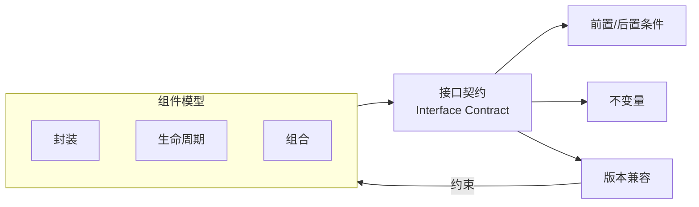
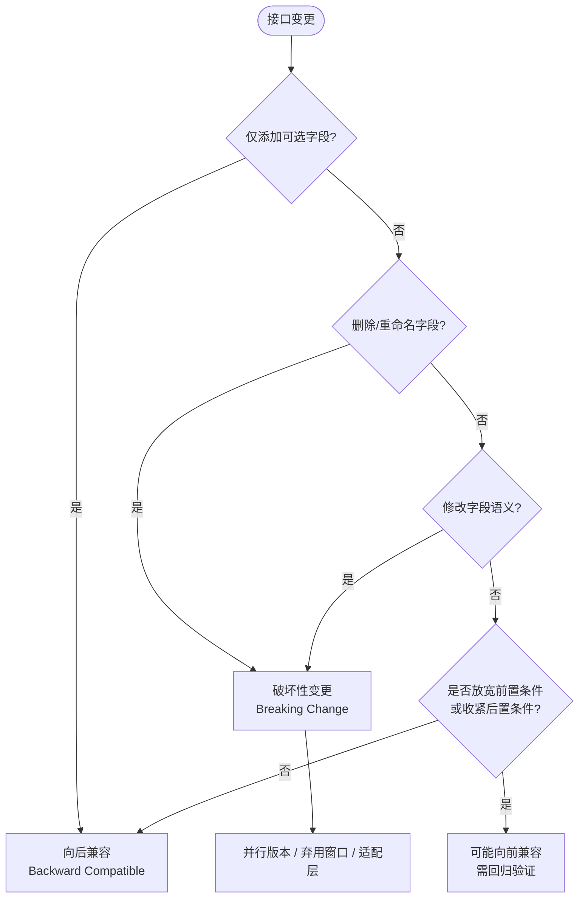

# 接口契约与架构复用

> **版本**: 2026-07-08
> **定位**: 组件架构层 —— 接口契约驱动的复用：从 IDL 到 OpenAPI 到 WIT 的演进
> **对齐标准**: UML 2.5.1 Interfaces, ISO/IEC/IEEE 42010:2022, OpenAPI 3.1, gRPC Protobuf, AsyncAPI, WIT, Pact, Spring Cloud Contract
> **状态**: ✅ 已完成

---

## 目录

- [接口契约与架构复用](#接口契约与架构复用)
  - [目录](#目录)
  - [1. 接口契约演进](#1-接口契约演进)
    - [1.1 历史脉络](#11-历史脉络)
    - [1.2 现代接口契约技术对比](#12-现代接口契约技术对比)
    - [1.3 接口契约的形式化定义](#13-接口契约的形式化定义)
    - [1.4 接口契约的核心属性](#14-接口契约的核心属性)
    - [1.5 接口契约与组件模型的关系](#15-接口契约与组件模型的关系)
    - [解释：接口契约为何是复用的安全边界](#解释接口契约为何是复用的安全边界)
    - [1.6 隐式契约反例：没有文档的“常识”](#16-隐式契约反例没有文档的常识)
    - [1.7 前置/后置条件与不变量的设计示例](#17-前置后置条件与不变量的设计示例)
    - [1.8 契约变更与版本兼容性的最佳实践](#18-契约变更与版本兼容性的最佳实践)
    - [1.9 接口契约与隐式依赖的治理](#19-接口契约与隐式依赖的治理)
  - [2. 契约驱动的复用](#2-契约驱动的复用)
    - [2.1 Consumer-Driven Contracts（CDC）](#21-consumer-driven-contractscdc)
    - [2.2 契约作为复用单元](#22-契约作为复用单元)
  - [3. 接口版本策略](#3-接口版本策略)
    - [3.1 向后兼容（Backward Compatible）](#31-向后兼容backward-compatible)
    - [3.2 向前兼容（Forward Compatible）](#32-向前兼容forward-compatible)
    - [3.3 破坏性变更管理](#33-破坏性变更管理)
    - [3.4 兼容性判定决策树](#34-兼容性判定决策树)
    - [分析](#分析)
  - [4. 契约测试在复用流水线中的位置](#4-契约测试在复用流水线中的位置)
  - [5. 案例：基于 OpenAPI + Pact 的微服务契约复用](#5-案例基于-openapi--pact-的微服务契约复用)
    - [5.1 场景](#51-场景)
    - [5.2 契约定义](#52-契约定义)
    - [5.3 Pact 契约测试](#53-pact-契约测试)
    - [5.4 复用价值](#54-复用价值)
  - [6. 标准条款映射](#6-标准条款映射)
  - [7. 权威来源](#7-权威来源)
  - [8. 交叉引用](#8-交叉引用)

---

## 1. 接口契约演进

### 1.1 历史脉络

| 时代 | 技术 | 用途 | 复用粒度 |
|:---|:---|:---|:---|
| 1990s | CORBA IDL | 分布式对象 | 对象方法 |
| 2000s | WSDL | Web Service | 服务操作 |
| 2010s | Swagger/OpenAPI | REST API | HTTP 端点 |
| 2010s | Protobuf/gRPC | 高性能 RPC | 服务方法 |
| 2020s | AsyncAPI | 异步消息 | 事件通道 |
| **2020s** | **WIT** | **WASM 组件** | **组件接口** |

### 1.2 现代接口契约技术对比

| 技术 | 协议 | 序列化 | 流支持 | 代码生成 | 主要场景 |
|:---|:---|:---|:---:|:---:|:---|
| **OpenAPI 3.1** | HTTP/REST | JSON/XML | ❌ | ✅ | Web API、微服务 |
| **gRPC + Protobuf** | HTTP/2 | Protobuf | ✅ | ✅ | 内部服务、高性能 |
| **GraphQL** | HTTP | JSON | ❌ | ✅ | 客户端驱动查询 |
| **AsyncAPI** | MQTT/AMQP/Kafka | JSON/Avro/Protobuf | ✅ | ✅ | 事件驱动架构 |
| **WIT** | 组件导入/导出 | 语言原生 | ✅ (WASI 0.3) | ✅ | 跨语言组件 |
| **tRPC** | HTTP | JSON | ❌ | ✅ | 全栈 TypeScript |

---

### 1.3 接口契约的形式化定义

**定义**：接口契约（Interface Contract）是组件或服务之间为实现可预期交互而显式约定的语法、语义与质量约束集合。它规定了调用者必须满足的前置条件（precondition）、被调用者必须保证的后置条件（postcondition），以及跨越多次调用的不变量（invariant）。该概念是 [Design by contract](https://en.wikipedia.org/wiki/Design_by_contract) 在组件接口层面的工程化表达。

形式化上，可将接口契约视为对操作语义的约束三元组：

$$C(o) = (Pre(o),\ Post(o),\ Inv(o))$$

其中：

- $Pre(o) \subseteq InputState$：调用者进入操作 $o$ 前必须满足的状态集合；
- $Post(o) \subseteq InputState \times OutputState$：操作 $o$ 完成后调用者可观察的状态转移集合；
- $Inv(o) \subseteq State$：在对象/组件生命周期内始终保持的全局不变量。

可替换性判定（Liskov 替换原则的契约视角）：

> 若组件 $B$ 替换组件 $A$，则 $B$ 的前置条件不得比 $A$ 更严格，后置条件不得比 $A$ 更弱，且不变量必须保持。

### 1.4 接口契约的核心属性

| 属性 | 说明 | 重要性 |
|---|---|---|
| **显式性** | 契约以 IDL/OpenAPI/WIT 等可机读形式声明，避免“口头约定” | 高 |
| **可验证性** | 可通过契约测试、静态检查或模型检验验证调用双方是否履约 | 高 |
| **稳定性** | 契约变更频率应低于实现变更频率，且遵循版本兼容策略 | 高 |
| **可组合性** | 多个契约可组合为更大的服务契约或业务契约 | 中 |
| **版本兼容性** | 契约演进需明确向后/向前兼容规则，避免消费者断裂 | 高 |

### 1.5 接口契约与组件模型的关系

接口契约位于 [组件模型](../01-component-models/component-models-reuse.md) 与外部世界之间，是组件“可替换性”的判据。组件模型回答“如何封装与组合”，接口契约回答“如何安全地交互”。



### 解释：接口契约为何是复用的安全边界

接口契约的本质是把“假设”变成“承诺”。在没有契约的情况下，消费者只能基于对实现的观察编写代码，任何内部变化都可能成为破坏性变更；而显式契约把双方的责任边界固定下来，使提供者可以在不通知所有消费者的情况下进行安全演进。

这一机制解决了复用中的两个根本矛盾：

1. **封装与可见性的矛盾**：组件需要隐藏实现细节，但消费者又需要足够信息来正确使用；
2. **稳定与演进的矛盾**：接口需要长期稳定以支持复用，但业务需求又要求持续变化。

通过前置条件、后置条件、不变量与版本策略，接口契约在上述矛盾之间建立了可验证的平衡点。它不仅是技术文档，更是跨团队、跨系统复用时的法律依据。

### 1.6 隐式契约反例：没有文档的“常识”

**反例**：

**场景**：某内部 REST 服务在实现中约定 `GET /orders/{id}` 返回字段 `orderStatus` 取值为 `PAID`、`SHIPPED`、`DONE`。但 OpenAPI 仅声明 `status` 为字符串，未给出枚举约束。消费者 A 自行将 `DONE` 视为终态；三个月后服务端新增 `REFUNDED`，消费者 A 的状态机崩溃，导致订单重复发货。

**错误根因**：

1. 把实现细节（当前枚举值）当作隐式契约；
2. 缺少不变量声明：订单状态机必须满足 `PAID → SHIPPED → {DONE, REFUNDED}` 的偏序关系；
3. 变更未通过契约测试验证消费者影响。

**后果**：生产事故、回滚、消费者信任下降。

**避免方法**：

- 在 schema 中显式声明枚举与状态转换规则；
- 使用 Pact/Spring Cloud Contract 将隐式期望固化为可执行契约；
- 引入 [Design by contract](https://en.wikipedia.org/wiki/Design_by_contract) 思想，把不变量写入接口文档或断言。

### 1.7 前置/后置条件与不变量的设计示例

以电商系统中的“订单取消”操作为例，说明如何在接口契约中显式声明前置条件、后置条件与不变量。

**操作签名**：

```http
POST /orders/{orderId}/cancel
Authorization: Bearer <token>
```

**前置条件（Precondition）**：

1. 订单 `orderId` 必须存在；
2. 当前订单状态必须为 `PENDING` 或 `PAID`，已发货或已完成的订单不可取消；
3. 调用者必须是订单所有者或具备 `ORDER_CANCEL` 权限的角色。

**后置条件（Postcondition）**：

1. 订单状态转移为 `CANCELLED`；
2. 若订单已支付，则触发退款流程，退款金额等于订单实付金额；
3. 占用的库存必须在 5 分钟内释放回可用库存池。

**不变量（Invariant）**：

1. 订单 ID 在生命周期内不可变更；
2. 订单总金额 `totalAmount` 始终为非负数；
3. 状态转换必须满足偏序关系：`PENDING → PAID → SHIPPED → DONE`，取消只能从 `PENDING` 或 `PAID` 进入 `CANCELLED`。

**契约声明方式**：

- 在 OpenAPI 中通过 `x-preconditions`、`x-postconditions` 扩展字段记录；
- 在代码中使用断言或防御式编程校验前置条件；
- 在事件日志或状态机测试中验证不变量。

> **价值**：当多个团队（订单、支付、库存、物流）围绕同一订单服务集成时，显式契约让每个消费者都能准确推断自己在何种状态下可以调用何种操作，避免状态机冲突与资损风险。

### 1.8 契约变更与版本兼容性的最佳实践

接口契约一旦发布，就会被多个消费者依赖，因此变更管理是契约复用的核心挑战。以下实践可帮助在演进契约的同时保护既有消费者：

1. **优先扩展而非修改**：在 OpenAPI/Protobuf/WIT 中新增可选字段、新增端点或新增枚举值，通常比修改现有字段更安全；
2. **显式标注弃用**：使用 `deprecated: true` 或 `@Deprecated` 标注即将移除的字段，并给出替代方案与时间表；
3. **保持后置条件不弱化**：即使新增字段，也不应改变原有字段的语义或取值范围。例如，原字段 `quantity` 表示“可用库存”，不能在某版本中突然改为“已售库存”；
4. **前置条件不放松也不随意收紧**：放宽前置条件可能导致旧实现无法处理新输入；收紧前置条件则可能导致旧消费者调用失败；
5. **利用契约测试回归验证**：在 CI 中运行 Pact 或 Spring Cloud Contract 验证，确保提供者变更不会破坏已发布的消费者期望；
6. **记录不变量与状态机**：把订单、支付、库存等核心业务对象的状态转换规则写入接口文档或独立的业务规则仓库，使契约变更审查有据可依。

> **核心原则**：接口契约的演进应遵循“加法优先、语义稳定、兼容验证、透明弃用”的十六字方针。

### 1.9 接口契约与隐式依赖的治理

除了显式声明的 schema 与操作签名，接口之间还存在大量隐式依赖：时序假设、副作用顺序、幂等性约定、错误码语义、超时与重试策略等。这些隐式依赖如果不被治理，会成为复用中的“暗礁”。

治理建议包括：

- **把幂等性写入契约**：在 HTTP 接口中通过 `Idempotency-Key` 头部或操作签名显式声明；
- **统一错误模型**：定义标准的错误码结构、重试策略与降级行为，避免消费者自行解读；
- **记录时序与副作用**：使用序列图或状态机说明操作的先决条件与后续影响；
- **契约注册中心**：通过 Pact Broker、SwaggerHub 或内部 API Portal 集中管理契约版本与依赖关系，使隐式依赖可视化。

> **目标**：让任何接口消费者都能通过阅读契约文档，独立判断“在什么情况下、以什么顺序、调用什么操作”是安全的。

## 2. 契约驱动的复用

### 2.1 Consumer-Driven Contracts（CDC）

**核心理念**: 由消费者定义期望的契约，提供者确保满足这些契约。

```
CDC 工作流程
├── 消费者团队编写契约测试
│   └── 定义期望的请求/响应格式
├── 契约发布到共享注册中心（Pact Broker）
├── 提供者团队拉取契约并验证
│   └── 在 CI 中运行提供者验证测试
└── 双方契约兼容时才能部署
```

### 2.2 契约作为复用单元

| 契约类型 | 复用内容 | 复用方式 |
|:---|:---|:---|
| **OpenAPI Spec** | API 定义、数据模型、示例 | 共享规范文件、代码生成 |
| **Protobuf** | 消息格式、服务定义 | 共享 `.proto` 文件、编译为各语言绑定 |
| **AsyncAPI** | 事件 schema、通道定义 | 共享 AsyncAPI 文档、生成发布/订阅代码 |
| **Pact 契约** | 消费者期望的交互模式 | 共享 Pact 文件、双向验证 |
| **WIT** | 组件接口、类型定义 | 共享 `.wit` 文件、生成语言绑定 |

---

## 3. 接口版本策略

### 3.1 向后兼容（Backward Compatible）

**安全变更**（消费者无需修改）:

- 添加新的可选字段
- 添加新的端点/操作
- 放宽输入验证规则
- 缩小输出范围（更具体）

### 3.2 向前兼容（Forward Compatible）

**安全变更**（旧消费者可处理新响应）:

- 使用 extensible 的 schema 设计
- 忽略未知字段
- 使用默认值处理缺失字段

### 3.3 破坏性变更管理

```
破坏性变更处理策略
├── 策略 1: 并行版本（URL 版本）
│   └── /v1/users → /v2/users
├── 策略 2: 内容协商（Header 版本）
│   └── Accept: application/vnd.api.v2+json
├── 策略 3: 弃用窗口
│   └── 发布 v2 后，v1 维护 6-12 个月
├── 策略 4: 兼容性层
│   └── v2 服务内部调用 v1 适配器
└── 策略 5: 消费者通知
    └── 自动化分析哪些消费者受影响
```

### 3.4 兼容性判定决策树



### 分析

判断变更是否安全，不能只看 schema 结构，还需检查前置条件、后置条件与不变量的强弱变化。

> **结论**：接口变更的兼容性最终取决于契约语义约束的强弱变化，而非仅取决于 schema 结构是否变化。

---

## 4. 契约测试在复用流水线中的位置

```
复用流水线中的契约测试
├── 开发阶段
│   ├── 消费者编写契约测试（Pact/WireMock）
│   └── 提供者实现接口并通过契约验证
├── 集成阶段
│   ├── CI 中运行契约验证（can-i-deploy 检查）
│   └── 契约兼容方可合并
├── 部署阶段
│   ├── 部署前验证生产环境契约兼容性
│   └── 契约破坏阻断部署
└── 运营阶段
    ├── 持续监控实际交互是否符合契约
    └── 契约漂移告警
```

---

## 5. 案例：基于 OpenAPI + Pact 的微服务契约复用

### 5.1 场景

电商系统中有三个微服务：

- **订单服务**（消费者）→ 调用 → **库存服务**（提供者）
- **支付服务**（消费者）→ 调用 → **库存服务**（提供者）

### 5.2 契约定义

```yaml
# OpenAPI 规范（库存服务接口）
openapi: 3.1.0
info:
  title: Inventory API
  version: 1.0.0
paths:
  /products/{id}/availability:
    get:
      parameters:
        - name: id
          in: path
          required: true
          schema:
            type: string
      responses:
        '200':
          description: 库存可用性
          content:
            application/json:
              schema:
                type: object
                properties:
                  available:
                    type: boolean
                  quantity:
                    type: integer
                    minimum: 0
```

### 5.3 Pact 契约测试

```javascript
// 订单服务消费者测试
const { PactV3 } = require('@pact-foundation/pact');

describe('Inventory API contract', () => {
  const provider = new PactV3({
    consumer: 'order-service',
    provider: 'inventory-service'
  });

  it('returns product availability', () => {
    provider
      .given('product exists')
      .uponReceiving('get product availability')
      .withRequest({
        method: 'GET',
        path: '/products/PROD-123/availability'
      })
      .willRespondWith({
        status: 200,
        body: {
          available: true,
          quantity: 100
        }
      });
  });
});
```

### 5.4 复用价值

- 库存服务接口契约被两个消费者复用
- 契约测试确保任何接口变更不会破坏现有消费者
- Pact Broker 作为契约注册中心，支持契约的版本管理和兼容性检查

---

## 6. 标准条款映射

| 本主题概念 | 对应标准条款 | 映射说明 |
|:---|:---|:---|
| 接口 / 接口实现 | UML 2.5.1 §10.4 Interfaces | 接口定义操作集合，组件通过 Interface Realization 实现接口 |
| 组件图接口 | UML 2.5.1 §19.3 Component Diagrams | Provided/Required Interface 描述组件间供需关系 |
| 架构视图 | ISO/IEC/IEEE 42010:2022 §5.4, §6.4 | 接口契约视图作为架构描述的模型种类之一 |
| 架构描述实践 | IEEE 1471:2000 | 架构描述中 Viewpoint 与 View 的区分影响接口契约的稳定性 |
| 契约设计 | Design by Contract (Meyer, 1988) | 前置条件、后置条件、不变量是接口契约的语义基础 |
| REST API 契约 | OpenAPI 3.1.0 | HTTP 接口的语法契约标准 |
| RPC 接口契约 | gRPC + Protobuf | 高性能服务间接口契约标准 |
| 异步事件契约 | AsyncAPI 3.x | 事件驱动架构的通道与消息契约标准 |
| 跨语言组件契约 | WIT (WASM Interface Types) | WASM Component Model 的接口定义语言 |
| 消费者驱动契约 | Pact Specification | 消费者与提供者之间的双向契约验证 |

## 7. 权威来源

| 来源 | URL | 核查日期 |
|:---|:---|:---|
| OMG UML 2.5.1 | <https://www.omg.org/spec/UML/2.5.1/> | 2026-07-08 |
| ISO/IEC/IEEE 42010:2022 | <https://www.iso.org/standard/74393.html> | 2026-07-08 |
| IEEE 1471:2000 | <https://standards.ieee.org/standard/1471-2000.html> | 2026-07-08 |
| OpenAPI Specification 3.1 | <https://spec.openapis.org/oas/v3.1.0> | 2026-07-08 |
| gRPC / Protocol Buffers | <https://grpc.io/> | 2026-07-08 |
| AsyncAPI | <https://www.asyncapi.com/> | 2026-07-08 |
| Pact (Consumer-Driven Contracts) | <https://pact.io/> | 2026-07-08 |
| Spring Cloud Contract | <https://spring.io/projects/spring-cloud-contract> | 2026-07-08 |
| WIT (WASM Interface Types) | <https://component-model.bytecodealliance.org/design/wit.html> | 2026-07-08 |
| Design by Contract — Wikipedia | <https://en.wikipedia.org/wiki/Design_by_contract> | 2026-07-08 |
| Component-based Software Engineering — Wikipedia | <https://en.wikipedia.org/wiki/Component-based_software_engineering> | 2026-07-08 |
| Liskov Substitution Principle — Wikipedia | <https://en.wikipedia.org/wiki/Liskov_substitution_principle> | 2026-07-08 |

## 8. 交叉引用

- [组件模型与架构复用](../01-component-models/component-models-reuse.md) — 组件封装、生命周期与可替换性判定
- [组件设计模式选择指南](../04-design-patterns/pattern-selection-guide.md) — 通过模式降低接口契约的复杂度
- [6大语言生态组件复用成熟度深度对比 2026](../07-language-ecosystems/comparison-matrix-2026.md) — 不同语言生态对接口契约工具链的支持差异
- [软件架构复用框架总览](../../README.md) — 本知识体系的全局视图