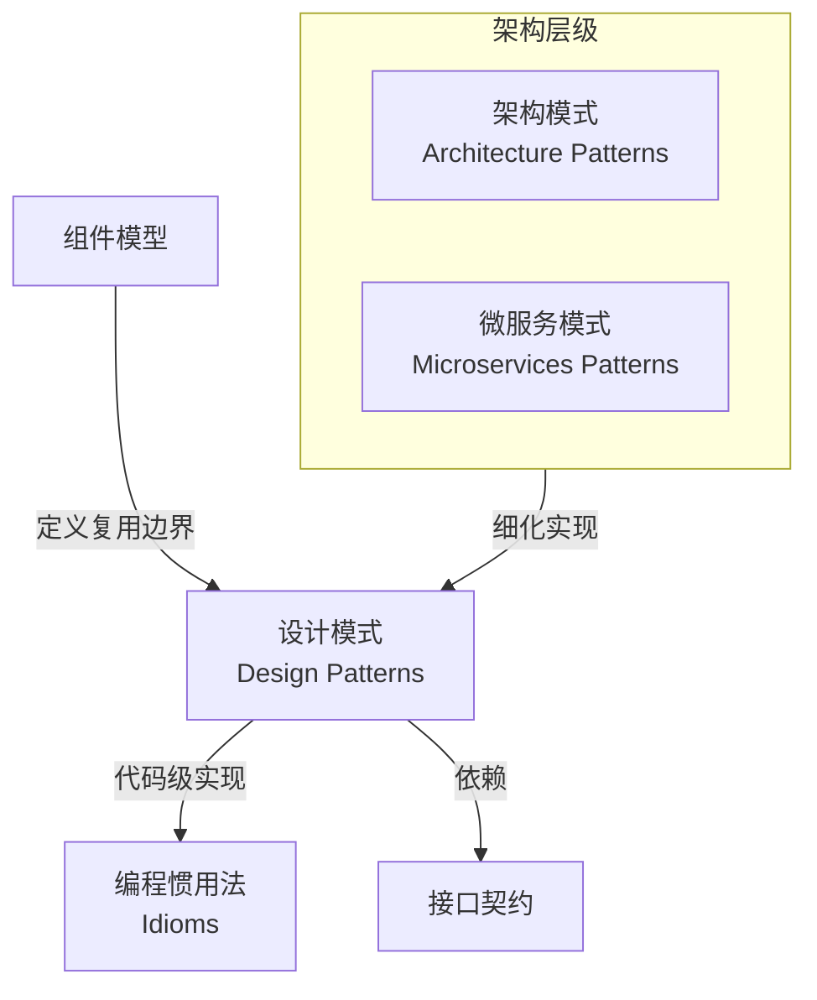
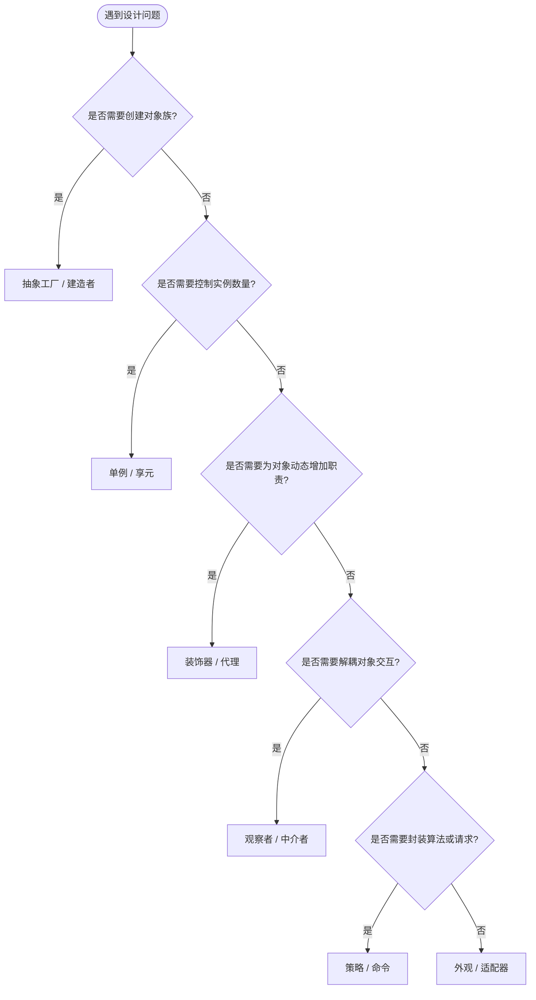

# 组件设计模式选择指南

> **版本**: 2026-06-12
> **定位**: 04-component-architecture-reuse / 04-design-patterns
> **用途**: 根据复用场景选择合适的设计模式

---

## 模式选择矩阵

| 复用场景 | 推荐模式 | 关键考量 |
|:---|:---|:---|
| 需要统一创建一组相关对象 | **抽象工厂（Abstract Factory）** | 产品族一致性、跨平台适配 |
| 需要延迟对象创建并集中管理 | **工厂方法（Factory Method）** | 子类化扩展、单一职责 |
| 需要确保全局唯一实例 | **单例（Singleton）** | 线程安全、测试性、可配置性 |
| 需要为对象添加职责而不改变其结构 | **装饰器（Decorator）** | 运行时组合、开闭原则 |
| 需要为多个对象提供统一接口 | **外观（Facade）** | 简化调用、降低耦合 |
| 需要在对象间解耦发布-订阅 | **观察者（Observer）** | 事件驱动、可扩展性 |
| 需要将算法族封装并可互换 | **策略（Strategy）** | 消除条件分支、运行时选择 |
| 需要将请求封装为对象 | **命令（Command）** | 撤销/重做、队列、日志 |
| 需要按步骤构建复杂对象 | **建造者（Builder）** | 构造过程复用、参数可读性 |
| 需要共享大量细粒度对象 | **享元（Flyweight）** | 内存优化、状态外化 |

---

## 决策流程

```text
是否需要统一创建一组相关对象？
    ├── 是 → 抽象工厂
    └── 否 → 是否需要延迟/集中单个对象创建？
            ├── 是 → 工厂方法 / 建造者
            └── 否 → 是否需要控制实例数量？
                    ├── 是 → 单例 / 享元
                    └── 否 → 是否需要为对象动态添加职责？
                            ├── 是 → 装饰器
                            └── 否 → 是否需要解耦对象间交互？
                                    ├── 是 → 观察者 / 中介者
                                    └── 否 → 是否需要封装算法或请求？
                                            ├── 是 → 策略 / 命令
                                            └── 否 → 是否需要简化复杂子系统接口？
                                                    └── 是 → 外观
```

---

## 反模式警示

| 反模式 | 表现 | 风险 |
|:---|:---|:---|
| **上帝对象（God Object）** | 一个类包含过多职责 | 难以复用、测试和维护 |
| **过度工程（Over-Engineering）** | 为简单场景引入复杂模式 | 增加认知负担，降低复用性 |
| **模式贫血（Anemic Pattern）** | 仅套用模式结构，无实际抽象价值 | 虚假复用，增加代码量 |
| **隐式依赖（Hidden Dependency）** | 通过全局状态或静态方法耦合 | 破坏可测试性和可移植性 |

---

## 检查清单

- [ ] 所选模式是否解决了明确的复用问题？
- [ ] 是否避免了过度设计？
- [ ] 模式实现是否遵循接口契约？
- [ ] 是否记录了模式选择 rationale？
- [ ] 是否评估了对测试和可移植性的影响？

---

## 关联主题

- `04-component-architecture-reuse/02-interface-contracts/` — 接口契约设计
- `04-component-architecture-reuse/03-dependency-management/` — 依赖管理策略


---

## 补充说明：组件设计模式选择指南

### 概念定义

**定义**：设计模式（Design Pattern）是在特定上下文下，针对反复出现的设计问题所总结出的可复用解决方案模板。它描述了一组相互协作的类、对象或组件之间的关系与职责划分，并给出适用场景、优缺点与实现要点。在软件架构复用知识体系中，设计模式是连接[组件模型](../01-component-models/component-models-reuse.md)与[接口契约](../02-interface-contracts/interface-contracts-reuse.md)的“中层语言”，用于在保持实现可变的前提下固化结构复用。

Wikipedia 对[Software design pattern](https://en.wikipedia.org/wiki/Software_design_pattern)的定义强调：模式不是可以直接转化的最终设计或实现，而是对“在某种情境下反复出现的问题”的通用描述。

### 核心属性

| 属性 | 说明 | 重要性 |
|---|---|---|
| **情境性** | 模式只在特定上下文（forces）中才有价值，脱离上下文会失效 | 高 |
| **可复用结构** | 提供类/对象/组件间的稳定协作结构，可被多次实例化 | 高 |
| **开闭原则** | 对扩展开放、对修改关闭，新增变体不破坏既有代码 | 高 |
| **命名与沟通** | 模式名称成为团队共享词汇，降低设计沟通成本 | 中 |
| **可测试性** | 模式应提高而非降低单元测试与集成测试的可行性 | 中 |

### 与其他概念的关系



- **上位概念**：[Software design pattern](https://en.wikipedia.org/wiki/Software_design_pattern) 是总称；架构模式（如分层、微内核、事件驱动）粒度更大。
- **下位概念**：编程惯用法（Idioms）是语言特定的实现技巧，如 Python 的 context manager、Rust 的 RAII。
- **等价/映射概念**：GoF 的 23 个模式与微服务/云原生模式存在映射：
  - 工厂方法 / 抽象工厂 → 服务工厂、Sidecar 注入；
  - 适配器 / 外观 → API Gateway、BFF；
  - 观察者 → 事件总线、发布-订阅；
  - 策略 → Feature Toggle、A/B 测试路由。

### GoF 分类与典型模式映射

| GoF 分类 | 典型模式 | 架构/微服务映射 | 复用场景 |
|---|---|---|---|
| **创建型** | 工厂方法、抽象工厂、建造者、单例、原型 | 服务实例化、对象池、依赖注入容器 | 统一创建一族相关服务 |
| **结构型** | 适配器、桥接、组合、装饰器、外观、享元、代理 | API Gateway、Sidecar、Adapter Service、BFF | 接口适配与职责扩展 |
| **行为型** | 观察者、策略、命令、迭代器、中介者、状态、访问者 | Saga、CQRS、事件总线、路由策略 | 解耦对象交互与算法切换 |

### 架构模式与微服务模式的映射实例

设计模式并非孤立存在，它们常常作为更 coarse-grained 架构模式的实现基础。下表给出常见映射关系：

| 架构/微服务模式 | 底层设计模式组合 | 说明 |
|---|---|---|
| **API Gateway** | 外观（Facade）+ 适配器（Adapter）+ 代理（Proxy） | 统一封装后端服务差异，对外提供一致入口 |
| **BFF（Backend for Frontend）** | 外观 + 策略 | 针对不同前端定制聚合逻辑，策略切换视图模型 |
| **Saga / 分布式事务** | 命令（Command）+ 中介者（Mediator） | 将本地事务封装为命令，由 Saga 编排器协调 |
| **CQRS** | 命令 + 观察者 | 写模型与读模型分离，通过事件同步状态 |
| **Sidecar / Ambassador** | 装饰器（Decorator）+ 代理 | 在不侵入主容器的情况下附加日志、监控、安全能力 |
| **事件溯源（Event Sourcing）** | 命令 + 观察者 + 备忘录 | 状态变更以事件形式持久化，观察者消费事件重建视图 |

理解这些映射有助于在架构评审时把高层决策（“采用 API Gateway”）与低层实现（“使用外观模式”）对应起来，避免架构与代码脱节。

### 模式组合与过度设计的边界

在复杂系统中，单一模式往往不足以解决问题，需要组合使用多个模式。例如，一个典型的订单处理服务可能同时用到：

- **工厂方法**创建策略实例；
- **策略模式**封装不同的优惠计算规则；
- **装饰器**附加日志、幂等、限流等横切能力；
- **观察者**发布订单状态变更事件。

然而，模式组合并非越多越好。判断是否过度设计的三个信号：

1. **抽象层数超过领域复杂度**：如果一个 CRUD 操作经过 5 层抽象才能到达数据库，说明间接层过多；
2. **模式名称无法解释业务意图**：当代码评审中需要反复强调“这是装饰器模式”而不是“这是缓存层”时，抽象已经偏离业务语义；
3. **单元测试需要大量 mock**：过度组合导致每个测试需要 mock 工厂、策略、装饰器、观察者等多个对象，测试脆弱度上升。

**建议**：从最直接、最简单的实现开始，只有当出现以下迹象时才引入模式：同一结构重复出现、扩展点明确、测试或集成痛苦已经产生。模式是“浮现”出来的，而不是预先“设计”出来的。

### 设计评审时的快速提问

在引入或评审模式选择时，可以用以下问题快速检验决策质量：

1. **这个问题是否真实存在？** 如果没有模式，当前代码会遇到什么具体痛苦？
2. **模式是否降低了修改成本？** 新增需求时，是否需要修改现有类，还是只需新增类？
3. **是否提高了可测试性？** 是否可以独立测试各个角色，而无需搭建完整环境？
4. **团队是否能理解并维护？** 引入的模式是否超出了团队的平均水平，导致知识孤岛？
5. **是否与接口契约一致？** 模式引入的抽象是否遵循已定义的接口契约，避免破坏既有消费者？

如果上述问题中有两个以上回答为“否”，则应该重新审视当前的模式选择，考虑更简单或更熟悉的方案。

### 解释：为什么需要模式选择框架

设计模式的价值不在于“使用更多模式”，而在于**用经过验证的结构解决真实问题**。缺乏选择框架时，团队容易陷入两种极端：

1. **模式饥饿**：所有业务逻辑堆在一个类中，导致上帝对象与重复代码；
2. **模式过度使用**：为简单 CRUD 引入抽象工厂 + 策略 + 访问者，造成“间接层地狱”。

模式选择框架通过“复用场景 → 结构问题 → 推荐模式 → 反例警示”的链路，帮助团队在**复用收益**与**认知负担**之间取得平衡。

### 正例：电商定价引擎的模式组合

**示例**：

**背景**：某电商平台需要支持会员价、限时折扣、拼团价等多种定价策略，并支持未来新增策略。

**模式组合**：

- **策略模式（Strategy）**：将 `PricingStrategy` 抽象为接口，各策略独立实现；
- **工厂方法（Factory Method）**：根据订单上下文创建对应的策略实例；
- **观察者模式（Observer）**：价格变更时通知缓存与搜索索引刷新。

```java
public interface PricingStrategy {
    BigDecimal calculate(Order order);
}

public class MemberPricingStrategy implements PricingStrategy { ... }

public class PricingStrategyFactory {
    public PricingStrategy create(Order order) {
        if (order.isGroupBuy()) return new GroupBuyPricingStrategy();
        if (order.getMemberLevel() > 0) return new MemberPricingStrategy();
        return new DefaultPricingStrategy();
    }
}
```

**效果**：新增“秒杀价”只需新增一个策略类并在工厂中注册，订单核心逻辑零修改，符合开闭原则。

### 正例 2：API Gateway 作为外观模式

**背景**：某公司的订单、库存、支付、物流服务分别由不同团队维护，接口风格各异：有的使用 REST，有的使用 gRPC，字段命名也不一致。前端团队在集成时需要编写大量适配代码。

**做法**：引入 API Gateway 作为系统外观，内部使用适配器模式对接各微服务，对外暴露统一的 REST/GraphQL 接口。

```java
public class OrderFacade {
    private final OrderServiceClient orderClient;
    private final InventoryServiceClient inventoryClient;
    private final PaymentServiceClient paymentClient;

    public OrderDetail getOrderDetail(String orderId) {
        var order = orderClient.getOrder(orderId);
        var inventory = inventoryClient.getAvailability(order.getItems());
        var payment = paymentClient.getPaymentStatus(orderId);
        return OrderDetailComposer.compose(order, inventory, payment);
    }
}
```

**效果**：前端只需对接 Gateway，无需关注后端服务的技术差异；当某个后端服务升级时，只需修改 Gateway 中的适配器，消费者不受影响。

### 反例：常见误用与反模式

#### 反例 1：单例模式滥用

```java
public class OrderService {
    private static final OrderService INSTANCE = new OrderService();
    private OrderService() {}
    public static OrderService getInstance() { return INSTANCE; }
}
```

**问题**：全局状态导致测试难以并行，单元测试需要反射重置状态；微服务多实例部署时单例失效。

**正确做法**：通过依赖注入容器管理生命周期，按需配置作用域（singleton / scoped / transient）。

#### 反例 2：为简单场景引入抽象工厂

某工具类仅有一个实现，却被包装成 `IToolFactory` + `ToolFactoryImpl` + `ToolFactoryFactory`。

**问题**：抽象工厂解决的是“产品族”创建问题，单一产品使用工厂方法或直接 new 即可。过度抽象增加了不必要的间接层，降低可读性。

**正确做法**：遵循 YAGNI，先直接创建；当存在多个产品族或需要跨平台适配时，再引入抽象工厂。

#### 反例 3：贫血模式（Anemic Pattern）

仅把类命名为 `Strategy`/`Decorator`，但内部仍是过程式代码，无多态、无组合。

**问题**：模式名称成为“标签”，未带来结构复用价值，反而增加代码量。

**正确做法**：确保模式引入真正的抽象与多态，且能通过新增类而非修改旧类来扩展行为。

### 形式化分析：模式选择决策图



该决策树与正文中的模式选择矩阵、决策流程相互补充，可作为团队设计评审时的检查工具。

### 权威来源

> **权威来源**:
>
> - [Software design pattern — Wikipedia](https://en.wikipedia.org/wiki/Software_design_pattern)
> - [Design Patterns: Elements of Reusable Object-Oriented Software — Wikipedia](https://en.wikipedia.org/wiki/Design_Patterns)
> - [Component-based software engineering — Wikipedia](https://en.wikipedia.org/wiki/Component-based_software_engineering)
> - [Refactoring Guru: Design Patterns](https://refactoring.guru/design-patterns)
> - [Microservices Patterns — Chris Richardson](https://microservices.io/patterns/)
>
> **核查日期**: 2026-07-07

### 交叉引用

- [组件模型与架构复用](../01-component-models/component-models-reuse.md) — 组件边界与可替换性
- [接口契约与架构复用](../02-interface-contracts/interface-contracts-reuse.md) — 模式实现需遵循的接口契约
- [6大语言生态组件复用成熟度深度对比 2026](../07-language-ecosystems/comparison-matrix-2026.md) — 不同语言生态对设计模式实现机制的支持
- [软件架构复用框架总览](../../../view/software_architecture_reuse_framework_2026.md) — 知识体系总览
