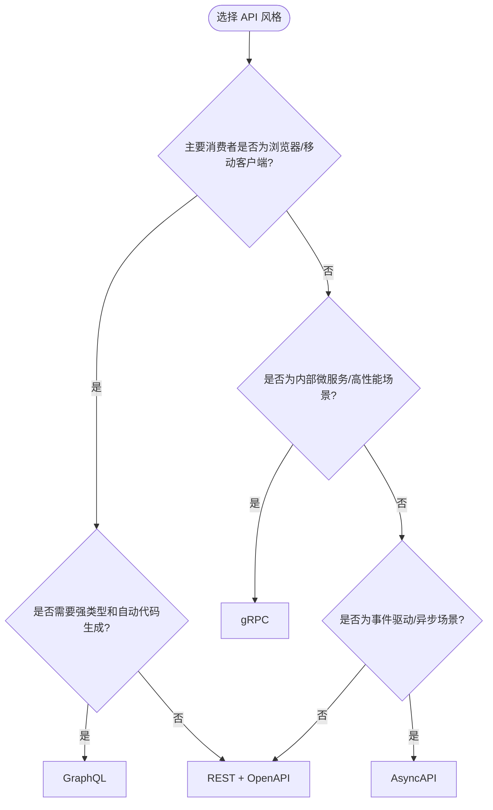

# API 设计模式与功能复用

> **版本**: 2026-06-10
> **定位**: 功能架构层 —— API 作为功能复用的核心单元：设计模式、版本策略与组合架构
> **对齐标准**: OpenAPI 3.1, JSON:API, GraphQL, gRPC, AsyncAPI, Richardson Maturity Model
> **状态**: ✅ 已完成

---

## 目录

- [API 设计模式与功能复用](#api-设计模式与功能复用)
  - [目录](#目录)
  - [1. API 作为功能复用的核心单元](#1-api-作为功能复用的核心单元)
    - [1.0 API 复用设计模式的定义](#10-api-复用设计模式的定义)
    - [1.1 API 复用的三个层次](#11-api-复用的三个层次)
    - [1.2 API 优先设计（API-First Design）](#12-api-优先设计api-first-design)
  - [2. API 设计模式对比](#2-api-设计模式对比)
    - [2.1 REST (Representational State Transfer)](#21-rest-representational-state-transfer)
    - [2.2 GraphQL](#22-graphql)
    - [2.3 gRPC](#23-grpc)
    - [2.4 AsyncAPI（事件驱动 API）](#24-asyncapi事件驱动-api)
  - [3. API 版本策略与复用](#3-api-版本策略与复用)
    - [3.1 版本策略对比](#31-版本策略对比)
    - [3.2 API 弃用策略](#32-api-弃用策略)
  - [4. API 组合模式](#4-api-组合模式)
    - [4.1 BFF (Backend-for-Frontend)](#41-bff-backend-for-frontend)
    - [4.2 API Gateway](#42-api-gateway)
    - [4.3 Backend-for-AI](#43-backend-for-ai)
  - [5. API 可复用性评估](#5-api-可复用性评估)
    - [5.1 评估维度](#51-评估维度)
    - [5.2 复用评分卡](#52-复用评分卡)
  - [6. 案例：Stripe API 设计对功能复用的最佳实践](#6-案例stripe-api-设计对功能复用的最佳实践)
    - [6.1 Stripe API 的设计原则](#61-stripe-api-的设计原则)
    - [6.2 Stripe API 的复用模式](#62-stripe-api-的复用模式)
  - [补充：API 复用设计模式深度解析](#补充api-复用设计模式深度解析)
    - [6.3 REST 复用设计正例：GitHub API](#63-rest-复用设计正例github-api)
    - [6.4 GraphQL 复用设计正例：Shopify Admin API](#64-graphql-复用设计正例shopify-admin-api)
    - [6.5 gRPC 复用设计正例：Kubernetes API](#65-grpc-复用设计正例kubernetes-api)
    - [6.6 API 版本破坏反例：Twitter API v1.0 → v2.0 迁移](#66-api-版本破坏反例twitter-api-v10--v20-迁移)
    - [6.7 反模式：GraphQL 过度获取导致性能灾难](#67-反模式graphql-过度获取导致性能灾难)
    - [6.8 API 风格选择决策树](#68-api-风格选择决策树)
    - [6.9 与相关概念的关系](#69-与相关概念的关系)
    - [6.10 API 复用设计模式核心属性](#610-api-复用设计模式核心属性)
    - [6.11 反例：URL 版本控制的"墓碑链接"困境](#611-反例url-版本控制的墓碑链接困境)
    - [6.12 API 版本演进生命周期](#612-api-版本演进生命周期)
    - [6.13 补充权威来源](#613-补充权威来源)
  - [7. 权威来源](#7-权威来源)

---

## 1. API 作为功能复用的核心单元

### 1.0 API 复用设计模式的定义

**定义**：API 复用设计模式是在功能架构层将业务能力封装为稳定、可发现、可组合的应用程序接口（[API](https://en.wikipedia.org/wiki/API)），并通过资源建模、契约规范、版本策略与组合架构，使同一接口或设计模式能够在多个消费者、系统或生态中重复使用的工程实践。其核心是"用接口契约替代实现复制"，与 Wikipedia 中 [Representational state transfer](https://en.wikipedia.org/wiki/Representational_state_transfer) 所倡导的资源导向与统一接口思想一致。

### 1.1 API 复用的三个层次

```
API 复用层次模型
├── L1: 端点复用（Endpoint Reuse）
│   └── 直接调用现有 API 端点获取功能
│   └── 例：调用第三方支付 API 完成支付
├── L2: Schema 复用（Schema Reuse）
│   └── 复用 API 的数据模型和类型定义
│   └── 例：复用 OpenAPI 定义的 User、Order 模型
└── L3: 模式复用（Pattern Reuse）
    └── 复用 API 设计模式和架构风格
    └── 例：复用 Stripe 的资源命名、分页、错误处理模式
```

### 1.2 API 优先设计（API-First Design）

API 优先设计是功能复用的最佳实践：

- **先定义接口，后实现**: 确保接口设计独立于技术实现
- **契约驱动**: OpenAPI/AsyncAPI 规范作为开发和消费的契约
- **并行开发**: 消费者和提供者可以基于契约并行工作

---

## 2. API 设计模式对比

### 2.1 REST (Representational State Transfer)

**核心原则**: 资源导向、无状态、统一接口

```
REST API 设计检查清单
├── 资源命名
│   ├── ✅ /users（复数名词）
│   ├── ❌ /getUsers（动词）
│   └── ✅ /users/{id}/orders（嵌套资源）
├── HTTP 方法
│   ├── GET — 读取
│   ├── POST — 创建
│   ├── PUT — 全量更新
│   ├── PATCH — 部分更新
│   └── DELETE — 删除
├── 状态码
│   ├── 200 OK, 201 Created, 204 No Content
│   ├── 400 Bad Request, 401 Unauthorized, 403 Forbidden, 404 Not Found
│   └── 500 Internal Server Error
└── HATEOAS（可选）
    └── 响应中包含相关资源链接
```

### 2.2 GraphQL

**核心原则**: 客户端驱动查询、单一端点、强类型 schema

**复用优势**:

- 消费者精确获取所需数据，避免过度获取
- Schema 作为强类型契约，支持代码生成
- 内省（Introspection）支持动态发现可用字段

**复用挑战**:

- 查询复杂度难以预估（需复杂度限制）
- 缓存策略比 REST 复杂
- 版本管理策略与 REST 不同（schema 演进）

### 2.3 gRPC

**核心原则**: 高性能 RPC、基于 HTTP/2、Protobuf 序列化

**复用优势**:

- 强类型接口定义（Protobuf）
- 流支持（Unary、Server Streaming、Client Streaming、Bidirectional）
- 代码生成（多语言客户端/服务端）

**复用场景**: 内部微服务通信、高性能数据交换

### 2.4 AsyncAPI（事件驱动 API）

**核心原则**: 异步消息契约、发布/订阅模式

**复用优势**:

- 定义事件 schema 和通道契约
- 支持多种协议（Kafka、MQTT、AMQP、WebSocket）
- 松耦合：生产者无需知道消费者

---

## 3. API 版本策略与复用

### 3.1 版本策略对比

| 策略 | 实现方式 | 优点 | 缺点 | 适用场景 |
|:---|:---|:---|:---|:---|
| **URL 版本** | `/v1/users`, `/v2/users` | 简单直观 | URL 污染 | 公共 API |
| **Header 版本** | `Accept: application/vnd.api.v2+json` | URL 干净 | 不够直观 | 内部 API |
| **内容协商** | `Content-Type` + `Accept` | HTTP 标准 | 复杂 | 需细粒度控制 |
| **无版本** | 永远向后兼容 | 最简单 | 约束强 | GraphQL、极少数 |

### 3.2 API 弃用策略

```
API 弃用时间线
├── T0: 发布新版本 API
├── T0 + 30 天: 向所有消费者发送弃用通知
│   └── 包含迁移指南和时间表
├── T0 + 90 天: 在旧版本响应中添加 Deprecation 头
│   └── Sunset: Thu, 31 Dec 2026 23:59:59 GMT
├── T0 + 180 天: 旧版本返回警告日志
├── T0 + 270 天: 旧版本开始限流
└── T0 + 365 天: 旧版本退役
```

---

## 4. API 组合模式

### 4.1 BFF (Backend-for-Frontend)

**定义**: 为每个前端平台（Web、iOS、Android）定制专用的后端 API 层。

**复用价值**: 前端团队复用底层服务，BFF 层处理聚合和适配。

### 4.2 API Gateway

**定义**: 统一的 API 入口，处理认证、限流、路由、聚合。

**复用价值**: 底层服务通过 Gateway 暴露，消费者复用 Gateway 的通用能力（认证、监控、缓存）。

### 4.3 Backend-for-AI

**新兴模式**: 为 AI Agent 和 LLM 应用定制的后端层。

**复用价值**:

- 封装 MCP 工具定义
- 管理 Agent 上下文和状态
- 提供结构化的功能接口供 LLM 调用

---

## 5. API 可复用性评估

### 5.1 评估维度

| 维度 | 权重 | 评估标准 |
|:---|:---:|:---|
| **一致性** | 20% | 命名规范、错误格式、分页方式统一 |
| **可发现性** | 20% | 文档完整、有 OpenAPI/AsyncAPI、支持内省 |
| **稳定性** | 20% | 版本策略清晰、变更记录完整、弃用通知及时 |
| **SDK 支持** | 15% | 官方 SDK、多语言支持、类型安全 |
| **性能** | 15% | 响应时间、吞吐量、可用性 SLA |
| **安全性** | 10% | 认证方式、授权粒度、审计日志 |

### 5.2 复用评分卡

```
API 复用评分卡（满分 100）
├── 一致性 (20)
│   ├── 资源命名规范 (+5)
│   ├── 错误格式统一 (+5)
│   ├── 分页方式一致 (+5)
│   └── HATEOAS / 导航支持 (+5)
├── 可发现性 (20)
│   ├── OpenAPI/AsyncAPI 规范 (+10)
│   ├── 交互式文档 (+5)
│   └── 代码示例 (+5)
├── 稳定性 (20)
│   ├── 版本策略文档化 (+5)
│   ├── 变更日志 (+5)
│   ├── 弃用通知机制 (+5)
│   └── SLA 承诺 (+5)
├── SDK 支持 (15)
│   ├── 官方 SDK (+10)
│   └── 社区 SDK (+5)
├── 性能 (15)
│   ├── p99 延迟 < 500ms (+5)
│   ├── 可用性 > 99.9% (+5)
│   └── 速率限制合理 (+5)
└── 安全性 (10)
    ├── OAuth 2.1 / OIDC (+5)
    └── 审计日志 (+5)
```

---

## 6. 案例：Stripe API 设计对功能复用的最佳实践

### 6.1 Stripe API 的设计原则

Stripe 被广泛认为是 REST API 设计的典范，其设计原则直接支持功能复用：

| 原则 | 实现 | 复用价值 |
|:---|:---|:---|
| **资源导向** | `/customers`, `/charges`, `/subscriptions` | 清晰的资源模型，易于理解和复用 |
| **幂等性** | `Idempotency-Key` 头 | 安全重试，消费者无需复杂去重逻辑 |
| **扩展性** | 所有对象包含 `metadata` 字典 | 消费者可扩展数据模型而不破坏接口 |
| **一致性** | 统一的错误格式、分页、过滤 | 学习一次，复用到所有端点 |
| **版本管理** | 日期版本（如 `2024-09-30.acacia`） | 消费者锁定版本，不受变更影响 |
| **SDK 生态** | 官方支持 10+ 语言 | 多语言团队均可复用 |

### 6.2 Stripe API 的复用模式

```
Stripe API 复用模式
├── 直接复用：调用 Stripe API 实现支付功能
├── 模式复用：采用 Stripe 的资源命名和错误处理模式
├── SDK 复用：复用 Stripe 的 SDK 设计模式构建内部 SDK
└── 文档复用：采用 Stripe 的文档风格和组织结构
```

---

## 补充：API 复用设计模式深度解析

### 6.3 REST 复用设计正例：GitHub API

GitHub REST API 是 REST 复用的典范：

- **资源命名一致性**：`/repos/{owner}/{repo}/issues/{issue_number}` 使用嵌套资源表达关系；
- **超媒体驱动**：响应中包含 `_links`，消费者可发现相关操作；
- **版本管理**：通过 `Accept: application/vnd.github+json` 头进行版本协商；
- **分页标准化**：统一使用 `Link` 头与 `per_page`、`page` 参数。

**复用效果**：数千个第三方工具、CI 系统、IDE 插件基于 GitHub API 构建，形成庞大生态。

### 6.4 GraphQL 复用设计正例：Shopify Admin API

Shopify 的 Admin GraphQL API 展示了 schema 驱动复用：

- **单一端点**：所有操作通过 `/admin/api/2024-01/graphql.json` 访问；
- **强类型 schema**：自动生成类型安全的 SDK；
- **内省与文档**：开发者可通过 GraphiQL 实时探索可用字段；
- **版本演进**：每季度发布稳定版本，旧版本保留 12 个月。

**复用效果**：App Store 中的数万应用复用同一套 GraphQL schema，大幅降低了集成成本。

### 6.5 gRPC 复用设计正例：Kubernetes API

Kubernetes 内部大量使用 gRPC 和 Protocol Buffers：

- **proto 文件即契约**：所有资源定义和 API 接口通过 `.proto` 描述；
- **代码生成**：支持 Go、Python、Java、C++ 等多语言客户端；
- **流式通信**：用于日志、exec、端口转发等长连接场景；
- **版本化 API**：`apiVersion: v1`、`apps/v1` 等明确版本前缀。

**复用效果**：Kubernetes 生态中数千个 operator 和控制器共享同一套 API 契约。

### 6.6 API 版本破坏反例：Twitter API v1.0 → v2.0 迁移

Twitter 在 2023 年关闭免费 v1.1 API 访问并强制迁移到 v2，引发广泛争议：

- **破坏性变更**：大量免费端点被移除或收费，认证方式从 OAuth 1.0a 变为 OAuth 2.0；
- **文档不足**：迁移窗口期内 v2 文档不完善，开发者难以及时适配；
- **成本激增**：学术研究者和小型开发者被迫支付高额费用；
- **生态受损**：大量第三方客户端和研究工具停止维护。

**教训**：

- 版本迁移应提供足够长的兼容期（≥12 个月）；
- 破坏性变更需提前公开路线图和替代方案；
- 应建立开发者沟通渠道与迁移支持计划。

### 6.7 反模式：GraphQL 过度获取导致性能灾难

某电商平台将所有内部服务统一暴露为 GraphQL：

- **问题**：前端查询未加限制，单次请求可能拉取数万行关联数据；
- **后果**：数据库连接池耗尽，高峰期 p99 延迟从 200ms 升至 8s；
- **根因**：缺少查询复杂度限制（complexity limit）和深度限制（depth limit）；
- **修复**：引入 `graphql-query-complexity`，限制单次查询成本；为常用查询提供持久化查询（persisted queries）。

### 6.8 API 风格选择决策树



### 6.9 与相关概念的关系

- **上位概念**：[API](https://en.wikipedia.org/wiki/API)（应用程序接口）、软件架构；
- **下位概念**：REST、GraphQL、gRPC、AsyncAPI、BFF、API Gateway；
- **等价/映射概念**：[Representational state transfer](https://en.wikipedia.org/wiki/Representational_state_transfer) 与 REST 架构风格等价；GraphQL 可映射为查询语言层面的 [Remote procedure call](https://en.wikipedia.org/wiki/Remote_procedure_call)；
- **依赖概念**：OpenAPI 规范、JSON Schema、Protocol Buffers、CloudEvents。

> **交叉引用**:
>
> - 组件层复用模式：[struct/04-component-architecture-reuse](../../04-component-architecture-reuse/README.md)
> - 功能层工作流复用：[struct/05-functional-architecture-reuse/04-workflow-orchestration/temporal-reuse-patterns.md](../04-workflow-orchestration/temporal-reuse-patterns.md)
> - 跨层治理度量：[struct/06-cross-layer-governance/05-metrics-kpi/metrics-framework.md](../../06-cross-layer-governance/05-metrics-kpi/metrics-framework.md)

> **权威来源（补充）**:
>
> - [API — Wikipedia](https://en.wikipedia.org/wiki/API)
> - [Representational state transfer — Wikipedia](https://en.wikipedia.org/wiki/Representational_state_transfer)
> - [GraphQL — Wikipedia](https://en.wikipedia.org/wiki/GraphQL)
> - [gRPC — Wikipedia](https://en.wikipedia.org/wiki/GRPC)
> - [API versioning — Wikipedia](https://en.wikipedia.org/wiki/API_versioning)
>
> **核查日期**: 2026-07-07

### 6.10 API 复用设计模式核心属性

| 属性 | 说明 | 重要性 | 可观察性 |
|------|------|--------|----------|
| **接口契约稳定性** | 资源路径、字段、错误格式在版本周期内保持稳定 | 高 | ISR ≥ 85% |
| **可发现性** | 通过 OpenAPI/GraphQL introspection/gRPC reflection 暴露能力 | 高 | 文档完整度 100% |
| **可组合性** | 接口可被编排、聚合为更高阶业务能力 | 高 | 组合调用占比 |
| **多语言友好** | 提供 SDK、代码生成与类型安全 | 中 | SDK 覆盖率 |
| **可演进性** | 支持向后兼容的 schema/contract 演进 | 高 | 破坏性变更频率 |
| **安全与治理** | 认证、授权、限流、审计可统一配置 | 高 | 安全策略覆盖率 |

### 6.11 反例：URL 版本控制的"墓碑链接"困境

某内容平台在三年内连续发布 `/v1/`、`/v2/`、`/v3/` API，但旧版本退役计划不清晰：

- **问题**：
  1. 旧版本文档链接长期存在但无人维护，形成大量"墓碑链接"；
  2. 第三方开发者误用已退役端点，导致数据不一致；
  3. 服务端需同时维护 3 个版本的兼容层，技术债务累积。
- **后果**：维护成本增加 45%，客户支持工单中 20% 与版本混淆有关。
- **避免方法**：
  - 明确 Sunset 日期并在响应头中返回 `Deprecation` 与 `Sunset`；
  - 提供自动化迁移工具与版本使用仪表盘；
  - 退役后立即返回 410 Gone 并附带迁移文档链接。

### 6.12 API 版本演进生命周期


### 6.13 补充权威来源

> **权威来源（补充）**:
>
> - [API versioning — Wikipedia](https://en.wikipedia.org/wiki/API_versioning)
> - [Remote procedure call — Wikipedia](https://en.wikipedia.org/wiki/Remote_procedure_call)
> - [OpenAPI Specification 3.1.0](https://spec.openapis.org/oas/v3.1.0/)
>
> **核查日期**: 2026-07-07

## 7. 权威来源

| 来源 | URL | 核查日期 |
|:---|:---|:---|
| OpenAPI 3.1 | <https://spec.openapis.org/oas/v3.1.0> | 2026-06-10 |
| GraphQL Spec | <https://spec.graphql.org/> | 2026-06-10 |
| gRPC | <https://grpc.io/> | 2026-06-10 |
| AsyncAPI | <https://www.asyncapi.com/> | 2026-06-10 |
| JSON:API | <https://jsonapi.org/> | 2026-06-10 |
| Stripe API Docs | <https://docs.stripe.com/api> | 2026-06-10 |
| Richardson Maturity Model | <https://martinfowler.com/articles/richardsonMaturityModel.html> | 2026-06-10 |
