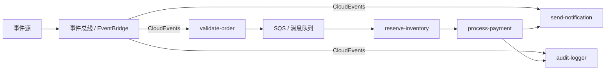
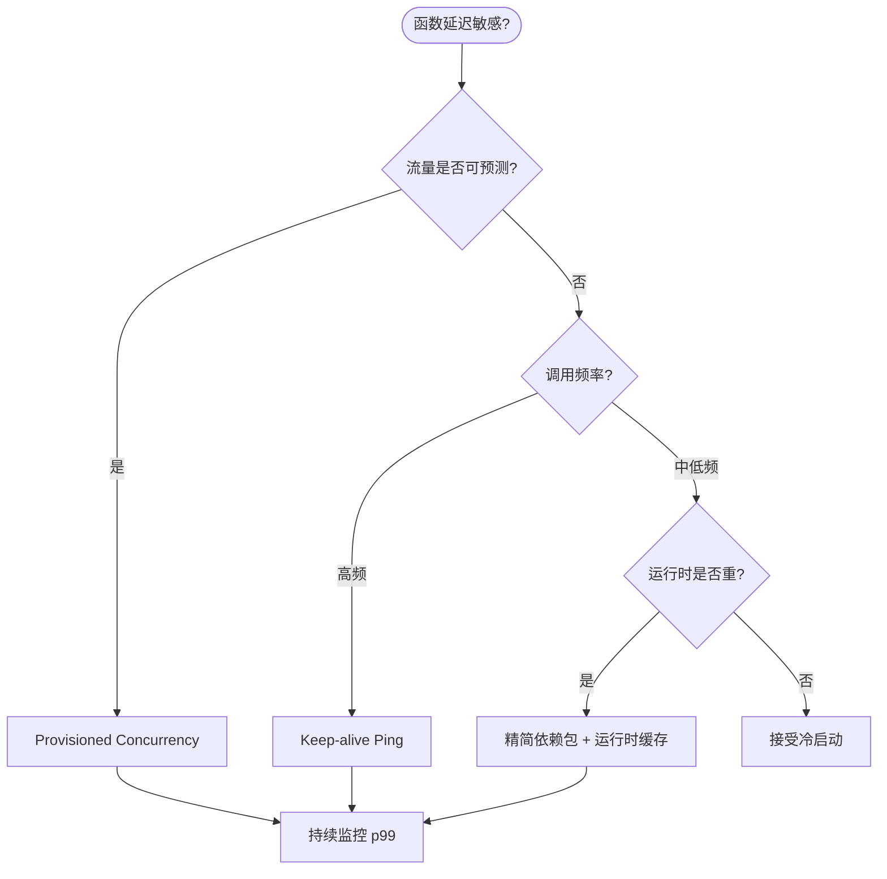

# 函数即服务（FaaS）与功能复用模式

> **版本**: 2026-06-10
> **定位**: 功能架构层 —— 无服务器函数的复用特征、粒度边界与可移植性实践
> **对齐标准**: CNCF Serverless Workflow, OpenFunction, Knative, AWS Lambda, Azure Functions, Google Cloud Functions
> **状态**: ✅ 已完成

---

## 目录

- [函数即服务（FaaS）与功能复用模式](#函数即服务faas与功能复用模式)
  - [目录](#目录)
  - [1. FaaS 概述](#1-faas-概述)
    - [1.1 主流 FaaS 平台](#11-主流-faas-平台)
    - [1.2 FaaS 核心特征](#12-faas-核心特征)
  - [2. FaaS 函数的复用特征](#2-faas-函数的复用特征)
    - [2.1 函数作为最小复用单元](#21-函数作为最小复用单元)
    - [2.2 函数接口标准化](#22-函数接口标准化)
  - [3. 函数复用的粒度边界](#3-函数复用的粒度边界)
    - [3.1 粒度选择矩阵](#31-粒度选择矩阵)
    - [3.2 CNCF Serverless Workflow](#32-cncf-serverless-workflow)
  - [4. FaaS 函数的可移植性](#4-faas-函数的可移植性)
    - [4.1 可移植性挑战](#41-可移植性挑战)
    - [4.2 跨平台复用策略](#42-跨平台复用策略)
  - [5. FaaS 函数的供应链安全](#5-faas-函数的供应链安全)
    - [5.1 部署包完整性](#51-部署包完整性)
    - [5.2 运行时隔离](#52-运行时隔离)
  - [6. 案例：使用 AWS Lambda Layers 和 Knative 实现跨平台函数复用](#6-案例使用-aws-lambda-layers-和-knative-实现跨平台函数复用)
    - [6.1 场景](#61-场景)
    - [6.2 AWS Lambda 实现](#62-aws-lambda-实现)
    - [6.3 Knative 实现](#63-knative-实现)
    - [6.4 复用价值](#64-复用价值)
  - [补充：FaaS 复用模式、事件触发与冷启动权衡](#补充faas-复用模式事件触发与冷启动权衡)
    - [7.1 FaaS 复用模式的定义](#71-faas-复用模式的定义)
    - [7.2 FaaS 复用核心属性](#72-faas-复用核心属性)
    - [7.3 事件触发模式详解](#73-事件触发模式详解)
    - [7.4 冷启动权衡模型](#74-冷启动权衡模型)
      - [论证：冷启动成本分解](#论证冷启动成本分解)
    - [7.5 正例：事件驱动的订单处理流水线](#75-正例事件驱动的订单处理流水线)
    - [反例](#反例)
      - [函数烟囱与供应商锁定](#函数烟囱与供应商锁定)
    - [7.7 FaaS 事件路由架构](#77-faas-事件路由架构)
    - [7.8 与相关概念的关系](#78-与相关概念的关系)
    - [7.9 FaaS 冷启动缓解策略决策树](#79-faas-冷启动缓解策略决策树)
    - [7.10 正例：Azure Functions Durable Functions 的事件驱动编排](#710-正例azure-functions-durable-functions-的事件驱动编排)
    - [7.11 反例：忽视冷启动成本的"全函数化"迁移](#711-反例忽视冷启动成本的全函数化迁移)
    - [7.12 补充权威来源](#712-补充权威来源)
  - [7. 权威来源](#7-权威来源)

---

## 1. FaaS 概述

### 1.1 主流 FaaS 平台

| 平台 | 提供商 | 运行时支持 | 冷启动 | 最大执行时间 | 特色功能 |
|:---|:---|:---|:---:|:---:|:---|
| **AWS Lambda** | Amazon | 15+ 语言 | ~100ms | 15 分钟 | Lambda Layers, Provisioned Concurrency |
| **Azure Functions** | Microsoft | .NET, Node, Python, Java, Go | ~200ms | 10 分钟 | Durable Functions, Premium Plan |
| **Google Cloud Functions** | Google | Node, Python, Go, Java, Ruby, PHP | ~200ms | 60 分钟 | CloudEvents 原生支持 |
| **Knative** | CNCF (开源) | 任何容器 | ~500ms | 无限制 | K8s 原生、多云可移植 |
| **OpenFaaS** | 开源 | 任何容器/二进制 | ~1s | 无限制 | 社区活跃、易于部署 |
| **Fission** | 开源 | 任何容器 | ~100ms | 无限制 | K8s 原生、快速启动 |

### 1.2 FaaS 核心特征

| 特征 | 描述 | 复用影响 |
|:---|:---|:---|
| **无状态** | 函数不保存请求间的状态 | 函数可被任意实例执行，天然可复用 |
| **事件驱动** | 由事件触发执行 | 函数可与多种事件源组合复用 |
| **短生命周期** | 执行完成后资源释放 | 快速迭代，版本更新成本低 |
| **自动伸缩** | 从零到多自动扩展 | 复用函数可按需分配资源 |
| **按调用付费** | 仅对实际执行付费 | 降低复用成本门槛 |

---

## 2. FaaS 函数的复用特征

### 2.1 函数作为最小复用单元

```
FaaS 函数复用层次
├── L1: 单个函数复用
│   └── 直接调用部署好的函数端点
│   └── 例：调用文本翻译函数
├── L2: 函数模板复用
│   └── 复用函数的代码框架和配置模板
│   └── 例：复用"HTTP 触发 + 数据库写入"模板
├── L3: 函数编排复用
│   └── 复用预定义的函数工作流
│   └── 例：复用"图片上传 → 缩略图生成 → CDN 分发"流水线
└── L4: 函数平台能力复用
    └── 复用 FaaS 平台的通用能力（认证、日志、监控）
    └── 例：复用平台的 OIDC 认证中间件
```

### 2.2 函数接口标准化

```
标准化函数接口（以 CloudEvents 为例）
{
  "specversion": "1.0",
  "type": "com.example.order.created",
  "source": "/order-service",
  "id": "A234-1234-1234",
  "datacontenttype": "application/json",
  "data": {
    "orderId": "ORD-12345",
    "amount": 99.99
  }
}
```

**复用价值**: 基于 CloudEvents 的函数可在不同云平台间移植。

---

## 3. 函数复用的粒度边界

### 3.1 粒度选择矩阵

| 粒度 | 示例 | 优点 | 缺点 | 复用场景 |
|:---|:---|:---|:---|:---|
| **单函数** | 发送邮件 | 简单、独立 | 功能有限 | 通用工具函数 |
| **函数链** | 验证 → 处理 → 存储 | 模块化 | 编排复杂 | 业务流程 |
| **函数工作流** | 订单处理全流程 | 端到端 | 紧耦合 | 完整业务场景 |

### 3.2 CNCF Serverless Workflow

**定义**: 标准化的无服务器工作流规范，支持 DSL（YAML/JSON）定义函数编排。

```yaml
# Serverless Workflow 示例
id: order-processing
version: '1.0'
functions:
  - name: validateOrder
    operation: http://order-service/validate
  - name: processPayment
    operation: http://payment-service/process
  - name: sendNotification
    operation: http://notification-service/send
states:
  - name: Validate
    type: operation
    actions:
      - functionRef: validateOrder
    transition: ProcessPayment
  - name: ProcessPayment
    type: operation
    actions:
      - functionRef: processPayment
    transition: SendNotification
  - name: SendNotification
    type: operation
    actions:
      - functionRef: sendNotification
    end: true
```

---

## 4. FaaS 函数的可移植性

### 4.1 可移植性挑战

| 维度 | 平台差异 | 可移植方案 |
|:---|:---|:---|
| **触发器** | HTTP / S3 / Kafka / Timer | CloudEvents 抽象 |
| **上下文** | 平台特定的上下文对象 | 标准化上下文接口 |
| **状态管理** | DynamoDB / Cosmos DB / Firestore | 外部状态存储（Redis、数据库） |
| **依赖管理** | Layers / 容器 / 内置 | 容器化部署 |
| **配置** | 环境变量 / Secrets Manager | 标准化配置注入 |

### 4.2 跨平台复用策略

```
跨平台 FaaS 复用策略
├── 容器化
│   └── 使用 OCI 容器打包函数
│   └── 任何支持容器的平台可运行
├── CloudEvents
│   └── 标准化事件格式
│   └── 触发器与函数解耦
├── 无供应商锁定框架
│   └── Serverless Framework
│   └── Pulumi / Terraform
└── Knative（开源标准）
    └── K8s 原生 FaaS
    └── 多云可移植
```

---

## 5. FaaS 函数的供应链安全

### 5.1 部署包完整性

- **签名验证**: 部署包必须经过签名验证
- **SBOM**: 函数依赖必须提供 SBOM
- **最小权限**: 函数执行角色遵循最小权限原则

### 5.2 运行时隔离

| 隔离级别 | 实现 | 安全性 |
|:---|:---|:---:|
| **进程隔离** | 传统容器 | 🟡 中 |
| **沙箱隔离** | gVisor, Firecracker | 🟢 高 |
| **WASM 隔离** | Wasmtime, WasmEdge | 🟢 高 |
| **硬件隔离** | 机密计算（SGX, SEV） | 🟢 极高 |

---

## 6. 案例：使用 AWS Lambda Layers 和 Knative 实现跨平台函数复用

### 6.1 场景

通用日志处理函数，需要在 AWS 和私有 K8s 集群中复用。

### 6.2 AWS Lambda 实现

```python
# app.py
import json
import logging

def handler(event, context):
    """CloudEvents 兼容的日志处理函数"""
    # 解析 CloudEvent
    cloud_event = json.loads(event['body'])

    # 处理日志
    processed = process_log(cloud_event.data)

    # 发送到下游
    send_to_downstream(processed)

    return {
        'statusCode': 200,
        'body': json.dumps({'processed': True})
    }

def process_log(data):
    # 通用日志处理逻辑
    return data.upper()

def send_to_downstream(data):
    # 抽象的发送接口
    pass
```

### 6.3 Knative 实现

```yaml
# service.yaml
apiVersion: serving.knative.dev/v1
kind: Service
metadata:
  name: log-processor
spec:
  template:
    spec:
      containers:
        - image: gcr.io/project/log-processor:v1
          env:
            - name: DOWNSTREAM_URL
              value: http://downstream-service
```

### 6.4 复用价值

- 业务逻辑（`process_log`）完全复用
- 通过 CloudEvents 实现触发器抽象
- 通过环境变量实现配置外部化

---

## 补充：FaaS 复用模式、事件触发与冷启动权衡

### 7.1 FaaS 复用模式的定义

**定义**：FaaS（Function as a Service）复用模式是将无服务器函数作为最小可复用功能单元，通过标准化事件接口、共享依赖层和可移植部署模板，在多个触发器、应用和云平台之间共享函数逻辑与运行时的实践。

与 Wikipedia 上 [Function as a service](https://en.wikipedia.org/wiki/Function_as_a_service) 的定义一致，本体系进一步强调函数在**事件驱动架构**中的复用价值与**冷启动/成本权衡**的工程决策。

### 7.2 FaaS 复用核心属性

| 属性 | 说明 | 重要性 | 可观察性 |
|---|---|---|---|
| **无状态性** | 函数不保留请求间状态，便于水平扩展与复用 | 高 | 每次调用独立 |
| **事件触发** | 由 HTTP、消息队列、存储事件等触发 | 高 | 触发器配置可审计 |
| **细粒度计费** | 按调用次数与执行时长付费 | 高 | 账单可拆分 |
| **冷启动敏感度** | 首次调用或缩容后重建环境的延迟 | 高 | p99 冷启动时间 |
| **可移植性** | 跨云平台复用的难易程度 | 中 | 平台特定代码占比 |
| **依赖共享** | 通过 Layers/容器镜像共享公共依赖 | 中 | 依赖层复用率 |

### 7.3 事件触发模式详解

| 触发类型 | 典型源 | 复用场景 | 注意事项 |
|---|---|---|---|
| **HTTP/网关触发** | API Gateway、Application Load Balancer | 通用 API 后端、Webhook 处理 | 需处理并发与限流 |
| **对象存储触发** | S3、Blob Storage、GCS | 图片处理、日志分析、ETL | 事件顺序不保证 |
| **消息队列触发** | SQS、Event Hubs、Pub/Sub | 异步任务、事件驱动微服务 | 需幂等性设计 |
| **定时触发** | EventBridge、Cloud Scheduler | 报表生成、数据同步、巡检 | 注意时区与调度精度 |
| **数据库触发** | DynamoDB Streams、Cosmos DB Change Feed | 缓存失效、物化视图、审计 | 流处理顺序保障 |
| **事件总线触发** | EventBridge、Azure Event Grid | 跨服务解耦、SaaS 集成 | 需统一事件 schema |

### 7.4 冷启动权衡模型

#### 论证：冷启动成本分解

冷启动不仅是技术问题，更是经济问题：

冷启动延迟主要由以下因素决定：

```text
T_cold = T_init + T_runtime + T_handler
```

其中：

- `T_init`：容器/沙箱创建与网络配置时间；
- `T_runtime`：运行时（JVM、.NET CLR、Python 解释器）启动时间；
- `T_handler`：函数初始化代码执行时间（导入依赖、建立连接）。

**冷启动缓解策略**：

| 策略 | 适用场景 | 成本影响 | 复杂度 |
|---|---|---|---|
| **Provisioned Concurrency** | 延迟敏感、流量可预测 | 固定成本增加 | 低 |
| **Keep-alive ping** | 中低频但需稳定延迟 | 少量调用费用 | 低 |
| **精简依赖包** | 所有场景 | 无额外成本 | 中 |
| **快照恢复/运行时缓存** | 大数据量初始化 | 平台依赖 | 中 |
| **单实例多并发** | I/O 密集型函数 | 提高利用率 | 中 |
| **迁移至容器化 FaaS** | 复杂运行时需求 | 可能增加 | 高 |

### 7.5 正例：事件驱动的订单处理流水线

某电商平台使用 AWS Lambda + EventBridge 构建订单处理流水线：

- **触发器**：订单服务发布 `OrderCreated` CloudEvent；
- **函数链**：
  1. `validate-order`：校验订单格式；
  2. `reserve-inventory`：调用库存服务；
  3. `process-payment`：调用支付网关；
  4. `send-notification`：发送邮件/短信；
- **复用方式**：`send-notification` 函数同时被营销系统、客服系统复用；
- **效果**：峰值处理能力从 1K/min 提升到 50K/min，成本仅为常驻服务的 30%。

### 反例

#### 函数烟囱与供应商锁定

某初创公司将所有业务拆分为 200+ AWS Lambda 函数：

- **问题**：
  1. 每个函数使用不同的 IAM 角色、日志格式和错误处理；
  2. 深度依赖 AWS 特定 SDK（如 DynamoDB Streams、Step Functions）；
  3. 缺少跨函数共享的通用库，重复代码占比达 40%；
  4. 冷启动频发，Java 函数 p99 延迟高达 5s。
- **后果**：
  - 迁移到其他云平台的重构成本估算为 6 个月；
  - 运维复杂度指数级增长，故障定位困难；
  - 云成本因过度拆分和冷启动抵消了 FaaS 的计费优势。
- **避免方法**：
  - 使用 CloudEvents 抽象事件格式；
  - 建立 Lambda Layers 共享通用依赖与中间件；
  - 对延迟敏感路径使用 Provisioned Concurrency；
  - 定期进行函数合并审查，避免过度拆分。

### 7.7 FaaS 事件路由架构



### 7.8 与相关概念的关系

- **上位概念**：[Serverless computing](https://en.wikipedia.org/wiki/Serverless_computing)、[Cloud computing](https://en.wikipedia.org/wiki/Cloud_computing)；
- **下位概念**：AWS Lambda、Azure Functions、Google Cloud Functions、Knative、OpenFaaS；
- **等价/映射概念**：[Function as a service](https://en.wikipedia.org/wiki/Function_as_a_service) 是 Serverless 的核心实现形态；
- **依赖概念**：事件驱动架构、CI/CD、IAM、容器镜像、CloudEvents。

### 7.9 FaaS 冷启动缓解策略决策树



### 7.10 正例：Azure Functions Durable Functions 的事件驱动编排

某物流平台使用 Azure Functions Durable Functions 处理货运状态变更：

- **触发器**：IoT 设备通过 Event Hubs 上报位置事件；
- **编排函数**：`ShipmentOrchestrator` 按运单 ID 聚合事件，调用 Activity 函数计算 ETA、通知客户、更新库存；
- **复用方式**：
  - `eta-calculator` 函数同时被 Web 端查询、移动端推送复用；
  - `notification-sender` 函数被订单系统、客服系统复用；
- **效果**：开发周期缩短 35%，事件处理延迟 p99 < 500ms。

### 7.11 反例：忽视冷启动成本的"全函数化"迁移

某企业将原有微服务全部拆分为 AWS Lambda 函数，追求极致弹性：

- **问题**：
  1. Java 函数依赖 Spring Boot，冷启动 p99 达 6s；
  2. 为缓解冷启动，为所有函数开启 Provisioned Concurrency，费用反超原微服务；
  3. 函数间通过网络调用，链路追踪困难；
  4. 共享状态频繁访问 DynamoDB，成本激增。
- **后果**：整体云成本上升 22%，核心 API 可用性从 99.95% 降至 99.5%。
- **避免方法**：
  - 对延迟敏感路径使用预置并发，对低频任务接受冷启动；
  - 评估函数化边界，避免过度拆分；
  - 使用 Lambda Layers、SnapStart 或容器化 FaaS 降低启动时间。

### 7.12 补充权威来源

> **权威来源（补充）**:
>
> - [Function as a service — Wikipedia](https://en.wikipedia.org/wiki/Function_as_a_service)
> - [Serverless computing — Wikipedia](https://en.wikipedia.org/wiki/Serverless_computing)
> - [Event-driven architecture — Wikipedia](https://en.wikipedia.org/wiki/Event-driven_architecture)
>
> **核查日期**: 2026-07-07

> **交叉引用**:
>
> - 功能层 API 设计复用：[struct/05-functional-architecture-reuse/01-api-design/api-design-reuse-patterns.md](../01-api-design/api-design-reuse-patterns.md)
> - 功能层工作流复用：[struct/05-functional-architecture-reuse/04-workflow-orchestration/temporal-reuse-patterns.md](../04-workflow-orchestration/temporal-reuse-patterns.md)
> - 跨层 FinOps 成本治理：[struct/06-cross-layer-governance/04-finops-cost/finops-unit-economics-2026.md](../../06-cross-layer-governance/04-finops-cost/finops-unit-economics-2026.md)

> **权威来源（补充）**:
>
> - [Function as a service — Wikipedia](https://en.wikipedia.org/wiki/Function_as_a_service)
> - [Serverless computing — Wikipedia](https://en.wikipedia.org/wiki/Serverless_computing)
> - [Cloud computing — Wikipedia](https://en.wikipedia.org/wiki/Cloud_computing)
> - [Event-driven architecture — Wikipedia](https://en.wikipedia.org/wiki/Event-driven_architecture)
>
> **核查日期**: 2026-07-07

## 7. 权威来源

| 来源 | URL | 核查日期 |
|:---|:---|:---|
| CNCF Serverless Workflow | <https://serverlessworkflow.io/> | 2026-06-10 |
| Knative | <https://knative.dev/> | 2026-06-10 |
| CloudEvents | <https://cloudevents.io/> | 2026-06-10 |
| AWS Lambda | <https://docs.aws.amazon.com/lambda/> | 2026-06-10 |
| Azure Functions | <https://docs.microsoft.com/azure/azure-functions/> | 2026-06-10 |
| OpenFunction | <https://openfunction.dev/> | 2026-06-10 |
