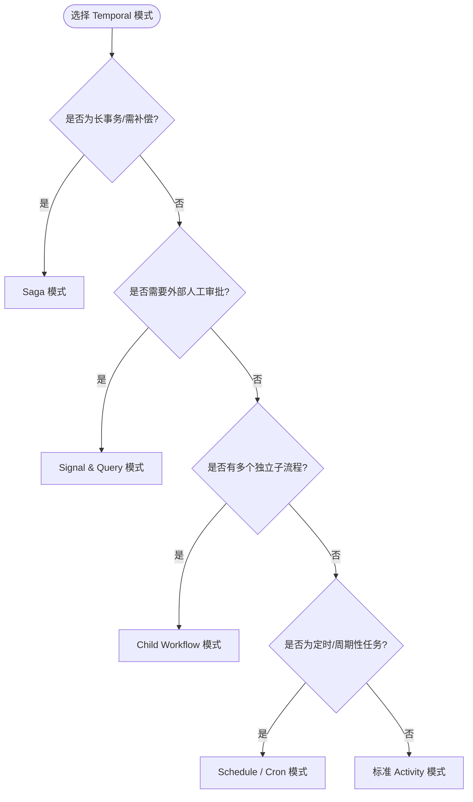
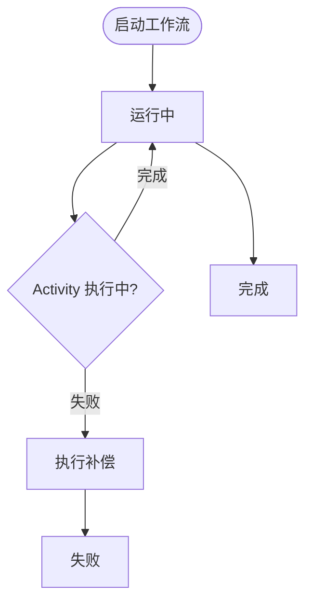

# Temporal 工作流复用模式

> **版本**: 2026-06-06
> **对齐标准**: Temporal v1.26+ (2026)
> **定位**: 功能架构层工作流复用——将业务过程封装为可复用的持久化工作流
> **权威来源**:
>
> - [Temporal Documentation](https://docs.temporal.io) (Temporal Technologies, 2026)
> - [Temporal Workflow Patterns](https://docs.temporal.io/dev-guide/go/foundations) (官方开发指南)
> - [Saga Pattern](https://microservices.io/patterns/data/saga.html) (Chris Richardson, Microservices.io)

---

## 目录

- [Temporal 工作流复用模式](#temporal-工作流复用模式)
  - [目录](#目录)
  - [1. Temporal 工作流的复用本质](#1-temporal-工作流的复用本质)
  - [2. 可复用 Workflow 设计模式](#2-可复用-workflow-设计模式)
    - [2.1 Saga 模式](#21-saga-模式)
    - [2.2 Parallel 模式](#22-parallel-模式)
    - [2.3 Child Workflow 模式](#23-child-workflow-模式)
    - [2.4 Schedule / Cron 模式](#24-schedule--cron-模式)
    - [2.5 信号与查询模式 (Signal \& Query)](#25-信号与查询模式-signal--query)
  - [3. Temporal 与 BPMN 的映射关系](#3-temporal-与-bpmn-的映射关系)
  - [4. 工作流复用的粒度-成本-收益分析](#4-工作流复用的粒度-成本-收益分析)
  - [5. 反模式与陷阱](#5-反模式与陷阱)
  - [补充：Temporal 持久执行与复用反模式](#补充temporal-持久执行与复用反模式)
    - [5.1 持久执行（Durable Execution）的本质](#51-持久执行durable-execution的本质)
    - [5.2 Saga 模式再审视：正向补偿与反向补偿](#52-saga-模式再审视正向补偿与反向补偿)
    - [5.3 反例：未版本化的 Workflow 破坏性变更](#53-反例未版本化的-workflow-破坏性变更)
    - [5.4 反例：在 Workflow 中使用非确定性代码](#54-反例在-workflow-中使用非确定性代码)
    - [5.5 Temporal 模式选择决策矩阵](#55-temporal-模式选择决策矩阵)
    - [5.6 与相关概念的关系](#56-与相关概念的关系)
    - [5.7 Temporal Workflow 复用核心属性](#57-temporal-workflow-复用核心属性)
    - [5.8 正例：Netflix 订阅计费 Saga 的深度复用](#58-正例netflix-订阅计费-saga-的深度复用)
    - [5.9 反例：Workflow 代码复用导致的"幽灵重放"](#59-反例workflow-代码复用导致的幽灵重放)
    - [5.10 Durable Execution 状态机](#510-durable-execution-状态机)
  - [补充说明：Temporal 工作流复用模式](#补充说明temporal-工作流复用模式)
  - [概念定义](#概念定义)
  - [示例](#示例)
  - [反例](#反例)

---

## 1. Temporal 工作流的复用本质

**定义 5.W.1** (Temporal Workflow as Reusable Process): Temporal Workflow 是一个**持久化的、可重放的、有状态的业务过程封装单元**，其形式为：

```text
Workflow := ⟨Id, Definition, State, History, Signals, Queries⟩

其中：
- Id: 全局唯一工作流标识
- Definition: 工作流函数实现（确定性约束）
- State: 当前执行状态（由事件历史重放恢复）
- History: 已发生的事件序列（不可变、可审计）
- Signals: 异步外部输入通道
- Queries: 只读状态查询接口
```

**复用定理**:

> **定理 5.W.1** (Workflow Deterministic Reuse): Temporal Workflow 的可复用性等价于其**确定性**。
> 若工作流函数在给定相同 History 时总是产生相同的 Activity 调用序列，则该 Workflow 可在任意 Worker 上安全重放，从而实现跨运行时、跨版本的复用。

**与传统工作流引擎的对比**:

| 特性 | Temporal | 传统 BPMN 引擎 | 传统定时任务 (Cron) |
|------|----------|---------------|-------------------|
| **持久化** | 自动（事件溯源） | 需配置数据库 | 无（进程内存） |
| **容错** | 进程崩溃自动恢复 | 依赖外部事务 | 需手动重试 |
| **可复用性** | 代码级复用（函数/库） | 模型级复用（XML/BPMN） | 脚本级复用 |
| **版本管理** | 工作流版本化（Patching） | 流程版本管理 | 无版本概念 |
| **可观测性** | 内置 History + Query | 依赖外部监控 | 日志文件 |
| **适用场景** | 长时间运行、复杂编排 | 业务流程可视化 | 简单定时触发 |

---

## 2. 可复用 Workflow 设计模式

### 2.1 Saga 模式

Saga 将长事务分解为一系列本地事务，每个本地事务有对应的补偿操作。

```go
// Saga Workflow 示例 (Go DSL)
func OrderSagaWorkflow(ctx workflow.Context, order Order) error {
    // 阶段 1: 扣减库存
    inventoryCtx := workflow.WithActivityOptions(ctx, inventoryOptions)
    err := workflow.ExecuteActivity(inventoryCtx, ReserveInventory, order.Items).Get(ctx, nil)
    if err != nil {
        return err // 无需补偿（尚未执行后续步骤）
    }

    // 阶段 2: 处理支付
    paymentCtx := workflow.WithActivityOptions(ctx, paymentOptions)
    err = workflow.ExecuteActivity(paymentCtx, ChargePayment, order.Payment).Get(ctx, nil)
    if err != nil {
        // 补偿: 释放库存
        _ = workflow.ExecuteActivity(inventoryCtx, ReleaseInventory, order.Items).Get(ctx, nil)
        return err
    }

    // 阶段 3: 创建发货单
    shippingCtx := workflow.WithActivityOptions(ctx, shippingOptions)
    err = workflow.ExecuteActivity(shippingCtx, CreateShipment, order.Address).Get(ctx, nil)
    if err != nil {
        // 补偿链: 取消支付 + 释放库存
        _ = workflow.ExecuteActivity(paymentCtx, RefundPayment, order.Payment).Get(ctx, nil)
        _ = workflow.ExecuteActivity(inventoryCtx, ReleaseInventory, order.Items).Get(ctx, nil)
        return err
    }

    return nil
}
```

**复用策略**:

- 将 Saga 定义为**可配置模板**，通过参数注入业务 Activity
- 补偿策略标准化：Forward Recovery（重试）vs Backward Recovery（补偿）
- 复用单元：`SagaOrchestrator` 库函数 + 业务特定的 Activity 实现

### 2.2 Parallel 模式

并行执行独立 Activity，等待全部完成后聚合结果。

```go
func ParallelAnalysisWorkflow(ctx workflow.Context, documents []Document) ([]AnalysisResult, error) {
    futures := make([]workflow.Future, len(documents))

    for i, doc := range documents {
        // 每个文档启动独立的并发 Activity
        futures[i] = workflow.ExecuteActivity(ctx, AnalyzeDocument, doc)
    }

    results := make([]AnalysisResult, len(documents))
    for i, future := range futures {
        err := future.Get(ctx, &results[i])
        if err != nil {
            return nil, err
        }
    }

    return results, nil
}
```

**复用策略**:

- `ParallelMap` 作为通用工作流工具函数（类似函数式编程的 `map`）
- 支持自定义并发度、错误策略（全部失败 / 部分成功 / 最佳努力）

### 2.3 Child Workflow 模式

将复杂工作流分解为可独立管理的子工作流。

```go
func ParentWorkflow(ctx workflow.Context, project Project) error {
    childCtx := workflow.WithChildOptions(ctx, workflow.ChildWorkflowOptions{
        WorkflowExecutionTimeout: time.Hour,
        RetryPolicy: &temporal.RetryPolicy{MaximumAttempts: 3},
    })

    // 子工作流 1: 代码审查
    codeReviewFuture := workflow.ExecuteChildWorkflow(childCtx, CodeReviewWorkflow, project.Code)

    // 子工作流 2: 安全扫描
    securityFuture := workflow.ExecuteChildWorkflow(childCtx, SecurityScanWorkflow, project.Code)

    // 子工作流 3: 性能测试
    perfFuture := workflow.ExecuteChildWorkflow(childCtx, PerformanceTestWorkflow, project.Config)

    // 等待全部完成
    var codeResult, securityResult, perfResult AnalysisResult
    _ = codeReviewFuture.Get(childCtx, &codeResult)
    _ = securityFuture.Get(childCtx, &securityResult)
    _ = perfFuture.Get(childCtx, &perfResult)

    // 聚合报告
    return workflow.ExecuteActivity(ctx, GenerateReport,
        AggregatedResults{codeResult, securityResult, perfResult}).Get(ctx, nil)
}
```

**复用策略**:

- Child Workflow 作为**可复用组件**，独立版本管理
- 支持跨团队复用：Team A 提供 `CodeReviewWorkflow`，Team B 直接引用
- 父工作流作为**编排模板**，子工作流作为**业务能力单元**

### 2.4 Schedule / Cron 模式

定时触发的工作流复用。

```go
// Schedule 定义（可复用的定时任务模板）
scheduleHandle, err := c.ScheduleClient().Create(ctx, client.ScheduleOptions{
    ID: "daily-report-generation",
    Spec: client.ScheduleSpec{
        CronExpressions: []string{"0 9 * * MON-FRI"}, // 工作日 9:00
    },
    Action: client.ScheduleWorkflowAction{
        Workflow:  GenerateDailyReportWorkflow,
        TaskQueue: "report-queue",
    },
})
```

**复用策略**:

- Schedule 模板库：按业务场景预定义 Cron 表达式、重试策略、告警规则
- 与 `struct/02-business-architecture-reuse/` 中的价值流对齐：定时工作流是自动化价值流的实现载体

### 2.5 信号与查询模式 (Signal & Query)

```go
// 信号：外部系统向运行中的工作流发送异步输入
func WorkflowWithSignal(ctx workflow.Context, state *WorkflowState) error {
    ch := workflow.GetSignalChannel(ctx, "user-approval")

    selector := workflow.NewSelector(ctx)
    selector.AddReceive(ch, func(c workflow.ReceiveChannel, more bool) {
        var approval ApprovalDecision
        c.Receive(ctx, &approval)
        state.Approved = approval.Approved
    })
    selector.AddFuture(workflow.NewTimer(ctx, time.Hour*24), func(f workflow.Future) {
        state.Expired = true // 24小时超时
    })
    selector.Select(ctx)

    // 根据状态继续执行...
}

// 查询：外部系统查询工作流当前状态（只读，不改变状态）
func QueryHandler(state *WorkflowState) (WorkflowStatus, error) {
    return WorkflowStatus{
        Stage:      state.CurrentStage,
        Progress:   state.Progress,
        Approved:   state.Approved,
    }, nil
}
```

**复用策略**:

- 标准化信号类型：`user-approval`, `cancel`, `priority-change`, `data-update`
- 标准化查询接口：所有业务工作流实现统一的 `GetStatus` 查询

---

## 3. Temporal 与 BPMN 的映射关系

Temporal 工作流是 BPMN 业务流程在代码层的实现。以下映射表支持从业务层到功能层的**降维复用**：

| BPMN 元素 | Temporal 对应 | 复用差异 |
|----------|--------------|---------|
| **任务 (Task)** | Activity | BPMN: 可视化配置；Temporal: 代码实现，更灵活但需工程能力 |
| **网关 (Gateway)** | `if/switch` 或 Selector | BPMN: 可视化分支；Temporal: 代码控制流 |
| **事件 (Event)** | Signal / Timer | 语义等价，Temporal 信号更灵活 |
| **子流程 (Sub-process)** | Child Workflow | 均可复用，Temporal 支持跨版本调用 |
| **泳道 (Lane)** | Task Queue + Worker | BPMN: 组织视图；Temporal: 运行时负载隔离 |
| **消息流 (Message Flow)** | Signal / External Event | Temporal 消息传递更可靠（持久化） |
| **补偿 (Compensation)** | Saga Pattern | BPMN: 声明式补偿；Temporal: 代码式补偿，更精确 |
| **定时边界事件** | `workflow.NewTimer` | 语义等价 |

**映射定理**:

> **定理 5.W.2** (BPMN-Temporal Equivalence): 任何无循环的 BPMN 2.0 流程图都可映射为等价的 Temporal Workflow，反之不成立（Temporal 支持更复杂的动态模式）。

---

## 4. 工作流复用的粒度-成本-收益分析

| 复用粒度 | 示例 | 创建成本 | 维护成本 | 复用收益 | 适用场景 |
|---------|------|---------|---------|---------|---------|
| **Activity** | `SendEmail`, `QueryDatabase` | 低 (2-4h) | 低 | 高 (高频使用) | 通用基础设施操作 |
| **Child Workflow** | `CodeReviewWorkflow` | 中 (1-2d) | 中 | 高 (跨项目复用) | 独立业务单元 |
| **Parent Workflow** | `CICDPipelineWorkflow` | 高 (3-5d) | 高 | 中 (特定场景) | 端到端编排 |
| **Schedule** | `DailyReportSchedule` | 低 (30min) | 低 | 中 (自动化收益) | 定时任务 |
| **Saga Template** | `OrderSagaOrchestrator` | 中 (1-3d) | 低 | 高 (标准化长事务) | 分布式事务 |

---

## 5. 反模式与陷阱

| 反模式 | 描述 | 后果 | 修正策略 |
|--------|------|------|---------|
| **God Workflow** | 单个工作流包含过多 Activity (>20) | 难以测试、版本管理复杂 | 分解为 Child Workflow |
| **Non-Deterministic Code** | 工作流中使用随机数、时间.Now()、外部 API | 重放不一致，状态损坏 | 使用 `workflow.Now()`, `workflow.SideEffect` |
| **Deep Nesting** | 多层 Child Workflow 嵌套 (>3层) | 调试困难、延迟累积 | 扁平化设计，使用 Signal 协调 |
| **Activity Bloat** | Activity 粒度过细（每行代码一个 Activity） | 事件历史膨胀、性能下降 | 合并相关业务逻辑为一个 Activity |
| **Missing Compensation** | Saga 模式缺少补偿操作 | 数据不一致 | 强制要求每个正向操作对应补偿操作 |
| **Hardcoded Config** | 超时、重试策略写死在代码中 | 不同环境需要不同策略 | 通过 Workflow Options 注入配置 |

---

> **对齐验证**:
>
> - Temporal 内容对照 [docs.temporal.io](https://docs.temporal.io) v1.26 官方文档验证
> - Saga 模式对照 Chris Richardson 的 Microservices Patterns 验证
> - BPMN 映射对照 OMG BPMN 2.0 Specification 验证
>
> 最后更新: 2026-06-06


## 补充：Temporal 持久执行与复用反模式

### 5.1 持久执行（Durable Execution）的本质

**定义**：持久执行是 Temporal 工作流的核心机制，指工作流函数的执行状态被持久化为不可变事件历史（Event History），即使工作进程崩溃、服务器重启或网络分区，也能通过重放（Replay）恢复到一致状态。

形式化表达：

```text
DurableExecution := ⟨ActivityInvocations, Timers, Signals, Queries, Compensation⟩
```

**复用价值**：

- **容错复用**：同一工作流模板可在不同 Worker 上无状态重放；
- **长时间运行**：支持数天、数周甚至数月的业务流程；
- **可审计性**：完整事件历史支持合规审计与调试。

### 5.2 Saga 模式再审视：正向补偿与反向补偿

Temporal 中的 Saga 实现有两种策略：

| 策略 | 适用场景 | 实现方式 | 风险 |
|---|---|---|---|
| **正向补偿（Forward Recovery）** | 临时性失败可重试 | Activity 失败时不断重试，直到成功 | 可能导致长时间阻塞 |
| **反向补偿（Backward Recovery）** | 业务失败需回滚 | 执行补偿 Activity 撤销已完成的操作 | 补偿本身可能失败，需设计补偿的补偿 |

**正例**：Netflix 使用 Temporal Saga 处理订阅计费流程，补偿逻辑包括退款、积分返还、邮件通知，确保账单一致性。

### 5.3 反例：未版本化的 Workflow 破坏性变更

某公司在 Workflow 中直接修改 Activity 调用序列：

- **变更**：v1 调用 `ChargePayment` 后调用 `CreateShipment`；v2 改为先 `CreateShipment` 后 `ChargePayment`；
- **后果**：运行中的 v1 工作流重放时 Activity 顺序与新代码不一致，导致非确定性错误（NonDeterministicException）；
- **修复**：使用 `workflow.GetVersion` 或 Patching API 对变更进行版本化。

```go
// 正确做法：使用 GetVersion 保护变更
v := workflow.GetVersion(ctx, "chargeBeforeShip", workflow.DefaultVersion, 1)
if v == workflow.DefaultVersion {
    // 旧逻辑
} else {
    // 新逻辑
}
```

### 5.4 反例：在 Workflow 中使用非确定性代码

```go
// 错误：使用 time.Now()
now := time.Now()

// 正确：使用 workflow.Now()
now := workflow.Now(ctx)
```

**后果**：工作流重放时 `time.Now()` 返回不同值，导致事件历史不一致，工作流失败。

### 5.5 Temporal 模式选择决策矩阵



### 5.6 与相关概念的关系

- **上位概念**：[Workflow engine](https://en.wikipedia.org/wiki/Workflow_engine)、业务流程管理；
- **下位概念**：Activity、Signal、Query、Saga、Child Workflow、Schedule；
- **等价/映射概念**：Temporal Workflow 可映射为 [Event sourcing](https://en.wikipedia.org/wiki/Event_sourcing) 与 [Saga pattern](https://en.wikipedia.org/wiki/Long-running_transaction)；
- **依赖概念**：持久化存储、任务队列、Worker、Protobuf/IDL。

### 5.7 Temporal Workflow 复用核心属性

| 属性 | 说明 | 重要性 | 可观察性 |
|------|------|--------|----------|
| **确定性（Determinism）** | 给定相同事件历史，工作流必须产生一致的 Activity 调用序列 | 高 | 重放测试通过率 100% |
| **持久性（Durability）** | 执行状态持久化为不可变事件历史，支持崩溃恢复 | 高 | 事件历史完整率 |
| **可组合性** | 子工作流、Saga、Parallel 等模式可组合为复杂业务 | 高 | 模式复用次数 |
| **可观测性** | 通过 History、Query、Stack Trace 实时洞察执行状态 | 中 | 查询延迟 < 200ms |
| **版本兼容性** | 工作流代码演进时，运行中实例可安全重放 | 高 | Patching 覆盖率 |
| **可扩展性** | Worker 可水平扩展，任务队列负载隔离 | 中 | 任务处理吞吐 |

### 5.8 正例：Netflix 订阅计费 Saga 的深度复用

Netflix 的全球订阅计费系统使用 Temporal Saga 模式处理跨币种、跨支付渠道的计费流程：

- **Saga 正向流程**：验证账户 → 计算税额 → 扣款 → 开具账单 → 发送收据；
- **补偿链**：
  - 若扣款失败，回滚税额计算并释放账户冻结金额；
  - 若开票失败，触发退款与积分返还；
  - 每一步补偿本身也是可复用的 Activity，被多个工作流共享。
- **复用价值**：
  - 新增国家/支付渠道时，仅需配置新的 Activity 实现，Saga 编排模板保持不变；
  - 补偿逻辑被 12 个不同业务工作流复用，缺陷率降低 40%。

### 5.9 反例：Workflow 代码复用导致的"幽灵重放"

某团队将一组业务工作流抽象为公司级"通用订单工作流"库，所有产品线强制复用：

- **问题**：
  1. 通用工作流包含大量条件分支，覆盖所有产品线的特殊规则；
  2. 某产品线升级 SDK 后，工作流代码新增 `math.rand` 调用（非确定性）；
  3. 旧版本运行中的工作流重放失败，产生大量 `NonDeterministicException`。
- **后果**：生产环境 300+ 长周期订单处理中断，需要人工修复历史事件。
- **避免方法**：
  - 通用工作流库必须通过 CI 非确定性检测；
  - 禁止在工作流函数中使用随机、时间、外部 API；
  - 使用 `workflow.SideEffect` 包装真正的非确定性操作。

### 5.10 Durable Execution 状态机



> **交叉引用**:
>
> - 业务架构层价值流：[struct/02-business-architecture-reuse](../../02-business-architecture-reuse/README.md)
> - 功能层 FaaS 复用：[struct/05-functional-architecture-reuse/02-function-as-a-service/faas-reuse-patterns.md](../02-function-as-a-service/faas-reuse-patterns.md)
> - 组件层事件驱动模式：[struct/04-component-architecture-reuse](../../04-component-architecture-reuse/README.md)
> - 跨层治理成熟度：[struct/06-cross-layer-governance/03-maturity-models/spice-rcmm-rise-mapping.md](../../06-cross-layer-governance/03-maturity-models/spice-rcmm-rise-mapping.md)

> **权威来源（补充）**:
>
> - [Workflow engine — Wikipedia](https://en.wikipedia.org/wiki/Workflow_engine)
> - [Event sourcing — Wikipedia](https://en.wikipedia.org/wiki/Event_sourcing)
> - [Saga pattern — Wikipedia](https://en.wikipedia.org/wiki/Long-running_transaction)
> - [Distributed computing — Wikipedia](https://en.wikipedia.org/wiki/Distributed_computing)
>
> **核查日期**: 2026-07-07

---

## 补充说明：Temporal 工作流复用模式

## 概念定义

**定义**：工作流编排复用是将业务流程或数据处理流程中的活动、状态转换、补偿与超时逻辑封装为可复用工作流模板。

## 示例

**示例**：使用 Temporal 定义标准订单履约工作流，包含库存锁定、支付、发货、补偿等步骤，新业务线通过配置活动参数复用。

## 反例

**反例**：将工作流硬编码在应用代码中，流程变更需要重新编译部署，业务人员无法参与优化。
