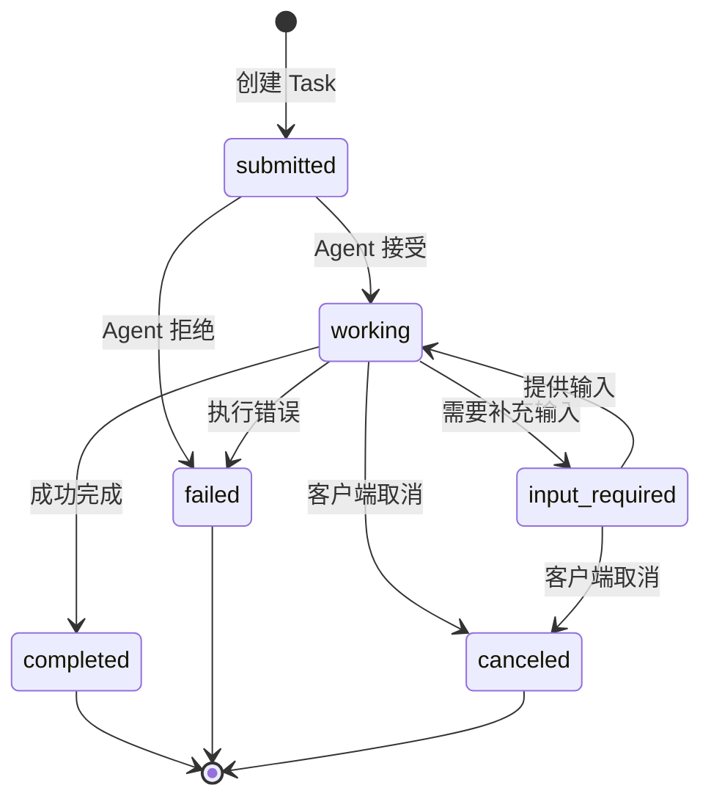

# MCP 2025-11-25 + A2A v1.0.0 协议架构复用分析

> **版本**: 2026-06-06
> **对齐标准**: MCP 2025-11-25（当前稳定版）(Anthropic / Linux Foundation Agentic AI Foundation), A2A v1.0.0.0.0.0.0.0 (Google / Linux Foundation)
> **定位**: 功能架构层最细粒度复用——AI 功能与 Agent 协作的协议化复用框架
> **权威来源**:
>
> - [Model Context Protocol Specification](https://modelcontextprotocol.io) (Anthropic / Linux Foundation Agentic AI Foundation, 2025-11-25)
> - [A2A Protocol Specification](https://a2aprotocol.org) (Google / Linux Foundation, v1.0.0)
> - [MCP 2026 Deep Dive](../../12-ai-native-reuse/01-mcp-protocol/mcp-2026-deep-dive.md)
> - [A2A Reuse Analysis](../../12-ai-native-reuse/02-a2a-protocol/a2a-reuse-analysis.md)

---

## 目录

- [MCP 2025-11-25 + A2A v1.0.0 协议架构复用分析](#mcp-2025-11-25--a2a-v100-协议架构复用分析)
  - [目录](#目录)
  - [1. 协议定位与互补架构](#1-协议定位与互补架构)
  - [2. 协议栈层次对比](#2-协议栈层次对比)
  - [3. MCP 状态机：Session Lifecycle](#3-mcp-状态机session-lifecycle)
  - [4. A2A 状态机：Task Lifecycle](#4-a2a-状态机task-lifecycle)
  - [5. 复用场景矩阵](#5-复用场景矩阵)
  - [6. 互补架构设计：MCP 为「工具层」+ A2A 为「协作层」](#6-互补架构设计mcp-为工具层-a2a-为协作层)
    - [6.1 分层架构图](#61-分层架构图)
    - [6.2 协议交互示例：代码审查工作流](#62-协议交互示例代码审查工作流)
    - [6.3 复用价值量化](#63-复用价值量化)
  - [7. 复用质量指标与治理](#7-复用质量指标与治理)
    - [7.1 MCP 复用质量指标](#71-mcp-复用质量指标)
    - [7.2 A2A 复用质量指标](#72-a2a-复用质量指标)
    - [7.3 联合治理模型](#73-联合治理模型)
  - [8. 2026 路线图与演进预测](#8-2026-路线图与演进预测)
  - [补充说明：MCP 2025-11-25 + A2A v1.0.0 协议架构复用分析](#补充说明mcp-2025-11-25--a2a-v100-协议架构复用分析)
  - [概念定义](#概念定义)
  - [示例](#示例)
  - [反例](#反例)

---

## 1. 协议定位与互补架构

```text
AI 原生复用协议栈
├── 协作层 (Collaboration)  ← A2A 主导
│   ├── Agent 发现与能力广告
│   ├── 任务委托与编排
│   ├── 多 Agent 协商与竞争
│   └── 跨组织 Agent 互操作
│
├── 功能层 (Function)  ← MCP 主导
│   ├── 工具调用 (Tool / Function)
│   ├── 资源访问 (Resource / Data)
│   ├── 提示模板 (Prompt Template)
│   └── 模型采样 (Sampling / Inference)
│
└── 传输层 (Transport)
    ├── Streamable HTTP (MCP 2025-11-25 当前稳定版)
    ├── SSE / WebSocket
    └── stdio (本地进程)
```

**核心洞察**: MCP 解决「Agent 如何调用功能」，A2A 解决「Agent 如何与其他 Agent 协作」。两者在协议栈上呈**正交互补**关系，而非竞争关系。

---

## 2. 协议栈层次对比

| 对比维度 | MCP 2025-11-25 | A2A v1.0.0 | 复用语义差异 |
|----------|-------------------|-----------|-------------|
| **核心抽象** | Capability (能力) | Agent (智能体) | MCP 复用「功能单元」；A2A 复用「自主决策单元」 |
| **通信模型** | 无状态请求/响应 (Stateless) | 有状态任务生命周期 (Stateful) | MCP 适合高频、短周期调用；A2A 适合长周期、多轮协作 |
| **发现机制** | 能力协商 (Capability Negotiation) | Agent Card (能力广告 JSON) | MCP 运行时协商；A2A 预发布目录 |
| **调用粒度** | 函数级 (Tool Call) | 任务级 (Task Delegation) | MCP: 单次函数执行；A2A: 完整工作目标 |
| **状态管理** | 无状态（每请求自包含） | 有状态（Task 状态机驱动） | MCP 状态由 Client 维护；A2A 状态由双方协同维护 |
| **安全模型** | OAuth 2.1 + 能力级 Scope | Signed Agent Cards + mTLS | MCP 聚焦「谁能调用什么」；A2A 聚焦「谁是可信 Agent」 |
| **多模态** | Resources (URI + MIME) | Artifacts (Parts 数组) | MCP 强调数据资源的缓存复用；A2A 强调结果的结构化交付 |
| **错误处理** | JSON-RPC Error Code | Task failed + 错误 Artifact | MCP: 即时错误返回；A2A: 异步错误通知 |
| **扩展机制** | Extensions 框架 (mcp.ext.*) | 版本协商 + 能力发现 | 两者均支持向后兼容的协议演进 |
| **传输绑定** | stdio / SSE / Streamable HTTP | HTTP + SSE (流式) | MCP 更灵活（支持本地进程）；A2A 专注网络服务 |

---

## 3. MCP 状态机：Session Lifecycle

虽然 MCP 2025-11-25 保留了显式的 Session 握手和能力协商，但**生命周期管理**仍以状态机驱动。

```text
MCP Client-Server 交互状态机

Client 视角:
├── State: IDLE
│   └── Event: 需要调用 Tool / 读取 Resource
│       └── Action: 发送请求 (含 Mcp-Method 头部)
│       └── Transition → AWAITING_RESPONSE
│
├── State: AWAITING_RESPONSE
│   ├── Event: 收到成功响应
│   │   └── Transition → IDLE (完成)
│   ├── Event: 收到错误响应
│   │   └── Action: 根据 ErrorModel 重试或上报
│   │   └── Transition → IDLE (失败)
│   └── Event: 需要 Sampling (Server 请求 Client 模型推理)
│       └── Transition → SAMPLING_REQUESTED
│
├── State: SAMPLING_REQUESTED
│   └── Event: Client 完成模型推理并返回结果
│       └── Transition → AWAITING_RESPONSE
│
└── State: TERMINATED
    └── Event: 连接关闭或错误不可恢复
```

**形式化定义**:

```text
MCP_Request := ⟨Method, Params, Id, Mcp-Method-Header⟩
MCP_Response := ⟨Result | Error, Id⟩

Valid(Request) ↔ Capability(Server, Request.Method) ∧ Scope(Token, Request.Method)
```

---

## 4. A2A 状态机：Task Lifecycle

A2A 的 Task 状态机是其核心复用单元，定义了「工作委托」的完整生命周期。



**形式化定义**:

```text
Task := ⟨Id, Name, Status, Artifacts, Messages, Timeout⟩
Status ∈ {submitted, working, input_required, completed, failed, canceled}

Transition Rule:
  submitted → working      ⟺  Agent 验证能力匹配 ∧ 资源充足
  submitted → failed       ⟺  ¬Capability(Agent, Task.Skills)
  working → input_required ⟺  需要澄清或补充信息
  working → completed      ⟺  |Artifacts| ≥ 1 ∧ Validation(Artifacts)
  working → failed         ⟺  Error ∧ RetryExhausted
  working → canceled       ⟺  Client 发送取消请求

Invariant:
  ∀ t ∈ Task: t.Status ∈ Terminal → |t.Messages| 不变 ∧ |t.Artifacts| 不变
  Terminal := {completed, failed, canceled}
```

---

## 5. 复用场景矩阵

| 复用场景 | 主导协议 | 复用单元 | 关键设计模式 | 示例 |
|----------|---------|---------|-------------|------|
| **工具复用** | MCP | Tool Schema + 实现 | 函数即服务 (FaaS) | 数据库查询工具、文件操作工具 |
| **Agent 技能复用** | A2A | Agent Card + Skills | 微服务化 Agent | 代码审查 Agent、安全扫描 Agent |
| **工作流复用** | A2A + MCP | Task 模板 + Tool 链 | 编排模式 (Orchestration) | 报告生成流水线：数据提取(MCP) → 分析(A2A) → 格式化(MCP) |
| **知识复用** | MCP | Resource URI + ttlMs | CDN 缓存模式 | 文档库、API 规范、最佳实践指南 |
| **提示模板复用** | MCP | Prompt 定义 + 参数 | 模板引擎模式 | 代码审查 Prompt、测试生成 Prompt |
| **模型推理复用** | MCP | Sampling 配置 | 反向 API 调用 | Server 请求 Client 的本地模型进行轻量推理 |
| **跨组织协作** | A2A | Signed Agent Cards | 联邦信任模型 | 供应商 Agent 与企业 Agent 的安全协作 |
| **多 Agent 竞争** | A2A | Task + 评分函数 | 多智能体系统 (MAS) | 3 个代码审查 Agent 并行，取最优结果 |

---

## 6. 互补架构设计：MCP 为「工具层」+ A2A 为「协作层」

### 6.1 分层架构图

```text
┌─────────────────────────────────────────────┐
│           应用层 (Application)               │
│  IDE (Cursor/VS Code) / ChatGPT / Claude    │
└──────────────────┬──────────────────────────┘
                   │ 调用
┌──────────────────▼──────────────────────────┐
│           协作层 (A2A)                       │
│  ┌─────────────┐    ┌─────────────┐        │
│  │ Orchestrator│───→│ Code Review │        │
│  │   Agent     │    │   Agent     │        │
│  └──────┬──────┘    └─────────────┘        │
│         │ Task 委托                          │
│         ▼                                   │
│  ┌─────────────┐    ┌─────────────┐        │
│  │  Security   │    │   Test      │        │
│  │   Agent     │    │   Agent     │        │
│  └─────────────┘    └─────────────┘        │
└──────────────────┬──────────────────────────┘
                   │ 能力调用 (Tools)
┌──────────────────▼──────────────────────────┐
│           功能层 (MCP)                       │
│  ┌─────────┐ ┌─────────┐ ┌─────────┐      │
│  │  DB Query│ │ File I/O │ │  Shell  │      │
│  │  Tool   │ │  Tool   │ │  Tool   │      │
│  └─────────┘ └─────────┘ └─────────┘      │
│  ┌─────────┐ ┌─────────┐ ┌─────────┐      │
│  │ Document│ │  Code   │ │  API    │      │
│  │ Resource│ │  Prompt │ │ Sampling│      │
│  └─────────┘ └─────────┘ └─────────┘      │
└─────────────────────────────────────────────┘
```

### 6.2 协议交互示例：代码审查工作流

```text
场景：开发者请求代码审查

Step 1 (A2A - 发现):
  Client → GET https://code-review-agent.example.com/.well-known/agent.json
  ← Agent Card (含 skills: rust-review, security-scan)

Step 2 (A2A - 委托):
  Client → POST /tasks
  Body: { name: "review_pr_42", skill: "rust-review", input: { pr_url: "..." } }
  ← Task { id: "task-001", status: "working" }

Step 3 (A2A - 协作):
  Code Review Agent 内部决策:
    - 需要静态分析 → 调用 MCP Tool: "run_clippy"
    - 需要安全扫描 → 调用 MCP Tool: "run_cargo_audit"
    - 需要人工知识 → 调用 MCP Resource: "rust-security-guidelines.md"

Step 4 (MCP - 工具调用):
  Agent → POST /mcp/v1 (Mcp-Method: tools/call)
  Body: { method: "tools/call", params: { name: "run_clippy", arguments: {...} } }
  ← Result: { issues: [...], suggestions: [...] }

Step 5 (A2A - 结果交付):
  Agent → SSE stream /tasks/task-001
  ← Artifact: { parts: [ {type: "text", text: "Review complete..."}, {type: "file", ...} ] }

Step 6 (A2A - 完成):
  Task Status: "completed"
```

### 6.3 复用价值量化

| 层次 | 复用单元 | 创建成本 | 复用收益 | ROI 阈值 |
|------|---------|---------|---------|---------|
| MCP Tool | 函数级封装 | 低 (小时级) | 高 (每次调用节省分钟) | 10+ 次调用即回本 |
| MCP Resource | 数据资产 | 中 (天级) | 中 (减少信息检索时间) | 跨 3+ 项目复用 |
| MCP Prompt | 提示模板 | 低 (小时级) | 高 (标准化输出质量) | 5+ 次使用即回本 |
| A2A Agent Card | Agent 能力广告 | 中 (天级) | 高 (自动化发现与路由) | 2+ 消费者 |
| A2A Task 模板 | 工作流定义 | 高 (周级) | 高 (标准化协作流程) | 5+ 次任务执行 |

---

## 7. 复用质量指标与治理

### 7.1 MCP 复用质量指标

| 指标 | 定义 | 目标值 | 测量方法 |
|------|------|--------|---------|
| **Tool Clarity Score** | 描述清晰度与示例覆盖度 | ≥ 0.85 | LLM 调用成功率 |
| **Schema Completeness** | JSON Schema 约束完整性 | ≥ 0.90 | 必填字段覆盖率 |
| **Capability Cache Hit** | tools/list 缓存命中率 | ≥ 70% | ttlMs 有效性 |
| **Sampling Accuracy** | 模型采样结果可用率 | ≥ 90% | 人工评估 |

### 7.2 A2A 复用质量指标

| 指标 | 定义 | 目标值 | 测量方法 |
|------|------|--------|---------|
| **Agent Card Completeness** | 能力描述完整度 | ≥ 0.90 | Schema 验证 |
| **Task Success Rate** | 任务成功完成率 | ≥ 85% | 状态机统计 |
| **Signature Validity** | Agent Card 签名有效比例 | 100% | 密码学验证 |
| **Interoperability Score** | 跨平台 Agent 协作成功率 | ≥ 80% | 兼容性测试 |

### 7.3 联合治理模型

```text
MCP + A2A 联合治理
├── 注册中心 (Registry)
│   ├── MCP Tool 目录: 按领域、版本、质量评分索引
│   └── A2A Agent 目录: 按能力、信任等级、SLA 索引
│
├── 版本策略
│   ├── MCP Tool: Semver (破坏性变更需 major bump)
│   ├── MCP Resource: 内容哈希 + ttlMs
│   └── A2A Agent Card: 语义版本 + 签名时间戳
│
├── 信任体系
│   ├── MCP: OAuth 2.1 Scope + Issuer 验证
│   ├── A2A: Signed Agent Cards + 信任锚链
│   └── 联合: 能力级授权 + Agent 级身份验证
│
└── 监控与审计
    ├── MCP: Tool 调用频次、延迟、错误率
    └── A2A: Task 生命周期时长、状态转移频率、协作模式分布
```

---

## 8. 2026 路线图与演进预测

| 时间 | MCP 演进 | A2A 演进 | 联合影响 |
|------|---------|---------|---------|
| **2025-12** | MCP 2025-11-25 正式发布（Linux Foundation Agentic AI Foundation 接管） | A2A v1.0 稳定化 | 企业级 Agent 互操作元年 |
| **2026-Q3** | MCP Apps (服务器渲染 UI) | A2A Agent 市场启动 | 交互式工具 + 自动化 Agent 交易 |
| **2026-Q4** | Extensions 生态爆发 | A2A v1.1 (多 Agent 协商) | 复杂多智能体系统标准化 |
| **2027-H1** | MCP 1.0 (GA) | A2A 2.0 (联邦学习协作) | AI 原生复用成为默认架构 |

**战略建议**:

1. **短期 (2026-Q3)**: 优先构建 MCP Tool 库，将高频功能（数据查询、文件操作、API 调用）封装为标准化 Tools
2. **中期 (2026-Q4)**: 为关键业务 Agent 发布 Signed Agent Cards，建立内部 Agent 目录
3. **长期 (2027)**: 构建 MCP + A2A 联合治理平台，实现跨组织 AI 能力的可信复用

---

> **对齐验证**:
>
> - MCP 内容对照 [modelcontextprotocol.io](https://modelcontextprotocol.io) 2025-11-25 规范验证
> - A2A 内容对照 [a2aprotocol.org](https://a2aprotocol.org) v1.0.0 规范验证
> - 互补架构设计基于 Anthropic 与 Google 官方博客的联合声明
>
> 最后更新: 2026-06-06


---

## 补充说明：MCP 2025-11-25 + A2A v1.0.0 协议架构复用分析

## 概念定义

**定义**：MCP（Model Context Protocol）规范 Agent 与工具/上下文源之间的交互，A2A（Agent-to-Agent Protocol）规范 Agent 之间的协作；二者共同构成 AI 原生复用的协议基础。

## 示例

**示例**：企业构建 MCP 工具目录，将数据库查询、文档检索、代码分析等能力暴露为标准化工具，不同 Agent 可按能力清单调用。

## 反例

**反例**：各 Agent 使用私有 RPC 协议与工具交互，导致工具无法在 Agent 之间共享，形成新的孤岛。
