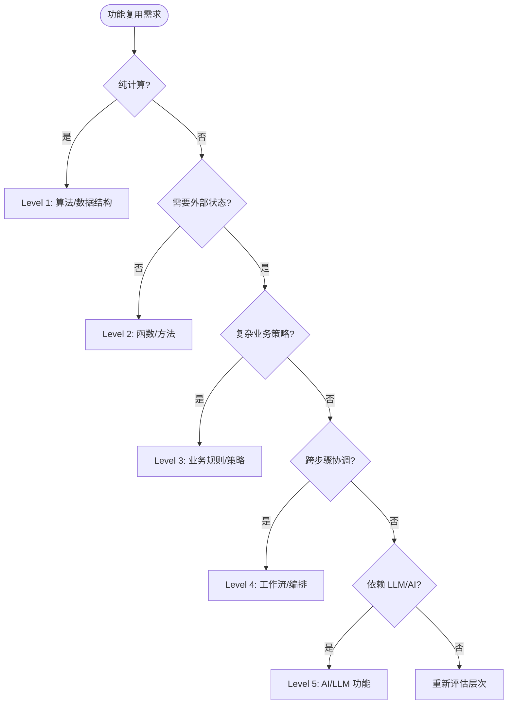

# 功能复用的粒度-成本-收益决策树

> **版本**: 2026-06-06
> **定位**: 功能架构层复用决策方法论——从算法级到 AI 功能级的量化决策框架
> **对齐来源**: COCOMO II (USC), NASA RRL, ISO/IEC 26564:2022, FinOps Foundation

---

## 目录

- [功能复用的粒度-成本-收益决策树](#功能复用的粒度-成本-收益决策树)
  - [目录](#目录)
  - [1. 五层粒度模型](#1-五层粒度模型)
    - [各层核心特征](#各层核心特征)
  - [2. 成本-收益量化框架](#2-成本-收益量化框架)
    - [2.1 成本模型](#21-成本模型)
    - [2.2 收益模型](#22-收益模型)
    - [2.3 各层量化参考值](#23-各层量化参考值)
  - [3. 决策树](#3-决策树)
    - [Mermaid 可视化](#mermaid-可视化)
  - [4. 场景决策卡](#4-场景决策卡)
    - [场景 1：支付密码验证](#场景-1支付密码验证)
    - [场景 2：电商订单折扣计算](#场景-2电商订单折扣计算)
    - [场景 3：跨境电商清关流程](#场景-3跨境电商清关流程)
    - [场景 4：智能客服回复生成](#场景-4智能客服回复生成)
  - [5. 反模式与修正](#5-反模式与修正)

---

## 1. 五层粒度模型

```text
功能复用粒度谱系
├── Level 1: 算法/数据结构复用
│   └── 示例: STL sort, NumPy ndarray, Rust Iterator
│
├── Level 2: 函数/方法复用
│   └── 示例: 工具函数库、API 端点、Lambda 函数
│
├── Level 3: 业务规则/策略复用
│   └── 示例: Drools 规则集、OPA 策略、DMN 决策表
│
├── Level 4: 工作流/编排复用
│   └── 示例: Temporal Workflow、Camunda 流程、Airflow DAG
│
└── Level 5: AI/LLM 功能复用
    └── 示例: Prompt 模板、RAG 管道、MCP Tool、Agent Skill
```

### 各层核心特征

| 粒度层 | 复用单元 | 边界定义 | 变更频率 | 技术约束 | 认知负荷 |
|--------|---------|---------|---------|---------|---------|
| **L1 算法** | 数据结构/算法实现 | 时间/空间复杂度契约 | 极低（数学稳定） | 语言绑定 | 低（标准化接口） |
| **L2 函数** | 函数签名 + 实现 | 输入/输出/异常契约 | 低（API 兼容） | 运行时/框架绑定 | 低-中 |
| **L3 规则** | 规则集/策略包 | 业务条件-动作对 | 中（业务变化） | 规则引擎绑定 | 中 |
| **L4 工作流** | 流程定义 + 活动 | 业务过程边界 | 中-高（流程优化） | 工作流引擎绑定 | 高 |
| **L5 AI 功能** | Prompt + 模型配置 | 概率性输出边界 | 高（模型迭代） | 模型提供商绑定 | 极高 |

---

## 2. 成本-收益量化框架

### 2.1 成本模型

对于每个复用单元，创建成本（C_create）和复用成本（C_reuse）的估算：

```text
C_create = C_dev + C_test + C_doc + C_governance

C_reuse(per_use) = C_search + C_understand + C_adapt + C_integrate + C_verify

其中:
- C_search: 发现合适复用单元的时间成本
- C_understand: 理解接口契约和语义的时间成本
- C_adapt: 适配到当前上下文的时间成本（参数映射、环境配置）
- C_integrate: 技术集成成本（依赖引入、版本兼容）
- C_verify: 验证复用正确性的成本（测试、审查）
```

### 2.2 收益模型

```text
B_reuse = (C_rebuild - C_reuse) × N_use + B_quality + B_consistency

其中:
- C_rebuild: 从零实现同等功能的成本
- N_use: 复用次数
- B_quality: 质量提升收益（经过验证的组件缺陷率更低）
- B_consistency: 一致性收益（标准化实现减少维护复杂度）
```

### 2.3 各层量化参考值

| 粒度层 | C_create (人时) | C_reuse/次 (人时) | C_rebuild (人时) | 盈亏平衡点 N_use | 质量提升系数 |
|--------|----------------|-------------------|------------------|-----------------|-------------|
| **L1 算法** | 8-40 | 0.5-2 | 8-40 | 2-5 次 | 1.2x |
| **L2 函数** | 4-20 | 0.5-4 | 4-20 | 2-8 次 | 1.3x |
| **L3 规则** | 16-80 | 2-8 | 16-80 | 3-10 次 | 1.5x |
| **L4 工作流** | 40-200 | 4-16 | 40-200 | 3-12 次 | 1.8x |
| **L5 AI 功能** | 8-40 | 4-16 | 8-80 | 2-10 次 | 1.1x (概率性风险) |

> **定理 V.1 (ROI Threshold)**: 复用项目的 ROI 为正的必要条件是：复用资产的改编调整因子 AAF < 0.7。若 AAF ≥ 0.7，复用的直接经济价值消失，仅剩战略价值。
>
> 其中 AAF = C_adapt / C_rebuild，表示复用时所需的适配工作量占重新实现的比例。

---

## 3. 决策树

```text
功能复用粒度决策树

开始: 识别到一个可复用的功能需求
│
├── Q1: 该功能是纯计算/数据处理，还是有业务语义？
│   ├── 纯计算 → Level 1 (算法/数据结构)
│   │   └── Q1.1: 是否有成熟的标准库实现？
│   │       ├── 是 → 直接使用标准库 (STL, NumPy, Rust std)
│   │       └── 否 → 创建领域特定算法库
│   │
│   └── 有业务语义 → Q2
│
├── Q2: 该功能是否需要外部状态或副作用？
│   ├── 否（纯函数） → Level 2 (函数/方法)
│   │   └── Q2.1: 该函数是否在多个服务/模块中使用？
│   │       ├── 是 → 提取为共享库/API
│   │       └── 否 → 项目内工具函数
│   │
│   └── 是（有状态/副作用） → Q3
│
├── Q3: 该功能是否涉及复杂的条件判断和业务策略？
│   ├── 是 → Level 3 (业务规则/策略)
│   │   └── Q3.1: 规则变更频率是否 > 1次/周？
│   │       ├── 是 → 使用 DMN/OPA 外部化规则
│   │       └── 否 → 代码内策略模式 + 配置化
│   │
│   └── 否 → Q4
│
├── Q4: 该功能是否需要跨多个步骤的协调和持久化？
│   ├── 是 → Level 4 (工作流/编排)
│   │   └── Q4.1: 执行时长是否 > 1分钟 或 需要人工审批？
│   │       ├── 是 → Temporal / Camunda 持久化工作流
│   │       └── 否 → 代码内 Saga / 事务脚本
│   │
│   └── 否 → Q5
│
└── Q5: 该功能是否依赖 LLM/AI 模型输出？
    ├── 是 → Level 5 (AI/LLM 功能)
    │   └── Q5.1: 输出是否需要确定性保证？
    │       ├── 是 → 使用 MCP Tool + 确定性边界声明
    │       └── 否 → 使用 Prompt 模板 + 温度参数控制
    │
    └── 否 → 重新评估：可能属于更高层次（组件/应用架构）
```

### Mermaid 可视化



---

## 4. 场景决策卡

### 场景 1：支付密码验证

- **功能描述**: 验证用户输入的支付密码是否符合复杂度要求
- **决策路径**: Q1(否) → Q2(否) → Level 2
- **理由**: 纯函数、无状态、输入输出明确
- **复用策略**: 提取为 `validate_payment_password(password)` 工具函数，放入共享 utils 库
- **AAF 估算**: 0.1（几乎无需适配）

### 场景 2：电商订单折扣计算

- **功能描述**: 根据会员等级、商品类别、活动期计算最终折扣
- **决策路径**: Q1(否) → Q2(否) → Q3(是) → Level 3
- **理由**: 复杂条件判断，规则频繁变更（双11、黑五等活动）
- **复用策略**: DMN 决策表 + OPA 策略包，业务规则外部化
- **AAF 估算**: 0.3（需配置新规则）

### 场景 3：跨境电商清关流程

- **功能描述**: 从下单到清关完成的完整流程，涉及支付验证、报关、物流、税务
- **决策路径**: Q1(否) → Q2(是) → Q3(否) → Q4(是) → Level 4
- **理由**: 跨多个系统、长周期、需要人工审批、必须持久化
- **复用策略**: Temporal Saga Workflow，可复用的清关流程模板
- **AAF 估算**: 0.4（需适配不同国家的报关规则）

### 场景 4：智能客服回复生成

- **功能描述**: 根据用户问题和知识库生成客服回复
- **决策路径**: Q1(否) → Q2(是) → Q3(否) → Q4(否) → Q5(是) → Level 5
- **理由**: 依赖 LLM 输出，概率性，需要 RAG 管道
- **复用策略**: MCP Tool 封装 RAG 管道 + Prompt 模板库
- **AAF 估算**: 0.5（需调整 Prompt 和知识库）

---

## 5. 反模式与修正

| 反模式 | 症状 | 根因 | 修正策略 |
|--------|------|------|---------|
| **过度工程化** | L1 算法封装为 L4 工作流 | 未正确识别粒度 | 回到决策树 Q1，重新评估 |
| **粒度不匹配** | 将业务规则硬编码为 L2 函数 | 规则变更频繁导致代码腐烂 | 升级到 L3，使用 DMN/OPA |
| **AI 功能滥用** | 将确定性计算委托给 LLM | 未区分概率性与确定性边界 | 确定性计算用 L2，仅不确定性任务用 L5 |
| **复用孤岛** | 同一功能在不同项目中重复实现 | 缺乏跨项目复用治理 | 建立共享功能目录（基于 MCP/内部平台） |
| **版本地狱** | 复用单元升级导致下游大面积故障 | Semver 语义未严格执行 | 实施契约测试 + 灰度发布策略 |

---

> **对齐验证**:
>
> - 成本模型对齐 USC COCOMO II Model Definition Manual (Boehm et al.)
> - 决策框架对齐 ISO/IEC 26564:2022 软件复用度量标准
> - AI 功能层对齐 MCP 2025-11-25 规范与概率契约框架
>
> 最后更新: 2026-06-06
