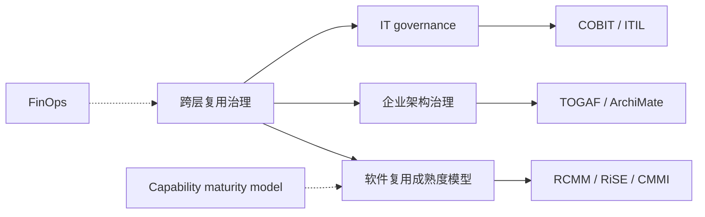
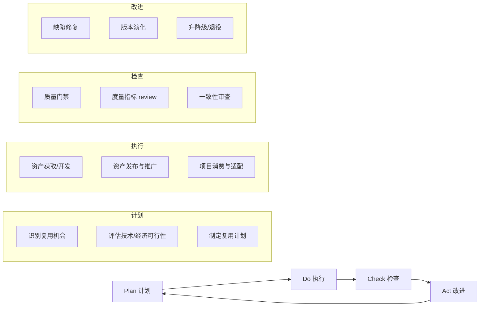

# 跨层复用治理框架

> **版本**: 2026-06-06
> **定位**: 建立业务、应用、组件、功能四层之间的复用治理机制

---

## 1. 为什么需要跨层治理

架构复用发生在多个层次，但各层的治理目标、参与者和工具不同：

| 层次 | 治理焦点 | 主要参与者 | 关键工具 |
|------|---------|-----------|---------|
| 业务层 | 业务能力目录、价值流 | 业务架构师 | ArchiMate, ARIS |
| 应用层 | 服务边界、API 契约 | 应用架构师 | OpenAPI, AsyncAPI |
| 组件层 | 依赖管理、接口契约 | 技术负责人 | SBOM, SemVer |
| 功能层 | 代码质量、函数纯度 | 开发工程师 | Lint, Test, CI/CD |

> **公理 6.1** (Governance Necessity): 没有跨层治理的复用是**不可持续的**。原因：每一层的优化可能导致其他层的次优化。

---

## 2. 跨层治理的四个维度

### 维度 1: 资产管理 (Asset Management)

建立统一的企业级资产目录：

```text
资产目录
├── 业务能力 (Business Capability)
│   └── 映射到: 应用服务、组件、流程
├── 应用服务 (Application Service)
│   └── 映射到: API、组件、部署单元
├── 组件 (Component)
│   └── 映射到: 代码仓库、SBOM、所有者
└── 功能 (Function)
    └── 映射到: 代码片段、测试、文档
```

### 维度 2: 生命周期管理 (Lifecycle Management)

| 阶段 | 入口标准 | 退出标准 |
|------|---------|---------|
| 实验 | 概念验证通过 | 未通过评估则废弃 |
| 孵化 | 至少 2 个内部用户 | 用户增长停滞则降级 |
| 生产 | 通过安全审查 + SLA 定义 | 用户迁移完成后退役 |
| 退役 | 替代方案就绪 | 无活跃依赖 |

### 维度 3: 质量管理 (Quality Management)

```text
质量门禁
├── 功能正确性: 单元测试覆盖率 ≥ 80%
├── 安全: SLSA L2+，无 HIGH/CRITICAL 漏洞
├── 可观测性: 暴露 metrics/logs/traces
├── 文档: API 文档、使用示例、ADRs
└── 兼容性: SemVer 声明 + 契约测试
```

### 维度 4: 价值度量 (Value Measurement)

```text
复用价值指标
├── 采用率: 使用该资产的团队/项目数
├── 节约时间: 相对自研的估算人时节约
├── 缺陷率: 复用资产的缺陷密度 vs 自研代码
├── 上市时间: 使用该资产的项目交付周期
└── 满意度: 复用者 NPS
```

---

## 3. 治理组织模型

### 中心辐射模型 (Hub-and-Spoke)

```
        企业架构委员会 (EAC)
              │
    ┌─────────┼─────────┐
    │         │         │
平台工程团队  业务架构师  安全架构师
    │         │         │
    └─────────┼─────────┘
              │
        各产品/项目团队
```

### 关键角色

| 角色 | 职责 |
|------|------|
| **企业架构师** | 制定跨层复用策略和标准 |
| **平台产品经理** | 将复用资产产品化，收集反馈 |
| **领域架构师** | 负责特定领域的复用资产 |
| **复用资产所有者** | 维护具体资产的版本、文档、SLA |
| **安全架构师** | 确保复用资产符合安全基线 |

---

## 4. 跨层一致性检查

```
一致性检查清单
│
├── 业务-应用对齐
│   ├── 业务能力 C 是否至少有一个应用服务实现？
│   ├── 应用服务是否完整覆盖业务能力？
│   └── 业务能力变更是否触发应用服务评估？
│
├── 应用-组件对齐
│   ├── 应用服务的 API 契约是否由组件实现？
│   ├── 组件接口是否符合应用层的标准化要求？
│   └── 组件版本变更是否影响应用服务 SLA？
│
├── 组件-功能对齐
│   ├── 组件的公共 API 是否有功能级单元测试？
│   ├── 功能级代码是否遵循组件层的编码规范？
│   └── 功能变更是否触发 SemVer 评估？
│
└── 全链追踪
    ├── 从业务价值到代码实现的可追溯性
    ├── 从代码缺陷到业务影响的快速定位
    └── 变更影响分析覆盖全层次
```

---

## 5. 治理成熟度模型

| 级别 | 特征 | 典型状态 |
|------|------|---------|
| **L1 临时** | 复用靠个人关系，无目录 | 初创团队 |
| **L2 管理** | 有资产目录，但更新不及时 | 成长型公司 |
| **L3 定义** | 有明确的复用流程和质量门禁 | 中型组织 |
| **L4 量化** | 复用价值和成本可度量 | 大型企业 |
| **L5 优化** | AI 辅助推荐复用资产，持续优化 | 领先组织 |

---

## 6. 跨层复用治理框架的精确定义

### 6.1 概念定义

**定义**：跨层复用治理（Cross-Layer Reuse Governance）是组织为确保业务层、应用层、组件层、功能层四个层次之间的复用资产在战略、流程、质量、价值与风险维度上保持一致性，而建立的角色、职责、流程、标准、度量和决策机制的总和。它与 Wikipedia 中 [IT governance](https://en.wikipedia.org/wiki/IT_governance) 的定义一致，强调"确保组织的 IT 投资支持业务目标并有效管理 IT 风险"，但进一步聚焦到**复用资产跨层次流动的全生命周期治理**。

### 6.2 跨层治理核心属性

| 属性 | 说明 | 重要性 | 可观察性 |
|------|------|--------|----------|
| **层次一致性（Layer Alignment）** | 业务、应用、组件、功能四层定义与变更保持一致 | 高 | 一致性审查通过率 |
| **职责明确性（Role Clarity）** | 每个资产有明确的所有者、维护者和治理委员会 | 高 | 资产 OWNER 覆盖率 100% |
| **流程闭环性（Process Closure）** | 从识别、获取、适配、集成到演化、退役的闭环 | 高 | 流程执行合规率 |
| **质量可控性（Quality Controllability）** | 每层均有对应质量门禁与度量指标 | 高 | 质量门禁通过率 |
| **价值可度量性（Value Measurability）** | 复用收益与成本可被量化并反馈 | 中 | 复用 ROI、TTMR |
| **风险可感知性（Risk Perceptibility）** | 供应链、安全、合规风险被识别与缓解 | 中 | 风险事件数、漏洞修复周期 |

### 6.3 与相关概念的关系



- **上位概念**：[IT governance](https://en.wikipedia.org/wiki/IT_governance)、企业架构治理；
- **下位概念**：资产管理、生命周期管理、质量管理、价值度量；
- **等价/映射概念**：ISO/IEC/IEEE 42020（架构治理）、ISO/IEC 12207（软件生命周期过程治理）；
- **依赖概念**：复用成熟度模型、FinOps 单位经济学、升降级决策矩阵、度量指标体系。

### 6.4 角色职责详细矩阵

| 角色 | 核心职责 | 关键活动 | 治理产出 |
|------|----------|----------|----------|
| **企业架构委员会（EAC）** | 制定跨层复用战略、标准与投资决策 | 季度战略 review、预算分配、标准发布 | 复用战略、治理章程、投资决策 |
| **业务架构师** | 定义业务能力目录与价值流，确保业务层复用语义一致 | 业务能力映射、价值流分析 | 业务能力目录、价值流图 |
| **应用架构师** | 设计服务边界、API 契约与应用层复用模式 | API 治理、服务拆分/合并评审 | API 规范、服务蓝图 |
| **组件架构师/平台工程师** | 维护组件库、包管理、依赖治理与 CI/CD 集成 | SemVer 策略、SBOM 管理、依赖冲突解决 | 组件库、构建流水线、依赖基线 |
| **功能架构师/高级工程师** | 定义代码规范、函数纯度、测试策略 | 代码评审、重构指导、Golden Path 维护 | 编码规范、测试基线、重构计划 |
| **复用资产所有者（Asset Owner）** | 单个资产的全生命周期管理 | 版本发布、文档维护、缺陷响应、退役计划 | 资产 ROADMAP、SLA、变更日志 |
| **安全架构师** | 确保复用资产符合安全基线 | 安全评审、漏洞响应、合规映射 | 安全基线、威胁模型、审计报告 |
| **FinOps 分析师** | 量化复用成本与收益，驱动经济决策 | 成本分摊、单位经济学分析、ROI 计算 | Showback 报告、投资优先级 |
| **质量保障工程师** | 执行复用资产的质量门禁与测试 | 自动化测试、契约测试、质量审计 | 质量报告、门禁结果 |

### 6.5 跨层治理流程（PDCA 变体）



### 6.6 正例：某银行跨层治理体系

**背景**：某大型银行拥有 200+ 个业务系统，技术栈涵盖 Java、.NET、Python、Mainframe，复用水平参差不齐。

**治理体系建设**：

1. **组织**：成立企业架构委员会（EAC）下设复用治理工作组；
2. **目录**：建立企业级业务能力目录，映射到 500+ 应用服务和 3000+ 组件；
3. **流程**：项目立项阶段强制复用可行性评估，结项阶段报告复用率；
4. **质量**：定义 Tier-1/Tier-2/Tier-3 资产分级，Tier-1 必须通过 SLSA L2+、SBOM 100%、测试覆盖率 ≥ 80%；
5. **度量**：每月发布组织复用率（ORR）、跨项目复用率（CPRR）、复用 ROI；
6. **激励**：将"贡献/采用复用资产"纳入技术职级晋升考核。

**效果**：

- 组织复用率从 18% 提升到 41%；
- 新项目平均交付周期缩短 23%；
- 高危漏洞影响面下降 60%（通过统一组件管理）。

### 6.7 反例：治理组织形同虚设

**背景**：某互联网公司成立了"复用治理委员会"，但委员会每季度仅开一次会，无决策权。

**问题**：

1. **权责不对等**：委员会只能"建议"，不能否决重复造轮子；
2. **缺乏抓手**：没有统一资产目录，无法发现重复资产；
3. **激励冲突**：团队 KPI 以交付功能为主，复用贡献不被认可；
4. **工具缺失**：没有质量门禁和度量数据，评审靠主观判断。

**后果**：

- 3 年内同一领域出现 7 个功能相似的内部框架；
- 新员工入职成本极高，需要学习多套"内部标准"；
- 复用治理委员会逐渐被边缘化，最终解散。

**避免方法**：

- 赋予治理委员会真正的预算审批和标准发布权；
- 建立统一资产目录与自动化度量平台；
- 将复用贡献纳入绩效考核与晋升；
- 从一个小领域试点，用数据证明价值后再扩展。

### 6.8 反例：跨层一致性检查流于形式

**背景**：某组织制定了详细的跨层一致性检查清单，但项目评审时仅勾选"是/否"，不验证证据。

**问题**：

1. **业务-应用脱节**：业务能力"客户风险评估"已变更，但对应 API 未同步更新；
2. **应用-组件脱节**：微服务 API 升级后，共享组件版本未更新，导致运行时错误；
3. **组件-功能脱节**：组件增加了新功能，但函数级单元测试未覆盖，缺陷流入生产。

**后果**：

- 一次业务能力定义变更引发 14 个下游系统缺陷；
- 生产事故复盘发现，一致性检查清单 80% 的项被随意勾选；
- 客户投诉增加，业务团队对复用资产失去信任。

**避免方法**：

- 将一致性检查自动化（如 ArchiMate 模型与代码仓库的 diff 检测）；
- 引入可追溯性矩阵（Requirements Traceability Matrix）；
- 对关键变更实施影响分析工具（Impact Analysis）与强制评审。

---

## 权威来源与交叉引用

> **权威来源**:
>
> | 来源 | URL | 核查日期 |
> |------|-----|----------|
> | Wikipedia — IT governance | <https://en.wikipedia.org/wiki/IT_governance> | 2026-07-07 |
> | Wikipedia — Capability Maturity Model | <https://en.wikipedia.org/wiki/Capability_Maturity_Model> | 2026-07-07 |
> | ISO/IEC/IEEE 42020:2022 — Architecture processes | <https://www.iso.org/standard/74296.html> | 2026-07-07 |
> | ISO/IEC/IEEE 12207:2017 — Software life cycle processes | <https://www.iso.org/standard/63712.html> | 2026-07-07 |
> | TOGAF Standard, 10th Edition | <https://www.opengroup.org/togaf> | 2026-07-07 |
> | COBIT 2019 Framework | <https://www.isaca.org/resources/cobit> | 2026-07-07 |
> | ITIL 4 — Service Management | <https://www.axelos.com/certifications/itil-service-management> | 2026-07-07 |

> **交叉引用**:
>
> - 跨层复用升级/降级决策矩阵：[`struct/06-cross-layer-governance/06-up-downgrade-matrix/upgrade-downgrade-matrix.md`](../06-up-downgrade-matrix/upgrade-downgrade-matrix.md)
> - FinOps 单位经济学：[`struct/06-cross-layer-governance/04-finops-cost/finops-unit-economics-2026.md`](../04-finops-cost/finops-unit-economics-2026.md)
> - 复用度量指标体系：[`struct/06-cross-layer-governance/05-metrics-kpi/metrics-framework.md`](../05-metrics-kpi/metrics-framework.md)
> - 复用成熟度模型：[`struct/06-cross-layer-governance/03-maturity-models/reuse-maturity-models-rcmm-rise.md`](../03-maturity-models/reuse-maturity-models-rcmm-rise.md)
> - 软件复用过程标准：[`struct/01-meta-model-standards/01-iso-420xx-family/iso-12207-2026-alignment.md`](../../01-meta-model-standards/01-iso-420xx-family/iso-12207-2026-alignment.md)

---

> 最后更新: 2026-06-06


---

## 补充说明：跨层复用治理框架

## 概念定义

**定义**：复用过程治理是将复用活动（识别、获取、适配、集成、演化、退役）纳入组织标准软件过程，并通过角色、活动与工件进行规范。

## 示例

**示例**：依据 ISO/IEC/IEEE 42020 与 12207，组织定义复用管理过程，明确资产Owner、消费方与治理委员会的职责与评审节点。

## 反例

**反例**：复用活动完全依赖个人自觉，没有统一入口与审批流程，导致重复资产与劣质资产并存。

## 权威来源

> **权威来源**:
>
> - [Wikipedia — IT governance](https://en.wikipedia.org/wiki/IT_governance)
> - [Wikipedia — Capability Maturity Model](https://en.wikipedia.org/wiki/Capability_Maturity_Model)
> - [ISO/IEC/IEEE 42020:2022](https://www.iso.org/standard/74296.html)
> - [ISO/IEC/IEEE 12207:2017](https://www.iso.org/standard/63712.html)
> - 核查日期：2026-07-07
