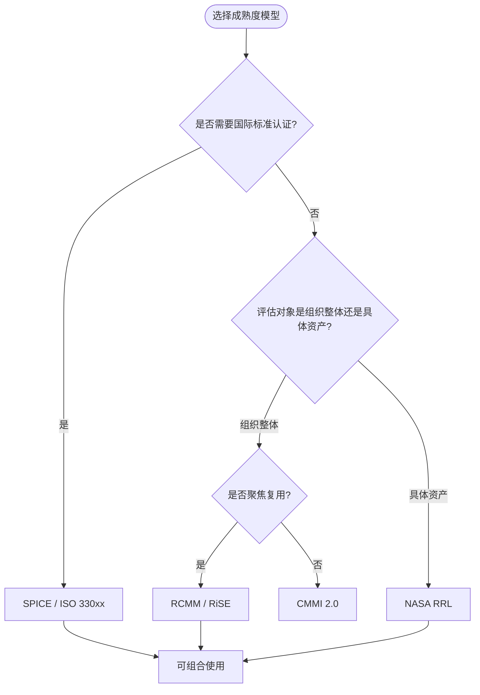
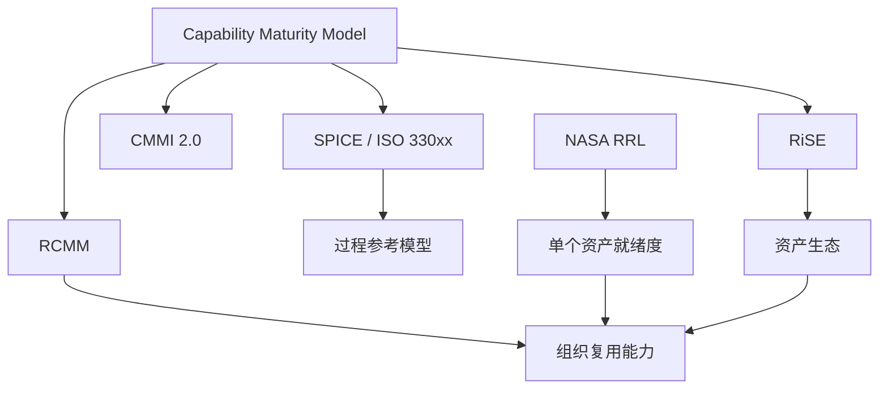

# B-03 SPICE 与复用成熟度映射

| 属性 | 内容 |
|------|------|
| **版本** | 2026-06-10 |
| **定位** | Phase B — 跨层治理 / 成熟度模型 |
| **对齐标准** | ISO/IEC 33000 系列 (SPICE)、ISO/IEC 26565:2026、RCMM、RiSE、CMMI 2.0 |
| **状态** | ✅ 已完成 |

---

## 目录

- [B-03 SPICE 与复用成熟度映射](#b-03-spice-与复用成熟度映射)
  - [目录](#目录)
  - [1. ISO/IEC 33000 系列 (SPICE) 概述](#1-isoiec-33000-系列-spice-概述)
    - [1.1 SPICE 的历史定位与标准族结构](#11-spice-的历史定位与标准族结构)
    - [1.2 过程能力六级模型（0–5 级）](#12-过程能力六级模型05-级)
      - [Level 0 — 不完整过程（Incomplete Process）](#level-0--不完整过程incomplete-process)
      - [Level 1 — 已执行过程（Performed Process）](#level-1--已执行过程performed-process)
      - [Level 2 — 已管理过程（Managed Process）](#level-2--已管理过程managed-process)
      - [Level 3 — 已建立过程（Established Process）](#level-3--已建立过程established-process)
      - [Level 4 — 可预测过程（Predictable Process）](#level-4--可预测过程predictable-process)
      - [Level 5 — 创新过程（Innovating Process）](#level-5--创新过程innovating-process)
    - [1.3 SPICE 与 CMMI 的关系](#13-spice-与-cmmi-的关系)
      - [1.3.1 设计哲学差异](#131-设计哲学差异)
      - [1.3.2 等级映射关系](#132-等级映射关系)
      - [1.3.3 在复用评估中的互补使用](#133-在复用评估中的互补使用)
  - [2. ISO/IEC 33004 过程评估要求](#2-isoiec-33004-过程评估要求)
    - [2.1 标准定位与核心要求](#21-标准定位与核心要求)
    - [2.2 参考模型的结构要求](#22-参考模型的结构要求)
      - [2.2.1 过程描述（Process Description）](#221-过程描述process-description)
      - [2.2.2 能力等级与过程属性](#222-能力等级与过程属性)
      - [2.2.3 评定标度（Rating Scale）](#223-评定标度rating-scale)
    - [2.3 复用过程参考模型的构建](#23-复用过程参考模型的构建)
      - [过程：REU.1 — 复用策略管理（Reuse Strategy Management）](#过程reu1--复用策略管理reuse-strategy-management)
      - [过程：REU.2 — 复用资产获取（Reuse Asset Acquisition）](#过程reu2--复用资产获取reuse-asset-acquisition)
      - [过程：REU.3 — 复用资产工程（Reuse Asset Engineering）](#过程reu3--复用资产工程reuse-asset-engineering)
      - [过程：REU.4 — 复用资产消费（Reuse Asset Consumption）](#过程reu4--复用资产消费reuse-asset-consumption)
      - [过程：REU.5 — 复用资产管理（Reuse Asset Governance）](#过程reu5--复用资产管理reuse-asset-governance)
  - [3. SPICE 过程维度与复用过程的映射](#3-spice-过程维度与复用过程的映射)
    - [3.1 ISO/IEC/IEEE 12207:2026 过程维度概述](#31-isoiecieee-122072026-过程维度概述)
    - [3.2 ACQ — 获取过程（Acquisition）](#32-acq--获取过程acquisition)
      - [3.2.1 ACQ.4 — 供应商监控（Supplier Monitoring）](#321-acq4--供应商监控supplier-monitoring)
      - [3.2.2 ACQ.5 — 技术验收（Technical Acceptance）](#322-acq5--技术验收technical-acceptance)
    - [3.3 SUP — 支持过程（Support）](#33-sup--支持过程support)
      - [3.3.1 SUP.1 — 质量保证（Quality Assurance）](#331-sup1--质量保证quality-assurance)
      - [3.3.2 SUP.4 — 联合评审（Joint Review）](#332-sup4--联合评审joint-review)
      - [3.3.3 SUP.8 — 配置管理（Configuration Management）](#333-sup8--配置管理configuration-management)
      - [3.3.4 SUP.9 — 问题解决（Problem Resolution）](#334-sup9--问题解决problem-resolution)
      - [3.3.5 SUP.10 — 变更请求管理（Change Request Management）](#335-sup10--变更请求管理change-request-management)
    - [3.4 ENG — 工程过程（Engineering）](#34-eng--工程过程engineering)
      - [3.4.1 ENG.1 — 需求引出（Requirements Elicitation）](#341-eng1--需求引出requirements-elicitation)
      - [3.4.2 ENG.4 — 系统设计（System Design）](#342-eng4--系统设计system-design)
      - [3.4.3 ENG.5 — 软件详细设计（Software Detailed Design）](#343-eng5--软件详细设计software-detailed-design)
      - [3.4.4 ENG.6 — 软件构建（Software Construction）](#344-eng6--软件构建software-construction)
      - [3.4.5 ENG.7 — 软件集成（Software Integration）](#345-eng7--软件集成software-integration)
      - [3.4.6 ENG.8 — 软件测试（Software Testing）](#346-eng8--软件测试software-testing)
    - [3.5 MAN — 管理过程（Management）](#35-man--管理过程management)
      - [3.5.1 MAN.3 — 项目管理（Project Management）](#351-man3--项目管理project-management)
      - [3.5.2 MAN.5 — 风险管理（Risk Management）](#352-man5--风险管理risk-management)
      - [3.5.3 MAN.6 — 度量（Measurement）](#353-man6--度量measurement)
  - [4. SPICE 能力维度 × RCMM/RiSE 五级复用成熟度的交叉矩阵](#4-spice-能力维度--rcmmrise-五级复用成熟度的交叉矩阵)
    - [4.1 RCMM 与 RiSE 复用成熟度模型概述](#41-rcmm-与-rise-复用成熟度模型概述)
    - [4.2 交叉映射矩阵](#42-交叉映射矩阵)
      - [矩阵 1：ACQ — 获取过程](#矩阵-1acq--获取过程)
      - [矩阵 2：SUP — 支持过程](#矩阵-2sup--支持过程)
      - [矩阵 3：ENG — 工程过程](#矩阵-3eng--工程过程)
      - [矩阵 4：MAN — 管理过程](#矩阵-4man--管理过程)
    - [4.3 综合交叉矩阵可视化](#43-综合交叉矩阵可视化)
  - [5. 如何将 SPICE 评估结果转化为复用成熟度改进路径](#5-如何将-spice-评估结果转化为复用成熟度改进路径)
    - [5.1 评估数据收集与基线建立](#51-评估数据收集与基线建立)
      - [5.1.1 评估范围定义](#511-评估范围定义)
      - [5.1.2 数据采集方法](#512-数据采集方法)
    - [5.2 过程能力轮廓分析](#52-过程能力轮廓分析)
      - [5.2.1 识别瓶颈过程](#521-识别瓶颈过程)
      - [5.2.2 过程属性级别的根因分析](#522-过程属性级别的根因分析)
    - [5.3 改进路径设计](#53-改进路径设计)
      - [5.3.1 渐进式改进策略](#531-渐进式改进策略)
      - [5.3.2 改进优先级矩阵](#532-改进优先级矩阵)
    - [5.4 改进效果验证与闭环](#54-改进效果验证与闭环)
      - [5.4.1 再评估周期](#541-再评估周期)
      - [5.4.2 业务价值验证](#542-业务价值验证)
  - [6. 与 ISO/IEC 26565:2026 产品线成熟度框架的协同](#6-与-isoiec-265652026-产品线成熟度框架的协同)
    - [6.1 ISO/IEC 26565:2026 概述](#61-isoiec-265652026-概述)
    - [6.2 SPICE × 26565 的协同框架](#62-spice--26565-的协同框架)
    - [6.3 协同评估实施流程](#63-协同评估实施流程)
      - [步骤 1：SPICE 基线评估](#步骤-1spice-基线评估)
      - [步骤 2：26565 专项评估](#步骤-226565-专项评估)
      - [步骤 3：差距分析与映射](#步骤-3差距分析与映射)
      - [步骤 4：协同改进计划](#步骤-4协同改进计划)
    - [6.4 协同治理架构](#64-协同治理架构)
    - [6.5 标准演进协同展望](#65-标准演进协同展望)
  - [补充：SPICE、RCMM、RiSE、NASA RRL 对比实例与失败案例](#补充spicercmmrisenasa-rrl-对比实例与失败案例)
    - [6.6 四类成熟度模型对比实例](#66-四类成熟度模型对比实例)
    - [失败案例](#失败案例)
      - [某汽车供应商的 SPICE 评估形式主义](#某汽车供应商的-spice-评估形式主义)
      - [NASA RRL 评级虚高导致任务失败](#nasa-rrl-评级虚高导致任务失败)
    - [6.9 成熟度模型选择决策树](#69-成熟度模型选择决策树)
    - [6.10 与相关概念的关系](#610-与相关概念的关系)
    - [6.11 四类成熟度模型核心属性对比](#611-四类成熟度模型核心属性对比)
    - [6.12 正例：NASA RRL 成功支持 Landsat 数据产品复用](#612-正例nasa-rrl-成功支持-landsat-数据产品复用)
    - [6.13 反例：RCMM 评估被 KPI 化导致"复用泡沫"](#613-反例rcmm-评估被-kpi-化导致复用泡沫)
    - [6.14 成熟度模型映射关系图](#614-成熟度模型映射关系图)
    - [6.15 补充权威来源](#615-补充权威来源)
  - [权威来源](#权威来源)

---

## 1. ISO/IEC 33000 系列 (SPICE) 概述

### 1.1 SPICE 的历史定位与标准族结构

ISO/IEC 33000 系列标准，全称为 "Information technology — Process assessment"（信息技术 — 过程评估），在商业领域通常以 **SPICE**（Software Process Improvement and Capability Determination，软件过程改进与能力测定）的代号广为人知。该系列标准源于 1993 年启动的 SPICE 项目，旨在为软件过程评估提供一套国际化、 Vendor-neutral 的方法论，以克服当时 CMMI 与 BOOTSTRAP 等框架互不兼容的碎片化局面。

SPICE 标准族采用模块化架构，核心标准包括：

| 标准编号 | 标准名称 | 功能定位 |
|----------|----------|----------|
| ISO/IEC 33001:2014 | 概念与术语 | 定义评估领域的基础词汇与参考模型架构 |
| ISO/IEC 33002:2020 | 执行评估的要求 | 规定评估组织、评估人员资质与评估方法的要求 |
| ISO/IEC 33003:2019 | 评估过程定义 | 如何定义并验证组织级评估过程 |
| ISO/IEC 33004:2022 | 评估参考模型要求 | 定义可接受的参考模型（如 ISO/IEC 12207、15288）的构造规则 |
| ISO/IEC 33020:2019 | 过程能力评估的过程测量框架 | 定义能力等级、过程属性及评定标度 |

SPICE 的架构设计遵循 **双维度评估模型**：

- **过程维度（Process Dimension）**：描述 "做什么"，即组织的业务过程域集合；
- **能力维度（Capability Dimension）**：描述 "做得有多好"，即每个过程的能力等级。

这种双维度设计使 SPICE 天然具备与不同领域标准（系统工程、服务管理、人力资源等）集成的能力，也为与软件复用成熟度模型（RCMM、RiSE）的映射提供了结构性基础。

### 1.2 过程能力六级模型（0–5 级）

ISO/IEC 33020:2019 定义了六个能力等级，从 Level 0（不完整）到 Level 5（创新），构成了 SPICE 能力评估的核心标尺：

#### Level 0 — 不完整过程（Incomplete Process）

**定义**：过程未实施，或未能实现其过程目的。在该等级下，过程的工作产品可能部分存在，但过程本身缺乏系统性，无法保证产出的一致性。

**典型特征**：

- 复用活动以 ad-hoc 方式出现，缺乏正式的复用策略；
- 组件库不存在或由个别工程师私下维护；
- 复用行为不可重复，依赖于个人英雄主义；
- 缺乏对复用资产的质量控制。

#### Level 1 — 已执行过程（Performed Process）

**定义**：过程实现了其过程目的，通过产出工作产品达成预期的过程结果。

**过程属性**：

- **PA 1.1 过程实施（Process Performance）**：过程通过产出工作产品，实现了其过程目的。

**典型特征**：

- 组织已识别复用需求并开始收集可复用组件；
- 存在初步的组件存储机制（如共享文件夹、内部 Wiki）；
- 复用案例有记录，但尚未标准化；
- 缺乏对复用效果的系统度量。

#### Level 2 — 已管理过程（Managed Process）

**定义**：过程按照已定义的策略和计划进行实施与监控，其工作产品经过适当的配置管理。

**过程属性**：

- **PA 2.1 实施策略（Performance Management）**：过程依据已定义的策略和计划实施；
- **PA 2.2 工作产品管理（Work Product Management）**：过程的工作产品得到适当的管理和控制。

**典型特征**：

- 制定并发布了正式的复用策略与年度计划；
- 组件库纳入配置管理，具备版本控制机制；
- 复用活动被纳入项目计划与资源分配；
- 开始对复用率（Reuse Rate）进行基础度量。

#### Level 3 — 已建立过程（Established Process）

**定义**：过程使用已定义的过程进行实施，并基于组织标准过程进行裁剪，以适应特定上下文。

**过程属性**：

- **PA 3.1 过程定义（Process Definition）**：过程基于标准过程进行定义与维护；
- **PA 3.2 过程部署（Process Deployment）**：标准过程在组织范围内被部署并可供使用。

**典型特征**：

- 建立组织级复用过程资产库（OPF — Organizational Process Focus）；
- 定义标准化的组件接口规范、文档模板与质量门禁；
- 复用平台（如内部 Maven/NPM 仓库、服务注册中心）成为基础设施；
- 跨项目复用成为常态，组件贡献与消费有明确流程。

#### Level 4 — 可预测过程（Predictable Process）

**定义**：过程在定义的限值内执行以实现其过程结果，并通过统计与其他量化技术进行控制。

**过程属性**：

- **PA 4.1 过程度量（Process Measurement）**：过程使用度量数据进行管理；
- **PA 4.2 过程控制（Process Control）**：过程通过统计与其他量化技术进行控制。

**典型特征**：

- 建立复用资产的量化质量模型（如缺陷密度、复用收益指数）；
- 使用 SPC（统计过程控制）监控组件库的健康度；
- 复用投资回报率（ROI）可进行预测性分析；
- 基于历史数据建立复用风险评估模型。

#### Level 5 — 创新过程（Innovating Process）

**定义**：过程通过渐进性与创新性改进持续适应组织目标。

**过程属性**：

- **PA 5.1 过程创新（Process Innovation）**：过程创新被识别并实施；
- **PA 5.2 持续优化（Continuous Optimization）**：过程的改进是持续且主动的。

**典型特征**：

- 引入 AI/ML 驱动的组件推荐与自动适配技术；
- 复用平台具备自进化能力，可基于使用模式自动优化分类体系；
- 组织积极参与开源社区，将外部复用生态纳入战略；
- 复用成熟度评估本身成为持续改进的闭环。

### 1.3 SPICE 与 CMMI 的关系

SPICE 与 CMMI（Capability Maturity Model Integration）是软件过程评估领域最具影响力的两个框架。理解两者的关系，对于在组织中推行复用成熟度评估至关重要。

#### 1.3.1 设计哲学差异

| 维度 | SPICE (ISO/IEC 330xx) | CMMI 2.0 |
|------|----------------------|----------|
| **标准性质** | ISO/IEC 国际标准，强调开放性与可扩展性 | 由 CMMI Institute 维护的模型框架，强调最佳实践集合 |
| **评估模型** | 双维度（过程维度 + 能力维度），可灵活映射不同过程参考模型 | 单维度（能力等级覆盖过程域），过程域固定 |
| **等级结构** | 6 级（0–5），Level 0 为显性定义 | 5 级（1–5），隐性假设 Level 0 为未实施 |
| **评估输出** | 过程能力轮廓（Process Capability Profile），支持二维雷达图 | 成熟度等级（Maturity Level）或能力等级（Capability Level） |
| **行业适用性** | 通过 ISO/IEC 12207（软件）、15288（系统）、20000（服务）等扩展 | 主要针对软件开发与系统交付，后扩展至服务、采购、安全 |

#### 1.3.2 等级映射关系

SPICE 与 CMMI 的等级并非一一对应，但存在大致的语义对应关系：

| SPICE 等级 | CMMI 成熟度等级 | 语义对应 |
|-----------|----------------|----------|
| Level 0 — 不完整 | Level 1 以下（未评级） | 过程未实施或碎片化 |
| Level 1 — 已执行 | — | SPICE 特有，CMMI 无直接对应 |
| Level 2 — 已管理 | 成熟度等级 2（已管理） | 项目级过程管理 |
| Level 3 — 已建立 | 成熟度等级 3（已定义） | 组织级标准化过程 |
| Level 4 — 可预测 | 成熟度等级 4（量化管理） | 量化过程管理 |
| Level 5 — 创新 | 成熟度等级 5（优化） | 持续过程优化 |

值得注意的是，CMMI 2.0 引入了 **视图（Views）** 概念，允许组织选择特定实践域（Practice Areas）组合进行评估，这与 SPICE 的过程维度灵活性有异曲同工之妙。在复用成熟度评估实践中，建议采用 SPICE 作为基础评估框架，因其国际标准地位更利于跨国组织的合规要求，同时可借助 CMMI 的实践域作为补充参考。

#### 1.3.3 在复用评估中的互补使用

在软件复用领域，组织可以这样结合使用 SPICE 与 CMMI：

1. **以 SPICE 为评估骨架**：利用其双维度模型，将复用过程（如组件获取、适配、演化）映射为过程维度中的特定过程，再使用能力维度评定其成熟度；
2. **以 CMMI 为实践补充**：参考 CMMI 的 DAR（Decision Analysis and Resolution）、CAR（Causal Analysis and Resolution）等实践域，丰富复用决策与改进的具体活动；
3. **结果互认**：通过 ISO/IEC 33003:2019 定义评估过程，确保评估结果满足 CMMI 评估的等效性要求。

---

## 2. ISO/IEC 33004 过程评估要求

### 2.1 标准定位与核心要求

ISO/IEC 33004:2022《信息技术 — 过程评估 — 评估参考模型的要求》是 SPICE 标准族中定义 "参考模型合规性" 的关键标准。它规定了任何欲用于 SPICE 评估的参考模型必须满足的构造规则，确保不同领域（软件、系统、服务、人力资源等）的过程参考模型具有统一的结构，从而保证评估结果的可比性与可重复性。

### 2.2 参考模型的结构要求

ISO/IEC 33004:2022 要求评估参考模型必须包含以下核心要素：

#### 2.2.1 过程描述（Process Description）

每个过程必须包含：

- **过程名称（Process Name）**：唯一标识该过程；
- **过程目的（Process Purpose）**：说明该过程存在的高层次业务价值；
- **过程结果（Process Outcomes）**：可观察、可验证的过程产出，通常 3–7 条；
- **基础实践（Base Practices）**：为达成过程结果必须执行的活动，通常对应到能力等级 1；
- **工作产品（Work Products）**：过程执行中产出或使用的信息项。

#### 2.2.2 能力等级与过程属性

参考模型必须采用 ISO/IEC 33020:2019 定义的六级能力框架，每个过程属性（Process Attribute）必须包含：

- 过程属性名称与 ID；
- 过程属性的目的说明；
- 与通用实践（Generic Practices）的映射关系。

#### 2.2.3 评定标度（Rating Scale）

ISO/IEC 33004:2022 要求评估使用四级评定标度：

| 评定值 | 名称 | 定义 |
|--------|------|------|
| N | 未达成（Not Achieved） | 过程属性达成比例 0%–15% |
| P | 部分达成（Partially Achieved） | 过程属性达成比例 16%–50% |
| L | 大部分达成（Largely Achieved） | 过程属性达成比例 51%–85% |
| F | 完全达成（Fully Achieved） | 过程属性达成比例 86%–100% |

评估结果以 **过程能力轮廓**（Process Capability Profile）呈现，即每个过程在每个能力等级上的评定矩阵。

### 2.3 复用过程参考模型的构建

要将复用过程纳入 SPICE 评估体系，必须构建符合 ISO/IEC 33004:2022 要求的 **复用过程参考模型**。以下是核心复用过程在 SPICE 框架下的规范描述：

#### 过程：REU.1 — 复用策略管理（Reuse Strategy Management）

- **过程目的**：建立并维护组织级软件复用策略，确保复用活动与业务目标一致。
- **过程结果**：
  1. 组织复用愿景与战略被定义并发布；
  2. 复用投资与收益模型被建立；
  3. 复用治理结构被指定；
  4. 复用策略定期评审并更新。
- **基础实践**：
  - REU.1.BP1：识别业务驱动力对复用的需求；
  - REU.1.BP2：定义复用范围（内部/外部/开源/商业）；
  - REU.1.BP3：建立复用经济模型（成本/收益/风险）；
  - REU.1.BP4：指定复用治理角色与职责；
  - REU.1.BP5：将复用策略纳入组织战略规划。

#### 过程：REU.2 — 复用资产获取（Reuse Asset Acquisition）

- **过程目的**：系统化地获取、评估并引入可复用资产。
- **过程结果**：
  1. 资产需求被识别并规范；
  2. 候选资产被评估并选择；
  3. 资产许可与知识产权风险被管理；
  4. 资产被引入组织复用生态。

#### 过程：REU.3 — 复用资产工程（Reuse Asset Engineering）

- **过程目的**：设计、开发并维护高质量的可复用资产。
- **过程结果**：
  1. 资产设计遵循可复用性原则；
  2. 资产文档与元数据完整；
  3. 资产经过验证并符合质量标准；
  4. 资产版本与演化被管理。

#### 过程：REU.4 — 复用资产消费（Reuse Asset Consumption）

- **过程目的**：在项目中有效消费已发布的复用资产。
- **过程结果**：
  1. 项目复用需求被识别；
  2. 合适资产被检索并选择；
  3. 资产被适配并集成到目标系统；
  4. 复用效果被度量并反馈。

#### 过程：REU.5 — 复用资产管理（Reuse Asset Governance）

- **过程目的**：全生命周期管理复用资产组合，确保资产价值持续。
- **过程结果**：
  1. 资产组合目录被建立并维护；
  2. 资产质量与健康度被监控；
  3. 资产退役与替换策略被执行；
  4. 资产使用数据被分析以驱动改进。

---

## 3. SPICE 过程维度与复用过程的映射

### 3.1 ISO/IEC/IEEE 12207:2026 过程维度概述

SPICE 默认的软件过程参考模型为 ISO/IEC/IEEE 12207:2026《系统和软件工程 — 软件生命周期过程》（现行版，2026-04-29 发布，取代 2017 版）。该标准将软件生命周期过程分为四大类（与 2017 版保持一致，2026 版在敏捷、MBSSE 和风险/配置管理方面进行了扩展）：

- **协议过程组（Agreement Processes）**：ACQ（获取）、SUP（供应）
- **组织项目使能过程组（Organizational Project-Enabling Processes）**：MAN（管理）、PM（项目管理）、QA（质量保证）等
- **技术管理过程组（Technical Management Processes）**：TL（技术管理）、CO（配置）、RE（需求）等
- **技术过程组（Technical Processes）**：DES（设计）、IMP（实现）、INT（集成）、VER（验证）、VAL（确认）等

以下将复用过程映射到 SPICE 的四大核心过程域：ACQ（获取）、SUP（支持）、ENG（工程）、MAN（管理）。

### 3.2 ACQ — 获取过程（Acquisition）

#### 3.2.1 ACQ.4 — 供应商监控（Supplier Monitoring）

**复用映射**：外部组件/服务供应商的持续监控与评估。

在复用场景中，组织往往需要从外部获取可复用资产，包括：

- 商业 off-the-shelf (COTS) 组件；
- 开源软件（OSS）库与框架；
- 第三方 API 与服务（SaaS、PaaS）。

ACQ.4 要求建立供应商监控机制，对应到复用领域即：

- 建立组件供应商的准入评估标准（安全漏洞历史、社区活跃度、许可证兼容性）；
- 定期监控供应商的发布节奏、安全补丁响应时间；
- 对高风险外部组件建立备用方案（Vendor Lock-in 风险缓解）。

**SPICE 能力等级提升路径**：

- Level 1：有记录的外部组件使用清单；
- Level 2：建立供应商监控计划，纳入项目风险管理；
- Level 3：组织级供应商评估标准与工具链集成（如 SCA — Software Composition Analysis）；
- Level 4：基于量化数据预测供应商风险（如使用 CVSS 评分趋势分析）；
- Level 5：自动化供应商监控与智能替换推荐。

#### 3.2.2 ACQ.5 — 技术验收（Technical Acceptance）

**复用映射**：复用资产引入组织前的技术验收。

复用资产的验收不仅包括功能验证，还包括：

- 可复用性评估（接口稳定性、文档完整性、定制灵活性）；
- 许可证合规审查（开源许可证传染性分析）；
- 安全扫描（依赖漏洞、恶意代码检测）；
- 性能基准测试。

### 3.3 SUP — 支持过程（Support）

#### 3.3.1 SUP.1 — 质量保证（Quality Assurance）

**复用映射**：复用资产的质量保证体系。

复用资产的质量保证具有特殊性：

- **质量责任边界模糊**：组件生产者与消费者的质量责任如何划分？
- **质量属性差异**：可复用组件的质量模型与终端系统不同（如可定制性、可移植性成为核心质量属性）；
- **多场景验证**：同一组件在不同上下文中的质量表现可能差异巨大。

SPICE SUP.1 要求建立 QA 策略与计划，在复用场景中应扩展为：

- 定义复用资产专用的质量模型（基于 ISO/IEC 25010:2023 的 Reusability、Modularity 等特性）；
- 建立资产发布前的质量门禁（Code Review + 自动化测试 + 文档完整性检查）；
- 建立消费者反馈驱动的质量改进闭环。

#### 3.3.2 SUP.4 — 联合评审（Joint Review）

**复用映射**：复用资产的同行评审与社区评审。

对于可复用资产，评审应覆盖：

- **设计评审**：接口设计是否遵循组织标准？是否满足开闭原则？
- **代码评审**：是否包含硬编码？是否有足够的扩展点？
- **文档评审**：API 文档、使用示例、迁移指南是否完整？
- **元数据评审**：标签、分类、依赖声明是否准确？

#### 3.3.3 SUP.8 — 配置管理（Configuration Management）

**复用映射**：复用资产的版本控制与基线管理。

复用资产的配置管理挑战在于：

- **多版本共存**：同一组件的不同版本可能被多个项目同时使用；
- **依赖冲突**：传递依赖（Transitive Dependencies）的冲突解析；
- **变体管理**：同一资产的不同变体（Variant）如何区分与追溯。

SPICE SUP.8 要求建立配置管理策略，复用场景下应：

- 使用语义化版本控制（SemVer）并严格执行；
- 建立组织级依赖管理策略（如单一版本策略 vs. 多版本容忍策略）；
- 将组件库纳入配置管理范围，而不仅是源代码。

#### 3.3.4 SUP.9 — 问题解决（Problem Resolution）

**复用映射**：复用资产的缺陷管理与技术支持。

当复用资产被发现缺陷时：

- 缺陷报告应包含复用上下文（使用版本、定制方式、目标系统）；
- 建立资产维护者的响应 SLA；
- 对关键资产建立补丁分发机制；
- 追踪缺陷修复在消费者端的部署状态。

#### 3.3.5 SUP.10 — 变更请求管理（Change Request Management）

**复用映射**：复用资产的演化控制与兼容性管理。

复用资产的变更影响面远大于项目专属代码：

- 任何 API 变更都可能影响多个消费者；
- 需要严格的兼容性影响分析（Breaking Change Detection）；
- 建立废弃（Deprecation）策略与迁移窗口；
- 使用自动化工具检测 API 兼容性（如 japicmp、API Guardian）。

### 3.4 ENG — 工程过程（Engineering）

#### 3.4.1 ENG.1 — 需求引出（Requirements Elicitation）

**复用映射**：复用资产的需求识别与需求工程。

复用资产的需求工程具有双重维度：

- **作为产品**：资产本身的功能需求、质量需求（如可复用性需求）；
- **作为上下文**：目标系统的复用需求（哪些功能适合复用？复用深度如何？）。

SPICE ENG.1 要求系统化地引出利益相关方需求，在复用场景中：

- 识别潜在复用者的 personas 与使用场景；
- 引出非功能性复用需求（性能约束、技术栈约束、许可证约束）；
- 建立需求可追溯性（从系统需求到复用资产需求）。

#### 3.4.2 ENG.4 — 系统设计（System Design）

**复用映射**：支持复用的系统架构设计。

ENG.4 关注系统级设计决策，复用视角下关键决策包括：

- **复用架构模式选择**：微服务复用 vs. 库复用 vs. 框架复用；
- **接口契约设计**：API 规范（OpenAPI、gRPC、GraphQL）、事件模式；
- **可变性管理**：如何在设计中预留 variability points 以支持多场景复用；
- **技术债务控制**：复用引入的耦合度与依赖风险。

#### 3.4.3 ENG.5 — 软件详细设计（Software Detailed Design）

**复用映射**：组件级可复用设计。

详细设计阶段应落实可复用性设计原则：

- **单一职责原则（SRP）**：组件边界清晰，功能内聚；
- **开闭原则（OCP）**：对扩展开放，对修改关闭；
- **依赖倒置原则（DIP）**：依赖抽象而非具体实现；
- **接口隔离原则（ISP）**：提供最小必要接口；
- **组合优于继承**：降低使用方的耦合成本。

#### 3.4.4 ENG.6 — 软件构建（Software Construction）

**复用映射**：可复用资产的实现与打包。

构建阶段影响复用效果的关键因素：

- **构建产物标准化**：JAR/Wheel/npm package/Docker Image 的规范打包；
- **元数据完整性**：MANIFEST、package.json、pom.xml 的准确填写；
- **可移植性**：消除环境依赖（如路径硬编码、平台特定代码）；
- **文档内嵌**：README、CHANGELOG、LICENSE 的完整包含。

#### 3.4.5 ENG.7 — 软件集成（Software Integration）

**复用映射**：复用资产的集成与适配。

集成复用资产时的特殊考虑：

- **集成顺序**：依赖拓扑的自动解析；
- **冲突解决**：同名类/函数/配置项的冲突处理；
- **适配层设计**：当资产接口与目标系统不匹配时，引入 Adapter/Facade；
- **集成测试**：验证资产在目标环境中的正确行为。

#### 3.4.6 ENG.8 — 软件测试（Software Testing）

**复用映射**：复用资产的验证与确认。

复用资产的测试策略：

- **资产生产者侧**：单元测试、集成测试、兼容性矩阵测试；
- **资产消费者侧**：基于使用的集成测试、回归测试；
- **契约测试**：使用 PACT、Spring Cloud Contract 验证接口兼容性；
- **变异测试**：评估测试套件对资产演化的保护能力。

### 3.5 MAN — 管理过程（Management）

#### 3.5.1 MAN.3 — 项目管理（Project Management）

**复用映射**：复用活动纳入项目管理。

项目计划中必须显式包含复用相关活动：

- **复用机会识别**：项目启动阶段识别可复用资产；
- **复用成本估算**：复用并非零成本，需估算检索、评估、适配、集成成本；
- **复用风险规划**：资产不可用、版本冲突、供应商弃用的风险缓解；
- **复用度量**：追踪实际复用率与计划复用率的偏差。

#### 3.5.2 MAN.5 — 风险管理（Risk Management）

**复用映射**：复用特有的风险识别与缓解。

复用引入的独特风险：

- **供应链安全风险**：恶意包、依赖混淆攻击（Dependency Confusion）；
- **知识产权风险**：许可证不兼容导致的法律风险；
- **技术锁定风险**：深度依赖特定框架导致的迁移困难；
- **组织风险**：关键资产维护者离职或团队解散。

#### 3.5.3 MAN.6 — 度量（Measurement）

**复用映射**：复用度量体系的设计与实施。

SPICE MAN.6 要求建立并维护测量能力，复用领域的关键度量包括：

- **复用率（Reuse Rate）**：新系统中复用代码占总代码的比例；
- **复用资产库规模**：资产数量、覆盖领域、活跃度；
- **复用收益指数（Reuse Benefit Index）**：节省人时/成本与复用投资的比值；
- **资产健康度评分**：基于质量、文档、社区、安全维度的综合评分。

---

## 4. SPICE 能力维度 × RCMM/RiSE 五级复用成熟度的交叉矩阵

### 4.1 RCMM 与 RiSE 复用成熟度模型概述

**RCMM**（Reuse Capability Maturity Model）是复用能力成熟度模型的早期代表，将组织复用能力分为五个等级：

| 等级 | 名称 | 核心特征 |
|------|------|----------|
| 1 | 初始级（Initial） | 个别复用，无正式流程 |
| 2 | 可重复级（Repeatable） | 项目内复用，有基本管理 |
| 3 | 已定义级（Defined） | 跨项目复用，组织级标准 |
| 4 | 已管理级（Managed） | 量化复用管理，可预测 |
| 5 | 优化级（Optimizing） | 持续改进，技术创新 |

**RiSE**（Reuse in Software Engineering）是欧洲 IST 项目提出的复用成熟度框架，强调：

- **业务驱动**：复用必须与业务战略对齐；
- **资产生态**：不仅关注内部资产，还包括外部开源、商业资产；
- **过程集成**：复用过程必须与软件工程全过程集成。

### 4.2 交叉映射矩阵

以下矩阵展示 SPICE 过程能力等级（0–5）与 RCMM/RiSE 五级复用成熟度在每个 SPICE 过程维度上的交叉映射：

#### 矩阵 1：ACQ — 获取过程

| SPICE 能力 | RCMM/RiSE 等级 | 复用获取能力描述 |
|-----------|---------------|-----------------|
| Level 0 | — | 无外部资产获取管理，任意使用 |
| Level 1 | 初始级 (1) | 记录外部组件使用，但无评估流程 |
| Level 2 | 可重复级 (2) | 项目级外部资产评估与审批流程 |
| Level 3 | 已定义级 (3) | 组织级资产获取标准，SCA 工具集成 |
| Level 4 | 已管理级 (4) | 量化供应商风险评估，许可证合规自动化 |
| Level 5 | 优化级 (5) | 智能资产推荐，供应链安全态势感知 |

#### 矩阵 2：SUP — 支持过程

| SPICE 能力 | RCMM/RiSE 等级 | 复用支持能力描述 |
|-----------|---------------|-----------------|
| Level 0 | — | 无复用资产质量保证 |
| Level 1 | 初始级 (1) | 个别资产有基本文档 |
| Level 2 | 可重复级 (2) | 项目级资产质量检查清单 |
| Level 3 | 已定义级 (3) | 组织级资产发布流程与质量门禁 |
| Level 4 | 已管理级 (4) | 资产质量量化评分，缺陷趋势分析 |
| Level 5 | 优化级 (5) | 资产质量预测模型，自动质量提升建议 |

#### 矩阵 3：ENG — 工程过程

| SPICE 能力 | RCMM/RiSE 等级 | 复用工程能力描述 |
|-----------|---------------|-----------------|
| Level 0 | — | 无可复用设计意识 |
| Level 1 | 初始级 (1) | 偶然出现可复用代码片段 |
| Level 2 | 可重复级 (2) | 项目内组件设计遵循基本设计原则 |
| Level 3 | 已定义级 (3) | 组织级可复用设计规范与模式库 |
| Level 4 | 已管理级 (4) | 设计可复用性量化评估（耦合度、内聚度） |
| Level 5 | 优化级 (5) | AI 辅助可复用设计，自动生成可复用组件 |

#### 矩阵 4：MAN — 管理过程

| SPICE 能力 | RCMM/RiSE 等级 | 复用管理能力描述 |
|-----------|---------------|-----------------|
| Level 0 | — | 无复用管理 |
| Level 1 | 初始级 (1) | 个别人物推动复用 |
| Level 2 | 可重复级 (2) | 项目级复用目标与跟踪 |
| Level 3 | 已定义级 (3) | 组织级复用治理结构与 KPI |
| Level 4 | 已管理级 (4) | 复用 ROI 量化，投资组合管理 |
| Level 5 | 优化级 (5) | 复用战略动态调整，生态级资产管理 |

### 4.3 综合交叉矩阵可视化

```
                    RCMM/RiSE 复用成熟度等级
                 1        2        3        4        5
              ┌────────┬────────┬────────┬────────┬────────┐
         L5   │        │        │        │   ◆    │   ★    │  创新
              ├────────┼────────┼────────┼────────┼────────┤
         L4   │        │        │   ◆    │   ★    │   ◆    │  可预测
SPICE         ├────────┼────────┼────────┼────────┼────────┤
能力     L3   │        │   ◆    │   ★    │   ◆    │        │  已建立
等级          ├────────┼────────┼────────┼────────┼────────┤
         L2   │   ◆    │   ★    │   ◆    │        │        │  已管理
              ├────────┼────────┼────────┼────────┼────────┤
         L1   │   ★    │   ◆    │        │        │        │  已执行
              ├────────┼────────┼────────┼────────┼────────┤
         L0   │   ░    │        │        │        │        │  不完整
              └────────┴────────┴────────┴────────┴────────┘

图例：★ 主要映射区（典型对应关系）
      ◆ 扩展映射区（高成熟度组织可能达到）
      ░ 基线区（未进入正式成熟度评估）
```

---

## 5. 如何将 SPICE 评估结果转化为复用成熟度改进路径

### 5.1 评估数据收集与基线建立

#### 5.1.1 评估范围定义

将 SPICE 评估聚焦于复用相关过程时，建议定义以下评估范围：

1. **必选过程**（所有复用成熟度评估必须覆盖）：
   - REU.1 复用策略管理（自定义过程，基于 MAN.3）
   - REU.2 复用资产获取（基于 ACQ.4 + ACQ.5）
   - REU.3 复用资产工程（基于 ENG.4 + ENG.5 + ENG.6）
   - REU.4 复用资产消费（基于 ENG.7 + ENG.8）
   - REU.5 复用资产管理（基于 SUP.8 + SUP.9 + SUP.10）

2. **支撑过程**（根据组织上下文选择）：
   - MAN.3 项目管理（复用活动纳入项目）
   - MAN.5 风险管理（复用风险专项）
   - MAN.6 度量（复用度量体系）
   - SUP.1 质量保证（资产质量保障）
   - SUP.4 联合评审（资产评审机制）

#### 5.1.2 数据采集方法

| 数据源 | 采集方法 | 产出 |
|--------|----------|------|
| 过程文档 | 文档审查 | 策略、计划、标准的存在性与时效性 |
| 项目资产 | 配置库分析 | 复用资产数量、版本、依赖关系 |
| 度量数据 | 工具提取 | 代码复用率、构建频率、缺陷密度 |
| 人员访谈 | 结构化访谈 | 过程执行的一致性、认知差距 |
| 现场观察 | 参与式观察 | 实际工作方式与文档描述的差异 |

### 5.2 过程能力轮廓分析

评估完成后，得到的能力轮廓是一个二维矩阵。将其转化为复用成熟度改进路径的方法如下：

#### 5.2.1 识别瓶颈过程

瓶颈过程是指：

- 能力等级显著低于组织期望等级的复用过程；
- 能力等级显著低于其他相关过程的过程（内部不平衡）；
- 被多个下游过程依赖但能力等级低的过程（结构性瓶颈）。

**示例分析**：

假设某组织的能力轮廓如下：

| 过程 | 期望等级 | 实际等级 | 差距 |
|------|----------|----------|------|
| REU.1 复用策略管理 | 3 | 2 | -1 |
| REU.2 复用资产获取 | 3 | 3 | 0 |
| REU.3 复用资产工程 | 4 | 2 | -2 |
| REU.4 复用资产消费 | 3 | 3 | 0 |
| REU.5 复用资产管理 | 4 | 1 | -3 |

分析结论：

- **关键瓶颈**：REU.5 复用资产管理（差距 -3），影响资产全生命周期价值；
- **次要瓶颈**：REU.3 复用资产工程（差距 -2），影响资产质量与可复用性；
- **策略缺口**：REU.1 仅达到 Level 2，组织级复用策略未完全落地。

#### 5.2.2 过程属性级别的根因分析

对每个瓶颈过程，深入到过程属性（PA）级别分析：

以 REU.5 为例，假设评定结果为：

- PA 1.1 过程实施：F（完全达成）
- PA 2.1 实施策略：L（大部分达成）
- PA 2.2 工作产品管理：P（部分达成）
- PA 3.1 过程定义：N（未达成）
- PA 3.2 过程部署：N（未达成）

根因：

- 复用资产管理活动已执行（PA 1.1 达成），但缺乏管理计划（PA 2.1 不足）；
- 资产工作产品缺乏有效管理（PA 2.2 部分达成），版本混乱、文档缺失；
- 根本问题：没有组织级标准过程定义（PA 3.1 未达成），各项目自行其是。

### 5.3 改进路径设计

#### 5.3.1 渐进式改进策略

基于 SPICE 能力等级结构，改进路径应遵循 "逐级攀登" 原则：

**阶段一：从 Level 1 到 Level 2（执行 → 管理）**

- 为每个复用过程制定管理计划；
- 建立工作产品的配置管理；
- 定义基础度量指标（如资产数量、复用次数）。

**阶段二：从 Level 2 到 Level 3（管理 → 建立）**

- 定义组织级复用标准过程；
- 建立组织过程资产库（OPF）；
- 开展过程培训与部署。

**阶段三：从 Level 3 到 Level 4（建立 → 可预测）**

- 设计复用度量体系与数据收集机制；
- 建立统计过程控制（SPC）图表；
- 开展预测性分析（如复用收益预测）。

**阶段四：从 Level 4 到 Level 5（可预测 → 创新）**

- 识别技术创新机会（如 AI 驱动的资产推荐）；
- 实施改进并进行效果验证；
- 建立持续优化文化。

#### 5.3.2 改进优先级矩阵

| 紧急度 \ 影响度 | 高影响 | 低影响 |
|----------------|--------|--------|
| **高紧急** | 立即实施：修复关键瓶颈过程 | 快速获胜：实施低成本改进 |
| **低紧急** | 规划实施：战略性能力提升 | 观察维持：非关键改进 |

### 5.4 改进效果验证与闭环

#### 5.4.1 再评估周期

建议的再评估节奏：

- **基线评估**：改进项目启动前；
- **中期评估**：改进实施 6 个月后，验证过程属性改进；
- **目标评估**：改进周期结束后（通常 12–18 个月），确认能力等级提升。

#### 5.4.2 业务价值验证

能力等级提升必须与业务价值挂钩：

| 能力等级提升 | 预期业务价值 | 验证指标 |
|-------------|-------------|----------|
| Level 1 → 2 | 复用活动可见化 | 复用资产清单完整率 |
| Level 2 → 3 | 跨项目复用规模化 | 跨项目复用率、资产复用次数 |
| Level 3 → 4 | 复用投资回报可量化 | 复用 ROI、人均产出提升 |
| Level 4 → 5 | 复用战略竞争优势 | 上市时间缩短、技术债务降低 |

---

## 6. 与 ISO/IEC 26565:2026 产品线成熟度框架的协同

### 6.1 ISO/IEC 26565:2026 概述

ISO/IEC 26565:2026《软件和系统产品线工程 — 成熟度模型》是专门针对 **软件产品线工程（Software Product Line Engineering, SPLE）** 的成熟度框架。与通用复用成熟度模型（RCMM、RiSE）不同，26565 聚焦于 "系统化的大规模复用"，即通过可变性管理（Variability Management）和核心资产开发（Core Asset Development）支撑多个产品变体的工程方法。

26565 定义了五个成熟度等级：

| 等级 | 名称 | 核心特征 |
|------|------|----------|
| 1 | 初始 | 无产品线意识，偶然复用 |
| 2 | 已管理 | 项目级复用管理，识别复用机会 |
| 3 | 已定义 | 组织级产品线过程，核心资产库建立 |
| 4 | 量化管理 | 产品线度量与预测，可变性量化分析 |
| 5 | 优化 | 产品线持续创新，生态级资产演化 |

### 6.2 SPICE × 26565 的协同框架

SPICE 与 26565 的协同基于以下互补关系：

| 维度 | SPICE 贡献 | 26565 贡献 |
|------|-----------|-----------|
| **评估方法** | 提供国际标准化的评估执行框架（33002、33020） | 提供产品线特定的过程参考模型与成熟度等级定义 |
| **过程粒度** | 通用过程域（ACQ/SUP/ENG/MAN） | 产品线专用过程（领域工程、应用工程、可变性管理） |
| **评估输出** | 过程能力轮廓（二维矩阵） | 产品线成熟度等级（一维等级） |
| **改进驱动** | 基于过程能力的系统性改进 | 基于产品线业务价值的战略改进 |

### 6.3 协同评估实施流程

#### 步骤 1：SPICE 基线评估

使用 ISO/IEC 330xx 系列对组织进行通用过程能力评估，重点关注：

- ENG.4（系统设计）：评估可变性架构设计能力；
- ENG.5（详细设计）：评估特征模型（Feature Model）设计能力；
- SUP.8（配置管理）：评估产品线配置与变体管理能力；
- MAN.6（度量）：评估产品线度量体系。

#### 步骤 2：26565 专项评估

基于 SPICE 评估结果，进行 26565 专项评估，深入考察：

- **领域工程（Domain Engineering）**：核心资产开发过程的成熟度；
- **应用工程（Application Engineering）**：产品派生过程的成熟度；
- **可变性管理（Variability Management）**：特征建模、绑定时间决策、变体配置的能力。

#### 步骤 3：差距分析与映射

将 26565 的评估结果映射回 SPICE 能力轮廓，识别：

- 26565 等级高于 SPICE 能力的过程（表明业务领先于工程能力，存在执行风险）；
- 26565 等级低于 SPICE 能力的过程（表明工程能力未充分转化为产品线价值）。

#### 步骤 4：协同改进计划

制定兼顾 SPICE 能力等级与 26565 产品线成熟度的改进计划：

**示例场景**：

某组织的 SPICE ENG.4（系统设计）达到 Level 4，但 26565 的可变性管理仅达到 Level 2。

- **诊断**：具备量化设计管理能力，但未将可变性管理作为系统设计的一等公民；
- **改进**：引入特征导向的领域设计（FODA），建立特征模型与架构组件的映射关系；
- **验证**：SPICE ENG.4 保持 Level 4，同时 26565 可变性管理提升至 Level 3。

### 6.4 协同治理架构

建议在组织中建立 **复用与产品线治理委员会**，统一协调 SPICE 与 26565 的评估与改进活动：

```
┌─────────────────────────────────────────────┐
│        复用与产品线治理委员会                 │
│   (Reuse & Product Line Governance Board)   │
├─────────────────────────────────────────────┤
│  战略层：复用/产品线战略与业务目标对齐         │
├─────────────────────────────────────────────┤
│  评估层：                                    │
│    ├── SPICE 评估组（过程能力评估）            │
│    ├── 26565 评估组（产品线成熟度评估）        │
│    └── 协同分析组（差距映射与优先级排序）       │
├─────────────────────────────────────────────┤
│  执行层：                                    │
│    ├── 领域工程团队（核心资产开发）            │
│    ├── 应用工程团队（产品派生）                │
│    └── 平台工程团队（复用基础设施）            │
└─────────────────────────────────────────────┘
```

### 6.5 标准演进协同展望

随着 ISO/IEC 26565:2026 的正式发布，SPICE 标准族也在持续演进。未来的协同方向包括：

1. **参考模型集成**：推动 ISO/IEC 33004:2022 将 26565 的过程模型纳入认可参考模型清单；
2. **度量体系统一**：协调 SPICE MAN.6 与 26565 的产品线度量指标，避免组织面临双重度量负担；
3. **评估工具互通**：开发支持 SPICE 与 26565 双模型评估的集成工具平台；
4. **行业基准共享**：建立跨组织的 SPICE-26565 联合评估基准数据库。

---

## 补充：SPICE、RCMM、RiSE、NASA RRL 对比实例与失败案例

### 6.6 四类成熟度模型对比实例

| 维度 | SPICE (ISO/IEC 330xx) | RCMM | RiSE | NASA RRL |
|---|---|---|---|---|
| **起源** | 1993 年 SPICE 项目，国际化标准 | 学术研究（Frakes & Terry 之后） | 欧洲 IST 研究项目 | NASA Earth Science Data Systems |
| **评估对象** | 软件/系统过程能力 | 组织复用能力 | 软件工程复用过程 | 软件资产复用就绪度 |
| **等级数量** | 6 级（0–5） | 5 级（1–5） | 5 级（1–5） | 9 级（1–9） |
| **核心维度** | 过程维度 × 能力维度 | 复用策略、资产、管理、文化 | 业务、过程、资产、技术 | 文档、扩展性、知识产权、模块化、封装、可移植性、标准化、支持、验证 |
| **适用场景** | 跨国组织合规评估、供应商评估 | 企业内部复用成熟度诊断 | 软件产品线复用改进 | 科学计算软件资产入库评估 |
| **典型使用者** | 汽车、航空、国防、医疗 | 大型 IT 企业、银行 | 电信、嵌入式系统厂商 | 科研机构、航天工程 |

### 失败案例

#### 某汽车供应商的 SPICE 评估形式主义

某 Tier-1 汽车供应商为通过 OEM 审核，强行将复用活动包装为 SPICE Level 3：

- **问题**：
  1. 文档齐全但执行走形式，评估时临时补记录；
  2. 复用资产库中 60% 组件无人使用，仅为满足"资产数量"指标；
  3. 项目团队不理解标准意图，将 SPICE 视为合规负担；
  4. 评估后无持续改进，能力等级迅速回退。
- **后果**：
  - OEM 现场审核发现大量证据与实际执行不符，评级降级；
  - 组织投入大量人力准备文档，却未获得真实复用收益；
  - 开发者抵触情绪严重，复用文化受损。
- **避免方法**：
  - 将 SPICE 评估与真实工程改进结合，而非"为评估而评估"；
  - 建立过程能力持续提升机制，而非一次性冲刺；
  - 让一线工程师参与标准解读与流程设计。

#### NASA RRL 评级虚高导致任务失败

某 NASA 下属项目将核心数据处理组件标记为 RRL 7（可跨任务复用），但实际：

- **问题**：
  1. 文档不完整，仅有 API 参考缺少使用场景说明；
  2. 组件依赖特定硬件架构，未在不同环境验证；
  3. 许可证与出口管制信息缺失；
  4. 未进行跨任务集成测试。
- **后果**：
  - 新任务复用时发现兼容性问题，导致集成测试延期 4 个月；
  - 出口管制审查不通过，险些取消任务合作；
  - 被迫投入额外人力进行组件改造。
- **避免方法**：
  - RRL 评估必须逐项验证，避免主观打分；
  - 跨环境测试是 RRL 7+ 的硬性门槛；
  - 许可证、出口管制、SBOM 信息必须完整。

### 6.9 成熟度模型选择决策树



### 6.10 与相关概念的关系

- **上位概念**：[Capability Maturity Model](https://en.wikipedia.org/wiki/Capability_Maturity_Model)、过程改进、质量管理；
- **下位概念**：SPICE、RCMM、RiSE、NASA RRL、CMMI、ISO/IEC 26565；
- **等价/映射概念**：SPICE 与 CMMI 在等级 2–5 上语义对应；NASA RRL 与 ISO/IEC 26564 资产质量度量互补；
- **依赖概念**：过程评估、软件复用、质量模型、度量指标。

### 6.11 四类成熟度模型核心属性对比

| 属性 | SPICE | RCMM | RiSE | NASA RRL |
|------|-------|------|------|----------|
| **评估视角** | 过程能力 × 能力等级 | 组织复用能力等级 | 业务-过程-资产-技术四维 | 资产复用就绪度 |
| **等级粒度** | 6 级（0–5） | 5 级（1–5） | 5 级（1–5） | 9 级（1–9） |
| **适用对象** | 组织/项目/过程 | 组织 | 组织与产品线 | 单个软件资产 |
| **核心产出** | 过程能力轮廓 | 复用成熟度等级 | 复用改进路线图 | RRL 评分卡 |
| **可观察性** | 高（标准化评定标度） | 中 | 中 | 高（逐项检查表） |

### 6.12 正例：NASA RRL 成功支持 Landsat 数据产品复用

NASA Earth Science Data Systems 在 Landsat 任务中使用 RRL 评估并入库核心数据处理组件：

- **评估过程**：
  1. 文档（RRL-1）：提供算法说明、用户手册、API 参考；
  2. 扩展性（RRL-2）：组件支持多分辨率输入与插件化输出格式；
  3. 知识产权（RRL-3）：明确 NASA 开放数据许可与引用要求；
  4. 模块化（RRL-4）：将大气校正、几何校正、产品生成拆分为独立模块；
  5. 验证（RRL-9）：通过跨任务基准数据集验证输出一致性。
- **复用效果**：
  - Landsat 8 与 Landsat 9 的处理流水线共享 80% 以上组件；
  - 新科学任务（如 ECOSTRESS）可在 3 个月内复用并适配现有组件；
  - 跨任务数据一致性误差降低 60%。

### 6.13 反例：RCMM 评估被 KPI 化导致"复用泡沫"

某大型 IT 企业引入 RCMM 作为年度考核指标，要求三年内达到 Level 4：

- **问题**：
  1. 各事业部为达标，大量上传低质量"组件"充数；
  2. 复用率 KPI 仅统计"被引用次数"，团队通过内部互刷引用提升指标；
  3. 缺少适配成本与质量度量，"复用"导致项目延期；
  4. 评估由外部顾问主导，未与真实工程实践结合。
- **后果**：
  - RCMM 评级达到 Level 4，但实际跨项目复用率不足 15%；
  - 资产库中 70% 组件零采用，成为"复用泡沫"；
  - 第二年评估因证据造假被审计发现，组织复用信任崩塌。
- **避免方法**：
  - 将 RCMM 与业务价值（成本节约、上市时间）绑定；
  - 引入第三方数据验证，禁止内部互刷；
  - 让工程团队参与指标设计与证据收集。

### 6.14 成熟度模型映射关系图



### 6.15 补充权威来源

> **权威来源（补充）**:
>
> - [Capability Maturity Model — Wikipedia](https://en.wikipedia.org/wiki/Capability_Maturity_Model)
> - [ISO/IEC 33001 — Wikipedia](https://en.wikipedia.org/wiki/ISO/IEC_33001)
> - [NASA Reuse Readiness Levels](https://www.earthdata.nasa.gov/technology/reuse-readiness-levels)
>
> **核查日期**: 2026-07-07

> **交叉引用**:
>
> - 复用度量指标体系：[struct/06-cross-layer-governance/05-metrics-kpi/metrics-framework.md](../05-metrics-kpi/metrics-framework.md)
> - FinOps 单位经济学：[struct/06-cross-layer-governance/04-finops-cost/finops-unit-economics-2026.md](../04-finops-cost/finops-unit-economics-2026.md)
> - 价值量化 COCOMO II 校准：[struct/09-value-quantification/01-cocomo-ii-reuse/cocomo-2026-calibration.md](../../09-value-quantification/01-cocomo-ii-reuse/cocomo-2026-calibration.md)
> - ISO 420xx 标准族对齐：[struct/01-meta-model-standards/01-iso-420xx-family/alignment-matrix.md](../../01-meta-model-standards/01-iso-420xx-family/alignment-matrix.md)

> **权威来源（补充）":
>
> - [Capability Maturity Model — Wikipedia](https://en.wikipedia.org/wiki/Capability_Maturity_Model)
> - [ISO/IEC 33001 — Wikipedia](https://en.wikipedia.org/wiki/ISO/IEC_33001)
> - [Software process improvement — Wikipedia](https://en.wikipedia.org/wiki/Software_process_improvement)
>
> **核查日期**: 2026-07-07

## 权威来源

| 来源 | URL | 核查日期 |
|------|-----|----------|
| ISO/IEC 33020:2019 过程能力评估框架 | <https://www.iso.org/standard/54175.html> | 2026-06-10 |
| ISO/IEC 33004:2022 评估参考模型要求 | <https://www.iso.org/standard/80240.html> | 2026-06-10 |
| ISO/IEC/IEEE 12207:2026 软件生命周期过程 | <https://www.iso.org/standard/90219.html> | 2026-06-12 |
| ISO/IEC/IEEE 12207:2017 软件生命周期过程（历史对照版） | <https://www.iso.org/standard/63712.html> | 2026-06-12 |
| ISO/IEC 26565:2026 产品线成熟度模型 | <https://www.iso.org/standard/81436.html> | 2026-06-10 |
| CMMI 2.0 官方资源 | <https://cmmiinstitute.com/cmmi> | 2026-06-10 |
| SPICE 用户组 (ISO/IEC JTC 1/SC 7 WG 10) | <https://www.spiceusergroup.org> | 2026-06-10 |
| RiSE 复用成熟度框架参考 | <https://rise.org.br> | 2026-06-10 |
| ISO/IEC 25010:2023 系统与软件质量模型 | <https://www.iso.org/standard/78176.html> | 2026-06-10 |
