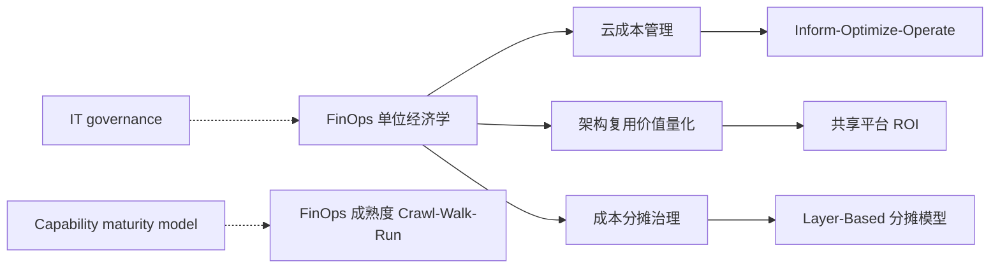
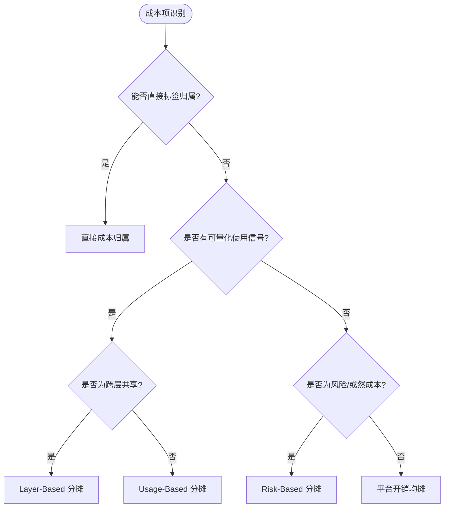

# FinOps 云成本治理与架构复用价值量化
>
> 版本: 2026-06-06
> 对齐来源: FinOps Foundation Framework、Opslyft Cloud COGS Playbook、Finout / Cloudaware / Sedai 2026 行业报告

## 1. FinOps 框架核心（2026 版）

### 1.1 生命周期：Inform → Optimize → Operate

```text
Inform（知情）
├── 成本分配与标签治理
├── 使用与支出监控
└── 异常检测与告警

Optimize（优化）
├── 工作负载 Right-sizing
├── 自动扩缩容
├── 预留实例与 Spot 实例策略
└── 许可管理

Operate（运营）
├── 自动化治理（Policy-as-Code）
├── 持续反馈循环
└── 财务-工程协同机制
```

### 1.2 四大领域与 18 项能力

| 领域 | 能力示例 |
|-----|---------|
| **理解使用与成本** | 数据摄取、成本分配、异常管理 |
| **量化业务价值** | 规划、预算、预测、单位经济计算 |
| **优化云支出** | 工作负载优化、费率谈判、许可管理 |
| **管理 FinOps 实践** | 团队教育、治理策略、工具选型 |

## 2. 单位经济学（Unit Economics）

### 2.1 核心转换

| 传统 FinOps | 单位经济学 |
|------------|-----------|
| "上月 AWS 花费 $240K" | "上月每活跃用户花费 $0.42" |
| "云成本季度增长 18%" | "每客户成本因规模效应下降 12%" |
| "今年云成本节省 15%" | "企业级毛利率从 62% 提升至 71%" |

### 2.2 计算步骤

1. **达到 90%+ 分配准确率**：单位经济学精度不能超过底层分配精度
2. **选择单位**：与财务报告一致（活跃用户、交易、客户、处理 GB）
3. **应用层标记**：每个请求/查询携带租户/客户/功能标识
4. **事后关联**：使用日志 + Cloud CMDB 上下文 nightly 关联成本
5. **除法与比对**：期间总分配成本 ÷ 单位数量；与每单位收入比对计算毛利率

### 2.3 三层归因模型

| 层级 | 覆盖范围 | 方法 |
|-----|---------|------|
| **直接租户归因** | 50–65% 支出 | 资源标签 `customer_id` / `tenant_id` |
| **比例多租户归因** | 20–35% 支出 | 按使用量信号分配（请求数、查询数、存储量）|
| **平台开销归因** | 10–20% 支出 | 按直接客户支出比例分摊 |

### 2.4 分层毛利率洞察

典型 SaaS 成本结构揭示：

| 层级 | ARPU | 每客户成本 | 毛利率 | 收入占比 |
|-----|------|-----------|--------|---------|
| Enterprise | $3,200 | $860 | 73% | 54% |
| Mid-market | $890 | $412 | 53.7% | 31% |
| Self-serve | $29 | $34 | **-17%** | 15% |

> 聚合毛利率是加权平均，隐藏了实际盈利与亏损所在。

## 3. Cloud COGS（销货成本）桥接

将云账单转化为 GAAP 就绪的毛利率数据：

```
Stage 1: 原始云账单 ($2.4M AWS+Azure+GCP)
    ↓
Stage 2: 分配 (95% 到团队/产品)
    ↓
Stage 3: 单位经济学 (每客户/功能成本)
    ↓
Stage 4: Cloud COGS (GAAP 毛利率就绪)
```

## 4. 成熟度模型：Crawl → Walk → Run

| 阶段 | 特征 | 架构复用关联 |
|-----|------|------------|
| **Crawl** | 反应式；基础云厂商仪表盘；标签不一致；关注月度账单 | 无共享成本模型 |
| **Walk** | 流程可靠；标签合规 80%+；财务可预测下月账单；开始购买预留实例 | 初步平台服务 chargeback |
| **Run** | 高度自动化；ML 预测成本异常；工程使用自动化 right-sizing；单位经济学完美追踪 | 平台工程团队量化每 Golden Path 成本 |

> **行业数据**：仅 22% 的成熟 FinOps 项目每月报告单位经济学；78% 从未达到该阶段。

## 5. AI 成本管理（2026 新焦点）

### 5.1 AI 工作负载的特殊挑战

- **共享环境**：多租户 GPU 集群成本归属困难
- **可变使用**：LLM API 调用量波动剧烈
- **单位定义**：按 token？按请求？按用户会话？

### 5.2 架构复用中的 AI 成本建模

| 复用资产 | 成本归因单位 | 优化策略 |
|---------|-------------|---------|
| 共享 LLM 推理服务 | 每千 token / 每请求 | 缓存、批处理、模型蒸馏 |
| 嵌入（Embedding）流水线 | 每文档 / 每查询 | 向量数据库预计算、量化 |
| RAG 检索层 | 每检索 / 每用户 | 索引分区、边缘缓存 |
| 微调模型 | 每训练任务 / 每租户 | 参数高效微调 (LoRA)、共享基座 |

## 6. 架构复用的 FinOps 视角

### 6.1 共享平台服务的成本透明

- **目标**：平台团队向产品团队展示每能力/每租户的真实成本
- **方法**：Golden Path 模板内置成本归因标签；平台使用自动生成 showback 报告

### 6.2 复用决策的经济学

| 决策 | 计算维度 |
|-----|---------|
| 自建 vs 购买 | 总拥有成本（TCO）+ 维护人力 |
| 共享服务 vs 专用实例 | 多租户隔离成本 vs 资源利用率 |
| 预留实例承诺 | 利用率预测 × 折扣率 |
| 技术债务重构 | 重构后单位成本降幅 |

### 6.3 度量指标

- **DORA 指标**：部署频率、变更前置时间、变更失败率、恢复时间
- **平台特定**：新服务上线时间、新工程师入职时间、平台采用率
- **财务指标**：分配准确率、每客户云 COGS、毛利率趋势

## 7. 实施路线图（90–180 天）

| 阶段 | 时间 | 关键活动 |
|-----|------|---------|
| 基础 | Days 1–30 | 分配审计；与财务定义 COGS/R&D/G&A 分类；建立基线毛利率 |
|  instrument | Days 31–90 | 应用层租户标记；构建 nightly 关联流水线；发布首个 per-customer 仪表盘 |
| 扩展 | Days 91–180 | 扩展至 per-feature；整合财务月度结账；自动化 anomaly routing |

## 3. FinOps 单位经济学深度定义与属性

### 3.1 概念定义

**定义**：FinOps 单位经济学（FinOps Unit Economics）是将云支出、共享平台成本与可复用资产成本按统一业务单位进行归集、分摊与比较的经济分析方法。其核心目标是把"我们上个月花了多少云费用"转换为"每产生一个业务单位价值，我们花费了多少钱"，从而使工程决策、架构复用决策与财务目标对齐。

与 Wikipedia 对 [FinOps](https://en.wikipedia.org/wiki/FinOps) 的广义定义（云财务管理实践）相比，本知识体系的单位经济学更强调**跨层复用成本的可归属性**和**业务价值驱动分摊**，即不仅要算清云账单，还要算清共享资产在业务层、应用层、组件层、功能层中的真实成本归属。

### 3.2 单位经济学核心属性

| 属性 | 说明 | 重要性 | 可观察性 |
|------|------|--------|----------|
| **可归属性（Attributability）** | 成本能否按业务单位（客户、交易、功能）直接归属 | 高 | 分配准确率 ≥ 90% |
| **可预测性（Predictability）** | 单位成本随业务规模变化的稳定程度 | 高 | 单位成本变异系数 ≤ 15% |
| **可行动性（Actionability）** | 指标能否驱动明确的工程/业务动作 | 高 | 与 OKR/KPI 绑定 |
| **可复用性（Reusability）** | 共享资产成本能否在多个消费方间合理分摊 | 中 | 成本分摊争议率 ≤ 5% |
| **可审计性（Auditability）** | 分摊逻辑、数据源、假设可追溯、可复现 | 中 | 分摊报告通过财务审计 |
| **时效性（Timeliness）** | 单位成本数据从产生到可用的延迟 | 中 | T+1 日报 / T+0 实时 |

### 3.3 单位经济学与相关概念的关系



- **上位概念**：[IT governance](https://en.wikipedia.org/wiki/IT_governance) 与 [FinOps](https://en.wikipedia.org/wiki/FinOps) 框架；
- **下位概念**：Cloud COGS、每客户成本、每请求成本、每 Token 成本；
- **等价/映射概念**：Unit Economics（SaaS 领域）、Cloud Unit Cost（云厂商）、Total Cost of Ownership（TCO）；
- **依赖概念**：标签治理（Tagging Governance）、成本分配（Cost Allocation）、用量计量（Usage Metering）。

### 3.4 成本分摊模型：五维分摊框架

在"直接租户归因—比例多租户归因—平台开销归因"三层归因基础上，本框架引入**五维分摊框架**：

| 维度 | 分摊对象 | 分摊基数 | 适用场景 |
|------|----------|----------|----------|
| **Tenant 维度** | 直接客户/租户 | `customer_id` / `tenant_id` 标签 | SaaS 多租户成本 |
| **Product 维度** | 产品/功能线 | 产品收入、功能调用量 | 跨产品共享服务 |
| **Layer 维度** | 业务/应用/组件/功能层 | 各层受益比例 | 跨层复用基础设施 |
| **Team 维度** | 团队/成本中心 | 团队人数、预算权重 | 固定共享开销 |
| **Risk 维度** | 全组织风险准备金 | 影响面/受益面加权 | 安全/合规/技术债务 |

**五维分摊公式**：

$$
UnitCost_u = \frac{\sum_{i} DirectCost_i \cdot \delta(u,i) + \sum_{j} SharedCost_j \cdot \frac{Signal_{u,j}}{\sum_{v} Signal_{v,j}} + RiskReserve \cdot \frac{Exposure_u}{\sum_{v} Exposure_v}}{Volume_u}
$$

其中：

- $ \delta(u,i) $：成本项 $ i $ 是否可直接归属到单位 $ u $；
- $ Signal_{u,j} $：单位 $ u $ 对共享成本项 $ j $ 的使用信号；
- $ Exposure_u $：单位 $ u $ 在风险场景下的暴露面。

### 3.5 正例：SaaS 企业跨层共享平台成本透明化

**背景**：某 SaaS 企业年云支出 $4.8M，包含共享 Kubernetes 平台、共享 LLM 推理服务、共享数据仓库和 20 余个业务微服务。

**实施**：

1. **标签治理**：强制所有资源携带 `tenant_id`、`product_id`、`layer`、`cost_center` 四标签；
2. **直接归因**：65% 支出通过标签直接归属；
3. **比例分摊**：25% 支出按 API 请求数、GPU token 数、数据扫描量分摊；
4. **平台开销**：10% 支出按直接成本比例分摊；
5. **单位经济**：生成"每活跃客户成本""每千次 API 调用成本""每千 token 成本"。

**效果**：

- 发现 Self-serve 产品线毛利率为 -17%，决定下架或涨价；
- 识别共享 LLM 推理服务中 35% 调用来自低价值批量任务，优化后每月节省 $42K；
- 平台团队向产品团队 showback 报告，驱动共享服务利用率提升 28%。

### 3.6 反例：平均分摊导致"公地悲剧"

**背景**：某企业将 $200K/月的共享数据平台成本按团队人数平均分摊到 8 个团队。

**问题**：

1. **激励扭曲**：大团队承担固定成本，小团队无成本意识，导致查询量暴增；
2. **责任不清**：没有团队愿意优化查询，因为成本不随用量变化；
3. **复用受阻**：数据平台团队无法证明投资 ROI，新功能预算被砍。

**后果**：6 个月内数据平台成本增长 55%，查询性能下降 40%，多个团队开始自建数据副本，形成新的数据孤岛。

**避免方法**：

- 采用 Usage-Based 分摊，让成本随用量变化；
- 设置团队级成本预算与告警；
- 将"每查询成本"纳入团队 OKR。

### 3.7 实施检查清单

| 阶段 | 关键活动 | 验收标准 |
|------|----------|----------|
| **第 1 阶段：标签治理** | 制定标签策略、清理历史资源 | 标签覆盖率 ≥ 95% |
| **第 2 阶段：分配建模** | 选择分摊模型、定义单位 | 分配准确率 ≥ 90% |
| **第 3 阶段：单位经济** | 生成 per-unit 报表 | 管理层月度 review |
| **第 4 阶段：闭环优化** | 成本优化行动、再评估 | 单位成本下降 ≥ 10% |

### 3.8 决策树：何时使用何种分摊模型



### 3.9 与架构复用价值的衔接

单位经济学必须与架构复用价值量化联动：

| 复用决策 | 单位经济学输入 | 价值输出 |
|----------|----------------|----------|
| 自研 vs 购买 | 自研单位成本、采购单位成本 | TCO 比较 |
| 共享服务 vs 专用实例 | 共享分摊成本、隔离额外成本 | 单位成本差异 |
| 升级共享组件 | 平台投资增量、消费方数量 | 每消费方成本 |
| 退役低采用资产 | 维护成本、潜在替代成本 | 资产净现值 |

## 8. 参考索引与权威来源

> **权威来源**:
>
> | 来源 | URL | 核查日期 |
> |------|-----|----------|
> | FinOps Foundation — What is FinOps? | <https://www.finops.org/what-is-finops/> | 2026-07-07 |
> | Wikipedia — FinOps | <https://en.wikipedia.org/wiki/FinOps> | 2026-07-07 |
> | Wikipedia — IT governance | <https://en.wikipedia.org/wiki/IT_governance> | 2026-07-07 |
> | FinOps Foundation — Unit Economics Capability | <https://www.finops.org/framework/capabilities/quantify/unit-economics/> | 2026-07-07 |
> | FinOps Foundation — Cost Allocation Capability | <https://www.finops.org/framework/capabilities/manage/allocate-costs/> | 2026-07-07 |
> | AWS — Cost Allocation Tags Best Practices | <https://docs.aws.amazon.com/awsaccountbilling/latest/aboutv2/cost-alloc-tags.html> | 2026-07-07 |
> | DORA — State of DevOps Report 2024 | <https://dora.dev/research/2024/dora-report/> | 2026-07-07 |
> | ISO/IEC 26564:2022 — Software Reuse Measurement and Metrics | <https://www.iso.org/standard/81622.html> | 2026-07-07 |

- Opslyft: "Cloud Unit Economics & Cloud COGS Playbook" (2026)
- Finout: "Top 50 FinOps Tools to Consider in 2026" (2026-05)
- Sedai: "Top 17 FinOps Cloud Optimization Strategies" (2026-01)
- Cloudaware: "What Is FinOps? Framework, Roles, Strategy & Tools" (2026-01)

> **交叉引用**:
>
> - 跨层复用成本分摊模型：[`struct/06-cross-layer-governance/04-finops-cost/cost-allocation-template.md`](./cost-allocation-template.md)
> - 复用度量指标体系：[`struct/06-cross-layer-governance/05-metrics-kpi/metrics-framework.md`](../05-metrics-kpi/metrics-framework.md)
> - 复用 ROI 框架：[`struct/09-value-quantification/02-roi-npv-models/roi-framework.md`](../../09-value-quantification/02-roi-npv-models/roi-framework.md)
> - 跨层复用治理框架：[`struct/06-cross-layer-governance/01-process-governance/cross-layer-governance.md`](../01-process-governance/cross-layer-governance.md)


---

## 补充说明：FinOps 云成本治理与架构复用价值量化

## 概念定义

**定义**：FinOps 成本分摊治理是将云成本、平台成本与复用资产成本按业务价值归集到团队、产品与功能，实现成本透明与优化问责。

## 示例

**示例**：平台团队按“每活跃用户”“每千次请求”将共享服务成本分摊给消费方，并在仪表盘展示各产品的单位经济学指标。

## 反例

**反例**：共享平台成本由中央 IT 统一承担，消费方没有成本意识，导致资源浪费与利用率低下。

## 权威来源

> **权威来源**:
>
> - [FinOps Foundation — What is FinOps?](https://www.finops.org/what-is-finops/)
> - [Wikipedia — FinOps](https://en.wikipedia.org/wiki/FinOps)
> - [Wikipedia — IT governance](https://en.wikipedia.org/wiki/IT_governance)
> - 核查日期：2026-07-07

## 分析

**分析**：成本分摊是复用治理的经济杠杆，只有让消费方感受到真实成本，才能驱动理性复用决策。
