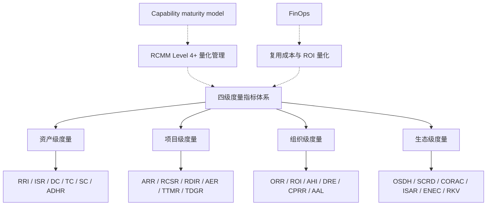
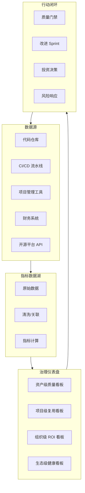

# 软件复用度量指标体系框架

> **版本**: 2026-06-06
> **定位**: 与 ISO/IEC 26564:2022《Software Reuse — Measurement and Metrics》对齐的四级度量框架
> **对齐来源**: ISO/IEC 26564:2022, NASA RRL (Reuse Readiness Levels), RCMM, RiSE-RM, CMMI-DEV

---

## 目录

- [软件复用度量指标体系框架](#软件复用度量指标体系框架)
  - [目录](#目录)
  - [1. 框架概述](#1-框架概述)
  - [2. 资产级度量 (Asset-Level Metrics)](#2-资产级度量-asset-level-metrics)
    - [2.1 复用准备度指数 (Reuse Readiness Index, RRI)](#21-复用准备度指数-reuse-readiness-index-rri)
    - [2.2 接口稳定性率 (Interface Stability Rate, ISR)](#22-接口稳定性率-interface-stability-rate-isr)
    - [2.3 文档完整度 (Documentation Completeness, DC)](#23-文档完整度-documentation-completeness-dc)
    - [2.4 测试覆盖率 (Test Coverage, TC)](#24-测试覆盖率-test-coverage-tc)
    - [2.5 SBOM 完整度 (SBOM Completeness, SC)](#25-sbom-完整度-sbom-completeness-sc)
    - [2.6 资产检索命中率 (Asset Discovery Hit Rate, ADHR)](#26-资产检索命中率-asset-discovery-hit-rate-adhr)
  - [3. 项目级度量 (Project-Level Metrics)](#3-项目级度量-project-level-metrics)
    - [3.1 实际复用率 (Actual Reuse Rate, ARR)](#31-实际复用率-actual-reuse-rate-arr)
    - [3.2 复用成本节约率 (Reuse Cost Saving Rate, RCSR)](#32-复用成本节约率-reuse-cost-saving-rate-rcsr)
    - [3.3 复用缺陷引入率 (Reuse Defect Injection Rate, RDIR)](#33-复用缺陷引入率-reuse-defect-injection-rate-rdir)
    - [3.4 复用资产适配工作量占比 (Adaptation Effort Ratio, AER)](#34-复用资产适配工作量占比-adaptation-effort-ratio-aer)
    - [3.5 交付周期缩短率 (Time-to-Market Reduction, TTMR)](#35-交付周期缩短率-time-to-market-reduction-ttmr)
    - [3.6 技术债务增长率 (Technical Debt Growth Rate, TDGR)](#36-技术债务增长率-technical-debt-growth-rate-tdgr)
  - [4. 组织级度量 (Organization-Level Metrics)](#4-组织级度量-organization-level-metrics)
    - [4.1 组织复用率 (Organizational Reuse Rate, ORR)](#41-组织复用率-organizational-reuse-rate-orr)
    - [4.2 复用投资回报率 (Reuse ROI)](#42-复用投资回报率-reuse-roi)
    - [4.3 资产库增长率与退役率 (Asset Growth vs. Retirement Rate)](#43-资产库增长率与退役率-asset-growth-vs-retirement-rate)
    - [4.4 开发者复用参与度 (Developer Reuse Engagement, DRE)](#44-开发者复用参与度-developer-reuse-engagement-dre)
    - [4.5 跨项目复用率 (Cross-Project Reuse Rate, CPRR)](#45-跨项目复用率-cross-project-reuse-rate-cprr)
    - [4.6 复用资产平均生命周期 (Average Asset Lifecycle, AAL)](#46-复用资产平均生命周期-average-asset-lifecycle-aal)
  - [5. 生态级度量 (Ecosystem-Level Metrics)](#5-生态级度量-ecosystem-level-metrics)
    - [5.1 开源依赖健康度 (Open Source Dependency Health, OSDH)](#51-开源依赖健康度-open-source-dependency-health-osdh)
    - [5.2 供应链复用深度 (Supply Chain Reuse Depth, SCRD)](#52-供应链复用深度-supply-chain-reuse-depth-scrd)
    - [5.3 跨组织复用协议覆盖率 (Cross-Org Reuse Agreement Coverage, CORAC)](#53-跨组织复用协议覆盖率-cross-org-reuse-agreement-coverage-corac)
    - [5.4 行业标准采纳率 (Industry Standard Adoption Rate, ISAR)](#54-行业标准采纳率-industry-standard-adoption-rate-isar)
    - [5.5 生态网络效应系数 (Ecosystem Network Effect Coefficient, ENEC)](#55-生态网络效应系数-ecosystem-network-effect-coefficient-enec)
    - [5.6 复用知识传播速度 (Reuse Knowledge Velocity, RKV)](#56-复用知识传播速度-reuse-knowledge-velocity-rkv)
  - [6. 指标采集与治理流程](#6-指标采集与治理流程)
    - [6.1 数据采集架构](#61-数据采集架构)
    - [6.2 治理节奏](#62-治理节奏)
  - [7. 与成熟度模型的映射](#7-与成熟度模型的映射)
  - [8. 四级度量指标体系的核心概念与关系](#8-四级度量指标体系的核心概念与关系)
    - [8.1 概念定义](#81-概念定义)
    - [8.2 框架核心属性](#82-框架核心属性)
    - [8.3 与相关概念的关系](#83-与相关概念的关系)
    - [8.4 四级度量指标的综合属性表](#84-四级度量指标的综合属性表)
    - [8.5 正例：某科技公司度量驱动的复用改进](#85-正例某科技公司度量驱动的复用改进)
    - [8.6 反例：单一指标驱动的"代码复制大赛"](#86-反例单一指标驱动的代码复制大赛)
    - [8.7 反例：组织级指标与项目实践脱节](#87-反例组织级指标与项目实践脱节)
    - [8.8 度量治理仪表盘架构](#88-度量治理仪表盘架构)
  - [9. 参考索引与权威来源](#9-参考索引与权威来源)
  - [补充说明：软件复用度量指标体系框架](#补充说明软件复用度量指标体系框架)
  - [概念定义](#概念定义)
  - [示例](#示例)
  - [反例](#反例)
  - [权威来源](#权威来源)
  - [分析](#分析)

---

## 1. 框架概述

ISO/IEC 26564:2022 将软件复用度量定义为"对复用过程、资产和结果进行系统化的定量表征"。
本框架在此基础上扩展为**四级度量体系**，覆盖从单个组件到跨组织生态的全谱系：

| 度量层级 | 范围 | 决策频率 | 主要利益相关者 | ISO 26564 对齐章节 |
|---------|------|---------|--------------|-----------------|
| **资产级** | 单个可复用资产 | 每次变更 | 资产所有者、平台工程师 | §5.2 资产质量度量 |
| **项目级** | 单个项目/产品 | 每 Sprint / 里程碑 | 项目经理、技术负责人 | §5.3 项目复用度量 |
| **组织级** | 企业/部门 | 每季度 | 工程总监、CTO | §5.4 组织复用度量 |
| **生态级** | 跨组织/开源生态 | 每半年/年度 | 生态治理委员会 | §5.5 生态复用度量 |

> **交叉引用**: 本框架与 [`struct/01-meta-model-standards/01-iso-420xx-family/alignment-matrix.md`](../../01-meta-model-standards/01-iso-420xx-family/alignment-matrix.md) 中的 ISO 26550:2015 产品线工程模型对齐，与 [`struct/06-cross-layer-governance/03-maturity-models/reuse-maturity-models-rcmm-rise.md`](../03-maturity-models/reuse-maturity-models-rcmm-rise.md) 中的 RCMM Level 4+ 量化管理要求对齐。

---

## 2. 资产级度量 (Asset-Level Metrics)

资产级度量聚焦于单个可复用组件/服务/模板的内在质量与复用就绪度。

### 2.1 复用准备度指数 (Reuse Readiness Index, RRI)

| 属性 | 定义 |
|------|------|
| **名称** | 复用准备度指数 (RRI) |
| **计算公式** | $$RRI = \frac{1}{9} \sum_{i=1}^{9} w_i \times L_i$$ |
| | 其中 $L_i \in [1,9]$ 为 NASA RRL 第 $i$ 个维度评级，$w_i$ 为权重（默认 $w_i = 1$） |
| **采集方式** | 自动化工具扫描 + 专家评估；RRL 九个维度：文档、扩展性、知识产权、模块化、封装、可携带性、标准化、支持、验证与测试 |
| **目标值** | RRI ≥ 6.0（可复用门槛）；RRI ≥ 7.5（推荐广泛复用） |
| **改进建议** | 对 RRI < 5.0 的资产启动"复用改造 sprint"：补充 API 文档、增加单元测试覆盖率、澄清许可证声明 |

### 2.2 接口稳定性率 (Interface Stability Rate, ISR)

| 属性 | 定义 |
|------|------|
| **名称** | 接口稳定性率 (ISR) |
| **计算公式** | $$ISR = \left(1 - \frac{N_{breaking}}{N_{total\_releases}}\right) \times 100\%$$ |
| | 其中 $N_{breaking}$ 为含破坏性变更的发布次数，$N_{total\_releases}$ 为总发布次数 |
| **采集方式** | SemVer 标签解析 + API diff 工具（如 OpenAPI Diff、Rust breaking） |
| **目标值** | ISR ≥ 85%（组织级组件）；ISR ≥ 95%（平台级核心组件） |
| **改进建议** | 采用语义化版本控制严格规范；引入 API 兼容性测试门控；对高频变更接口实施适配器模式隔离 |

### 2.3 文档完整度 (Documentation Completeness, DC)

| 属性 | 定义 |
|------|------|
| **名称** | 文档完整度 (DC) |
| **计算公式** | $$DC = \frac{N_{required\_docs} - N_{missing}}{N_{required\_docs}} \times 100\%$$ |
| | 必需文档集：README、API 参考、使用示例、架构决策记录 (ADR)、变更日志、部署指南 |
| **采集方式** | 文档清单自动化扫描（如 markdown-lint、docs-as-code CI 检查） |
| **目标值** | DC = 100%（资产入库门槛） |
| **改进建议** | 将文档检查纳入 CI/CD 流水线；使用文档模板脚手架；建立文档 OWNER 轮值制度 |

### 2.4 测试覆盖率 (Test Coverage, TC)

| 属性 | 定义 |
|------|------|
| **名称** | 测试覆盖率 (TC) |
| **计算公式** | $$TC = \frac{L_{covered}}{L_{total}} \times 100\%$$ |
| | 含单元测试、集成测试、契约测试覆盖的代码行数比例 |
| **采集方式** | JaCoCo / Coverage.py / istanbul / llvm-cov 等覆盖率工具 |
| **目标值** | TC ≥ 80%（业务组件）；TC ≥ 90%（平台组件）；TC ≥ 95%（安全关键组件） |
| **改进建议** | 对覆盖率 < 60% 的资产冻结新功能开发，优先补齐测试；引入变异测试 (mutation testing) 评估测试有效性 |

### 2.5 SBOM 完整度 (SBOM Completeness, SC)

| 属性 | 定义 |
|------|------|
| **名称** | SBOM 完整度 (SC) |
| **计算公式** | $$SC = \frac{N_{deps\_with\_sbom}}{N_{total\_deps}} \times 100\%$$ |
| | 含完整 SPDX / CycloneDX SBOM 信息的依赖比例 |
| **采集方式** | Syft / Trivy / FOSSology 自动生成 SBOM；SLSA provenance 校验 |
| **目标值** | SC = 100%（2026 年起为组织强制要求） |
| **改进建议** | 在 CI/CD 中嵌入 SBOM 生成步骤；与内部制品库集成，拒绝无 SBOM 的依赖入库 |

### 2.6 资产检索命中率 (Asset Discovery Hit Rate, ADHR)

| 属性 | 定义 |
|------|------|
| **名称** | 资产检索命中率 (ADHR) |
| **计算公式** | $$ADHR = \frac{N_{found\_on\_first\_search}}{N_{total\_searches}} \times 100\%$$ |
| | 开发者在资产库中首次搜索即找到所需资产的比例 |
| **采集方式** | 资产目录平台日志分析（如 Backstage、Sonatype Nexus、Artifactory） |
| **目标值** | ADHR ≥ 70% |
| **改进建议** | 优化标签体系（与领域本体对齐）；引入 AI 语义搜索；建立"相似资产推荐"引擎 |

---

## 3. 项目级度量 (Project-Level Metrics)

项目级度量追踪单个项目在执行过程中的复用行为与效果。

### 3.1 实际复用率 (Actual Reuse Rate, ARR)

| 属性 | 定义 |
|------|------|
| **名称** | 实际复用率 (ARR) |
| **计算公式** | $$ARR = \frac{ESLOC_{reused}}{ESLOC_{total}} \times 100\%$$ |
| | 其中 $ESLOC_{reused}$ 为复用等价源代码行（按 COCOMO II 复用模型折算），$ESLOC_{total}$ 为项目总等价规模 |
| **采集方式** | SCA 工具（SonarQube、Snyk、FOSSA）+ COCOMO II ESLOC 计算器 |
| **目标值** | ARR ≥ 30%（一般项目）；ARR ≥ 50%（平台产品线项目） |
| **改进建议** | 在项目 kickoff 阶段制定复用目标；建立"复用机会识别"checklist；对 ARR < 20% 的项目进行复盘 |

### 3.2 复用成本节约率 (Reuse Cost Saving Rate, RCSR)

| 属性 | 定义 |
|------|------|
| **名称** | 复用成本节约率 (RCSR) |
| **计算公式** | $$RCSR = \frac{Cost_{new\_dev} - Cost_{reuse}}{Cost_{new\_dev}} \times 100\%$$ |
| | 其中 $Cost_{new\_dev}$ 为全部新开发估算成本，$Cost_{reuse}$ 为实际复用成本（评估+改编+集成+许可证） |
| **采集方式** | 项目工时追踪系统 + COCOMO II 2026 校准版估算 [`struct/09-value-quantification/01-cocomo-ii-reuse/cocomo-2026-calibration.md`](../../09-value-quantification/01-cocomo-ii-reuse/cocomo-2026-calibration.md) |
| **目标值** | RCSR ≥ 25% |
| **改进建议** | 对 RCSR < 15% 的项目分析根因：是资产不适配？还是改编成本过高？还是搜索成本过高？ |

### 3.3 复用缺陷引入率 (Reuse Defect Injection Rate, RDIR)

| 属性 | 定义 |
|------|------|
| **名称** | 复用缺陷引入率 (RDIR) |
| **计算公式** | $$RDIR = \frac{N_{defects\_from\_reused\_assets}}{N_{total\_defects}} \times 100\%$$ |
| | 源自复用资产的缺陷数占总缺陷数的比例 |
| **采集方式** | 缺陷追踪系统（Jira、Azure DevOps）标签分类 + 根因分析 (RCA) |
| **目标值** | RDIR ≤ 15% |
| **改进建议** | RDIR > 25% 时启动资产质量审查；加强复用资产的准入测试；对高频缺陷资产实施黑名单机制 |

### 3.4 复用资产适配工作量占比 (Adaptation Effort Ratio, AER)

| 属性 | 定义 |
|------|------|
| **名称** | 复用资产适配工作量占比 (AER) |
| **计算公式** | $$AER = \frac{PM_{adaptation}}{PM_{total}} \times 100\%$$ |
| | 复用资产的评估、理解、改编、集成工作量占项目总人月的比例 |
| **采集方式** | 工时登记表分类标记 + 项目经理估算校准 |
| **目标值** | AER ≤ 30%（复用才具有经济性） |
| **改进建议** | AER > 40% 表明资产设计缺乏可变性 (variability)；反馈给资产所有者进行可配置化重构 |

### 3.5 交付周期缩短率 (Time-to-Market Reduction, TTMR)

| 属性 | 定义 |
|------|------|
| **名称** | 交付周期缩短率 (TTMR) |
| **计算公式** | $$TTMR = \frac{T_{baseline} - T_{actual}}{T_{baseline}} \times 100\%$$ |
| | $T_{baseline}$ 为基于历史类似项目（无复用）的基线工期，$T_{actual}$ 为实际工期 |
| **采集方式** | 项目管理工具（Jira、Linear）里程碑数据 + 组织历史项目基线数据库 |
| **目标值** | TTMR ≥ 15% |
| **改进建议** | 建立项目类型-规模-工价基线库；对 TTMR < 0%（延期）的项目进行复用决策复盘 |

### 3.6 技术债务增长率 (Technical Debt Growth Rate, TDGR)

| 属性 | 定义 |
|------|------|
| **名称** | 技术债务增长率 (TDGR) |
| **计算公式** | $$TDGR = \frac{TD_{end} - TD_{start}}{TD_{start}} \times 100\%$$ |
| | 项目周期内技术债务估算值的增长比例（可用 SonarQube 技术债务指标代理） |
| **采集方式** | SonarQube / CodeClimate / CAST 静态分析工具 |
| **目标值** | TDGR ≤ 10% |
| **改进建议** | TDGR > 20% 时引入重构 sprint；对复用资产的"裁剪式改编"导致的代码异味进行专项扫描 |

---

## 4. 组织级度量 (Organization-Level Metrics)

组织级度量评估企业层面的复用能力成熟度与投资回报。

### 4.1 组织复用率 (Organizational Reuse Rate, ORR)

| 属性 | 定义 |
|------|------|
| **名称** | 组织复用率 (ORR) |
| **计算公式** | $$ORR = \frac{\sum_{p=1}^{n} ESLOC_{reused,p}}{\sum_{p=1}^{n} ESLOC_{total,p}} \times 100\%$$ |
| | 全组织所有项目的加权平均复用率 |
| **采集方式** | 各项目 ARR 汇总 + 项目规模权重 |
| **目标值** | ORR ≥ 35%（RCMM Level 3+）；ORR ≥ 50%（RCMM Level 4+） |
| **改进建议** | ORR 停滞时，检查资产库增长是否匹配项目增长；考虑引入领域工程 (Domain Engineering) |

### 4.2 复用投资回报率 (Reuse ROI)

| 属性 | 定义 |
|------|------|
| **名称** | 复用投资回报率 (Reuse ROI) |
| **计算公式** | $$Reuse\_ROI = \frac{\sum Savings - \sum Investment}{\sum Investment} \times 100\%$$ |
| | $\sum Savings$ 为全组织因复用避免的新开发成本；$\sum Investment$ 为复用资产的建设、维护、治理总投资 |
| **采集方式** | 财务系统（资产建设成本）+ 项目估算系统（避免成本） |
| **目标值** | Reuse ROI ≥ 150%（即每投入 1 元获得 2.5 元回报） |
| **改进建议** | ROI < 100% 时审查资产库中"僵尸资产"（零采用率的组件）；将资源集中于高价值核心资产 |

### 4.3 资产库增长率与退役率 (Asset Growth vs. Retirement Rate)

| 属性 | 定义 |
|------|------|
| **名称** | 资产健康度指数 (Asset Health Index, AHI) |
| **计算公式** | $$AHI = \frac{N_{new\_assets} - N_{retired\_assets}}{N_{total\_assets\_start}} \times 100\%$$ |
| | 净增长率；同时追踪退役原因分类（技术过时、无采用、安全漏洞、许可证变更） |
| **采集方式** | 资产目录平台元数据 + 退役审批工作流 |
| **目标值** | AHI: 5%–15%（健康增长）；退役率 ≤ 8% |
| **改进建议** | AHI > 20% 可能表明资产碎片化；AHI < 0% 表明资产库萎缩，需审查领域工程预算 |

### 4.4 开发者复用参与度 (Developer Reuse Engagement, DRE)

| 属性 | 定义 |
|------|------|
| **名称** | 开发者复用参与度 (DRE) |
| **计算公式** | $$DRE = \frac{N_{devs\_who\_reused\_or\_contributed}{N_{total\_devs}} \times 100\%$$ |
| | 在统计周期内至少复用过一次或贡献过一个资产的开发者比例 |
| **采集方式** | 代码仓库贡献分析（git log + 资产库贡献记录） |
| **目标值** | DRE ≥ 70% |
| **改进建议** | DRE < 50% 时加强复用培训与激励；将"贡献可复用资产"纳入绩效考核 |

### 4.5 跨项目复用率 (Cross-Project Reuse Rate, CPRR)

| 属性 | 定义 |
|------|------|
| **名称** | 跨项目复用率 (CPRR) |
| **计算公式** | $$CPRR = \frac{N_{assets\_used\_in\_multiple\_projects}}{N_{total\_assets}} \times 100\%$$ |
| | 被两个及以上项目采用的资产比例 |
| **采集方式** | 依赖分析工具（跨越多个代码仓库扫描相同组件版本） |
| **目标值** | CPRR ≥ 40% |
| **改进建议** | CPRR < 30% 表明存在"竖井式复用"（项目内重复造轮子）；需加强跨项目架构评审 |

### 4.6 复用资产平均生命周期 (Average Asset Lifecycle, AAL)

| 属性 | 定义 |
|------|------|
| **名称** | 复用资产平均生命周期 (AAL) |
| **计算公式** | $$AAL = \frac{\sum (T_{retire} - T_{publish})}{N_{retired\_assets}}$$ |
| | 从资产发布到退役的平均时间（月） |
| **采集方式** | 资产目录平台生命周期元数据 |
| **目标值** | AAL ≥ 24 个月 |
| **改进建议** | AAL < 12 个月表明技术栈变迁过快或资产设计缺乏前瞻性；审查技术雷达与资产选型策略 |

---

## 5. 生态级度量 (Ecosystem-Level Metrics)

生态级度量关注跨组织、开源社区及供应链层面的复用效应。

### 5.1 开源依赖健康度 (Open Source Dependency Health, OSDH)

| 属性 | 定义 |
|------|------|
| **名称** | 开源依赖健康度 (OSDH) |
| **计算公式** | $$OSDH = \frac{1}{4}(HC_{maintained} + HC_{licensed} + HC_{secure} + HC_{diverse})$$ |
| | 四个子维度各 0-100 分：维护活跃度、许可证合规性、安全漏洞状态、贡献者多样性 |
| **采集方式** | OpenSSF Scorecard / Snyk / FOSSA / deps.dev API |
| **目标值** | OSDH ≥ 80 |
| **改进建议** | OSDH < 60 时建立"关键依赖备份计划"；对无人维护的关键依赖启动内部 fork 评估 |

### 5.2 供应链复用深度 (Supply Chain Reuse Depth, SCRD)

| 属性 | 定义 |
|------|------|
| **名称** | 供应链复用深度 (SCRD) |
| **计算公式** | $$SCRD = \frac{\sum_{i=1}^{n} depth_i \times w_i}{\sum_{i=1}^{n} w_i}$$ |
| | 依赖树的平均深度，加权 by 依赖的安全等级（关键依赖权重更高） |
| **采集方式** | SCA 工具依赖树分析 |
| **目标值** | SCRD ≤ 5（控制传递依赖深度） |
| **改进建议** | SCRD > 7 时启动依赖瘦身计划；优先选择依赖更浅的替代方案；建立内部"精简版"包装层 |

### 5.3 跨组织复用协议覆盖率 (Cross-Org Reuse Agreement Coverage, CORAC)

| 属性 | 定义 |
|------|------|
| **名称** | 跨组织复用协议覆盖率 (CORAC) |
| **计算公式** | $$CORAC = \frac{N_{assets\_with\_cross\_org\_agreement}{N_{total\_shared\_assets}} \times 100\%$$ |
| | 具有明确跨组织共享协议（MOU、许可证、SLA）的资产比例 |
| **采集方式** | 法律/合规系统 + 资产目录元数据 |
| **目标值** | CORAC = 100%（所有跨组织共享资产必须有协议） |
| **改进建议** | 建立标准化共享协议模板；与法务部门共建"快速审批通道" |

### 5.4 行业标准采纳率 (Industry Standard Adoption Rate, ISAR)

| 属性 | 定义 |
|------|------|
| **名称** | 行业标准采纳率 (ISAR) |
| **计算公式** | $$ISAR = \frac{N_{assets\_compliant\_with\_standards}}{N_{total\_assets}} \times 100\%$$ |
| | 符合行业标准（如 MISRA、OpenAPI、ISO 26262、SLSA）的资产比例 |
| **采集方式** | 合规扫描工具 + 认证审计报告 |
| **目标值** | ISAR ≥ 90%（安全关键行业要求 100%） |
| **改进建议** | 将标准合规检查嵌入 CI/CD；对不达标资产设置"整改期限" |

### 5.5 生态网络效应系数 (Ecosystem Network Effect Coefficient, ENEC)

| 属性 | 定义 |
|------|------|
| **名称** | 生态网络效应系数 (ENEC) |
| **计算公式** | $$ENEC = \frac{N_{external\_consumers} \times N_{external\_contributors}}{N_{total\_assets}}$$ |
| | 衡量生态外部参与者（消费者 × 贡献者）与资产基数的比值 |
| **采集方式** | 开源平台 API（GitHub、GitLab、Maven Central、npm registry） |
| **目标值** | ENEC ≥ 10（健康开源生态） |
| **改进建议** | ENEC < 5 时加强社区运营：举办 hackathon、提供贡献者指南、建立激励计划 |

### 5.6 复用知识传播速度 (Reuse Knowledge Velocity, RKV)

| 属性 | 定义 |
|------|------|
| **名称** | 复用知识传播速度 (RKV) |
| **计算公式** | $$RKV = \frac{N_{new\_adopters\_per\_month}}{N_{total\_potential\_adopters}} \times 100\%$$ |
| | 每月新增采用者占潜在采用者总数的比例 |
| **采集方式** | 社区分析工具 + 资产库下载/引入统计 |
| **目标值** | RKV ≥ 5%/月 |
| **改进建议** | RKV < 2%/月 时优化 onboarding 体验：提供交互式教程、降低首次使用门槛 |

---

## 6. 指标采集与治理流程

### 6.1 数据采集架构

```text
┌─────────────────────────────────────────────────────────────┐
│                    指标数据湖 (Metrics Lake)                 │
├─────────────────────────────────────────────────────────────┤
│  源代码仓库 ──→ Git log / SCA ──→ 资产使用图谱                │
│  CI/CD 流水线 ──→ 测试/SBOM/覆盖率 ──→ 质量指标               │
│  项目管理工具 ──→ Jira/API ──→ 工时/缺陷/工期数据             │
│  财务系统 ──→ ERP/API ──→ 成本/投资数据                       │
│  开源平台 ──→ GitHub/npm API ──→ 生态活跃度数据               │
└─────────────────────────────────────────────────────────────┘
                              ↓
                    ┌─────────────────┐
                    │  指标计算引擎    │
                    │  (dbt / Python) │
                    └─────────────────┘
                              ↓
                    ┌─────────────────┐
                    │  治理仪表盘      │
                    │  (Grafana/Tableau)│
                    └─────────────────┘
```

### 6.2 治理节奏

| 频率 | 活动 | 参与者 |
|------|------|--------|
| **实时** | 资产级质量门禁（CI 阻断） | 平台工程团队 |
| **每周** | 项目级复用率审查 | 项目经理、技术负责人 |
| **每月** | 组织级指标趋势分析 | 工程总监、FinOps |
| **每季度** | 生态级健康度评估 | 治理委员会、CTO |
| **每年** | 全框架校准与基准更新 | 架构委员会、外部顾问 |

---

## 7. 与成熟度模型的映射

本框架的四级度量与 [`struct/06-cross-layer-governance/03-maturity-models/reuse-maturity-models-rcmm-rise.md`](../03-maturity-models/reuse-maturity-models-rcmm-rise.md) 中的成熟度模型映射如下：

| 成熟度等级 | 资产级指标状态 | 项目级指标状态 | 组织级指标状态 | 生态级指标状态 |
|-----------|--------------|--------------|--------------|--------------|
| **RCMM L1 初始** | 无系统采集 | 依赖个人估算 | 无 | 无 |
| **RCMM L2 可重复** | 手动检查清单 | 项目结项后估算 | 无 | 无 |
| **RCMM L3 已定义** | CI 自动采集 | Sprint 级跟踪 | 季度手工汇总 | 无 |
| **RCMM L4 已管理** | 实时仪表盘 | 里程碑自动报告 | 自动季度报告 | 年度评估 |
| **RCMM L5 优化** | 预测性质量模型 | 自适应复用推荐 | ML 辅助投资决策 | 生态网络效应量化 |

---

## 8. 四级度量指标体系的核心概念与关系

### 8.1 概念定义

**定义**：四级度量指标体系（Four-Level Reuse Metrics Framework）是从资产级（Asset-Level）、项目级（Project-Level）、组织级（Organization-Level）到生态级（Ecosystem-Level），对软件复用的范围、质量、成本、价值与风险进行系统化量化的一套指标集合。它与 Wikipedia 中 [Capability maturity model](https://en.wikipedia.org/wiki/Capability_Maturity_Model) 的量化管理思想一致，为复用成熟度从"已定义"向"已管理/优化"跃迁提供数据基础。

### 8.2 框架核心属性

| 属性 | 说明 | 重要性 | 可观察性 |
|------|------|--------|----------|
| **层次性（Hierarchy）** | 指标从单一资产到跨组织生态逐层聚合 | 高 | 四级指标均有定义 |
| **可度量性（Measurability）** | 每个指标有明确的计算公式与数据来源 | 高 | 自动化采集率 ≥ 80% |
| **可行动性（Actionability）** | 指标结果能驱动具体改进动作 | 高 | 与 OKR/KPI 绑定 |
| **可比性（Comparability）** | 指标在不同项目、团队、时间维度可比较 | 中 | 基线数据库建立 |
| **完整性（Completeness）** | 覆盖范围、质量、成本、价值、风险五个维度 | 中 | 维度覆盖率 100% |
| **抗扭曲性（Distortion Resistance）** | 指标体系不易被局部优化操纵 | 中 | 指标组合审查 |

### 8.3 与相关概念的关系



- **上位概念**：软件复用度量（ISO/IEC 26564:2022）、IT governance；
- **下位概念**：24 个具体指标（每级 6 个）；
- **等价/映射概念**：NASA RRL（资产级）、COCOMO II（项目级）、RCMM/RiSE（组织级）、OpenSSF Scorecard（生态级）；
- **依赖概念**：复用资产库、CI/CD 流水线、SCA/SBOM 工具、项目管理工具、财务系统。

### 8.4 四级度量指标的综合属性表

| 层级 | 定义 | 核心指标 | 计算粒度 | 决策频率 | 典型消费者 |
|------|------|----------|----------|----------|------------|
| **资产级** | 衡量单个可复用资产的内在质量与复用就绪度 | RRI、ISR、DC、TC、SC、ADHR | 单个组件/服务/模板 | 每次变更 | 资产所有者、平台工程师 |
| **项目级** | 衡量单个项目在复用过程中的行为与效果 | ARR、RCSR、RDIR、AER、TTMR、TDGR | 单个项目/产品 | 每 Sprint / 里程碑 | 项目经理、技术负责人 |
| **组织级** | 衡量企业层面的复用能力成熟度与投资回报 | ORR、ROI、AHI、DRE、CPRR、AAL | 企业/部门 | 每季度 | 工程总监、CTO |
| **生态级** | 衡量跨组织、开源社区及供应链层面的复用效应 | OSDH、SCRD、CORAC、ISAR、ENEC、RKV | 跨组织/开源生态 | 每半年/年度 | 生态治理委员会 |

### 8.5 正例：某科技公司度量驱动的复用改进

**背景**：某中型 SaaS 公司复用率长期停滞在 22%，管理层希望找到瓶颈。

**度量实施**：

1. **资产级**：引入 NASA RRL 评估，发现 40% 入库组件 RRI < 5.0，主要原因是文档缺失和许可证不清；
2. **项目级**：追踪 ARR 和 AER，发现高 ARR 项目往往伴随高 AER（改编成本过高）；
3. **组织级**：CPRR 仅 25%，说明大量复用停留在项目内"竖井"；
4. **生态级**：OSDH 评分 65，多个关键开源依赖维护停滞。

**改进动作**：

- 对 RRI < 5.0 资产启动"复用改造 sprint"；
- 建立跨项目架构评审，推动组件跨团队复用；
- 对关键开源依赖启动内部 fork 评估或替换计划。

**效果**（18 个月后）：

- ORR 从 22% 提升到 38%；
- CPRR 从 25% 提升到 47%；
- 复用相关生产缺陷下降 33%。

### 8.6 反例：单一指标驱动的"代码复制大赛"

**背景**：某组织将"代码复用行数"作为团队 KPI，目标是每季度增长 20%。

**问题**：

1. **指标扭曲**：团队为追求复用行数，将大量本可封装的代码复制到多个项目；
2. **质量忽视**：复制的代码缺乏文档和测试，但"复用行数"持续增长；
3. **维护噩梦**：一次基础库 bug 修复需要同步修改 30+ 处复制代码；
4. **真实复用率下降**：虽然"复用行数"上升，但 CPRR（跨项目复用率）下降。

**后果**：

- 技术债务暴增；
- 安全漏洞修复周期从 2 天延长到 3 周；
- 管理层发现 KPI 与真实业务价值背离，取消该指标。

**避免方法**：

- 使用指标组合（ARR + RDIR + CPRR + RCSI），避免单一指标；
- 区分"健康复用"（跨项目共享）与"不健康复用"（复制粘贴）；
- 引入质量门禁，禁止未经验证的代码复制。

### 8.7 反例：组织级指标与项目实践脱节

**背景**：某大型企业每季度发布精美的组织级复用报告，ORR、ROI 数据亮眼。

**问题**：

1. **数据采集滞后**：报告数据来自项目结项后的手工估算，而非实时工具；
2. **口径不一致**：不同项目对"复用"的定义不同（有的算复制代码，有的算共享组件）；
3. **无反馈闭环**：报告仅用于汇报，未驱动任何改进行动；
4. **项目级无感知**：一线开发者不知道组织级指标如何影响自己。

**后果**：

- 组织级指标与实际工程实践严重脱节；
- 数据可信度受质疑，治理委员会决策失误；
- 投资重复投向低价值领域。

**避免方法**：

- 建立自动化数据采集（CI/CD、SCA、APM、资产库 API）；
- 统一指标定义与计算口径；
- 将组织级指标拆解为项目级可行动指标；
- 每个季度根据指标输出改进行动项并跟踪。

### 8.8 度量治理仪表盘架构



---

## 9. 参考索引与权威来源

- ISO/IEC 26564:2022: *Software Reuse — Measurement and Metrics* (2022)
- NASA Earth Science Data Systems: *Reuse Readiness Levels (RRL) as a Measure of Software Reusability* (2011)
- Boehm, B. et al.: *Software Cost Estimation with COCOMO II* (Prentice Hall, 2000)
- Jasmine & Vasantla: *Reuse Capability Maturity Model (RCMM)*
- Garcia (2010): *RiSE Reference Model (RiSE-RM)*
- Frakes, W. & Terry, C.: *Software Reuse: Metrics and Models* (ACM Computing Surveys, 1996)
- Lim, W.C.: *Managing Software Reuse* (Prentice Hall, 1998)
- FinOps Foundation: *FinOps Framework 2026 Capabilities* — 成本度量对齐
- OpenSSF: *Scorecard Specification v4* — 开源依赖健康度
- SLSA 1.2: *Supply-chain Levels for Software Artifacts* — SBOM 与 provenance 对齐

> **交叉引用**:
>
> - 成熟度评估问卷: [`struct/06-cross-layer-governance/03-maturity-models/assessment-questionnaire.md`](../03-maturity-models/assessment-questionnaire.md)
> - COCOMO II 2026 校准: [`struct/09-value-quantification/01-cocomo-ii-reuse/cocomo-2026-calibration.md`](../../09-value-quantification/01-cocomo-ii-reuse/cocomo-2026-calibration.md)
> - FinOps 单位经济学: [`struct/06-cross-layer-governance/04-finops-cost/finops-unit-economics-2026.md`](../04-finops-cost/finops-unit-economics-2026.md)
> - 标准对齐矩阵: [`struct/01-meta-model-standards/01-iso-420xx-family/alignment-matrix.md`](../../01-meta-model-standards/01-iso-420xx-family/alignment-matrix.md)

> 最后更新: 2026-06-06


---

## 补充说明：软件复用度量指标体系框架

## 概念定义

**定义**：复用度量指标是从资产级、项目级、组织级与生态级四个层次，量化复用范围、复用质量、复用成本与复用价值的指标体系。

## 示例

**示例**：组织跟踪“资产复用次数”“消费方 NPS”“复用节省人天”与“复用缺陷密度”，并纳入平台团队 OKR。

## 反例

**反例**：仅以“代码复用行数”作为 KPI，导致团队为追求指标复制大量低价值代码，反而增加维护负担。

## 权威来源

> **权威来源**:
>
> - [ISO/IEC 25040:2024](https://www.iso.org)
> - [FinOps Foundation](https://www.finops.org)
> - 核查日期：2026-07-07

## 分析

**分析**：度量指标需要与业务目标对齐，避免局部优化与指标扭曲。
