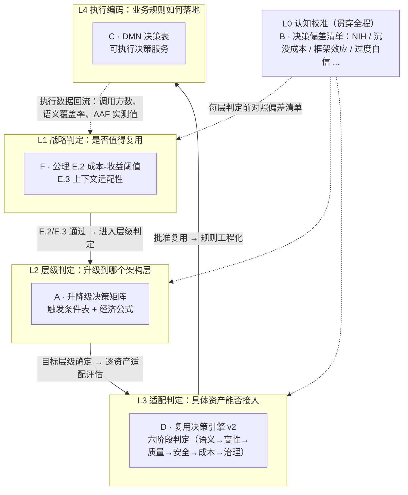
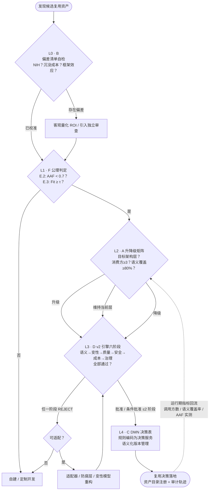

# 统一复用决策模型（Unified Reuse Decision Model）

> **版本**: 2026-07-12
> **定位**: 终结项目内五套复用决策机制（公理化判定、升降级矩阵、复用决策引擎 v2、DMN 决策表、认知决策理论）并存割裂的问题，将其统一为同一决策栈的不同层级
> **阈值单一事实源**: [`struct/99-reference/tools/threshold-registry.yaml`](../../99-reference/tools/threshold-registry.yaml)

---

## 1. 问题陈述：五套机制的割裂现状

**定义**：统一复用决策模型（Unified Reuse Decision Model, URDM）是将项目内既有的五套复用决策机制，按"判定对象与决策粒度"重新组织为一个五层决策栈（L0–L4）的元模型。它不引入新的阈值、不替换任何既有机制，而是规定每套机制在决策栈中的层级、输入输出契约与接口关系，使"发现一个候选资产"到"复用决策落地"存在唯一、无歧义的判定路径。

割裂现状（统一前）：

| 机制 | 位置 | 问题 |
|------|------|------|
| A. 升降级决策矩阵 | [`upgrade-downgrade-matrix.md`](./upgrade-downgrade-matrix.md) | 有触发条件与决策流程，但只回答"升到哪层"，不回答"值不值得复用" |
| B. 认知决策理论 | [`decision-theory-reuse.md`](../../08-cognitive-architecture/04-decision-making/decision-theory-reuse.md) | 有自己的复用决策树，与 A 零交叉引用，MAUT 权重与公理 E.3 权重并存 |
| C. DMN 决策表 | [`bpmn-dmn-reuse-orchestration.md`](../../02-business-architecture-reuse/06-bpmn-dmn/bpmn-dmn-reuse-orchestration.md) | 可执行决策表，但与 A/B/F 零连接，业务规则与技术判定脱节 |
| D. 复用决策引擎 v2 | [`reuse-decision-tool-v2/README.md`](../../99-reference/tools/reuse-decision-tool-v2/README.md) | 六阶段判定可执行，但 AAF<0.7 与公理 E.2 θ=0.7 是同一阈值的两份拷贝 |
| F. 公理化判定规则 | [`axiom-system.md`](../../01-meta-model-standards/06-formal-axioms/axiom-system.md) | E.2/E.3 给出形式化判定，但无落地流程，与 A–D 无接口 |

---

## 2. 分层决策架构

五套机制不是五个并列的"决策框架"，而是同一决策栈的五个层级。判定粒度自上而下递减：从"是否值得复用"（战略）到"规则如何编码"（执行）。

各层职责：

- **L1 战略判定（F · 公理体系）**：回答"该资产在该上下文复用是否理性"。判定式为公理 E.2（$C_{reuse}/C_{build} < \theta$，θ 见 `THR-ECON-AAF-FLOOR`）与 E.3（$\mathrm{Fit}(a,ctx) \geq \tau$，权重 0.5/0.3/0.2，见 `THR-FIT-TAU`）。任一不满足 → 判定"自建/定制"，流程终止。
- **L2 层级判定（A · 升降级矩阵）**：回答"资产应治理在哪个架构层（功能/组件/应用服务/业务服务）"。依据消费方数量（`THR-LAYER-MIN-CONSUMERS`）、语义覆盖率（`THR-LAYER-SEMANTIC-COVERAGE`）、技术栈兼容性（`THR-LAYER-TECH-COMPAT`）、AI 置信度 γ（`THR-LAYER-AI-CONFIDENCE`）与升级 ROI（`THR-ECON-ROI-UPGRADE`）决定升级/维持/降级。
- **L3 适配判定（D · v2 引擎六阶段）**：回答"这个具体资产能否接入当前系统"。六阶段顺序执行：语义兼容性 → 变性绑定 → 质量达标 → 安全合规 → 成本收益 → 治理合规；任一阶段 REJECT 即拒绝复用，条件通过阶段数上限见 `THR-ENGINE-MAX-CONDITIONAL-PHASES`。其中阶段 5 的 AAF 判定即 L1 公理 E.2 的可执行实例，二者共用 `THR-ECON-AAF-FLOOR`。
- **L4 执行编码（C · DMN 决策表）**：回答"复用相关的业务规则如何落地与演进"。将 L1–L3 的判定结果与业务规则（定价、信用、合规检查）编码为 DMN 决策表，以 Decision-as-a-Service 方式被 BPMN 流程调用，实现"规则变更不重部署流程"。
- **L0 认知校准（B · 决策理论）**：贯穿 L1–L4 的横向层。每一层判定前对照认知偏差清单（NIH、沉没成本、可得性启发、确认偏误、过度自信、群体思维），并以 MAUT 作为 L1 多属性打分时的偏差对冲手段——MAUT 的"属性×权重"结构与公理 E.3 的 Fit 分解同构，权重以 `THR-FIT-TAU` 登记值为准。

---

## 3. 机制映射表

| 机制 | 层级 | 输入 | 输出 | 核心阈值（registry id） | 何时使用 | 与其他机制的接口 |
|------|------|------|------|--------------------------|----------|------------------|
| **F** 公理化判定（E.2/E.3） | L1 战略判定 | 候选资产成本画像（AAF、NPV）、上下文画像（语义/技术/组织适配） | 复用/自建的理性判定 + Fit 分数 | `THR-ECON-AAF-FLOOR` (θ=0.7)、`THR-ECON-NPV-MIN`、`THR-FIT-TAU` (τ≥0.7, 权重 0.5/0.3/0.2) | 发现候选资产后的第一道门；投资评审 | → A：E.2/E.3 通过才进入层级判定；→ D：E.2 实例化为引擎阶段 5，E.3 实例化为阶段 1–2 |
| **A** 升降级决策矩阵 | L2 层级判定 | 消费方数量、语义覆盖率、技术栈兼容性、AI 置信度、安全等级、经济公式结果 | 升级/维持/降级决策 + 目标层级 + 治理动作 | `THR-LAYER-MIN-CONSUMERS` (≥3)、`THR-LAYER-SEMANTIC-COVERAGE` (≥0.8)、`THR-LAYER-TECH-COMPAT` (≥0.8/<0.5 降级)、`THR-LAYER-AI-CONFIDENCE` (γ≥0.8)、`THR-ECON-ROI-UPGRADE` (≥1.5) | 资产复用范围跨越当前层级边界时；定期资产盘点 | ← F：以 E.2 经济判定为前提；→ D：升级目标层级确定后由引擎逐资产验证；→ C：升降级触发条件可编码为 DMN 规则 |
| **D** 复用决策引擎 v2 | L3 适配判定 | 资产画像（RRL、成熟度、许可证、SLSA、AAF、NPV）+ 上下文画像 | 批准/条件批准/拒绝 + 置信度评分 + 风险登记 + 升级/降级路径建议 | `THR-ECON-AAF-FLOOR` (<0.7)、`THR-ENGINE-PHASE-PASS` (≥70)、`THR-ENGINE-PHASE-CONDITIONAL` (≥50)、`THR-ENGINE-MAX-CONDITIONAL-PHASES` (≤2) | 具体资产接入前的强制门禁（CLI/Web 可执行） | ← F：阶段 5 是 E.2 的可执行实例，阶段 1–2 是 E.3 的可执行实例；→ A：引擎输出的升级/降级路径建议回流升降级矩阵；→ C：批准结果生成决策卡片供 DMN 引用 |
| **C** DMN 决策表 | L4 执行编码 | L1–L3 的判定结论、业务规则（定价/信用/合规）、决策输入数据 | 可执行决策服务（Decision-as-a-Service）+ 审计轨迹 | 复用上层全部阈值，禁止在 DMN 中硬编码未登记阈值 | 复用决策需要业务人员可维护、可热更新、可审计时 | ← A/D：将触发条件与判定规则编码为决策表；→ B：规则可解释性降低决策者认知负荷 |
| **B** 认知决策理论 | L0 认知校准（横向） | 各层判定中的决策场景与呈现方式 | 偏差识别结果 + 缓解措施 + MAUT 结构化打分 | 无独立阈值；MAUT 权重引用 `THR-FIT-TAU` 的 E.3 权重 | 每一层判定前；决策评审会议；框架效应敏感的汇报场景 | → F/A/D/C：为各层提供偏差清单与决策卫生（decision hygiene）检查 |

---

## 4. 统一判定流程

流程要点：

1. **L0 先行**：任何一层判定前先做偏差自检；发现偏差时用量化 ROI、独立审查、红队挑战对冲，不阻塞流程但须记录。
2. **L1 是总闸门**：公理 E.2/E.3 不满足时，后续层级无需评估——这是"不应复用"的形式化判据。
3. **L2 与 L3 可迭代**：升降级矩阵给出目标层级后，v2 引擎可能因安全/质量阶段 REJECT 而否决；此时回到适配器方案而非强行复用。
4. **L4 是唯一执行面**：所有需业务可维护的判定规则（含升降级触发条件本身）最终编码为 DMN 决策服务，保证"业务批准的规则与生产运行的规则一致"。
5. **闭环回流**：运行期指标（消费方数量、语义覆盖率、实测 AAF）回流 L2，触发周期性的升降级再评估。

---

## 5. 阈值一致性声明

1. **单一事实源**：本模型及五套机制引用的全部数值阈值，以 [`struct/99-reference/tools/threshold-registry.yaml`](../../99-reference/tools/threshold-registry.yaml) 为唯一登记处，按 id（如 `THR-ECON-AAF-FLOOR`）引用。
2. **禁止重复硬编码**：公理 E.2 的 θ=0.7 与 v2 引擎的 AAF<0.7 是同一阈值（`THR-ECON-AAF-FLOOR`）；升降级矩阵的"语义覆盖≥80%"与 §7.5 反例的语义一致性要求是同一阈值（`THR-LAYER-SEMANTIC-COVERAGE`）。任何文档或代码新增/修改阈值，必须先更新登记表。
3. **变更治理**：阈值变更属于架构治理委员会决策事项，须附实证依据（如 COCOMO II / NASA RRL 数据）并同步更新所有引用方。

---

## 6. 示例与反例

### 6.1 正向示例：推荐算法从发现到落地的全栈判定

**背景**：某电商平台数据团队发现内部"推荐算法"工具函数已被 3 个项目复制使用，提案复用。

| 步骤 | 层级 | 判定 | 结果 |
|------|------|------|------|
| 偏差自检 | L0 · B | 团队存在 NIH 倾向（"别人的推荐逻辑不适合我们"） | 要求量化自建 vs 复用 ROI，引入平台团队独立审查 |
| 战略判定 | L1 · F | 实测 AAF=0.3 < 0.7（`THR-ECON-AAF-FLOOR`）；Fit=0.82 ≥ τ=0.7（`THR-FIT-TAU`） | 通过：复用是理性选择 |
| 层级判定 | L2 · A | 消费方 3 个（≥`THR-LAYER-MIN-CONSUMERS`），语义覆盖率 85%（≥0.8） | 触发升级：功能 → 共享组件 |
| 适配判定 | L3 · D | v2 引擎六阶段全通过，得分 88 | 批准复用 |
| 执行编码 | L4 · C | 将"推荐位准入规则"编码为 DMN 决策表，业务可热更新 | 决策服务上线，规则变更无需重部署 |

两年后运行期指标回流：5+ 系统调用、跨部门使用 → L2 再评估，升级为业务服务（与升降级矩阵中"算法→平台服务"案例路径一致）。

### 6.2 反例：跳过 L1 直接上 L3 的"带病复用"

**背景**：某团队发现一个开源工作流引擎功能匹配，直接用 v2 决策工具（L3）评估：语义、质量、安全阶段均通过，于是接入生产。

**问题**：

1. **跳过 L1**：事后核算 AAF=0.85 > 0.7——该引擎的领域模型与本方差异大，改编成本接近自研，公理 E.2 早已判定不经济；
2. **跳过 L0**：团队陷入沉没成本偏差，已投入 2 个月适配后不愿退出；
3. **跳过 L2**：未评估目标治理层级，按"业务服务"标准做 SLA 治理，而实际仅 2 个消费方，治理过载（与升降级矩阵 §7.5 反例同构）。

**后果**：18 个月后维护成本超过自研基线，被迫下线重写。

**避免方法**：严格按 L0→L1→L2→L3→L4 顺序执行；L1 判定前置到资产发现阶段，v2 引擎（L3）不得作为"是否值得复用"的唯一依据——它回答"能否接入"，不回答"值不值得"。

---

## 7. 分析：为什么是分层而非合并

**分析**：五套机制看似重叠（都有"决策树/判定流程"），实则判定对象不同：公理判定"复用命题"的真伪（L1），矩阵判定"治理层级"的归属（L2），引擎判定"具体接入"的可行性（L3），DMN 判定"规则执行"的编码（L4），认知理论判定"决策者"的可靠性（L0）。合并为单一机制会迫使一个工具同时处理战略、战术、执行与人因四个抽象层次，违反单一职责；分层后每层保持简单，层间以显式输入/输出契约衔接。这一结构与公理体系 M.3（层次不可约）一致：L1 的经济判定不可还原为 L3 的规则评分，反之亦然。因此统一的方式是**定序与定接口**，而非**合并与替代**。

---

## 权威来源与交叉引用

> **权威来源**:
>
> | 来源 | URL | 核查日期 |
> |------|-----|----------|
> | COCOMO II Model Definition Manual (USC) — AAF 复用成本模型 | <http://csse.usc.edu/csse/research/COCOMOII/cocomo_main.html> | 2026-07-12 |
> | Wikipedia — Decision Model and Notation | <https://en.wikipedia.org/wiki/Decision_Model_and_Notation> | 2026-07-12 |
> | Wikipedia — Prospect Theory | <https://en.wikipedia.org/wiki/Prospect_theory> | 2026-07-12 |
> | Wikipedia — Multiple-criteria decision analysis (MAUT) | <https://en.wikipedia.org/wiki/Multiple-criteria_decision_analysis> | 2026-07-12 |
> | ISO/IEC 21838-3:2023 — Top-level ontologies (DOLCE DnS) | <https://www.iso.org/standard/71954.html> | 2026-07-12 |

> **交叉引用**:
>
> - 升降级决策矩阵（L2）：[`struct/06-cross-layer-governance/06-up-downgrade-matrix/upgrade-downgrade-matrix.md`](./upgrade-downgrade-matrix.md)
> - 认知决策理论（L0）：[`struct/08-cognitive-architecture/04-decision-making/decision-theory-reuse.md`](../../08-cognitive-architecture/04-decision-making/decision-theory-reuse.md)
> - BPMN/DMN 复用编排（L4）：[`struct/02-business-architecture-reuse/06-bpmn-dmn/bpmn-dmn-reuse-orchestration.md`](../../02-business-architecture-reuse/06-bpmn-dmn/bpmn-dmn-reuse-orchestration.md)
> - 复用决策引擎 v2（L3）：[`struct/99-reference/tools/reuse-decision-tool-v2/README.md`](../../99-reference/tools/reuse-decision-tool-v2/README.md)
> - 公理化判定规则（L1）：[`struct/01-meta-model-standards/06-formal-axioms/axiom-system.md`](../../01-meta-model-standards/06-formal-axioms/axiom-system.md)
> - 阈值登记表（单一事实源）：[`struct/99-reference/tools/threshold-registry.yaml`](../../99-reference/tools/threshold-registry.yaml)
> - 跨层复用治理框架：[`struct/06-cross-layer-governance/01-process-governance/cross-layer-governance.md`](../01-process-governance/cross-layer-governance.md)
> - 复用度量指标体系：[`struct/06-cross-layer-governance/05-metrics-kpi/metrics-framework.md`](../05-metrics-kpi/metrics-framework.md)

---

> 最后更新: 2026-07-12
