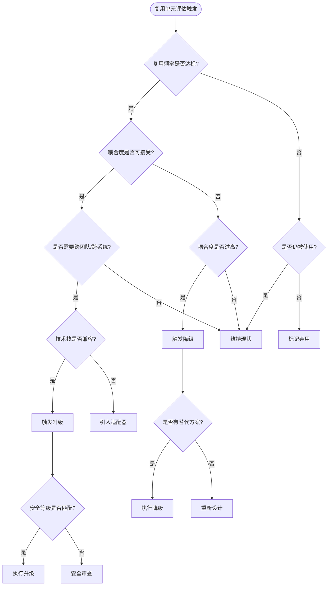
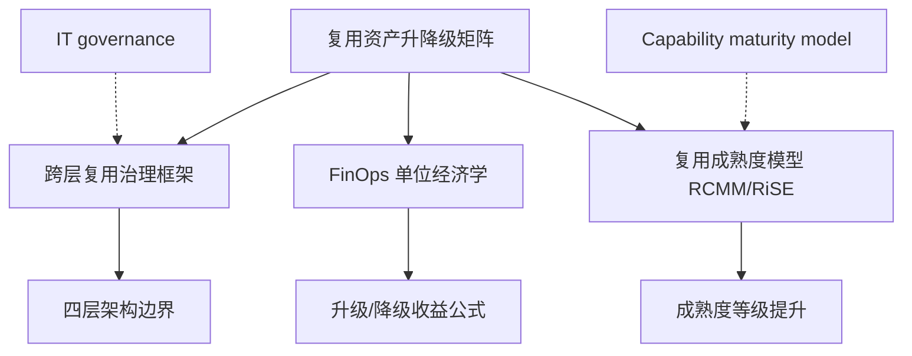
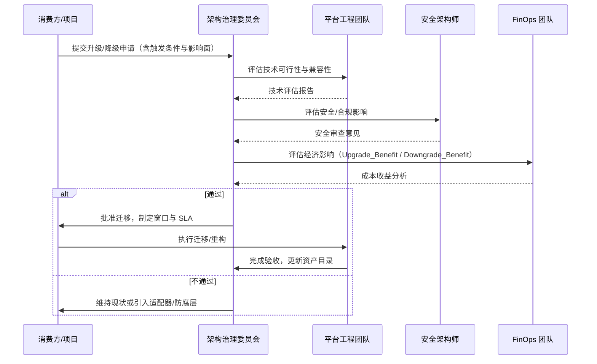

# 跨层复用升级/降级决策矩阵

> **版本**: 2026-06-06
> **定位**: 定义功能、组件、应用服务、业务服务四层之间的升级和降级触发条件与治理动作

---

## 升级矩阵

| 触发条件 | 升级方向 | 治理动作 | 风险等级 | 关键指标 |
|----------|----------|----------|----------|----------|
| 功能被 3+ 应用调用 | 功能 → 应用服务 | 提取 API，定义契约，部署独立服务 | 中 | 调用方数量 ≥ 3 |
| 组件被 3+ 系统使用 | 组件 → 共享组件 | 组件仓库化，版本管理，兼容性矩阵 | 中 | 使用系统数 ≥ 3 |
| 业务服务跨部门使用 | 应用服务 → 业务服务 | 企业服务总线/API 治理，SLA 定义 | 高 | 跨部门调用 ≥ 1 |
| 算法被 5+ 项目复用 | 算法 → 标准库/公共包 | 提取为独立库，文档化，性能基准 | 低 | 项目引用数 ≥ 5 |
| Prompt 模板被 3+ Agent 使用 | Prompt → 共享 MCP Prompt | MCP Server 化，版本管理 | 中 | 使用 Agent 数 ≥ 3 |
| RAG 管道被 2+ 业务场景使用 | RAG → 平台服务 | 向量数据库统一，知识图谱接入 | 高 | 业务场景数 ≥ 2 |

---

## 降级矩阵

| 触发条件 | 降级方向 | 治理动作 | 风险等级 | 关键指标 |
|----------|----------|----------|----------|----------|
| 复用导致耦合度过高 | 业务服务 → 应用服务 | 服务拆分，领域驱动，防腐层 | 高 | 调用方变更影响范围 > 30% |
| 技术栈差异过大 | 组件 → 功能封装 | 适配器模式，防腐层，多语言绑定 | 中 | 目标技术栈兼容性 < 50% |
| AI 功能确定性不足 | AI 功能 → 规则引擎 | 混合推理，人在回路，概率契约降级 | 高 | 置信度 γ < 0.8 |
| 变性绑定冲突 | 运行期 → 配置期 | 重构变性模型，简化配置空间 | 中 | 配置冲突数 ≥ 5 |
| 安全等级不匹配 | 共享组件 → 隔离组件 | 安全加固，独立部署，访问控制 | 极高 | 目标安全等级 > 组件认证等级 |
| 性能要求无法通过共享满足 | 应用服务 → 本地功能 | 内嵌实现，缓存优化，异步化 | 中 | 延迟要求 < 共享服务 P99 |

---

## 升级/降级决策流程



---

## 案例：从算法到平台服务的升级路径

### 背景

某电商平台的"推荐算法"最初作为项目内的工具函数存在。

### 升级历程

| 阶段 | 时间 | 状态 | 触发条件 | 治理动作 |
|------|------|------|---------|---------|
| **L1 算法** | 2024-Q1 | 项目内函数 | 单一项目使用 | 无 |
| **L2 函数** | 2024-Q3 | 共享库 | 3个项目复用 | 提取为 `recommendation-utils` 包 |
| **L3 服务** | 2025-Q1 | 内部服务 | 5个系统调用 | 部署为 gRPC 服务，定义 SLA |
| **L4 平台** | 2025-Q4 | 平台能力 | 跨部门使用 + AI 增强 | 纳入 IDP，提供 MCP Tool 接口 |
| **L5 业务服务** | 2026-Q2 | 企业资产 | 子公司接入 | 企业服务总线注册，计费模型 |

### 关键决策点

- **2024-Q3 升级**: AAF = 0.3（提取成本低），ROI 为正
- **2025-Q1 升级**: 性能要求（P99 < 50ms）推动服务化，独立扩缩容
- **2025-Q4 升级**: AI 团队需要接入 LLM 增强推荐，MCP Tool 化降低集成成本
- **2026-Q2 升级**: 合规要求（数据主权）推动平台化治理

---

## 案例：从共享组件到隔离组件的降级

### 背景

某金融平台的"支付网关组件"最初作为共享库供多个系统使用。

### 降级触发

- **安全事件**: 2025 年渗透测试发现共享组件存在高危漏洞
- **合规要求**: PCI DSS 4.0 要求支付处理环境与其他系统物理/逻辑隔离
- **影响范围**: 共享组件的漏洞修复需要协调 12 个系统的升级窗口

### 降级决策

| 维度 | 升级前 | 降级后 |
|------|--------|--------|
| 部署模式 | 共享库（同进程） | 独立微服务（容器隔离） |
| 通信方式 | 函数调用 | gRPC + mTLS |
| 版本策略 | 单版本强制升级 | 多版本共存，灰度发布 |
| 安全边界 | 进程内 | 网络隔离 + 零信任 |
| 运维成本 | 低（单制品） | 高（独立生命周期） |
| 合规等级 | 不满足 PCI DSS | 满足 PCI DSS + 安全审计 |

### 决策依据

- 虽然运维成本增加，但**合规风险成本**（潜在罚款 + 声誉损失）远高于降级成本
- 降级后，各系统可独立演进，减少了协调摩擦

---

## 升级/降级的经济分析

```text
升级决策公式:
  Upgrade_Benefit = (N_future - N_current) × (C_rebuild - C_reuse_future) - C_upgrade

  若 Upgrade_Benefit > 0 且 Risk(Upgrade) < Risk_Threshold → 执行升级

降级决策公式:
  Downgrade_Benefit = Risk_Reduction + Flexibility_Gain - C_downgrade - C_future_replicate

  若 Downgrade_Benefit > 0 → 执行降级
```

### 关键经济假设

| 假设 | 值 | 来源 |
|------|-----|------|
| 平均功能重建成本 | 8-40 人时 | COCOMO II 基准 |
| 共享化带来的单次节省 | 30-70% | NASA RRL 实证 |
| 升级工程成本 | 40-200 人时 | 项目经验数据 |
| 降级工程成本 | 20-100 人时 | 项目经验数据 |
| 安全事件期望成本 | $4.45M (2024 均值) | IBM Cost of Data Breach |

---

> **对齐验证**:
>
> - 升级矩阵对照 ISO/IEC 26566:2026 成熟度转换指南验证
> - 降级矩阵对照 Netflix/CNCF 服务拆分最佳实践验证
> - 经济分析对照 COCOMO II (USC) 和 NASA RRL 成本模型验证
>
> 最后更新: 2026-06-06
| 业务语义漂移 | 业务服务 → 应用服务 | 领域重新划分，业务能力重新定义 | 高 | 语义覆盖率 < 80% |

---

## 决策流程图

```
跨层复用决策流程
│
├── 1. 识别触发条件
│   ├── 调用方数量增长？→ 考虑升级
│   ├── 耦合度/变更影响恶化？→ 考虑降级
│   ├── 安全/合规要求变化？→ 考虑降级/隔离
│   └── 技术栈/语义不兼容？→ 考虑降级/适配
│
├── 2. 评估升级/降级收益
│   ├── 直接收益: 开发成本节约
│   ├── 间接收益: 维护成本降低、缺陷率降低
│   ├── 战略收益: 上市时间、生态价值
│   └── 风险成本: 迁移风险、兼容性风险、安全风
│
├── 3. 选择目标层级
│   ├── 升级: 确保目标层级的治理能力已就绪
│   └── 降级: 确保降级不会引入新的重复造轮子
│
├── 4. 执行治理动作
│   ├── 定义/更新接口契约
│   ├── 迁移/重构实现
│   ├── 更新文档和培训材料
│   └── 通知所有利益相关者
│
└── 5. 监控与反馈
    ├── 跟踪关键指标变化
    ├── 收集使用者反馈
    └── 必要时二次调整
```

---

## 层级边界判定规则

| 层级 | 粒度 | 典型边界判定 |
|------|------|-------------|
| **功能** | 函数/算法/规则 | 单一职责，无跨业务语义 |
| **组件** | 库/包/模块 | 可被多个应用链接/导入 |
| **应用服务** | API/微服务 | 跨应用调用，需要独立部署 |
| **业务服务** | 业务能力接口 | 跨部门/跨组织复用，需要 SLA 治理 |

> **判定原则**: 当资产的复用范围跨越当前层级的典型边界时，触发升级评估；当资产的维护成本或风险超过当前层级治理能力时，触发降级评估。

---

## 7. 复用资产升降级决策框架的深层定义

### 7.1 概念定义

**定义**：复用资产升降级决策矩阵（Reuse Asset Upgrade/Downgrade Matrix）是一套基于触发条件、风险等级、经济指标与治理能力，判断可复用资产应在四层架构（功能 → 组件 → 应用服务 → 业务服务）中向上升级或向下降级的结构化决策框架。它与 Wikipedia 中 [Capability maturity model](https://en.wikipedia.org/wiki/Capability_Maturity_Model) 所强调的过程成熟度提升逻辑一致：升级意味着资产治理成熟度提升，降级则是在成熟度不匹配时回归可控层级。

### 7.2 升降级核心属性

| 属性 | 说明 | 重要性 | 可观察性 |
|------|------|--------|----------|
| **触发条件（Trigger）** | 引发升级或降级评估的量化或质性事件 | 高 | 调用方数量、耦合度、合规要求 |
| **目标层级（Target Layer）** | 升级或降级后的期望治理层级 | 高 | 功能/组件/应用服务/业务服务 |
| **治理动作（Governance Action）** | 为完成层级迁移必须执行的过程与工件 | 高 | API 契约、版本策略、SLA、安全边界 |
| **风险等级（Risk Level）** | 迁移过程对现有系统的影响程度 | 高 | 低/中/高/极高 |
| **经济指标（Economic Metric）** | 支持决策的成本/收益量化依据 | 中 | Upgrade_Benefit、Downgrade_Benefit |
| **兼容性约束（Compatibility Constraint）** | 技术栈、安全等级、语义范围的可接受差异 | 中 | 兼容性百分比、认证等级 |

### 7.3 与相关概念的关系



- **上位概念**：跨层复用治理框架、IT governance；
- **下位概念**：升级矩阵、降级矩阵、触发条件、兼容性评估；
- **等价/映射概念**：ISO/IEC 26566:2026 成熟度转换指南、Netflix 服务拆分决策框架；
- **依赖概念**：复用率、耦合度、SLA、安全等级、FinOps 单位成本。

### 7.4 正例：支付中台从应用服务升级为业务服务

**背景**：某金融科技公司的"支付中台"最初以应用服务形式服务于 3 个内部产品线。

**触发条件**：

- 调用方数量：从 3 个增长到 11 个内部及外部子公司系统；
- 合规要求：PCI DSS 4.0 要求支付能力作为企业级服务统一治理；
- 业务语义：支付能力已成为公司对外输出的核心业务能力。

**升级动作**：

1. 将支付中台注册为企业服务总线（ESB）上的业务服务；
2. 定义跨组织的 SLA（可用性 99.99%，RTO < 5 分钟）；
3. 建立计费模型：按交易笔数向子公司 chargeback；
4. 引入独立安全域、零信任网络与审计日志。

**效果**：

- 外部子公司接入周期从 3 个月缩短到 2 周；
- 支付相关合规审计一次性通过；
- 支付中台从成本中心转变为收入中心。

### 7.5 反例：过早升级导致组织级耦合灾难

**背景**：某制造企业将仅在 2 个项目中使用的"设备状态监控"组件强制升级为业务服务。

**问题**：

1. **语义不稳定**：不同工厂对"设备状态"的定义差异巨大（温度、振动、能耗、OEE）；
2. **治理过载**：业务服务要求统一的 SLA 和变更窗口，但 2 个消费方的需求节奏完全不同；
3. **变更冻结**：一次小的字段调整需要协调所有消费方，导致版本发布周期从 2 周延长到 2 个月。

**后果**：

- 消费方开始绕过业务服务，自建本地实现；
- 升级后的业务服务沦为"幽灵服务"，维护成本持续存在但采用率下降；
- 1 年后被迫降级回应用服务层，并拆分为多个领域专用服务。

**避免方法**：

- 严格遵循"3+ 消费方"或"跨部门/跨组织"触发条件；
- 升级前进行业务语义一致性评估（语义覆盖率 ≥ 80%）；
- 采用渐进式升级：先在应用服务层稳定运行 2–3 个季度，再评估业务服务化。

### 7.6 反例：忽视降级导致安全合规事件

**背景**：某电商平台将用户身份认证组件作为共享库被 40+ 微服务引用。

**触发条件**：

- 安全团队发现共享库存在高危漏洞（CVSS 9.8）；
- 修复需要协调 40+ 微服务同时升级，窗口难以排期；
- 合规审计要求认证逻辑必须隔离部署。

**应做未做**：

- 架构委员会认为"共享库提升效率"，拒绝降级为独立服务；
- 未建立多版本共存机制；
- 未准备应急响应降级方案。

**后果**：

- 漏洞暴露窗口长达 6 周；
- 某外部攻击者利用该漏洞实施账户接管，造成品牌与合规双重损失；
- 事后紧急降级为独立认证服务，但已付出 10 倍于预防性降级的成本。

**避免方法**：

- 当安全等级要求超过共享组件认证等级时，立即触发降级；
- 对关键安全组件预设"隔离降级"应急预案；
- 建立安全事件驱动的快速降级通道（绿色通道审批）。

### 7.7 选型决策矩阵：升级还是维持/降级？

| 评估维度 | 升级倾向 | 降级/维持倾向 |
|----------|----------|---------------|
| 消费方数量 | ≥ 3 个内部团队或 ≥ 1 个外部组织 | < 3 个团队，且无增长趋势 |
| 业务语义一致性 | ≥ 80% 场景语义一致 | 语义漂移严重，差异 > 30% |
| 技术栈兼容性 | ≥ 80% 消费方技术栈兼容 | 兼容性 < 50%，适配成本过高 |
| 安全/合规要求 | 需要统一认证、审计、隔离 | 消费方安全等级差异大 |
| 经济指标 | Upgrade_Benefit > 0 且 ROI ≥ 150% | Downgrade_Benefit > 0 或风险不可控 |
| 治理能力 | 目标层级治理角色、SLA、预算已就绪 | 目标层级治理能力缺失 |

### 7.8 升级/降级治理流程泳道图



---

> 最后更新: 2026-06-06


---

## 权威来源与交叉引用

> **权威来源**:
>
> | 来源 | URL | 核查日期 |
> |------|-----|----------|
> | Wikipedia — Capability Maturity Model | <https://en.wikipedia.org/wiki/Capability_Maturity_Model> | 2026-07-07 |
> | Wikipedia — IT governance | <https://en.wikipedia.org/wiki/IT_governance> | 2026-07-07 |
> | ISO/IEC 26566:2026 — Software product lines — Reuse process assessment and maturity framework | <https://www.iso.org/standard/43092.html> | 2026-07-07 |
> | ISO/IEC 26565:2026 — Software and systems product line engineering — Maturity model | <https://www.iso.org/standard/43091.html> | 2026-07-07 |
> | CNCF — Service Mesh Interface (SMI) and Microservices Governance | <https://www.cncf.io/projects/> | 2026-07-07 |
> | Netflix Tech Blog — Mastering Chaos: A Netflix Guide to Microservices | <https://netflixtechblog.com/tagged/microservices> | 2026-07-07 |

> **交叉引用**:
>
> - 跨层复用治理框架：[`struct/06-cross-layer-governance/01-process-governance/cross-layer-governance.md`](../01-process-governance/cross-layer-governance.md)
> - FinOps 单位经济学：[`struct/06-cross-layer-governance/04-finops-cost/finops-unit-economics-2026.md`](../04-finops-cost/finops-unit-economics-2026.md)
> - 复用度量指标体系：[`struct/06-cross-layer-governance/05-metrics-kpi/metrics-framework.md`](../05-metrics-kpi/metrics-framework.md)
> - 复用成熟度模型：[`struct/06-cross-layer-governance/03-maturity-models/reuse-maturity-models-rcmm-rise.md`](../03-maturity-models/reuse-maturity-models-rcmm-rise.md)

---

## 补充说明：跨层复用升级/降级决策矩阵

## 概念定义

**定义**：升级/降级矩阵是用于判断可复用资产应从项目级提升到组织级，或从组织级降级到项目级/退役的决策框架。

## 反例

**反例**：某组件仅被 1 个团队使用却被强制提升为组织标准，导致其他团队被迫承担不必要的依赖与变更成本。

## 权威来源

> **权威来源**:
>
> - [Wikipedia — Capability Maturity Model](https://en.wikipedia.org/wiki/Capability_Maturity_Model)
> - [Wikipedia — IT governance](https://en.wikipedia.org/wiki/IT_governance)
> - [ISO/IEC 26566:2026](https://www.iso.org/standard/43092.html)
> - 核查日期：2026-07-07
