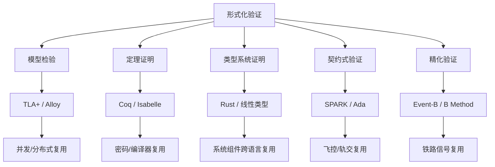

# 07 形式化验证与复用正确性

> **定位**：将复用组件的正确性保证从“测试验证”提升到“数学证明”的最高等级，确保高价值、高风险的复用资产在多系统、多团队中继承可验证的性质。

---

## 1. 概念定义

**形式化验证（Formal Verification）** 指使用数学方法（逻辑、自动机、类型论、集合论等）严格证明系统模型满足给定规约的过程。与测试只能证明“存在错误”不同，形式化验证在模型范围内可以证明“不存在违反规约的行为”。

| 方法 | 核心思想 | 典型工具 |
|------|----------|----------|
| **TLA+** | 时序逻辑动作（TLA）描述状态与状态迁移，模型检验穷举状态空间 | TLC, Apalache |
| **Alloy** | 关系一阶逻辑 + SAT 求解，在小范围内寻找反例 | Alloy Analyzer |
| **Coq/Isabelle** | 交互式定理证明，从公理出发构造机器可检查证明 | Coq/Rocq, Isabelle/HOL |
| **Rust 类型系统** | 所有权、借用、生命周期在编译期排除数据竞态与悬垂指针 | rustc, Miri, Kani |
| **SPARK/Ada** | 契约式编程 + 形式化验证，可达 DO-178C A 级 | SPARK Pro, GNATprove |
| **B Method/Event-B** | 基于集合论与精化演算，从抽象规约逐步精化到实现 | Atelier B, Rodin |

**形式化复用资产** 是指附带可验证契约（前置条件、后置条件、不变式、精化关系）的组件；其消费方在满足契约的前提下可继承已证明的性质。

---

## 2. 方法谱系与关系图

---

## 3. 正向示例

### 示例 1：TLA+ 验证分布式支付服务

某支付中台使用 TLA+ 描述“扣款-记账”流程，定义账户总额守恒不变式；TLC 模型检验器穷举并发场景后确认无重复记账。该服务被 10+ 业务系统复用时，其原子性保证无需各消费方重新测试。

### 示例 2：Alloy 发现微服务授权越权路径

安全架构师用 Alloy 对 RBAC 授权模型建模，声明“每个请求必须关联有效角色”约束；Alloy Analyzer 在 5 秒内生成角色继承导致的越权反例，修复后在多服务复用同一授权模型时避免安全漏洞。

### 示例 3：SPARK 验证飞控软件

Airbus A380 飞控团队使用 SPARK/Ada 证明“襟翼控制函数在任意输入下不会越界”，并满足 DO-178C A 级要求。该软件作为高可信组件被后续机型复用，仅需针对新机型的配置参数重新验证。

### 示例 4：Rust 所有权保证跨语言复用

某跨平台网络库用 Rust 实现核心协议解析器，所有权系统在编译期排除数据竞态；通过 FFI 被 C/Go/Python 项目复用，无需引入垃圾回收器即可保证内存安全。

### 示例 5：Event-B 铁路信号精化链

铁路信号系统使用 Event-B 从“列车不碰撞”的高层不变式精化到联锁逻辑，每层精化均生成并证明精化义务；联锁软件复用时，安全性质不因实现细节变化而被破坏。

### 示例 6：TLA+ 验证 MCP 能力协商

在 `struct/07-formal-verification/01-tla-plus/mcp-capability-negotiation.md` 中，TLA+ 规约将 MCP 2025-03-26 初始化阶段的能力协商抽象为双端状态机，并声明 `ActiveImpliesCommonCaps` 等核心不变式。TLC 穷举 `tools`/`resources`/`prompts` 的全部能力子集组合后，在数秒内发现“双方无共同能力却进入 active”的违规轨迹。该规约可直接作为 MCP Server 实现的**可执行参考文档**，消费方在复用时无需重新验证协议层的收敛性与安全性。

---

## 4. 反例 / 失败案例

### 反例 1：仅依赖测试的并发组件复用

某团队将并发队列组件复用到金融核心系统，仅依赖单元测试与代码评审，未对内存序与边界条件进行形式化分析；生产环境出现偶发数据竞态，造成资金缺口与合规风险。

### 反例 2：滥用 Rust unsafe 未验证

开发者为实现“性能优化”在 Rust 中大量使用 unsafe 块封装指针操作，但未用 Miri 或形式化方法验证；下游多个复用项目出现未定义行为，导致安全漏洞。

### 反例 3：Event-B 精化链断裂

某地铁项目复用上一代联锁代码，但未随新功能重建精化链；新增功能破坏了“敌对进路互锁”不变式，险些造成信号冲突事故。

### 反例 4：形式化模型与实现脱节

团队用 TLA+ 验证了高层算法，但手工编码实现时偏离模型；由于未进行模型到代码的可追踪审查，生产实现仍存在模型中已排除的缺陷。

### 反例 5：验证范围不足导致“虚假安全感”

某团队使用 Alloy 检查组件依赖无环性时，为控制求解时间将 scope 设为 3，却未评估该 scope 是否覆盖生产环境的最大依赖深度。实际架构中存在 5 个组件构成的循环，Alloy 因 scope 限制未能报告反例，团队据此认为架构无环；后续构建工具在真实规模下暴露循环依赖，导致发布延期。该案例说明：**bounded model checking / SAT 求解的范围选择必须经统计或敏感性分析确认**，否则“无反例”不等于“性质成立”。

---

## 5. 形式化验证决策矩阵

| 复用场景 | 推荐方法 | 关键收益 | 主要成本 |
|----------|----------|----------|----------|
| 分布式共识/事务 | TLA+ | 发现并发边界缺陷 | 学习曲线与状态空间爆炸 |
| 授权/依赖结构 | Alloy | 快速发现结构反例 | 范围限制，非完备证明 |
| 密码/编译器 | Coq/Isabelle | 最高置信度 | 专家依赖、周期长 |
| 系统级内存安全 | Rust + Miri/Kani | 编译期保证 | unsafe 边界需额外验证 |
| 航空/轨交高安全 | SPARK/Ada, Event-B | 符合认证要求 | 工具链与过程成本高 |

---

## 6. 关键公理

> **公理 F.1**（Formal Verification Trust Transfer）：若组件 C 通过形式化方法验证了性质 P，则任何使用 C 的系统继承 P 的正确性保证，前提是 C 的使用方式不违反 C 的前置条件。

---

## 7. 权威来源

| 来源 | URL | 核查日期 |
|:---|:---|:---|
| TLA+ Home Page (Leslie Lamport) | <https://lamport.azurewebsites.net/tla/tla.html> | 2026-07-09 |
| TLA+ Foundation | <https://foundation.tlapl.us/> | 2026-07-09 |
| *Specifying Systems* (Lamport) | <https://lamport.azurewebsites.net/tla/book.html> | 2026-07-09 |
| TLA+ Examples Repository | <https://github.com/tlaplus/Examples> | 2026-07-09 |
| Alloy Tools / Alloy Analyzer 6.2.0 | <https://alloytools.org> | 2026-07-09 |
| Alloy 6 GitHub Releases | <https://github.com/AlloyTools/org.alloytools.alloy/releases> | 2026-07-09 |
| *Software Abstractions* (Daniel Jackson) | <https://alloytools.org/book.html> | 2026-07-09 |
| The Rocq Prover 9.0 | <https://rocq-prover.org/> | 2026-07-09 |
| Rocq Prover Releases | <https://rocq-prover.org/releases> | 2026-07-09 |
| Isabelle/HOL | <https://www.cl.cam.ac.uk/research/hvg/Isabelle> | 2026-07-09 |
| Archive of Formal Proofs (AFP) | <https://www.isa-afp.org/> | 2026-07-09 |
| RustBelt (Iris Project) | <https://plv.mpi-sws.org/rustbelt/> | 2026-07-09 |
| The Rust Programming Language | <https://doc.rust-lang.org/book/> | 2026-07-09 |
| The Rust RFC Book | <https://rust-lang.github.io/rfcs/> | 2026-07-09 |
| Miri — Undefined Behavior Detector | <https://github.com/rust-lang/miri> | 2026-07-09 |
| Kani Rust Model Checker | <https://model-checking.github.io/kani/> | 2026-07-09 |
| Aeneas Rust Verifier | <https://github.com/AeneasVerif/aeneas> | 2026-07-09 |
| Prusti (ETH Zurich) | <https://www.pm.inf.ethz.ch/research/prusti.html> | 2026-07-09 |
| Verus (Microsoft/CMU/Amazon) | <https://github.com/verus-lang/verus> | 2026-07-09 |
| SPARK Pro (AdaCore) | <https://www.adacore.com/sparkpro> | 2026-07-09 |
| Event-B & Rodin | <https://wiki.event-b.org/index.php/Main_Page> | 2026-07-09 |
| IEEE 1012-2024 | <https://standards.ieee.org/ieee/1012/7324/> | 2026-07-09 |
| IEEE 1012-2024 (IEEE Xplore) | <https://ieeexplore.ieee.org/document/11134780> | 2026-07-09 |
| DO-333 Formal Methods Supplement (Loonwerks/NASA) | <https://loonwerks.com/projects/do333.html> | 2026-07-09 |
| IEC 61508 Edition 3 Development | <https://61508.org/knowledge/standards-development/> | 2026-07-09 |

---

## 8. 标准条款与工具映射

| 标准 / 条款 | 本项目对应活动 | 形式化工具/方法 | 产出证据 |
|:---|:---|:---|:---|
| IEEE 1012-2024 §7 / §9（软件 V&V 管理、需求分析 V&V） | 复用资产目录与 SIL 判定 | 风险分析 + 完整性等级表 | V&V 计划、SIL 评估记录 |
| IEEE 1012-2024 §9.3（软件设计 V&V） | 架构约束建模 | Alloy / TLA+ | 模型文件、反例报告 |
| IEEE 1012-2024 §9.5（软件实现 V&V） | 组件契约证明 | Coq/Rocq、Isabelle/HOL、SPARK Pro | 证明脚本、GNATprove 报告 |
| IEEE 1012-2024 §9.6（集成测试 V&V） | 组合安全性验证 | TLA+ / Event-B 精化 | 精化义务证明 |
| DO-178C / DO-333（航电软件形式化方法补充） | 高安全组件复用 | SPARK/Ada、模型检测 | DO-333 符合性证据包 |
| DO-178C Table A-4（低层需求符合高层需求） | 规约到代码追踪 | TLA+/Alloy + 代码审查 | 需求追踪矩阵 |
| IEC 61508 SIL 4 | 铁路/工业高安全复用 | Event-B / B Method | 证明义务、安全案例 |

### 8.1 工具链版本与独立性等级映射

IEC 61508-1:2025 草案 Annex B 以及 ISO/IEC/IEEE 1012:2024 均强调：验证与确认活动的**独立性等级**应随完整性等级提升。下表将 SIL / DAL 与推荐形式化工具、证据类型进行映射，便于复用资产选型时快速定位。

| 完整性等级 | IEC 61508 / DO-178C 对应 | 独立性要求 | 推荐形式化工具/方法 | 典型证据 |
|:---|:---|:---|:---|:---|
| SIL 1 / DAL D | 低风险/轻微影响 | 同行评审 | Alloy 草模、静态分析、评审记录 | 检查单、评审报告 |
| SIL 2 / DAL C | 中风险/局部影响 | 独立部门/角色 | TLA+ / TLC、Miri、Kani（有界模型检验） | 模型检查报告、UB 检测报告 |
| SIL 3 / DAL B | 高风险/显著影响 | 独立团队/第三方 | Coq/Rocq 9.0+、Isabelle/HOL、Kani Contracts | 证明脚本、契约验证报告 |
| SIL 4 / DAL A | 极高风险/灾难性影响 | 独立组织/认证机构 | SPARK Pro、Event-B/Rodin、TLAPS、Coq/Rocq | DO-333 证据包、安全案例、精化义务证明 |

> **实践要点**：选择工具时不仅要看其表达能力，还要看**工具鉴定（tool qualification）**资料是否满足 DO-178C / DO-330 或 IEC 61508 对高完整性工具的资质要求。

---

## 9. 当前状态与关联主题

- [x] 形式化方法谱系梳理
- [x] TLA+/Alloy/Rust/SPARK/Event-B 案例与工具链
- [x] 形式化验证方法对比矩阵 (`09-comparative-matrices/`)
- [x] Docker 化验证环境 (`99-reference/tools/formal-verification-env/`)

关联主题：

- `04-component-architecture-reuse`（Rust 生态形式化）
- `10-supply-chain-security`（Rust unsafe 与供应链安全）
- `11-industrial-iot-otit`（功能安全与 IEC 61508 形式化验证）
- `12-ai-native-reuse`（概率边界与形式化契约）

## 10. 形式化验证落地检查单

在将形式化验证作为复用资产质量门控之前，团队应完成以下检查：

- [ ] 明确需要验证的性质：安全性、活性、不变式还是精化关系？
- [ ] 选择合适的形式化方法：模型检验、定理证明、类型系统还是契约式验证？
- [ ] 定义抽象层次：避免过度建模导致状态空间爆炸，也避免抽象过强遗漏关键行为。
- [ ] 建立模型与实现的可追踪性：每次代码变更需评估是否影响已验证性质。
- [ ] 准备验证工具链与持续集成脚本，确保回归验证可自动化执行。
- [ ] 培训至少两名核心工程师掌握所选工具的建模与调试能力。
- [ ] 将形式化证据纳入资产目录元数据，供消费方评估信任假设。
- [ ] 定期审计前置条件与使用约束，防止消费方违反契约导致信任传递失效。

## 11. 工具链与资源矩阵

| 工具 | 适用方法 | 学习曲线 | 工业案例 |
|------|----------|----------|----------|
| TLC / Apalache | TLA+ 模型检验 | 中等 | AWS DynamoDB, Azure Cosmos DB |
| Alloy Analyzer | Alloy 结构分析 | 低 | 多个学术与初创项目 |
| Coq/Rocq | 定理证明 | 高 | CompCert 编译器, Fiat Crypto |
| Isabelle/HOL | 定理证明 | 高 | seL4 操作系统验证 |
| GNATprove | SPARK/Ada 契约验证 | 中等 | Airbus A380, Eurofighter |
| Rodin / Atelier B | Event-B 精化 | 中等 | 巴黎地铁 14 号线, 铁路信号 |
| rustc + Miri + Kani | Rust 类型与内存安全 | 中等 | AWS, 微软基础设施 |

## 12. 常见误区

- **误区 1：形式化验证万能**。形式化验证只能保证模型满足规约，无法验证模型是否完整刻画现实需求。
- **误区 2：忽视抽象层次**。将过多实现细节纳入模型会导致状态空间爆炸，使验证不可行。
- **误区 3：模型与实现脱节**。没有追踪机制的形式化证据会在代码演进中迅速失效。
- **误区 4：低估培训成本**。缺乏训练的团队容易写出错误规约，反而产生虚假安全感。
- **误区 5：只选最贵工具**。应根据资产价值与风险选择合适方法，避免过度工程。
- **误区 6：忽视前置条件**。消费方违反契约前置条件会使已验证性质失效。
- **误区 7：一次性全面推广**。应从高价值试点开始，逐步制度化与平台化。
- **误区 8：混淆测试与证明**。测试只能抽样，证明才能在模型范围内给出完备保证。

## 13. 延伸阅读

1. **入门级**：Leslie Lamport. *Specifying Systems*，掌握 TLA+ 与 PlusCal。
2. **结构建模**：Daniel Jackson. *Software Abstractions*，学习 Alloy 关系建模。
3. **定理证明**：《Software Foundations》系列，Coq/Rocq 交互式证明训练。
4. **类型系统安全**：Jung et al. *RustBelt*，理解 Rust 所有权的形式化基础。
5. **工业案例**：Airbus SPARK 飞控、巴黎地铁 14 号线 Event-B、AWS TLA+ 验证。

持续将形式化方法融入复用实践，是构建高可信软件资产的根本路径。

## 14. 深度案例：巴黎地铁 14 号线 Event-B 联锁验证

巴黎地铁 14 号线无人驾驶系统的联锁软件采用 Event-B 进行形式化精化。项目从“列车不会碰撞”的高层安全不变式出发，逐步精化到道岔、信号与区段控制逻辑。每一层精化都生成并证明精化义务，确保抽象层的性质在实现层得到保持。

该项目的成功要素包括：

1. **early 介入**：形式化团队与领域专家从需求阶段即开始协作，避免后期返工。
2. **工具链集成**：Rodin 平台支持模型检验与证明义务管理，并提供代码生成接口。
3. **证据可复用**：联锁逻辑的核心不变式被封装为可复用资产，后续线路扩展时只需验证新增场景。
4. **组织保障**：建立了形式化方法培训、评审与独立验证角色，确保证据可信。

这一案例表明，形式化验证不仅可以发现缺陷，更能在高安全复用资产中建立跨项目的信任传递。

## 15. 关键行动项

- 识别组织中 3-5 个高价值复用资产，评估其形式化验证成熟度。
- 选择 1 个资产开展 TLA+ 或 Alloy 试点，产出第一份可验证规约。
- 将形式化证据纳入资产目录元数据模板。
- 在 CI 中集成至少一种形式化回归验证工具。
- 制定形式化方法培训计划，覆盖架构师、开发工程师与测试工程师。

## 16. 版本记录

- 2026-07-09：对齐网络权威国际化内容，扩充权威来源至 TLA+ Foundation、Rocq 9.0、Isabelle2025、Miri/Kani/Verus/Aeneas 等；新增 MCP 能力协商正向示例、验证范围不足反例；补充 IEC 61508 / DO-178C 独立性等级与工具链映射。
- 2026-07-08：增补权威来源 URL 与核查日期，增加 ISO/IEC/IEEE 1012:2024 / DO-178C / DO-333 / IEC 61508 标准条款与工具映射，对齐网络权威内容。
- 2026-07-07：补充概念定义、示例、反例、关系图、权威来源与核查日期。
- 2026-06-08：初始版本，梳理形式化方法谱系与核心文件导航。

> **注意**：形式化验证工具链版本与标准 URL 会随社区演进更新，引用前请核查权威来源页面。
