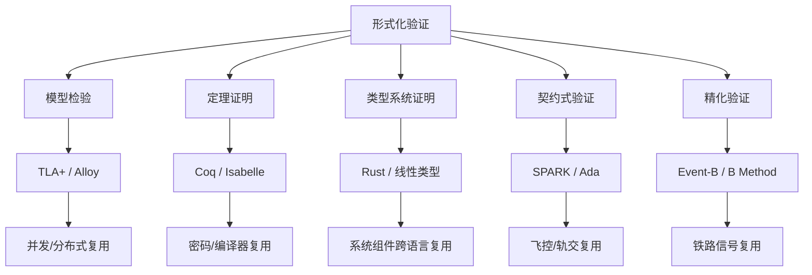

# 07 形式化验证与复用正确性

> **定位**：将复用组件的正确性保证从“测试验证”提升到“数学证明”的最高等级，确保高价值、高风险的复用资产在多系统、多团队中继承可验证的性质。

---

## 1. 概念定义

**形式化验证（Formal Verification）** 指使用数学方法（逻辑、自动机、类型论、集合论等）严格证明系统模型满足给定规约的过程。与测试只能证明“存在错误”不同，形式化验证在模型范围内可以证明“不存在违反规约的行为”。

| 方法 | 核心思想 | 典型工具 |
|------|----------|----------|
| **TLA+** | 时序逻辑动作（TLA）描述状态与状态迁移，模型检验穷举状态空间 | TLC, Apalache |
| **Alloy** | 关系一阶逻辑 + SAT 求解，在小范围内寻找反例 | Alloy Analyzer |
| **Coq/Isabelle** | 交互式定理证明，从公理出发构造机器可检查证明 | Coq, Isabelle/HOL |
| **Rust 类型系统** | 所有权、借用、生命周期在编译期排除数据竞态与悬垂指针 | rustc, Miri, Kani |
| **SPARK/Ada** | 契约式编程 + 形式化验证，可达 DO-178C A 级 | SPARK Pro, GNATprove |
| **B Method/Event-B** | 基于集合论与精化演算，从抽象规约逐步精化到实现 | Atelier B, Rodin |

**形式化复用资产** 是指附带可验证契约（前置条件、后置条件、不变式、精化关系）的组件；其消费方在满足契约的前提下可继承已证明的性质。

---

## 2. 方法谱系与关系图

---

## 3. 正向示例

### 示例 1：TLA+ 验证分布式支付服务
某支付中台使用 TLA+ 描述“扣款-记账”流程，定义账户总额守恒不变式；TLC 模型检验器穷举并发场景后确认无重复记账。该服务被 10+ 业务系统复用时，其原子性保证无需各消费方重新测试。

### 示例 2：Alloy 发现微服务授权越权路径
安全架构师用 Alloy 对 RBAC 授权模型建模，声明“每个请求必须关联有效角色”约束；Alloy Analyzer 在 5 秒内生成角色继承导致的越权反例，修复后在多服务复用同一授权模型时避免安全漏洞。

### 示例 3：SPARK 验证飞控软件
Airbus A380 飞控团队使用 SPARK/Ada 证明“襟翼控制函数在任意输入下不会越界”，并满足 DO-178C A 级要求。该软件作为高可信组件被后续机型复用，仅需针对新机型的配置参数重新验证。

### 示例 4：Rust 所有权保证跨语言复用
某跨平台网络库用 Rust 实现核心协议解析器，所有权系统在编译期排除数据竞态；通过 FFI 被 C/Go/Python 项目复用，无需引入垃圾回收器即可保证内存安全。

### 示例 5：Event-B 铁路信号精化链
铁路信号系统使用 Event-B 从“列车不碰撞”的高层不变式精化到联锁逻辑，每层精化均生成并证明精化义务；联锁软件复用时，安全性质不因实现细节变化而被破坏。

---

## 4. 反例 / 失败案例

### 反例 1：仅依赖测试的并发组件复用
某团队将并发队列组件复用到金融核心系统，仅依赖单元测试与代码评审，未对内存序与边界条件进行形式化分析；生产环境出现偶发数据竞态，造成资金缺口与合规风险。

### 反例 2：滥用 Rust unsafe 未验证
开发者为实现“性能优化”在 Rust 中大量使用 unsafe 块封装指针操作，但未用 Miri 或形式化方法验证；下游多个复用项目出现未定义行为，导致安全漏洞。

### 反例 3：Event-B 精化链断裂
某地铁项目复用上一代联锁代码，但未随新功能重建精化链；新增功能破坏了“敌对进路互锁”不变式，险些造成信号冲突事故。

### 反例 4：形式化模型与实现脱节
团队用 TLA+ 验证了高层算法，但手工编码实现时偏离模型；由于未进行模型到代码的可追踪审查，生产实现仍存在模型中已排除的缺陷。

---

## 5. 形式化验证决策矩阵

| 复用场景 | 推荐方法 | 关键收益 | 主要成本 |
|----------|----------|----------|----------|
| 分布式共识/事务 | TLA+ | 发现并发边界缺陷 | 学习曲线与状态空间爆炸 |
| 授权/依赖结构 | Alloy | 快速发现结构反例 | 范围限制，非完备证明 |
| 密码/编译器 | Coq/Isabelle | 最高置信度 | 专家依赖、周期长 |
| 系统级内存安全 | Rust + Miri/Kani | 编译期保证 | unsafe 边界需额外验证 |
| 航空/轨交高安全 | SPARK/Ada, Event-B | 符合认证要求 | 工具链与过程成本高 |

---

## 6. 关键公理

> **公理 F.1**（Formal Verification Trust Transfer）：若组件 C 通过形式化方法验证了性质 P，则任何使用 C 的系统继承 P 的正确性保证，前提是 C 的使用方式不违反 C 的前置条件。

---

## 7. 权威来源

> **权威来源**：
>
> - [TLA+ Home Page](https://lamport.azurewebsites.net/tla/tla.html) — Leslie Lamport, Microsoft
> - [Alloy Tools](https://alloytools.org) — MIT
> - [Coq Proof Assistant](https://coq.inria.fr) — Inria
> - [Isabelle/HOL](https://isabelle.in.tum.de) — TU Munich
> - [RustBelt](https://iris-project.org/rustbelt.html) — MPI-SWS / Iris Project
> - [SPARK Pro](https://www.adacore.com/sparkpro) — AdaCore
> - [Event-B](https://www.event-b.org) — Event-B Consortium
> - [Atelier B](https://www.atelierb.eu/en/) — Clearsy
> - 核查日期：2026-07-07

---

## 8. 当前状态与关联主题

- [x] 形式化方法谱系梳理
- [x] TLA+/Alloy/Rust/SPARK/Event-B 案例与工具链
- [x] 形式化验证方法对比矩阵 (`09-comparative-matrices/`)
- [x] Docker 化验证环境 (`99-reference/tools/formal-verification-env/`)

关联主题：

- `04-component-architecture-reuse`（Rust 生态形式化）
- `10-supply-chain-security`（Rust unsafe 与供应链安全）
- `11-industrial-iot-otit`（功能安全与 IEC 61508 形式化验证）
- `12-ai-native-reuse`（概率边界与形式化契约）
