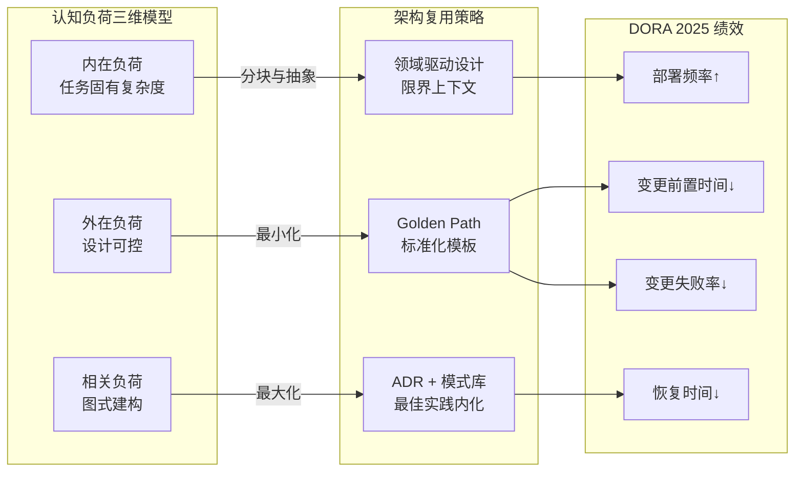
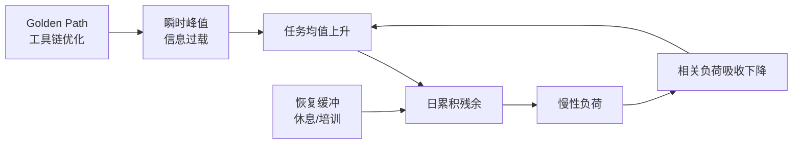

# 认知负荷理论与架构复用

> **版本**: 2026-06-06
> **定位**: 从认知科学视角解释架构复用如何降低开发者认知负荷

---

## 1. 认知负荷理论的三个类型

认知负荷理论（Cognitive Load Theory, Sweller, 1988; Sweller, 2011）将工作记忆负荷分为三类。该理论基于人类认知架构的核心假设：工作记忆容量有限，而长期记忆存储着大量图式（schemas）。有效的学习或问题解决发生在工作记忆负荷未超载的前提下，并促进相关图式的建构。

| 类型 | 定义 | 架构复用中的体现 |
|------|------|-----------------|
| **内在负荷 (Intrinsic)** | 任务本身的复杂性 | 业务逻辑的固有复杂度 |
| **外在负荷 (Extraneous)** | 信息呈现和组织方式带来的额外负担 | 架构不一致、文档缺失、接口晦涩 |
| **相关负荷 (Germane)** | 促进图式构建和深度理解的投入 | 通过复用学习最佳实践 |

> **公理 C.1** (Cognitive Load Conservation): 架构复用的主要价值之一是将**外在认知负荷**转化为**图式化的相关认知负荷**。形式化：
>
> ```text
> ΔTotalLoad = ΔExtraneous + ΔGermane
> ```
>
> 成功的复用应满足 ΔExtraneous < 0 且 ΔGermane > 0。

---

## 2. 架构复用对认知负荷的影响

### 正面影响

1. **模式识别加速**: 熟悉的设计模式降低理解成本
2. **工作记忆卸载**: 将细节封装到可信任的组件中
3. **图式构建**: 复用资产成为学习最佳实践的载体
4. **一致性**: 统一的命名、结构、约定减少上下文切换

### 负面影响

1. **抽象泄漏**: 组件内部复杂性意外暴露
2. **学习曲线**: 复用框架本身需要学习时间
3. **过度封装**: 黑盒导致调试困难
4. **文档碎片化**: 复用资产的文档分散、不一致

---

## 3. 认知友好的复用设计

### 原则 1: 渐进式揭示 (Progressive Disclosure)

```text
Level 1: Quick Start （5 分钟上手）
Level 2: Common Patterns （常见用例）
Level 3: Advanced Configuration （高级配置）
Level 4: Source Code / Architecture （源代码与架构）
```

### 原则 2: 熟悉性原则 (Principle of Least Astonishment)

组件的行为应符合复用者的直觉预期。

### 原则 3: 可逆性 (Reversibility)

复用决策应可逆。若某组件不符合预期，替换成本应可控。

### 原则 4: 反馈即时性 (Immediate Feedback)

复用者在使用组件时应获得即时反馈：类型检查、IDE 自动补全、运行时错误信息清晰。

---

## 4. 认知架构的知识表征

> **定理 C.1** (AI Augmentation Ceiling): AI 辅助编程工具可以降低编码的外在认知负荷，但无法替代领域专家和架构师的相关认知负荷。

### 知识表征层次

```text
领域知识
├── 业务概念模型
├── 业务流程规则
└── 行业法规约束

架构知识
├── 设计模式图式
├── 技术决策记录 (ADRs)
└── 性能/安全/可用性权衡

实现知识
├── 代码片段
├── API 文档
└── 调试技巧
```

---

## 5. 实践建议

| 实践 | 目的 | 理论依据 |
|------|------|---------|
| 标准化命名约定 | 降低记忆负担 | 心智模型一致性（Norman, 2013） |
| 提供可运行示例 | 降低首次使用的外在负荷 | 样例效应（Worked Example Effect, Sweller） |
| 可视化架构图 | 建立空间记忆图式 | 双编码理论 |
| ADR 文档化 | 保留决策上下文 | 分布式认知（Hollan et al., 2000） |
| 交互式教程 | 促进主动学习 | 相关负荷最大化 |
| 错误信息友好化 | 降低调试的外在负荷 | 最小惊讶原则 |
| 渐进式信息呈现 | 避免工作记忆超载 | 认知负荷守恒 |
| 工具链内嵌上下文 | 减少上下文切换 | 分布式认知 |

### 5.1 心智模型与认知负荷

**定义**：心智模型（Mental Model）是人对系统运行方式的内部表征（Johnson-Laird, 1983; Norman, 2013）。当复用资产的设计与开发者已有心智模型一致时，理解所需的认知资源显著下降；反之，即使功能正确，也会增加外在负荷。

在架构复用中的应用：

- **命名一致性**：使用团队与社区广泛接受的术语（如 `consumer` 而非 `siphon`）。
- **接口直觉性**：参数顺序、返回值、异常行为符合主流框架惯例。
- **可预测性**：相同概念在不同组件中行为一致，避免“抽象泄漏”。

### 5.2 分布式认知与工具设计

**定义**：分布式认知（Distributed Cognition）认为认知过程不仅发生在个体大脑中，也分布于人、工具、表征与环境之间（Hollan, Hutchins & Kirsh, 2000; Hutchins, 1995）。

在架构复用中的应用：

- **外部记忆**：将组件依赖、版本约束、配置项显式化到工具中，而非要求开发者记忆。
- **共同表征**：在 IDE、Wiki、CI/CD 界面中使用一致的组件标识与状态展示。
- **流程即认知**：Golden Path、脚手架生成器、IDE 插件都是将部分认知工作卸载到环境中。

---

## 6. 认知负荷三维模型深度解析

### 6.1 形式化定义

**定义**：认知负荷三维模型（Three-Dimensional Cognitive Load Model）是 Sweller（1988）提出、van Merriënboer & Sweller（2005）完善的工作记忆负荷分类框架。该模型认为，任何学习或问题解决任务施加给工作记忆的总负荷由三部分构成：

```text
CL_total = CL_intrinsic + CL_extraneous + CL_germane
```

工作记忆容量有限（Miller, 1956；Cowan, 2001 估计为 4±1 个信息组块），因此教学设计与管理的目标是在不超载的前提下，最大化相关负荷、最小化外在负荷，并接受任务固有的内在负荷。

### 6.2 三维属性对比表

| 维度 | 英文 | 决定因素 | 是否可控 | 优化方向 | 架构复用中的典型表现 |
|------|------|---------|---------|---------|---------------------|
| 内在负荷 | Intrinsic Load | 任务固有复杂度与学习者先验知识 | 有限可控 | 通过分块、前置学习降低 | 业务规则复杂度、算法难度、领域概念数量 |
| 外在负荷 | Extraneous Load | 信息呈现方式、环境设计、界面组织 | 高度可控 | 最小化 | 文档混乱、接口不一致、搜索困难、版本碎片化 |
| 相关负荷 | Germane Load | 图式建构与知识自动化需求 | 可控 | 最大化 | 学习设计模式、理解架构决策、掌握最佳实践 |

### 6.3 三维关系说明

三者并非独立相加的简单关系，而是存在**权衡与转换**：

1. **外在 → 相关**：将混乱的文档重构为结构化的 Golden Path，可降低外在负荷，同时促进最佳实践图式建构，提升相关负荷。
2. **内在 → 外在**：复杂业务逻辑可通过清晰的可视化、分步骤示例，把部分内在负荷转化为更易处理的外在表征，降低工作记忆压力。
3. **总负荷约束**：当内在负荷已经很高时（如金融风控系统），必须严格控制外在负荷，否则总负荷突破容量上限，导致理解失败。

```text
工作记忆容量上限
├── 内在负荷：必须保留
├── 外在负荷：压缩至最小
└── 相关负荷：在剩余空间内最大化
```

## 7. 认知负荷测量方法

### 7.1 主观测量法

| 方法 | 维度 | 优点 | 缺点 | 适用场景 |
|------|------|------|------|---------|
| **NASA-TLX** | 心智、体力、时间、绩效、努力、挫败 | 广泛应用、信效度高 | 事后评估、受社会期望影响 | 任务后负荷调查 |
| **认知负荷量表（Paas, 1992）** | 单一 9 点负荷感 | 极简、可嵌入流程 | 粒度粗 | 快速 A/B 测试 |
| **自定义复用量表** | 文档、接口、搜索、版本 | 针对性强 | 缺乏常模 | 复用资产设计评估 |

### 7.2 客观测量法

| 方法 | 指标 | 优点 | 缺点 | 适用场景 |
|------|------|------|------|---------|
| **反应时/任务完成时间** | 决策时间、集成时间 | 低成本、可自动化 | 受动机与技能干扰 | 复用效率评估 |
| **眼动追踪** | 注视时长、回视次数、瞳孔直径 | 高时间精度 | 设备昂贵、侵入性 | 文档与界面优化 |
| **EEG / fNIRS** | 脑电 α 波、前额叶血氧变化 | 可区分负荷类型 | 极高成本、环境敏感 | 基础研究 |
| **心率变异性 HRV** | 副交感神经活动 | 可长时间监测 | 信号噪声多 | 持续开发负荷追踪 |
| **错误率与重试率** | 集成失败、配置错误 | 与质量直接相关 | 事后指标 | 复用资产成熟度评估 |

### 7.3 推荐的混合测量方案

**日常实践级**：

- 复用决策后 2 分钟 NASA-TLX 简版问卷
- IDE 自动记录首次成功集成时间
- CI/CD 记录复用相关错误率

**季度评估级**：

- 加入眼动追踪试点（5–10 名开发者）
- A/B 测试不同文档结构
- 访谈挖掘外在负荷来源

**年度研究级**：

- EEG/fNIRS 实验室实验
- 纵向追踪新手到专家的负荷变化
- 建立组织级认知负荷基线

## 8. 与 DORA 2025 的关联

### 8.1 DORA 核心能力回顾

DORA（DevOps Research and Assessment）2024/2025 年度报告将软件交付绩效分为四个维度：

| DORA 指标 | 定义 | 与认知负荷的关系 |
|----------|------|----------------|
| **部署频率** | 单位时间成功部署次数 | 低外在负荷 → 更频繁、更自信的部署 |
| **变更前置时间** | 从代码提交到生产运行的时间 | 清晰文档与 Golden Path 缩短理解时间 |
| **变更失败率** | 导致服务降级或修复的部署比例 | 认知超载增加配置与集成错误 |
| **服务恢复时间** | 故障后恢复服务的时间 | 良好图式（相关负荷）加速诊断 |

### 8.2 认知负荷作为 DORA 的底层机制

DORA 2024/2025 特别强调了 **AI 辅助开发** 与 **开发者体验（DX）** 对绩效的影响，而这两者都通过认知负荷机制发挥作用：

1. **AI 编码助手降低外在负荷**：自动补全、代码解释、测试生成减少了开发者在 boilerplate 与文档搜索上的工作记忆占用。
2. **平台工程降低外在负荷**：Golden Path、自助服务门户、标准化模板减少了上下文切换与决策疲劳。
3. **高相关负荷提升长期绩效**：团队对架构模式、故障诊断流程的深度图式，直接转化为更低的变更失败率与更快的恢复时间。

### 8.3 DORA 2025 新增洞察映射

| DORA 2025 洞察 | 认知负荷解释 | 复用设计启示 |
|---------------|-------------|-------------|
| AI 提升个体效率但需警惕“AI 幻觉” | AI 降低外在编码负荷，但增加了验证与监督负荷 | 复用资产需提供可验证的示例与测试 |
| 平台工程投资回报显著 | 平台通过标准化降低全组织外在负荷 | 平台文档应遵循渐进式揭示原则 |
| 开发者福祉影响绩效 | 持续高负荷导致倦怠与流失 | 控制单次复用任务的认知负荷预算 |
| 文化、流程、技术三位一体 | 心理安全感降低外在社会负荷 | 复用失败应被安全地讨论与学习 |

## 9. Mermaid 对比矩阵：认知负荷维度与复用设计策略



## 10. 反例与常见陷阱

### 10.1 反例一：文档过载

某平台要求开发者在首次部署前阅读 50 页 Markdown 文档。虽然内容全面，但外在负荷过高，新用户 10 分钟后放弃，流失率超过 60%。正确做法是提供 5 分钟 Quick Start，再按需深入。

### 10.2 反例二：抽象泄漏

某团队复用了一个“黑盒”编排组件，内部异常未被良好封装。生产故障时，开发者被迫理解组件内部状态机，外在负荷暴增，MTTR（平均恢复时间）从 15 分钟延长至 4 小时。

### 10.3 反例三：忽视相关负荷

某平台过度追求“零配置”，开发者无需理解任何架构原则即可运行服务。短期内外在负荷极低，但长期导致团队缺乏对限界上下文、数据一致性等关键图式的理解，变更失败率上升。

### 10.4 反例四：AI 辅助降低负荷但降低理解

某团队大量使用 AI 生成复用代码，开发者不再阅读原始文档。当 AI 输出与平台最新版本不兼容时，团队因缺乏相关图式而无法快速诊断，集成错误率反而上升。

### 10.5 反例五：命名违背心智模型

某团队将消息队列消费者组件命名为 `EventSiphon`，与开发者熟悉的 `Consumer` / `Subscriber` 心智模型冲突。开发者虽能完成功能调用，但频繁误解参数语义，文档阅读量增加 3 倍，集成错误率上升 40%。

### 10.6 反例六：工具链割裂导致分布式认知失败

某组织的复用流程分散在 Wiki、Jira、GitLab、Slack 四个工具中，开发者需要手动在不同系统间搬运信息。由于没有统一的外部记忆，关键约束在传递中丢失，30% 的复用请求需要返工。

## 11. 权威来源与交叉引用

> **权威来源**:
>
> - [Wikipedia - Cognitive Load](https://en.wikipedia.org/wiki/Cognitive_load)
> - [Wikipedia - Cognitive Load Theory](https://en.wikipedia.org/wiki/Cognitive_load_theory)
> - [Sweller, J. (2011). Cognitive Load Theory. *Psychology of Learning and Motivation*, 55, 37–76](https://doi.org/10.1016/B978-0-12-387691-1.00002-8)
> - [Sweller, J. (2010). Element interactivity and intrinsic, extraneous, and germane cognitive load. *Educational Psychology Review*, 22, 123–138](https://doi.org/10.1007/s10648-010-9128-5)
> - [van Merriënboer, J. J. G., & Sweller, J. (2005). Cognitive load theory and complex learning. *Educational Psychology Review*, 17, 147–177](https://doi.org/10.1007/s10648-005-3951-0)
> - [Cognitive Load Theory - ScienceDirect Topics](https://www.sciencedirect.com/topics/psychology/cognitive-load-theory)
> - [DORA - State of DevOps Reports](https://dora.dev/research/)
> - [DORA 2024 Report](https://dora.dev/research/2024/dora-report/)
> - [NASA Task Load Index (TLX)](https://www.nasa.gov/human-systems-integration-division/nasa-task-load-index-tlx/)
> - [Johnson-Laird, P. N. (2010). Mental Models and Human Reasoning. *PNAS*, 107(43), 18243–18250](https://www.pnas.org/content/107/43/18243)
> - [Mental Models - Princeton University](https://mentalmodels.princeton.edu/about/what-are-mental-models/)
> - [The Two UX Gulfs: Evaluation and Execution - Nielsen Norman Group](https://www.nngroup.com/articles/two-ux-gulfs-evaluation-execution/)
> - [Distributed Cognition: Toward a New Foundation for HCI - Hollan, Hutchins, Kirsh, ACM TOCHI 2000](https://doi.org/10.1145/353485.353487)
> - [Cognition in the Wild - Edwin Hutchins, MIT Press 1995](https://doi.org/10.7551/mitpress/1881.001.0001)
> - 核查日期：2026-07-09

### 交叉引用

- 与 [开发者复用决策的认知负荷量化模型](./quantitative-model.md) 配合：将三维模型转化为可测量的公式与量表。
- 与 [COCOMO II 复用模型深度解析](../../09-value-quantification/01-cocomo-ii-reuse/cocomo-ii-reuse-model-deep-dive.md) 关联：SU（软件理解增量）与 UNFM（不熟悉度）是认知负荷在成本估算中的 proxy。
- 与 [架构复用 ROI 框架](../../09-value-quantification/02-roi-npv-models/roi-framework.md) 关联：培训与理解成本是 ROI 中常被低估的隐性成本，其根源即认知负荷。

---

## 12. 认知负荷的时序动态与累积效应模型

### 12.1 形式化定义

**定义**：认知负荷的时序动态与累积效应模型（Temporal Dynamics and Accumulation Model of Cognitive Load, TDAM）将单次复用任务的瞬时负荷扩展为跨任务、跨工作日的动态过程。该模型认为，开发者在连续复用决策中经历“瞬时峰值—任务均值—日累积—慢性基线”四级放大，而工作记忆的残余占用（residual cognitive load）会在上下文切换时叠加，导致后续任务的有效容量下降。

形式化表达：

```text
CL_effective(t) = CL_capacity - Σ ResidualLoad(i)  (i < t)
ResidualLoad(i) = λ_i × CL_total(i)
```

其中 λ_i 为第 i 项任务的残余系数，取决于任务完成质量、休息间隔与情绪状态（0 ≤ λ ≤ 0.3）。

### 12.2 时序维度属性表

| 时间尺度 | 英文 | 典型时长 | 主要负荷类型 | 关键指标 | 管理杠杆 |
|----------|------|---------|-------------|---------|---------|
| 瞬时峰值 | Momentary Peak | 秒–分钟 | 外在 / 内在 | NASA-TLX 单题、瞳孔直径、心率 | 提示时机、信息密度 |
| 任务均值 | Task Average | 30–120 分钟 | 三者综合 | 任务完成时间、错误率、TLX 均值 | 文档结构、接口设计 |
| 日累积 | Daily Accumulation | 1 工作日 | 外在（上下文切换）| 切换次数、会议密度、HRV | 深度工作块、批处理 |
| 周/月基线 | Weekly/Monthly Baseline | 1–4 周 | 相关 / 慢性外在 | TLX 均值、集成错误率、求助次数 | 培训、工具链升级 |
| 慢性负荷 | Chronic Load | 季度–年 | 倦怠相关 | 离职率、病假、吞吐量下降 | 工作负荷预算、福祉机制 |

### 12.3 四级关系说明

1. **瞬时峰值 → 任务均值**：若单次信息检索的外在负荷峰值过高，会拉高整个任务的平均负荷，导致决策时间延长。
2. **任务均值 → 日累积**：频繁在不同复用资产间切换会产生“残余负荷”，使后续任务的可用工作记忆容量下降。
3. **日累积 → 慢性负荷**：长期处于高日累积状态而缺乏恢复，将诱发倦怠、错误倾向增加，最终降低复用采纳率。
4. **反馈回路**：慢性负荷反过来降低相关负荷的吸收能力，形成“高消耗—低学习—更高消耗”的恶性循环。



### 12.4 正例：深度工作块与渐进式披露结合

某电商平台将“组件复用申请”流程从随时的 Slack 提问改为每天 10:00–12:00 的“复用诊所”深度工作块，并辅以内置 IDE 助手的渐进式披露。结果：开发者日累积切换次数从 23 次降至 8 次，集成错误率下降 18%，NASA-TLX 周均值从 68 降至 52。

### 12.5 反例：碎片化复用咨询导致慢性负荷

某组织要求各团队随时在 IM 上回答复用问题，未设立统一入口。架构师每天被中断 40+ 次，残余负荷持续累积，三个月后集成审查缺陷率上升 35%，关键架构师离职。问题根源在于将“外在负荷”以碎片化方式转嫁给少数人。

## 13. 组织级认知负荷基线与持续治理

### 13.1 定义

**定义**：组织级认知负荷基线（Organizational Cognitive Load Baseline, OCLB）是通过标准化量表与客观指标，为不同角色、不同复杂度资产建立的认知负荷参考区间。它使“认知负荷预算”从定性口号转化为可度量的治理工具。

### 13.2 基线属性矩阵

| 资产复杂度 | 新手开发者 | 中级开发者 | 专家开发者 | 建议 TLX 上限 |
|-----------|-----------|-----------|-----------|--------------|
| 简单工具函数 | 35 | 20 | 10 | 40 |
| 中等业务组件 | 60 | 40 | 25 | 55 |
| 复杂子系统 | 85 | 65 | 45 | 75 |
| 平台级框架 | 95 | 80 | 60 | 85 |

### 13.3 治理关系说明

OCLB 与 DORA 2025、ROI 框架形成三层治理闭环：基线 → 预算 → 设计优化 → 绩效验证 → 基线更新。任何超过基线 20% 的资产应触发“认知负荷审查”， akin to 性能或安全审查。

### 13.4 正例：基线驱动的文档重构

某金融科技公司按 OCLB 发现“支付网关组件”的新手 TLX 达 92，远超 75 上限。团队重构文档为“5 分钟 Quick Start + 决策树 + 失败案例”，并增加 IDE 内联提示。三个月后新手 TLX 降至 71，组件采纳率从 31% 提升至 67%。

### 13.5 反例：基线僵化扼杀创新

某平台将所有资产 TLX 上限统一设为 50，导致高级架构组件被迫过度简化，丧失必要的相关负荷与深度图式学习。结果团队对关键安全模式理解不足，生产事故增加。

> **权威来源**:
>
> - [Wikipedia - Cognitive Load](https://en.wikipedia.org/wiki/Cognitive_load)
> - [Wikipedia - Cognitive Load Theory](https://en.wikipedia.org/wiki/Cognitive_load_theory)
> - [NASA Task Load Index (TLX)](https://www.nasa.gov/human-systems-integration-division/nasa-task-load-index-tlx/)
> - [DORA - State of DevOps Reports](https://dora.dev/research/)
> - [Sweller, J. (2011). Cognitive Load Theory](https://doi.org/10.1016/B978-0-12-387691-1.00002-8)
> - [Johnson-Laird, P. N. (2010). Mental Models and Human Reasoning](https://www.pnas.org/content/107/43/18243)
> - [Distributed Cognition: Toward a New Foundation for HCI](https://doi.org/10.1145/353485.353487)
> - 核查日期：2026-07-09

### 交叉引用

- 与 [开发者复用决策的认知负荷量化模型](./quantitative-model.md) 配合：TDAM 的 λ_i 参数可通过该模型的阶段数据估计。
- 与 [AI 辅助复用决策的认知增强架构设计](../05-ai-cognitive-augmentation/augmentation-architecture.md) 关联：AI 助手可用于降低瞬时峰值与日累积外在负荷。
- 与 [知识图谱与架构复用](../06-knowledge-graphs/knowledge-graph-reuse.md) 关联：知识图谱通过显式关系降低检索与理解的外在负荷。
- 与 [架构复用 ROI 框架](../../09-value-quantification/02-roi-npv-models/roi-framework.md) 关联：基线治理的培训与工具投资应纳入 ROI 现金流。

> 最后更新: 2026-07-09
