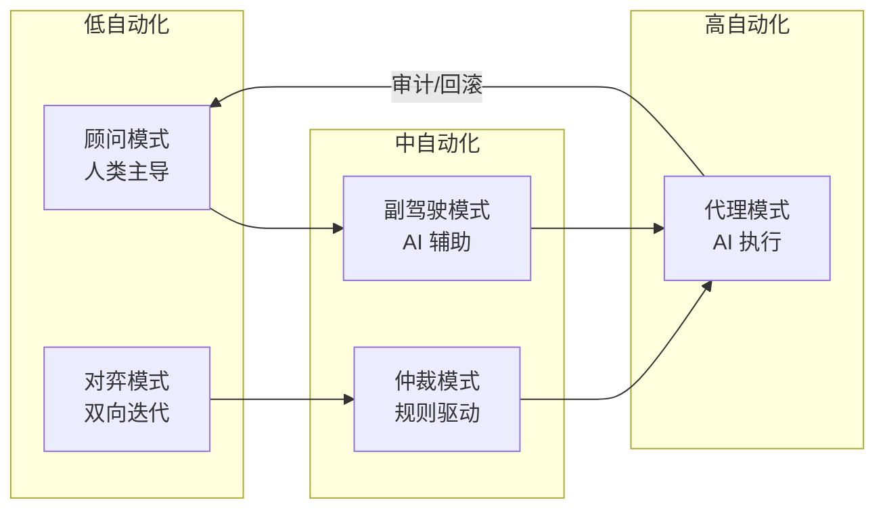
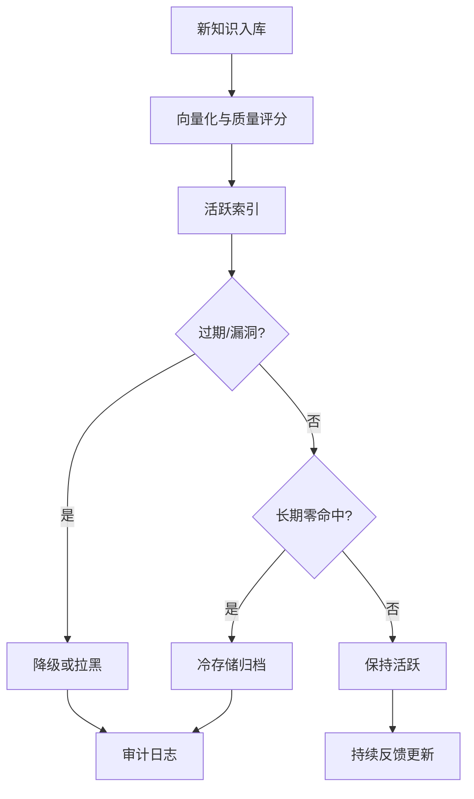

# AI 辅助复用决策的认知增强架构设计

> **版本**: 2026-06-06
> **定位**: 认知架构层——利用 RAG + LLM 降低开发者的外在认知负荷，优化复用决策质量
> **权威来源**:
>
> - Kahneman, D. (2011). *Thinking, Fast and Slow*.
> - Sweller, J. (1988). Cognitive Load Theory.
> - [MCP Specification](https://modelcontextprotocol.io) (Anthropic, 2026)
> - [A2A Protocol](https://a2aprotocol.org) (Google / Linux Foundation)

---

## 目录

- [AI 辅助复用决策的认知增强架构设计](#ai-辅助复用决策的认知增强架构设计)
  - [目录](#目录)
  - [1. 设计目标与约束](#1-设计目标与约束)
    - [1.1 核心目标](#11-核心目标)
    - [1.2 设计约束](#12-设计约束)
  - [2. 系统架构](#2-系统架构)
    - [2.1 与 MCP/A2A 的集成](#21-与-mcpa2a-的集成)
  - [3. RAG 增强流程](#3-rag-增强流程)
    - [3.1 检索流程](#31-检索流程)
    - [3.2 知识库构建](#32-知识库构建)
  - [4. 认知增强机制](#4-认知增强机制)
    - [4.1 针对各决策阶段的增强](#41-针对各决策阶段的增强)
    - [4.2 双系统理论视角](#42-双系统理论视角)
    - [4.3 认知偏差修正](#43-认知偏差修正)
  - [5. 原型实现参考](#5-原型实现参考)
    - [5.1 系统组件](#51-系统组件)
    - [5.2 关键技术选型](#52-关键技术选型)
  - [6. 评估框架](#6-评估框架)
    - [6.1 系统性能指标](#61-系统性能指标)
    - [6.2 认知负荷降低验证](#62-认知负荷降低验证)
  - [7. AI 认知增强的人机协作模式与风险边界](#7-ai-认知增强的人机协作模式与风险边界)
    - [7.1 形式化定义](#71-形式化定义)
    - [7.2 人机协作模式属性表](#72-人机协作模式属性表)
    - [7.3 模式关系说明](#73-模式关系说明)
    - [7.4 正例：顾问 + 对弈模式提升架构决策质量](#74-正例顾问--对弈模式提升架构决策质量)
    - [7.5 反例：代理模式导致“AI 幻觉”级联故障](#75-反例代理模式导致ai-幻觉级联故障)
    - [交叉引用](#交叉引用)
  - [8. RAG 知识库的持续演化与遗忘机制](#8-rag-知识库的持续演化与遗忘机制)
    - [8.1 形式化定义](#81-形式化定义)
    - [8.2 属性表](#82-属性表)
    - [8.3 关系说明](#83-关系说明)
    - [8.4 正例：安全漏洞即时拉黑](#84-正例安全漏洞即时拉黑)
    - [8.5 反例：过期模板导致配置错误](#85-反例过期模板导致配置错误)
    - [交叉引用](#交叉引用-1)
  - [补充说明：AI 辅助复用决策的认知增强架构设计](#补充说明ai-辅助复用决策的认知增强架构设计)
  - [概念定义](#概念定义)
  - [示例](#示例)
  - [分析](#分析)

---

## 1. 设计目标与约束

### 1.1 核心目标

基于认知负荷理论（CLT），AI 辅助复用系统的设计目标是：

```text
优化目标:
  min(CL_extraneous)  —— 降低外在负荷（搜索、理解、适配的摩擦）
  max(CL_germane)     —— 提升相关负荷（促进深度学习和模式识别）
  CL_intrinsic ≈ const —— 不改变内在负荷（任务固有复杂性）
```

### 1.2 设计约束

| 约束 | 说明 | 实现策略 |
|------|------|---------|
| **确定性边界** | AI 推荐必须有可解释性和可信度声明 | 置信度阈值 + 来源引用 |
| **最小惊讶原则** | 推荐结果应符合开发者的心智模型 | 基于用户画像的个性化排序 |
| **渐进式披露** | 不一次性呈现过多信息 | 分层摘要：一句话 → 关键参数 → 完整文档 |
| **人机协同** | AI 辅助而非替代人类决策 | 最终决策权在开发者，AI 提供候选和对比 |
| **反馈闭环** | 系统从用户反馈中持续学习 | 隐式反馈（采纳率）+ 显式反馈（评分） |

---

## 2. 系统架构

```text
AI 辅助复用决策系统架构
├── 感知层 (Perception)
│   ├── 代码上下文解析（当前文件、依赖、项目类型）
│   ├── 开发者行为追踪（搜索历史、浏览路径、停留时长）
│   └── 实时需求推断（光标位置、注释、待办）
│
├── 认知层 (Cognition)
│   ├── 需求向量化（将代码意图编码为嵌入向量）
│   ├── 资产索引（复用资产的语义索引 + 质量评分）
│   ├── 匹配引擎（相似度计算 + 约束满足）
│   └── 排序模型（个性化排序：历史偏好 + 团队规范 + 全局热度）
│
├── 决策层 (Decision)
│   ├── 候选生成（Top-K 复用资产推荐）
│   ├── 对比分析（并排对比：接口、性能、维护状态、安全评分）
│   ├── 适配建议（代码生成：调用示例、参数映射、错误处理）
│   └── 风险评估（供应链安全、许可证冲突、版本兼容性）
│
└── 交互层 (Interaction)
    ├── IDE 内联提示（VS Code / IntelliJ / Cursor 插件）
    ├── 聊天界面（自然语言查询复用资产）
    ├── 可视化对比（Mermaid 图、表格、雷达图）
    └── 反馈收集（👍/👎、详细评论、使用数据回传）
```

### 2.1 与 MCP/A2A 的集成

```text
AI 复用增强系统作为 MCP Client
├── 工具: "search_reusable_asset"
│   └── 输入: 需求描述 + 上下文
│   └── 输出: 候选资产列表 + 匹配分数
│
├── 工具: "compare_assets"
│   └── 输入: 资产 ID 列表
│   └── 输出: 对比矩阵（功能、性能、安全、维护）
│
├── 工具: "generate_integration_code"
│   └── 输入: 资产 ID + 目标代码上下文
│   └── 输出: 适配代码片段 + 测试建议
│
└── 资源: "reuse_knowledge_base"
    └── 团队的复用最佳实践、常见陷阱、成功案例
```

---

## 3. RAG 增强流程

### 3.1 检索流程

```text
RAG Pipeline for Reuse Recommendation

1. 查询理解 (Query Understanding)
   ├── 输入: "我需要处理 CSV 文件并验证列格式"
   ├── 意图识别: 文件解析 + 数据验证
   ├── 实体提取: {格式: CSV, 操作: 解析+验证, 语言: Python}
   └── 查询扩展: 同义词（TSV, 逗号分隔）、相关库（pandas, csvkit, pydantic）

2. 向量检索 (Vector Retrieval)
   ├── 需求嵌入: Embedding("CSV parsing and column validation in Python")
   ├── 相似度搜索: cosine_similarity(query_vec, asset_vec) → Top-100
   └── 初筛: 过滤语言/框架不匹配、安全评分 < 阈值

3. 重排序 (Reranking)
   ├── 特征: 语义相似度 + 下载量 + 维护频率 + 团队使用历史 + 许可证兼容
   ├── 模型: Learning-to-Rank (LTR) 或 Cross-Encoder
   └── 输出: Top-5 候选 + 每候选的推荐理由

4. 生成 (Generation)
   ├── 上下文组装: 候选资产文档 + 接口定义 + 团队使用示例
   ├── LLM 提示: "基于以下资产，为当前代码上下文生成最佳集成方案..."
   └── 输出: 推荐结果 + 代码示例 + 置信度声明
```

### 3.2 知识库构建

| 知识来源 | 处理策略 | 更新频率 |
|---------|---------|---------|
| **开源包索引** | PyPI/npm/Crates 元数据 + README 向量化 | 实时 |
| **内部资产目录** | 内部库 API 文档 + 使用日志 | 每日 |
| **最佳实践文档** | Markdown 分块 + 结构化提取 | 每周 |
| **代码审查记录** | 复用决策的评审意见 | 每次审查 |
| **错误日志** | 集成失败的堆栈追踪 + 解决方案 | 实时 |

---

## 4. 认知增强机制

### 4.1 针对各决策阶段的增强

| 决策阶段 | 认知瓶颈 | AI 增强机制 | 负荷影响 |
|---------|---------|------------|---------|
| **模式识别** | 不知道存在可复用资产 | 代码上下文感知推荐（"您似乎在实现 X，考虑使用 Y"） | ↓ CL_extraneous |
| **信息检索** | 搜索耗时、结果噪音 | 语义搜索 + 个性化排序 + 团队内部优先 | ↓↓ CL_extraneous |
| **理解评估** | 文档阅读量大 | AI 生成一句话摘要 + 关键参数速览 + 交互式示例 | ↓↓ CL_extraneous |
| **适配决策** | AAF 估算困难 | 自动生成适配代码 + 成本估算（"预计节省 2 小时"） | ↓ CL_extraneous |
| **集成验证** | 调试集成错误耗时 | 自动生成测试用例 + 常见错误预警 | ↓ CL_extraneous |

### 4.2 双系统理论视角

根据 Kahneman 的双系统理论：

```text
系统 1（直觉）←──→ 系统 2（理性）
     ↑                    ↑
   AI 增强              AI 增强

系统 1 增强:
  ├── 模式匹配加速: "这个场景 → 推荐资产" 的直觉化
  └── 风险直觉: 通过可视化（颜色、图标）快速传达风险等级

系统 2 增强:
  ├── 信息聚合: 将分散的文档、issue、PR 聚合为结构化对比
  ├── 逻辑验证: 自动检查接口兼容性、类型匹配、依赖冲突
  └── 因果推理: "如果使用资产 A，可能导致的问题 B"
```

### 4.3 认知偏差修正

| 偏差 | 表现 | AI 修正策略 |
|------|------|------------|
| **现状偏差** | 倾向于使用熟悉的旧方案 | 主动推荐新方案 + 迁移成本计算 |
| **过度自信** | 低估重新实现的成本 | 自动生成 COCOMO II 估算对比 |
| **沉没成本** | 已在旧方案投入太多 | 展示切换的 ROI 和止损点 |
| **可得性偏差** | 只想到最近使用的资产 | 扩展搜索范围 + 跨项目推荐 |
| **锚定效应** | 被第一个看到的资产影响 | 多候选并排对比 + 随机排序试点 |
| **从众心理** | 盲目跟随社区热门 | 标注"团队内使用频率" vs "全局下载量" |
| **框架依赖** | 对同一资产的不同描述产生不同决策 | 标准化描述模板 + 客观指标优先 |

---

## 5. 原型实现参考

### 5.1 系统组件

```text
AI Reuse Assistant Prototype
├── Frontend (IDE Plugin / Web)
│   ├── VS Code Extension: inline completions + chat panel
│   └── Web Dashboard: asset analytics + team metrics
│
├── Backend (API Service)
│   ├── /search: 语义检索接口
│   ├── /recommend: 个性化推荐接口
│   ├── /compare: 资产对比接口
│   └── /generate: 代码生成接口
│
├── RAG Pipeline
│   ├── Document Loader: 抓取包管理器 + 内部文档
│   ├── Text Splitter: Markdown/HTML 智能分块
│   ├── Embedding Model: text-embedding-3-large / E5
│   ├── Vector Store: Pinecone / Milvus / pgvector
│   └── Retriever: similarity search + metadata filtering
│
├── LLM Layer
│   ├── Model: GPT-4o / Claude 3.5 Sonnet / Llama 3 70B
│   ├── Prompt Registry: versioned prompts for each task
│   └── Output Parser: structured output (JSON) + validation
│
└── Feedback Loop
    ├── Implicit: click-through rate, adoption rate, time-to-integrate
    └── Explicit: thumbs up/down, free-text feedback, correction
```

### 5.2 关键技术选型

| 组件 | 推荐方案 | 理由 |
|------|---------|------|
| **嵌入模型** | text-embedding-3-large / voyage-code-2 | 代码语义理解强 |
| **向量数据库** | Milvus / pgvector | 支持混合搜索（向量 + 元数据） |
| **LLM** | Claude 3.5 Sonnet / GPT-4o | 长上下文、代码能力强 |
| **编排框架** | LangChain / LlamaIndex | RAG 流水线标准化 |
| **评估框架** | RAGAS / TruLens | 检索质量 + 生成质量评估 |
| **部署** | Docker + Kubernetes | 可扩展、可观测 |

---

## 6. 评估框架

### 6.1 系统性能指标

| 指标 | 目标 | 测量方法 |
|------|------|---------|
| **检索准确率@5** | ≥ 0.80 | 人工标注：Top-5 中相关资产的比例 |
| **代码生成通过率** | ≥ 0.75 | 生成的代码在单元测试中通过的比例 |
| **采纳率** | ≥ 0.60 | 开发者接受 AI 推荐的比例 |
| **时间节省** | ≥ 30% | 对比无 AI 辅助的复用决策时间 |
| **用户满意度** | ≥ 4.0/5.0 | NASA-TLX 适配版 + NPS 调查 |

### 6.2 认知负荷降低验证

```text
A/B Test Design:
├── 对照组: 传统复用流程（手动搜索 + 阅读文档）
├── 实验组: AI 增强复用流程（RAG 推荐 + 代码生成）
├── 样本: 各 30 名开发者，分层（新手/中级/专家）
├── 任务: 3 个标准化复用任务（简单/中等/复杂）
├── 测量:
│   ├── 主观: NASA-TLX 适配版评分
│   ├── 客观: 任务完成时间、错误率、复用质量评分
│   └── 生理: 眼动追踪（实验组子集）
└── 假设: 实验组的 CL_extraneous 显著低于对照组 (p < 0.05)
```

---

> **对齐验证**:
>
> - 认知架构对照 ACT-R (Carnegie Mellon) 和 BDI 模型验证
> - RAG 架构对照 LangChain / LlamaIndex 最佳实践验证
> - MCP 集成对照 MCP 2025-11-25 规范验证
>
## 7. AI 认知增强的人机协作模式与风险边界

### 7.1 形式化定义

**定义**：AI 认知增强架构（AI Cognitive Augmentation Architecture）是面向软件复用场景、以 RAG + LLM 为核心引擎、围绕“感知—认知—决策—交互”四层构建的人机协同系统。其目标不是替代开发者，而是将机器擅长的大规模检索、模式匹配与代码生成，与人类擅长的价值判断、创造性适配和伦理审查相结合，从而在降低外在认知负荷的同时保留并增强相关认知负荷。

人机协作模式（Human-AI Teaming Patterns）则是该架构在交互层面的具体化，它规定了在复用决策各阶段中，人与 AI 的权限边界、反馈方式与责任归属。

### 7.2 人机协作模式属性表

| 模式 | 人类角色 | AI 角色 | 控制级别 | 适用阶段 | 风险 |
|------|---------|--------|---------|---------|------|
| 顾问模式（Oracle）| 提出问题 | 提供候选与证据 | 人类完全控制 | 信息检索、理解评估 | 信息过载、候选偏见 |
| 副驾驶模式（Copilot）| 主导决策 | 实时补全与纠错 | 人类监督 | 适配决策、代码生成 | 过度依赖、技能退化 |
| 仲裁模式（Arbiter）| 设定规则 | 按规则筛选/排序 | 规则驱动 | 风险评估、合规审查 | 规则僵化、例外失控 |
| 代理模式（Agent）| 目标设定 | 自动执行并汇报 | 人类事后审计 | 重复集成、批量迁移 | 幻觉、责任模糊 |
| 对弈模式（Sparring）| 提出假设 | 挑战假设/生成反例 | 双向迭代 | 架构决策、A/B 设计 | 时间成本、对抗疲劳 |

### 7.3 模式关系说明

五种模式构成一个“自动化阶梯（Automation Ladder）”，团队应根据任务风险、不确定性与学习者成长需求动态选择：

1. **新手开发者**应更多使用顾问模式与对弈模式，确保相关负荷不被剥夺。
2. **专家开发者**可使用副驾驶与代理模式，但需保留关键决策的人类 veto。
3. **高风险集成**（金融、医疗）必须采用仲裁模式或人类 veto，AI 仅提供证据链。
4. **低风险重复任务**可适度使用代理模式，但需完整日志与可回滚机制。



### 7.4 正例：顾问 + 对弈模式提升架构决策质量

某保险公司在引入新的微服务复用框架时，让 AI 作为“顾问”检索内部模式库与外部社区案例，再以“对弈模式”生成三种架构方案及各自风险反例。架构委员会在 AI 支持下，决策时间从 3 天缩短到 4 小时，同时保留了关键的安全与合规审查。

### 7.5 反例：代理模式导致“AI 幻觉”级联故障

某运维团队将生产配置迁移完全交给 AI Agent 执行，未设置人类 veto 与回滚点。AI 在 RAG 检索时引用了已废弃的 Helm Chart 版本，导致 200+ 生产 Pod 配置错误，服务中断 47 分钟。事后审计发现，AI 的“置信度”阈值过低，且知识库更新延迟 72 小时。

> **权威来源**:
>
> - [Wikipedia - Cognitive Load](https://en.wikipedia.org/wiki/Cognitive_load)
> - [Wikipedia - Artificial Intelligence](https://en.wikipedia.org/wiki/Artificial_intelligence)
> - [Wikipedia - Human-Computer Interaction](https://en.wikipedia.org/wiki/Human%E2%80%93computer_interaction)
> - [MCP Specification](https://modelcontextprotocol.io)
> - [A2A Protocol](https://a2aprotocol.org)
> - 核查日期：2026-07-07

### 交叉引用

- 与 [认知负荷理论与架构复用](../03-cognitive-load-theory/cognitive-load-theory.md) 关联：人机协作模式的选择直接影响相关负荷与外在负荷的分配。
- 与 [开发者复用决策的认知负荷量化模型](../03-cognitive-load-theory/quantitative-model.md) 配合：可用该模型评估引入 AI 助手前后的 CL_reuse 变化。
- 与 [架构复用 ROI 框架](../../09-value-quantification/02-roi-npv-models/roi-framework.md) 关联：AI 增强系统的投资成本与风险节省应纳入 ROI。

## 8. RAG 知识库的持续演化与遗忘机制

### 8.1 形式化定义

**定义**：RAG 知识库的持续演化与遗忘机制（Continual Evolution & Forgetting Mechanism）确保知识库在新增资产、更新版本、淘汰过时内容时保持时效性与准确性。遗忘机制避免“过期示例”成为噪声源，防止 AI 推荐已废弃或存在安全漏洞的资产。

### 8.2 属性表

| 机制 | 触发条件 | 策略 | 风险 |
|------|---------|------|------|
| 版本生命周期 | 新版本发布 | 保留旧版 2 个 major，标记 deprecated | 旧示例仍被检索 |
| 安全公告 | CVE/漏洞披露 | 立即降级或拉黑 | 召回率下降 |
| 使用频率 | 连续 90 天零命中 | 归档至冷存储 | 长尾需求无法满足 |
| 反馈纠错 | 用户明确标记错误 | 实时更新向量索引 | 误删正确内容 |
| 领域漂移 | 技术栈迁移 | 重训练嵌入模型 | 成本较高 |

### 8.3 关系说明

遗忘与检索构成动态平衡：过度遗忘导致覆盖率下降，遗忘不足导致幻觉与过时推荐。推荐设置“置信度衰减函数”，使旧内容的相关性得分随时间指数下降：

```text
Relevance_score(t) = Base_score × e^(-λ × Δt)
```

其中 Δt 为自上次验证以来的天数，λ 为资产类别衰减系数（安全相关 λ 高，基础工具 λ 低）。



### 8.4 正例：安全漏洞即时拉黑

某开源组件被披露高危 CVE，RAG 系统在 30 分钟内将该组件所有版本的安全评分置 0，并主动推送告警给正在使用的团队，避免 3 起生产安全事故。

### 8.5 反例：过期模板导致配置错误

某平台 Knowledge Base 未及时清理 2 年前的部署模板，AI 代理在夜间批量迁移时引用了旧版 Helm Chart，导致 200+ Pod 异常。事后发现旧模板召回得分仍高于新版，因未实施衰减函数。

> **权威来源**:
>
> - [Wikipedia - Cognitive Load](https://en.wikipedia.org/wiki/Cognitive_load)
> - [Wikipedia - Artificial Intelligence](https://en.wikipedia.org/wiki/Artificial_intelligence)
> - [Wikipedia - Retrieval-Augmented Generation](https://en.wikipedia.org/wiki/Retrieval-augmented_generation)
> - [MCP Specification](https://modelcontextprotocol.io)
> - 核查日期：2026-07-07

### 交叉引用

- 与 [认知负荷理论与架构复用](../03-cognitive-load-theory/cognitive-load-theory.md) 关联：过时示例会陡增外在负荷与集成错误率。
- 与 [开发者复用决策的认知负荷量化模型](../03-cognitive-load-theory/quantitative-model.md) 配合：遗忘机制可降低文档清晰度维度的噪声。
- 与 [架构复用 ROI 框架](../../09-value-quantification/02-roi-npv-models/roi-framework.md) 关联：知识库运维成本应计入 AI 增强系统的 ROI。

> 最后更新: 2026-06-06


---

## 补充说明：AI 辅助复用决策的认知增强架构设计

## 概念定义

**定义**：认知架构（Cognitive Architecture）是对人类或智能体信息处理结构（感知、记忆、决策、学习）的计算模型；在复用工程中，它解释开发者如何选择、理解与适配可复用资产，并指导工具设计以降低认知负荷。

## 示例

**示例**：基于 ACT-R 建模，IDE 在开发者调用不熟悉的复用组件时自动提示参数示例与依赖约束，减少工作记忆负荷并降低集成错误。

## 分析

**分析**：认知架构将“人”重新置于复用中心：再完美的资产，若超出人类工作记忆与决策能力，也难以被有效复用。