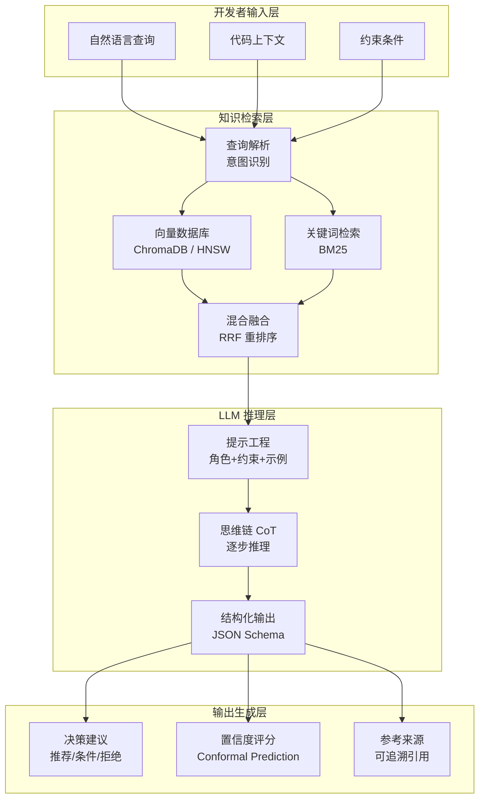

# AI 辅助复用决策系统：原型设计

> **版本**: 2026-06-08
> **定位**: P2-T8 交付物——AI 辅助复用决策系统的最小可行原型（PoC）设计，将 RAG + LLM 作为开发者复用决策的认知增强层
> **对齐**: ISO/IEC 26566:2026（复用成熟度）、ACT-R (CMU)、NASA-TLX、RAG 最佳实践
> **状态**: 草案，待 PoC 验证

---

## 目录

- [AI 辅助复用决策系统：原型设计](#ai-辅助复用决策系统原型设计)
  - [目录](#目录)
  - [1. 系统架构设计](#1-系统架构设计)
    - [1.1 RAG 流水线](#11-rag-流水线)
    - [1.2 知识库构成](#12-知识库构成)
    - [1.3 LLM 角色](#13-llm-角色)
  - [2. 认知增强机制](#2-认知增强机制)
    - [2.1 降低开发者认知负荷（NASA-TLX 适配）](#21-降低开发者认知负荷nasa-tlx-适配)
    - [2.2 信息分层呈现](#22-信息分层呈现)
    - [2.3 交互模式](#23-交互模式)
  - [3. 原型架构图](#3-原型架构图)
  - [4. PoC 设计](#4-poc-设计)
    - [4.1 最小可行原型的技术栈](#41-最小可行原型的技术栈)
    - [4.2 第一阶段范围](#42-第一阶段范围)
    - [4.3 评估指标](#43-评估指标)
  - [5. 与认知架构理论的对接](#5-与认知架构理论的对接)
    - [5.1 ACT-R 模式匹配在系统中的作用](#51-act-r-模式匹配在系统中的作用)
    - [5.2 BDI 模型与 LLM 推理的映射](#52-bdi-模型与-llm-推理的映射)
    - [5.3 专家 vs 新手的差异化信息呈现](#53-专家-vs-新手的差异化信息呈现)
  - [参考](#参考)
  - [补充说明：AI 辅助复用决策系统：原型设计](#补充说明ai-辅助复用决策系统原型设计)
  - [概念定义](#概念定义)
  - [示例](#示例)
  - [反例](#反例)
  - [权威来源](#权威来源)

## 1. 系统架构设计

### 1.1 RAG 流水线

系统将复用决策支持建模为四阶段 RAG 流水线：


| 阶段 | 功能 | 关键技术 |
|------|------|---------|
| **索引** | 将复用资产文档、规范、案例转化为可检索的向量与结构化表示 | Markdown 分块、CodeBERT 嵌入、元数据标签 |
| **检索** | 根据查询语义召回候选知识片段 | HNSW 向量搜索 + BM25 关键词混合检索 |
| **重排序** | 对初筛结果按业务相关性精排 | Cross-Encoder（如 bge-reranker）+ 团队使用历史权重 |
| **生成** | 基于检索上下文生成决策建议 | LLM + Chain-of-Thought 提示工程 + JSON Schema 约束 |

### 1.2 知识库构成

知识库是 RAG 系统的核心资产，由四类知识源构成：

| 知识类型 | 内容示例 | 更新策略 |
|---------|---------|---------|
| **复用资产文档** | 组件 README、API 文档、接口契约、SBOM | 每日同步内部目录 |
| **标准规范** | ISO/IEC 26566 条款、组织架构原则、技术雷达 | 版本化快照 |
| **历史决策案例** | ADR（架构决策记录）、复用评审纪要、成功/失败复盘 | 事件驱动追加 |
| **公理-定理体系** | 复用质量公理、适配成本定理、风险传递引理（见 `07-formal-verification`） | 形式化验证后发布 |

### 1.3 LLM 角色

LLM 不替代人类决策，而是作为**认知卸载代理**承担三类任务：

- **决策建议生成**：基于检索上下文，输出“推荐 / 有条件使用 / 不推荐”的结构化建议
- **权衡分析**：对多个候选组件进行多维度对比（功能、性能、安全、成本），生成雷达图与文字分析
- **风险预警**：自动识别许可证冲突、CVE、版本兼容性陷阱，并引用知识库中的历史失败案例

---

## 2. 认知增强机制

### 2.1 降低开发者认知负荷（NASA-TLX 适配）

本设计直接对接 [`03-cognitive-load-theory/quantitative-model.md`](../../03-cognitive-load-theory/quantitative-model.md) 中的 NASA-TLX 适配版量表，目标是将复用决策的**外在负荷（CL_extraneous）降低 30% 以上**。

| NASA-TLX 维度 | 系统增强策略 | 预期降幅 |
|--------------|-------------|---------|
| 心智需求 | 自动生成一句话摘要与关键参数速览 | −25% |
| 搜索效率 | 语义检索替代关键词试错，Top-5 精准召回 | −40% |
| 文档清晰度 | 结构化输出：摘要→参数→分析→来源 | −30% |
| 挫败感 | 对无匹配场景给出明确自研建议，避免信息困境 | −20% |

系统内置轻量级 NASA-TLX 微问卷（每次决策后 30 秒填写），用于持续校准推荐策略。

### 2.2 信息分层呈现

遵循**渐进式披露（Progressive Disclosure）**原则，将输出组织为四层：

```text
Layer 1: 摘要（1句话）
  └── "推荐使用 auth-jwt-rs256，预计节省 2 小时，风险等级：低"

Layer 2: 关键参数（5-7 个结构化字段）
  └── 功能匹配度、技术质量、经济价值、风险等级、战略契合、置信度、来源

Layer 3: 详细分析（多段落 + 对比表）
  └── 候选对比、适配代码片段、依赖冲突分析、历史案例引用

Layer 4: 原始来源（可追溯链接）
  └── 组件文档、ADR、CVE 数据库、公理-定理证明
```

开发者可按需展开，避免工作记忆超载。

### 2.3 交互模式

系统支持三种人机协同交互模式：

| 模式 | 适用场景 | 交互特征 |
|------|---------|---------|
| **问答式（Q&A）** | 开发者有明确疑问 | 自然语言提问 → 结构化回答，支持追问 |
| **对比式（Compare）** | 多候选难以取舍 | 并排对比矩阵 + 雷达图 + LLM 生成的权衡分析 |
| **向导式（Wizard）** | 新手或复杂决策 | 分步引导：需求澄清 → 候选筛选 → 风险评估 → 集成建议 |

---

## 3. 原型架构图



---

## 4. PoC 设计

### 4.1 最小可行原型的技术栈

| 组件 | 选型 | 理由 |
|------|------|------|
| **后端** | Python 3.11+ | 生态成熟，RAG 库丰富 |
| **编排** | LangChain / LlamaIndex | RAG 流水线标准化，支持自定义检索器 |
| **向量数据库** | ChromaDB | 嵌入式部署、轻量、支持元数据过滤 |
| **嵌入模型** | text-embedding-3-large / BGE | 代码与文档语义理解强 |
| **LLM** | OpenAI API (GPT-4o) / Claude 3.5 Sonnet | 长上下文、结构化输出稳定 |
| **前端** | Streamlit | 快速构建交互式原型，支持对话与可视化 |
| **评估** | RAGAS | 检索准确率与答案相关性自动评估 |

### 4.2 第一阶段范围

PoC 第一阶段**仅覆盖 `04-component-architecture-reuse` 的决策支持**，具体包括：

- 组件目录语义检索（内部库 + 精选开源组件）
- 组件对比与适配建议生成
- 基于历史 ADR 的风险预警

明确排除：业务流程架构复用、跨层治理规则自动执行、形式化验证集成（后续阶段引入）。

### 4.3 评估指标

| 指标 | 基线 | 目标 | 测量方法 |
|------|------|------|---------|
| **决策时间缩短率** | 传统手动搜索+评估 | ≥ 30% | A/B 测试，记录从查询到决策的时间 |
| **复用采纳率提升** | 当前组织复用采纳率 | ≥ 15% | 追踪开发者实际集成推荐组件的比例 |
| **开发者满意度** | N/A | ≥ 4.0/5.0 | NASA-TLX 适配版 + 系统可用性量表 (SUS) |
| **检索准确率@5** | N/A | ≥ 0.80 | 人工标注 Top-5 结果的相关性 |

---

## 5. 与认知架构理论的对接

### 5.1 ACT-R 模式匹配在系统中的作用

ACT-R（Carnegie Mellon）认为专家与新手的核心差异在于**程序性记忆的编译程度**：专家通过大量实践将陈述性知识编译为自动触发的产生式规则（Anderson et al., 2004）。

在本系统中，ACT-R 模式匹配被映射为两层机制：

- **扩散激活（Spreading Activation）**：向量检索的语义相似度计算模拟了人类陈述性记忆的激活扩散。查询向量与资产向量的余弦相似度对应于记忆块的基础激活值（Base-Level Activation）。
- **产生式规则复用**：系统将历史成功复用案例编码为“IF 需求模式 X THEN 推荐资产 Y”的伪规则，通过 RAG 注入 LLM 上下文，加速新手开发者的模式识别过程。

### 5.2 BDI 模型与 LLM 推理的映射

BDI（Belief-Desire-Intention）模型为 LLM 的推理过程提供了可解释的认知框架（Rao & Georgeff, 1995）：

| BDI 元素 | 系统映射 | LLM 推理环节 |
|---------|---------|-------------|
| **Belief（信念）** | RAG 检索到的知识片段（资产文档、案例、规范） | 上下文注入，约束幻觉 |
| **Desire（愿望）** | 开发者的功能需求 + NFR 约束（性能、安全、合规） | 查询理解与意图识别 |
| **Intention（意图）** | LLM 生成的推荐行动 + 人类确认后的执行承诺 | 结构化输出：推荐 + 理由 + 适配方案 |

LLM 的 CoT 推理可视为 BDI 的**实用推理（Practical Reasoning）**过程：基于当前信念更新候选集合，过滤生成意图集合，最终输出行动计划。

### 5.3 专家 vs 新手的差异化信息呈现

依据 ACT-R 的新手-专家模型，系统采用自适应信息呈现策略：

| 维度 | 新手开发者 | 专家开发者 |
|------|-----------|-----------|
| **默认展开层级** | Layer 1→2（摘要+关键参数） | Layer 1（仅摘要），可快捷深入 Layer 4 |
| **交互模式默认** | 向导式（Wizard） | 问答式（Q&A） |
| **解释深度** | 详细：包含概念解释、代码示例、常见错误 | 精简：仅参数、对比、来源链接 |
| **推荐策略** | 优先推荐内部成熟组件，降低不确定性 | 允许探索前沿/实验性组件，提供风险声明 |
| **认知负荷预算** | 严格约束：NASA-TLX 总分 ≤ 50 | 宽松约束：NASA-TLX 总分 ≤ 70 |

---

## 参考

- Anderson, J.R. et al. (2004). "An Integrated Theory of the Mind". *Psychological Review*. [ACT-R @ CMU](https://act-r.psy.cmu.edu)
- Hart, S.G. & Staveland, L.E. (1988). "Development of NASA-TLX (Task Load Index)". *Advances in Psychology*.
- Lewis, P. et al. (2020). "Retrieval-Augmented Generation for Knowledge-Intensive NLP Tasks". *NeurIPS*.
- Rao, A.S. & Georgeff, M.P. (1995). "BDI Agents: From Theory to Practice". *ICMAS*.
- Sweller, J. (1988). Cognitive Load Theory. *Learning and Instruction*.
- 交叉引用: [`08/03-cognitive-load-theory/quantitative-model.md`](../../03-cognitive-load-theory/quantitative-model.md)

---

*最后更新: 2026-06-08 · P2-T8 认知增强原型设计*


---

## 补充说明：AI 辅助复用决策系统：原型设计

## 概念定义

**定义**：认知架构（Cognitive Architecture）是对人类或智能体信息处理结构（感知、记忆、决策、学习）的计算模型；在复用工程中，它解释开发者如何选择、理解与适配可复用资产，并指导工具设计以降低认知负荷。

## 示例

**示例**：基于 ACT-R 建模，IDE 在开发者调用不熟悉的复用组件时自动提示参数示例与依赖约束，减少工作记忆负荷并降低集成错误。

## 反例

**反例**：某公司强制所有团队使用统一的 200 页架构手册而不提供可搜索的示例与决策树，开发者因认知超载而回到复制-粘贴。

## 权威来源

> **权威来源**:
>
> - [ACT-R](https://act-r.psy.cmu.edu)
> - [BDI Agent Architecture](https://www.cs.ox.ac.uk/people/michael.georgeff/)
> - [Cognitive Load Theory](https://www.sciencedirect.com/topics/psychology/cognitive-load-theory)
> - 核查日期：2026-07-07
